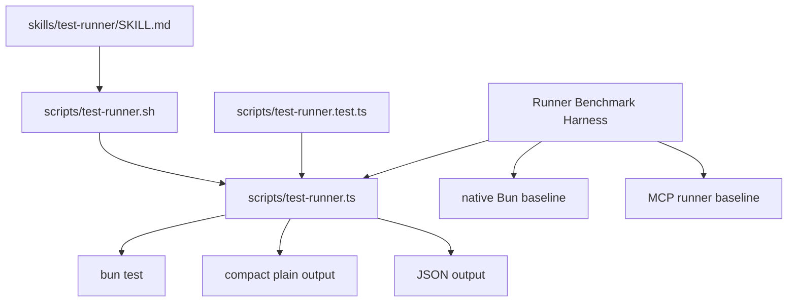

# feat(test-runner): add skill-local compact Bun runner

## Summary

Add a local `test-runner` skill that routes agents to a script-owned Bun test runner with compact plain and JSON output. Prove the runner against native Bun and existing MCP runner baselines before deprecating current MCP runner guidance.

---

## Problem Frame

Raw Bun test output is too noisy for repeated agent loops, especially on failures. MCP runners already provide compact summaries and remain the current preferred path during proof, but the desired direction is to replace that guidance if a skill-local script can deliver the compact envelope with less machinery while keeping `SKILL.md` thin.

---

## Requirements

**Runner scope**

- R1. Implement Bun test execution only.
- R2. Keep lint and typecheck on existing MCP runner guidance.
- R3. Keep the runner local to `skills/test-runner` in this issue.
- R3a. Record lint and typecheck as follow-up migration proofs using the same benchmark-backed pattern.

**Output and behavior**

- R4. Emit compact plain output for agent consumption.
- R5. Emit JSON output for tests, benchmarks, and future automation.
- R6. Keep pass output tiny and trustable.
- R7. Keep failure output bounded while preserving repair-useful context.
- R8. Preserve Bun pass/fail exit semantics.
- R9. Return actionable diagnostics for invalid cwd, missing Bun, timeout, and invocation errors.
- R10. Support pass-through Bun args without copying the Bun flag contract into skill prose.
- R10a. Pass Bun args only after an explicit `--` separator.

**Benchmark and adoption**

- R11. Create a Runner Benchmark Harness that compares native Bun, existing MCP runner when available, and the local runner.
- R11a. Consume an agent-generated MCP baseline JSON artifact when present.
- R12. Keep the Runner Benchmark Harness reusable for later A/B tests over token-optimization variants.
- R13. Measure token estimate, wall time, exit correctness, and failure fidelity.
- R13a. Label token estimates as estimates and name the estimate method.
- R13b. Emit a compact evidence table plus parseable JSON details.
- R14. Score variants on both token reduction and repair fidelity.
- R14a. Score failure fidelity with a deterministic checklist for failing file, failing test, assertion signal, and bounded diagnostics.
- R15. Gate variant acceptance on exit correctness before token or fidelity scoring matters.
- R16. Compare native Bun flags, envelope formats, and failure-context budgets without rewriting the harness.
- R17. Treat unavailable MCP runner comparison as skipped, not failed.
- R18. Leave `context/bun-runner.md` and `rules/code-quality.md` preference unchanged unless benchmark gates justify MCP deprecation.
- R18a. If gates pass and the evidence bundle is reviewed, guidance can be updated in this issue.
- R18b. Exact adoption gates are recorded from first benchmark evidence before guidance deprecation.
- R18c. MCP skipped allows local runner proof but blocks MCP guidance deprecation unless the evidence bundle records an explicit maintainer waiver.
- R18d. MCP guidance deprecation requires a fixed-gate acceptance run after the calibration run records exact gates.
- R18e. The initial harness unit is scaffold-only and does not claim local-runner acceptance before the runner exists.

**Skill shape**

- R19. Keep `SKILL.md` thin and route-oriented.
- R19a. Keep initial `SKILL.md` proof-only until U5 passes and guidance is updated.
- R20. Put deterministic flags, output modes, parser behavior, timeout semantics, and exit codes in script help, script code, and tests.
- R21. Name owners for skill prose, script contract, help, parser, runtime behavior, tests, and Runner Benchmark Harness.
- R22. Validate frontmatter, help, parser acceptance, runtime semantics, and benchmark output.
- R23. Use the facade-backed CLI lane to support structured recovery diagnostics.
- R24. Ask before adding a facade runtime dependency if one is not already available.
- R24a. Start U2 by resolving `@side-quest/cli-command-facade` from `skills/test-runner/scripts`; if missing, stop and ask before editing `package.json`.
- R25. Name contract, result model, parser or engine, help or discovery, CLI, tests, and benchmark owners before implementation.
- R26. Keep generated evidence bundles under a skill-local output path unless a selected report is deliberately promoted.
- R27. Do not add a skill reference doc in v1 unless skill prose bloat creates a real need.

---

## Key Technical Decisions

- **Durable benchmark harness:** Build the Runner Benchmark Harness early so the local runner has evidence before any preference changes and later token optimizations have a stable A/B surface.
- **Two-axis variant score:** Rank variants by token reduction and repair fidelity together. Exit correctness is a gate, not a scoring axis.
- **Script-owned contract:** Treat the runner as a CLI/runtime surface. Let script help and tests own exact flags, output shapes, parser behavior, and exit semantics.
- **Plain default, JSON contract:** Use compact plain text for the agent loop and JSON for deterministic assertions and benchmark inspection.
- **Bun test only:** Keep v1 focused on test output. Defer lint/typecheck until test compaction proves enough value.
- **Lint/typecheck migration follows proof:** After the test runner proof, use the same benchmark-backed approach to evaluate lint and typecheck local replacements. The target is no MCP tools for routine quality runners once each replacement proves itself.
- **MCP remains baseline during proof:** Use MCP runners as the incumbent comparison path, not as a dependency of the new runner. If gates pass, use the local runner as the MCP deprecation path.
- **MCP baseline waiver gate:** Treat MCP skipped as acceptable for local proof, but insufficient for MCP guidance deprecation unless the evidence bundle records a maintainer waiver.
- **Agent-generated MCP baseline artifact:** Capture incumbent MCP baseline data through a tool-capable agent writing JSON into the benchmark evidence input path.
- **Two-run adoption gate:** Use the first benchmark run to calibrate candidate exact gates. Rerun against fixed gates before MCP guidance deprecation.
- **Facade-backed recovery contract:** Use the facade-backed CLI lane because invalid cwd, missing Bun, timeout, and invocation errors need structured cause, retry-safety, and next-action diagnostics.
- **Facade dependency preflight:** Start U2 by resolving `@side-quest/cli-command-facade` from the skill scripts package. If missing, stop and ask before adding or changing dependencies.
- **Dedicated command contract owner:** Use `scripts/command-contract.ts` as the local source for facade-backed command metadata, discovery, result vocabulary, and diagnostic categories.
- **Stable wrapper entrypoint:** Use `scripts/test-runner.sh` as the command agents call and `scripts/test-runner.ts` as the logic owner.
- **Wrapper-owned missing-Bun path:** `test-runner.sh` checks for Bun before invoking TypeScript and emits the minimal missing-Bun diagnostic in plain and JSON modes.
- **Explicit Bun arg separator:** Parse runner args before `--` and pass Bun args only after `--`.
- **Deterministic scoring:** Use a required-signal checklist for failure fidelity and a stable local heuristic for token estimates.
- **Transient raw logs with correlation:** Keep raw logs transient by default, expose optional debug artifacts when needed, and connect diagnostics with a run correlation ID.
- **Harness-first sequencing:** Build fixtures and benchmark harness scaffolding before full runner adoption so evidence drives deprecation without making U1 depend on U2.
- **No reference doc in v1:** Keep `SKILL.md` route-oriented and use runner help/tests for deterministic detail.
- **Proof-only skill before adoption:** Initial `SKILL.md` routes benchmark and development proof work only. Normal test runs keep current MCP guidance until U5 passes.
- **No publication path:** Keep package extraction out of this issue. Record extraction pressure only if the local proof succeeds.

---

## High-Level Technical Design

---

## Scope Boundaries

**In Scope**

- Add `skills/test-runner/SKILL.md`.
- Add a skill-local runner script and shell entrypoint.
- Add runner tests and benchmark fixtures.
- Add a Runner Benchmark Harness comparing native Bun, MCP when available, local runner, and later token-optimization variants.
- Add validation for help, frontmatter, parser behavior, runtime behavior, and benchmark output.

**Out of Scope**

- New MCP server.
- Published package.
- Lint or typecheck runner coverage.
- Immediate replacement of `context/bun-runner.md` or `rules/code-quality.md`.
- Browser-use or create-cli changes.
- Skill reference docs unless implementation proves `SKILL.md` would otherwise bloat.

---

## Implementation Units

### U1. Benchmark Harness And Fixtures

- **Goal:** Establish pass and failure fixtures plus reusable Runner Benchmark Harness scaffolding before adopting the local runner.
- **Requirements:** R11-R18, R22
- **Files:**
  - `skills/test-runner/scripts/test-runner.benchmark.ts`
  - `skills/test-runner/scripts/fixtures/pass.test.ts`
  - `skills/test-runner/scripts/fixtures/fail.test.ts`
  - `skills/test-runner/scripts/fixtures/multi-fail.test.ts`
  - `skills/test-runner/scripts/fixtures/timeout.test.ts`
  - `skills/test-runner/scripts/package.json`
- **Approach:** Build fixture and harness scaffolding that can run native Bun, consume an agent-generated MCP baseline artifact when present, mark MCP skipped when absent, render compact evidence table plus JSON details, and record calibration inputs. Keep the comparison strategy pluggable enough for later local runner, native Bun flag variants, envelope formats, and failure-context budgets. Do not require local-runner comparison or fixed-gate acceptance in U1. Write generated evidence bundles under a skill-local output path unless deprecation review deliberately promotes one.
- **Owners:** Benchmark owner: `skills/test-runner/scripts/test-runner.benchmark.ts`; fixtures owner: `skills/test-runner/scripts/fixtures`; generated evidence owner: benchmark output path.
- **Patterns to Follow:** `context/skill-design-philosophy.md`; `context/bun-runner.md`; issue #172 benchmark requirements.
- **Test Scenarios:**
  - Covers R11/R11a/R13. Passing and failing fixtures produce comparison rows for native Bun and MCP artifact when present.
  - Covers R13b. Benchmark output includes a compact evidence table plus parseable JSON details.
  - Covers R12/R16. A second token-optimization variant can run against the same fixtures without changing fixture shape.
  - Covers R18b. The first benchmark run records candidate exact gates instead of relying on invented planning thresholds.
  - Covers R18d. Calibration output is distinct from fixed-gate acceptance output.
  - Covers R14/R15. Harness scaffolding can represent a tiny failure envelope with poor repair context losing despite strong token reduction, and wrong exit semantics failing the gate.
  - Covers R13a/R14a. Token estimates are labeled estimates, and fidelity scoring reports required repair signals.
  - Covers R17. Missing MCP artifact is marked skipped without failing local proof.
  - Covers R18. Benchmark output does not edit current runner preference.
  - Covers R18c. MCP skipped status is visible and cannot satisfy deprecation eligibility without a maintainer waiver.
- **Verification:** Run the scaffold benchmark against fixtures; inspect output for native token estimate, wall time, MCP artifact/skipped status, calibration fields, fixture labels, and JSON details.

### U2. Runner Core And Output Contract

- **Goal:** Implement the Bun runner core with compact plain and JSON outputs.
- **Requirements:** R1, R4-R10, R20-R24
- **Files:**
  - `skills/test-runner/scripts/command-contract.ts`
  - `skills/test-runner/scripts/test-runner.ts`
  - `skills/test-runner/scripts/test-runner.test.ts`
  - `skills/test-runner/scripts/package.json`
- **Approach:** Start by resolving `@side-quest/cli-command-facade` from `skills/test-runner/scripts`; if missing, stop and ask before editing `package.json`. Then execute Bun tests as a child process, capture output, classify pass/fail/invocation errors, and render compact plain or JSON from one result model. Use facade-backed support for structured recovery diagnostics. Include run correlation in JSON and diagnostics. Keep raw Bun output transient by default, with optional debug artifacts when needed. Keep exact output shape in tests and help, not in `SKILL.md`.
- **Owners:** Contract and discovery owner: `skills/test-runner/scripts/command-contract.ts`; result model owner: `skills/test-runner/scripts/test-runner.ts`; parser or engine owner: runner core inside `skills/test-runner/scripts/test-runner.ts` unless implementation extracts a module; CLI owner: `skills/test-runner/scripts/test-runner.ts`; tests owner: `skills/test-runner/scripts/test-runner.test.ts`.
- **Patterns to Follow:** `skills/create-cli/references/agent-native-cli-design.md`; `skills/create-cli/references/cli-command-facade.md`; `skills/create-cli/references/cli-guidelines.md`; existing Bun script packages under `skills/browser-use/scripts` and `skills/people-enrich/scripts`.
- **Test Scenarios:**
  - Covers R4/R6/R8. Passing fixture emits tiny plain output and exits `0`.
  - Covers R5. JSON mode parses for pass and failure fixtures.
  - Covers R7/R8. Multiple failures emit bounded repair context and exit non-zero.
  - Covers R9. Invalid cwd, missing Bun, timeout, and invocation errors return actionable diagnostics.
  - Covers R9. Diagnostics include run correlation and same-input retry safety.
  - Covers R10/R10a. Args after `--` reach Bun without duplicating Bun's flag contract in skill prose, and unknown runner-side args fail clearly.
  - Covers R23. Structured diagnostics include cause, retry safety, and next action.
  - Covers R24/R24a. Facade runtime availability is checked before implementation, and missing runtime stops before dependency edits.
  - Covers R25. Help, parser acceptance, and runtime results align with `command-contract.ts`.
- **Verification:** Record facade runtime resolution result; run the focused runner tests through the available Bun runner path; inspect JSON assertions and compact plain snapshots or structural checks.

### U3. Shell Entrypoint And Help Surface

- **Goal:** Add a small executable entrypoint and discoverable help for agents and humans.
- **Requirements:** R4-R10, R20-R24
- **Files:**
  - `skills/test-runner/scripts/test-runner.sh`
  - `skills/test-runner/scripts/test-runner.ts`
  - `skills/test-runner/scripts/test-runner.test.ts`
- **Approach:** Use the shell entrypoint as the stable command agents can run from the skill. Check `command -v bun` before invoking TypeScript. Emit a minimal missing-Bun diagnostic in plain and JSON modes from the wrapper. Keep help concise, route exact flags to the script, and keep diagnostics on stderr where appropriate.
- **Owners:** Shell entrypoint owner: `skills/test-runner/scripts/test-runner.sh`; help or discovery owner: `skills/test-runner/scripts/command-contract.ts` plus `skills/test-runner/scripts/test-runner.ts`; parser acceptance owner: `skills/test-runner/scripts/test-runner.test.ts`.
- **Patterns to Follow:** `skills/create-cli/SKILL.md`; `skills/create-cli/references/cli-command-facade.md`; `skills/create-cli/references/cli-guidelines.md`.
- **Test Scenarios:**
  - Covers R20/R22. Help renders accepted modes and usage without requiring `SKILL.md` to copy the contract.
  - Covers R9. Invalid usage exits non-zero with recovery guidance.
  - Covers R9. Missing Bun emits wrapper-owned plain and JSON diagnostics before TypeScript starts.
  - Covers R10/R10a. Bun args pass through after `--`; unknown runner-side args are rejected.
- **Verification:** Run help rendering, parser acceptance checks, invalid usage checks, missing-Bun wrapper checks, and pass-through arg checks.

### U4. Proof-Only Thin Test-Runner Skill

- **Goal:** Add proof-only skill prose that routes benchmark and development proof work to the local runner without changing normal test-run guidance.
- **Requirements:** R19-R22
- **Files:**
  - `skills/test-runner/SKILL.md`
  - `skills/test-runner/PROVENANCE.md`
- **Approach:** Write a terse proof-only skill with quoted `description`, owner paths, command pointer, safety notes, and the next safe action. State that normal test runs still use current MCP guidance until U5 passes and guidance is updated. Name script/help/tests as owners for exact behavior.
- **Owners:** Skill prose owner: `skills/test-runner/SKILL.md`; deterministic contract owners: `skills/test-runner/scripts/command-contract.ts`, `skills/test-runner/scripts/test-runner.ts`, `skills/test-runner/scripts/test-runner.sh`, and `skills/test-runner/scripts/test-runner.test.ts`. No reference doc in v1 unless implementation proves prose bloat.
- **Patterns to Follow:** `context/skill-design-philosophy.md`; `skills/summarize/SKILL.md`; `skills/create-cli/SKILL.md`; repo work style.
- **Test Scenarios:**
  - Covers R19/R19a. The skill tells agents when to use the runner for proof work and keeps normal test runs on current MCP guidance until U5.
  - Covers R20. The skill does not copy output schemas, flags, parser states, or exit tables.
  - Covers R21. Owner paths are named for skill prose, script contract, help, parser, runtime behavior, tests, and Runner Benchmark Harness.
- **Verification:** YAML-parse frontmatter; inspect `SKILL.md` for copied contracts and premature default-runner wording; run `scripts/agent-instructions.sh check` if startup surfaces are changed.

### U5. Adoption Gate And MCP Deprecation Review

- **Goal:** Decide whether benchmark results justify deprecating current MCP runner guidance, and record the result without overreaching.
- **Requirements:** R11-R18, R22
- **Files:**
  - `skills/test-runner/scripts/test-runner.benchmark.ts`
  - `skills/test-runner/SKILL.md`
  - `context/bun-runner.md`
  - `rules/code-quality.md`
- **Approach:** Run the Runner Benchmark Harness after the local runner works. First use the benchmark to record candidate exact gates. Then rerun against those fixed gates. If the fixed-gate run passes, review the benchmark evidence bundle plus proposed guidance diff, then update runner guidance and `SKILL.md` routing in a narrow same-issue follow-up to retire MCP as the preferred Bun test path only when the evidence bundle includes an incumbent MCP artifact for the same fixtures or an explicit maintainer waiver. If gates do not pass, leave guidance unchanged and keep the harness available for future token-optimization A/B tests.
- **Owners:** Guidance owners: `context/bun-runner.md`, `rules/code-quality.md`; evidence owner: Runner Benchmark Harness; review owner: maintainer decision.
- **Patterns to Follow:** `context/bun-runner.md`; `rules/code-quality.md`; `docs/git/workflows.md`.
- **Test Scenarios:**
  - Covers R11/R13. Benchmark includes token, runtime, exit, and failure-fidelity evidence.
  - Covers R11/R14/R15. Full comparison includes native, MCP artifact or waiver, and local runner rows with two-axis scoring and exit-correctness gates.
  - Covers R12/R16. Follow-up optimization variants can reuse the same fixtures and output comparison shape.
  - Covers R14/R15. Adoption decisions use the two-axis score after exit correctness passes.
  - Covers R18/R18a. MCP guidance changes in this issue only when benchmark gates pass and the evidence bundle is reviewed.
  - Covers R18c. MCP skipped blocks deprecation unless the evidence bundle records a maintainer waiver.
  - Covers R18d. The fixed-gate acceptance run, not the calibration run, approves deprecation eligibility.
  - Covers R19a. `SKILL.md` changes from proof-only route to preferred route only after adoption gates pass.
  - Covers R3a. Lint and typecheck are left as named follow-up migration proofs, not v1 implementation.
  - Covers R22. Validation commands prove help, parser acceptance, runtime semantics, and benchmark output.
- **Verification:** Run benchmark; inspect guidance diff if edited; confirm no unrelated runner guidance changes; record at least one follow-up variant example the harness can support.

---

## Risks & Dependencies

- **Parser fragility:** Bun output may change. Mitigate with structural tests and failure fixtures.
- **False compaction win:** A tiny failure envelope can omit repair context. Mitigate with failure-fidelity checks, not token count alone.
- **Preference drift:** Agents may start using the local runner before the benchmark proves value. Mitigate by keeping current MCP guidance unchanged until gates pass.
- **Skill bloat:** The new skill can grow into a CLI manual. Mitigate by pointing to script help and tests for deterministic behavior.
- **MCP benchmark availability:** MCP tools may not be callable from every harness. Mitigate by marking that comparison skipped and preserving other gates.
- **Harness sprawl:** A reusable harness can become a mini framework. Mitigate by limiting v1 to stable fixtures, named variants, and compact comparison output.

---

## Sources / Research

- Origin: `docs/brainstorms/2026-06-04-test-runner-compact-runner-requirements.md`
- Issue: `https://github.com/nathanvale/claude-code-config/issues/172`
- Ideation: `docs/ideation/2026-06-04-test-runner-compact-runner-ideation.md`
- Skill philosophy: `context/skill-design-philosophy.md`
- Current runner guidance: `context/bun-runner.md`
- Claude enforcement rule: `rules/code-quality.md`
- Create CLI skill: `skills/create-cli/SKILL.md`
- Agent-native CLI reference: `skills/create-cli/references/agent-native-cli-design.md`
- Facade-backed CLI reference: `skills/create-cli/references/cli-command-facade.md`
- CLI guidelines reference: `skills/create-cli/references/cli-guidelines.md`
- Prior create-cli plan: `docs/plans/2026-06-04-002-docs-create-cli-product-shape-rewrite-plan.md`
- Bun docs: `/oven-sh/bun` via Context7
