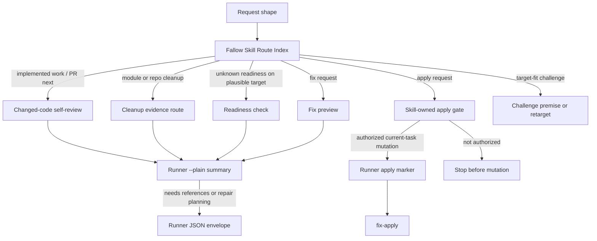

# feat: Add Fallow Skill Route Index

## Summary

Redesign the Fallow skill front door around a request-shaped Skill Route Index,
using progressive disclosure so PR self-review is the first route and mutation
safety is visible before any apply route. Add a runner-owned `--plain` summary
projection so routine skill-driver judgment starts from compact evidence while
JSON remains the structured inspection path.

---

## Problem Frame

The existing Fallow MVP is a solid Runner Facade: command contracts, help,
normalized JSON envelopes, repair hints, output budgets, and safety tests live
in code and tests. Its skill entry is still flat. A fresh skill driver has to
read owner paths and workflow prose before it can answer the common request:
"I just built this; check the diff before PR."

This plan turns that front door into a small Skill Route Index and adds the
missing summary projection the previous MVP deferred until usage proved the
need. The origin document supplies that usage signal (see origin:
`docs/brainstorms/2026-06-04-fallow-progressive-disclosure-index-requirements.md`).

---

## Requirements

**Skill Route Index routing**

- R1. `skills/fallow/SKILL.md` starts with a request-shaped Skill Route Index
  before owner paths.
- R2. The index puts implemented-work / PR self-review first and routes clear
  PR-prep asks toward changed-code audit without making the user choose a menu
  item.
- R3. Secondary routes cover changed-code review, cleanup/refactor scan,
  readiness check, fix preview, apply gate, and target-fit challenge.
- R4. The index names request shapes before command families and points to
  owner help or references for exact command syntax.
- R5. `doctor` remains the readiness route when setup, target fit, git
  readiness, JSON capability, or config scope is unknown.
- R6. Unsupported or mismatched targets route to premise challenge or explicit
  retargeting instead of empty evidence.
- R6a. Suspect target fit is challenged or retargeted before evidence; `doctor`
  runs only after a plausible JS/TS target exists.

**PR self-review behavior**

- R7. Implemented-work / PR-prep routing reads `--plain` summary output before
  raw findings.
- R8. Routing escalates from `--plain` to JSON only for issue references,
  repair planning, structured evidence, or before/after comparison.
- R9. Self-review reporting keeps pre-existing findings separate from
  current-task work unless the user explicitly asks for cleanup.
- R9a. Self-review reports current-task findings first, then pre-existing
  finding count or status separately without listing every prior issue by
  default. Baseline terminology remains deferred until Fallow owns baseline
  semantics.
- R10. Self-review reruns the same evidence command after changes and reports
  before/after evidence when a rerun exists.
- R10a. PR self-review starts with changed-code `audit --plain` when target fit
  is not already suspect; `doctor` runs after blocked evidence or when
  readiness is unknown.

**Cleanup and refactor routing**

- R11. Module or repo cleanup asks route to cleanup evidence rather than PR-only
  audit by default.
- R12. Cleanup routing chooses dead-code, duplication, or health evidence from
  request shape.
- R12a. Bare cleanup asks start with health summary evidence; shaped cleanup
  asks start with one matching lane instead of all cleanup evidence.
- R13. Cleanup reporting may suggest broader architecture or review workflows
  when evidence exceeds Fallow's code-quality lane, but does not auto-invoke
  those workflows.

**Mutation safety**

- R14. Fix requests route to `fix-preview` before source mutation.
- R15. `fix-apply` remains blocked at the skill layer unless explicit
  current-task source-mutation authorization exists.
- R16. `fix-apply` also requires a runner-owned non-interactive authorization
  marker so a bare mutating command fails closed.
- R17. The apply route points to `skills/fallow/references/safety.md` as the
  owner for apply policy, config-scope review, and excluded behavior.
- R18. Auto-fixable findings, preview output, or a general desire to improve
  code never imply apply permission.
- R19. Interactive runtime confirmation is evaluated during planning and
  documented as a deliberate non-goal for this pass.

**Summary projection**

- R20. The runner exposes `--plain` as a compact summary projection for
  routine summary judgment.
- R21. Plain output projects readiness, command outcome, finding counts,
  issue status, and next safe action when available.
- R22. Plain output avoids raw issue dumps.
- R23. JSON output remains available and unchanged for structured inspection
  and existing automation.
- R24. Diagnostics stay separate from primary output.
- R25. Existing output budget controls continue to work for large findings.
- R26. Exact plain rendering stays runner-owned in code, help, and tests, not
  copied into skill prose.

**Skill philosophy fit**

- R27. `SKILL.md` routes and points to owners instead of copying flags, schemas,
  output envelopes, parser rules, repair action ids, or raw Fallow output
  shapes.
- R28. Workflow depth stays in `skills/fallow/references/workflows.md`.
- R29. Command recipes stay in `skills/fallow/references/commands.md`.
- R30. Safety policy stays in `skills/fallow/references/safety.md`.
- R31. `references/workflows.md` may include tiny request-shaped examples, but
  examples name routes and owners rather than full command tutorials.
- R32. Shared skill-entry guidance remains deferred until Fallow proves the
  pattern.
- R33. Fallow records enough rationale to decide later whether the pattern
  belongs in `context/skill-design-philosophy.md` or a companion source.

---

## Key Technical Decisions

- KTD1. **Extend the existing Runner Facade instead of adding a workflow
  engine:** The current Fallow shape already has contract, parser, runtime, and
  test owners. This work should add an output projection and route prose; it
  should not move workflow orchestration into the runner.
- KTD2. **Keep JSON as the automation contract and add `--plain` as a
  projection:** Existing users and tests rely on JSON envelopes. Plain output
  should summarize the same normalized run facts for fast judgment, while JSON
  remains the source for structured evidence, issue references, and repair
  planning.
- KTD3. **Make plain rendering runner-owned and terse:** Exact line shape,
  vocabulary, and budget behavior belong in `fallow-runner.ts`,
  `command-contract.ts`, help output, and tests. Skill prose should say when to
  use `--plain`, not specify the rendering contract.
- KTD3a. **Prove plain output with hybrid stability:** Keep one tiny golden
  happy-path plain output fixture for recognizable shape. Use semantic
  assertions for blocked runs, findings, budgets, and safety so copy edits do
  not turn plain text into a second JSON schema.
- KTD4. **Add a non-interactive apply marker while preserving skill-owned
  authorization:** Bare `fix-apply` should fail closed at runtime, while
  `SKILL.md` / `references/safety.md` decide when a skill driver may use the
  marker. Interactive confirmation would add prompt semantics to a currently
  non-interactive runner, so this plan records that as deferred.
- KTD5. **Use request-shaped routing, not a command menu:** The first screen
  should let a driver map "check my diff before PR" or "look for cleanup" to
  the next safe route. Numbered secondary routes stay as a scan aid, not as a
  required user interaction.
- KTD5a. **Keep `doctor` off the routine PR hot path:** Evidence commands
  already perform runner readiness checks. PR self-review should start with
  `audit --plain` unless target fit is unknown, then use `doctor` when evidence
  blocks or readiness needs inspection.
- KTD5a1. **Challenge suspect targets before readiness checks:** `doctor` is a
  readiness route for plausible JS/TS targets, not proof that an irrelevant root
  is worth reviewing. When target fit is suspect, retarget or challenge the
  premise before treating readiness output as useful.
- KTD5b. **Separate pre-existing findings from current-task work:** PR
  self-review should keep the report centered on current changes. Baseline
  terminology remains deferred until Fallow owns baseline semantics; until
  then, pre-existing findings remain visible as count or status context and
  move into cleanup only when the user asks for that scope.
- KTD6. **Keep broader cleanup workflows opt-in:** Fallow evidence can reveal
  architecture pressure, but Fallow should not dispatch architecture or review
  skills. It reports evidence and suggests the broader route only when the
  user's ask exceeds code-quality scanning.
- KTD6a. **Choose one cleanup lane first:** Request-shaped cleanup starts with
  one matching evidence command. Bare cleanup starts with health summary
  evidence. A full cleanup sweep requires broad user scope, not inference.

---

## High-Level Technical Design

The diagram is the route shape the plan preserves. Runner code, help, and tests
own the exact command and output contracts.

---

## Implementation Units

### U1. Add Runner Output Mode Contract And Parser Support

**Goal:** Teach the public Fallow runner surface that `--plain` is a supported
output mode without changing JSON defaults, and add the non-interactive
authorization marker required by `fix-apply`.

**Requirements:** R7, R16, R20, R23, R24, R25, R26

**Dependencies:** none

**Files:**

- Modify: `skills/fallow/scripts/command-contract.ts`
- Modify: `skills/fallow/scripts/fallow-runner.ts`
- Test: `skills/fallow/scripts/fallow-runner.test.ts`

**Approach:** Add subcommand-local `--plain`, JSON/plain output-mode metadata,
and the `fix-apply` authorization marker to the existing contract owner. Parse
output mode alongside existing subcommand flags; do not add a global output
mode in this pass. Preserve JSON as the default for all subcommands so existing
automation continues to receive the current envelope unless it asks for plain
output. Keep the marker spelling runner-owned in code, help, and tests. Follow
Browser Use's local pattern that output-mode flags are explicit command-surface
facts and parser, help, and discovery must align.

**Patterns to follow:**

- `skills/fallow/scripts/command-contract.ts` for package-owned Fallow command
  metadata.
- `skills/fallow/scripts/fallow-runner.ts` for current parser and `runForTest`
  shape.
- `skills/browser-use/scripts/command-contract.ts` for `--json|--plain`
  command-surface metadata.
- `skills/browser-use/scripts/preflight-warm-chrome.test.ts` for JSON/plain
  parity tests.

**Test scenarios:**

- Happy path: each Fallow subcommand help advertises `--plain` and JSON/plain
  output modes through the contract-aligned help surface.
- Happy path: `audit --plain`, `dead-code --plain`, `dupes --plain`,
  `health --plain`, `fix-preview --plain`, `fix-apply --plain`, and
  `doctor --plain` are accepted by parser tests.
- Edge case: global `--plain <subcommand>` is rejected as unsupported in this
  pass.
- Happy path: `fix-apply` accepts the runner-owned authorization marker.
- Edge case: JSON remains the default when no output-mode flag is supplied.
- Edge case: plain output is opt-in and does not change later JSON-default runs
  in the same test process.
- Error path: an unknown output-mode-like flag still returns usage failure
  through the existing input failure path.
- Error path: bare `fix-apply` returns safety failure before source mutation.
- Integration: discovery metadata, rendered help, parser acceptance, and runtime
  behavior agree for `--plain` and the apply marker.

**Verification:** The command surface alignment proof shows `--plain` is present
in discovery/help/parser/runtime and JSON defaults have not drifted.

### U2. Render Plain Output From Normalized Runner Evidence

**Goal:** Emit compact plain summaries from the same normalized evidence that
currently backs JSON envelopes.

**Requirements:** R7, R8, R20, R21, R22, R23, R24, R25, R26

**Dependencies:** U1

**Files:**

- Modify: `skills/fallow/scripts/fallow-runner.ts`
- Test: `skills/fallow/scripts/fallow-runner.test.ts`

**Approach:** Add a plain rendering path after envelope construction so JSON
and plain output share normalized status, summary, readiness, budget, and repair
hint facts. Plain success should be compact enough for first-pass triage. Plain
blocked output should name the failure category and next safe action without
dumping raw issues. Keep diagnostics on stderr and primary plain output on the
same stream discipline as the existing runner. Do not duplicate Fallow raw
output or issue dumps in plain mode. Test one small happy path as a golden
shape fixture; test the remaining plain behavior with semantic assertions over
required facts and JSON parity.

**Patterns to follow:**

- `skills/fallow/scripts/fallow-runner.ts` `makeEnvelope`,
  `writeEnvelope`, summary, budget, and repair hint helpers.
- `skills/browser-use/scripts/preflight-warm-chrome.ts` for plain success and
  plain failure projections derived from structured runtime facts.
- `skills/browser-use/scripts/preflight-warm-chrome.test.ts` for "plain names
  the same action as JSON continuation" style parity coverage.

**Test scenarios:**

- Happy path: plain `audit` with no findings emits command outcome, clean
  status, finding count, run correlation, and no raw issue dump.
- Happy path: one tiny clean plain run has a golden output fixture for
  recognizable shape.
- Happy path: plain evidence with findings emits issue status, aggregate
  finding counts, auto-fixable count when known, and a next safe action.
- Happy path: plain `doctor` emits readiness status and target-fit signal from
  the normalized readiness summary.
- Edge case: plain output for health or audit output without a uniform findings
  array stays truthful and does not invent zero findings.
- Edge case: explicit raw-output requests do not cause plain mode to dump raw
  Fallow output.
- Error path: blocked setup, input, parse, budget, Fallow runtime, and safety
  paths produce compact plain output with the same primary repair action as the
  JSON envelope.
- Error path: diagnostics and expected runtime errors remain separate from
  primary output.
- Integration: output budget behavior still omits raw output and keeps usable
  summary evidence where possible.

**Verification:** One golden happy path preserves plain recognizability. Plain
and JSON runs over the same stubbed Fallow results semantically project the
same status, counts, failure category, budget state, and primary repair action.

### U3. Rewrite The Fallow Skill Front Door As A Skill Route Index

**Goal:** Make `SKILL.md` route the common PR self-review ask before owner paths
while staying small and contract-light.

**Requirements:** R1, R2, R3, R4, R5, R6, R7, R8, R9, R10, R11, R12, R13, R14,
R15, R17, R18, R19, R27, R28, R29, R30, R31, R32

**Dependencies:** U1, U2

**Files:**

- Modify: `skills/fallow/SKILL.md`
- Modify: `skills/fallow/PROVENANCE.md`
- Test: `skills/fallow/scripts/fallow-runner.test.ts`

**Approach:** Move the first screen from owner-path inventory to route
selection. Put the PR self-review path first, then a short numbered index for
cleanup, readiness, fix preview, apply gate, and target-fit challenge. Use
request-shaped labels before command families. Keep the index a judgment aid,
not a menu the user must choose from. Point to owner files for
commands, workflow depth, and safety instead of copying parser details or
output semantics. Record the before/after rationale in provenance so the team
can later decide whether the pattern should generalize.

**Execution note:** Re-read `context/skill-design-philosophy.md` immediately
before editing `SKILL.md`.

**Patterns to follow:**

- `context/skill-design-philosophy.md` for skill body boundaries.
- `skills/fallow/SKILL.md` current owner-path split.
- `skills/fallow/PROVENANCE.md` local adaptation and open-work sections.

**Test scenarios:**

- Happy path: a prompt shaped like "I just built this; check the diff before
  PR" has an above-the-fold PR self-review route that points the skill driver
  to changed-code audit without requiring a numbered menu choice.
- Happy path: PR self-review starts from `audit --plain` when target fit is not
  already suspect.
- Happy path: the first screen shows PR self-review before owner paths.
- Happy path: secondary routes cover cleanup/refactor scan, readiness check,
  fix preview, apply gate, and target-fit challenge.
- Edge case: unsupported target wording tells the skill driver to run readiness
  checks only after retargeting or challenging the premise rather than treating
  irrelevant evidence as useful.
- Edge case: blocked changed-code evidence routes to `doctor` instead of
  treating the blocked run as usable review evidence.
- Edge case: pre-existing findings stay separate from current-task work
  unless the user asks for cleanup.
- Edge case: pre-existing finding reporting uses count or status context
  instead of dumping all prior issue references by default.
- Error path: apply-shaped requests stop at the skill-owned authorization gate
  when current-task mutation authorization is missing.
- Regression: `SKILL.md` frontmatter YAML parses and `description` stays a
  short trigger phrase.
- Regression: `SKILL.md` does not copy flags, schemas, output envelopes, parser
  rules, repair action ids, or raw Fallow output shapes.

**Verification:** The skill body can be scanned above the fold for PR
self-review, mutation safety, target-fit handling, and owner paths without
duplicating deterministic contracts.

### U4. Align Command, Workflow, And Safety References

**Goal:** Support the new front door with one-level references that explain
route depth without becoming runtime contract copies.

**Requirements:** R3, R4, R5, R6, R8, R9, R10, R11, R12, R13, R14, R15, R16,
R17, R18, R19, R26, R28, R29, R30

**Dependencies:** U1, U2, U3

**Files:**

- Modify: `skills/fallow/references/commands.md`
- Modify: `skills/fallow/references/workflows.md`
- Modify: `skills/fallow/references/safety.md`
- Modify: `skills/fallow/PROVENANCE.md`
- Test: `skills/fallow/scripts/fallow-runner.test.ts`

**Approach:** Update references to teach when to use plain versus JSON, how PR
self-review escalates from summary judgment to structured inspection, how
cleanup routes choose dead-code / duplication / health evidence, and where the
apply boundary lives. Keep `commands.md` recipe-level and defer exact accepted
inputs to runner help. Keep `workflows.md` focused on self-review, cleanup,
rerun, preview, apply, blocked-run, and stop loops. Keep `safety.md` as the
single source for when skill drivers may use the runner-owned apply marker,
config-scope review, and excluded behavior. Document that interactive runtime
confirmation was evaluated and deferred. Add tiny request-shaped examples to
`references/workflows.md` only where they reduce route hesitation; examples
name the route and next owner, not full command syntax.

**Patterns to follow:**

- `skills/fallow/references/commands.md` current recipe-map style.
- `skills/fallow/references/workflows.md` current workflow-depth style.
- `skills/fallow/references/safety.md` current policy-owner style.
- `skills/fallow/scripts/fallow-runner.test.ts` existing reference regression
  tests.

**Test scenarios:**

- Happy path: `commands.md` tells skill drivers to read `--plain` first for
  routine summary judgment and use JSON for issue references, repair planning,
  or structured evidence.
- Happy path: references include tiny request-shaped examples that map asks to
  routes and owner pointers.
- Happy path: `workflows.md` preserves self-review rerun and before/after
  reporting guidance.
- Happy path: `workflows.md` reports current-task findings before inherited
  baseline count or status when baseline semantics exist, otherwise before
  pre-existing finding count or status.
- Happy path: cleanup guidance routes module/repo cleanup asks to dead-code,
  duplication, or health evidence.
- Happy path: bare cleanup starts with health summary evidence.
- Happy path: removal language starts with dead-code evidence, and duplication
  language starts with dupes evidence.
- Edge case: broader architecture or review workflows are suggested only when
  evidence exceeds Fallow's lane and remain opt-in.
- Error path: `safety.md` owns current-task authorization before `fix-apply`;
  `commands.md` and `workflows.md` point to it instead of duplicating policy.
- Error path: `safety.md` names the skill-owned authorization gate while
  runner help owns the exact marker syntax.
- Regression: references do not copy parser rules, facade fields, output
  envelopes, full command tutorials, or raw Fallow output shapes.
- Regression: CI generation, install, telemetry, watch mode, baselines, and
  runner-invoked skills remain excluded.

**Verification:** The reference tests prove policy and recipe ownership without
locking docs to exact runtime contract strings.

### U5. Prove Route, Plain Output, And Safety Regression Coverage

**Goal:** Close the feature with targeted tests and checks that show the new
front door and output mode are safe for agents.

**Requirements:** R1-R33

**Dependencies:** U1, U2, U3, U4

**Files:**

- Test: `skills/fallow/scripts/fallow-runner.test.ts`
- Test: `skills/fallow/scripts/fallow-runner.live.test.ts`
- Test config: `skills/fallow/scripts/package.json`
- Test config: `skills/fallow/scripts/tsconfig.json`
- Project check: `package.json`

**Approach:** Extend the current Fallow runner suite rather than adding a new
test harness. Keep live smoke behavior optional and evidence-based when Fallow
is available. Use the existing script-local typecheck and Biome project check
as the final mechanical pass. Run startup-instruction delivery checks only if
startup sources are touched.

**Patterns to follow:**

- `skills/fallow/scripts/fallow-runner.test.ts` current U-labeled test
  organization.
- `context/bun-runner.md` for preferred runner usage when MCP runners are
  available.
- `scripts/agent-instructions.sh` only when startup instruction delivery is
  touched.

**Test scenarios:**

- Integration: command discovery, help, parser acceptance, and runtime behavior
  cannot drift for `--plain`.
- Integration: plain output and JSON output agree on status, failure category,
  counts, budget state, and primary repair action for representative success
  and blocked runs.
- Integration: exact plain text is snapshot-tested only for one tiny happy
  path; other plain tests assert semantic facts.
- Integration: route prose gives the skill driver visible judgment aids for PR
  self-review, cleanup/refactor scan, readiness, fix preview, apply gate, and
  target-fit challenge.
- Regression: JSON automation remains available and default behavior is
  unchanged without `--plain`.
- Regression: output budget tests still pass for raw omission, summary
  preservation, and summary-impossible failure.
- Regression: apply-shaped controls outside explicit apply still fail through
  the safety path.
- Regression: bare `fix-apply` fails closed at runtime, and authorized
  `fix-apply` remains gated by current-task user authorization in the safety
  reference.
- Regression: `SKILL.md` frontmatter parses and follows skill-description
  rules.
- Regression: live compatibility smoke passes when Fallow is available or
  records a clear skip reason.
- Regression: reference examples name routes and owners rather than full
  command syntax.

**Verification:** Focused runner tests, script-local typecheck, and project
format/lint checks pass for the changed surfaces. If startup delivery is
changed, the startup instruction check reports no drift.

---

## Scope Boundaries

### In Scope

- Redesign `skills/fallow/SKILL.md` around a Skill Route Index.
- Update Fallow references where route pointers, summary-first flow, or safety
  wording need support.
- Add runner support for compact `--plain` summary output.
- Add a runner-owned non-interactive authorization marker for `fix-apply`.
- Add or update runner tests for output-mode behavior, route prose, and safety
  regressions.
- Evaluate interactive runtime confirmation for `fix-apply` and record the
  decision.
- Add small behavior-regression prompt checks where useful.

### Deferred To Follow-Up Work

- Reusable skill-entry guidance after Fallow usage proves the pattern.
- Interactive runtime confirmation or richer apply affordances if the
  non-interactive marker becomes insufficient.
- Workflow Facade behavior if the Runner Facade stops being enough.

### Out Of Scope

- Rerunning the completed Fallow implementation review.
- Changing Fallow analyzer semantics.
- Installing Fallow automatically.
- Generating CI workflows.
- Enabling telemetry, watch mode, or baselines.
- State-aware dynamic skill rendering.
- Shared skill-entry guidance in this pass.
- Broad rewrites across unrelated skills.
- Runner-invoked skills or per-finding refactor plans.

---

## System-Wide Impact

- **CLI contract:** `--plain` becomes a public command-surface fact, so
  discovery metadata, help, parser behavior, runtime rendering, and tests must
  move together. The JSON envelope schema version changes only if envelope
  fields or meanings change.
- **Agent workflow:** Fresh skill drivers should read less before choosing the
  common PR self-review route, and should start routine judgment from compact
  plain evidence.
- **Automation compatibility:** JSON remains default and unchanged unless
  explicitly requested otherwise.
- **Safety posture:** Mutation remains skill-authorized and reference-owned;
  bare `fix-apply` fails closed through a runner-owned marker, and the runner
  stays non-interactive in this pass.
- **Documentation topology:** `SKILL.md` starts with a Skill Route Index;
  references and runner owners keep depth and deterministic contracts.

---

## Acceptance Examples

- AE1. Covers R1-R10a. Given a prompt like "I just built this feature; check the
  diff before PR", when the skill loads, then the skill driver routes to
  changed-code review from above-the-fold guidance without asking the user to
  choose a menu item. The routine path starts with `audit --plain`; `doctor`
  follows only when target fit is unknown or evidence blocks.
- AE2. Covers R11-R13. Given a prompt like "look at this module for refactoring
  opportunities", when the skill loads, then cleanup evidence is chosen instead
  of PR-only audit. The first cleanup route is one request-shaped lane unless
  the user asks for a sweep. When evidence points beyond Fallow's scope,
  broader workflows are suggested but not invoked.
- AE3. Covers R5-R6a. Given the current repo is not the supported target under
  review, when the skill loads, then premise challenge or retargeting happens
  before readiness or evidence is treated as useful.
- AE4. Covers R14-R19. Given a fix request, when auto-fixable findings exist,
  then the skill driver previews first and does not apply unless explicit
  current-task mutation authorization exists and the runner-owned marker is
  present. Interactive runtime confirmation remains documented as deferred.
- AE5. Covers R20-R26. Given a normal audit result, when the skill driver
  passes `--plain`, then it receives compact triage evidence. When issue
  references or repair planning are needed, JSON remains available.
- AE6. Covers R27-R32. Given a reviewer reads `skills/fallow/SKILL.md`, then the
  Skill Route Index is visible before owner paths and exact command
  contracts still live in runner help, references, code, and tests.
- AE7. Covers R32-R33. Given this redesign ships, then no shared skill-entry rule
  changes until Fallow usage proves the index pattern.

---

## Risks And Dependencies

- **Plain / JSON drift:** Mitigate by deriving plain output from the normalized
  envelope facts, keeping one tiny golden plain fixture, and testing
  representative plain and JSON runs together with semantic assertions.
- **Automation breakage:** Mitigate by preserving JSON as the default and adding
  `--plain` as opt-in.
- **Skill prose bloating into contract:** Mitigate with owner pointers,
  reference regression tests, and a final check against
  `context/skill-design-philosophy.md`.
- **Apply safety ambiguity:** Mitigate by keeping authorization in
  `skills/fallow/references/safety.md`, testing reference delegation, requiring
  a runner-owned marker for `fix-apply`, and documenting interactive runtime
  confirmation as deferred.
- **Target mismatch false confidence:** Mitigate by keeping retargeting visible
  in the first-screen route index and using `doctor` only after a plausible
  JS/TS target exists.
- **Unavailable named handoff:** The origin names `fallow-skill-frontdoor-handoff.md`,
  but local search did not find it. Treat that as a source gap; do not block
  implementation on it unless the file is supplied later.

---

## Sources And Research

- `docs/brainstorms/2026-06-04-fallow-progressive-disclosure-index-requirements.md`
- `docs/plans/2026-06-04-003-feat-fallow-agent-native-mvp-v1-plan.md`
- `context/skill-design-philosophy.md`
- `context/code-style.md`
- `context/bun-runner.md`
- `CONTEXT.md`
- `skills/cli-author/SKILL.md`
- `skills/cli-author/references/cli-guidelines.md`
- `skills/cli-author/references/agent-native-cli-design.md`
- `skills/cli-author/references/cli-command-facade.md`
- `skills/fallow/SKILL.md`
- `skills/fallow/PROVENANCE.md`
- `skills/fallow/references/commands.md`
- `skills/fallow/references/workflows.md`
- `skills/fallow/references/safety.md`
- `skills/fallow/scripts/command-contract.ts`
- `skills/fallow/scripts/fallow-runner.ts`
- `skills/fallow/scripts/fallow-runner.test.ts`
- `skills/fallow/scripts/fallow-runner.live.test.ts`
- `skills/browser-use/scripts/command-contract.ts`
- `skills/browser-use/scripts/preflight-warm-chrome.ts`
- `skills/browser-use/scripts/preflight-warm-chrome.test.ts`
- `side-quest-engineering:packages/cli-command-facade/src/command-facade.ts`
