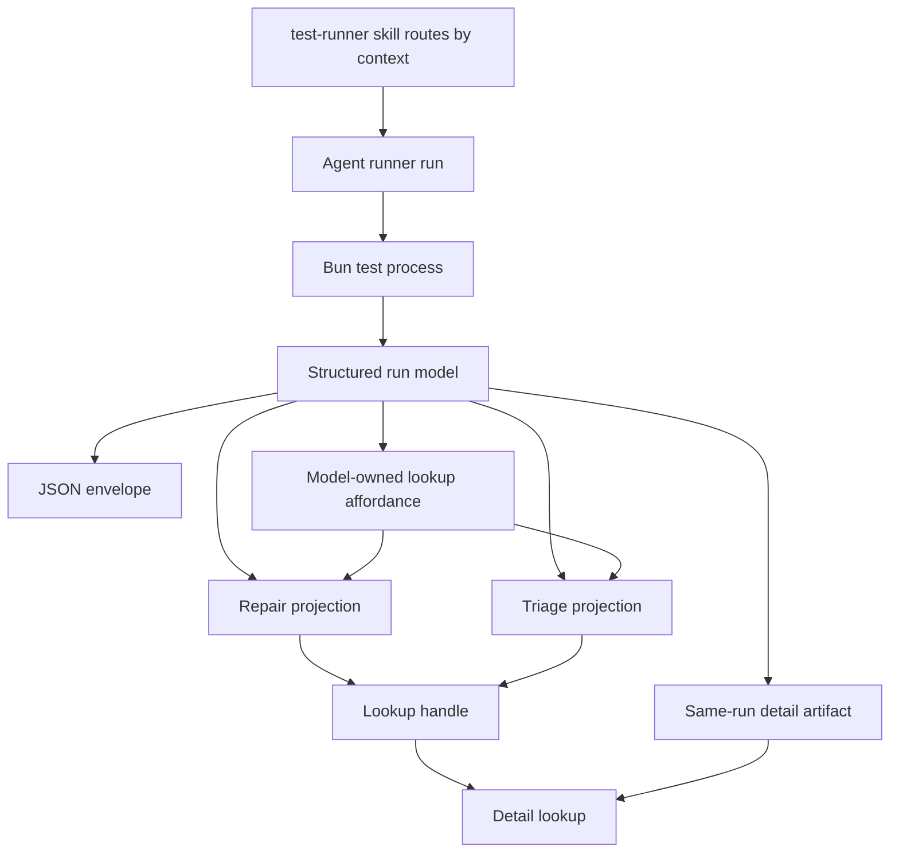
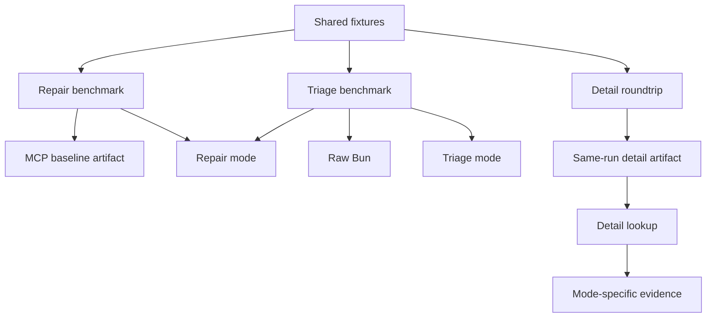

# feat(test-runner): add agent runner context escalation

## Summary

Evolve the proof-only compact `test-runner` into an agent runner prototype with hot-context repair output, cold-context triage output, same-run detail lookup, JSON-backed state, recovery hints, and mode-specific benchmark evidence.

---

## Problem Frame

The current compact runner proved that smaller output helps, but the fixed-gate evidence showed a hard truth: the local runner passed exit and fidelity gates while MCP still beat its token estimates where comparable. The next prototype should not make a smaller human report. It should prove an agent-native escalation shape where a hot-context agent gets a tiny repair packet because richer detail remains mechanically reachable from the same run.

Cold-context triage remains different work. A broad-suite agent may not have opened the failing file, so it needs bounded navigation and assertion context rather than the repair packet's minimal pointer. The plan preserves that context split and keeps normal runner guidance unchanged until fixed-gate evidence justifies adoption.

---

## Requirements

**Context modes**

- R1. Support a hot-context repair mode that assumes the agent already has the edited file in context. Covers origin R1-R3 and R12-R16.
- R2. Support a cold-context triage mode that assumes the agent may not have opened the failing file. Covers origin R4-R6 and R17-R20.
- R3. Route repair, triage, detail lookup, JSON, and benchmark use through thin `SKILL.md` prose without copying deterministic output contracts. Covers origin R21-R25.

**Escalation and detail**

- R4. Include a mechanical lookup handle in every terse failure packet when same-run detail exists. Covers origin R7.
- R5. Return richer detail from the same run without rerunning tests. Covers origin R8-R9.
- R6. Expose JSON for the structured run model that backs repair, triage, and detail lookup. Covers origin R10.
- R7. Expose runtime failure recoverability, same-input retry safety, and next action. Covers origin R11.

**Output fidelity**

- R8. Repair output omits summary headers, run IDs, duration, stack frames, and code context by default while preserving location, test identity, assertion facts, and lookup handle when available. Covers origin R12-R14.
- R9. Repair mode beats MCP token estimates on hot-context fixtures without losing repair fidelity. Covers origin R15-R16.
- R10. Triage output remains bounded while providing enough navigation context to choose the next inspection target. Covers origin R17-R20.

**Benchmark and adoption**

- R11. Benchmark repair and triage separately: repair against MCP, triage against raw Bun and repair. Covers origin R15-R16 and R20.
- R12. Prove lookup availability and detail roundtrip as benchmark dimensions, not prose claims. Covers origin R7-R10 and AE2.
- R13. Preserve normal runner guidance, currently MCP-backed, until fixed-gate evidence justifies adoption.

**Vocabulary and ownership**

- R14. Add the `Agent Runner` domain term before implementation uses it broadly. Covers origin deferred planning question.
- R15. Name owners for contract, result model, parser or engine, renderers, lookup behavior, recovery hints, tests, and benchmark evidence. Covers origin R23-R25.

---

## Key Technical Decisions

- **Evolve the existing compact runner:** Build on `skills/test-runner/scripts/*` instead of creating a new skill or package. The current runner already has a facade-backed contract, shell entrypoint, JSON envelope, parser, recovery hints, and benchmark harness.
- **Use explicit run modes for repair and triage:** Keep repair and triage on the existing run command as a package-owned mode option, with `repair`, `triage`, and the current compact projection as distinct accepted values. Both modes execute the same Bun run and differ by projection, which avoids duplicating parser and runtime behavior while making context state explicit.
- **Use a detail lookup command:** Add a `detail` command keyed by a model-owned handle rather than using debug output as escalation. Detail lookup is a distinct agent action, returns same-run detail, and can fail with recoverable handle diagnostics.
- **Version the result contract deliberately:** Treat the agent runner as a result-contract change. U1 decides whether to bump the existing `test-runner.bun-test` schema version or split run and detail into separate result contracts, then proves contract id/version alignment in tests.
- **Persist same-run detail as local generated artifacts:** Store richer run detail under `skills/test-runner/scripts/.runner-output/`, keyed by run correlation and failure identity. The prototype uses deterministic expiry through artifact metadata and test-clock injection, adds the path to the skill scripts gitignore, and keeps cleanup local to generated output.
- **Own lookup handles in the model:** Store lookup handles in the structured run model, JSON data, and contract-owned runtime affordances. Plain repair and triage output are projections of that model-owned affordance, never renderer-only state.
- **Introduce a richer internal failure model:** Extend the result model to preserve line or navigation target, assertion signal, expected value, received value, bounded diagnostic context, and detail handle. Repair, triage, JSON, and detail render from that model so projections do not drift.
- **Define a persisted diagnostics exposure boundary:** Detail artifacts may contain bounded raw diagnostic context, so the store must redact machine-visible sensitive values using the same allow-list posture as other agent-native CLI outputs, avoid leaking absolute local paths in handles, and fail closed on unreadable or unsafe artifacts.
- **Keep repair tiny because detail is reachable:** Repair mode deliberately omits report metadata and code context by default. Runtime failures are the exception: they still show recoverability and next action because hiding those would block repair.
- **Measure modes by different value functions:** Repair competes with MCP on token estimate plus repair fidelity. Triage competes with raw Bun on bounded orientation. Detail lookup is measured by same-run, no-rerun, richer-fidelity roundtrip.
- **Make benchmark gates comparative:** Extend fixed gates beyond absolute thresholds so repair can be compared against MCP, triage against raw Bun and repair, and detail lookup against a no-rerun roundtrip counter. Benchmark subprocesses need a timeout budget so broken runner variants produce failure rows instead of hanging evidence collection.
- **Keep adoption gated:** The runner remains proof-oriented until fixed-gate evidence shows repair beats MCP on hot-context fixtures and triage preserves cold-context orientation.
- **Keep `SKILL.md` as a router:** Skill prose names context states and owner paths. Command spelling, parser behavior, output payloads, result vocabulary, retention, and benchmark scoring live in code, help, tests, and generated evidence.

---

## High-Level Technical Design

### Mode And Detail Flow

### Benchmark Shape

---

## Scope Boundaries

### In Scope

- Evolve the existing `skills/test-runner` proof.
- Add repair and triage run projections.
- Add same-run detail storage and lookup.
- Extend JSON to expose the backing run model.
- Extend facade-backed command contract and help.
- Extend runner tests and fixtures.
- Extend the Runner Benchmark Harness with mode-specific evidence.
- Update `CONTEXT.md` with the `Agent Runner` term.
- Update `skills/test-runner/SKILL.md` routing only after runtime surfaces exist.

### Deferred For Later

- Replacing all MCP quality runners.
- Publishing a shared package.
- Lint or typecheck runner output.

### Deferred To Follow-Up Work

- Broad adoption of the agent runner as the normal test path after this prototype.
- Additional token-optimization variants beyond the first repair and triage proof.
- Retention cleanup policy beyond a local generated artifact suitable for prototype evidence.

### Outside This Product's Identity

- Making agents read raw Bun output for normal repair or triage flow.
- Making `SKILL.md` the source of deterministic output contracts.
- Optimizing by dropping repair fidelity.

---

## Implementation Units

### U1. Domain Vocabulary And Contract Surface

- **Goal:** Establish agent-runner vocabulary and extend the facade-backed command contract for repair, triage, detail lookup, JSON, and benchmark evidence.
- **Requirements:** R3, R6, R7, R14, R15; origin R10-R11 and R21-R25.
- **Dependencies:** None.
- **Files:**
  - `CONTEXT.md`
  - `skills/test-runner/scripts/command-contract.ts`
  - `skills/test-runner/scripts/test-runner.ts`
  - `skills/test-runner/scripts/test-runner.sh`
  - `skills/test-runner/scripts/test-runner.test.ts`
- **Approach:** Add `Agent Runner` to the domain glossary, then update the command contract to name repair and triage as explicit run modes plus a `detail` command keyed by lookup handle. Decide result-contract versioning before runtime edits: either bump the existing run result schema or introduce separate run/detail result contracts. Keep package-owned result vocabulary near the contract owner. Preserve existing `run` and `status` behavior unless the new surface intentionally supersedes a proof-only path.
- **Execution note:** Start with contract/help/parser tests so command discovery, rendered help, parser acceptance, and runtime semantics cannot drift.
- **Patterns to follow:** `skills/create-cli/references/agent-native-cli-design.md`; `skills/create-cli/references/cli-command-facade.md`; `skills/test-runner/scripts/command-contract.ts`; `skills/browser-use/scripts/command-contract.ts`.
- **Test scenarios:**
  - Happy path: command contract validation accepts repair mode, triage mode, status, and detail lookup without facade drift findings.
  - Happy path: result contract id and schema version align across command metadata, JSON envelopes, runtime result data, and tests.
  - Happy path: rendered help advertises the new surfaces and excludes facade diagnostic flags from package-owned help.
  - Edge case: unknown mode or unknown lookup arguments fail as usage errors with a corrective next action.
  - Error path: detail lookup invoked without a handle fails with structured recovery that tells the agent to use a handle from a prior run.
  - Error path: the shell wrapper preserves missing-Bun diagnostics for repair, triage, and detail lookup without TypeScript startup.
  - Integration: contract metadata, rendered help, parser acceptance, wrapper behavior, and runtime dispatch agree for every advertised surface.
- **Verification:** A fresh agent can discover the repair, triage, detail, JSON, and benchmark paths from help and contract metadata without reading `SKILL.md` payload prose.

### U2. Structured Run Model And Same-Run Detail Store

- **Goal:** Introduce a richer run model and generated detail artifacts that support lookup without rerunning tests.
- **Requirements:** R4-R7, R10, R12, R15; origin R7-R11 and AE1-AE4.
- **Dependencies:** U1.
- **Files:**
  - `skills/test-runner/scripts/test-runner.ts`
  - `skills/test-runner/scripts/test-runner.test.ts`
  - `skills/test-runner/scripts/command-contract.ts`
  - `skills/test-runner/scripts/.gitignore`
  - `skills/test-runner/scripts/.runner-output/`
- **Approach:** Extend the parsed failure model to preserve failure identity, navigation detail, assertion signal, expected value, received value, bounded context, unparsed diagnostic fallback, and model-owned detail handle. Write same-run detail artifacts under `skills/test-runner/scripts/.runner-output/`, keyed by run correlation and failure identity, and add that generated path to the scripts gitignore. Define handle metadata with expiry, creation time, run correlation, and failure identity so tests can inject a clock and prove valid, expired, wrong-run, and malformed cases. If the store cannot write detail after Bun has run, do not emit a dangling handle: return the test result plus a recoverable store diagnostic that names detail lookup as unavailable for that run.
- **Execution note:** Add characterization coverage for the current parser before changing failure extraction.
- **Patterns to follow:** `skills/test-runner/scripts/test-runner.ts`; `skills/browser-use/scripts/browser-adapter-router-recovery.ts`; `docs/adr/0013-router-research-recovery-uses-diagnostic-trail.md`.
- **Test scenarios:**
  - Covers AE1. Given a focused assertion failure, the internal model preserves file, line when available, test identity, assertion signal, expected value, received value, and detail handle.
  - Covers AE2. Given a repair packet handle, detail lookup returns richer same-run detail without invoking the Bun runtime again.
  - Edge case: a failure with no parsed assertion facts preserves bounded unparsed diagnostic context and still gets a detail handle.
  - Edge case: multiple failures get distinct handles that resolve to the matching failure detail.
  - Error path: detail artifact write failure preserves the underlying test result, suppresses unresolved handles, and emits a recoverable store diagnostic.
  - Error path: expired, missing, malformed, or wrong-run handles fail with recoverability, retry safety, and next action.
  - Error path: unsafe or unreadable detail artifacts fail closed without leaking absolute local paths or unredacted sensitive values.
  - Integration: JSON mode exposes the structured run model and the detail handle values used by repair and triage output.
- **Verification:** Detail lookup can prove richer same-run detail through test doubles that count Bun invocations and fail if lookup reruns tests.

### U3. Hot-Context Repair Projection

- **Goal:** Add repair output that emits the smallest next-action packet suitable for an agent already editing the failing file.
- **Requirements:** R1, R4, R7-R9; origin R1-R3, R7, R12-R16, F1-F2, and AE1-AE2.
- **Dependencies:** U1, U2.
- **Files:**
  - `skills/test-runner/scripts/test-runner.ts`
  - `skills/test-runner/scripts/test-runner.test.ts`
  - `skills/test-runner/scripts/fixtures/fail.test.ts`
  - `skills/test-runner/scripts/fixtures/multi-fail.test.ts`
  - `skills/test-runner/scripts/fixtures/timeout.test.ts`
- **Approach:** Render repair mode from the structured run model. For parsed assertion failures, output only the repair facts and lookup handle. For unparsed failures, output a bounded diagnostic fallback and lookup handle. Preserve runtime failure recovery even when repair output is otherwise terse.
- **Patterns to follow:** Current compact plain rendering in `skills/test-runner/scripts/test-runner.ts`; prior fixed-gate evidence in `skills/test-runner/PROVENANCE.md`.
- **Test scenarios:**
  - Covers AE1. Given a focused assertion failure, repair output is smaller than the MCP baseline artifact for the same fixture and still names location, test identity, expected value, received value, and lookup handle.
  - Happy path: passing repair-mode output stays tiny and trustable without raw Bun transcript content.
  - Edge case: multiple failures are bounded and provide distinct lookup handles without dumping stack frames or snippets.
  - Error path: missing Bun, invalid cwd, timeout, and invocation failure show recoverability and next action instead of applying repair terseness.
  - Integration: repair output handle resolves through the detail lookup surface created in U2.
- **Verification:** Repair-mode tests assert absence of run IDs, duration, summary headers, stack frames, and code context in normal failure output, while asserting required repair facts remain.

### U4. Cold-Context Triage Projection

- **Goal:** Add triage output that orients an agent running a broader suite over files it has not inspected.
- **Requirements:** R2, R4, R7, R10; origin R4-R6, R17-R20, F3, and AE3.
- **Dependencies:** U1, U2.
- **Files:**
  - `skills/test-runner/scripts/test-runner.ts`
  - `skills/test-runner/scripts/test-runner.test.ts`
  - `skills/test-runner/scripts/fixtures/fail.test.ts`
  - `skills/test-runner/scripts/fixtures/multi-fail.test.ts`
- **Approach:** Render triage mode from the same structured run model but include bounded navigation context: file, line or nearest navigation target, test identity, assertion signal, and one small diagnostic or code-adjacent snippet when materially useful. Keep triage larger than repair but smaller and more navigable than raw Bun.
- **Patterns to follow:** Current parser context selection in `skills/test-runner/scripts/test-runner.ts`; browser-use routing pattern in `skills/browser-use/SKILL.md`.
- **Test scenarios:**
  - Covers AE3. Given a broad suite failure in an unopened file, triage output includes enough navigation context to choose the next inspection target.
  - Happy path: multi-failure triage groups bounded failures so the first inspection target is clear.
  - Edge case: missing line information falls back to file plus test identity and assertion signal.
  - Edge case: large raw output remains bounded and does not include unrelated passing-test noise.
  - Integration: every triage failure includes a lookup handle that returns richer same-run detail.
- **Verification:** Triage output is materially smaller than raw Bun for fixtures while preserving the orientation fields used by the benchmark rubric.

### U5. Mode-Aware Benchmark Harness

- **Goal:** Extend the Runner Benchmark Harness so adoption evidence matches the context-state product claim.
- **Requirements:** R9-R13; origin R15-R16, R20, R24, F4, and AE1-AE4.
- **Dependencies:** U2, U3, U4.
- **Files:**
  - `skills/test-runner/scripts/test-runner.benchmark.ts`
  - `skills/test-runner/scripts/test-runner.test.ts`
  - `skills/test-runner/scripts/.benchmark-input/mcp-baseline.json`
  - `skills/test-runner/scripts/.benchmark-output/`
- **Approach:** Add benchmark dimensions for context mode, lookup availability, detail roundtrip, repair fidelity, triage orientation, token estimate, exit correctness, and baseline comparison. Extend the fixed-gate contract so it can express cross-variant comparisons, not just absolute per-row thresholds. Add rerun counters for detail lookup and benchmark-level subprocess timeouts so hung repair, triage, or lookup variants produce failure rows. Keep repair and triage gates separate. Treat MCP artifact absence as skipped for proof and blocking for normal runner guidance deprecation unless a separate decision-log waiver is recorded and startup delivery checks pass after any guidance change.
- **Patterns to follow:** Existing Runner Benchmark Harness in `skills/test-runner/scripts/test-runner.benchmark.ts`; fixed-gate evidence in `skills/test-runner/scripts/.benchmark-output/`; `docs/decisions/2026-06-04-test-runner-compact-runner-decision-log.md`.
- **Test scenarios:**
  - Covers AE1. Repair benchmark compares repair mode to MCP on hot-context fixtures and reports token estimate plus fidelity.
  - Covers AE2. Detail roundtrip benchmark proves lookup availability and richer same-run detail without rerun.
  - Covers AE3. Triage benchmark compares triage against raw Bun and repair using an orientation score.
  - Covers AE4. Runtime failure fixtures include recoverability, same-input retry safety, and next action.
  - Edge case: MCP artifact missing marks repair comparison skipped and blocks guidance deprecation.
  - Edge case: an explicit maintainer waiver is represented by a decision-log entry and still requires startup delivery checks before guidance changes.
  - Edge case: a tiny repair packet that omits expected or received value loses fidelity despite token savings.
  - Error path: a hung local runner or detail lookup is killed by the benchmark timeout and recorded as a failed row.
  - Integration: calibration and fixed-gate modes remain distinct, and generated evidence stays under the skill-local output path.
- **Verification:** Benchmark output explains why repair, triage, and lookup passed or failed independently, without requiring a reviewer to read raw Bun logs.

### U6. Skill Routing And Adoption Boundary

- **Goal:** Update `SKILL.md` and provenance so agents choose repair, triage, detail, JSON, or benchmark based on context state while normal runner guidance remains gated.
- **Requirements:** R3, R11-R15; origin R21-R25 and AE5.
- **Dependencies:** U1-U5.
- **Files:**
  - `skills/test-runner/SKILL.md`
  - `skills/test-runner/PROVENANCE.md`
  - `context/bun-runner.md`
  - `rules/code-quality.md`
  - `skills/test-runner/scripts/test-runner.test.ts`
- **Approach:** Keep the skill route-oriented: name context states, owner paths, and next safe actions. Do not copy output schemas, parser states, flags, or payload catalogues. Record benchmark outcome in provenance. Update normal runner guidance only if fixed-gate evidence proves repair beats MCP on hot-context fixtures and triage keeps orientation value; otherwise leave `context/bun-runner.md` and `rules/code-quality.md` unchanged.
- **Execution note:** Treat `SKILL.md` edits as skill authoring: read `context/skill-design-philosophy.md` and YAML-parse frontmatter before finishing.
- **Patterns to follow:** `context/skill-design-philosophy.md`; `skills/test-runner/SKILL.md`; `skills/browser-use/SKILL.md`; `AGENTS.md`.
- **Test scenarios:**
  - Happy path: skill prose routes a hot-context agent to repair mode and a cold-context agent to triage mode.
  - Happy path: skill prose routes unclear repair packets to detail lookup.
  - Edge case: benchmark evidence failing the MCP-beating repair gate keeps normal runner guidance unchanged.
  - Integration: `PROVENANCE.md` records whether adoption stayed proof-only or changed normal guidance.
- **Verification:** Skill frontmatter parses, owner paths are accurate, deterministic contracts remain in code/help/tests, manual skill review rejects copied schemas or parser rules, and startup guidance is changed only if evidence justifies it.

---

## Acceptance Examples

- AE1. Given a focused assertion failure in a file the agent is editing, when repair mode runs, then output is smaller than the MCP baseline and still names the failure location, test, expected value, received value, and lookup handle.
- AE2. Given a repair packet with a lookup handle, when the agent asks for detail, then the CLI returns richer same-run detail without rerunning tests.
- AE3. Given a broad suite failure in a file the agent has not opened, when triage mode runs, then output includes bounded navigation context enough to choose the next inspection target.
- AE4. Given missing runtime, invalid cwd, timeout, or invocation failure, when the command fails before or during a run, then the result names recoverability, retry safety, and next action.
- AE5. Given a future skill prose edit, when it copies output schemas or parser rules, then that content is moved back to CLI help, tests, or contract-owned code.

---

## System-Wide Impact

- **CLI contract:** `skills/test-runner/scripts/command-contract.ts` becomes the owner for context modes, detail lookup, and package-owned result vocabulary.
- **Runner model:** `skills/test-runner/scripts/test-runner.ts` shifts from compact report rendering toward a structured run model with multiple projections.
- **Benchmark evidence:** `skills/test-runner/scripts/test-runner.benchmark.ts` becomes the adoption proof for mode-specific value, not a generic local-vs-MCP comparison.
- **Skill routing:** `skills/test-runner/SKILL.md` changes after runtime proof so agents can choose by context state.
- **Normal runner guidance:** `context/bun-runner.md` and `rules/code-quality.md` remain unchanged unless fixed-gate evidence supports adoption.
- **Generated artifacts:** same-run detail artifacts and benchmark output remain skill-local unless deliberately promoted.

---

## Risks & Dependencies

- **Repair output may get too terse:** Mitigate with fidelity gates requiring location, test identity, assertion signal, expected value, received value, and lookup handle.
- **Detail artifacts may become stale or unreadable:** Mitigate with handle validation, recoverable lookup diagnostics, and tests for missing, malformed, expired, and wrong-run handles.
- **Persisted diagnostic detail may leak too much:** Mitigate with a persisted diagnostics exposure boundary, redaction checks, local-only generated output, and handles that avoid absolute path leakage.
- **Detail store write failure may create dangling handles:** Mitigate by suppressing handles when writes fail and emitting a recoverable store diagnostic while preserving the test result.
- **Parser fragility may hide assertion facts:** Mitigate with characterization tests, bounded unparsed fallback, and detail lookup preserving raw-enough diagnostic context.
- **Benchmark gates may reward the wrong mode:** Mitigate with separate repair and triage scoring. Repair optimizes token cost against MCP; triage optimizes orientation against raw Bun.
- **Benchmark evidence may hang:** Mitigate with benchmark-level subprocess timeouts and failure rows for hung repair, triage, and detail lookup variants.
- **Skill prose may drift into contract ownership:** Mitigate with owner-path-only skill routing and tests or review checks that reject copied schemas and parser rules.
- **Guidance adoption may happen too early:** Mitigate by preserving proof-only guidance until fixed-gate evidence passes and MCP artifact evidence or waiver exists.

---

## Documentation And Operational Notes

- Add `Agent Runner` to `CONTEXT.md` before using the term broadly in skill prose.
- Keep generated benchmark evidence in `skills/test-runner/scripts/.benchmark-output/`.
- Keep detail artifacts in `skills/test-runner/scripts/.runner-output/`, add that path to scripts gitignore, and document retention through help, tests, or provenance rather than `SKILL.md` payload prose.
- Record adoption outcome in `skills/test-runner/PROVENANCE.md`.
- Run startup delivery checks only if normal runner guidance or startup surfaces change.

---

## Deferred Implementation Notes

- Exact parser extraction helpers and failure ID shape are implementation-time details owned by `skills/test-runner/scripts/test-runner.ts`.
- Exact artifact cleanup implementation may stay prototype-local, but U2 must define a testable expiry policy, generated path, handle validation behavior, and clock seam before renderer work depends on lookup handles.
- Exact benchmark numeric gates should be calibrated from evidence, then fixed before adoption review.

---

## Sources & Research

- Origin requirements: `docs/brainstorms/2026-06-05-agent-runner-context-escalation-requirements.md`.
- Prior requirements: `docs/brainstorms/2026-06-04-test-runner-compact-runner-requirements.md`.
- Prior plan: `docs/plans/2026-06-04-003-feat-test-runner-compact-runner-plan.md`.
- Prior evidence and status: `skills/test-runner/PROVENANCE.md`; `skills/test-runner/scripts/.benchmark-output/u5-fixed-fixed-gate.json`.
- Current runner owners: `skills/test-runner/SKILL.md`; `skills/test-runner/scripts/command-contract.ts`; `skills/test-runner/scripts/test-runner.ts`; `skills/test-runner/scripts/test-runner.test.ts`; `skills/test-runner/scripts/test-runner.benchmark.ts`.
- CLI design owners: `skills/create-cli/SKILL.md`; `skills/create-cli/references/agent-native-cli-design.md`; `skills/create-cli/references/cli-command-facade.md`.
- Skill design owner: `context/skill-design-philosophy.md`.
- Adjacent lookup and recovery pattern: `skills/browser-use/SKILL.md`; `skills/browser-use/scripts/browser-adapter-router-recovery.ts`; `docs/adr/0013-router-research-recovery-uses-diagnostic-trail.md`.
- Current normal runner guidance: `context/bun-runner.md`; `rules/code-quality.md`.
