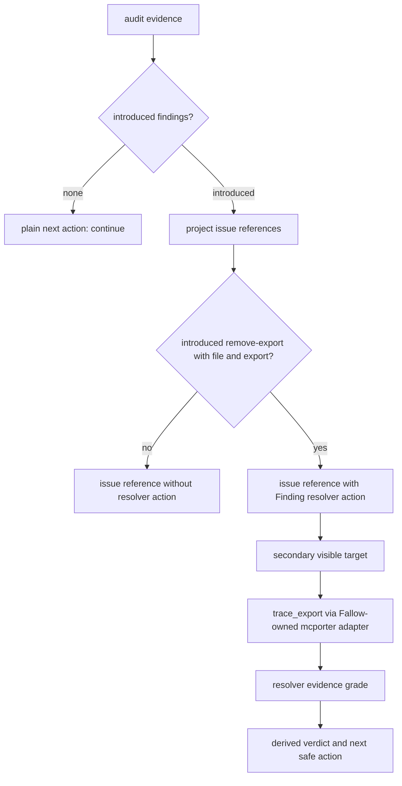
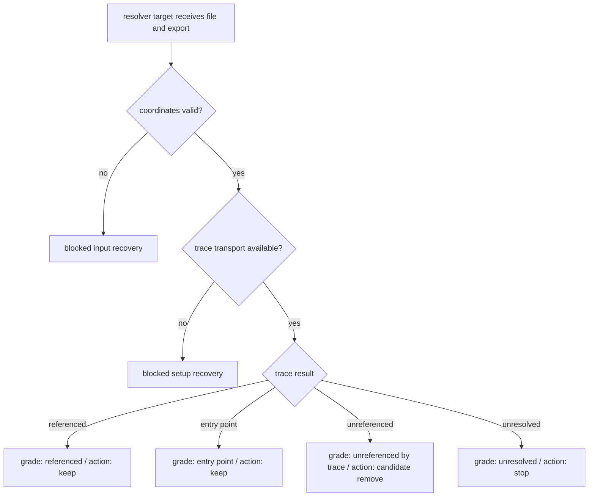

# feat: Add Fallow finding resolver actions

## Summary

Add an action-first resolver path for introduced traceable Fallow `remove-export` findings. Eligible findings advertise a tiny runnable continuation, the resolver gathers deterministic export reachability evidence, and output names evidence grades before any derived verdict or next action.

---

## Problem Frame

The Fallow runner now separates introduced audit findings from inherited findings. When introduced findings are zero, existing plain output tells agents to continue without per-finding triage. The remaining sharp case is an introduced `remove-export` finding on a contract-like export: agents need deterministic reachability evidence before treating removal as even a candidate action.

The brainstorm chooses the finding as the decision surface. A runner-visible resolver command may exist, but skill docs and workflows should teach agents to start from the finding and follow advertised Finding resolver actions only when present (see origin: `docs/brainstorms/2026-06-05-fallow-finding-resolver-actions-requirements.md`).

---

## Requirements

**Resolver eligibility**

- R1. Advertise Finding resolver actions only for introduced audit findings.
- R2. Treat v1 traceable findings as introduced `remove-export` findings with file and export coordinates.
- R3. Do not advertise resolver actions for inherited findings, coordinate-missing findings, or broad `needs_trace` signals alone.
- R4. Preserve the existing zero-introduced stop signal so inherited findings do not restart per-finding triage.

**Action surface**

- R5. Add a per-finding Finding resolver action that stays distinct from blocked-run repair actions.
- R6. Keep the action payload tiny: action identity, runnable target, required coordinates, and reason.
- R7. Make the runnable target discoverable through command discovery and help without copying exact command contracts into skill prose.
- R8. Keep finding-id addressing, last-run state lookup, resolver registries, and batch tracing out of v1.

**Resolver target behavior**

- R9. Accept file and export coordinates for one export.
- R10. Gather deterministic export reachability evidence through the proven `trace_export` path.
- R11. Map transport or setup failures into blocked-run recovery.
- R12. Map missing, invalid, or symbol-not-found coordinates into input recovery.
- R13. Avoid requiring finding-id lookup or saved envelopes in v1.

**Output meaning**

- R14. Use evidence grades as the primary meaning of resolver output.
- R15. Derive verdicts and next actions from evidence grades as helpers only.
- R16. Avoid `likely-dead` wording in JSON and plain output.
- R17. Treat `unreferenced_by_trace` as a deletion candidate, not deletion proof.
- R18. Tell agents to keep exports when trace evidence finds references or entry-point status.
- R19. Block deletion action when trace evidence is unresolved or unavailable.
- R20. Preserve top-level runner status values: `ok`, `issues`, and `blocked`.

**Documentation and ownership**

- R21. Update Fallow skill docs to route agents through introduced findings first, then advertised Finding resolver actions.
- R22. Update workflow docs to explain the audit gate and cleanup boundary without copying parser rules, flags, schemas, or exact output contracts.
- R23. Keep exact command and output semantics in runtime contract code, generated discovery, rendered help, parser tests, and runtime tests.
- R24. Cite the Fallow decision log as the accepted decision source for runner design.

---

## Key Technical Decisions

- KTD1. **Action-first workflow, secondary visible target:** Findings advertise resolver actions as the primary route. The visible target uses the existing `why` direction as the discoverable runnable continuation, but docs teach agents to follow the finding action rather than memorize a command-first triage path.
- KTD2. **Facade-backed contract path remains the owner:** Extend `skills/fallow/scripts/command-contract.ts`, `skills/fallow/scripts/fallow-runner.ts`, rendered help, command discovery, parser behavior, and runner tests together. This follows the accepted facade-backed runner decision in `docs/decisions/2026-06-04-fallow-agent-native-decision-log.md`.
- KTD3. **Named coordinate flags over positionals:** Use named coordinate input for file and export instead of positional arguments. The facade contract validates flags and usage text today, while positional semantics would live only in custom parser code.
- KTD4. **Package-owned result vocabulary:** Add evidence grades, derived verdicts, and resolver action ids as Fallow package-owned vocabulary in runtime code. Do not copy their exact contract shape into `SKILL.md` or reference prose.
- KTD5. **Fallow-owned mcporter adapter:** Use a Fallow-owned adapter for `trace_export` transport. Reuse the browser-use mcporter command-vector pattern conceptually, but do not cross-import browser-use or extract a shared utility before a third consumer exists.
- KTD6. **Coordinates-first v1:** Require file and export coordinates in v1. Finding-id addressing, saved envelope lookup, and last-run state become follow-up work.
- KTD7. **Evidence grades before action wording:** Resolver output starts from evidence grades such as referenced, entry point, unreferenced by trace, unresolved, or unavailable. Derived actions help agents proceed, but absence of trace references never becomes deletion proof.
- KTD8. **Resolver actions are not repair actions:** Blocked-run recovery keeps using repair hints. Finding resolver actions belong to successful finding evidence and point to a current-run continuation for one finding.

---

## High-Level Technical Design

---

## Scope Boundaries

### Deferred for later

- Finding-id addressing.
- Last-run state or saved envelope lookup.
- Resolver registry by finding kind.
- Batch trace for all introduced traceable findings.
- Broader trace command family.
- Non-audit baseline or regression proof.
- Resolver actions for explicit cleanup outside normal audit.
- Shared mcporter utility after a third consumer exists.
- Trace evidence artifact ledger.

### Out of scope for the MVP

- Advertising resolver actions for inherited audit findings.
- Advertising resolver actions from `needs_trace` alone.
- Treating static trace absence as deletion proof.
- Copying exact command or output contracts into skill prose.
- Designing a general trace framework.
- Reopening zero-introduced audit runs for inherited-finding triage.

---

## System-Wide Impact

- **Command surface:** The resolver target becomes a public runner mode, so discovery metadata, rendered help, parser behavior, plain output, JSON output, and tests all become contract surfaces.
- **Issue references:** Audit issue references gain optional Finding resolver actions. Downstream agents may branch on their presence, so missing-action cases must be as intentional as action-present cases.
- **Runner envelope:** Top-level envelope status remains unchanged. Resolver-specific meaning stays inside package-owned evidence so existing status routing keeps working.
- **Skill docs:** `SKILL.md` and Fallow references gain route guidance only. They should not become a second copy of the command contract.
- **Prototype lifecycle:** The throwaway trace prototype stops being an executable reference once keeper adapter and runner coverage exist.

---

## Implementation Units

### U1. Define resolver vocabulary and command surface

- **Goal:** Add the package-owned resolver vocabulary and visible runner target to the facade-backed contract surface.
- **Requirements:** R5-R8, R14-R16, R20, R23, R24
- **Dependencies:** None
- **Files:** `skills/fallow/scripts/command-contract.ts`, `skills/fallow/scripts/fallow-runner.test.ts`
- **Approach:** Extend the existing contract owner with a resolver target, named coordinate flags, and small package-owned vocabularies for resolver action ids, evidence grades, derived verdicts, and derived next actions. Keep coordinate input shape owned by command usage, parser behavior, and tests because the facade contract currently models invocation syntax through `usage` and `flags`, not a separate positional schema.
- **Execution note:** Start with contract/discovery/parser tests so help, discovery, and accepted argv cannot drift from runtime behavior.
- **Patterns to follow:** Existing `FALLOW_RUNNER_COMMANDS`, `FALLOW_REPAIR_ACTIONS`, `assertFallowRepairAction`, `fallowRunnerContracts`, `parseCommandFacadeContract`, and `projectCommandDiscoveryTree` tests.
- **Test scenarios:**
  - Happy path: command contract parsing accepts the new resolver target and existing commands remain present.
  - Happy path: command discovery projects the resolver target with the existing runner result contract identity and schema version.
  - Happy path: rendered help includes the resolver target usage and purpose without adding unsupported diagnostic flags.
  - Happy path: named coordinate flags are advertised by discovery and rendered help.
  - Error path: missing either coordinate flag returns invalid-usage input recovery.
  - Edge case: contract-owned vocabularies reject unknown evidence grades, resolver action ids, verdicts, and next actions.
  - Integration: all public commands still declare JSON and plain output modes where expected.
- **Verification:** Discovery metadata, rendered help, parser acceptance, and contract tests agree on the resolver target without changing existing command semantics.

### U2. Project resolver actions on eligible audit findings

- **Goal:** Add tiny Finding resolver actions only to introduced traceable `remove-export` issue references.
- **Requirements:** R1-R8, R21-R24
- **Dependencies:** U1
- **Files:** `skills/fallow/scripts/fallow-runner.ts`, `skills/fallow/scripts/fallow-runner.test.ts`
- **Approach:** Extend `FallowIssueReference` projection with an optional resolver action collection that is separate from blocked-run `repair_hints`. Derive eligibility from introduced state, action shape, file path, and export symbol. Preserve broad `needs_trace` as a summary signal only.
- **Patterns to follow:** Existing `issueReferenceFrom`, `actionFrom`, `symbolFrom`, audit attribution projection, and zero-introduced plain-output behavior.
- **Test scenarios:**
  - Covers AE1. Given one introduced `remove-export` finding and one inherited `remove-export` finding, only the introduced traceable finding advertises a resolver action.
  - Covers AE2. Given an introduced `remove-export` finding missing file or export coordinates, no resolver action is advertised.
  - Covers AE3. Given a finding with `needs_trace` but without the v1 traceable shape, no resolver action is advertised.
  - Edge case: non-audit `dead-code` findings do not get resolver actions unless this plan explicitly extends that surface later.
  - Integration: plain audit output with introduced zero still reports continue and does not encourage JSON issue triage.
- **Verification:** JSON issue references expose resolver actions only for eligible findings, inherited and coordinate-missing findings remain action-free, and existing attribution output remains stable.

### U3. Add Fallow-owned trace adapter

- **Goal:** Encapsulate mcporter-backed `trace_export` execution behind a Fallow-owned adapter with typed evidence and failure boundaries.
- **Requirements:** R9-R13, R18, R19
- **Dependencies:** U1
- **Files:** `skills/fallow/scripts/why-trace.ts`, `skills/fallow/scripts/fallow-runner.test.ts`
- **Approach:** Lift the proven transport shape from the prototype into a keeper adapter that builds the mcporter call, parses the unwrapped tool payload, validates trace evidence, and separates tool-level symbol-not-found from transport/setup failures. Keep the adapter pure over an injected command runner where practical.
- **Patterns to follow:** `skills/fallow/scripts/prototype-why-symbol/NOTES.md`, `skills/fallow/scripts/prototype-why-symbol/trace-client-mcporter.ts`, and the command-vector override pattern used by browser-use mcporter transport without importing browser-use.
- **Test scenarios:**
  - Happy path: referenced trace evidence returns a typed evidence object with direct references preserved.
  - Happy path: unreferenced trace evidence returns a typed evidence object with zero direct references.
  - Error path: tool-level symbol-not-found maps to an input failure class without being treated as transport failure.
  - Error path: mcporter offline, missing, timeout, or spawn failure maps to a transport/setup failure class.
  - Edge case: malformed or incomplete trace payload fails closed instead of producing a deletion candidate.
- **Verification:** Adapter tests prove success and failure shapes without live mcporter, and no MCP protocol plumbing leaks into the runner CLI.

### U4. Execute resolver target and render evidence-grade-first output

- **Goal:** Wire the visible resolver target into the runner so it accepts coordinates, calls the adapter, and emits resolver-specific mode evidence.
- **Requirements:** R9-R20, R23
- **Dependencies:** U1, U3
- **Files:** `skills/fallow/scripts/fallow-runner.ts`, `skills/fallow/scripts/fallow-runner.test.ts`
- **Approach:** Add a runner branch for the resolver target that bypasses ordinary Fallow CLI evidence commands, performs target root/readiness checks appropriate to trace, invokes the Fallow-owned adapter, and writes the standard runner envelope. Put resolver-specific evidence under mode evidence or equivalent package-owned result vocabulary while preserving top-level status values.
- **Patterns to follow:** Existing `runParsedCommand` branches, `makeEnvelope`, `summary.mode_evidence`, `repairHintFor`, `renderPlainEnvelope`, and usage-error handling.
- **Test scenarios:**
  - Covers AE4. Referenced evidence renders an evidence grade first and a derived action that tells the agent to keep the export.
  - Covers AE5. Unreferenced evidence renders `unreferenced_by_trace`-style evidence wording and a candidate-remove action without deletion-proof wording.
  - Covers AE6. Every resolver result keeps top-level status within `ok`, `issues`, or `blocked`, with resolver-specific meaning in package-owned evidence.
  - Error path: missing file or export coordinate returns invalid-usage input recovery.
  - Error path: symbol-not-found returns blocked input recovery and the first safe repair hint.
  - Error path: transport unavailable returns blocked setup recovery and the first safe repair hint.
  - Integration: plain output names the evidence grade and derived next action without dumping raw trace payloads.
- **Verification:** Runtime tests cover referenced, entry-point, unreferenced, unresolved, invalid-input, symbol-not-found, and transport-unavailable paths in JSON and plain output.

### U5. Update Fallow skill and workflow docs

- **Goal:** Route agents through introduced findings and advertised resolver actions without copying runtime contracts into prose.
- **Requirements:** R21-R24
- **Dependencies:** U1, U2, U4
- **Files:** `skills/fallow/SKILL.md`, `skills/fallow/references/commands.md`, `skills/fallow/references/workflows.md`, `skills/fallow/scripts/fallow-runner.test.ts`
- **Approach:** Add terse routing that says when to follow Finding resolver actions and where to inspect current syntax. Keep exact flags, payload fields, evidence literals, parser rules, and output semantics in code, help, discovery, and tests.
- **Execution note:** Read `context/skill-design-philosophy.md` before editing the skill body; preserve the tiny-router shape.
- **Patterns to follow:** Existing `Skill Route Index`, command recipe map, workflow attribution section, and doc-drift guard tests.
- **Test scenarios:**
  - Covers AE7. Skill docs explain the action-first route without copying command payloads, parser rules, flags, or output schemas.
  - Happy path: command docs mention the resolver target as discoverable through help and command discovery.
  - Integration: workflow docs preserve zero-introduced stop and distinguish audit resolver actions from non-audit coverage-intersect cleanup.
  - Regression: docs do not introduce `likely-dead` wording or `next_action=` literals in skill prose where tests guard against copied runtime output.
- **Verification:** Skill docs stay thin, references route to owner paths, and doc-drift tests pass.

### U6. Retire prototype and preserve decision trail

- **Goal:** Remove throwaway resolver spike code after keeper code exists, while keeping useful source lineage discoverable.
- **Requirements:** R8, R21-R24
- **Dependencies:** U3, U4, U5
- **Files:** `skills/fallow/scripts/prototype-why-symbol/`, `skills/fallow/PROVENANCE.md`, `docs/decisions/2026-06-04-fallow-agent-native-decision-log.md`, `skills/fallow/scripts/fallow-runner.test.ts`
- **Approach:** Delete the prototype folder only after adapter and runner tests cover its keeper behavior. Update provenance or the decision log to point at the accepted requirements and plan rather than preserving throwaway scripts as runtime surface.
- **Patterns to follow:** Existing `PROVENANCE.md` source-lineage style and decision-log fenced metadata.
- **Test scenarios:**
  - Regression: no runtime import, package script, or docs route depends on the prototype folder after deletion.
  - Regression: references to prototype code remain only as historical source lineage when useful, not as executable instructions.
  - Integration: the runner test suite covers the trace shapes that made the prototype valuable before the prototype is removed.
- **Verification:** No executable path depends on `skills/fallow/scripts/prototype-why-symbol/`, and source lineage still explains where the resolver decision came from.

---

## Acceptance Examples

- AE1. Given an audit result with one introduced `remove-export` finding and one inherited `remove-export` finding, when the runner projects issue references, then only the introduced traceable finding advertises a Finding resolver action.
- AE2. Given an introduced `remove-export` finding missing file or export coordinates, when the runner projects the finding, then no Finding resolver action is advertised for that finding.
- AE3. Given a finding or summary carries a broad trace signal but lacks the v1 traceable finding shape, when the runner projects issue references, then it does not advertise a runnable resolver action.
- AE4. Given the resolver target returns referenced evidence, when the runner renders JSON and plain output, then the evidence grade is the source of truth and the derived action tells the agent to keep the export.
- AE5. Given the resolver target finds no direct references, when output renders, then the result uses evidence wording such as `unreferenced_by_trace` and treats removal as a candidate action only.
- AE6. Given any resolver result, when the runner emits its envelope, then top-level status remains in the existing runner status set and resolver-specific meaning stays in package-owned mode evidence.
- AE7. Given a reader opens Fallow skill docs, then docs explain when to follow Finding resolver actions without copying exact command payloads, flags, parser rules, or output schemas.

---

## Risks & Dependencies

- **Fallow trace transport availability:** The plan depends on `fallow-mcp` and mcporter remaining available for local trace execution. Mitigate with setup-failure mapping and adapter tests that fail closed.
- **Facade contract shape:** The facade contract models usage and flags, not typed positionals. Mitigate by proving coordinate input through rendered help, parser tests, and runtime behavior rather than claiming facade-owned positional schemas.
- **Deletion overclaim risk:** Static trace absence can miss dynamic framework edges. Mitigate by making `unreferenced_by_trace` a candidate-remove action only.
- **Docs contract drift:** Skill docs could accidentally copy runtime literals and stale. Mitigate with owner-path prose and doc-drift tests where the runner suite already guards runtime-owned wording.
- **Scope creep into trace framework:** Resolver registries, finding-id lookup, batch tracing, and artifact ledgers are tempting. Keep them in follow-up scope unless a later decision promotes one.

---

## Documentation / Operational Notes

- Update skill docs only as routes and owner pointers.
- Keep command syntax discoverable through runner help and command discovery.
- Keep exact JSON, plain output, parser, and evidence-grade contracts in runtime code and tests.
- Leave CI behavior unchanged; this plan extends local agent self-review evidence, not CI setup.

---

## Sources & Research

- `docs/brainstorms/2026-06-05-fallow-finding-resolver-actions-requirements.md`
- `docs/ideation/2026-06-05-fallow-why-resolver-ideation.md`
- `docs/decisions/2026-06-04-fallow-agent-native-decision-log.md`
- `docs/plans/2026-06-05-001-feat-fallow-agent-actionability-plan.md`
- `docs/plans/2026-06-05-002-feat-fallow-why-subcommand-plan.md`
- `skills/fallow/scripts/prototype-why-symbol/NOTES.md`
- `skills/create-cli/references/cli-guidelines.md`
- `skills/create-cli/references/agent-native-cli-design.md`
- `context/skill-design-philosophy.md`
- [Fallow documentation index](https://docs.fallow.tools/llms.txt)
- [Fallow quick start](https://docs.fallow.tools/quickstart)
- [Fallow audit CLI reference](https://docs.fallow.tools/cli/audit)
- [Fallow MCP integration](https://docs.fallow.tools/integrations/mcp.md)
