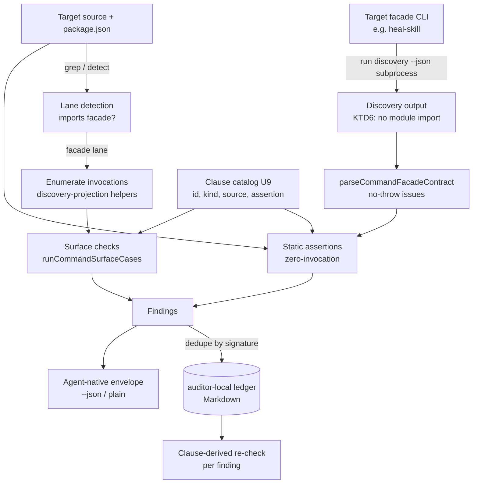

# feat: CLI Execution-Experience Auditor (v1, facade lane)

**Target repo:** `claude-code-config` (paths below are repo-relative)

## Summary

Build an opt-in skill that deterministically audits a facade-backed CLI's agent-execution experience against a per-lane contract. It runs two check kinds — **static contract assertions** (lane properties checkable without enumerating) and **surface exercise** (run each enumerable invocation, assert the lane-contract clause) — and writes findings to a ledger. Pass/fail is a fact derived from the contract, not a judge's vote.

The build wraps the facade's existing testing harness: `runCommandSurfaceCases`, `assertCommandHelpFlagSurface`, and `assertNoRuntimeContractFixtureLeaks` (in `runtime/cli-command-facade/src/testing.ts`) plus `parseCommandFacadeContract` (in `runtime/cli-command-facade/src/command-metadata.ts`) — all re-exported from `index.ts` — provide the execution spine. The new, load-bearing work is the **clause catalog** (U9): enumerate invocations from a parsed contract and encode lane-contract clauses as assertions. Supporting work: an **auditor-local findings-ledger writer** (findings-table subset; a shared module is deferred until a second code consumer exists), a **fixture corpus** of one known-bad CLI per lane clause plus known-good (the checker-correctness oracle), and a **known-answer replay** reproducing the three heal-skill bugs, each caught by its expected behavioral kind (static vs surface).

v1 is an **opt-in tool**, not the v2 enforcement gate. Scope is the **facade lane only**.

---

## Problem Frame

CLIs ship broken branches that surface only under specific argument permutations: wrong exit codes, unactionable errors, `--json` that breaks under failure, raw-runner-rule violations, silent coverage gaps. Tonight's heal-skill rebuild found three such bugs by hand (raw `bun test`, owner-paths matching zero paths, single-suite coverage) — caught only because a human probed ~15 angles ad hoc.

The rejected fix was a convergence loop of adversarial judge agents (5/5 WOUNDED in review; literature confirms same-model panels collapse to ~2 effective votes and silence-based convergence rewards symptom-masking). The breakthrough is **the per-lane contract**: a deterministic statement of what correct execution looks like, where pass/fail is a fact. Enumeration *exercises* the contract; the contract *catches* the bug.

This is tractable now because facade-backed CLIs expose a declarative, genuinely enumerable discovery surface (typed flags, side-effects, exec modes). Hand-rolled `process.argv` CLIs do not — their flag namespace is unbounded — so **v1 scopes to the facade lane**, where the contract IS the oracle.

(see origin: `docs/brainstorms/2026-06-10-cli-execution-experience-auditor-requirements.md`)

---

## Requirements

Carried from the origin requirements doc. R-IDs are plan-local handles.

- **R1 — Two check kinds.** Static contract assertions (no enumeration) + surface exercise (run each enumerable invocation, assert against lane contract).
- **R2 — Facade enumeration source.** v1 enumerates from the facade discovery surface (typed flags, subcommands, exec modes). Hand-rolled CLIs are out of v1 scope.
- **R3 — Deterministic outcomes.** Each check has an expected outcome derived from the lane contract; pass/fail is a fact, not a vote.
- **R4 — Lane-aware contract.** Facade lane = full `@side-quest/cli-command-facade` contract (discovery metadata, rendered help, argv accept/reject, structured envelope, repair hints, run correlation, no-drift). Owner cited by reference: `runtime/cli-command-facade/AGENTS.md`.
- **R5 — Lane detection (v1 mechanical).** Detect facade lane by `@side-quest/cli-command-facade` import / `workspace:*` dependency. No per-CLI lane marker exists; persisting one is a v2 prerequisite, out of scope.
- **R6 — Findings model by reference.** Reuse `skill-self-audit-loop`'s ledger semantics: states (open/resolved/rejected/duplicate/superseded), dedupe-by-signature, never-delete history, Candidate Shapes promotion. Auditor owns writes to its own ledger artifact; "read-only" means it never edits CLI source.
- **R7 — Falsifiable resolution criterion.** A finding's re-check re-runs the **clause assertion** against the post-fix CLI (not free-text authored from the symptom), and signatures anchor to semantic intent (clause + invocation), not code coordinates. **Masking-resistance is a property of clause strength, not of re-check provenance:** a clause resists masking only when its assertion has no cheaper-to-satisfy form than the real fix. Making each clause masking-resistant is an authoring obligation per clause (U9), tracked as a per-clause note in the catalog — not a free guarantee of "derive from clause." Clauses that cannot be made fully masking-resistant in v1 are marked as known limits.
- **R8 — Bounded dogfooding output.** The auditor's own CLI honors the agent-native contract it can check (structured envelope, repair hints, run correlation, quiet success / rich failure, human + `--json`). Dogfooding proves output conformance, not checker correctness.
- **R9 — Checker correctness via fixtures.** A fixture corpus of known-bad CLIs (one per lane clause) the auditor MUST flag, and known-good CLIs it MUST pass. Self-dogfooding never substitutes.
- **R10 — Known-answer replay.** Running the auditor reproduces the three heal-skill bugs, each caught by the expected *behavioral* kind (static = zero target invocations; surface = invocation-required, per KTD4), so the contract-vs-enumeration split is tested against behavior, not a self-chosen label.
- **R11 — Masking-fix resistance (bounded).** For a clause whose assertion is masking-resistant, a masking-fix does NOT close the finding. U7 tests the *hard* case: a masking-fix that **literally satisfies** the clause assertion without fixing the real intent (e.g. injecting one dummy owner path so the set is non-empty) — and either the clause holds (resistant) or the limit is recorded. R11 is not a blanket guarantee; it is true exactly as far as each clause is authored strongly (R7).

Explicitly **not v1** (origin Scope Boundaries, preserved):
- The mandatory enforcement gate (v2, at N≥3) and its lane-marker prerequisite.
- Hand-rolled / Basic / Agent-native lane coverage beyond facade.
- Branch-coverage instrumentation (c8/Istanbul) as the completeness oracle.
- Full facade-backed dogfooding of the auditor; auto-fixing safe finding classes.

---

## Key Technical Decisions

### KTD1 — The spine is the facade harness; the value is the clause catalog

The execution machinery exists and is reused: `runCommandSurfaceCases({ cases, runner })` (per-invocation exercise + phase-annotated failures), `assertCommandHelpFlagSurface` (help ↔ contract flag alignment), `assertNoRuntimeContractFixtureLeaks` (redaction discipline), and `parseCommandFacadeContract` (no-throw → `{ ok, issues[] }`, ~30 drift category codes). The auditor enumerates invocations from a parsed contract via the discovery-projection helpers (`projectCommandDiscoveryTree` et al.) and builds one `CommandSurfaceCase` per invocation. **The novel, load-bearing work is NOT the wrapper — it is the clause catalog** (U9): the explicit set of lane clauses, each with an id, kind (static/surface), the code-owned source it cites, the exact assertion, the expected outcome, and a masking-resistance note (R7). "Encode lane clauses as assertions" is the 80% of risk, not a one-line detail. **Rationale:** the spine must not be re-implemented (duplicates runtime-owned contracts, violates AGENTS.md "don't copy contracts"); but the catalog is where correctness lives, so it is promoted to a first-class deliverable ahead of the engine.

### KTD2 — Auditor-local ledger; defer extraction to a real second code consumer

`skill-self-audit-loop` is **prose-only** — no code writes its ledger; it is a hand-edited *convergence journal* (frontmatter `target_skill`/`passes`/`convergence`, 14+ narrative sections) whose shape is orthogonal to the auditor's need (a findings table keyed by clause + invocation). There is no code consumer to share a module with, and forcing a byte-stable round-trip of its prose would make a "shared" module absorb two unrelated document shapes — abstraction on one data point. **Decision (revised after doc-review; supersedes the earlier shared-module choice):** ship an **auditor-local** ledger writer at `skills/cli-execution-auditor/src/ledger/`, owning only the findings-table subset (states open/resolved/rejected/duplicate/superseded, signature dedupe, never-delete history, the contract-derived `recheck` field). Format stays Markdown for format-compatibility with `skill-self-audit-loop`'s documented template (R6 = reuse by reference, not a shared library). Extract a shared module only when a genuine second *code* consumer materializes — the same recurrence discipline the v2 gate waits for. (see origin: reuse "by reference … propose upstream if it generalizes")

### KTD3 — Lane clauses sourced from code constants, not stale prose

The exit-code floor (0/1/2 required) is machine-enforced in `runtime/cli-command-facade/src/command-contract.ts` (baseline-exit drift categories) and supersedes older create-cli prose. Help-flag alignment is enforced by `assertCommandHelpFlagSurface`. Redaction fixtures live in `RUNTIME_CONTRACT_REDACTION_FIXTURES`. **Decision:** every static assertion cites the code-owned constant/validator as its source of truth, never re-states a clause in auditor prose. Agent-native floor clauses (stderr discipline, run correlation, structured failure category, retry safety) come from `skills/create-cli/references/agent-native-cli-design.md` "Runtime-Contract Minimum" — cited by reference.

### KTD4 — Static-vs-surface classification, tied to behavior not a self-chosen label

Each check declares `kind: "static" | "surface"`, but the classification is **falsifiable against behavior**, not a label the test then checks against itself. Static = caught with **zero target invocations** (observable: no runner/subprocess call); surface = caught **only by an invocation** (observable: removing the invocation makes the finding disappear, while contract-parse alone does not). Policy when a bug is catchable both ways: **prefer static**; classify surface only when no static assertion suffices — so the field is deterministic, not discretionary. R10 asserts the *behavioral* invariant (zero-invocation vs invocation-required), not that the implementation matches a pre-registered string. **Rationale:** the origin's honesty claim (some bugs are static contract properties, not flag-permutation facts) must be proven against observable behavior, or an implementer refactoring a static check to invoke the CLI would "break" R10 with no behavior change.

### KTD5 — Auditor is itself a facade-backed CLI (bounded dogfooding)

The auditor ships as a facade-backed CLI mirroring `heal-skill` / `test-runner` (command-contract.ts + engine + thin runner). This satisfies R8 for free (its own output honors the contract) and makes it a fixture-eligible known-good target. **Not** a v1 gate that it audit itself — that's a v2 nicety.

### KTD6 — Target-contract acquisition: run the target's discovery surface, don't import its module

The static spine needs the target's contract object, but importing a target's TS module is unsafe two ways: (1) there is **no naming convention** for the exported contract (`healSkillContracts` is ad hoc — no manifest points to it); (2) targets build their contract with the **throwing** `defineCommandFacadeContract` at module top-level, so importing a *drifting* target throws `CliRuntimeContractError` at load — before the auditor can detect the drift it exists to find. **Decision:** acquire the contract by **running the target's own discovery/`--json` surface as a subprocess** and parsing that output, rather than importing the module. This resolves both problems (no export-name dependency; a drifting target's discovery output is data, not a load-time crash) and settles OQ2 toward subprocess for acquisition. Bad fixtures (U6) are authored so their defect surfaces in discovery output / `parseCommandFacadeContract` issues, not as an uncatchable import throw.

---

## High-Level Technical Design

### Component shape



### Check lifecycle (one check)

```mermaid
sequenceDiagram
    participant A as Auditor engine
    participant C as Lane contract clause
    participant T as Target CLI
    participant L as Ledger module
    A->>C: resolve expected outcome (from code constant)
    alt static check
        A->>T: read contract / source / help (no invoke)
    else surface check
        A->>T: runCommandSurfaceCases(argv)
    end
    A->>A: assert actual vs expected → pass | finding
    A->>A: derive re-check FROM clause (not symptom)
    A->>L: upsert finding by signature (clause + invocation)
    Note over L: never-delete; dedupe; open/resolved/...
```

### Static vs surface — the classification under test (R10)

| heal-skill bug | Check kind | Assertion | Caught by |
|---|---|---|---|
| raw `bun test` call | **static** | source must route runners via `test-runner.sh`, never raw `bun test`/`biome`/`tsc` | source grep, no invocation |
| vacuous-match (owner-paths) | **static** | a path-resolving check must not declare `ok` on an empty referenced set (vacuous pass) | contract/source inspection |
| single-suite coverage | **surface** | running the check must exercise all declared suites, not one | run invocation + inspect coverage |

---

## Output Structure

```text
skills/cli-execution-auditor/
├── SKILL.md
├── package.json                      # @side-quest/cli-command-facade dep (no shared ledger)
├── tsconfig.json                     # copied from classic-cinema
├── src/
│   ├── command-contract.ts           # audit command surface (facade contract)
│   ├── clause-catalog.ts             # U9: the clause set — id, kind, code source, assertion, masking note
│   ├── clause-catalog.test.ts        # every clause has all fields; static/surface partition is exhaustive
│   ├── audit-engine.ts               # lane detect, acquire contract (subprocess), static + surface checks
│   ├── target-contract.ts            # KTD6: run target discovery --json, parse (no module import)
│   ├── auditor.ts                     # thin facade runner (mirrors heal-skill.ts)
│   ├── ledger/                        # auditor-local findings ledger (KTD2 — not a shared package)
│   │   ├── index.ts                  # findings-table Markdown read/write
│   │   ├── signature.ts              # dedupe-by-signature (clause + invocation)
│   │   └── ledger.test.ts
│   ├── audit-engine.test.ts
│   ├── auditor.test.ts               # drift-surface tests
│   ├── replay.test.ts                # known-answer replay of heal-skill bugs (R10)
│   ├── fixtures.test.ts              # corpus oracle (R9)
│   └── fixtures/                      # known-bad (one per clause) + known-good CLIs (R9)
│       ├── good-baseline/            # clean minimal facade CLI (all bad-* fork from this)
│       ├── bad-exit-floor/           # clause: exit-floor (static)
│       ├── bad-help-drift/           # clause: help-flag alignment (static)
│       ├── bad-redaction-leak/       # clause: redaction discipline (static)
│       ├── bad-raw-runner/           # clause: no-raw-runner (static) — heal bug a
│       ├── bad-vacuous-match/        # clause: vacuous-match (static) — heal bug b
│       ├── bad-envelope-on-failure/  # clause: --json-valid-under-failure (surface)
│       └── bad-partial-coverage/     # clause: declared-coverage-runs (surface) — heal bug c
└── references/
    └── lane-contract-clauses.md       # human map of clauses → code owners (no copied contracts)
```

Clause ↔ fixture ↔ heal-bug map (reconciles the counts; authoritative source is the catalog, U9):

| Clause id | Kind | Fixture | heal-skill bug |
|---|---|---|---|
| exit-floor | static | bad-exit-floor | — (new lane clause, R4) |
| help-flag-alignment | static | bad-help-drift | — (new lane clause, R4) |
| redaction-discipline | static | bad-redaction-leak | — (new lane clause, R4) |
| no-raw-runner | static | bad-raw-runner | bug a |
| vacuous-match | static | bad-vacuous-match | bug b |
| json-valid-under-failure | surface | bad-envelope-on-failure | — (new lane clause, R4) |
| declared-coverage-runs | surface | bad-partial-coverage | bug c |

---

## Implementation Units

### U1. Auditor-local findings-ledger writer

**Goal:** An auditor-local, typed ledger writer owning the findings-table subset, in Markdown, format-compatible with `skill-self-audit-loop`'s documented template.
**Requirements:** R6, R7.
**Dependencies:** none.
**Files:** `skills/cli-execution-auditor/src/ledger/index.ts`, `skills/cli-execution-auditor/src/ledger/signature.ts`, `skills/cli-execution-auditor/src/ledger/ledger.test.ts`.
**Approach:** Model the states (open/resolved/rejected/duplicate/superseded), the section partition (Open Findings / Finding History), and the `signature` field. Markdown read/write the **findings-table subset only** — NOT `skill-self-audit-loop`'s convergence-journal sections (Pass Ledger, Candidate Shapes, Research Anchors, etc.); those stay outside the auditor's concern. No byte-stable round-trip of foreign prose is required (that requirement was what forced the over-broad abstraction; dropped per doc-review). Add a typed `recheck` field (R7) — a structured reference to the clause id + invocation that generated the finding, used to re-run the *clause assertion* on close. Signature = stable hash of (clause id + canonicalized invocation argv), per R7.
**Patterns to follow:** `skills/test-runner/src/` module layout, `catalog:` devDeps.
**Test scenarios:**
- New finding upsert assigns `open`; second upsert with same signature dedupes (no duplicate row).
- State transition open→resolved preserves the row in Finding History (never-delete).
- `signature()` is stable across runs for identical (clause, invocation) and differs when the clause differs.
- A ledger the writer produces parses cleanly as the findings-table sections `skill-self-audit-loop` documents (format-compatible, R6).
- `recheck` serializes as a structured clause+invocation reference, not free text.
**Verification:** writer builds, tests pass; a produced ledger reads as valid against the documented findings-table format.

### U2. skill-self-audit-loop format-compatibility pointer (docs only)

**Goal:** Record that the auditor's ledger uses the same findings-table format `skill-self-audit-loop` documents, so a future extraction is mechanical — without touching `skill-self-audit-loop`'s code (it has none) or workflow.
**Requirements:** R6.
**Dependencies:** U1.
**Files:** `skills/cli-execution-auditor/SKILL.md` (a one-line "format-compatible with skill-self-audit-loop; extract a shared module when a second code consumer exists" note), `skills/cli-execution-auditor/references/lane-contract-clauses.md` (cross-reference).
**Approach:** Pure documentation. `skill-self-audit-loop` is prose-only (no code, no `package.json`, no `src/`) — there is nothing to migrate. This unit exists to keep the deferral explicit and discoverable, not to change either skill's behavior.
**Patterns to follow:** AGENTS.md "name owner paths; don't copy contracts."
**Test scenarios:** `Test expectation: none -- documentation pointer, no behavioral change.`
**Verification:** the deferral note is present and points at the right owner paths; `skill-self-audit-loop` is untouched.

### U3. Scaffold the auditor skill as a facade-backed CLI

**Goal:** A runnable, empty-but-valid facade CLI skeleton for the auditor (commands declared, help works, exit floor satisfied).
**Requirements:** R8, KTD5.
**Dependencies:** none (parallel with U1).
**Files:** `skills/cli-execution-auditor/SKILL.md`, `skills/cli-execution-auditor/package.json`, `skills/cli-execution-auditor/tsconfig.json`, `skills/cli-execution-auditor/src/command-contract.ts`, `skills/cli-execution-auditor/src/auditor.ts`, `skills/cli-execution-auditor/src/auditor.test.ts`, root `package.json` (workspace member).
**Approach:** Mirror `skills/classic-cinema/src/{command-contract.ts,heal-skill.ts}` exactly — contract declares the audit command(s) (`audit <target>` + `--json`, `--only <clause>`, `--ledger <path>`); thin runner does `parseCliDiagnosticArgv` → contract-validated argv → handler → `createCliRuntime{Success,Error}Envelope` → `writeJsonEnvelope`; `runForTest` + `BufferWriter` harness. Handler is a stub returning "no checks yet" until U4.
**Patterns to follow:** `skills/classic-cinema/src/heal-skill.ts` (committed `7b0815b`), `skills/test-runner/src/command-contract.ts`.
**Test scenarios (drift surfaces):**
- `parseCommandFacadeContract` on the audit contract → `ok: true`.
- `assertCommandHelpFlagSurface` for each command (help renders advertised flags).
- argv accept/reject: unknown command → exit 2; bad `--only` → exit 2.
- envelope shape: success path → success envelope; usage error `--json` → structured error envelope, code `usage_error`.
**Verification:** `bun run src/auditor.ts audit --help` works; tsc clean; drift tests pass.

### U9. Clause catalog — the load-bearing deliverable

**Goal:** Enumerate the v1 lane clauses as a structured, first-class artifact before any engine code, so "encode lane clauses as assertions" (KTD1) is a real spec, not a phrase.
**Requirements:** R1, R3, R4, R7, KTD1, KTD3, KTD4.
**Dependencies:** none (parallel with U1/U3; blocks U4/U5).
**Files:** `skills/cli-execution-auditor/src/clause-catalog.ts`, `skills/cli-execution-auditor/src/clause-catalog.test.ts`, `skills/cli-execution-auditor/references/lane-contract-clauses.md`.
**Approach:** Each clause is a typed record: `{ id, kind: "static"|"surface", source (code-owned validator/constant it cites, KTD3), assertion (what it checks), expectedOutcome, maskingNote (is the assertion masking-resistant, or a recorded limit — R7) }`. v1 clause set (7), reconciled with the fixture map: **static** — exit-floor (cites baseline-exit drift in `command-contract.ts`), help-flag-alignment (cites `assertCommandHelpFlagSurface`), redaction-discipline (cites `assertNoRuntimeContractFixtureLeaks`/`RUNTIME_CONTRACT_REDACTION_FIXTURES`), no-raw-runner (source grep), vacuous-match (auditor-defined guard); **surface** — json-valid-under-failure, declared-coverage-runs. Also map the ~30 `parseCommandFacadeContract` drift category codes to one of {becomes-finding, ignored, advisory} so static drift handling is explicit, not ad hoc. `references/lane-contract-clauses.md` is the human map (clause → code owner), no copied contracts.
**Patterns to follow:** KTD3 (cite code constants); AGENTS.md (don't copy contracts).
**Test scenarios:**
- Every clause record has all fields populated; `kind` ∈ {static, surface}.
- Static/surface partition matches the HTD table + fixture map (no count drift — this test is the guard against the reconciliation bug doc-review found).
- Every clause's `source` resolves to a real exported symbol/constant or a named source-grep rule.
- Each clause `maskingNote` is either "resistant: <why>" or "limit: <cheaper-satisfying-form>" (R7) — no clause silently omits it.
- The drift-code map covers every category `parseCommandFacadeContract` can emit (no unmapped code).
**Verification:** catalog typechecks; partition + drift-code-coverage tests pass; the human map cites real owners.

### U4. Build the audit engine — contract acquisition, lane detection, static assertions

**Goal:** Acquire a target's contract safely, detect facade lane, and run the static clauses.
**Requirements:** R1 (static half), R3, R4, R5, KTD3, KTD4, KTD6.
**Dependencies:** U1 (ledger), U3 (skill shell), U9 (clause catalog).
**Files:** `skills/cli-execution-auditor/src/target-contract.ts`, `skills/cli-execution-auditor/src/audit-engine.ts`, `skills/cli-execution-auditor/src/audit-engine.test.ts`.
**Approach:** **Contract acquisition (KTD6):** run the target's discovery/`--json` surface as a subprocess and parse it — do NOT import the target module (no export-name convention; importing a drifting target throws `CliRuntimeContractError` at load before the auditor can see the drift). If a target lacks a discovery surface, that is itself a finding (a facade CLI should expose one), not a crash. **Lane detection:** inspect target `package.json` for the `@side-quest/cli-command-facade` dep + source import (R5). **Static checks** run from the U9 catalog, each `kind: "static"`, caught with **zero target invocations** (KTD4): exit-floor, help-flag-alignment, redaction-discipline, no-raw-runner, vacuous-match. Each finding carries a clause-derived `recheck` (R7) + signature (clause + target). Write via the auditor-local ledger (U1). **Determinism (R3):** canonicalize (sort) any enumerated list before emitting; exclude volatile fields (timestamps, durations, absolute paths) from findings.
**Patterns to follow:** `runtime/cli-command-facade/src/testing.ts` helpers; `heal-engine.ts` for grep-style source checks.
**Test scenarios:**
- Contract acquired from a target's discovery output without importing its module; a target with a *drifting* contract yields a structured finding, not an import crash.
- A target with no discovery surface → explicit finding, not a crash.
- Facade target detected as facade lane; non-facade dir → not-facade (skipped with reason, not crash).
- Exit-floor flags a contract missing exit code `2`; help-flag flags a contract flag absent from help; redaction flags a planted secret; no-raw-runner flags a source calling raw `bun test`; vacuous-match flags a check that passes on an empty set.
- Each static finding is caught with **zero** runner/subprocess-invocation calls to the target's commands (KTD4 behavioral invariant).
- Each finding's `recheck` re-runs the clause assertion (references clause id, not the symptom string) (R7).
- `Covers R3.` Re-running identical input in a different cwd produces identical findings.
**Verification:** static checks run against live heal-skill clean; against `bad-*` static fixtures they fire. **Early kill-switch (see Risks):** after U4, run the static half against a sample of existing facade CLIs as a go/no-go before building U5–U8.

### U5. Build the audit engine — facade-surface exercise

**Goal:** Enumerate invocations from the parsed contract and exercise each against its lane clause.
**Requirements:** R1 (surface half), R2, R3, KTD1, KTD4.
**Dependencies:** U4, U9 (clause catalog).
**Files:** `skills/cli-execution-auditor/src/audit-engine.ts` (extend), `skills/cli-execution-auditor/src/audit-engine.test.ts` (extend).
**Approach:** Enumerate via discovery-projection helpers (`projectCommandDiscoveryTree` / `projectCommandDiscoveryFlag`) → **sorted/canonical** list → one `CommandSurfaceCase` per invocation (command × advertised flag, per-command — not a global cross-product). Build a `runner` that invokes the target via subprocess (the same acquisition path as KTD6; subprocess is the universal default). Per-case `assert` runs the U9 **surface** clauses (`kind: "surface"`): json-valid-under-failure, declared-coverage-runs (the heal partial-coverage class), plus exit-code-matches-declared and stdout/stderr discipline. Surface findings flow to the auditor-local ledger.
**Determinism (R3):** sort the projected invocation list before building cases; run the subprocess with pinned cwd/env and captured streams; exclude volatile fields from findings. Add a determinism test that runs the surface path twice in **different cwds**, not just twice in the same one.
**Open question handled (OQ4):** interdependent flags (flag A only valid with subcommand B) — v1 enumerates per-command flag sets (the contract already scopes flags per command), not a global cross-product; the limit is documented, and the success-criterion language is narrowed (see Open Questions) so v1 does not overclaim branch completeness.
**Patterns to follow:** `runCommandSurfaceCases` usage; `heal-skill.test.ts` surface-case shape.
**Test scenarios:**
- Enumeration produces one case per (command, advertised flag), in canonical sort order.
- A target whose `--json` breaks under failure → surface finding fired.
- A target with correct exit codes across all enumerated invocations → no surface finding.
- Partial-coverage class: a check that runs one of N declared suites → surface finding (heal bug c shape).
- Each surface finding **disappears** when its invocation is removed, while contract-parse alone does not produce it (KTD4 behavioral invariant for surface).
- Empty enumeration (no commands) → explicit error, never a silent pass (mirror `runCommandSurfaceCases` throw-on-empty).
- `Covers R2.` Enumeration source is the contract, not a hand-authored list.
- `Covers R3.` Surface path run twice in different cwds → identical findings.
**Verification:** surface checks run against live heal-skill clean; against the partial-coverage fixture they fire as `kind: "surface"`.

### U6. Fixture corpus — one known-bad per lane clause + known-good

**Goal:** The checker-correctness oracle: synthetic CLIs the auditor MUST flag (one per clause) and MUST pass (known-good).
**Requirements:** R9.
**Dependencies:** U4, U5, U9.
**Files:** `skills/cli-execution-auditor/src/fixtures/good-baseline/`, `.../bad-exit-floor/`, `.../bad-help-drift/`, `.../bad-redaction-leak/`, `.../bad-raw-runner/`, `.../bad-vacuous-match/`, `.../bad-envelope-on-failure/`, `.../bad-partial-coverage/`, and a corpus test `skills/cli-execution-auditor/src/fixtures.test.ts`.
**Approach:** One known-bad per clause (7), each forked from `good-baseline` with a single injected defect. **Cascade policy (doc-review):** clauses are not fully independent — a broken envelope can also trip help-flag surfacing or redaction (they read the same envelope). So the corpus does NOT assert "exactly one finding"; it asserts each bad fixture fires **at least** its target clause, plus a per-fixture **documented co-fire set** (the dependent clauses that share the defect's input surface). Maintain a clause-dependency note (which clauses share an input) so co-fires are expected, not noisy regressions. `good-baseline` fires zero.
**Patterns to follow:** `skills/skill-self-audit-loop/fixtures/` (positive/negative pair precedent); minimal facade CLI = trimmed `heal-skill`.
**Test scenarios:**
- Each `bad-*` fixture fires its target clause's finding (superset semantics).
- Each `bad-*` fixture fires only its target clause **plus its documented co-fire set** — no undocumented findings.
- `good-baseline` produces zero findings.
- `Covers R9.` Corpus is the correctness oracle; deliberately breaking one checker turns its fixture red.
**Verification:** corpus test green; the co-fire sets are documented, not silent; breaking a checker reddens its fixture.

### U7. Known-answer replay + masking-fix resistance

**Goal:** Reproduce the three heal-skill bugs with the correct *behavioral* kind, and stress masking-resistance with the hard case.
**Requirements:** R10, R11, KTD4.
**Dependencies:** U4, U5, U6, U9.
**Files:** `skills/cli-execution-auditor/src/replay.test.ts`.
**Approach:** Reconstruct each of the three heal-skill defects as a fixture variant: raw-runner (static), vacuous owner-paths match (static), single-suite coverage (surface). Assert each is caught AND caught by the **behavioral** kind (static = zero target invocations; surface = invocation-required, KTD4) — not by a self-chosen label string. For R11, test the **hard** masking case: apply a fix that **literally satisfies** the vacuous-match clause assertion without fixing intent (inject one dummy owner path so the resolved set is non-empty), re-run the clause `recheck`, and record the outcome — either the clause is strong enough to still fail (resistant) or the limit is captured in the U9 `maskingNote`. Also test the easy case (a fix that does not satisfy the clause) for contrast.
**Patterns to follow:** the static-vs-surface table in High-Level Technical Design. Pre-fix bug shapes live in `heal-skill.ts` before the engine split: `git show 0a05354:skills/classic-cinema/src/heal-skill.ts`; the isolating fix diffs are `9f6b592` (raw `bun test` + single-suite coverage) and `d7839e0` (vacuous owner-paths match).
**Test scenarios:**
- `Covers R10.` raw-runner defect → finding, caught with zero target invocations (static behavior).
- `Covers R10.` vacuous owner-paths defect → finding, caught with zero target invocations (static behavior).
- `Covers R10.` single-suite coverage defect → finding that disappears when the invocation is removed (surface behavior).
- `Covers R11.` hard masking-fix (dummy path satisfies the literal clause) → either `recheck` still fails (finding stays `open`) OR the U9 `maskingNote` records the limit — never a silent close.
- Easy masking-fix (does not satisfy clause) → `recheck` fails, finding stays `open` (contrast case).
**Verification:** replay test green; classification is asserted against behavior (zero-invocation vs invocation-required), so refactoring a static check to invoke the CLI would correctly fail the test.

### U8. Wire the engine into the auditor command + ledger output

**Goal:** `audit <target>` runs the full check set, writes the ledger, and emits an agent-native envelope.
**Requirements:** R1, R6, R7, R8.
**Dependencies:** U4, U5 (engine), U1 (ledger).
**Files:** `skills/cli-execution-auditor/src/auditor.ts` (replace U3 stub), `skills/cli-execution-auditor/src/auditor.test.ts` (extend), `skills/cli-execution-auditor/SKILL.md` (final workflow + owner-path references).
**Approach:** Handler resolves the target, runs static + surface checks (from the U9 catalog), upserts findings to the auditor-local ledger at `--ledger <path>` (default `docs/cli-audits/<cli-name>/audit.md`), and returns a result rendered as quiet-success / rich-failure plain text and a `--json` envelope with repair hints + run correlation (R8). Exit: 0 clean, 1 findings, 2 usage. SKILL.md is a thin wrapper citing owners by reference (`runtime/cli-command-facade/AGENTS.md`, `skills/skill-self-audit-loop/` for the findings-model semantics) — no copied contracts.
**Patterns to follow:** `heal-skill.ts` dispatch + envelope rendering; AGENTS.md skill-authoring rules (thin body, owner paths, one workflow).
**Test scenarios:**
- `audit good-baseline` → exit 0, quiet success, empty/healthy ledger.
- `audit <bad fixture>` → exit 1, findings in `--json`, ledger written with open finding.
- `--json` failure path is a valid structured envelope (dogfood R8).
- Re-running `audit` on the same target dedupes (no duplicate ledger rows) — exercises U1 dedupe end-to-end.
- SKILL.md frontmatter YAML-parses; `description` is quoted.
**Verification:** end-to-end `audit` on heal-skill reports clean; on a fixture writes a real ledger; `tsc`/tests/biome green across both new packages.

---

## Scope Boundaries

### In scope (v1)
- Facade-backed CLIs only (the enumerable lane).
- The clause catalog (U9) + static contract assertions + facade-surface exercise.
- Auditor-local findings-ledger writer (findings-table subset; shared-module extraction deferred).
- Fixture corpus: one known-bad per lane clause + known-good, with documented co-fire sets.
- Known-answer replay of the three heal-skill bugs (behavioral classification) + masking-resistance stress.
- Auditor as an opt-in, facade-backed CLI.

### Deferred for later (origin — v2)
- The mandatory enforcement gate (at N≥3 distinct real-bug catches) and `--audit-override` logged-escape.
- A persisted per-CLI lane marker (gate prerequisite).
- Full Basic / Agent-native hand-rolled-lane coverage.
- Branch-coverage instrumentation (c8/Istanbul) as the hand-rolled completeness oracle.
- Full facade-backed dogfooding (auditor audits itself as a gate); auto-fixing safe finding classes.

### Outside this skill's identity (origin)
- Open-ended source code review (ce-code-review's job; this audits runtime CLI behavior).
- A convergence loop of adversarial judge agents — explicitly rejected (see origin Decision Record).
- General fuzzing of non-CLI code.

### Deferred to follow-up work (plan-local)
- Extracting a shared findings-ledger module (`@side-quest/findings-ledger`) once a genuine second *code* consumer exists — the auditor-local writer (U1) is format-compatible, so extraction is mechanical when warranted.
- Promoting the auditor's clause-derived re-check + masking-resistance discipline (R7) upstream into skill-self-audit-loop's documented method set, *if* it generalizes (origin invites this; not required for v1 to function).

---

## Open Questions

- **OQ1 (resolved):** `skill-self-audit-loop` is prose-only — no code writes its ledger (confirmed in doc-review). So there is no migration; U2 is a documentation pointer, and the shared-module extraction is deferred (KTD2).
- **OQ2 (resolved):** Surface exercise + contract acquisition both use **subprocess** (KTD6) — universal, and it sidesteps the import-throw and export-name problems. In-process `runForTest` is not used; determinism is held by pinned cwd/env + canonical ordering (U4/U5).
- **OQ3 (v2, not v1):** Where the enforcement gate wires in (create-skill verification, create-cli proof, or both) and how the lane marker persists. Origin outstanding question 1.
- **OQ4 (documented limit, U5):** Interdependent flags (flag A only valid with subcommand B). v1 enumerates per-command flag sets (the contract already scopes flags per command), not a global cross-product. **Completeness claim narrowed:** v1 proves "every advertised (command, flag) is exercised once," NOT "no unexercised branch" — branch-coverage measurement (c8) for the facade lane is a considered-and-deferred alternative, not a v1 oracle. Origin outstanding question 2.

---

## System-Wide Impact

- **One new workspace member:** `skills/cli-execution-auditor/` must be added to root `package.json` workspaces explicitly (skills are enumerated individually). No new `runtime/` package — the ledger is auditor-local.
- **skill-self-audit-loop is untouched** — U2 is a docs pointer only; no dependency, no code, no format change.
- **No change** to `cli-command-facade` runtime — the auditor is a pure consumer of its public + `/testing` API, and acquires target contracts via subprocess (KTD6), not by importing target modules.
- **Skills symlink:** `~/.claude/skills` → repo `skills/`; the new skill appears globally on creation (memory `reference_claude_skills_symlink`).

---

## Risks & Dependencies

- **R-risk1 — Clause catalog is the real risk, not the wrapper.** The value concentrates in U9; if the clauses are weak or wrong, the "thin wrapper" is thin value. Mitigation: U9 is a first-class deliverable ahead of the engine, with per-clause masking notes and a drift-code-coverage test; the fixture corpus (U6) is the regression gate on clause correctness.
- **R-risk2 — False positives erode trust.** A checker that over-fires on good CLIs is worse than none. Mitigation: U6 known-good + documented co-fire sets (not "exactly one" assertions that would red-noise on legitimate clause cascades); the corpus is the regression gate.
- **R-risk3 — Masking-resistance is bounded by clause strength (R11).** A masking-fix that literally satisfies a weak clause still closes the finding. This is NOT fully eliminated — it's bounded: each clause's `maskingNote` (U9) records whether it is resistant or a known limit, and U7 tests the hard case explicitly rather than a strawman. Honest limit, not a guarantee.
- **R-risk4 — N≈1 evidence; build-now is a deliberate bet.** This is infrastructure on thin recurrence evidence (origin Decision Record; flagged to Nathan this session). It is the ~4th audit/loop meta-skill this session, and it creates maintenance surface (a fixture corpus exists to verify the checker) rather than user-facing capability — competing with user-facing work (control plane, productivity connectors, browser automation, life-hub). **Mitigations:** (1) the v1-tool / v2-gate split keeps the build from over-committing; (2) **early kill-switch** — after U4 (static half), run the static checks against a sample of the ~29 existing facade CLIs as a go/no-go *before* building U5–U8, converting the deferred core-value experiment (unseen-CLI catch) into an early gate; (3) the auditor-local ledger + dropped shared module keep the blast radius to one new skill. If the early kill-switch finds nothing real on unseen CLIs, stop before the heavy units — the sunk cost is U1+U3+U9+U4, not the whole build.
- **Dependencies:** `runtime/cli-command-facade/` (public + `/testing` API), `skills/create-cli/references/agent-native-cli-design.md` (floor clauses), `skills/skill-self-audit-loop/` (ledger semantics + proof methods, by reference).

---

## Sources & Research

- Origin requirements (5-persona reviewed): `docs/brainstorms/2026-06-10-cli-execution-experience-auditor-requirements.md`.
- Facade testing harness (the spine): `runtime/cli-command-facade/src/testing.ts` — `runCommandSurfaceCases`, `assertCommandHelpFlagSurface`, `assertNoRuntimeContractFixtureLeaks`.
- Contract parse + drift: `runtime/cli-command-facade/src/command-metadata.ts` (`parseCommandFacadeContract` no-throw, ~30 drift categories; `defineCommandFacadeContract` is the throwing sibling — see KTD6), `command-discovery.ts` (projection helpers), `command-contract.ts` (baseline exit-code floor).
- Findings-model semantics (by reference, not a shared library): `skills/skill-self-audit-loop/SKILL.md` (states, dedupe, never-delete; the auditor reuses only the findings-table subset), `skills/skill-self-audit-loop/references/loop-proof-methods.md` (trust conditions, earned validation, fixture-pair oracle).
- Lane floor clauses: `skills/create-cli/references/agent-native-cli-design.md`, `.../cli-command-facade.md`, `.../cli-guidelines.md` (Basic floor).
- v1 oracle target (already facade-backed, committed `7b0815b`): `skills/classic-cinema/src/{command-contract.ts,heal-engine.ts,heal-skill.ts}`.
- Scaffolding precedent: `skills/test-runner/`, `skills/classic-cinema/` (package.json `catalog:` devDeps, tsconfig, workspace entry).
