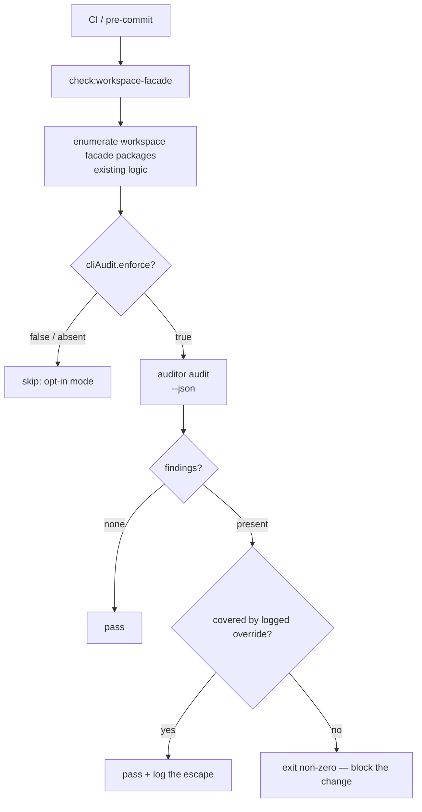

# spike: CLI Execution Auditor v2 enforcement gate (sketch)

Not a build plan — a grounded sketch of how the v1 opt-in tool becomes a v2
enforcement gate, written against the real hooks in this repo. Trigger to build:
the plan's `N≥3 distinct real-bug catches`. Active CLI feature growth is how you
reach that threshold; this is the design that's ready when you do.

## Why now (the changed premise)

v1's open risk (R-risk4) was N≈1 evidence — infrastructure on thin recurrence.
That premise inverts under active growth: the auditor's value scales with CLI
*change*, not CLI count. Every new command×flag is auto-enumerated; every new
facade CLI is auditable day-one with zero setup. The three original heal-skill
bugs were all introduced *while adding features* — exactly the growth failure
mode. Growth supplies the recurrence the gate was waiting for.

## The three real seams (no invented hooks)

The repo already has the surfaces the gate wires into:

1. **`scripts/check-workspace-facade-invariants.ts`** (1107 lines, root script
   `check:workspace-facade`). Already enumerates workspace packages, finds each
   `src/command-contract.ts`, and asserts *structural* invariants (package.json /
   tsconfig governance, dev-deps, lint portability). It does NOT run
   execution-experience clauses. **This is the primary seam** — the gate adds the
   auditor's lane-contract pass to an enumeration that already exists.

2. **`create-cli` SKILL.md** requires "Validation/proof: required for
   Facade-backed" but enforces it only as prose. The gate makes that proof
   mechanical: a new facade CLI's design isn't "proven" until `auditor audit`
   passes against it.

3. **`create-skill` verification** — when a skill ships a facade CLI, its
   verification step runs the audit. (OQ3 left "create-skill vs create-cli vs
   both" open; the answer is *both*, because they cover different lifecycle
   moments — design-time proof vs ship-time verification.)

## Gate prerequisite: the persisted lane marker (R5 → v2)

v1 detects the facade lane mechanically (dep + import). A *gate* needs a stable,
per-CLI declaration of "this CLI opts into lane-contract enforcement," so that:

- adding the facade dep for an unrelated reason does not silently enroll a CLI,
- a CLI can record a logged, reviewed escape (`--audit-override`) without that
  escape being invisible.

**Sketch:** a `cliAudit` block in the CLI's `package.json` (the file the existing
invariants script already reads), e.g.:

```jsonc
{
  "cliAudit": {
    "lane": "facade",            // explicit enrollment, not inferred
    "enforce": true,             // gate blocks on findings when true
    "overrides": [               // logged, reviewed escapes — never silent
      { "clause": "declared-coverage-runs", "reason": "...", "until": "2026-09-01" }
    ]
  }
}
```

Mechanical, co-located with the contract, and readable by the invariants script
with no new discovery surface. `enforce: false` keeps a CLI in opt-in mode during
adoption — the gate ramps per-CLI, not big-bang.

## Wiring (primary seam)



The auditor already emits a `--json` envelope with exit `1` on findings; the gate
is a thin orchestration: enumerate → filter by `enforce` → run → diff findings
against `overrides` → aggregate exit code. No new auditor capability required for
v1-of-the-gate — only the marker, the override semantics, and the CI wire.

## Ramp (how N≥3 becomes a gate without a flag day)

1. **Now (v1):** opt-in. Run `auditor audit <cli>` by hand when touching a CLI.
2. **Observe:** each real catch on a growing CLI is one of the N≥3. Record them
   (the ledger already persists findings — count distinct real catches).
3. **At N≥3:** add the `cliAudit` marker to the CLIs that earned it, `enforce:
   true`, and wire the primary seam into `check:workspace-facade`. Other CLIs stay
   `enforce: false` until they too earn it.
4. **Steady state:** new facade CLIs default `enforce: true` via the create-cli /
   create-skill proof step, so the gate is born-on for new work, opt-in for legacy.

## What stays deferred past this sketch

- **Auto-fixing safe finding classes** (e.g. add a missing baseline exit code) —
  a separate bet; the gate blocks, it does not repair.
- **Hand-rolled / Basic / Agent-native lane coverage** — still facade-only.
- **Branch-coverage instrumentation** as the completeness oracle (OQ4) — the gate
  inherits v1's narrowed completeness claim ("every advertised (command,flag) is
  exercised once"), not "no unexercised branch."
- **Auditor audits ITSELF as a gate** — v1 proved it audits clean (R8/KTD5); making
  that a blocking self-gate is a v2 nicety, not a prerequisite.

## Open questions for the build (when N≥3 lands)

- **Override expiry enforcement:** does an expired `until:` date hard-fail, or warn
  for a grace window? (Lean: hard-fail — an expired escape is an un-reviewed
  escape.)
- **CI vs pre-commit placement:** pre-commit catches it earliest but is bypassable;
  CI is the real gate. Likely both, with CI authoritative.
- **Finding-count source of truth for N≥3:** the ledger persists findings, but
  "distinct *real* catches" needs a human "this was a real bug" mark — reuse the
  ledger's `resolved` state with repair evidence as the signal.

## Sources

- v1 plan + deferred-v2 section: `docs/plans/2026-06-10-001-feat-cli-execution-auditor-plan.md`.
- Primary seam: `scripts/check-workspace-facade-invariants.ts`, root script `check:workspace-facade`.
- Design-time proof seam: `skills/create-cli/SKILL.md` ("Validation/proof: required for Facade-backed").
- Ship-time verification seam: `skills/create-skill/SKILL.md`.
- The auditor it gates on: `skills/cli-execution-auditor/`.
