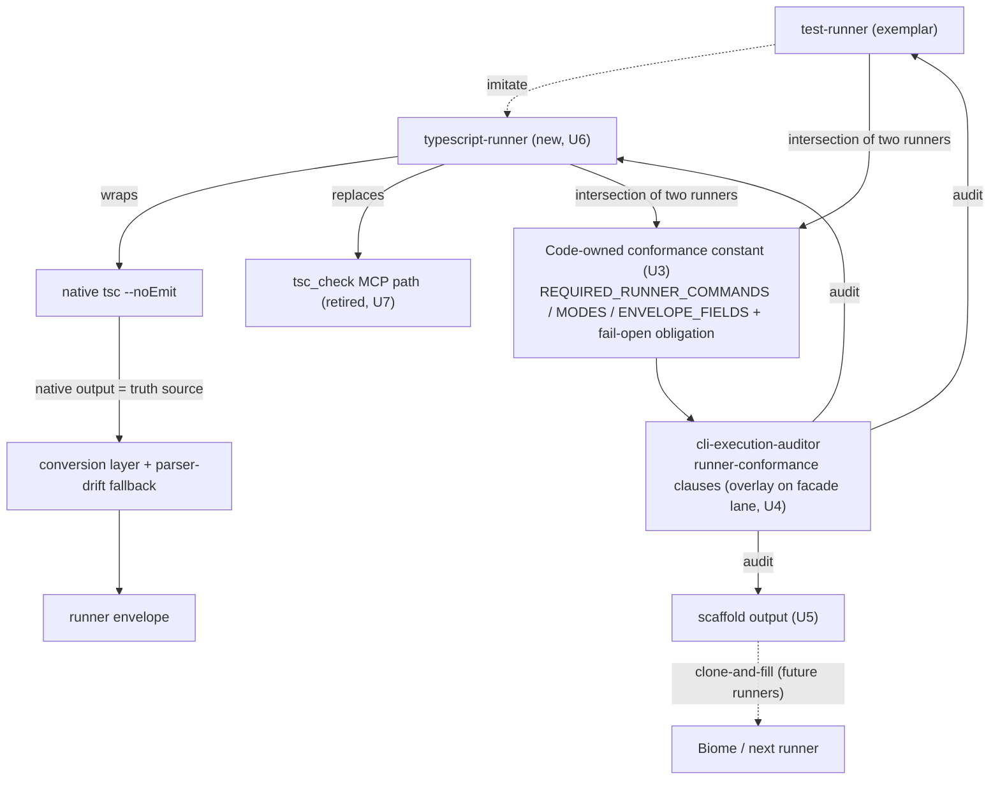
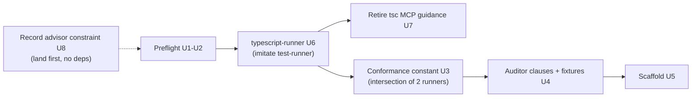

# feat: Agent Runner gold standard + typescript-runner conversion

## Summary

Convert the first MCP-only check, **tsc**, into an agent-native `typescript-runner` by imitating `test-runner` — then **extract** the enforced Agent Runner gold standard (a code-owned conformance constant, `cli-execution-auditor` runner-conformance clauses, and a clonable scaffold) from the diff between the two real runners. The standard is a refactor backed by two consumers, not infrastructure speculated from one.

**Sequencing note (doc-review outcome):** an earlier draft built the standard first (from test-runner alone) and converted tsc against it. Five doc-reviewers converged — citing this repo's own `context/code-style.md` "name the second adapter before abstracting" pressure gate — that an N=1 standard risks encoding test-runner's accidents (e.g. `repair`/`triage`/`detail` are test-failure semantics tsc may lack) as universal law. The plan was re-sequenced to convert-first, extract-from-two.

This resumes a pre-authorized sequence: Decision 37 in `docs/decisions/2026-06-04-test-runner-compact-runner-decision-log.md` already named this follow-up ("same benchmark-backed pattern", target "no MCP tools for all routine quality runners") and the convergence brainstrom deferred Biome/tsc "until separate evidence exists" (`docs/brainstorms/2026-06-05-production-agent-test-runner-convergence-requirements.md`, R35). This plan is that separate evidence.

---

## Problem Frame

`test-runner` already has the proven shape of a production Agent Runner — `run`/`status`/`detail` subcommands, `compact`/`repair`/`triage` modes, a `command-contract.ts`, a fixed-gate benchmark, and `cli-execution-auditor` facade-lane proof. But that shape is one worked implementation, not a standard. There is no code-owned definition of "what makes a conformant runner," no mechanical check that a new runner matches it, and no scaffold to start from. "Clone test-runner" is tribal knowledge.

That blocks the rest of the runner family. `rules/code-quality.md` (an always-applied startup rule) hard-rules agents into the MCP path for Biome and tsc (`biome_lintCheck`, `tsc_check`). Until each check is a uniform agent-native runner, the family is ragged.

Two research findings reshape the approach from the brainstorm's framing:

1. **The auditor already validates facade-lane contracts generically** (`skills/cli-execution-auditor/src/clause-catalog.ts`, 9 clauses) — but it checks facade-universal properties (exit floor, help alignment, envelope validity), not runner-gold-standard shape (subcommands, modes, envelope fields, benchmark). The gold standard is *new clauses citing a code-owned constant*, not a new checker.
2. **A written prose contract the auditor separately re-checks would become a second source of truth** that drifts (ADR-0004; `docs/plans/2026-05-24-008-feat-runtime-contract-drift-check-plan.md`). The standard must be *derived from test-runner's live discovery surface* so it cannot drift.

The bet: convert tsc first by imitating test-runner, then extract the standard from what test-runner and typescript-runner genuinely share — so "required" is grounded in observed commonality across two runners, not one author's reading of one exemplar. The rest of the family and the downstream Command Surface Map / Task Doctor then follow on a mechanically-enforced, two-runner-validated foundation.

**Why convert-first.** The repo's `context/code-style.md` pressure gate says: build the plain module first, pull the abstraction out when the second real variant lands. `repair`/`triage`/`detail --handle` are test-failure projections in test-runner (persisted failure detail, expected/received forensics); whether they are *universal* to runners is unknown until a non-test runner exists. Converting tsc first answers that empirically. The standard's required-set is then the **intersection** of two conformant runners, which grounds "required" in fact rather than judgment.

---

## Requirements

Carried from origin (`docs/brainstorms/2026-06-14-agent-runner-gold-standard-requirements.md`):

**Preflight**
- R1. Smoke-test the current `test-runner`; record what each subcommand and mode actually produces so the standard is grounded in observed behavior.
- R2. Collate all prior runner material into a new `skills/test-runner/docs/` folder (link in place, do not move): the 3 runner brainstorms, 2 plans, 1 ideation, 1 decision log, and `context/bun-runner.md` as the family-guidance pointer.
- R3. The collation names the deferral thread it resumes (convergence R35 + decision-log Decision 37).

**Gold standard — contract**
- R4. The Agent Runner contract is expressed as a code-owned conformance constant (required subcommands, modes, result-envelope fields, proof obligations) plus a thin pointer doc. It is derived from test-runner's live surface, not a parallel prose spec.
- R5. The contract names owners, not copies them — points at `skills/cli-author/references/cli-command-facade.md`, `agent-native-cli-design.md`, and `runtime/cli-command-facade/AGENTS.md` rather than restating flags, schemas, or exit tables.
- R6. test-runner provably conforms to the contract — the new clauses pass against test-runner before any conversion.

**Gold standard — auditor enforcement**
- R7. `cli-execution-auditor` validates a runner against the gold-standard clauses (a runner-conformance overlay on the existing facade lane), auto-discovered, not hand-registered.
- R8. The auditor fails a deliberately non-conformant runner (missing a required subcommand, mode, or envelope field) and passes a conformant one — proven by good/bad fixtures.

**Gold standard — scaffold**
- R9. A scaffold emits a conformant runner skeleton (no existing generator to extend; mirror the auditor's `good-baseline` runnable-fixture precedent).
- R10. A scaffold-produced runner passes both the facade lane and the runner-conformance clauses with no manual conformance work.

**First conversion — proof**
- R11. `tsc` is converted into an agent-native `typescript-runner` conforming to the contract, auditor-green, inheriting native-output-as-truth + parser-drift fallback (convergence R15–R24).
- R12. The converted runner replaces the `tsc_check` MCP path (agents run it as a CLI).
- R13. `rules/code-quality.md`, `context/bun-runner.md`, and `skills/test-runner/SKILL.md:18` retire the tsc MCP-only guidance in lockstep, routed through `/prompt-system-workflow`; the auditor's `no-raw-runner` sanctioned regex adds the new runner's `tsc` invocation in the same move.

**Constraint carried forward**
- R14. Record "Task Doctor is an advisor (reduces over owner declarations), never an orchestrator" so the downstream doctor inherits it.

---

## Key Technical Decisions

- KTD0. **Convert first, extract the standard from two runners.** (Spine, set by doc-review.) Build typescript-runner by imitating test-runner (U6) before defining the conformance constant, clauses, or scaffold (U3-U5). The required-set is then the **intersection** of two conformant runners — grounded in observed commonality, not one author's reading of one exemplar. This honors `context/code-style.md`'s "name the second adapter before you abstract" gate and makes U3-U5 a refactor with two consumers rather than speculative infrastructure with one. The cost: the standard machinery lands later in the sequence; the gain: it cannot encode test-runner accidents (`repair`/`triage`/`detail` test-failure semantics) as universal law.
- KTD1. **The standard is a curated conformance constant + derived clauses, not a prose contract.** Express the gold standard as new `cli-execution-auditor` runner-conformance clauses citing a single exported code-owned constant (e.g. `REQUIRED_RUNNER_COMMANDS` / `REQUIRED_RUNNER_MODES` / `REQUIRED_ENVELOPE_FIELDS`), whose values are the intersection of test-runner and typescript-runner (KTD0). The clauses acquire each target's surface via subprocess discovery (the auditor's existing `target-contract.ts` pattern — never import the target module). This satisfies R4+R6+R8 with one mechanism and avoids the second-source-of-truth drift ADR-0004 forbids (see origin; learnings: `docs/plans/2026-05-24-008-feat-runtime-contract-drift-check-plan.md`). The pointer doc (R4/R5) is the only prose component; the code-owned constant is the machine-readable contract. **Honest drift property:** the auditor cannot drift from a *target's declared* surface (it reads the target's contract), but the *definition of "required"* in the constant is a curated, human-owned policy — not a derived value. It has an owner (the auditor skill) and changes through a deliberate edit, not silently. Do not claim the required-set "cannot drift"; claim only that target-conformance is mechanically checked.
- KTD2. **The runner-conformance clauses are an overlay on the facade lane, not a replacement.** The existing 9 facade clauses still run (exit floor, help, envelope validity). The runner clauses add a `--profile runner` (or a sibling `runner-clauses.ts` catalog) asserting runner-specific shape. test-runner passes both; a non-runner facade skill is unaffected.
- KTD3. **Fail-open is half the contract.** The conformance constant codifies the result envelope AND the parser-drift obligation (native output as truth source, fallback preserves exit status, drift is product behavior not a crash). Decision 37 requires each runner family to bring its own fixtures + fidelity signals; tsc owns a distinct native format from Bun, so it gets its own drift surface. Do not codify only the happy-path envelope.
- KTD4. **The scaffold is a runnable fixture-shaped template.** No `cli-author generate` exists. Mirror `skills/cli-execution-auditor/src/fixtures/good-baseline/` — a complete runnable skeleton with placeholders. Co-design it with the runner clauses so R10 holds (scaffold output is clause-clean by construction).
- KTD5. **tsc first.** Single check, simpler native output, narrowest blast radius (retires one MCP tool, `tsc_check`). Biome (3 tools, broader guidance cleanup) is the named follow-on. (Decided this session.)
- KTD6. **Guidance edits route through `/prompt-system-workflow`.** `rules/code-quality.md` (`alwaysApply: true`) and `context/bun-runner.md` (rendered into AGENTS.md as "Code Quality Runners") are startup surfaces. R13 never schedules a freehand edit. The `no-raw-runner` auditor clause and the human rule both encode "no raw tsc" — both change in lockstep or guidance contradicts runtime.
- KTD7. **Charter covers the conversion; the standard machinery is this plan's own bet.** Decision 37 pre-authorized the tsc *conversion* and MCP retirement (U6-U7) "using the same benchmark-backed pattern" — that half is resumed work. The conformance constant + clauses + scaffold (U3-U5) are a *new* abstraction this plan introduces, justified on their own merits (the downstream Map/Doctor + the second-runner-validated foundation per KTD0), not laundered as pre-authorized. The deferral reasoning (different failure shapes → separate fidelity signals per family) is a *requirement* on the conversion (KTD3).

---

## High-Level Technical Design





---

## Owner Map

- Exemplar / contract source: `skills/test-runner/` (`src/command-contract.ts`, `src/test-runner.ts`, `src/test-runner.benchmark.ts`).
- Conformance constant: new, co-located with the auditor clauses or beside the pointer doc (resolved in U3).
- Auditor owner: `skills/cli-execution-auditor/src/clause-catalog.ts`, `src/audit-engine.ts`, `src/fixtures/`.
- Facade runtime (do not modify — package-agnostic): `runtime/cli-command-facade/`.
- Scaffold owner: new (template dir; U5 resolves exact home).
- Converted runner: new `skills/typescript-runner/`.
- Guidance owners (via `/prompt-system-workflow`): `rules/code-quality.md`, `context/bun-runner.md`, `skills/test-runner/SKILL.md`.
- Workspace registration: root `package.json#workspaces.packages`.

---

## Output Structure

```text
skills/test-runner/docs/                    # U2 collation (links, not moves)
skills/cli-execution-auditor/src/
  runner-clauses.ts                         # U4 (or extend clause-catalog.ts)
  fixtures/good-runner-baseline/            # U4
  fixtures/bad-runner-missing-subcommand/   # U4
  fixtures/bad-runner-missing-mode/         # U4
  fixtures/bad-runner-missing-field/        # U4
skills/<scaffold-home>/                     # U5 (template dir of the runner file set)
skills/typescript-runner/                   # U6
  SKILL.md  PROVENANCE.md  package.json  tsconfig.json
  src/command-contract.ts
  src/typescript-runner.ts
  src/typescript-runner.sh
  src/typescript-runner.benchmark.ts
  src/typescript-runner.test.ts
  src/fixtures/
```

---

## Implementation Units

### U1. Smoke-test and document the test-runner surface

**Goal:** Capture what test-runner actually produces so the conformance constant is grounded in observed behavior, not assumption.

**Requirements:** R1.

**Dependencies:** None.

**Files:**
- `skills/test-runner/docs/surface-evaluation.md` (create)

**Approach:** Run `run`/`status`/`detail` across `compact`/`repair`/`triage` modes and the output formats; record the result-envelope fields actually emitted, exit codes, and the benchmark/proof obligations. This is the empirical input to U3 — the constant is derived from this, not invented.

**Execution note:** Observation before codification — run the real surface and record it before writing the constant.

**Patterns to follow:** `skills/test-runner/SKILL.md` command + verification sections; the result envelope in `skills/test-runner/src/test-runner.ts`.

**Test scenarios:** Test expectation: none — evidence-gathering doc, no behavioral change.

**Verification:** The doc enumerates every subcommand, mode, envelope field, and exit code test-runner emits, sufficient for U3 to cite without re-running the surface.

### U2. Collate prior runner history

**Goal:** Make `skills/test-runner/docs/` the single entry point to test-runner's prior thinking.

**Requirements:** R2, R3.

**Dependencies:** None.

**Files:**
- `skills/test-runner/docs/README.md` (create)

**Approach:** Link (do not move — preserves cross-references) the 3 brainstorms, 2 plans, 1 ideation, 1 decision log named in the origin Sources, plus `context/bun-runner.md`. Name the deferral thread resumed: convergence R35 + decision-log Decision 37 ("no MCP tools for all routine quality runners").

**Patterns to follow:** `skills/test-runner/PROVENANCE.md` (existing pointer style).

**Test scenarios:** Test expectation: none — documentation collation.

**Verification:** Every prior artifact in the origin Sources is reachable from `skills/test-runner/docs/README.md`; the Decision 37 charter is cited.

### U3. Extract the code-owned runner-conformance constant from two runners

**Goal:** A single exported constant that defines a conformant runner, as the intersection of test-runner (U1) and typescript-runner (U6) — observed commonality, not one exemplar's shape.

**Requirements:** R4, R5, R6.

**Dependencies:** U1, U6. (U1 for test-runner's surface; U6 because the constant is the intersection of two real runners per KTD0 — a mode/subcommand test-runner has but tsc legitimately lacks is dropped to optional, not codified as required.)

**Files:**
- `skills/cli-execution-auditor/src/runner-contract.ts` (create — constant + thin pointer doc location resolved here)
- `skills/cli-execution-auditor/src/runner-contract.test.ts` (create)
- `skills/test-runner/docs/runner-contract.md` (create — thin pointer doc, R4/R5)

**Approach:** Export `REQUIRED_RUNNER_COMMANDS` (`run`/`status`/`detail`), `REQUIRED_RUNNER_MODES` (`compact`/`repair`/`triage`), `REQUIRED_ENVELOPE_FIELDS`, and a fail-open obligation marker (native-output-as-truth + parser-drift fallback per KTD3). The pointer doc explains "what a conformant runner is" in prose and cites the constant + the facade owners (R5) — it holds zero duplicated values.

**Derivation caveat (resolve at execution):** subprocess discovery (`target-contract.ts`) returns the facade contract object — command keys and `flags`/`exitCodes` are queryable, but **modes are not a first-class field** (in test-runner they live in the `--mode` flag's description string / a TS type alias). So `REQUIRED_RUNNER_COMMANDS` and `REQUIRED_ENVELOPE_FIELDS` can be derived-and-asserted against the live surface, but `REQUIRED_RUNNER_MODES` cannot today. Pick one before coding: (a) add a structured `values: ["compact","repair","triage"]` enum field to the `--mode` flag in test-runner's contract so it becomes queryable (preferred — makes the derivation real), or (b) treat `REQUIRED_RUNNER_MODES` as a curated constant cross-checked (not derived) against the contract. This is the concrete form of KTD1's "curated policy, not derived value."

**Universality is now resolved by construction (KTD0).** Because U6 lands first, the constant is the *intersection* of test-runner and typescript-runner. `repair`/`triage`/`detail --handle` are test-failure semantics; whichever of them typescript-runner did NOT genuinely need (it would have used a synthetic empty mode in U6, the tell) is dropped to optional here rather than codified as required. The required-set is exactly what both runners share for real — no author judgment about hypothetical future runners.

**Execution note:** Test-first — assert the constant matches test-runner's discovered surface before wiring clauses.

**Patterns to follow:** `skills/cli-execution-auditor/src/clause-catalog.ts:11` (cite code-owned source, never restate a contract); the drift-check derive-from-live-surface pattern in `docs/plans/2026-05-24-008-feat-runtime-contract-drift-check-plan.md`.

**Test scenarios:**
- Happy: the constant's required commands/modes/fields are each present in BOTH test-runner's and typescript-runner's discovered contracts (the intersection holds against both, R6).
- Edge: a runner declaring a superset of modes still conforms (required is a floor, not an exact match).
- Edge: a field test-runner has but typescript-runner lacks is NOT in the required-set (proves intersection, not test-runner-superset).
- Error: the test fails loud if either runner's surface no longer contains a required field (anchored to live surfaces).
- Covers R6: both runners provably conform.

**Verification:** The constant exists, both test-runner and typescript-runner conform against it, and the pointer doc duplicates no values.

### U4. Add runner-conformance clauses + fixtures to the auditor

**Goal:** The auditor mechanically validates any runner against the gold standard.

**Requirements:** R7, R8.

**Dependencies:** U3.

**Files:**
- `skills/cli-execution-auditor/src/runner-clauses.ts` (create — or extend `clause-catalog.ts`)
- `skills/cli-execution-auditor/src/audit-engine.ts` (modify — wire the clauses, add `--profile runner` selection)
- `skills/cli-execution-auditor/src/command-contract.ts` (modify — declare the `--profile` flag if added)
- `skills/cli-execution-auditor/src/audit-engine.test.ts` (modify)
- `skills/cli-execution-auditor/src/fixtures/good-runner-baseline/` (create)
- `skills/cli-execution-auditor/src/fixtures/bad-runner-missing-subcommand/` (create)
- `skills/cli-execution-auditor/src/fixtures/bad-runner-missing-mode/` (create)
- `skills/cli-execution-auditor/src/fixtures/bad-runner-missing-field/` (create)

**Approach:** Add static + surface clauses (required-subcommands-present, required-modes-present, required-envelope-fields-present, benchmark-declared), each citing the U3 constant and acquiring the target surface via subprocess discovery (the existing `target-contract.ts` pattern, never import). Gate them behind a runner profile so non-runner facade skills are unaffected (KTD2). The bad fixtures are the checker-correctness oracle (R8).

**`--profile runner` is more than a typed-array add (feasibility):** the catalog is a typed array, but wiring a profile also touches: (1) a new enum flag `--profile` in the auditor's own `command-contract.ts` (with values `["runner"]`, so the auditor's self-audit help-flag-alignment clause passes); (2) a new case in `parseAuditorArgv`'s switch (unknown flags currently throw usage error); (3) a profile-gated dispatch path in `runStaticAudit`/`runSurfaceAudit` that skips runner clauses unless `--profile runner` is set; (4) a decision on whether runner clause IDs join `AUDIT_CLAUSE_IDS` (making them `--only`-selectable). Account for all four, not just the clause array.

**Modes-queryability prerequisite:** the required-modes clause needs modes to be a queryable field. Per U3's derivation caveat, this likely requires adding a structured `values: [...]` field to the `--mode` flag in each runner's contract (test-runner and typescript-runner) so subprocess discovery can read modes without scraping a description string.

**Execution note:** Test-first — write the bad fixtures and assert each clause fails before implementing the assertions.

**Patterns to follow:** the existing 9 clauses in `skills/cli-execution-auditor/src/clause-catalog.ts`; the good/bad fixture corpus pattern; `good-baseline` as the conformant-skeleton precedent.

**Test scenarios:**
- Happy: `audit test-runner --profile runner` AND `audit typescript-runner --profile runner` both exit 0 (the intersection-derived constant conforms against both real runners — this is also U6's retroactive runner-profile check).
- Error: `bad-runner-missing-subcommand` fails the required-subcommands clause; `bad-runner-missing-mode` fails the modes clause; `bad-runner-missing-field` fails the envelope clause.
- Edge: a non-runner facade skill (e.g. record-decision) is unaffected by the runner profile (clauses skip or are not selected).
- Integration: the clauses acquire the target via subprocess discovery, not module import (drift in a target does not crash the auditor).
- Covers R8: deliberately non-conformant runner fails; both real runners pass.

**Verification:** both test-runner and typescript-runner pass the runner profile; each bad fixture fails its targeted clause; non-runner skills are unaffected.

### U5. Build the runner scaffold

**Goal:** A clonable skeleton that emits a runner conformant to both the facade lane and the runner profile.

**Requirements:** R9, R10.

**Dependencies:** U3, U4. (U3 for the conformance constant the scaffold must satisfy; U4 for the clause set used to verify R10. Both test-runner and typescript-runner already exist by now, so the scaffold is extracted from two real runners, not templated from one.)

**Scaffold home — resolve before coding (was deferred):** recommended `skills/agent-runner-scaffold/` as a standalone template dir — not under `cli-author` (a design-guidance skill, not a template store) and not under `cli-execution-auditor` (owns validation, not templates). Record the choice in U8's decision log.

**Files:**
- `skills/agent-runner-scaffold/` template dir (create — or the home resolved above)
- template files: `command-contract.ts`, `<runner>.ts`, `<runner>.sh`, `<runner>.benchmark.ts`, `package.json`, `tsconfig.json`, a fixture, `SKILL.md`, `PROVENANCE.md` (all with placeholders)

**Approach:** Extract the template from the two concrete runners (test-runner + typescript-runner) — the placeholders are exactly what differs between them; the fixed skeleton is what they share. Mirror `skills/cli-execution-auditor/src/fixtures/good-baseline/` (a complete runnable skeleton). Co-design with U4's clauses so a filled scaffold passes both profiles with zero manual conformance work (R10). Auto-discovery is preserved — a scaffolded runner is found by the workspace-facade enumeration, not a hand-registered list (avoids janitor tax).

**Execution note:** Prove R10 by auditing a freshly-filled scaffold instance, not by inspection.

**Patterns to follow:** `good-baseline` fixture; the test-runner file set as the shape to template.

**Test scenarios:**
- Happy: a scaffold instance filled with a trivial check passes `audit <instance>` on both facade and runner profiles.
- Edge: the scaffold's placeholders are all substitutable without leaving a non-conformant artifact.
- Covers R10: scaffold output passes the auditor with no manual conformance work.

**Verification:** A filled scaffold instance audits clean on both profiles.

### U6. Convert tsc into typescript-runner (by imitating test-runner)

**Goal:** The first real conversion — an agent-native runner wrapping `tsc --noEmit`, built by direct imitation of test-runner (the standard does not exist yet, by design — KTD0). This is the second runner the standard will be extracted from.

**Requirements:** R11, R12.

**Dependencies:** U1. (Imitates test-runner directly — no constant, clauses, or scaffold yet; those come after, extracted from this runner plus test-runner.)

**Files:**
- `skills/typescript-runner/` (create, imitating the `skills/test-runner/` file set): `SKILL.md`, `PROVENANCE.md`, `package.json`, `tsconfig.json`, `src/command-contract.ts`, `src/typescript-runner.ts`, `src/typescript-runner.sh`, `src/typescript-runner.benchmark.ts`, `src/typescript-runner.test.ts`, `src/fixtures/`
- root `package.json` (modify — register the workspace)

**Approach:** Wrap `tsc --noEmit -p tsconfig.json`; parse native diagnostics into the runner envelope with native output as truth source and a parser-drift fallback that preserves exit status (KTD3, convergence R15–R24). Bring its own fixtures and a fixed-gate benchmark capturing the `tsc_check` MCP baseline (mirror `skills/test-runner/src/capture-mcp-baseline.ts`). Read `skills/create-skill/references/skill-design-decision-runbook.md` before authoring the SKILL.md.

**tsc parse strategy — decide during characterization (feasibility):** tsc has no native `--json`; default output is human-formatted, multi-line, color-wrapped. Most feasible path: parse `tsc --noEmit --pretty false` (normalizes color + line-wrap) with an explicit multi-line-diagnostic aggregation strategy. The TypeScript compiler API is a heavier alternative (adds a `typescript` devDependency) — out of scope unless regex parsing proves unworkable. Name the chosen strategy in the characterization output before writing the conversion layer. tsc's drift surface ("diagnostic text format changed") differs from Bun's ("JSON reporter schema changed") — derive tsc's specific drift detectors here, do not copy Bun's.

**Honest-modes mandate (feeds U3's intersection, KTD0):** map tsc onto `run`/`status`/`detail` and `compact`/`repair`/`triage` only where each is genuinely meaningful. If tsc has no real repair-vs-triage distinction or no `detail --handle` analog, **do not fake an empty mode to look conformant** — omit it. A synthetic/empty mode here is the signal U3 uses to drop that mode from the required-set. Honest omission is the point of converting before standardizing.

**Execution note:** Characterization-first — capture the MCP `tsc_check` baseline and real tsc native output before building the conversion layer, so the parser-drift surface is grounded.

**Patterns to follow:** the full `skills/test-runner/` file set; `capture-mcp-baseline.ts` for the baseline; the fixed-gate benchmark with a `GatePreset`.

**Test scenarios:**
- Happy: a clean project produces a passing envelope (exit 0); a project with a type error produces a failing envelope (exit 1) with diagnostics in the envelope.
- Edge: zero TS files / empty input does not vacuously pass (the `no-vacuous-pass-on-empty-set` clause).
- Error: malformed/unparseable tsc output triggers the fallback — native output returned, conversion marked degraded, exit status preserved, repair metadata emitted (not a crash).
- Error: usage error exits 2.
- Integration: `audit typescript-runner` passes the **facade lane** (the runner profile does not exist yet — runner-profile conformance is confirmed in U4 once the clauses land, and a failure there is a signal to adjust the constant's intersection, not necessarily this runner).
- Covers R11: conforms (facade-clean now, runner-profile-clean after U4), inherits fail-open. Covers R12: runs as a CLI replacing tsc_check.

**Verification:** typescript-runner audits clean on the facade lane, benchmark gate passes vs the tsc_check baseline, and it runs `tsc --noEmit` as a CLI producing the runner envelope. (Runner-profile conformance is verified retroactively in U4.)

### U7. Retire the tsc MCP-only guidance in lockstep

**Goal:** Guidance and runtime agree — agents are routed to typescript-runner, not `tsc_check`.

**Requirements:** R13.

**Dependencies:** U6.

**Files:**
- `rules/code-quality.md` (modify — via `/prompt-system-workflow`; startup hard-rule surface)
- `context/bun-runner.md` (modify — via `/prompt-system-workflow`; rendered into AGENTS.md as "Code Quality Runners")
- `skills/test-runner/SKILL.md` (modify directly — line 18 "Keep lint, format, and type gates on MCP runners"; an on-demand skill file, NOT a startup surface, so it does not route through `/prompt-system-workflow`)
- `skills/cli-execution-auditor/src/audit-engine.ts` (modify — add typescript-runner's `tsc` invocation to the `no-raw-runner` sanctioned regex)
- `skills/cli-execution-auditor/src/audit-engine.test.ts` (modify)

**Approach:** Route the two startup-surface edits (`rules/code-quality.md`, `context/bun-runner.md`) through `/prompt-system-workflow`; edit `skills/test-runner/SKILL.md` directly (on-demand skill file, not a startup surface). Retire `tsc_check` from the hard rule and the Types section, leave Biome's MCP guidance intact (it is the named follow-on). In the same move, update the auditor's `no-raw-runner` sanctioned regex: current `test-runner\.sh|biome_|tsc_check` → target form sanctions typescript-runner's own `tsc` spawn path (e.g. `test-runner\.sh|biome_|typescript-runner`) and removes `tsc_check`, so the runner wrapping tsc is not flagged while raw `tsc` elsewhere still is. The regex delta and the guidance retirement land in the same commit (KTD6) — never one before the other.

**Execution note:** Verify no guidance file still routes type checks to `tsc_check` after the edit (no contradiction left, R13).

**Patterns to follow:** `skills/prompt-system-workflow/SKILL.md`; the existing `sanctioned` regex in `audit-engine.ts`.

**Test scenarios:**
- Happy: the auditor's `no-raw-runner` clause passes for typescript-runner (its tsc invocation is sanctioned).
- Edge: raw `tsc` outside the sanctioned runner is still flagged (the allowlist widened only for the runner).
- Covers R13: no guidance file routes type checks to the MCP path post-edit.

**Verification:** `rules/code-quality.md`, `context/bun-runner.md`, and test-runner SKILL.md no longer route type checks to `tsc_check`; the auditor no longer flags typescript-runner's own tsc call; raw tsc elsewhere still flags.

### U8. Record the advisor-not-orchestrator constraint

**Goal:** The downstream Task Doctor inherits the settled constraint rather than re-litigating it.

**Requirements:** R14.

**Dependencies:** None. **Sequence first** (alongside U1/U2): it has no dependencies, costs minutes, and records a settled constraint the downstream doctor depends on — landing it first de-risks plan interruption (if the plan stops after U7, the constraint is already recorded, not lost as the last unit dropped).

**Files:**
- `docs/decisions/2026-06-14-001-agent-runner-gold-standard-decision-log.md` (create) OR append to an existing runner decision log

**Approach:** Record: "Task Doctor is an advisor (reduces over owner-declared predicates), never an orchestrator (derives and runs routes)." Reference the ideation (`docs/ideation/2026-06-14-task-doctor-ideation.html`) and this plan as the runner-family foundation the doctor depends on.

**Patterns to follow:** `record-decision` skill format; existing logs in `docs/decisions/`.

**Test scenarios:** Test expectation: none — decision record.

**Verification:** The decision is recorded and discoverable from `docs/decisions/`.

---

## Scope Boundaries

### In scope

- Preflight smoke-test + collation (U1–U2).
- Code-owned conformance constant derived from test-runner's surface (U3).
- Auditor runner-conformance clauses + good/bad fixtures (U4).
- A clonable runner scaffold (U5).
- Converting **tsc** into typescript-runner (U6).
- Retiring tsc's MCP-only guidance in lockstep, routed through `/prompt-system-workflow` (U7).
- Recording the advisor constraint (U8).

### Deferred to Follow-Up Work

- Converting **Biome** into format-runner (the second runner; retires `biome_lintCheck`, `biome_lintFix`, `biome_formatCheck`).
- Wiring the runner profile into the `check:workspace-facade` enforcement gate (the v2-spike ramp in `docs/plans/2026-06-11-001-spike-cli-execution-auditor-v2-gate-sketch.md`).

### Outside this product's identity

- The generated **Command Surface Map** and per-owner applies-when predicates (the next direction; see `docs/ideation/2026-06-14-task-doctor-ideation.html`).
- **Task Doctor** itself — advisor-only (U8), built once the family is uniform and the Map exists.
- Task Doctor deriving and running checks (orchestrator).
- Replacing native tool output as the truth source — native output stays authoritative for every runner (convergence decision, unchanged).

---

## Acceptance Examples

- AE1. Given test-runner's live surface, when the conformance constant is derived and `audit test-runner --profile runner` runs, then it exits 0 (R6).
- AE2. Given a runner fixture missing the `detail` subcommand, when audited under the runner profile, then the required-subcommands clause fails (R8).
- AE3. Given a freshly-filled scaffold instance, when audited, then it passes both the facade lane and the runner profile with no manual conformance work (R10).
- AE4. Given a project with a type error, when typescript-runner runs, then it produces a failing envelope (exit 1) with the diagnostic in the envelope, running `tsc --noEmit` as a CLI (R11, R12).
- AE5. Given unparseable tsc output, when typescript-runner runs, then it returns native output, marks the conversion degraded, preserves exit status, and emits repair metadata — it does not crash (R11, KTD3).
- AE6. Given the conversion has landed, when the guidance files are read, then none route type checks to `tsc_check`, and the auditor does not flag typescript-runner's own tsc invocation (R13).

---

## System-Wide Impact

- Type checking moves from an MCP tool to an agent-native CLI; agents gain bounded, repair-shaped tsc packets instead of MCP output.
- `cli-execution-auditor` gains a reusable runner-conformance profile — every future runner (Biome next) inherits mechanical proof.
- The scaffold makes "new agent-native runner" a clone-and-fill operation rather than tribal imitation.
- `rules/code-quality.md` and `context/bun-runner.md` shift their type-check guidance; Biome stays on MCP until its own conversion.
- The advisor constraint is locked for the downstream Task Doctor work.

---

## Risks & Dependencies

- **Risk: the conformance constant drifts from test-runner's real surface.** Mitigation: derive it via subprocess discovery and assert it against the live surface in U3 (fails loud, never a hand-maintained copy — ADR-0004).
- **Risk: the `no-raw-runner` clause flags the very runner that wraps tsc.** Mitigation: U7 adds the sanctioned invocation in lockstep with the guidance retirement (KTD6).
- **Risk: freehand edits to startup surfaces.** Mitigation: U7 routes `rules/code-quality.md` and `context/bun-runner.md` through `/prompt-system-workflow`.
- **Risk: tsc parser drift is treated as a crash.** Mitigation: KTD3 makes fail-open a contract requirement; U6's error scenarios prove it.
- **Dependency:** the auditor can express a profile overlay without disturbing the 9 facade clauses (U4 confirms; the catalog is a typed array, the established extension point).
- **Dependency:** `skills/create-skill/references/skill-design-decision-runbook.md` read before authoring typescript-runner's SKILL.md (U6).

---

## Alternative Approaches Considered

- **Written prose contract the auditor re-checks separately** (origin's literal R4 framing). Rejected: creates a second source of truth that drifts from what the auditor enforces (ADR-0004; learnings). KTD1 derives the standard from the live surface instead.
- **Biome first.** Rejected for the first proof: 3 MCP tools + broader guidance cleanup is a wider blast radius than needed to prove the standard. tsc is the simpler first conversion (KTD5); Biome is the named follow-on.
- **Generalize the facade lane itself to include runner shape.** Rejected: the facade runtime is package-agnostic and owns shape grammar only (`runtime/cli-command-facade/AGENTS.md`); runner-specific requirements belong in the consumer/auditor layer (KTD2).

---

## Sources And Research

- Origin: `docs/brainstorms/2026-06-14-agent-runner-gold-standard-requirements.md`.
- Charter (pre-authorized follow-up): `docs/decisions/2026-06-04-test-runner-compact-runner-decision-log.md` Decision 37; convergence deferral `docs/brainstorms/2026-06-05-production-agent-test-runner-convergence-requirements.md` R35.
- Transferable runner pattern (native-output-as-truth, fail-open): `docs/brainstorms/2026-06-05-production-agent-test-runner-convergence-requirements.md` R15–R24.
- Auditor substrate: `skills/cli-execution-auditor/src/clause-catalog.ts`, `src/audit-engine.ts`, `src/target-contract.ts`; `docs/plans/2026-06-10-001-feat-cli-execution-auditor-plan.md`; enforcement-gate blueprint `docs/plans/2026-06-11-001-spike-cli-execution-auditor-v2-gate-sketch.md`.
- Drift-prevention pattern: `docs/plans/2026-05-24-008-feat-runtime-contract-drift-check-plan.md`; ADR-0004.
- Exemplar: `skills/test-runner/` (command-contract.ts, test-runner.ts, test-runner.benchmark.ts, capture-mcp-baseline.ts).
- Facade owners (cited, not copied): `skills/cli-author/references/cli-command-facade.md`, `agent-native-cli-design.md`, `runtime/cli-command-facade/AGENTS.md`.
- Guidance to retire: `rules/code-quality.md`, `context/bun-runner.md`, `skills/test-runner/SKILL.md:18`.
- Downstream direction: `docs/ideation/2026-06-14-task-doctor-ideation.html`.
