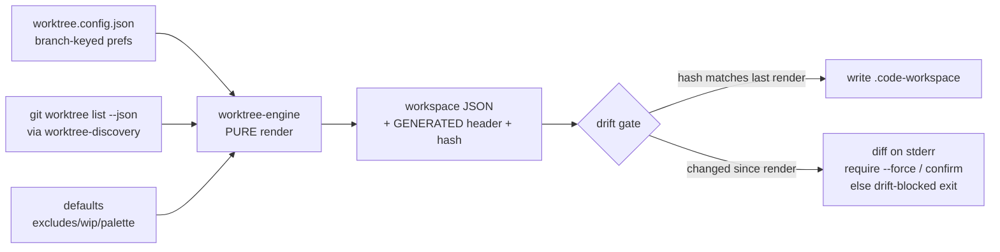

# feat: `worktree` — Worktree Workspace Renderer CLI + Thin Skill

## Summary

Build `worktree`, a facade-backed agent-native CLI (under `skills/worktree/`) that renders a per-repo VS Code `.code-workspace` from a branch-keyed registry joined with live worktree state, baking in ADHD scaffolding (per-worktree color, window title, focus-folder pairs, noise excludes, WIP folder). Owned verbs (`sync`/`focus`/`color`/`open`) render; delegated verbs (`new`/`rm`/`clean`) shell out to `@side-quest/git worktree` and re-render. A thin `SKILL.md` names owners and routes; the `.code-workspace` becomes generated output, drift-gated against manual edits.

---

## Problem Frame

Nathan hand-edits his VS Code workspace file across git worktrees. Manual editing is fragile, doesn't scale across repos, and carries no ADHD scaffolding (identical window names/colors/noisy trees → wrong-window commits, "which window was I in?" tax). The fix: make the workspace generated from a durable source of truth, with color/naming/focus/noise-reduction baked into the render. See origin: `docs/brainstorms/2026-06-14-worktree-worktree-workspace-renderer-requirements.md`.

---

## Requirements

### Rendering

- R1. `worktree sync [repo]` renders `<repo>.code-workspace` from the registry joined with live `@side-quest/git worktree list` output.
- R2. Each worktree renders as a focus+full-repo folder pair: focused subfolder entry on top, collapsible full-repo entry below.
- R3. Each worktree gets a distinct `workbench.colorCustomizations` (title-bar + activity-bar) and `window.title`.
- R4. The render emits `files.exclude`, a mirrored `search.exclude`, `explorer.fileNesting`, and a pinned WIP scratch folder at the top.
- R5. Focus subfolder is read from the registry; when unset, guessed from the branch name; always overridable.
- R6. Color is read from the registry; when unset, auto-assigned deterministically by branch hash so it is stable across re-renders.

### Registry (source of truth)

- R7. Prefs live in a gitignored `worktree.config.json` at repo root, keyed by branch name, so prefs survive worktree delete/recreate.
- R8. `worktree focus <branch> <subfolder>` and `worktree color <branch> <color>` write the registry, then re-render.

### Delegation (one front door)

- R9. `worktree new <branch>` / `worktree rm <branch>` / `worktree clean` delegate to `@side-quest/git worktree` (`create` / `delete` / `orphans --delete`), then re-render.
- R10. Delegated verbs never re-implement worktree CRUD; they parse the upstream CLI's JSON output.

### Launcher

- R11. `worktree open [name]` opens the named repo's workspace via `code`; with no arg, it lists known workspaces to stdout (parseable).

### Drift safety

- R12. The rendered `.code-workspace` carries a `GENERATED by worktree` header plus a content hash.
- R13. `worktree sync` detects when the file changed since the last render and blocks overwrite: show a diff on stderr, require `--force` (or interactive confirm); non-interactive runs get a distinct drift-blocked exit code plus a structured action. Never silently clobbers.

### Contract integrity

- R14. The CLI is facade-backed via `@side-quest/cli-command-facade`; advertised flags, help, argv acceptance, and runtime semantics are proven aligned by a Command Surface Alignment Proof.
- R15. The skill body stays thin: it names owner paths and routes; it copies no contracts, flags, or schemas.

---

## Key Technical Decisions

- **Facade-backed lane, mirroring `record-decision`**: `worktree` carries the same `src/command-contract.ts` + `src/model.ts` + `src/worktree.ts` (dispatcher) + `src/worktree-engine.ts` (pure render) + `src/worktree.test.ts` layout and depends on `@side-quest/cli-command-facade` (`workspace:*`). Rationale: the repo already runs this lane; the facade enforces the four drift surfaces R14 needs; `record-decision` is the closest analog (small, write-oriented, owned + dry-run verbs). (see origin: CLI contract table)
- **Pure render engine**: `worktree-engine.ts` is `(registry, worktreeList, defaults) → workspaceJSON` with no I/O — testable in isolation, the heart of the Command Surface Alignment Proof's runtime probes. The dispatcher owns file reads/writes, `code` launch, and diff display. Mirrors `record-engine.ts`'s pure/IO split.
- **Color palette + hash**: a fixed named palette of 8 (`blue`, `green`, `amber`, `purple`, `red`, `teal`, `pink`, `slate`), each mapping to a `colorCustomizations` block. Auto-assignment uses `djb2(branch) % 8` — deterministic, dependency-free, stable across re-render (resolves origin open question). Free-form hex is a v2 escape hatch, not built now.
- **Drift-hash storage = embedded header comment** in the `.code-workspace` (resolves origin open question). No sidecar file to gitignore, lose, or desync; the generated file is self-describing. `sync` reads the header hash, recomputes the hash of the body, and compares. `.code-workspace` is JSONC-tolerant in VS Code, so a leading `// GENERATED …` comment block is safe.
- **`code` binary resolution = PATH-first**, with an explicit `defaults.codeBin` override in the registry (resolves origin open question). Matches the repo's PATH-first precedent in `browser-use/src/mcporter-transport.ts`. If `code` is not found, R11 fails with a usage-class diagnostic, not a crash.
- **Delegation via subprocess + JSON parse**, mirroring `browser-use/src/preflight-warm-chrome.ts`. A single `delegateWorktree(verb, args)` helper shells out, captures JSON, and surfaces upstream failures as `worktree` diagnostics — extracted before the third call site (`new`/`rm`/`clean`).
- **Branch→focus guess heuristic**: strip the `type/` prefix, map a trailing `-refactor`/`-harden`/etc. token off the branch, then probe for `skills/<remainder>`; fall back to repo root if no match. Always overridable via `worktree focus`. Cheap and wrong-tolerant per origin.

---

## High-Level Technical Design

### Module ownership (maps to the contract's named owners)

```text
skills/worktree/
  SKILL.md                    # thin: owner paths + route, no copied contract
  package.json                # bin: worktree → src/worktree.ts; dep @side-quest/cli-command-facade
  tsconfig.json
  src/
    command-contract.ts       # Contract owner: verbs, flags, result literals, diagnostic codes, exit codes, actions
    model.ts                  # Model owner: Registry, RenderedWorkspace, DriftRecord types + CONTRACT_ID/SCHEMA_VERSION
    worktree-engine.ts              # Engine owner: PURE render + color-assign + focus-guess + drift-compare
    worktree-discovery.ts           # Discovery owner: live `git worktree list --json`, repo→workspace-path, registry load/freshness
    worktree.ts                     # CLI owner: argv dispatch, file IO, code launch, diff render, diagnostics
    worktree.test.ts                # Test owner: Command Surface Alignment Proof + engine unit tests
```

### Render data flow



### Verb routing

```mermaid
flowchart TD
  CLI[worktree dispatcher] --> SYNC[sync → engine → drift gate → write]
  CLI --> FOCUS[focus → write registry → sync]
  CLI --> COLOR[color → write registry → sync]
  CLI --> OPEN[open → list / launch code]
  CLI --> NEW[new → delegate create → sync]
  CLI --> RM[rm → delegate delete → sync]
  CLI --> CLEAN[clean → delegate orphans --delete → sync]
  NEW -.-> SQ[@side-quest/git worktree]
  RM -.-> SQ
  CLEAN -.-> SQ
```

---

## Output Structure

The greenfield layout (new directory hierarchy under `skills/worktree/`) is shown in the HTD module-ownership tree above. Per-unit `**Files:**` are authoritative.

---

## Implementation Units

### U1. Scaffold the package + thin SKILL.md

**Goal:** Stand up `skills/worktree/` mirroring `record-decision`'s package shape so the contract and engine have a home.
**Requirements:** R14, R15.
**Dependencies:** none.
**Files:** `skills/worktree/package.json`, `skills/worktree/tsconfig.json`, `skills/worktree/SKILL.md`, add `worktree.config.json` + `*.code-workspace` to the repo `.gitignore`.
**Approach:** Copy `record-decision`'s `package.json`/`tsconfig.json` shape; set `bin`/script to `src/worktree.ts`, dep `@side-quest/cli-command-facade: workspace:*`. SKILL.md follows the thin owner-naming pattern (Owner / Dependencies / Workflow / route to `cli-author` before contract changes) — no copied flags or schemas.
**Patterns to follow:** `skills/record-decision/package.json`, `skills/record-decision/SKILL.md`.
**Test scenarios:** Test expectation: none — scaffolding/config, no behavior. Verify `tsc_check` (MCP) passes on the empty package.
**Verification:** Package typechecks; SKILL.md YAML-parses; `.gitignore` covers the generated + registry files.

### U2. Model + command contract

**Goal:** Define the package-owned types and the facade command contract (verbs, flags, diagnostic codes, exit codes, actions).
**Requirements:** R8, R9, R11, R13, R14.
**Dependencies:** U1.
**Files:** `skills/worktree/src/model.ts`, `skills/worktree/src/command-contract.ts`.
**Approach:** `model.ts` exports `WORKTREE_CONTRACT_ID`, `WORKTREE_SCHEMA_VERSION`, and types `Registry`, `BranchPrefs`, `RenderedWorkspace`, `DriftRecord`. `command-contract.ts` calls `defineCommandFacadeContract` with verbs `sync | focus | color | open | new | rm | clean`, per-verb flags (`--repo`, `--force`, `--json`, `--no-input`, positional `<branch>`/`<subfolder>`/`<color>`/`<name>`), package-owned diagnostic codes (`usage_error`, `drift_blocked`, `registry_unreadable`, `worktree_list_failed`, `delegate_failed`, `unknown_color`, `code_not_found`, `write_failed`), exit codes (`0`/`1`/`2`/ plus the distinct drift code), and success/failure action affordances. Error hints stay prose-only with `docs_url` → `docs/git/worktree.md` (facade rejects inlined command strings).
**Patterns to follow:** `skills/record-decision/src/command-contract.ts`, `skills/record-decision/src/model.ts`.
**Test scenarios:**
- Covers R14. Contract constructs without throwing (facade validates at construction).
- Every advertised flag per verb is present in the contract; no foreign flags leak across verbs.
- Diagnostic-code union and exit-code map are exported and asserted from package-owned constants.
- `drift_blocked` maps to its own exit code distinct from `1`/`2`.
**Verification:** Contract instantiates; `tsc_check` passes; constants importable for the proof in U7.

### U3. Pure render engine

**Goal:** Implement `(registry, worktreeList, defaults) → workspace JSON` with color assignment, focus guessing, and the GENERATED header + hash.
**Requirements:** R2, R3, R4, R5, R6, R12.
**Dependencies:** U2.
**Files:** `skills/worktree/src/worktree-engine.ts`, `skills/worktree/src/worktree-engine.test.ts`.
**Approach:** Pure functions, no I/O. `renderWorkspace()` builds the `folders` array (focus pair per worktree, WIP folder pinned first), `settings` (`files.exclude` + mirrored `search.exclude` + `fileNesting` + per-worktree `colorCustomizations` keyed via multi-root folder settings or `window.title`). `assignColor(branch, prefs)` = registry value or `palette[djb2(branch) % palette.length]`. `guessFocus(branch, repoRoot)` per the KTD heuristic. `stampHeader(bodyJSON)` prepends the `// GENERATED by worktree … hash:<h>` comment; `computeHash(body)` + `readHeaderHash(file)` + `isDrift(file)` support R12/R13.
**Patterns to follow:** `skills/record-decision/src/record-engine.ts` (pure/IO split).
**Test scenarios:**
- Happy path: two worktrees with explicit prefs → folders array has WIP first, then two focus pairs in order; settings carry excludes + mirrored search.exclude + fileNesting.
- Color: unset color is deterministic across two calls for the same branch; two different branches can collide (documented, acceptable) but same branch never changes.
- Focus guess: `codex/harden-test-runner` → `skills/test-runner` when that dir is provided in the probe input; unknown branch → repo root.
- Edge: zero worktrees → valid workspace with just the WIP folder; missing `defaults.wip` → no WIP folder, no crash.
- Hash: `computeHash` is stable for identical body, differs when a folder changes; `readHeaderHash` round-trips `stampHeader`; `isDrift` true when body hash ≠ header hash.
**Verification:** Engine tests pass via `test-runner`; no filesystem access in the engine.

### U4. Discovery: worktree list + registry + path resolution

**Goal:** Read live worktree state from `@side-quest/git`, load the registry, and resolve repo→workspace path.
**Requirements:** R1, R7, R10.
**Dependencies:** U2.
**Files:** `skills/worktree/src/worktree-discovery.ts`, `skills/worktree/src/worktree-discovery.test.ts`.
**Approach:** `listWorktrees(repoRoot)` shells `@side-quest/git worktree list --all` (JSON) and parses to the engine's input shape, filtering temp/throwaway entries (e.g. `fallow-audit-*`, detached-HEAD temp dirs) so the render only shows real work. `loadRegistry(repoRoot)` reads `worktree.config.json` (absent → empty registry, not an error). `workspacePathFor(repoRoot)` → `<parent>/<repo>.code-workspace`. Subprocess + JSON parse mirrors `browser-use/src/preflight-warm-chrome.ts`; upstream failure → `worktree_list_failed` diagnostic.
**Patterns to follow:** `skills/browser-use/src/preflight-warm-chrome.ts` (subprocess + JSON parse + failure mapping).
**Test scenarios:**
- Happy path: a captured `git worktree list --all --json` fixture parses to N real worktrees; `fallow-audit-*` and temp detached-HEAD entries are filtered out.
- Error path: non-zero exit / unparseable output → `worktree_list_failed`, no throw.
- Registry: absent `worktree.config.json` → empty registry; malformed JSON → `registry_unreadable`.
- Path: `workspacePathFor` produces `<repo>.code-workspace` beside the repo.
**Execution note:** Capture a real `@side-quest/git worktree list --all --json` output as a fixture before writing the parser, so the shape is characterized, not guessed.
**Verification:** Discovery tests pass against fixtures; no live git needed in tests.

### U5. Dispatcher: owned verbs (sync / focus / color / open) + drift gate

**Goal:** Wire argv → handlers for the render-owning verbs, including the drift gate and the launcher.
**Requirements:** R1, R5, R6, R8, R11, R12, R13.
**Dependencies:** U3, U4.
**Files:** `skills/worktree/src/worktree.ts`, extend `skills/worktree/src/worktree.test.ts`.
**Approach:** Thin dispatcher (help, parse routing, unknown-verb, unexpected-failure wrap) + named handlers. `sync` = load registry + discovery → engine → drift gate → write or block. Drift gate: if `isDrift(existingFile)` and not `--force` and TTY → print diff to stderr + confirm; non-interactive → emit `drift_blocked` envelope + distinct exit, never write. `focus`/`color` validate (`color` against the palette → `unknown_color` on miss), write registry, then call `sync`. `open` with no arg lists workspaces to stdout; with a name, resolves the workspace and launches `code` (PATH-first, `code_not_found` on miss). Quiet success, rich failure (five recovery answers).
**Patterns to follow:** `skills/record-decision/src/record-decision.ts` (dispatcher + handlers + envelopes).
**Test scenarios:**
- Covers R13. `sync` over an unchanged generated file → rewrites cleanly, exit 0.
- Covers R13. `sync` over a manually-edited file (hash mismatch), non-interactive, no `--force` → `drift_blocked` exit, no write; with `--force` → overwrites, exit 0.
- `focus codex/x skills/y` writes registry then the workspace reflects the new focus pair.
- `color codex/x purple` writes registry; `color codex/x chartreuse` → `unknown_color`, exit 2.
- `open` (no arg) lists known workspaces to stdout as parseable JSON under `--json`.
- `open <name>` with `code` absent on PATH and no `codeBin` → `code_not_found`, exit 2.
- Integration: `focus` then `sync` produces a workspace whose top folder is WIP and whose pair order matches discovery order.
**Verification:** Owned-verb tests pass via `test-runner`; drift gate proven to block non-interactively.

### U6. Dispatcher: delegated verbs (new / rm / clean)

**Goal:** Wire the delegating verbs to `@side-quest/git worktree` + re-render, with one shared helper.
**Requirements:** R9, R10.
**Dependencies:** U5.
**Files:** extend `skills/worktree/src/worktree.ts`, extend `skills/worktree/src/worktree-discovery.ts` (or a sibling `worktree-delegate.ts`), extend `skills/worktree/src/worktree.test.ts`.
**Approach:** `delegateWorktree(verb, args, {force, noInput})` shells the matching `@side-quest/git worktree` subcommand (`create`/`delete`/`orphans --delete`), parses JSON, maps failure → `delegate_failed`. `rm`/`clean` are destructive: preview what will be removed first, pass `--force`/`--no-input` through, inherit the upstream confirmation. After a successful delegation, call `sync`. Extract `delegateWorktree` before the third call site.
**Patterns to follow:** `skills/browser-use/src/preflight-warm-chrome.ts` (subprocess + failure mapping).
**Test scenarios:**
- `new codex/x` invokes `worktree create` (assert via injected runner/spy) then triggers a re-render.
- `rm codex/x` non-interactive without `--force` → preview + refuse (or pass-through to upstream confirm), no silent delete.
- `clean` invokes `worktree orphans --delete`; a fixture with `fallow-audit-*` orphans is targeted; re-render follows.
- Error path: upstream non-zero exit → `delegate_failed`, surfaced with the five recovery answers, no re-render.
**Execution note:** Inject the subprocess runner so delegation is asserted without mutating real worktrees.
**Verification:** Delegated-verb tests pass with a spied runner; no real worktree is created/deleted in tests.

### U7. Command Surface Alignment Proof

**Goal:** Prove the four drift surfaces stay aligned: help, foreign-flag exclusion, argv accept/reject, runtime semantics.
**Requirements:** R14.
**Dependencies:** U5, U6.
**Files:** extend `skills/worktree/src/worktree.test.ts`.
**Approach:** Scenario tests using facade testing-subpath helpers where available. Cover: each advertised flag appears in rendered help; command-foreign flags excluded from help; public argv acceptance and rejection (e.g. `worktree color x chartreuse` rejected exit 2; `worktree sync --force` accepted); runtime semantics via probes (drift gate blocks; delegation actually calls the git CLI via the spy); result literals asserted from the package-owned constants in U2, not string copies.
**Patterns to follow:** `skills/record-decision/src/record-decision.test.ts` (proof scenarios).
**Test scenarios:**
- Help lists every per-verb advertised flag; a foreign flag (e.g. `--execute`) is absent.
- `worktree <unknown-verb>` → usage_error exit 2 with help pointer.
- Argv accept/reject matrix across all seven verbs.
- Runtime probe: drift-blocked path returns the package-owned `drift_blocked` literal and its distinct exit code.
**Verification:** Full proof passes via `test-runner`; `biome_lintCheck` + `tsc_check` (MCP) clean.

---

## Scope Boundaries

### In scope

The seven-verb front door, the pure render engine with all v1 render features (R1–R13), the facade contract + proof (R14), and the thin skill (R15).

### Deferred for later (origin v2)

- WORKTREES.md dashboard (branch, commits-ahead, dirty/clean, last-touched) — needs a live-git reader beyond render.
- Status-bar breadcrumb — needs a VS Code extension or a `window.title` fold-in.

### Deferred to Follow-Up Work

- Multi-repo orchestration beyond one-workspace-per-repo (a `worktree open` global index across all repos) — the registry is already repo-keyed, so this is additive.
- Free-form hex colors — the named palette ships first.
- Shell alias `worktree`→`worktree open` for ergonomics — a dotfiles change, not part of this CLI package.

---

## Risks & Dependencies

- **Upstream contract coupling (accepted):** `worktree`'s delegated verbs depend on `@side-quest/git worktree`'s JSON shape and subcommand flags. If that CLI changes, U6 breaks. Mitigation: a captured fixture (U4) characterizes the shape; `delegate_failed` surfaces breakage loudly rather than silently mis-parsing.
- **`colorCustomizations` placement:** per-worktree color in a multi-root `.code-workspace` may need to live in folder-level settings rather than a single workspace block; if VS Code can't scope color per folder, R3 degrades to per-worktree `window.title` only (still distinct windows). Resolve during U3 against a real reload.
- **JSONC header tolerance:** the `// GENERATED` comment relies on VS Code accepting comments in `.code-workspace`. It does today; if a future strict parser rejects it, fall back to a `"//generated"` JSON key. Low risk.
- **`code` on PATH:** the launcher needs the `code` shell command installed; absent → `code_not_found` (handled, not fatal to other verbs).

---

## Sources / Research

- Structural analog (mirror this): `skills/record-decision/` — `package.json`, `src/command-contract.ts`, `src/model.ts`, `src/record-engine.ts`, `src/record-decision.test.ts`.
- Delegation precedent (subprocess + JSON parse + failure mapping): `skills/browser-use/src/preflight-warm-chrome.ts`.
- PATH-first binary resolution precedent: `skills/browser-use/src/mcporter-transport.ts`.
- Facade runtime owner: `runtime/cli-command-facade/` (read `src/index.ts`, `src/command-facade.ts` for exact contract shape before U2).
- Upstream worktree CLI: `docs/git/worktree.md` (`@side-quest/git worktree` create/delete/orphans/list reference).
- Origin requirements + locked CLI contract: `docs/brainstorms/2026-06-14-worktree-worktree-workspace-renderer-requirements.md`.
