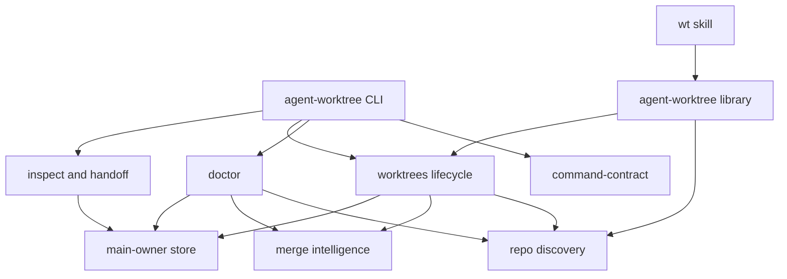
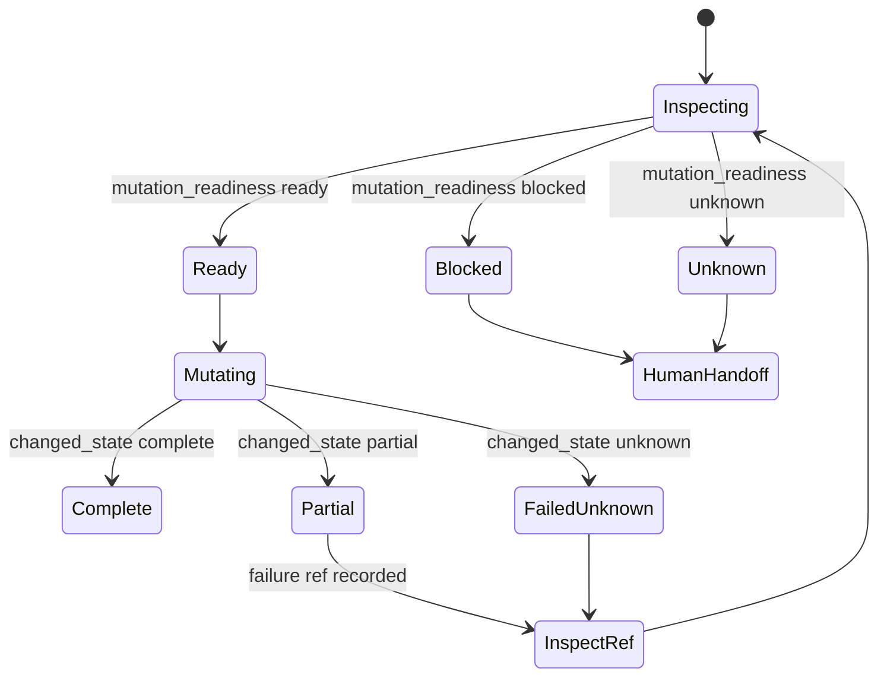

# feat: Add agent-worktree CRUD v1

## Summary

Build `agent-worktree` as a repo-local shared runtime package at `runtime/agent-worktree`, with `doctor` as the primary read surface and CRUD lifecycle commands behind a facade-backed CLI. The package ports the useful SideQuest Git worktree mechanics into this repo, but reshapes them around agent recovery, merge evidence, typed refs, durable state, and `wt` as the workflow front door.

---

## Problem Frame

The current `wt` skill owns workspace rendering, but delegates git and worktree truth to `@side-quest/git`. SideQuest Git has useful mechanics, especially list/status/delete/clean/merge evidence, but it was not designed as an agent-native recovery product. V1 replaces that split with one local owner that agents can inspect before mutation and after partial failure.

---

## Requirements

**Doctor and state map**

- R1. `doctor` returns the repo operability map: git root, main owner worktree, active worktree, linked worktrees, stale dirs, dirty branches, missing dependencies, contract health, available commands, blocked mutations, and next safe actions.
- R2. Doctor uses statuses `ok`, `warn`, `blocked`, and `unknown`, plus aggregate `mutation_readiness` as `ready`, `blocked`, or `unknown`.
- R3. Doctor succeeds in dirty or partially broken repos whenever read-only inspection can still return useful state.

**CRUD lifecycle**

- R4. V1 supports `list`, `create`, `status`, `check`, `delete`, `clean`, `recover`, `refresh`, `inspect`, and read-only `handoff` under the `agent-worktree` CLI.
- R5. `clean` is preview-only in v1 and classifies registered worktrees, orphan branches, and stale filesystem directories without deleting them. `clean` previews by default; `--preview` remains accepted as explicit safety spelling.
- R6. `create`, `delete`, `recover`, and `refresh` expose write preview or destructive safety gates through the facade contract.

**Failure and recovery**

- R7. Known failures answer what happened, what changed, whether same-input retry is safe, what to try next, and where diagnostics live.
- R8. Partial mutation paths persist enough state under the main-owner `.agent-worktree/` store for a later agent to inspect or resume.
- R9. Failure state uses typed refs (`worktree:<id>`, `run:<id>`, `failure:<id>`) and changed-state values `none`, `partial`, `complete`, `unknown`.
- R9a. `delete` creates a per-run backup ref at `refs/agent-worktree/backups/<branch>/<run-id>` before attempting branch deletion.

**Shared package and `wt` integration**

- R10. The shared package owns git/worktree model vocabulary, discovery, cleanup policy, destructive safety, merge evidence, and recovery result vocabulary.
- R11. `wt` keeps owning VS Code workspace rendering, focus/color preferences, drift gates, and open behavior.
- R12. `wt` stops depending on `@side-quest/git` once the shared package exposes equivalent worktree lifecycle behavior.
- R13. `wt` preserves upstream recovery classification when it wraps shared-package failures in its own facade envelope.

**Agent-native CLI contract**

- R14. The public CLI is facade-backed and proves discovery metadata, rendered help, public argv outcomes, and runtime semantics cannot drift.
- R15. Every command supports a non-interactive path and keeps JSON stdout parseable without human prose.
- R16. Diagnostics go to stderr or durable diagnostic surfaces, not mixed into machine JSON.
- R17. Large read outputs add projection or selection controls before they become context-heavy.

---

## Key Technical Decisions

- KTD1. **Doctor is the v1 spine:** mutation commands depend on the same readiness model that `doctor` exposes, so agents do not learn one state vocabulary for reads and another for failures.
- KTD2. **One flat package:** `runtime/agent-worktree` owns model, contract, discovery, lifecycle, merge evidence, store, inspect, and CLI files. Split packages wait until separate release or dependency pressure exists.
- KTD3. **Facade-backed CLI from the first slice:** `src/command-contract.ts` is the source for help, discovery, parser acceptance, and runtime proof.
- KTD4. **Plain owner modules over speculative registries:** command facade is earned; a plugin system, Strategy registry, and separate doctor package are rejected until real second adapters exist.
- KTD5. **Main-owner durable store:** `.agent-worktree/` lives at the main worktree owner root so recovery data survives linked worktree deletion. It is gitignored local operational state in v1; agents inspect it through `agent-worktree`, not Git review.
- KTD6. **Merge intelligence is core evidence:** status, check, delete, and clean decisions preserve ancestor merge, squash merge, ahead/behind, shallow clone, and upstream-gone evidence.
- KTD7. **`clean` stays preview-only in v1:** destructive batch cleanup waits until preview evidence, durable trails, and recovery semantics are proven. `clean` previews by default; `--preview` is an accepted alias for explicit safety.
- KTD8. **`wt` consumes the library, not the new CLI:** `wt` remains the workflow entry point, while git/worktree mechanics move to the shared runtime owner.
- KTD9. **Retention warns, never deletes in v1:** `doctor` warns when `.agent-worktree/` records or backup refs are older than 30 days. Automatic deletion and explicit pruning are deferred.
- KTD10. **Doctor maps state, even when blocked:** `doctor` exits `0` when it can return a readable map. Blockers and unknowns live in JSON data, and `mutation_readiness: unknown` never permits mutation.
- KTD11. **Destructive branch deletion is explicit:** `delete` removes the worktree by default. Branch deletion requires an explicit flag, a per-run backup ref, and `--force` for non-interactive destructive execution.
- KTD12. **Migration is read-first:** `wt` migrates shared discovery reads before lifecycle commands so workspace rendering remains stable while the runtime owner changes.
- KTD13. **Pattern labels stay pressure-owned:** architecture scaffolds use plain owner modules named by pressure, not GoF labels. Current earned scaffolds are doctor aggregation, merge evidence cascade, operation journal, typed ref resolution, recovery planning, and projection.

### Accepted V1 Operating Defaults

- Store layout: `.agent-worktree/runs/`, `.agent-worktree/failures/`, `.agent-worktree/worktrees/`.
- Event trail: append JSONL per run.
- Run identity: keep facade `run_id` plus a package-owned run record id.
- Failure identity: use `failure:<run-id>/<step-id>`.
- Create base: default from the current branch unless `--base` is provided.
- Create config copy: copy minimum safe config and do not install dependencies by default.
- Protected branches: hard-block main, default, and protected branch patterns.
- Dirty worktree delete: block unless forced and still record dirty evidence.
- Merge evidence: record squash merge separately from ancestor merge; shallow clone evidence is `unknown`.
- Clean classification: classify registered worktrees, orphan branches, and stale directories separately.

---

## High-Level Technical Design





---

## Output Structure

```text
runtime/agent-worktree/
  package.json
  tsconfig.json
  src/
    cli.ts
    command-contract.ts
    discovery.ts
    doctor.ts
    index.ts
    inspect.ts
    merge-intelligence.ts
    model.ts
    projection.ts
    store.ts
    worktrees.ts
  tests/
    architecture-scaffold.test.ts
    merge-intelligence.test.ts
    scaffold.test.ts
```

---

## Implementation Units

### U1. Scaffold Package And Facade Contract

- **Goal:** Create the package shell, exported model vocabulary, and facade-backed command catalog for v1.
- **Requirements:** R4, R6, R10, R14, R15.
- **Dependencies:** None.
- **Files:** `runtime/agent-worktree/package.json`, `runtime/agent-worktree/tsconfig.json`, `runtime/agent-worktree/src/index.ts`, `runtime/agent-worktree/src/model.ts`, `runtime/agent-worktree/src/command-contract.ts`, `runtime/agent-worktree/src/cli.ts`, `runtime/agent-worktree/tests/scaffold.test.ts`.
- **Approach:** Keep a flat package. Define command ids, status vocabulary, changed-state vocabulary, typed ref vocabulary, package identity, bin aliases, result contract, and action affordances in package-owned code.
- **Patterns to follow:** `skills/wt/src/command-contract.ts`, `skills/wt/src/wt.ts`, `runtime/cli-command-facade/src/command-contract.ts`.
- **Test scenarios:** Verify `doctor`, lifecycle, recovery, inspect, handoff, and `commands` are present in discovery. Verify rendered help includes advertised flags. Verify `commands --json` emits a facade success envelope. Verify feature commands return scaffold-only structured failure until implemented.
- **Verification:** Command contract construction throws no facade drift, tests pass, and package typecheck passes.

### U2. Implement Discovery And Doctor Map

- **Goal:** Resolve repo ownership and return the agent-operability map without mutating state.
- **Requirements:** R1, R2, R3, R10, R15, R16.
- **Dependencies:** U1.
- **Files:** `runtime/agent-worktree/src/discovery.ts`, `runtime/agent-worktree/src/doctor.ts`, `runtime/agent-worktree/src/store.ts`, `runtime/agent-worktree/tests/doctor.test.ts`, `runtime/agent-worktree/tests/discovery.test.ts`.
- **Approach:** Port the SideQuest porcelain parser shape, then enrich it with active worktree, main owner root, linked worktrees, stale dirs, dependency readiness, command readiness, contract health, blocked mutations, retention warnings, and next safe actions.
- **Patterns to follow:** `skills/wt/src/wt-discovery.ts`, SideQuest Git `src/worktree/list.ts`, SideQuest Git `src/worktree/status.ts`.
- **Test scenarios:** Given a linked worktree, doctor identifies main owner, active worktree, linked worktrees, and next safe action. Given malformed or partial git data, doctor returns readable checks and marks failed checks as `blocked` or `unknown`. Given dirty state, doctor reports mutation blockers without failing the read. Given old records or backup refs, doctor reports retention warnings without deleting them.
- **Verification:** Doctor output can be parsed from JSON stdout and does not require stderr or human prose for routing. A blocked or unknown map exits `0` when the map is readable.

### U3. Add Worktree List, Status, And Check With Merge Evidence

- **Goal:** Provide read-only lifecycle commands backed by shared discovery and merge-intelligence evidence.
- **Requirements:** R4, R6, R10, R14, R17.
- **Dependencies:** U1, U2.
- **Files:** `runtime/agent-worktree/src/worktrees.ts`, `runtime/agent-worktree/src/merge-intelligence.ts`, `runtime/agent-worktree/tests/worktrees.test.ts`, `runtime/agent-worktree/tests/merge-intelligence.test.ts`.
- **Approach:** Port SideQuest's bounded git evidence model for dirty state, upstream-gone state, ancestor merge, squash merge, ahead/behind, shallow clones, and timeout behavior. Keep merge evidence as data, not terminal text. Treat squash merge as separate evidence from ancestor merge, and shallow clone evidence as `unknown`.
- **Patterns to follow:** SideQuest Git `src/worktree/list.ts`, SideQuest Git `src/worktree/merge-status.ts`, SideQuest Git `src/worktree/status.ts`.
- **Test scenarios:** Given a clean merged branch, `check` allows deletion evidence. Given a dirty linked worktree, `check` blocks mutation. Given a squash-merged branch, status records squash evidence separately from ancestor evidence. Given shallow clone uncertainty, status returns `unknown` rather than guessing.
- **Verification:** Status and check decisions cite evidence fields that doctor can reuse.

### U4. Add Create, Delete, Refresh, And Recovery State

- **Goal:** Implement v1 write and destructive lifecycle commands with preview, changed-state reporting, backup refs, and durable run records.
- **Requirements:** R4, R6, R7, R8, R9, R15, R16.
- **Dependencies:** U1, U2, U3.
- **Files:** `runtime/agent-worktree/src/worktrees.ts`, `runtime/agent-worktree/src/store.ts`, `runtime/agent-worktree/src/inspect.ts`, `runtime/agent-worktree/tests/lifecycle.test.ts`, `runtime/agent-worktree/tests/store.test.ts`.
- **Approach:** Use the durable store for run records, operation journal events, typed refs, and recovery choices. Create and delete record start, changed-state, refs, and recovery choices. Store a facade `run_id` plus package-owned run record id. Use `failure:<run-id>/<step-id>` for failure identity. Keep the default recovery planner in `worktrees.ts` so lifecycle failures answer retry safety and next inspect action without reconstructing terminal output. Create defaults from the current branch unless `--base` is provided, copies minimum safe config, and does not install dependencies by default. Delete removes the worktree by default; branch deletion requires an explicit flag. Delete always creates a per-run backup ref at `refs/agent-worktree/backups/<branch>/<run-id>` before attempting branch deletion, then records that exact backup in the durable run state. Non-interactive destructive delete requires `--force`. `recover` examples use `--ref` because recovery mutates; positional refs remain accepted for handoff flow.
- **Patterns to follow:** SideQuest Git `src/worktree/backup.ts`, SideQuest Git `src/worktree/remove.ts`, SideQuest Git `src/worktree/create.ts`.
- **Test scenarios:** Given `create --dry-run`, output names intended changes and writes nothing. Given create succeeds after writing store state, changed-state is `complete`. Given delete removes a worktree but branch deletion fails, changed-state is `partial`, the per-run backup ref is recorded, and a failure ref can be inspected. Given branch deletion is not requested, delete leaves the branch in place. Given missing confirmation or missing `--force` in a non-interactive destructive path, delete fails before mutation. Given a protected branch, delete is hard-blocked.
- **Verification:** Same-input retry safety is explicit on each known failure path.

### U5. Add Clean Preview, Orphan Classification, And Stale Directory Checks

- **Goal:** Make cleanup inspectable and safe without destructive execution in v1.
- **Requirements:** R1, R4, R5, R6, R7, R10.
- **Dependencies:** U2, U3.
- **Files:** `runtime/agent-worktree/src/worktrees.ts`, `runtime/agent-worktree/src/merge-intelligence.ts`, `runtime/agent-worktree/tests/clean.test.ts`.
- **Approach:** Classify registered worktrees, orphan branches, stale worktree dirs, protected branches, dirty branches, unmerged branches, and upstream-gone branches separately. Return eligibility and blockers, never delete in v1. Treat `clean` and `clean --preview` as the same read-only path. Defer cleanup execution to a future explicit `prune` command.
- **Patterns to follow:** SideQuest Git `src/worktree/orphans.ts`, SideQuest Git `src/worktree/clean.ts`.
- **Test scenarios:** Given orphan branches and stale dirs, `clean` and `clean --preview` classify them separately. Given a protected branch, clean marks it blocked. Given an unmerged branch, clean reports merge evidence and a human handoff. Given no candidates, clean returns `ok` with no mutation actions.
- **Verification:** No clean code path performs destructive filesystem or branch deletion in v1.

### U6. Add Inspect, Handoff Snapshot, Store Layout, And Event Trail

- **Goal:** Make previous runs, failures, worktree refs, and handoff snapshots inspectable without transcript context.
- **Requirements:** R7, R8, R9, R15, R16, R17.
- **Dependencies:** U1, U4.
- **Files:** `runtime/agent-worktree/src/store.ts`, `runtime/agent-worktree/src/inspect.ts`, `runtime/agent-worktree/tests/inspect.test.ts`, `runtime/agent-worktree/tests/store.test.ts`.
- **Approach:** Store records under the main-owner `.agent-worktree/` root using `runs/`, `failures/`, and `worktrees/`. Keep layouts package-owned and ignored by git unless a later decision promotes tracked artifacts. Append a JSONL operation journal per run. `inspect <ref>` uses the package-owned typed-ref resolver and returns next safe actions. `handoff` emits read-only context snapshots and creates no `handoff:<id>` ref in v1.
- **Patterns to follow:** `runtime/cli-command-facade/src/runtime-envelope.ts`, SideQuest Git `src/worktree/backup.ts`.
- **Test scenarios:** Given `failure:<id>`, inspect returns changed-state, retry safety, recovery choices, and diagnostic trail. Given an unknown ref, inspect returns a usage-safe error. Given handoff runs after a partial failure, it returns the latest durable context without mutating.
- **Verification:** A fresh process can inspect records written by an earlier process.

### U7. Prove CLI Surface Alignment

- **Goal:** Lock discovery metadata, rendered help, parser acceptance, and runtime semantics together.
- **Requirements:** R14, R15, R16, R17.
- **Dependencies:** U1 through U6.
- **Files:** `runtime/agent-worktree/tests/cli-surface.test.ts`, `runtime/agent-worktree/tests/scaffold.test.ts`, `runtime/agent-worktree/tests/architecture-scaffold.test.ts`, `runtime/agent-worktree/src/cli.ts`, `runtime/agent-worktree/src/command-contract.ts`, `runtime/agent-worktree/src/projection.ts`.
- **Approach:** Test through the public CLI entry point. Derive expected help and discovery from `agentWorktreeContracts`, then assert parser behavior and runtime results against the same command ids. Keep projection as the shared bounded-output contract for doctor, list, status, and handoff so read commands do not invent separate context-budget controls.
- **Patterns to follow:** `skills/wt/src/wt.test.ts`, `runtime/cli-command-facade/tests/command-facade.test.ts`.
- **Test scenarios:** Verify every advertised command supports `--help` and `--json` where declared. Verify invalid flags fail with exit code `2`. Verify mutation commands expose preview or destructive gates. Verify `commands` discovery matches the contract. Verify runtime envelopes carry run id and changed-state where relevant.
- **Verification:** The workspace facade invariant check includes `runtime/agent-worktree/src/command-contract.ts`.

### U8. Migrate `wt` To The Shared Runtime Owner

- **Goal:** Replace `@side-quest/git` delegation in `wt` with library calls into `agent-worktree`.
- **Requirements:** R10, R11, R12, R13.
- **Dependencies:** U2 through U7.
- **Files:** `skills/wt/package.json`, `skills/wt/src/wt.ts`, `skills/wt/src/wt-discovery.ts`, `skills/wt/src/wt.test.ts`, `skills/wt/src/wt-discovery.test.ts`.
- **Approach:** Keep `wt`'s public command contract stable while replacing delegate calls. Migrate shared discovery reads first, then lifecycle commands. Map upstream shared-package failures into `wt` envelopes without losing recoverability, changed-state, or next safe action.
- **Patterns to follow:** `skills/wt/src/wt.ts`, `skills/wt/src/wt-discovery.ts`, `skills/wt/src/command-contract.ts`.
- **Test scenarios:** Given shared discovery succeeds, `wt sync` renders the same workspace shape before lifecycle commands migrate. Given shared discovery blocks on dirty state, `wt clean` preserves the upstream failure category. Given `wt new` creates through shared runtime, the workspace re-render still follows the drift gate. Given `@side-quest/git` is absent after lifecycle migration, `wt` no longer fails on that dependency.
- **Verification:** `wt` tests pass, `wt` typecheck passes, and no `@side-quest/git worktree` delegation remains in `skills/wt/src`.

---

## Scope Boundaries

### In Scope For V1

- Doctor-first repo operability map.
- CRUD lifecycle replacement for worktree create/list/status/check/delete.
- Preview-only clean with orphan and stale-directory classification.
- Recover, inspect, and read-only handoff surfaces.
- Durable store under main owner `.agent-worktree/`.
- Merge intelligence as core evidence.
- `wt` migration away from `@side-quest/git`.
- Facade contract proof for the public CLI.

### Deferred To Follow-Up Work

- Executable destructive batch cleanup.
- Explicit `prune` for old records, backup refs, and cleanup candidates.
- Status watch and event tail beyond durable run/event records.
- Config sync and install hooks beyond the minimum needed for v1 lifecycle replacement.
- Rich lightweight context snapshots beyond read-only `handoff`.
- Multi-agent lease ownership and conflict domains.
- Auto-merge queues and branch integration policy.
- Human dashboard or browser UI.

### Outside This Product's Identity

- A generic project-management app.
- A chat transcript summarizer as the source of truth.
- A thin alias around SideQuest Git.
- A visual-first worktree dashboard before the CLI contract exists.

---

## System-Wide Impact

- `wt` becomes a consumer of a shared runtime package rather than the owner of git/worktree lifecycle mechanics.
- `@side-quest/git` stops being the runtime source of truth for repo worktree state.
- `.agent-worktree/` becomes the gitignored durable recovery surface at the main owner root.
- Command contracts become the deterministic home for CLI discovery, help, parser acceptance, and runtime proof.

---

## Risks And Dependencies

- **SideQuest parity drift:** useful lifecycle behavior can be lost during reshape. Mitigate by tracing list/status/create/delete/clean/recover behavior to explicit tests.
- **Over-broad v1:** full lifecycle replacement is larger than CRUD-only. Mitigate with scaffold first, doctor/read-only slices next, and clean preview-only.
- **Store lifecycle uncertainty:** `.agent-worktree/` needs retention and ignore behavior. Mitigate by keeping store layout package-owned and testable before adding richer event trails.
- **State growth:** v1 warns after 30 days but does not delete. Mitigate by adding `prune` only after warning output and inspect recovery are proven.
- **Merge evidence cost:** ancestor/squash/ahead-behind checks can be slow or uncertain. Mitigate with bounded subprocess execution, shallow-clone `unknown`, and clear evidence fields.
- **`wt` migration blast radius:** workspace rendering should not change while lifecycle owner changes. Mitigate with characterization tests around current `wt` output before delegation replacement.

---

## Acceptance Examples

- AE1. Given an agent starts in a linked worktree, when it runs `doctor`, then output identifies the main owner, active worktree, readiness blockers, and next safe action.
- AE2. Given the repo has dirty files and malformed worktree config, when `doctor` runs, then readable checks return and unreadable checks are marked blocked or unknown.
- AE3. Given delete removes one worktree and fails on branch cleanup, when another agent inspects the failure ref, then it sees changed-state `partial`, `failure:<run-id>/<step-id>`, the per-run backup ref, what changed, what failed, and whether same-input retry is safe.
- AE4. Given an orphan branch and stale worktree directory exist, when `clean` or `clean --preview` runs, then both are classified separately and neither is deleted.
- AE5. Given `wt clean` calls the shared package and the shared package blocks on dirty state, when `wt` returns, then its envelope preserves the shared failure category and safe inspection path.
- AE6. Given any command runs with `--no-input --json`, when it succeeds or fails, then stdout contains parseable machine data and diagnostics stay out of stdout.
- AE7. Given old run records or backup refs exist, when `doctor` runs, then it warns after 30 days and deletes nothing.
- AE8. Given merge evidence is shallow or incomplete, when `check` runs, then mutation readiness is `unknown` and mutation is not permitted.

---

## Sources And Research

- Origin requirements: `docs/brainstorms/2026-06-14-agent-native-multi-agent-cli-requirements.md`.
- Accepted decisions: `docs/decisions/2026-06-14-001-agent-worktree-decision-log.md`.
- CLI contract owner: `skills/create-cli/SKILL.md`, `skills/create-cli/references/agent-native-cli-design.md`, `skills/create-cli/references/cli-command-facade.md`.
- Facade runtime owner: `runtime/cli-command-facade/src/command-contract.ts`, `runtime/cli-command-facade/src/command-metadata.ts`, `runtime/cli-command-facade/src/runtime-envelope.ts`.
- Existing `wt` patterns: `skills/wt/src/command-contract.ts`, `skills/wt/src/wt.ts`, `skills/wt/src/wt-discovery.ts`.
- Pattern gate: `context/code-style.md`.
- SideQuest source material: SideQuest Git worktree list/status/create/delete/clean/orphans/backup/merge-status files inspected from the sibling repo.
