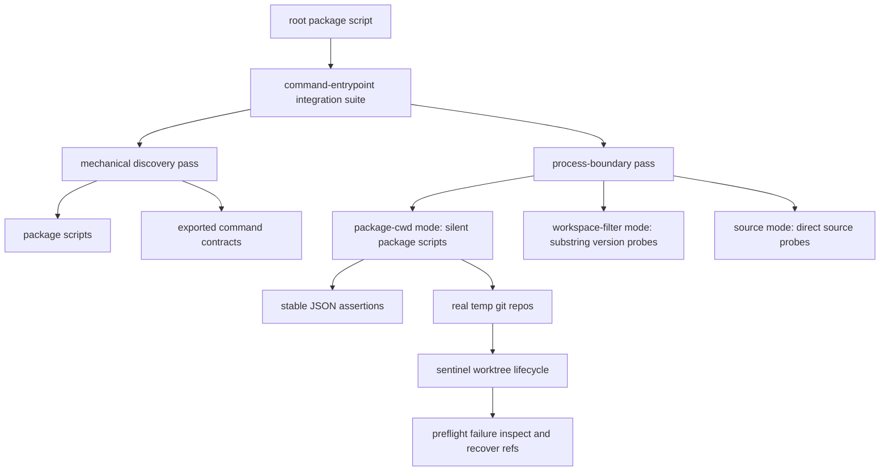
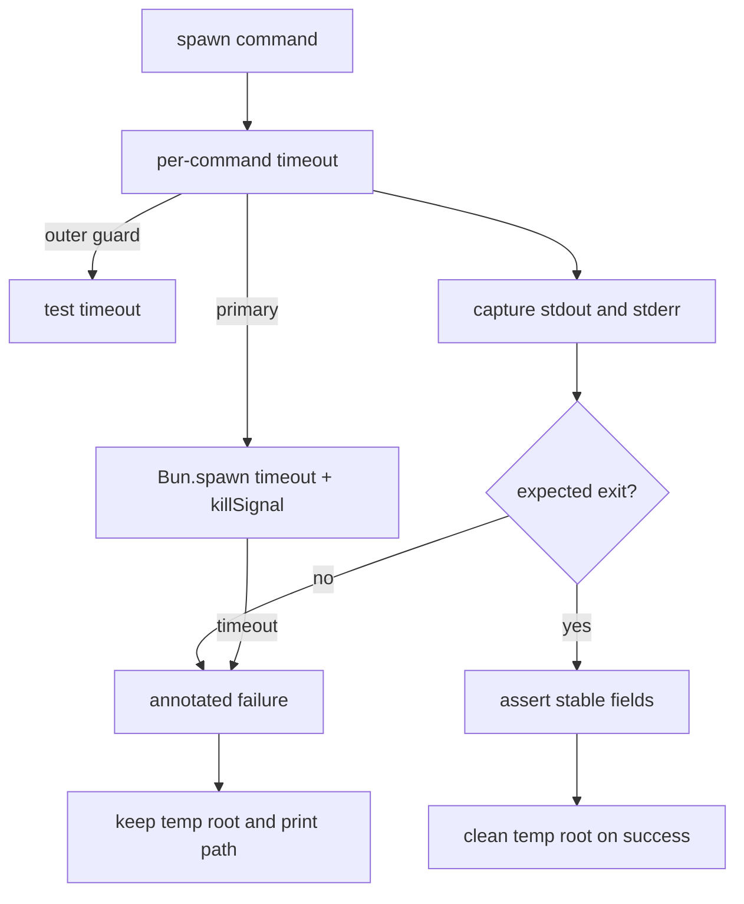

# test: Add command entrypoint integration tests

## Summary

Add a root-level Command Entrypoint Integration Test suite that proves `worktree`, `agent-worktree`, and `agent-worktree` through real repo-local process entrypoints. The suite covers package scripts, source-entry probes, workspace-filter version probes, command discovery, rendered help usage lines, stable JSON fields, sentinel real-git lifecycle flows, branch-deletion planning, and preflight failure recovery refs.

---

## Problem Frame

The ad hoc front-door run proved the command shape once, but it is not durable. Package-local tests already cover command contracts and in-process behavior, yet they do not prove that repo-local entrypoints still work when invoked as separate processes in real git repositories. This leaves drift risk across package scripts, source files, aliases, help rendering, JSON contracts, lifecycle mutations, and recovery references (see origin: `docs/brainstorms/2026-06-14-command-entrypoint-integration-tests-requirements.md`).

---

## Requirements

**Suite ownership**

- R1. Add a root Bun integration test file at `scripts/command-entrypoint.integration.test.ts`.
- R2. Add a root package script named `command-entrypoint:integration` that runs the integration test file.
- R3. Keep the suite out of default `test` and portability gates for v1.
- R4. Treat Command Entrypoint Integration Test as the canonical suite name; use "smoke" only for run style.

**Invocation coverage**

- R5. Cover invocation modes `package-cwd`, `workspace-filter`, and `source`.
- R6. Run package-cwd mode for runtime JSON and lifecycle behavior.
- R7. Limit workspace-filter mode to version probes for `worktree`, `agent-worktree`, and `agent-worktree`.
- R8. Limit source-entry mode to `--version` and top-level help for `worktree` and `agent-worktree`.

**Contract and discovery coverage**

- R9. Derive command ids mechanically from package scripts and exported command contracts before behavior cases.
- R10. Assert exact command id sets for `worktree` and `agent-worktree`.
- R11. Run top-level help for every CLI entrypoint and per-command help for every discovered command.
- R12. Assert help exit code `0` and rendered contract usage lines only; do not assert generic `Usage: worktree <command>` or `Usage: agent-worktree <command>` strings.

**Runtime and lifecycle coverage**

- R13. Assert stable JSON fields only: `status`, runtime `data.contract_id`, and command-owned behavior fields such as `action`, `preview`, `changed_state`, `run_ref`, and `failure_ref`.
- R14. Use real temp git repositories for sentinel lifecycle and render flows, including real commits and real `git worktree add` / `git worktree remove`.
- R15. Prove sentinel `worktree` package-script flows: `sync`, `new`, and `rm`; defer `focus`, `color`, `clean`, and `open`.
- R16. Prove sentinel `agent-worktree` package-script flows: create a worktree, inspect or check the created ref, branch-deletion dry-run planning, and preflight recovery refs.
- R17. Prove branch-deletion planning with `delete --dry-run --delete-branch --json`, without executing branch deletion in v1; assert preview state and branch-deletion intent without snapshotting the full plan.
- R18. Prove protected-branch preflight failure continuity through failure ref inspection and dry-run recovery.

**Timeouts and cleanup**

- R19. Use per-command spawn timeouts around `15_000ms` as the primary timeout and test-block timeouts around `30_000ms` as the outer guard, unless implementation finds a lower reliable value.
- R20. Use `withTempRoot` / `withTempRepo` helpers to delete temp roots only after success, keep roots on failure, and print kept temp root paths in failure output.
- R21. Include command mode, cwd, stdout excerpt, and stderr excerpt in failure messages.

---

## Key Technical Decisions

- KTD1. **Root script, not default gate:** `command-entrypoint:integration` is explicit so the suite is durable but not silently folded into fast package-local checks before it has three clean real runs.
- KTD2. **Single-file private harness first:** helper functions stay inside `scripts/command-entrypoint.integration.test.ts` until repeated implementation pressure proves an extraction. The pressure gate currently names one suite and no second adapter.
- KTD3. **Two-pass suite shape:** the test file is organized as a mechanical discovery pass followed by a process-boundary behavior pass. U1-U7 are build order, not final suite layout.
- KTD4. **Typed runner map owns invocation shape:** the harness defines one builder per mode and entrypoint, returning `cmd`, `cwd`, `mode`, and `label` so failures identify the exact boundary.
- KTD5. **Silent package-cwd mode carries behavior:** runtime JSON and lifecycle flows run from the owning package cwd through `bun run --silent <script>` so Bun's echoed script line cannot corrupt JSON stdout.
- KTD6. **Workspace filter stays tiny:** `bun --filter <pkg> <script> --version` is kept to substring-only version probes because filtered output is a display wrapper with prefixed and elided output. The integration suite does not assert help or JSON behavior through the wrapper.
- KTD7. **Source entries are compatibility probes:** source-entry tests use direct `bun run <source-path>` invocations for `--version` and top-level help only. Full JSON and lifecycle duplication through source entries is deferred to avoid slow and brittle duplicate matrices.
- KTD8. **Contracts provide discovery truth:** expected command ids come from package scripts plus exported command contracts, not from copied arrays in the test body. The test may assert the exact resulting ids after deriving them.
- KTD9. **Rendered usage, not generic usage:** help probes assert rendered contract usage lines. Current top-level help renders the default command's usage line, so the suite should not invent a generic catalog usage string.
- KTD10. **Runtime envelope id wins for commands JSON:** `commands --json` assertions use the runtime envelope ids `worktree.workspace` and `agent-worktree.lifecycle`; command metadata ids such as `worktree.commands` remain package-local contract detail.
- KTD11. **Stable JSON, no snapshots:** assertions pin fields that are machine contracts and avoid full stdout snapshots, so the suite detects drift without becoming a formatting freeze.
- KTD12. **Real git for sentinel lifecycle truth:** lifecycle tests create temp repos, commits, `origin/HEAD` evidence, linked worktrees, and local stores where those facts prove the process boundary.
- KTD13. **Sentinel flows over full matrices:** v1 keeps high-signal process-boundary flows and demotes duplicate package-local behavior checks to follow-up.
- KTD14. **Recovery refs are preflight continuity in v1:** the protected-branch path asserts that a preflight process-boundary failure remains inspectable and recoverable after exit. Post-mutation partial failure continuity is deferred unless a deterministic fault-injection seam already exists.

---

## High-Level Technical Design

---

## Implementation Units

### U1. Add Root Script And Harness Skeleton

- **Goal:** Create the root script and test harness shell with invocation-mode reporting, process spawning, timeout handling, temp-root tracking, and annotated failure output.
- **Requirements:** R1, R2, R4, R5, R19, R20, R21.
- **Dependencies:** None.
- **Files:** `package.json`, `scripts/command-entrypoint.integration.test.ts`.
- **Approach:** Add the explicit root script. In the test file, define private helpers for command invocation, stdout/stderr capture, JSON parsing, temp repo creation, temp cleanup, and failure annotation. Keep helper names domain-specific and local to the suite.
- **Execution note:** Start with the harness and one harmless version probe, then fan out once timeout and failure diagnostics are readable.
- **Patterns to follow:** `scripts/prove-workspace-portability.ts` for root-owned process execution shape; `runtime/cli-command-facade/src/testing.ts` for annotated command-surface case failures; `context/code-style.md` pressure gate for avoiding premature helper extraction.
- **Test scenarios:**
  - Running the root script invokes only `scripts/command-entrypoint.integration.test.ts`.
  - The typed runner map defines `package-cwd`, `workspace-filter`, and `source` builders.
  - `package-cwd` runs `bun run --silent <script>` from the owning package root.
  - `workspace-filter` runs `bun --filter <pkg> <script> --version` from the repo root and is marked substring-only.
  - `source` runs direct `bun run <source-path>` from the repo root.
  - Every spawned command captures exit code, stdout, stderr, mode, cwd, label, and argv.
  - `Bun.spawn` uses explicit `stdout: "pipe"`, `stderr: "pipe"`, `timeout`, and `killSignal`.
  - `withTempRoot` / `withTempRepo` deletes temp roots only after success, and keeps plus prints roots on failure.
- **Verification:** The harness can run one version probe from the repo root and produce useful failure output from a real invalid-command case.

### U2. Prove Mechanical Discovery And Help Contracts

- **Goal:** Derive command ids from package metadata and exported command contracts, then prove help usage lines for every public entrypoint and discovered command.
- **Requirements:** R5, R8, R9, R10, R11, R12.
- **Dependencies:** U1.
- **Files:** `scripts/command-entrypoint.integration.test.ts`, `skills/worktree/package.json`, `skills/worktree/src/command-contract.ts`, `runtime/agent-worktree/package.json`, `runtime/agent-worktree/src/command-contract.ts`.
- **Approach:** Read package scripts for command entrypoint names. Import `worktreeContracts`, `agentWorktreeContracts`, and `agentWorktreeContractEntries` as discovery sources. Assert the exact command id sets after derivation. For package-cwd mode, run top-level help and per-command help through package scripts. Assert rendered contract usage lines, not generic catalog placeholders. For source mode, run top-level help and version only.
- **Patterns to follow:** `skills/worktree/src/worktree.test.ts` and `runtime/agent-worktree/tests/cli-surface.test.ts` for rendered usage expectations; `CONTEXT.md` Command Contract Locator vocabulary.
- **Test scenarios:**
  - Mechanical discovery returns `worktree` command ids: `sync`, `focus`, `color`, `open`, `new`, `rm`, `clean`, `commands`.
  - Mechanical discovery returns `agent-worktree` command ids: `doctor`, `list`, `create`, `status`, `check`, `delete`, `clean`, `recover`, `refresh`, `inspect`, `handoff`, `commands`.
  - `worktree`, `agent-worktree`, and `agent-worktree` top-level help exits `0` and contains the current rendered top-level usage line.
  - Every discovered `worktree` command help exits `0` and contains that command contract's first rendered usage line.
  - Every discovered `agent-worktree` command help exits `0` and contains that command contract's first rendered usage line.
  - `worktree` and `agent-worktree` source entries support `--version` and top-level help.
- **Verification:** Discovery, help, and source compatibility probes fail if package scripts, source entries, or exported command contracts drift apart.

### U3. Prove Version, Commands JSON, And Stable Runtime JSON Fields

- **Goal:** Cover version probes, `commands --json`, invalid command failures, and stable JSON fields before mutating real temp repos.
- **Requirements:** R6, R7, R13, R15, R16.
- **Dependencies:** U1, U2.
- **Files:** `scripts/command-entrypoint.integration.test.ts`.
- **Approach:** Use silent package-cwd mode for JSON assertions and workspace-filter mode for version probes only. Parse JSON envelopes from stdout, assert stable envelope fields, and keep assertions to command-owned behavior fields. Invalid command tests assert non-zero exits and structured error envelopes without full text snapshots.
- **Patterns to follow:** `skills/worktree/src/worktree.ts` for `WORKTREE_CONTRACT_ID` envelope data; `runtime/agent-worktree/src/cli.ts` for `AGENT_WORKTREE_CONTRACT_ID` envelope data; `skills/create-cli/references/cli-command-facade.md` for wrapper limitations.
- **Test scenarios:**
  - `worktree --version`, `agent-worktree --version`, and `agent-worktree --version` work through package scripts.
  - Workspace-filter version probes for `worktree`, `agent-worktree`, and `agent-worktree` exit `0` and contain the expected version substring in combined output.
  - `worktree commands --json`, `agent-worktree commands --json`, and `agent-worktree commands --json` return status `ok` and the expected runtime `data.contract_id`.
  - Invalid `worktree` command returns non-zero status with a structured error envelope.
  - Invalid `agent-worktree` command returns non-zero status with a structured error envelope.
  - JSON assertion failures include stdout and stderr excerpts.
- **Verification:** JSON parsing and stable-field assertions prove the machine contract without depending on full stdout formatting.

### U4. Prove `worktree` Sentinel Real Repo Lifecycle

- **Goal:** Exercise high-signal `worktree` package-script behavior against real temp git repositories and real worktree operations.
- **Requirements:** R6, R13, R14, R15, R20, R21.
- **Dependencies:** U1, U2, U3.
- **Files:** `scripts/command-entrypoint.integration.test.ts`, `skills/worktree/src/worktree.ts`, `skills/worktree/src/worktree-discovery.ts`.
- **Approach:** Build temp git repositories with an initial commit, a seeded default-branch signal, and a predictable worktree root. Run `worktree sync`, `new`, and `rm` through silent package-cwd mode. Use stable JSON fields plus filesystem and git evidence where those facts prove the process boundary.
- **Patterns to follow:** `skills/worktree/src/worktree.test.ts` for lifecycle and render assertions; `skills/worktree/src/worktree-discovery.test.ts` for owner-root behavior.
- **Test scenarios:**
  - `worktree sync --json` writes the generated workspace and returns status `ok`, `data.contract_id`, `action`, and `changed_state`.
  - `worktree new <branch> --json` creates a real linked worktree and re-renders.
  - `worktree rm <branch> --force --json` removes a real linked worktree and re-renders.
  - Temp repo cleanup removes all roots on success and preserves the root when an assertion fails.
- **Verification:** The suite proves `worktree` render and real worktree mutation through package-script process entrypoints, not through imported functions.

### U5. Prove `agent-worktree` Sentinel Lifecycle And `agent-worktree` Alias Probes

- **Goal:** Exercise high-signal `agent-worktree` lifecycle flows and the canonical `agent-worktree` command probes against real temp git repositories and durable store state.
- **Requirements:** R6, R13, R14, R16, R17, R20, R21.
- **Dependencies:** U1, U2, U3.
- **Files:** `scripts/command-entrypoint.integration.test.ts`, `runtime/agent-worktree/src/cli.ts`, `runtime/agent-worktree/src/worktrees.ts`, `runtime/agent-worktree/src/store.ts`, `runtime/agent-worktree/src/inspect.ts`.
- **Approach:** Use real temp repos with linked worktrees and local durable stores. Run sentinel canonical lifecycle flows through silent package-cwd mode. Assert stable JSON fields, durable refs, preview flags, changed-state values, and expected side effects. Use `agent-worktree` for canonical parity on version, top-level help, and `commands --json`, then reserve lifecycle behavior for the canonical command.
- **Patterns to follow:** `runtime/agent-worktree/tests/worktrees.test.ts`, `runtime/agent-worktree/tests/cli-surface.test.ts`, and `runtime/agent-worktree/tests/store.test.ts`.
- **Test scenarios:**
  - `agent-worktree create <branch> --json` creates a real linked worktree and returns `changed_state: complete` with a `run_ref`.
  - A separate spawned `agent-worktree inspect <run_ref> --json` or `agent-worktree check <branch> --json` can read state created by the prior spawned process.
  - `agent-worktree delete <branch> --dry-run --delete-branch --json` returns `preview: true`, `changed_state: none`, and includes branch-deletion intent for the target branch.
  - `agent-worktree --version`, top-level help, and `agent-worktree commands --json` preserve canonical parity.
- **Verification:** A fresh spawned process can inspect or verify state created by an earlier spawned process.

### U6. Prove Preflight Failure Ref Continuity And Recovery Preview

- **Goal:** Guard the protected-branch preflight recovery path across process boundaries.
- **Requirements:** R13, R18, R20, R21.
- **Dependencies:** U1, U2, U3, U5.
- **Files:** `scripts/command-entrypoint.integration.test.ts`, `runtime/agent-worktree/src/cli.ts`, `runtime/agent-worktree/src/worktrees.ts`, `runtime/agent-worktree/src/inspect.ts`, `runtime/agent-worktree/src/store.ts`.
- **Approach:** In a temp repo, run a protected-branch destructive delete request through the process entrypoint. Assert a non-zero runtime failure with `failure_ref`, then spawn separate `inspect` and `recover --dry-run` commands against that ref. Keep the assertions on changed-state, preview, typed ref path, and next safe action.
- **Patterns to follow:** `runtime/agent-worktree/tests/worktrees.test.ts` for durable failure records; `runtime/agent-worktree/tests/cli-surface.test.ts` for recovery command envelope expectations.
- **Test scenarios:**
  - `agent-worktree delete main --force --json` returns non-zero status and includes `data.failure_ref`.
  - `agent-worktree inspect <failure_ref> --json` finds the durable failure record in a separate process.
  - `agent-worktree recover <failure_ref> --dry-run --json` returns status `ok`, `preview: true`, and preserves the failure ref path.
  - Failure output includes mode, cwd, stdout excerpt, stderr excerpt, and the kept temp root path.
- **Verification:** Preflight recovery metadata survives the process boundary and remains available after the failing command exits.

### U7. Add Adversarial Pass And Promotion Boundary

- **Goal:** Keep the suite honest against drift while preserving v1 promotion boundaries.
- **Requirements:** R3, R4, R9, R10, R13, R19, R20.
- **Dependencies:** U1 through U6.
- **Files:** `scripts/command-entrypoint.integration.test.ts`, `package.json`, `scripts/prove-workspace-portability.ts`.
- **Approach:** Keep the implemented suite in two passes: mechanical discovery first, process-boundary behavior second. The process-boundary pass should verify that cases prove distinct entrypoint or boundary risk, not duplicate assertions for confidence theater. Leave `scripts/prove-workspace-portability.ts` unchanged except for a future promotion decision after three clean real runs.
- **Patterns to follow:** Origin Adversarial Pass requirement; `scripts/prove-workspace-portability.ts` for the future gate owner; `CONTEXT.md` Command Entrypoint Integration Test vocabulary.
- **Test scenarios:**
  - Mechanical pass fails when the derived command id set differs from the expected command id set.
  - Process-boundary pass fails when package scripts work but source entries, aliases, or workspace-filter version probes drift.
  - The root default `test` script remains unchanged and does not run this suite.
  - Portability proof does not run the suite until a later explicit gate decision.
- **Verification:** The root script is explicit, the suite is durable, and default gates remain unchanged for v1.

---

## Scope Boundaries

### In Scope For V1

- Root `command-entrypoint:integration` script.
- One root integration test file.
- Package-cwd, workspace-filter, and source invocation modes.
- `worktree`, `agent-worktree`, and `agent-worktree` process-boundary entrypoints.
- Command id discovery, rendered help usage lines, version probes, stable JSON fields, sentinel lifecycle flows, branch-deletion dry-run preview, and preflight recovery refs.
- Real temp git repos and cleanup discipline.

### Deferred To Follow-Up Work

- Promotion into `scripts/prove-workspace-portability.ts` after three clean real runs and an explicit gate decision.
- Full source-entry command matrix.
- Full branch deletion execution.
- GUI launch coverage for `worktree open <name>`.
- `worktree open --json` coverage after `worktree open` has a repo override or another safe temp-repo fixture.
- Full `worktree` behavior rows for `focus`, `color`, and `clean`; package-local tests own those semantics in v1.
- Full `agent-worktree` behavior rows for `doctor`, `list`, `status`, `refresh --dry-run`, `handoff`, `clean --preview`, plain `delete --dry-run`, and `delete --force`; package-local tests own those semantics in v1.
- `agent-worktree` invalid-command and lifecycle behavior; canonical parity is covered by version, top-level help, and `commands --json`.
- Artificial timeout self-tests for the private harness.
- Post-mutation partial failure recovery continuity, unless a deterministic fault-injection seam already exists.
- Helper extraction into shared harness modules.

### Out Of Scope

- Full JSON snapshots.
- Full help snapshots.
- Replacing package-local unit or contract tests.
- Repeating package-local parser, metadata, store, or lifecycle semantics without a process-boundary risk.
- Running the suite as part of default `test`.
- Mutating the repository under test outside temp directories.

---

## System-Wide Impact

This suite adds a slower root-owned verification lane for agent-native CLI surfaces. It increases confidence across workspace packages without changing default test gates, command contracts, CLI behavior, or portability proof behavior in v1.

---

## Risks And Dependencies

- **Runtime duration:** real git worktree flows can become slow. Mitigation: keep source and workspace-filter modes small, use per-command timeouts, and avoid duplicate lifecycle matrices.
- **Brittle environment assumptions:** git defaults and `origin/HEAD` evidence vary by temp repo. Mitigation: seed commits and default-branch evidence in harness helpers.
- **Package-script wrapper noise:** `bun run <script>` prints the script command before stdout. Mitigation: package-cwd mode uses `bun run --silent <script>` for JSON and help probes.
- **Workspace-filter wrapper drift:** `bun --filter` can prefix and elide child stdout. Mitigation: use workspace-filter mode only for version substring probes.
- **Timeout cleanup cutoff:** Bun test timeouts are an outer guard and can interrupt cleanup. Mitigation: rely on `Bun.spawn` timeout and `killSignal` as the primary timeout path.
- **Temp cleanup failure:** failed tests can leave temp repos behind. Mitigation: preserve roots only on failure and print paths for cleanup.
- **Existing worktree edits:** the suite should run lifecycle cases in temp repos only. Mitigation: every lifecycle case receives an explicit temp repo cwd or package-cwd plus repo flag; `worktree open --json` is deferred because it lacks a repo override.
- **Recovery overclaim:** protected-branch delete proves preflight failure continuity, not post-mutation partial failure recovery. Mitigation: name the v1 proof precisely and defer post-mutation failure coverage.

---

## Documentation And Operational Notes

- `CONTEXT.md` already defines Command Entrypoint Integration Test vocabulary and should remain the durable term owner.
- Keep the root script documented by discoverable package metadata rather than adding startup instructions.
- Record promotion evidence separately after real suite runs; the plan does not promote the suite into default gates.

---

## Sources And Research

- Origin requirements: `docs/brainstorms/2026-06-14-command-entrypoint-integration-tests-requirements.md`.
- CLI contracts: `skills/worktree/src/command-contract.ts`, `runtime/agent-worktree/src/command-contract.ts`.
- CLI front doors: `skills/worktree/src/worktree.ts`, `runtime/agent-worktree/src/cli.ts`.
- Lifecycle owners: `runtime/agent-worktree/src/worktrees.ts`, `runtime/agent-worktree/src/store.ts`, `runtime/agent-worktree/src/inspect.ts`.
- Existing tests: `skills/worktree/src/worktree.test.ts`, `runtime/agent-worktree/tests/cli-surface.test.ts`, `runtime/agent-worktree/tests/worktrees.test.ts`.
- Root process pattern: `scripts/prove-workspace-portability.ts`.
- Origin external sources: Bun test docs, Bun writing-tests docs, Node test docs, and Bun issue discussions named in the origin research notes.
- Firecrawl follow-up sources:
  - Bun Runtime: `https://bun.com/docs/runtime`.
  - Bun bunfig `run.silent` and `run.elide-lines`: `https://bun.com/docs/runtime/bunfig`.
  - Bun workspace filter: `https://bun.com/docs/pm/filter`.
  - Bun Spawn: `https://bun.com/docs/runtime/child-process`.
  - Bun test writing and timeout behavior: `https://bun.com/docs/test/writing-tests`.
  - Bun test runtime behavior: `https://bun.com/docs/test/runtime-behavior`.
