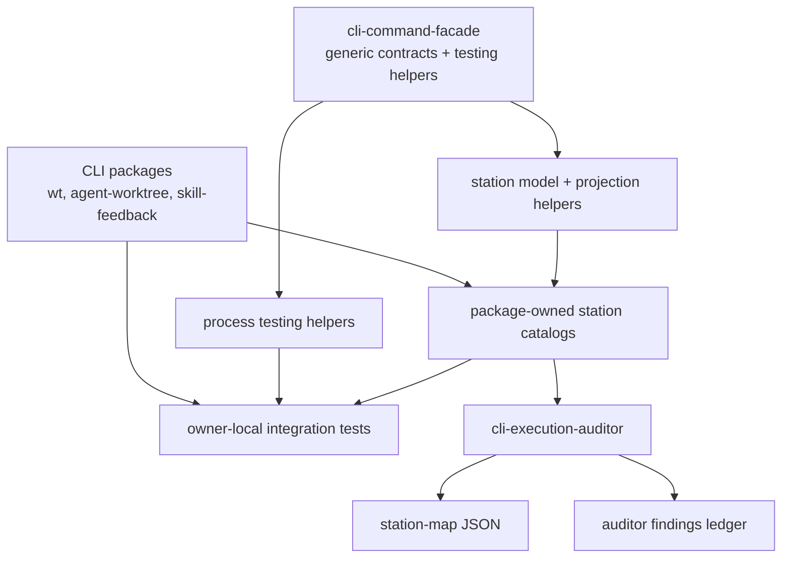
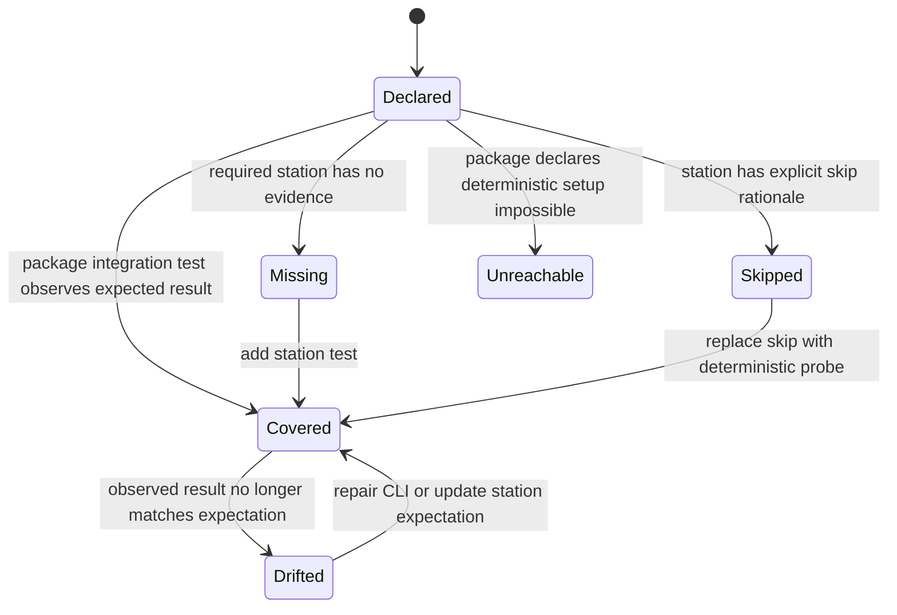
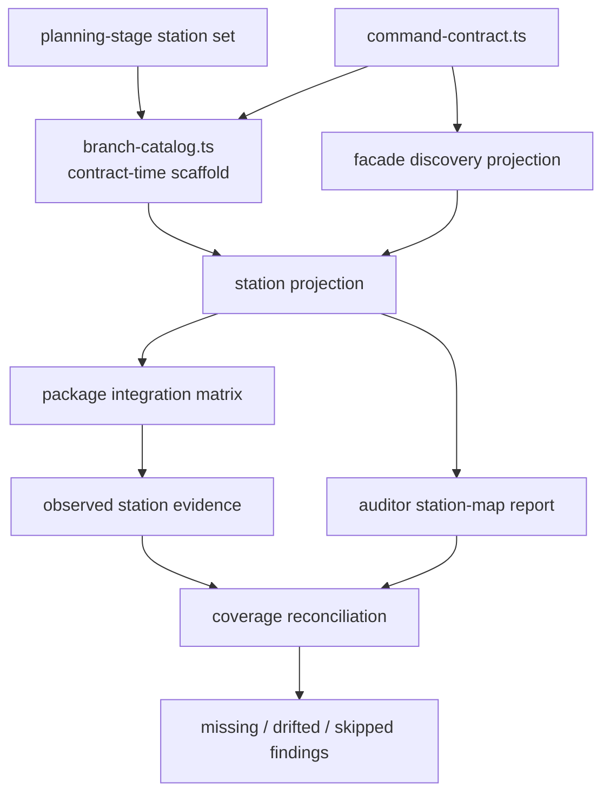

# feat: Add CLI branch station maps

## Summary

Build the first durable CLI confidence pattern: shared process-boundary test helpers, owner-local integration tests, contract-time package-owned branch station catalogs, and an auditor station-map report that reconciles declared CLI branches against deterministic probes.

This plan ships the boring core first and pilots branch stations on `skill-feedback`. The planning artifact declares the first branch station set; implementation translates that set into a package-owned catalog before adding integration rows. Broader branch discovery, trace instrumentation, and mandatory gates stay deferred until the model catches real drift across more CLIs.

---

## Problem Frame

The repo now has two converging pressures.

First, `scripts/command-entrypoint.integration.test.ts` proved `wt`, `agent-worktree`, and `awt` through real process entrypoints, but its helpers were deliberately kept private until a second consumer existed. `skills/skill-feedback/src/skill-feedback.test.ts` is now that second consumer: it repeats subprocess capture, JSON envelope parsing, failure annotation, and temp-root setup.

Second, `skills/cli-execution-auditor` already provides a deterministic facade-lane audit spine, but it stops at advertised command and flag exercise. It does not answer the next question: which package-owned success, error, observability, and repair branches are meant to exist, and which integration tests prove them?

The staff-engineer call is to add a declared branch oracle. The package owns branch meaning; the facade owns generic mechanics; the auditor owns deterministic reconciliation.

---

## Requirements

**Shared Process Harness**

- R1. Extract package-agnostic CLI subprocess test helpers into `@side-quest/cli-command-facade/testing`.
- R2. Preserve command label, argv, cwd, stdout, stderr, exit code, timeout state, and compact failure annotations.
- R3. Preserve JSON envelope parsing helpers that annotate parse failures with process context.
- R4. Keep package-specific repo setup, git seeding, and domain assertions out of the shared helper layer.

**Owner-Local Integration Tests**

- R5. Refactor the root Command Entrypoint Integration Test to consume shared helpers without changing its sentinel coverage.
- R6. Split owner-specific process-boundary behavior into package-local integration tests for `wt` and `agent-worktree`.
- R7. Add `skill-feedback` process-boundary integration tests through the public runner, including stdin-fed closeout behavior.
- R8. Keep the root command-entrypoint suite as orchestration and cross-entrypoint parity, not as the long-term owner of every package behavior row.

**Branch Station Model**

- R9. Add a generic branch station model that can describe CLI branch ids, command owners, trigger shape, expected result class, repair/continuation/diagnostic expectations, and coverage classification.
- R10. Keep station catalogs package-owned and near each CLI's command contract.
- R11. Scaffold package-owned station catalogs as contract-time artifacts before runner or integration implementation when a CLI command contract is created or expanded.
- R12. Project a deterministic station map from facade discovery plus package branch station catalogs.
- R13. State the completeness claim as declared branch coverage, not whole-program branch completeness.
- R25. Planning artifacts for new or expanded facade-backed CLIs name the initial branch station ids per command before implementation writes the package catalog.

**Skill-Feedback Pilot**

- R14. Pilot the branch station catalog on `skill-feedback` because it has read, write, stdin, health, review, retention, and failure branches.
- R15. Start the `skill-feedback` catalog as a scaffold from the existing command contract before adding the new integration matrix rows.
- R16. Generate or derive the `skill-feedback` integration matrix from the station catalog rather than hand-copying rows.
- R17. Cover at least one success and one stable failure station for each public `skill-feedback` command where the branch is deterministic without brittle wall-clock or host-state dependence.

**Auditor Reconciliation**

- R18. Extend `cli-execution-auditor` with a station-map report mode that emits deterministic JSON.
- R19. Extend the auditor to report missing, drifted, skipped, and declared-unreachable stations.
- R20. Keep station-map findings in the existing auditor findings model.
- R21. Preserve existing auditor lane clauses and fixture corpus behavior.

**Adoption And Boundaries**

- R22. Document the pattern as the repo's reusable CLI branch-confidence path.
- R23. Do not promote station maps into default gates in this iteration.
- R24. Capture v2 work explicitly so trace-driven discovery, property-based probes, branch coverage, workbench UI, and enforcement gates are not lost.

---

## Key Technical Decisions

- KTD1. **Shared process helpers belong in the facade testing subpath:** `runtime/cli-command-facade` already exposes `./testing`, and both current consumers depend on facade-backed CLI semantics. Keeping spawn, timeout, stream capture, envelope parsing, and case annotations there prevents each CLI package from growing its own private process harness.
- KTD2. **Branch meaning stays package-owned:** The facade may own generic station shapes and validators, but `protected_branch`, `low_coverage`, `read_target_resolution_failed`, and recovery meaning belong to the package that emits them.
- KTD3. **Planning declares the first station set:** For new or expanded facade-backed CLIs, the plan names the initial branch station ids per command before code exists. The first implementation step turns that planning set into a package-owned catalog beside the command contract, then runner code and integration rows work toward it.
- KTD4. **Station map completeness is declared-branch coverage:** The plan must not claim "all possible branches." It proves that every required station the package declares is covered, skipped with a reason, or reported as missing.
- KTD5. **Pilot on `skill-feedback`, not all CLIs at once:** `skill-feedback` exercises the most varied branch shapes without adding git-worktree setup complexity. `wt` and `agent-worktree` get owner-local integration tests now; their full station catalogs move to follow-up.
- KTD6. **Generate data, not source, in v1:** Station maps and matrix rows can be derived as data. Test files stay maintainer-owned until the catalog shape stabilizes.
- KTD7. **Extend the existing auditor, do not create a sibling tool:** `cli-execution-auditor` already owns lane detection, deterministic findings, canonical sorting, and ledger writing. A separate station-map tool would split the deterministic spine.
- KTD8. **No mandatory gate until repeated real catches:** The station-map path remains opt-in until it catches distinct real coverage or branch drift across multiple CLIs.

---

## High-Level Technical Design

### Ownership Topology



### Station Lifecycle



### Data Flow



---

## Planning-Stage Branch Station Set

Planning owns the first branch station list. U5 translates this planning set into `skills/skill-feedback/src/branch-catalog.ts`; implementation does not invent the matrix from test-writing momentum.

Initial `skill-feedback` station seed:

| Command | Status | Planning-stage station ids |
| --- | --- | --- |
| `record` | `required` | `record.success`, `record.invalid_usage` |
| `closeout` | `required` | `closeout.success_stdin`, `closeout.invalid_receipt` |
| `review` | `required` | `review.empty_inbox`, `review.target_resolution_failed` |
| `health` | `required` | `health.populated_inbox`, `health.unsafe_inbox` |
| `purge` | `required` | `purge.preview`, `purge.execute`, `purge.invalid_usage` |

If U5 proves a listed station is not deterministic, the package catalog records `skipped` or `declared-unreachable` with a rationale. The completeness claim remains declared branch coverage.

---

## Origin Requirement Trace

This plan implements the active first-iteration requirements from `docs/brainstorms/2026-06-15-deterministic-cli-branch-confidence-requirements.md`. Future origin requirements `R34`-`R43` stay deferred unless documented as optional awareness.

| Origin scope | Plan coverage |
| --- | --- |
| `R1`-`R5` Planning-stage station sets | Planning-Stage Branch Station Set, U5 |
| `R6`-`R10` Package-owned branch catalogs | U4, U5 |
| `R11`-`R15` Process-boundary test harness | U1, U2, U3, U6 |
| `R16`-`R21` Station maps and auditor reconciliation | U4, U7 |
| `R22`-`R29` Skill-feedback pilot | U5, U6 |
| `R30`-`R33` Adoption and documentation | U8 |
| `AE1`-`AE6` Acceptance examples | U5, U6, U7, U8 |

| Deferred origin requirement | Plan handling |
| --- | --- |
| `R34` Full `wt` and `agent-worktree` station catalogs | Deferred to follow-up after the `skill-feedback` pilot stabilizes. |
| `R35` Runtime station evidence receipts | Deferred; U6 may use in-memory evidence only. |
| `R36` Trace-driven undeclared-branch suggestions | Deferred until declared stations prove useful. |
| `R37` Property-based argv and input probing | Deferred until station contracts stabilize. |
| `R38` Branch coverage instrumentation | Deferred as a secondary signal. |
| `R39` Generated test source | Deferred; v1 generates or derives data only. |
| `R40` Branch workbench report | Deferred beyond auditor JSON and findings. |
| `R41` Mandatory workflow gates | Deferred; U8 documents optional workflow status only. |
| `R42` Non-facade and hand-rolled CLI support | Deferred until lane markers and coverage signals exist. |
| `R43` Safe auto-fixes | Deferred until station findings prove stable. |

---

## Output Structure

```text
runtime/cli-command-facade/
  src/
    process-testing.ts
    station-map.ts
    testing.ts
  tests/
    process-testing.test.ts
    station-map.test.ts

skills/skill-feedback/
  src/
    branch-catalog.ts
    skill-feedback.integration.test.ts
    skill-feedback.test.ts

skills/wt/
  src/
    wt.integration.test.ts

runtime/agent-worktree/
  tests/
    entrypoint.integration.test.ts

skills/cli-execution-auditor/
  src/
    station-map.ts
    station-map.test.ts
    audit-engine.ts
    auditor.ts
    command-contract.ts

scripts/
  command-entrypoint.integration.test.ts
```

---

## Implementation Units

### U1. Extract Shared CLI Process Testing Helpers

**Goal:** Move repeated process-boundary helper mechanics into the facade testing subpath.

**Requirements:** R1, R2, R3, R4.

**Origin trace:** Origin `R11`, `R12`, `R13`.

**Dependencies:** None.

**Files:** `runtime/cli-command-facade/src/process-testing.ts`, `runtime/cli-command-facade/src/testing.ts`, `runtime/cli-command-facade/tests/process-testing.test.ts`, `runtime/cli-command-facade/package.json`.

**Approach:** Extract only package-agnostic mechanics: subprocess execution, timeout/kill handling, stream capture, excerpts, context-rich failure descriptions, JSON envelope parsing, and labeled case runners. Keep temp git repositories, package roots, CLI script names, and command-specific assertions in the owning tests.

**Execution note:** Start with characterization coverage copied from the current root integration helper behavior before moving callers.

**Patterns to follow:** `scripts/command-entrypoint.integration.test.ts` helper shape, `skills/skill-feedback/src/skill-feedback.test.ts` process helpers, and `runtime/cli-command-facade/src/testing.ts` export style.

**Test scenarios:**

- Running a successful subprocess returns command, cwd, exit code, stdout, stderr, and `timedOut: false`.
- Running a failing subprocess returns non-zero exit code and captured stderr without throwing.
- A timed-out subprocess is killed and returns `timedOut: true`.
- JSON envelope parsing returns an object for valid stdout JSON.
- JSON envelope parsing failure includes command, cwd, stdout excerpt, stderr excerpt, and parse error.
- Labeled case runner annotates runner-phase errors with case label and argv.
- Labeled case runner annotates assertion-phase errors with case label and argv.

**Verification:** Existing facade tests pass, and the new helpers can be imported from `@side-quest/cli-command-facade/testing`.

### U2. Refactor Command Entrypoint Integration Onto Shared Helpers

**Goal:** Keep current root sentinel coverage while deleting the private helper copy.

**Requirements:** R1, R2, R3, R5, R8.

**Origin trace:** Origin `R11`, `R12`, `R13`, `R15`.

**Dependencies:** U1.

**Files:** `scripts/command-entrypoint.integration.test.ts`.

**Approach:** Replace local process helpers with shared helper imports. Leave root-suite domain setup local: package roots, source entry paths, temp git repo creation, command id discovery, and behavior assertions. Do not broaden coverage in this unit.

**Execution note:** Characterization-first: prove the current 28-test behavior before replacing helpers, then keep the test count and assertions stable unless helper extraction reveals duplicate cases.

**Patterns to follow:** Existing root suite organization: mechanical discovery first, process-boundary behavior second.

**Test scenarios:**

- Root suite still derives `wt` and `agent-worktree` command ids from live contracts.
- Root suite still proves package-cwd JSON behavior for current sentinel flows.
- Root suite still proves workspace-filter version probes only.
- Root suite still proves source-entry compatibility probes.
- Failure output still includes mode, label, cwd, argv, exit code, stdout excerpt, and stderr excerpt.
- Temp roots are still removed on success and preserved on failure.

**Verification:** `command-entrypoint:integration` preserves current behavior and no longer defines package-agnostic process helper implementations locally.

### U3. Split Owner-Local `wt` And `agent-worktree` Integration Tests

**Goal:** Move package-specific process-boundary behavior toward the packages that own the CLI semantics.

**Requirements:** R5, R6, R8.

**Origin trace:** Origin `R13`, `R15`; deferred origin `R34` remains out of scope.

**Dependencies:** U1, U2.

**Files:** `skills/wt/src/wt.integration.test.ts`, `runtime/agent-worktree/tests/entrypoint.integration.test.ts`, `scripts/command-entrypoint.integration.test.ts`, `skills/wt/package.json`, `runtime/agent-worktree/package.json`.

**Approach:** Add package-local integration tests that use the shared process helpers and local fixture setup. Keep the root suite as a cross-entrypoint sentinel and drift detector. Move or duplicate only the behavior rows that belong to a package owner; avoid broad root-suite churn until both package-local suites are green.

**Patterns to follow:** `skills/wt/src/wt.test.ts`, `runtime/agent-worktree/tests/cli-surface.test.ts`, and the current root integration suite.

**Test scenarios:**

- `wt` package-local integration proves `sync`, `new`, `rm`, `focus`, `color`, and `clean` through the package script where deterministic temp-repo setup exists.
- `wt` package-local integration keeps `open <name>` GUI launch out of scope and covers only safe list/JSON behavior.
- `agent-worktree` package-local integration proves create, inspect/check, delete dry-run, protected-branch failure ref, and recover dry-run through the package script.
- `agent-worktree` package-local integration proves `awt` alias parity for version, help, and commands JSON.
- Root command-entrypoint integration remains green after package-local split.
- Package test scripts include the new integration tests where their package test command already runs matching test globs; otherwise the plan updates package scripts intentionally.

**Verification:** Package-local tests own package behavior, while the root suite remains a smaller cross-entrypoint orchestration check.

### U4. Add Generic Branch Station Model And Projection Helpers

**Goal:** Create the shared model for package-owned branch station catalogs and deterministic station maps.

**Requirements:** R9, R10, R11, R12, R13.

**Origin trace:** Origin `R6`-`R10`, `R16`, `R17`, `AE5`.

**Dependencies:** None.

**Files:** `runtime/cli-command-facade/src/station-map.ts`, `runtime/cli-command-facade/src/index.ts`, `runtime/cli-command-facade/src/testing.ts`, `runtime/cli-command-facade/tests/station-map.test.ts`.

**Approach:** Add generic station primitives to the facade runtime without adding branch stations to `CommandFacadeContract`. The shared model should validate station ids, command ownership, expectation class, coverage classification, and safe projected text. Projection combines facade command discovery with package station catalogs into a canonical station map.

**Technical design:** Directional shape only: a station has a stable id, command id, branch kind, trigger summary, expected process result class, expected envelope/result literals when safe, coverage status, and optional skip or unreachable rationale. Package-local tests may attach setup functions separately; the canonical station map stays serializable.

**Patterns to follow:** `runtime/cli-command-facade/src/command-discovery.ts`, `runtime/cli-command-facade/src/runtime-envelope.ts`, `runtime/cli-command-facade/src/runtime-text-safety.ts`, and `runtime/cli-command-facade/tests/command-facade.test.ts`.

**Test scenarios:**

- A catalog referencing an unknown command produces deterministic drift.
- Duplicate station ids produce deterministic drift.
- Station ids sort canonically in the projected station map.
- Unsafe projected text is rejected using the existing runtime text-safety stance.
- A station with `required` coverage and no observed evidence projects as missing.
- A station with explicit skip rationale projects as skipped.
- A station with declared-unreachable rationale projects as declared-unreachable.
- Covers AE5. Projection represents declared branch coverage only and does not expose whole-program TypeScript branch completeness.
- Projection does not mutate or reinterpret package-owned result vocabulary.

**Verification:** The facade exports generic station-map helpers while command contracts remain unchanged.

### U5. Scaffold Skill-Feedback Package-Owned Branch Catalog

**Goal:** Create the package-owned branch catalog before adding new integration matrix implementation.

**Requirements:** R10, R11, R14, R15, R25.

**Origin trace:** Origin `R1`-`R10`, `R22`-`R29`, `AE1`, `AE2`, `AE4`.

**Dependencies:** U4.

**Files:** `skills/skill-feedback/src/branch-catalog.ts`, `skills/skill-feedback/src/command-contract.ts`, `skills/skill-feedback/src/branch-catalog.test.ts`.

**Approach:** Add `branch-catalog.ts` beside the command contract as the branch oracle scaffold. Translate the Planning-Stage Branch Station Set into code, then validate it against live public command ids from `command-contract.ts`. The catalog declares stable branch station ids, expected result classes, repair or diagnostic expectations, and initial coverage classification. It does not own process setup functions yet. Integration evidence lands in U6.

**Execution note:** Treat this as contract-first scaffolding. Required stations may start as uncovered in the station map, but the catalog itself must validate before runner or integration implementation expands.

**Patterns to follow:** `skills/skill-feedback/src/command-contract.ts` package-owned result constants, `skills/skill-feedback/src/report-helpers.ts` stable id discipline, and `skills/skill-feedback/references/closeout-receipt.md` stdin workflow.

**Test scenarios:**

- The catalog references only live public command ids from `command-contract.ts`.
- Covers AE2 / AE4. The catalog contains every station id from the Planning-Stage Branch Station Set unless it records a `skipped` or `declared-unreachable` rationale.
- Every public command has at least one success station or an explicit skip/unreachable rationale.
- Every public command has at least one deterministic failure, repair, or diagnostic station where the behavior is stable enough to declare.
- Duplicate station ids fail catalog validation.
- Unknown command ids fail catalog validation.
- Station ids use stable package-owned vocabulary such as `closeout.invalid_receipt`, not test-case prose.
- Required-but-uncovered stations remain visible as scaffolded work, not silently treated as covered.

**Verification:** `skill-feedback` has a package-owned branch catalog before the new integration matrix is implemented.

### U6. Add Skill-Feedback CLI Integration Tests From Branch Catalog

**Goal:** Make `skill-feedback` the real shared-helper consumer and prove catalog-driven matrix execution.

**Requirements:** R1, R2, R3, R7, R16, R17.

**Origin trace:** Origin `R11`-`R15`, `R22`-`R29`, `AE2`, `AE4`.

**Dependencies:** U1, U5.

**Files:** `skills/skill-feedback/src/skill-feedback.integration.test.ts`, `skills/skill-feedback/src/skill-feedback.test.ts`, `skills/skill-feedback/src/branch-catalog.ts`, `skills/skill-feedback/src/skill-feedback-runner.ts`, `skills/skill-feedback/package.json`.

**Approach:** Move process-boundary tests out of the larger unit-style `skill-feedback.test.ts` where that improves ownership. Use direct runner invocation, not `bun --filter`, for stdin-fed commands. Derive integration rows from the branch catalog and record observed evidence in-memory during the test run. Keep pure engine and parser tests in the existing test file.

**Patterns to follow:** `skills/skill-feedback/SKILL.md` closeout workflow, `skills/create-cli/references/cli-command-facade.md` `bun --filter` warning, existing `runCli` helper behavior, and the U5 branch catalog scaffold.

**Test scenarios:**

- `record.success` station observes exit `0`, status `ok`, and record contract id.
- `record.invalid_usage` station observes exit `2` and structured usage error.
- `closeout.success_stdin` station observes exit `0`, status `ok`, and closeout contract id.
- `closeout.invalid_receipt` station observes exit `2` and `invalid_closeout_receipt`.
- `review.empty_inbox` station observes exit `0`, status `ok`, and zero reports.
- `review.target_resolution_failed` station observes exit `1` and `read_target_resolution_failed`.
- `health.populated_inbox` station observes exit `0`, status `ok`, and `inbox_status: populated`.
- `health.unsafe_inbox` station observes exit `1` and blocked readiness data.
- `purge.preview` station observes exit `0`, status `ok`, and no deletion.
- `purge.execute` station observes exit `0`, status `ok`, and deletes only selected safe reports.
- `purge.invalid_usage` station observes exit `2` and structured usage error.
- All parse failures include process context from the shared helper.
- The integration test fails when a required station has no test row.

**Verification:** The `skill-feedback` branch catalog becomes the source of truth for its integration matrix.

### U7. Extend CLI Execution Auditor With Station-Map Report

**Goal:** Add deterministic station-map reporting and station reconciliation to the existing auditor.

**Requirements:** R18, R19, R20, R21.

**Origin trace:** Origin `R16`-`R21`, `AE3`, `AE5`.

**Dependencies:** U4, U5, U6.

**Files:** `skills/cli-execution-auditor/src/station-map.ts`, `skills/cli-execution-auditor/src/station-map.test.ts`, `skills/cli-execution-auditor/src/audit-engine.ts`, `skills/cli-execution-auditor/src/auditor.ts`, `skills/cli-execution-auditor/src/command-contract.ts`, `skills/cli-execution-auditor/src/auditor.test.ts`, `skills/cli-execution-auditor/src/clause-catalog.ts`.

**Approach:** Extend the existing facade-backed auditor CLI rather than creating a sibling tool. Add a station-map output path that reads target facade discovery and any package station catalog, emits canonical JSON, and converts missing or drifted required stations into findings. Preserve existing lane clause behavior and ledger writes.

**Execution note:** Use create-cli proof discipline because this changes a facade-backed CLI surface.

**Patterns to follow:** `skills/cli-execution-auditor/src/audit-engine.ts`, `skills/cli-execution-auditor/src/auditor.ts`, `skills/cli-execution-auditor/src/clause-catalog.ts`, and `skills/create-cli/references/cli-command-facade.md`.

**Test scenarios:**

- Auditor command contract parses cleanly after adding station-map surface.
- Help renders every advertised station-map flag.
- Invalid station-map flag exits `2` with structured usage error.
- Station-map JSON emits commands and stations in canonical order.
- A target without a branch catalog reports a clear no-catalog state without crashing.
- A `skill-feedback` target with complete required station evidence reports no missing stations.
- Covers AE3. A fixture target with a required station and no observed evidence reports a station finding.
- Covers AE5. A complete target summary claims declared station coverage without claiming whole-program TypeScript branch coverage.
- Existing lane clause fixture tests still pass unchanged.
- Findings ledger can store station-map findings without colliding with existing clause findings.

**Verification:** `cli-execution-auditor` can show a station map for `skill-feedback` and preserve current audit behavior.

### U8. Document The Pattern And Deferred Roadmap

**Goal:** Make the new pattern discoverable for future CLI work without bloating startup instructions.

**Requirements:** R22, R23, R24, R25.

**Origin trace:** Origin `R30`-`R33`, `AE6`; origin `R41` remains deferred.

**Dependencies:** U1 through U7.

**Files:** `skills/create-cli/references/cli-command-facade.md`, `skills/cli-execution-auditor/SKILL.md`, `skills/agent-reliability-guardrails/references/test-matrix.md`, `CONTEXT.md`.

**Approach:** Document branch station maps as an optional facade-backed CLI proof path. Keep exact field contracts in code. The docs should name owners and next safe actions rather than copying schemas. For new facade-backed CLIs, document the package-owned branch catalog as a contract-time scaffold created beside `command-contract.ts` before runner behavior and process integration rows.

**Patterns to follow:** AGENTS.md skill authoring rules, `skills/create-cli/references/agent-native-cli-design.md`, and `CONTEXT.md` vocabulary style.

**Test scenarios:**

- `create-cli` reference points to station-map owners without duplicating schema.
- `create-cli` reference tells agents to scaffold package-owned branch catalogs with command contracts for new facade-backed CLIs.
- `create-cli` reference tells planning agents to name initial branch station ids before implementation writes the package catalog.
- `cli-execution-auditor` skill names station-map report as an optional workflow.
- Covers AE6. Documentation states station-map checks stay optional and are not promoted to create-cli or create-skill gates in this iteration.
- Agent-reliability test matrix mentions station maps as the durable branch coverage path.
- `CONTEXT.md` defines any new durable terms used across packages.
- YAML frontmatter still parses for touched `SKILL.md` files.

**Verification:** A future agent can find the station-map path from `create-cli` and `cli-execution-auditor` without startup instruction changes.

---

## Scope Boundaries

### In Scope For This Iteration

- Shared process-boundary CLI testing helpers.
- Owner-local integration tests for `wt`, `agent-worktree`, and `skill-feedback`.
- A generic station-map model and projection helper.
- A package-owned `skill-feedback` branch catalog scaffold before the integration matrix.
- Auditor station-map JSON and station findings.
- Documentation of the reusable pattern and owner paths.
- Origin active requirements `R1`-`R33`.

### Deferred To Follow-Up Work

- Origin future requirements `R34`-`R43`.
- Full station catalogs for `wt` and `agent-worktree`.
- Trace-driven branch discovery from runtime instrumentation.
- Property-based argv and input probing around station contracts.
- Branch coverage instrumentation with c8/Istanbul as a secondary completeness signal.
- Durable station evidence files written by tests; v1 can use in-memory evidence.
- Generated test source files from station maps.
- HTML branch workbench report with visual coverage tables.
- Mandatory create-cli or create-skill gate.
- Persisted per-CLI lane markers for non-facade and hand-rolled CLI lanes.
- Hand-rolled CLI station-map support beyond static best-effort checks.
- Auto-fixing safe station findings.
- `wt open <name>` GUI-launch integration coverage.
- Post-mutation partial failure fault-injection for `agent-worktree`.

### Out Of Scope

- Whole-output stdout or stderr snapshots.
- LLM review loops as the primary confidence mechanism.
- Full static TypeScript branch enumeration.
- New standalone station-map tool outside `cli-execution-auditor`.
- Default test or portability-gate promotion.

---

## System-Wide Impact

- `runtime/cli-command-facade` becomes the shared owner for process-test helpers and station-map primitives.
- CLI package tests become more owner-local, reducing the root suite's long-term responsibility.
- `skill-feedback` becomes the first station-map consumer and proving ground.
- `cli-execution-auditor` moves from facade-lane contract checks toward declared branch coverage reconciliation.
- Future facade-backed CLI plans can reference station maps as the durable branch-confidence path.

---

## Risks And Dependencies

- **Station catalogs can become ceremony:** Mitigate by piloting on `skill-feedback` only and keeping setup functions package-local.
- **False completeness claims can mislead agents:** Mitigate with KTD4 and visible wording: declared branch coverage only.
- **Shared helpers can overfit current tests:** Mitigate by extracting mechanics only and leaving package behavior local.
- **Auditor surface can grow too fast:** Mitigate by adding one station-map report path and preserving existing lane clauses.
- **Generated test files can churn:** Defer generated source until station model shape is stable.

---

## Sources And Research

- `docs/ideation/2026-06-15-deterministic-cli-branch-confidence-ideation.html`
- `docs/brainstorms/2026-06-15-deterministic-cli-branch-confidence-requirements.md`
- `docs/brainstorms/2026-06-14-command-entrypoint-integration-tests-requirements.md`
- `docs/brainstorms/2026-06-10-cli-execution-experience-auditor-requirements.md`
- `docs/plans/2026-06-14-003-test-command-entrypoint-integration-tests-plan.md`
- `docs/plans/2026-06-10-001-feat-cli-execution-auditor-plan.md`
- `runtime/cli-command-facade/src/testing.ts`
- `runtime/cli-command-facade/src/command-contract.ts`
- `runtime/cli-command-facade/src/runtime-envelope.ts`
- `runtime/cli-command-facade/tests/command-facade.test.ts`
- `scripts/command-entrypoint.integration.test.ts`
- `skills/skill-feedback/src/skill-feedback.test.ts`
- `skills/skill-feedback/src/command-contract.ts`
- `skills/cli-execution-auditor/src/audit-engine.ts`
- `skills/cli-execution-auditor/src/auditor.ts`
- `skills/cli-execution-auditor/src/clause-catalog.ts`
- `skills/create-cli/references/agent-native-cli-design.md`
- `skills/create-cli/references/cli-command-facade.md`
- `context/code-style.md`
