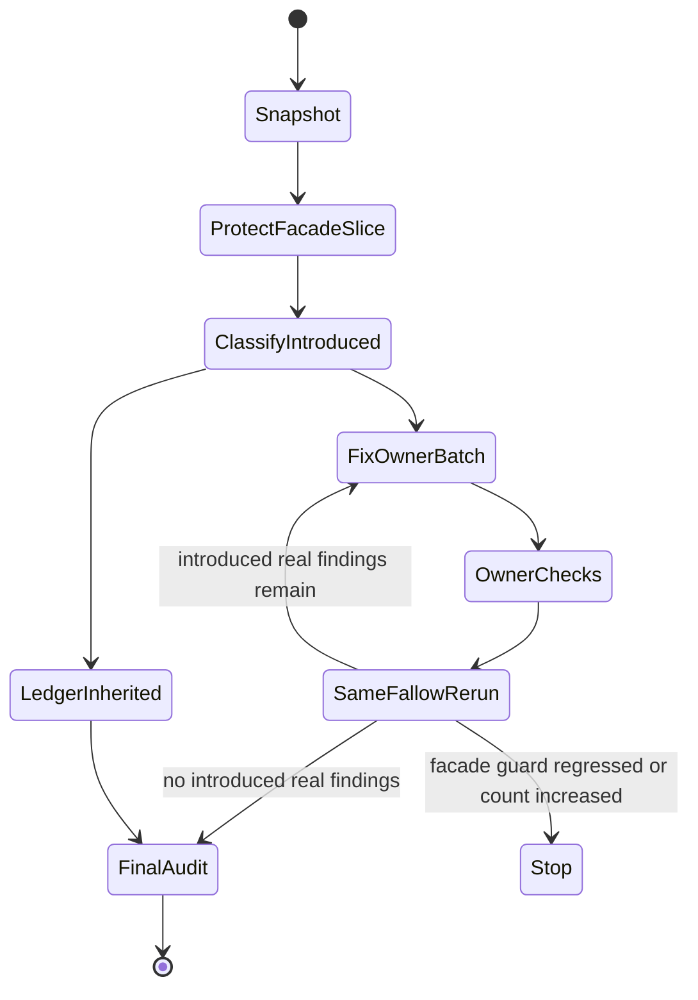

# fix: Reconcile Whole-Branch Fallow Findings

## Summary

Reconcile the whole-branch Fallow audit without turning inherited repo debt into this branch's scope.

The plan snapshots branch state, classifies introduced findings by owner, fixes only branch-owned real findings in small batches, protects the already-clean facade slice, and records inherited or analyzer-noise findings as evidence rather than surprise implementation work.

---

## Problem Frame

The branch now mixes committed feature work, tracked uncommitted fixes, and untracked follow-up files. A whole-branch Fallow audit against `main` reported `202` findings: `73` introduced, `128` inherited, and `69` changed files. The package-scoped current-task audit for `runtime/cli-command-facade` is already clean after focused test additions, but the whole-branch audit still reports the older committed facade findings.

The risk is workflow drift, not a single code defect. If the implementation chases all raw findings, it will absorb inherited cleanup, analyzer noise, contract-export false positives, and broad dedupe refactors across unrelated owners. If it ignores the whole-branch view, PR prep remains blocked by unclassified introduced findings.

---

## Requirements

**Audit Scope**

- R1. Snapshot committed, tracked-uncommitted, and untracked branch state before triage.
- R2. Treat Fallow `introduced` attribution as the active work queue.
- R3. Treat inherited findings as context unless they are security/data-risk issues or directly block a changed runtime path.
- R4. Classify every introduced finding as real, analyzer-noise, deferred, or blocked with evidence.

**Fix Discipline**

- R5. Batch fixes by owner surface, not by finding type or raw count.
- R6. Preserve the current clean `runtime/cli-command-facade` slice after every relevant batch.
- R7. Never bulk-delete exports from `remove-export` findings.
- R8. Use resolver and reachability evidence before removing any introduced export.
- R9. Do not run Fallow `fix-apply`; use preview evidence only when helpful.

**Verification**

- R10. Rerun the same whole-branch Fallow audit after each owner batch and compare before/after introduced counts.
- R11. Stop when a batch increases introduced real findings or regresses the clean facade guard.
- R12. Run owner package tests and typechecks for every changed owner batch.
- R13. Finish with zero introduced real findings, or a durable ledger for justified analyzer noise and deferred inherited context.

**Boundaries**

- R14. Keep Station Maps optional; do not promote them into a mandatory branch gate.
- R15. Preserve generated-output discipline: edit source docs, not generated HTML, unless the source is unavailable.
- R16. Preserve unrelated dirty changes and stage nothing without explicit user approval.

---

## Key Technical Decisions

- KTD1. **Done means zero introduced real findings, not zero raw findings:** Fallow is useful but noisy on integration-heavy CLI tests, public contract exports, and package-owned fixture helpers. A raw-zero target would invite unsafe refactors; the shippable target is introduced real findings resolved and justified noise ledgered.
- KTD2. **Attribution is the first gate:** The Fallow audit owns the introduced/inherited split. Implementation should parse JSON and group by `introduced`, owner path, action, and source state before editing.
- KTD3. **Owner batches preserve boundaries:** `skill-feedback`, `cli-execution-auditor`, `worktree`, `agent-worktree`, facade, root scripts, and docs have different contracts and tests. Batching by owner reduces accidental cross-package abstractions.
- KTD4. **Exports are contract surfaces until proven otherwise:** `remove-export` findings are candidates only when introduced, traceable, not public contract surface, and backed by resolver evidence plus local reachability checks.
- KTD5. **The facade slice is a guardrail:** `runtime/cli-command-facade` already has a clean current-task Fallow result. Future batches must not regress its scoped audit, package tests, or typecheck.
- KTD6. **Station Maps verify pilot coverage only:** Branch Station Maps claim Declared Branch Coverage and remain optional in this iteration. Missing `worktree` or `agent-worktree` catalogs stay follow-up unless the branch explicitly introduced them.

---

## High-Level Technical Design

---

## Current Audit Shape

| Finding group | Count | Default disposition |
| --- | ---: | --- |
| `skills/skill-feedback` inherited `add-tests` | 71 | Ledger inherited unless directly blocking new Branch Station pilot behavior. |
| `skills/cli-execution-auditor` introduced `extract-shared` | 66 | Triage as owner batch; extract only when shared concept improves readability. |
| `skills/skill-feedback` introduced `extract-shared` | 23 | Triage after catalog/integration ownership is clear. |
| `skills/worktree` introduced `extract-shared` | 18 | Keep package setup local; avoid shared abstractions for test fixture mechanics. |
| `skills/browser-use` introduced `extract-shared` | 12 | Verify whether these are branch-owned or unrelated branch drift before edits. |
| `skills/cli-execution-auditor` introduced `add-tests` | 12 | Intersect with existing fixture and CLI surface coverage. |
| `skills/skill-feedback` introduced `remove-export` | 7 | Require resolver/reachability evidence before any export removal. |
| `runtime/agent-worktree` introduced `extract-shared` | 7 | Keep git/worktree setup local unless helper is already repeated in owner tests. |
| `runtime/agent-worktree` introduced `remove-export` | 6 | Treat test support exports as risky; prove unused before removal. |
| `runtime/cli-command-facade` introduced `add-tests` | 6 | Already fixed in current-task slice; protect with scoped rerun. |

---

## Implementation Units

### U1. Freeze Branch And Fallow Evidence

**Goal:** Capture the exact branch state and baseline audit data before any reconciliation edits.

**Requirements:** R1, R2, R10.

**Dependencies:** None.

**Files:** `docs/reviews/2026-06-15-whole-branch-fallow-reconciliation.md`.

**Approach:** Create a review note with branch name, base ref, committed branch diff inventory, tracked dirty files, untracked files, whole-branch Fallow summary, and scoped facade current-task summary. The note is evidence, not a suppression list. It should avoid raw full JSON unless a compact table cannot preserve the needed classification.

**Patterns to follow:** `skills/fallow/references/workflows.md`, `skills/create-skill/references/skill-roles.md`, `docs/reviews/2026-06-13-003-skill-feedback-merge-readiness/`.

**Test scenarios:**

- Evidence lists committed, tracked-uncommitted, and untracked source states separately.
- Evidence records the whole-branch audit `base_ref`, changed file count, introduced count, and inherited count.
- Evidence records the scoped facade current-task audit as clean.
- Evidence keeps inherited findings summarized by count and owner, not expanded into active tasks.

**Verification:** A future agent can reconstruct why a finding was active, inherited, or out of scope without reading the transcript.

### U2. Build Introduced-Finding Triage Ledger

**Goal:** Convert the 73 introduced raw findings into owner-batched decisions.

**Requirements:** R2, R3, R4, R5, R13.

**Dependencies:** U1.

**Files:** `docs/reviews/2026-06-15-whole-branch-fallow-reconciliation.md`.

**Approach:** Parse Fallow JSON and build a compact ledger with columns: owner batch, source state, finding action, path, symbol or line, disposition, evidence, and planned action. Dispositions are `real`, `noise`, `defer`, or `blocked`. Use owner batches in this order: facade guard, `skill-feedback`, `cli-execution-auditor`, `worktree`, `agent-worktree`, root scripts, docs/new skills, unrelated branch drift.

**Patterns to follow:** Fallow audit attribution workflow, coverage-intersect workflow for noisy CLI findings, and the repo rule to separate introduced findings from inherited context.

**Test scenarios:**

- Every introduced Fallow issue reference appears in exactly one owner batch.
- Inherited findings are summarized but do not enter owner-batch fix queues.
- Unattributed findings are marked blocked until rerun or parsed evidence explains the missing attribution.
- Raw `extract-shared` findings are not automatically treated as real.
- Raw `add-tests` findings are kept only when coverage or missing scenario evidence supports them.

**Verification:** The ledger count reconciles back to the Fallow JSON introduced count.

### U3. Resolve Contract Export Findings Safely

**Goal:** Triage introduced `remove-export` findings without deleting public or test-support contracts accidentally.

**Requirements:** R4, R7, R8, R9, R12.

**Dependencies:** U2.

**Files:** `skills/skill-feedback/src/branch-station-catalog.ts`, `skills/skill-feedback/src/branch-station-evidence.ts`, `runtime/agent-worktree/tests/support.ts`, owner tests named by the ledger.

**Approach:** For each introduced `remove-export`, first check whether Fallow advertises a resolver action. When it does, use that evidence plus local reachability search. When it does not, treat the finding as analyzer-noise unless the export is private to the file and demonstrably unused. Do not remove exports from command contracts, public package roots, fixtures consumed dynamically, or test-support modules without owner tests proving the deletion.

**Patterns to follow:** `skills/fallow/references/workflows.md` Finding Resolver Actions, package public export patterns, and existing package-boundary tests.

**Test scenarios:**

- Public Branch Station catalog exports are kept when imported by integration tests or auditor fixtures.
- Test support helpers are kept when package tests or future integration rows import them.
- A removed export has no `rg` references, no barrel export dependency, and no package-boundary role.
- Owner tests and typecheck pass after each removal.

**Verification:** No public API or test support surface disappears without evidence and passing owner checks.

### U4. Resolve Skill-Feedback Pilot Findings

**Goal:** Clean real introduced findings in the Branch Station pilot without absorbing inherited `skill-feedback` debt.

**Requirements:** R3, R4, R5, R12, R14.

**Dependencies:** U2, U3.

**Files:** `skills/skill-feedback/src/branch-station-catalog.ts`, `skills/skill-feedback/src/branch-station-evidence.ts`, `skills/skill-feedback/src/skill-feedback.integration.test.ts`, `skills/skill-feedback/src/skill-feedback.test.ts`, `skills/skill-feedback/src/command-contract.test.ts`.

**Approach:** Treat new catalog and integration files as active branch scope. Resolve duplicated matrix helpers when extraction preserves the package-owned vocabulary. Leave inherited deep parser and runner `add-tests` findings out of scope unless the new Branch Station code depends on that path. Preserve direct-runner stdin behavior and avoid `bun --filter` assertions for output-sensitive closeout flows.

**Patterns to follow:** `skills/skill-feedback/SKILL.md`, `skills/skill-feedback/references/closeout-receipt.md`, `skills/skill-feedback/docs/plans/2026-06-15-002-feat-cli-branch-station-maps-plan.md`.

**Test scenarios:**

- Branch Station catalog still validates all planning seed ids.
- Integration evidence still covers required deterministic stations.
- Extracted helpers do not move package-specific branch vocabulary into the facade.
- Inherited `skill-feedback` `add-tests` findings remain summarized as inherited context.

**Verification:** `skill-feedback` package tests and typecheck pass, and the owner batch has no introduced real Fallow findings.

### U5. Resolve CLI Execution Auditor Findings

**Goal:** Clean real introduced findings in Station Map auditor code while preserving existing lane-clause behavior.

**Requirements:** R4, R5, R10, R12, R14.

**Dependencies:** U2.

**Files:** `skills/cli-execution-auditor/src/station-map.ts`, `skills/cli-execution-auditor/src/acquire-station-map-worker.ts`, `skills/cli-execution-auditor/src/auditor.ts`, `skills/cli-execution-auditor/src/auditor.test.ts`, `skills/cli-execution-auditor/src/fixtures/**`, `skills/cli-execution-auditor/src/ledger/**`.

**Approach:** Split real duplication only along existing auditor boundaries: command parsing, Station Map acquisition, rendering, ledger signature, and fixture setup. Add tests only where Fallow points to uncovered pure branches or CLI surface behavior. Keep fixture code explicit when abstraction would hide the scenario.

**Patterns to follow:** `skills/cli-execution-auditor/src/audit-engine.ts`, `skills/cli-execution-auditor/src/auditor.ts`, `skills/cli-execution-auditor/src/clause-catalog.ts`, and create-cli command-surface proof rules.

**Test scenarios:**

- Existing audit lane fixture tests stay green.
- `station-map` command help, parser acceptance, invalid flag behavior, JSON output, and no-catalog state remain covered.
- Introduced `add-tests` findings map to explicit tests or are ledgered as integration/fixture noise.
- Plain rendering helpers keep expected output shape after any extraction.

**Verification:** Auditor package tests and typecheck pass, and whole-branch Fallow introduced auditor real findings are resolved or ledgered.

### U6. Resolve Worktree Owner Findings

**Goal:** Triage `worktree`, `agent-worktree`, and root sentinel findings without centralizing package-specific setup.

**Requirements:** R4, R5, R6, R12, R16.

**Dependencies:** U2, U3.

**Files:** `skills/worktree/src/worktree.integration.test.ts`, `skills/worktree/src/worktree.ts`, `runtime/agent-worktree/tests/entrypoint.integration.test.ts`, `runtime/agent-worktree/tests/support.ts`, `runtime/agent-worktree/src/cli.ts`, `scripts/command-entrypoint.integration.test.ts`.

**Approach:** Keep temp git repositories, command builders, and package assertions local. Extract only duplicated package-agnostic process mechanics to facade helpers when not already done. Prefer package-local tests for owner behavior and keep the root command-entrypoint suite as a cross-entrypoint sentinel. Update stale comments that still claim shared helpers are local.

**Patterns to follow:** `skills/worktree/src/worktree.test.ts`, `runtime/agent-worktree/tests/cli-surface.test.ts`, root `scripts/command-entrypoint.integration.test.ts`, and `runtime/cli-command-facade/src/process-testing.ts`.

**Test scenarios:**

- `worktree` integration tests prove deterministic package behaviors without GUI-launch coverage.
- `agent-worktree` integration tests prove deterministic entrypoint and alias parity.
- Root command-entrypoint integration remains a smaller sentinel and still passes.
- Test support exports survive when they are package-owned integration seams.

**Verification:** `worktree`, `agent-worktree`, and root sentinel tests pass; Fallow does not gain new introduced real findings for these owners.

### U7. Resolve Docs And New-Skill Findings

**Goal:** Triage introduced findings outside the main Station Map path without editing generated artifacts or unrelated history.

**Requirements:** R4, R5, R15, R16.

**Dependencies:** U2.

**Files:** `skills/bad-practices/**`, `skills/browser-use/**`, `skills/classic-cinema/**`, `skills/test-runner/**`, `skills/record-decision/**`, `runbooks/issue-to-pr-v2/**`, `hooks/skill-feedback-hooks.test.ts`, `CONTEXT.md`, `skills/create-cli/references/cli-command-facade.md`.

**Approach:** Confirm each path is branch-owned before editing. For skill docs, edit canonical markdown/source files and YAML-parse touched `SKILL.md` files. For generated ideation HTML, leave output alone unless no source exists. For test duplication findings, extract only when it names a reusable concept instead of hiding scenario clarity.

**Patterns to follow:** AGENTS generated-output rule, skill authoring rules, and the bad-practices requirement that advisory skills do not copy owner contracts.

**Test scenarios:**

- Touched `SKILL.md` frontmatter parses.
- New or changed docs point to owner paths rather than duplicating schemas.
- Generated-looking HTML is not edited for analyzer aesthetics.
- Hook/runbook/test-runner dedupe does not hide scenario-specific assertions.

**Verification:** Relevant owner tests, YAML checks, and typechecks pass for every touched owner.

### U8. Final Reconciliation And Handoff

**Goal:** Produce final evidence that the branch is shippable from the Fallow perspective.

**Requirements:** R10, R11, R12, R13, R16.

**Dependencies:** U1 through U7.

**Files:** `docs/reviews/2026-06-15-whole-branch-fallow-reconciliation.md`.

**Approach:** Rerun the same whole-branch audit and the scoped facade current-task guard. Update the review note with before/after counts, resolved real findings, ledgered analyzer noise, inherited context count, blocked items if any, and owner checks run. Stop if introduced real findings remain without disposition.

**Patterns to follow:** Fallow self-review rerun loop and skill-feedback closeout practice.

**Test scenarios:**

- Whole-branch Fallow before/after counts are recorded.
- Scoped facade Fallow remains clean.
- Owner checks named in each completed batch are recorded.
- Residual inherited findings are summarized separately from branch-owned noise.
- Any blocked finding names the missing evidence or user decision needed.

**Verification:** The branch has zero introduced real Fallow findings, or every residual has a durable disposition and owner.

---

## Scope Boundaries

### In Scope

- Whole-branch Fallow triage and reconciliation.
- Current-task facade guard preservation.
- Owner-batched cleanup for branch-owned introduced findings.
- Manual, evidence-backed fixes only.
- Durable triage ledger for introduced, inherited, noisy, and deferred findings.

### Deferred To Follow-Up Work

- Spending down the `128` inherited findings.
- Building a repo-level Fallow noise profile.
- Making Station Maps mandatory gates.
- Full `worktree` and `agent-worktree` Branch Station Catalogs.
- Broad style-only dedupe outside the changed branch surface.

### Out Of Scope

- Fallow `fix-apply`.
- Bulk export deletion.
- Generated-output churn.
- Whole-repo health refactors.
- Treating raw Fallow zero as the only acceptable finish state.

---

## Risks And Dependencies

- **Dirty branch state can confuse attribution:** Mitigate with explicit committed/tracked/untracked snapshot before triage.
- **Analyzer noise can look actionable:** Mitigate with coverage-intersect, owner tests, and durable dispositions.
- **Inherited findings can swamp the branch:** Mitigate by keeping them in ledger context only.
- **Dedupe can erase scenario clarity:** Mitigate by extracting named concepts only.
- **Export removal can break public contracts:** Mitigate with resolver evidence, reachability checks, and owner tests.
- **Facade regression would undercut shared helpers:** Mitigate with scoped facade Fallow, package tests, and typecheck after relevant batches.

---

## Sources And Research

- `skills/fallow/SKILL.md`
- `skills/fallow/references/workflows.md`
- `skills/fallow/references/commands.md`
- `skills/fallow/references/safety.md`
- `docs/plans/2026-06-09-001-fix-fallow-scope-authority-plan.md`
- `skills/skill-feedback/docs/plans/2026-06-15-002-feat-cli-branch-station-maps-plan.md`
- `skills/skill-feedback/docs/brainstorms/2026-06-15-deterministic-cli-branch-confidence-requirements.md`
- `docs/ideation/2026-06-13-repo-workability-improvements-ideation.html`
- `skills/create-skill/references/skill-roles.md`
- `skills/create-cli/references/cli-command-facade.md`
- `runtime/cli-command-facade/AGENTS.md`
- `runtime/cli-command-facade/tests/station-map.test.ts`
- `runtime/cli-command-facade/tests/process-testing.test.ts`
