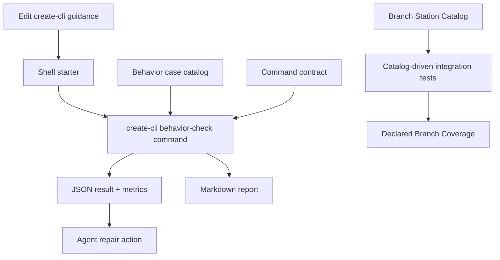

# feat: Add create-cli behavior regression package

## Summary

Implement the `create-cli` architecture-deepening scope as a first-class, agent-native, facade-backed command surface in the `skills/create-cli` package.

The work still splits design-lane routing from facade-backed enforcement, but the behavior-regression proof is no longer a prose-marker shell script. The source of truth becomes a package-owned behavior catalog, Branch Station Catalog, catalog tests, catalog-driven process tests, machine-readable metrics, and a thin shell starter that delegates into the package.

---

## Accepted Review Direction

- Keep the shell starter.
- Move contract ownership into the `skills/create-cli` package.
- Treat the behavior check as an agent-native CLI command.
- Use `@side-quest/cli-command-facade` for command metadata, help, JSON, errors, and runtime envelopes.
- Use Branch Station Catalogs for expected behavior branches.
- Use catalog-first tests before runner behavior.
- Emit human Markdown and machine JSON.
- Expose metrics from the command result, not from ad hoc report scraping.

---

## Problem Frame

The current `create-cli` guidance still presents Facade-backed as a lane beside Basic and Agent-native, even though the newer architecture decision treats facade-backed as optional enforcement.

The current behavior checklist relies on agent judgment over prose, so a future edit can remove or contradict a key rule while still looking reviewed.

A shell-only static marker check would improve this, but it would create a weak parallel contract: human Markdown, exit code only, no discoverable command metadata, no Branch Station oracle, and no agent-readable repair data. The repo already has the stronger pattern: facade-backed CLI contracts, Branch Station Catalogs, and catalog-driven integration tests.

---

## Requirements

**Router Shape**

- R1. `create-cli` presents Basic CLI and Agent-native CLI as the design-lane decision.
- R2. Facade-backed appears as optional enforcement only when explicitly requested, when reusable TypeScript runtime validation is the point, or when the existing surface is facade-owned.
- R3. Bun TypeScript remains ambiguous and never implies Agent-native or Facade-backed by itself.

**Behavior Catalog**

- R4. The package owns a catalog of behavior cases for the `create-cli Behavior Regression Check`.
- R5. Each behavior case names the source files it inspects, required positive markers, forbidden negative markers, output expectation, and repair hint.
- R6. The catalog covers Basic routing, ambiguous Bun TypeScript routing, Agent-native routing, Facade-backed routing, and copied-runtime-contract avoidance.
- R7. The catalog marks prompt-simulation cases as deferred/manual when v1 does not execute a prompt harness.
- R8. Tests prove every core checklist expectation is represented by a catalog case or explicitly deferred with rationale.

**Agent-Native Command Surface**

- R9. The behavior check is implemented as a facade-backed command in `skills/create-cli`.
- R10. The command exposes discoverable help, command metadata, stdout/stderr separation, stable exit codes, JSON output, Markdown output, structured errors, and run correlation.
- R11. The command accepts a checked root through a flag or environment override and fails with repair guidance when the root is invalid.
- R12. The command emits machine-readable marker results, missing strings, forbidden-string hits, checked files, metrics, and next repair action.
- R13. The shell starter remains as a thin convenience entry point and delegates to the package command without owning contract logic.

**Branch Station Proof**

- R14. The plan names initial Branch Station ids before runner implementation.
- R15. The package owns a Branch Station Catalog beside the command contract.
- R16. Branch Station catalog tests validate station ids against live command discovery and prove declared coverage projection.
- R17. Catalog-driven integration tests iterate every station through the public command surface.
- R18. Missing, drifted, skipped, and declared-unreachable stations stay visible in Station Map evidence.

**Metrics**

- R19. The command result includes test metrics useful to agents: total cases, passing cases, failing cases, deferred/manual cases, checked files, positive marker count, negative marker count, missing marker count, forbidden hit count, and elapsed milliseconds.
- R20. Metrics are part of the package-owned result vocabulary and are tested through JSON output.
- R21. Markdown renders the same metrics for humans without becoming the machine contract.

**Scope Control**

- R22. V1 does not implement provenance-map work.
- R23. V1 does not implement runtime-owned facade capability maps or proof-helper consolidation.
- R24. V1 keeps runtime schemas, helper signatures, generated envelopes, parser rules, and package command vocabulary out of `create-cli` prose.
- R25. V1 does not simulate agent prompt runs; it preserves those cases as catalog entries with manual/deferred status.

---

## Key Technical Decisions

- **Package-owned command:** `skills/create-cli` already has a Bun package and facade dependency. The behavior check belongs there, not as a standalone shell contract.
- **Shell starter stays thin:** keep `references/check-behavior-regression.sh` as a human-friendly starter that calls the package runner. It owns path convenience only.
- **Catalog before runner:** write the behavior case catalog and Branch Station Catalog first. Runner behavior works toward that declared target.
- **Facade-backed by construction:** use the CLI command facade so discovery, help, JSON envelopes, structured failures, and runtime semantics share the existing owner path.
- **Positive and negative markers:** a passing check requires required strings to exist and forbidden stale wording to be absent.
- **Metrics as result data:** metrics live in the command result contract, not scraped from Markdown.
- **No prompt simulation in v1:** static file checks are the v1 proof; prompt execution remains a catalog-visible deferred/manual branch.

---

## High-Level Technical Design



---

## Initial Branch Station Set

| Station id | Command | Classification | Intent | Expected exit |
| --- | --- | --- | --- | ---: |
| `check.pass` | `behavior-check` | required | all cataloged static cases pass | 0 |
| `check.missing_positive_marker` | `behavior-check` | required | required marker missing | 1 |
| `check.forbidden_marker_hit` | `behavior-check` | required | stale forbidden wording present | 1 |
| `check.invalid_root` | `behavior-check` | required | checked root cannot be resolved | 2 |
| `check.json_output` | `behavior-check` | required | JSON output includes result data and metrics | 0 |
| `check.markdown_output` | `behavior-check` | required | Markdown output renders human summary | 0 |
| `check.manual_deferred_cases` | `behavior-check` | required | prompt-simulation cases remain visible as deferred/manual | 0 |
| `check.shell_starter_delegates` | `behavior-check` | required | shell starter delegates to package command | 0 |

---

## Output Structure

```text
skills/create-cli/
  package.json
  src/
    behavior-case-catalog.ts
    behavior-case-catalog.test.ts
    branch-station-catalog.ts
    branch-station-catalog.test.ts
    command-contract.ts
    command-contract.test.ts
    behavior-check-engine.ts
    behavior-check-engine.test.ts
    behavior-check-runner.ts
    behavior-check.integration.test.ts
    facade-resolution-smoke.ts
  references/
    behavior-regression-checklist.md
    check-behavior-regression.sh
```

---

## Implementation Units

### U1. Two-step create-cli router

- **Goal:** Update `create-cli` guidance so Facade-backed is enforcement after the Basic vs Agent-native design decision.
- **Requirements:** R1, R2, R3, R24
- **Dependencies:** None
- **Files:**
  - `skills/create-cli/SKILL.md`
  - `skills/create-cli/references/agent-native-cli-design.md`
  - `skills/create-cli/references/behavior-regression-checklist.md`
- **Approach:** Replace three-lane wording with a two-step routing model. Keep the skill compact and route-oriented. Update the checklist's expected markers so ambiguous Bun TypeScript proves the two-step decision.
- **Test scenarios:**
  - Given `Create a Bun TypeScript CLI`, the expected behavior stays ambiguous until the user chooses Basic, Agent-native, or facade-backed enforcement.
  - Given an explicit `facade-backed` request, the expected behavior applies Agent-native design before the facade path.
  - Given an explicit `agent-native Python CLI` request, the expected behavior does not require TypeScript or facade-backed runtime validation.
- **Verification:** Behavior catalog cases cover each routing decision and stale wording search.

### U2. Behavior case catalog first

- **Goal:** Create the package-owned source of truth for behavior-regression cases before writing runner behavior.
- **Requirements:** R4, R5, R6, R7, R8, R24, R25
- **Dependencies:** U1
- **Files:**
  - `skills/create-cli/src/behavior-case-catalog.ts`
  - `skills/create-cli/src/behavior-case-catalog.test.ts`
  - `skills/create-cli/references/behavior-regression-checklist.md`
- **Approach:** Encode each checklist case as data: id, title, inspected files, positive marker groups, forbidden marker groups, output expectation, status, and repair hint. Mark prompt-simulation-only cases as manual/deferred in v1. Keep exact result vocabulary in code and tests, not prose.
- **Test scenarios:**
  - Catalog ids are unique and stable.
  - Every active checklist expectation maps to a catalog case.
  - Every deferred/manual checklist expectation carries a rationale.
  - Positive marker groups require all listed strings.
  - Forbidden marker groups fail when any stale string appears.
  - No catalog entry copies facade runtime schemas, helper signatures, parser rules, or generated envelope fields.
- **Verification:** Catalog tests fail before runner code can fake coverage.

### U3. Facade-backed command contract

- **Goal:** Define the `behavior-check` command surface through `@side-quest/cli-command-facade`.
- **Requirements:** R9, R10, R11, R12, R19, R20, R21, R24
- **Dependencies:** U2
- **Files:**
  - `skills/create-cli/src/command-contract.ts`
  - `skills/create-cli/src/command-contract.test.ts`
  - `skills/create-cli/package.json`
- **Approach:** Add a package command such as `create-cli-behavior-check`. The command supports Markdown and JSON output, a checked-root override, no-input behavior, stable success/failure/usage exits, and structured repair data.
- **Test scenarios:**
  - Command contract validates at construction.
  - Help renders all advertised flags.
  - Unknown flags exit `2` with structured usage error.
  - Invalid root exits `2` and writes diagnostics to stderr or structured JSON error.
  - JSON output includes result data, metrics, run id, and repair action when failing.
  - Markdown output stays human-readable and is not the machine contract.
- **Verification:** Command Surface Alignment Proof covers discovery metadata, rendered help, parser acceptance/rejection, and runtime semantics.

### U4. Branch Station Catalog

- **Goal:** Declare the expected behavior branches for the `behavior-check` command before process tests.
- **Requirements:** R14, R15, R16, R18
- **Dependencies:** U3
- **Files:**
  - `skills/create-cli/src/branch-station-catalog.ts`
  - `skills/create-cli/src/branch-station-catalog.test.ts`
- **Approach:** Translate the Initial Branch Station Set into a package-owned catalog beside the command contract. Validate against live command discovery and project Declared Branch Coverage.
- **Test scenarios:**
  - Catalog references only live command ids from the command contract.
  - Every planning-stage station id is present or has skip/unreachable rationale.
  - Duplicate station ids fail validation.
  - Unknown command ids fail validation.
  - Required-but-uncovered stations remain visible in projection.
  - Station Map claims Declared Branch Coverage only.
- **Verification:** Branch Station catalog tests pass before integration tests are added.

### U5. Behavior check engine and metrics

- **Goal:** Implement static file-marker evaluation against the behavior catalog.
- **Requirements:** R4, R5, R6, R7, R12, R19, R20, R21, R25
- **Dependencies:** U2, U3
- **Files:**
  - `skills/create-cli/src/behavior-check-engine.ts`
  - `skills/create-cli/src/behavior-check-engine.test.ts`
- **Approach:** Read target files from the checked root, evaluate positive and negative marker groups, aggregate status and metrics, and produce repair hints. Keep IO boundaries thin so unit tests can run against temp roots.
- **Test scenarios:**
  - Passing temp root reports all active cases passing.
  - Missing positive marker reports the case id, file, marker group, and missing string.
  - Forbidden stale wording reports the case id, file, marker group, and matched string.
  - Missing inspected file reports a structured failure with repair hint.
  - Deferred/manual cases count in metrics but do not fail the static check.
  - Metrics counts stay deterministic.
- **Verification:** Engine tests cover happy, nil/missing file, empty file, and marker-error paths.

### U6. Runner, JSON, Markdown, and shell starter

- **Goal:** Wire the facade-backed runner and preserve the shell starter as a thin delegating entry point.
- **Requirements:** R9, R10, R11, R12, R13, R19, R20, R21
- **Dependencies:** U3, U5
- **Files:**
  - `skills/create-cli/src/behavior-check-runner.ts`
  - `skills/create-cli/references/check-behavior-regression.sh`
  - `skills/create-cli/package.json`
- **Approach:** Make the runner the contract owner. The shell starter resolves the repo-local package command and forwards args/env; it does not duplicate marker logic or output formatting.
- **Test scenarios:**
  - `--help` prints help and ignores other args.
  - `--json` emits parseable result data and no human prose on stdout.
  - Default Markdown output emits summary, metrics, failures, and repair hint.
  - Failure diagnostics go to stderr in Markdown mode.
  - Shell starter delegates to the package command and preserves exit code.
  - Shell starter has no duplicated marker list.
- **Verification:** Public runner and shell starter both pass process tests.

### U7. Catalog-driven integration tests

- **Goal:** Prove every Branch Station through the public command surface.
- **Requirements:** R16, R17, R18, R20, R21
- **Dependencies:** U4, U6
- **Files:**
  - `skills/create-cli/src/behavior-check.integration.test.ts`
  - `skills/create-cli/src/branch-station-catalog.ts`
- **Approach:** Use the existing facade testing-subpath pattern: a `Record<StationId, StationScenario>` keyed by every station id, process spawns where useful, `BranchStationEvidence` collection, and Station Map projection.
- **Test scenarios:**
  - Every catalog station has a scenario row.
  - `check.pass` covers a clean temp root.
  - `check.missing_positive_marker` covers a temp root missing the Bun TypeScript ambiguity rule.
  - `check.forbidden_marker_hit` covers a temp root with stale three-lane wording.
  - `check.invalid_root` covers missing root.
  - `check.json_output` validates parseable JSON and metrics.
  - `check.markdown_output` validates human summary without snapshotting whole output.
  - `check.manual_deferred_cases` proves deferred prompt cases remain visible.
  - `check.shell_starter_delegates` proves wrapper parity.
- **Verification:** Station Map reports no missing required stations for the final implementation.

### U8. Checklist handoff and final proof

- **Goal:** Make future agents use the package command and prove the plan did not leave stale documentation.
- **Requirements:** R1-R25
- **Dependencies:** U1-U7
- **Files:**
  - `skills/create-cli/SKILL.md`
  - `skills/create-cli/references/behavior-regression-checklist.md`
  - `skills/create-cli/references/cli-command-facade.md`
  - `skills/create-cli/src/*`
  - `skills/create-cli/package.json`
- **Approach:** Link the shell starter and package command from the skill's next safe action. Keep exact fields in code/tests. Document that prompt simulation is deferred/manual in v1. Run final proof with the package command.
- **Test scenarios:**
  - Package tests pass through the repo test runner.
  - TypeScript passes for `skills/create-cli`.
  - `bun run skills/create-skill/scripts/check-owner-paths.ts --json` passes after owner-path edits.
  - `skills/create-cli/SKILL.md` frontmatter parses.
  - Targeted search finds no stale wording that makes Facade-backed a competing design lane.
  - Targeted search finds no Bun TypeScript auto-facade trigger.
  - Targeted search finds no copied facade runtime schema, helper signature, parser rule, or generated envelope example added by this work.
- **Verification:** Final evidence includes passing unit tests, catalog tests, catalog-driven integration tests, owner-path check, frontmatter parse, and behavior-check JSON.

---

## Scope Boundaries

### In Scope

- Update `create-cli` routing language to the two-step design-lane and enforcement-path model.
- Add package-owned behavior case catalog.
- Add facade-backed behavior-check command in `skills/create-cli`.
- Add Branch Station Catalog and catalog-driven integration tests.
- Emit JSON and Markdown output.
- Emit test metrics in result data.
- Keep the shell starter as a thin delegating entry point.
- Check positive required markers and negative forbidden markers.

### Deferred to Follow-Up Work

- Provenance extension-map work.
- Runtime-owned facade capability map or drift check.
- Command Surface Alignment Proof helper consolidation.
- Prompt-simulation harness for `create-cli`.
- Generated HTML reports.
- Mandatory gate promotion beyond the `create-cli` package.

### Out of Scope

- Runtime code changes in `runtime/cli-command-facade/` unless tests reveal a missing exported helper already promised by `cli-command-facade.md`.
- New ADRs.
- Copying facade runtime contracts into `create-cli` prose.
- Whole-output Markdown snapshots.

---

## Risks And Dependencies

- **Package scope creep:** The command can grow into a general prompt simulator. Mitigate by keeping v1 static and catalog-visible.
- **Marker brittleness:** Static text checks can fail on harmless wording changes. Mitigate with broad groups plus negative contradiction checks.
- **False confidence:** Static markers prove written guidance, not live agent behavior. Mitigate by making prompt-simulation cases explicit deferred/manual catalog entries.
- **Wrapper drift:** The shell starter can diverge from the runner. Mitigate by testing delegation and banning duplicated marker lists.
- **Metrics theater:** Metrics can look precise while missing behavior. Mitigate by tying metrics to catalog cases and Station Map evidence.

---

## Sources And Research

- Origin requirements: `docs/brainstorms/2026-06-16-create-cli-architecture-deepening-requirements.md`
- Branch-confidence requirements: `skills/skill-feedback/docs/brainstorms/2026-06-15-deterministic-cli-branch-confidence-requirements.md`
- Branch Station plan: `skills/skill-feedback/docs/plans/2026-06-15-002-feat-cli-branch-station-maps-plan.md`
- Current skill: `skills/create-cli/SKILL.md`
- Current checklist: `skills/create-cli/references/behavior-regression-checklist.md`
- Agent-native design owner: `skills/create-cli/references/agent-native-cli-design.md`
- Facade path owner: `skills/create-cli/references/cli-command-facade.md`
- Front-door layout owner: `skills/create-cli/references/cli-front-door-layouts.md`
- Skill design runbook: `skills/create-skill/references/skill-design-decision-runbook.md`
- Bounded extension decision: `docs/adr/0009-create-cli-uses-bounded-local-extension.md`
- Runtime ownership decision: `docs/adr/0005-template-scaffold-contracts-are-runtime-owned.md`
