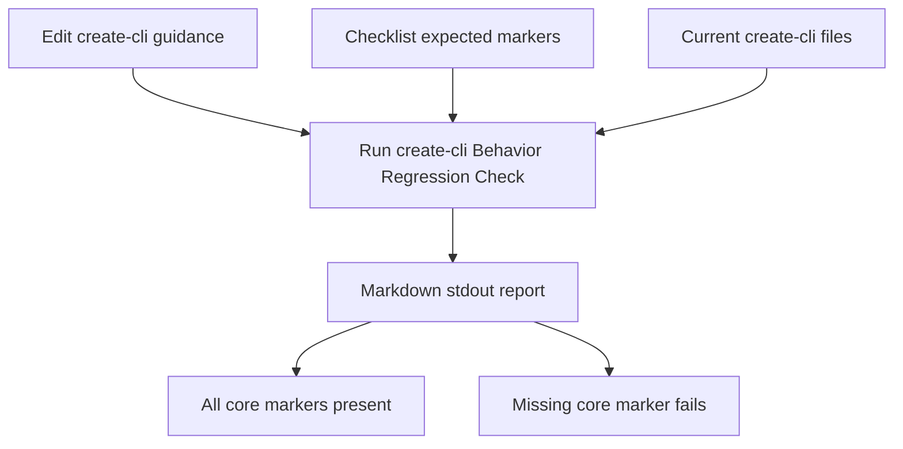

# feat: Add create-cli architecture deepening v1

## Summary

Implement the v1 `create-cli` architecture-deepening scope: split design-lane routing from facade-backed enforcement and add the `create-cli Behavior Regression Check` as a small static marker check.
The check prints a markdown report to stdout and fails when core routing markers drift.

---

## Problem Frame

The current `create-cli` guidance still presents Facade-backed as a lane beside Basic and Agent-native, even though the newer architecture decision treats facade-backed as optional enforcement.
The current behavior checklist also relies on agent judgment over prose, so a future edit can remove a key rule while still looking reviewed.

---

## Requirements

**Router Shape**

- R1. `create-cli` presents Basic CLI and Agent-native CLI as the design-lane decision.
- R2. Facade-backed appears as optional enforcement only when explicitly requested, when reusable TypeScript runtime validation is the point, or when the existing surface is facade-owned.
- R3. Bun TypeScript remains ambiguous and never implies Agent-native or Facade-backed by itself.

**Behavior Regression Check**

- R4. The `create-cli Behavior Regression Check` reads current `create-cli` files and checks static markers for core routing rules.
- R5. Missing core routing markers fail the check.
- R6. The check prints markdown to stdout and writes no report files.
- R7. The check does not simulate prompt runs in v1.

**Scope Control**

- R8. V1 does not implement provenance-map work.
- R9. V1 does not implement runtime-owned facade capability maps or proof-helper consolidation.
- R10. V1 keeps runtime schemas, helper signatures, generated envelopes, parser rules, and package command vocabulary out of `create-cli` prose.

---

## Key Technical Decisions

- **Two-step router:** Basic and Agent-native are the design choices; facade-backed is a later enforcement choice. This matches the origin's ownership split and prevents Bun TypeScript from becoming a facade trigger.
- **Static markers before prompt simulation:** V1 checks the files for required rules instead of running agent prompt simulations. This makes the first guardrail real without introducing a fuzzy harness.
- **Colocated script, not package command:** The check lives beside the checklist and prints markdown to stdout. This avoids new CLI contract obligations while keeping the script easy to promote later.
- **Failure for missing core markers:** A missing core routing marker exits as a failure, not a warning. The guardrail needs to block accidental drift.
- **Checklist remains expectation map:** The markdown checklist owns behavior cases, expectations, and check usage. The script owns the v1 core marker list and fresh static evidence against current files.

---

## High-Level Technical Design

---

## Implementation Units

### U1. Two-step create-cli router

- **Goal:** Update `create-cli` guidance so Facade-backed is enforcement after the Basic vs Agent-native design decision.
- **Requirements:** R1, R2, R3, R10
- **Dependencies:** None
- **Files:**
  - `skills/create-cli/SKILL.md`
  - `skills/create-cli/references/agent-native-cli-design.md`
  - `skills/create-cli/references/behavior-regression-checklist.md`
- **Approach:** Replace three-lane wording with a two-step routing model. Keep the skill compact and route-oriented. Update the checklist's expected markers so the ambiguous Bun TypeScript case proves the two-step decision.
- **Patterns to follow:** Current terse `skills/create-cli/SKILL.md` structure; `docs/adr/0009-create-cli-uses-bounded-local-extension.md`; `skills/create-cli/references/agent-native-cli-design.md` "Facade Relationship".
- **Test scenarios:**
  - Covers AE1. Given "Create a Bun TypeScript CLI", the expected behavior stays ambiguous until the user chooses Basic, Agent-native, or facade-backed enforcement.
  - Given an explicit "facade-backed" request, the expected behavior applies Agent-native design before the facade path.
  - Given an explicit "agent-native Python CLI" request, the expected behavior does not require TypeScript or facade-backed runtime validation.
- **Verification:** The relevant files no longer describe Facade-backed as a competing design lane, and they preserve the Bun TypeScript ambiguity rule.

### U2. Static marker check script

- **Goal:** Add the first `create-cli Behavior Regression Check` as a small colocated script that reads current files and emits markdown pass/fail evidence.
- **Requirements:** R4, R5, R6, R7, R10
- **Dependencies:** U1
- **Files:**
  - `skills/create-cli/references/check-behavior-regression.sh`
  - `skills/create-cli/references/check-behavior-regression.test.sh`
  - `skills/create-cli/references/behavior-regression-checklist.md`
- **Approach:** Implement an explicit Bash script that owns and checks the v1 core routing marker list in `skills/create-cli/SKILL.md` and relevant reference files. Express each marker as a named check with a small fixed-string AND group, not exact-sentence matching. Resolve the normal `create-cli` root from the script's physical checkout path so symlinked installs and linked worktrees use the owning worktree; allow `CREATE_CLI_ROOT` to point tests at a temporary copy. Keep marker checks broad enough to tolerate prose edits but strict enough to fail when the rule disappears. Print one markdown-only report to stdout with a summary and marker table containing status, checked root, marker name, pass/fail, and missing fixed strings. Treat the exit code as the only v1 machine contract. Exit non-zero when a required marker is missing.
- **Patterns to follow:** Existing Bash style in repo scripts; `skills/create-cli/references/behavior-regression-checklist.md` prompt-case vocabulary; repo rule that generated evidence should not be committed as report files.
- **Test scenarios:**
  - Given the current v1 router text, the check prints a markdown report with passing core routing markers.
  - Given the check prints a report, the report includes status, checked root, marker name, pass/fail, and missing fixed strings for failed markers.
  - Given harmless prose edits preserve each marker's fixed-string group, the check still passes.
  - Given Bash strict mode is active, unset optional inputs do not abort normal invocation.
  - Given a temporary copy of `skills/create-cli/` where the Bun TypeScript ambiguity rule is absent, the test proves the script exits non-zero and names the missing marker without mutating live repo files.
  - Given `CREATE_CLI_ROOT` points at a temporary copy, the script checks that copy instead of the live repo path.
  - Given the script is run from a nested working directory, symlinked install, or linked worktree, it resolves the physical owner path or fails with a clear path error.
  - Given the script succeeds or fails, it writes no report file under `skills/create-cli/`, `docs/`, or temporary directories.
- **Verification:** The companion test proves both pass and fail behavior without invoking an agent prompt simulation.

### U3. Checklist handoff and v1 validation

- **Goal:** Make the checklist tell future agents how to use the new check before and after meaningful `create-cli` edits.
- **Requirements:** R4, R5, R6, R7
- **Dependencies:** U1, U2
- **Files:**
  - `skills/create-cli/references/behavior-regression-checklist.md`
  - `skills/create-cli/SKILL.md`
  - `skills/create-cli/references/check-behavior-regression.sh`
  - `skills/create-cli/references/check-behavior-regression.test.sh`
- **Approach:** Update the checklist method from prose-only review to static marker evidence plus manual judgment for anything outside v1. Keep owner-path and prompt-simulation checks deferred. Link the script from the skill's next safe action without turning it into a package script.
- **Patterns to follow:** Existing `Next Safe Action` wording in `skills/create-cli/SKILL.md`; checklist sections that separate expected markers from observed evidence.
- **Test scenarios:**
  - Covers AE2. Given an agent edits `skills/create-cli/SKILL.md`, the checklist directs it to run the check and record fresh stdout evidence.
  - Given a future agent reads the checklist, it can distinguish v1 static marker checks from deferred prompt-simulation work.
  - Given the check output is needed for review, it can be pasted from stdout without looking for generated files.
- **Verification:** The checklist names the check as the evidence path, leaves manual prompt simulation out of v1, and keeps expected marker language aligned with U1.

### U4. Final proof pass

- **Goal:** Prove the v1 plan did not create scope drift or stale documentation.
- **Requirements:** R1-R10
- **Dependencies:** U1, U2, U3
- **Files:**
  - `skills/create-cli/SKILL.md`
  - `skills/create-cli/references/agent-native-cli-design.md`
  - `skills/create-cli/references/behavior-regression-checklist.md`
  - `skills/create-cli/references/check-behavior-regression.sh`
  - `skills/create-cli/references/check-behavior-regression.test.sh`
- **Approach:** Run the new check, run the companion test, parse `SKILL.md` frontmatter, and inspect targeted searches for stale three-lane or facade-default language. Keep deferred provenance and runtime-owned work out of the diff.
- **Patterns to follow:** `docs/plans/2026-06-04-002-docs-create-cli-product-shape-rewrite-plan.md` validation posture; `skills/create-cli/PROVENANCE.md` bounded-extension ownership.
- **Test scenarios:**
  - The new check passes against the final v1 files.
  - The companion test proves missing core markers fail.
  - Targeted searches find no wording that makes Bun TypeScript an automatic facade trigger.
  - Targeted searches find no copied runtime schema, helper signature, parser rule, or generated envelope example added by this work.
- **Verification:** The implementation evidence shows a passing final check, a passing companion test, valid skill frontmatter, and no deferred follow-up scope in the v1 diff.

---

## Scope Boundaries

### In Scope

- Update `create-cli` routing language to the two-step design-lane and enforcement-path model.
- Add a colocated static marker check script and a small companion test.
- Update the checklist to use the script as fresh evidence.
- Print markdown check output to stdout and fail on missing core markers.

### Deferred to Follow-Up Work

- Provenance extension-map work.
- Runtime-owned facade capability map or drift check.
- Command Surface Alignment Proof helper consolidation.
- JSON output for the `create-cli Behavior Regression Check`.
- Prompt-simulation harness for `create-cli`.
- Package command or full `src/` runner promotion for the check.
- Owner-path checks beyond the core routing markers.

### Out of Scope

- Runtime code changes in `runtime/cli-command-facade/`.
- New ADRs.
- Generated report files.
- Copying facade runtime contracts into `create-cli` prose.

---

## Risks And Dependencies

- **Marker brittleness:** Static text checks can fail on harmless wording changes. Mitigate with broad markers tied to rules, not exact sentences.
- **False confidence:** Static markers prove key rules exist, not that an agent will always route correctly. Mitigate by keeping the checklist's manual prompt cases for non-v1 judgment.
- **Scope creep:** The runtime follow-ups are tempting because the ICA report named them. Keep them deferred unless v1 implementation reveals a direct blocker.
- **Executable portability:** A shell script is small but still needs a stable repo-root resolution path. Test nested invocation and clear failure output.

---

## Sources And Research

- Origin requirements: `docs/brainstorms/2026-06-16-create-cli-architecture-deepening-requirements.md`
- Product-shape baseline: `docs/brainstorms/2026-06-04-create-cli-product-shape-requirements.md`
- Prior rewrite plan: `docs/plans/2026-06-04-002-docs-create-cli-product-shape-rewrite-plan.md`
- Current skill: `skills/create-cli/SKILL.md`
- Current checklist: `skills/create-cli/references/behavior-regression-checklist.md`
- Agent-native design owner: `skills/create-cli/references/agent-native-cli-design.md`
- Facade path owner: `skills/create-cli/references/cli-command-facade.md`
- Bounded extension decision: `docs/adr/0009-create-cli-uses-bounded-local-extension.md`
- Runtime ownership decision: `docs/adr/0005-template-scaffold-contracts-are-runtime-owned.md`
