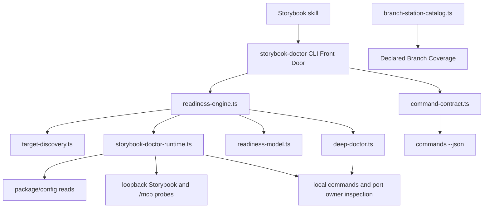
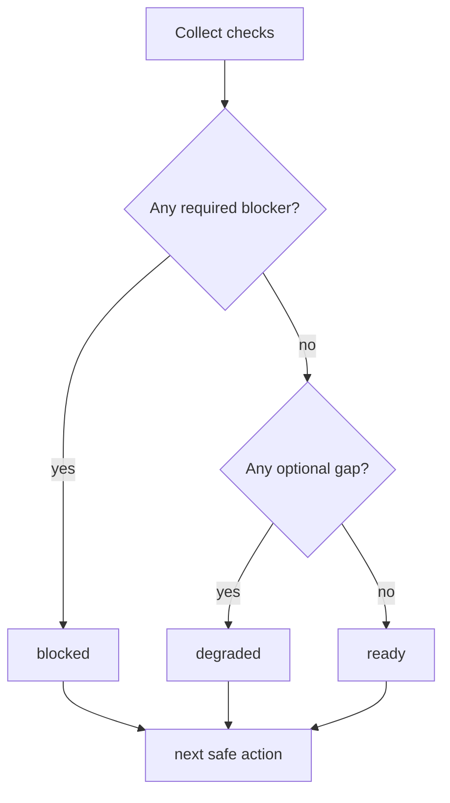

# feat: Add Storybook Doctor CLI

## Summary

Build a read-only `storybook-doctor` CLI that emits Storybook readiness proof, structured repair hints, and declared branch coverage for the Storybook skill. The CLI owns deterministic diagnostics; the skill docs shrink to routing and next safe actions.

---

## Problem Frame

Storybook-dependent agent work currently depends on prose troubleshooting. When Storybook hangs, leaves a stale port owner, misses `/mcp`, lacks `mcporter`, or needs `tmux` as a process owner, agents have to reconstruct the diagnostic path from instructions. That creates slow retries, accidental second servers, and unsafe temptation to kill or restart processes.

The repo already has the right runtime pattern: facade-backed Bun CLIs with command discovery, help alignment tests, and optional Branch Station Catalogs. Storybook needs the same mechanical surface so agents can inspect readiness before using MCP, previews, or focused story tests.

---

## Requirements

**CLI Surface**

- R1. Provide a private workspace package for `skills/storybook` with a repo-local `storybook-doctor` runner.
- R2. Expose `check`, `deep`, and `commands` as facade-backed command ids; support `commands --json` as the probe-free discovery invocation.
- R3. Support `--help`, `help <command>`, and `--version` without reading the target repo.
- R4. Emit primary machine data on stdout and diagnostics on stderr.
- R5. Keep `commands --json` probe-free so agents can discover the surface without touching a project.

**Readiness Proof**

- R6. Emit `ready`, `degraded`, or `blocked` as package-owned Storybook readiness proof status.
- R7. Return completed diagnostic data with exit `0`, including `degraded` and `blocked`; reserve exit `1` for unexpected runtime failure and exit `2` for usage errors.
- R8. Treat no live Storybook session, non-loopback URL, missing package/config, or unusable MCP endpoint as `blocked`.
- R9. Treat missing optional helpers such as `tmux`, `mcporter` when raw MCP works, test tooling, or a11y tooling as `degraded`.
- R10. Include one next safe action and structured findings for every non-ready status.

**Safety**

- R11. The CLI diagnoses and recommends only; it never installs tools, kills processes, starts Storybook, mutates persistent MCP config, or exposes Storybook beyond loopback.
- R12. Report stale port owners by PID and command when available, then require user approval outside the CLI before destructive action.
- R13. Offer `tmux` as a process-owner reliability improvement when absent; never make it a Storybook requirement.
- R14. `deep` may call local `storybook doctor --debug` only through a proven local Storybook binary path.
- R15. `deep` must summarize, redact, and cap debug output before placing it in machine-visible data.

**Proof And Skill Integration**

- R16. Add Command Surface Alignment Proof for discovery metadata, rendered help, parser acceptance, and runtime semantics.
- R17. Add a package-owned Branch Station Catalog before runner behavior grows the matrix.
- R18. Update Storybook skill docs to call the CLI first and keep deterministic contracts in code.
- R19. Keep existing Storybook MCP, taxonomy, story-preview, and story-test workflows intact.

---

## Key Technical Decisions

- KTD1. **Facade-backed CLI, not prose checklist:** `storybook-doctor` uses `@side-quest/cli-command-facade` because agents need discoverable commands, structured output, and drift checks.
- KTD2. **Readiness status is data, not process failure:** `blocked` returns exit `0` when diagnostics completed so agents can parse and choose the next action instead of treating the run as broken.
- KTD3. **`check` stays lightweight:** `check` reads package/config state and probes an existing loopback Storybook session; it does not run Storybook build, start a server, or call Storybook doctor.
- KTD4. **`deep` delegates only to local Storybook doctor:** Storybook owns duplicate-package, addon, and version-health logic. The CLI may call a local Storybook binary for `doctor --debug`, but it must not use an install-capable remote resolution path.
- KTD5. **Runtime capability injection is earned:** production runtime and test fake are real adapters for filesystem, subprocess, fetch, port-owner lookup, and command lookup.
- KTD6. **Branch Station Catalog is package-owned:** Storybook branch meaning lives beside the command contract; the shared facade owns generic Station Map projection only.
- KTD7. **Skill docs become thin callers:** `SKILL.md` should route to `storybook-doctor check --json` and `deep --json`, then link owner docs for details.
- KTD8. **Session URL resolution is explicit and loopback-only:** `check` resolves the Storybook session from `--url`, then `STORYBOOK_URL`, then `http://localhost:6006`; it rejects non-loopback origins before probing.
- KTD9. **Target repo resolution starts from an explicit override:** `check` and `deep` resolve the target from `--repo <path>`, else `cwd`, then walk upward to the nearest `package.json`; a missing manifest is completed `blocked` diagnostics, not a usage error.
- KTD10. **Storybook MCP is a hard readiness requirement:** `@storybook/addon-mcp` must be present in package dependencies and listed in the nearest Storybook main config before a target can be ready.
- KTD11. **Static setup proof precedes runtime success:** live `/mcp` verifies runtime usability, but it does not replace dependency and config evidence for `@storybook/addon-mcp`.
- KTD12. **Config checks are static and side-effect free:** v1 reads literal `.storybook/main.{js,cjs,mjs,ts,mts,cts}` addon arrays and does not import or execute Storybook config.
- KTD13. **Workspace dependency lookup is target-first:** dependency checks inspect the target package first, then a detectable workspace root package, and accept `dependencies`, `devDependencies`, `peerDependencies`, and `optionalDependencies`.
- KTD14. **Readiness probes are ordered for diagnosis:** `check` probes the manager root before `/mcp` so dead server, manager failure, and MCP failure stay distinct.
- KTD15. **`mcporter` remains optional support:** raw `/mcp` tools-list proof owns readiness; missing `mcporter` is degraded only when raw MCP works.
- KTD16. **Status aggregation uses hard required gates:** any required Storybook readiness proof failure yields `blocked`; optional support gaps yield `degraded` only after the required MCP path works; no findings yields `ready`.
- KTD17. **Result vocabulary stays package-owned and class-based:** exact finding and next-action ids live in `readiness-model.ts`; the plan names stable finding classes and branch stations, not a copied schema.
- KTD18. **Storybook script detection is advisory:** missing Storybook dev/test scripts produce degraded setup hints, not blockers, because the CLI diagnoses existing sessions and never starts Storybook.
- KTD19. **Port-owner evidence is observational:** `check` inspects only the resolved loopback URL port, reports listener PID and command when available, and labels it stale only when the listener exists but manager or MCP readiness fails.
- KTD20. **Deep output budget is bounded before JSON emission:** `deep` redacts token-like and env-like values, caps combined doctor output to a fixed byte budget, records truncation facts, and emits summarized lines instead of raw debug exhaust.
- KTD21. **`deep` never clears `check` blockers:** `deep` reuses the `check` result, adds local Storybook doctor evidence, and may worsen readiness, but it cannot upgrade `blocked` to `degraded` or `ready`.

---

## High-Level Technical Design



Status aggregation:



---

## Output Structure

```text
skills/storybook/
  package.json
  tsconfig.json
  src/
    command-contract.ts
    readiness-model.ts
    target-discovery.ts
    storybook-doctor-runtime.ts
    readiness-engine.ts
    deep-doctor.ts
    branch-station-catalog.ts
    branch-station-evidence.ts
    storybook-doctor.ts
    storybook-doctor.test.ts
    branch-station-catalog.test.ts
```

The implementer may collapse tiny modules if implementation proves a flatter shape clearer, but the owner boundaries remain.

---

## Planning-Stage Branch Station Set

The implementation translates this seed set into `skills/storybook/src/branch-station-catalog.ts` before adding evidence rows.

| Station ID | Command | Expected class |
|---|---|---|
| `check.ready` | `check` | ready success |
| `check.no_package_json` | `check` | blocked target failure |
| `check.no_storybook_config` | `check` | blocked setup failure |
| `check.no_storybook_dependency` | `check` | blocked setup failure |
| `check.no_mcp_addon_dependency` | `check` | blocked MCP setup failure |
| `check.no_mcp_addon_config` | `check` | blocked MCP setup failure |
| `check.no_storybook_script` | `check` | degraded setup hint |
| `check.no_live_session` | `check` | blocked live readiness |
| `check.non_loopback_url` | `check` | blocked safety failure |
| `check.manager_ok_mcp_missing` | `check` | blocked MCP failure |
| `check.mcp_tools_ready` | `check` | ready MCP proof |
| `check.mcporter_missing_raw_mcp_ready` | `check` | degraded helper gap |
| `check.test_tools_missing` | `check` | degraded test gap |
| `check.a11y_missing` | `check` | degraded a11y gap |
| `check.tmux_missing_hint` | `check` | degraded process-owner hint |
| `check.invalid_repo` | `check` | usage or target failure |
| `deep.ready_with_local_doctor` | `deep` | ready deep proof |
| `deep.local_storybook_binary_missing` | `deep` | degraded local-tool gap |
| `deep.storybook_doctor_nonzero` | `deep` | degraded or blocked doctor finding |
| `deep.debug_output_truncated` | `deep` | successful output safety |
| `commands.discovery_json` | `commands` | discovery success |
| `help.top_level` | help path | help success |
| `version.stdout` | version path | version success |

---

## Implementation Units

### U1. Add Storybook Workspace Package Scaffold

**Goal:** Make `skills/storybook` a private Bun TypeScript workspace package.

**Requirements:** R1, R3, R16.

**Dependencies:** None.

**Files:**
- `package.json`
- `bun.lock`
- `skills/storybook/package.json`
- `skills/storybook/tsconfig.json`

**Approach:** Follow the private package shape used by `skills/skill-feedback` and `skills/record-decision`. Add `skills/storybook` to root workspaces and refresh the lockfile. Include scripts for `storybook-doctor`, `test`, and `typecheck`. Keep package dependencies limited to `@side-quest/cli-command-facade` plus catalog dev dependencies.

**Patterns to follow:** `skills/skill-feedback/package.json`, `skills/record-decision/tsconfig.json`, `scripts/check-workspace-facade-invariants.ts`.

**Test scenarios:**
- Workspace discovery includes `skills/storybook` after adding the root workspace entry.
- Package typecheck script uses the expected TypeScript project path.
- Package test script runs `bun test src`.

**Verification:** Workspace facade invariant tooling recognizes the package and reports no package-shape drift.

### U2. Define Facade Command Contract And Readiness Model

**Goal:** Declare the public command surface and stable Storybook readiness proof vocabulary.

**Requirements:** R2, R4, R5, R6, R7, R10, R16.

**Dependencies:** U1.

**Files:**
- `skills/storybook/src/command-contract.ts`
- `skills/storybook/src/readiness-model.ts`
- `skills/storybook/src/storybook-doctor.test.ts`

**Approach:** Define `check`, `deep`, and `commands` contracts with read/check side effects only. Keep help/version parser paths outside the command id union. Put status, finding category, next-action ids, and result contract constants in package-owned code. Use facade helpers for discovery projection and result metadata.

**Execution note:** Start with contract validation and discovery tests before implementing runtime probes.

**Patterns to follow:** `skills/record-decision/src/command-contract.ts`, `skills/browser-use/src/command-contract.ts`, `skills/cli-author/references/cli-command-facade.md`.

**Test scenarios:**
- Contract validation accepts all Storybook command contracts.
- Every command declares read/check side effects and no write, browser, destructive, or auth side effects.
- `commands --json` emits projected discovery for `check`, `deep`, and `commands`.
- Discovery output includes result contract metadata from package constants.
- Help flag assertions fail if contract flags and rendered help drift.

**Verification:** Command discovery, contract validation, and help alignment can fail independently when metadata drifts.

### U3. Build Target Discovery And Readiness Engine

**Goal:** Produce a lightweight Storybook readiness proof for an existing target repo and running Storybook session.

**Requirements:** R6, R8, R9, R10, R11, R12, R13, R19.

**Dependencies:** U2.

**Files:**
- `skills/storybook/src/target-discovery.ts`
- `skills/storybook/src/storybook-doctor-runtime.ts`
- `skills/storybook/src/readiness-engine.ts`
- `skills/storybook/src/storybook-doctor.test.ts`

**Approach:** Resolve the target from `--repo` or `cwd`, then inspect the nearest package manifest, workspace root package when detectable, and literal Storybook main config. Probe only loopback URLs and existing sessions. Check manager reachability before `/mcp`; check raw `/mcp` before `mcporter`. Inspect process owner and `tmux` availability without starting, installing, or killing anything.

**Technical design:** Directional check pipeline: target package, Storybook config, dependencies, script, loopback URL, manager health, MCP health, helper availability, optional tooling, process owner.

**Patterns to follow:** `skills/browser-use/src/preflight-warm-chrome.ts`, `skills/storybook/references/tips-and-tricks.md`, `skills/storybook/CONTEXT.md`.

**Test scenarios:**
- Valid package, config, running loopback Storybook, and `/mcp` tools produce `ready`.
- Missing package manifest produces `blocked` with a target-resolution next action.
- Missing Storybook config, Storybook dependency, MCP addon dependency, or MCP addon config listing produces `blocked` before live probes.
- No running Storybook session produces `blocked` without starting a server.
- Non-loopback URL produces `blocked` and performs no network probe.
- Manager healthy with `/mcp` missing produces `blocked`.
- Raw `/mcp` ready but `mcporter` missing produces `degraded`.
- Missing `tmux` produces `degraded` with an install-offer hint, not `blocked`.
- Stale port owner is reported with PID and command when runtime can discover it.
- Missing Storybook dev or test scripts produce degraded setup hints, not blockers.

**Verification:** `check --json` returns parseable readiness proof for all required failure classes without mutating local state.

### U4. Add Deep Doctor Delegation And Output Safety

**Goal:** Extend diagnostics with local Storybook doctor while preserving the no-install boundary.

**Requirements:** R14, R15.

**Dependencies:** U3.

**Files:**
- `skills/storybook/src/deep-doctor.ts`
- `skills/storybook/src/readiness-engine.ts`
- `skills/storybook/src/storybook-doctor.test.ts`

**Approach:** `deep` runs `check` first. If the target has a local Storybook binary, call Storybook doctor in debug mode and fold summarized findings into the readiness proof without clearing existing `check` blockers. If no local binary exists, return `degraded` only when `check` is not already `blocked`; otherwise preserve `blocked` and include the local-tool gap as supporting evidence. Cap output, redact token-like and env-like values, and keep raw command output out of discovery metadata.

**Patterns to follow:** Storybook official CLI options docs for `doctor --debug`, `info`, `dev --smoke-test`, `--exact-port`, `--debug-webpack`, and `--stats-json`; facade runtime text-safety helpers.

**Test scenarios:**
- `deep` reuses all `check` findings before evaluating local Storybook doctor.
- Local Storybook doctor exit `0` preserves readiness status and adds deep evidence.
- Missing local Storybook binary produces `degraded`, not an install attempt.
- Nonzero Storybook doctor exit becomes structured finding data.
- Large debug output is truncated with a visible truncation fact.
- Token-like output is redacted before JSON emission.
- Existing `check` blockers remain blocked after `deep`.

**Verification:** `deep --json` gives richer diagnostics without calling `npx`, installing packages, or exposing raw debug exhaust.

### U5. Add CLI Front Door And Command Surface Proof

**Goal:** Implement `storybook-doctor` runner behavior through the public command surface.

**Requirements:** R2, R3, R4, R5, R7, R16.

**Dependencies:** U2, U3, U4.

**Files:**
- `skills/storybook/src/storybook-doctor.ts`
- `skills/storybook/src/storybook-doctor.test.ts`

**Approach:** Keep the CLI dispatcher thin. Parse top-level help/version, route `commands`, `check`, and `deep`, wrap unexpected failures through facade runtime errors, and write JSON envelopes through facade helpers. Keep help and discovery aligned through the facade testing subpath.

**Patterns to follow:** `skills/record-decision/src/record-decision.ts`, `skills/browser-use/src/preflight-warm-chrome.test.ts`, `skills/browser-use/src/browser-adapter-map.test.ts`.

**Test scenarios:**
- `--help` and `help check` render without target repo reads.
- `--version` writes only version text to stdout.
- Unknown command exits `2` with a usage error envelope in JSON mode.
- `commands --json` performs no runtime probes.
- `check --json` and `deep --json` accept advertised flags and reject unknown flags.
- Completed `blocked` readiness exits `0`; unexpected runtime failure exits `1`; usage failure exits `2`.
- Diagnostics go to stderr and primary data goes to stdout.

**Verification:** Command Surface Alignment Proof covers discovery metadata, rendered help, public argv outcomes, and runtime semantics.

### U6. Add Branch Station Catalog And Evidence Projection

**Goal:** Make Storybook Doctor branch confidence inspectable through Declared Branch Coverage.

**Requirements:** R17.

**Dependencies:** U2, U5.

**Files:**
- `skills/storybook/src/branch-station-catalog.ts`
- `skills/storybook/src/branch-station-evidence.ts`
- `skills/storybook/src/branch-station-catalog.test.ts`
- `skills/storybook/src/storybook-doctor.test.ts`

**Approach:** Translate the planning-stage station set into a package-owned catalog. Keep setup and probe functions in tests, not the catalog. Add evidence rows from command-surface tests and project a Station Map through shared facade helpers.

**Patterns to follow:** `skills/skill-feedback/src/branch-station-catalog.ts`, `runtime/cli-command-facade/src/station-map.ts`, `skills/cli-execution-auditor/SKILL.md`.

**Test scenarios:**
- Catalog validates against live Storybook command discovery.
- Every planning-stage station id is present or explicitly declared unreachable with rationale.
- Station evidence covers `ready`, `degraded`, `blocked`, usage, help, version, and discovery paths.
- Missing evidence for a required station projects as a Station Map finding.
- Station Map claims only Declared Branch Coverage.

**Verification:** `storybook-doctor` has a package-owned station map before the skill docs rely on it.

### U7. Shrink Storybook Skill Docs To CLI Ownership

**Goal:** Route Storybook troubleshooting through the CLI while preserving workflow guidance.

**Requirements:** R18, R19.

**Dependencies:** U5, U6.

**Files:**
- `skills/storybook/SKILL.md`
- `skills/storybook/CONTEXT.md`
- `skills/storybook/references/tips-and-tricks.md`
- `CONTEXT-MAP.md`

**Approach:** Update `SKILL.md` Quick Start and troubleshooting routes so agents run `storybook-doctor check --json` before MCP work and `deep --json` before manual troubleshooting. Keep exact status rules, schema details, command metadata, and Branch Station fields in code. Preserve MCP workflows, taxonomy routing, preview recipes, focused story tests, and accessibility policy.

**Patterns to follow:** `docs/adr/0002-runbooks-and-skills-use-prose-as-orchestrator.md`, `docs/adr/0004-deterministic-workflow-contracts-live-in-code.md`, `docs/adr/0010-skill-examples-teach-judgment-not-contracts.md`.

**Test scenarios:**
- Storybook `SKILL.md` frontmatter parses as YAML.
- Owner-path checker passes after docs edits.
- Docs mention `tmux` as optional reliability support, not a requirement.
- Docs do not duplicate CLI schema fields or Branch Station contracts.
- Existing MCP workflow references remain present.

**Verification:** A fresh agent can find the CLI owner path and next safe action without reading a copied contract in prose.

---

## Scope Boundaries

- No automatic `tmux` install.
- No Storybook startup or restart command.
- No process killing.
- No persistent MCP config writes.
- No remote or non-loopback Storybook probing.
- No generated test source from Station Maps.
- No full `build-storybook` or `test-storybook` orchestration in v1.

### Deferred to Follow-Up Work

- Add an explicit fail-on-not-ready flag if CI needs nonzero exit for `blocked`.
- Add optional package-manager exec support after proving it cannot install.
- Add generated integration rows from Branch Station Catalogs after the hand-written station evidence stabilizes.
- Add broader Storybook build/test orchestration as a separate CLI command if real usage demands it.

---

## Risks & Dependencies

- **Facade ceremony can outrun value:** Keep the first package private and focused on `check`, `deep`, and discovery only.
- **Storybook debug output can leak local noise:** Cap, summarize, and redact `deep` output before JSON emission.
- **Status semantics can confuse CI:** Treat readiness as data in v1 and defer fail-on-not-ready until a consumer asks for it.
- **Local package manager behavior can install unexpectedly:** Use local Storybook binary resolution only in v1.
- **Skill docs can drift back into copied contracts:** Keep exact command/schema/branch contracts in TypeScript tests and route prose to owner paths.

---

## Sources & Research

- `skills/storybook/CONTEXT.md` defines Storybook Doctor, Storybook readiness proof, process owner, and MCP endpoint vocabulary.
- `skills/storybook/SKILL.md` and `skills/storybook/references/tips-and-tricks.md` define current Storybook MCP and hanging-process troubleshooting behavior.
- `skills/cli-author/references/agent-native-cli-design.md` and `skills/cli-author/references/cli-command-facade.md` define agent-native and facade-backed CLI expectations.
- `runtime/cli-command-facade/src/index.ts` and `runtime/cli-command-facade/src/station-map.ts` export command facade and Station Map helpers.
- `skills/record-decision/src/record-decision.ts` and `skills/record-decision/src/record-decision.test.ts` show a compact facade-backed CLI and discovery proof.
- `skills/browser-use/src/preflight-warm-chrome.ts` and `skills/browser-use/src/preflight-warm-chrome.test.ts` show readiness proof and command-surface alignment patterns.
- `skills/skill-feedback/src/branch-station-catalog.ts` shows package-owned Branch Station Catalog shape.
- Official Storybook CLI docs at `https://storybook.js.org/docs/api/cli-options` document `doctor --debug`, `info`, `dev --smoke-test`, `--exact-port`, `--debug-webpack`, and `--stats-json`.
