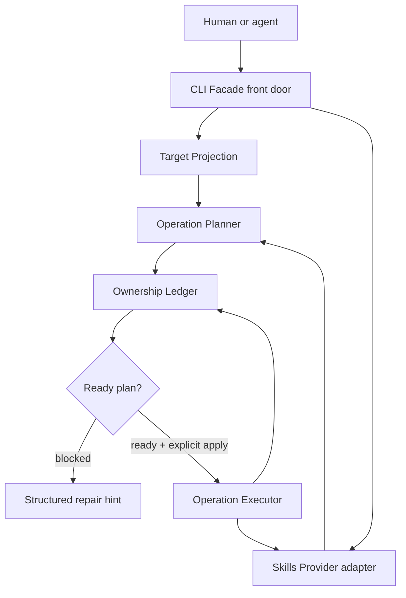
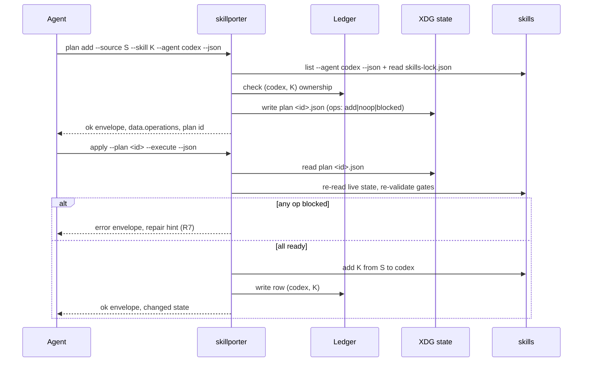

# feat: Skillporter MVP — agent-native safety shell around the skills provider

## Summary

Build `@side-quest/skill-porter` at `runtime/skill-porter/`: a facade-backed CLI (`skillporter`) that wraps the existing `skills` provider with plan-before-mutation semantics, an ownership ledger, and target projection so an autonomous agent can list, plan, add, and remove skills without overwriting same-name skills from another source or removing skills it does not own. Ships in three layers — facade spine (`doctor`), adapter read (`source list`), then the full safety loop (`plan`/`apply`/`status`) — across nine dependency-ordered units.

---

## Problem Frame

The `skills` package already solves source discovery, install/remove mechanics, lock files, and multi-agent target support. Rebuilding that wastes effort. The gap is agent safety: raw provider operations prompt, mutate broadly, overwrite a same-name skill from a different source, and remove skills with no ownership context. The prototype confirmed raw `skills add` overwrites a same-name skill from a different source (see origin: `docs/research/2026-06-17-skillport-mvp-architecture.md`). Skillporter is the safety shell around those mechanics — useful to agents without copying every provider target rule or relying on `AGENTS.md` prose as the only safety layer.

---

## Key Technical Decisions

All four MVP-defining decisions are already settled in ADRs; this plan implements them rather than re-litigating them.

- Naming and location: package `@side-quest/skill-porter` at `runtime/skill-porter/`, bin `skillporter` (single word, no alias), workspace-linked to `@side-quest/cli-command-facade`. The `runtime/*` workspace glob in root `package.json` auto-includes it. (see origin: `docs/adr/0015-skillporter-naming-and-location.md`)
- Ownership ledger is a separate Skillporter-owned file keyed by `(target, skillName)`, with `source`, `providerId`, `computedHash`, `managedAt` as fields; presence of a record *is* the "Skillport manages this" fact. Durable user data under `$XDG_DATA_HOME` (`~/.local/share/skillporter/ledger.json`, dir `0700`/file `0600`). `skills-lock.json` is read-only provider input, reconciled on read, never written. (see origin: `docs/adr/0016-ownership-ledger-grain-and-lock-boundary.md`)
- Plan and apply are separate steps. The plan is a disposable artifact under `$XDG_STATE_HOME` (`~/.local/state/skillporter/plans/<id>.json`, dir `0700`/file `0600`); `apply` re-validates the ownership and lock-reconciliation gates against live state, so a stale plan fails closed. (see origin: `docs/adr/0017-plan-apply-lifecycle-and-plan-storage.md`)
- Result vocabulary has two layers that must not collapse: the facade-owned envelope (`status` ok/error, recoverability, hint, continuation) is named and reused not redefined; the Skillporter-owned operation enum `add | remove | noop | blocked` lives in `data`. `plan` with blocked items returns `ok`; `apply` on a blocked plan returns `error`. (see origin: `docs/adr/0018-result-vocabulary-two-layers.md`)
- Pre-add read is a hybrid: provider `list --agent <id> --json` for occupancy/per-target view (it omits `source`), plus a tolerant `skills-lock.json` read for `source` attribution. Both behind the Skills Provider adapter. The lock read normalizes both the observed object shape (v1.5.11) and the upstream array shape. (see origin: `docs/adr/0016-ownership-ledger-grain-and-lock-boundary.md`)
- Provider adapter `add`/`remove` are singular `(skill, source, target)`; the executor loops over targets and writes one ledger row per successful op. The provider's own `--agent` repetition stays an internal optimization, not the contract shape.
- Target exposure: no `--agent` defaults to `codex` + `claude-code`; `--agent <id>` allows any provider-validated id through Target Projection. Default set and validation live in code validated against the provider's live list, not a hard-forked prose catalog.
- Test strategy follows the hardened facade contract: a named test owner, a fixture/fake provider behind the Skills Provider seam for all unit tests (deterministic, no network), facade `/testing`-subpath helpers, and a Command Surface Alignment Proof covering the four drift surfaces. Live `skills` contact is isolated to `doctor` and one opt-in integration test. (see origin: `skills/create-cli/references/cli-command-facade.md`)
- Ship order: `doctor` → `source list` → `plan add` — facade spine first (no mutation), then adapter read, then the full safety loop. (see origin: `docs/research/2026-06-17-skillport-mvp-architecture.md`)

---

## Requirements

Traced from `docs/brainstorms/2026-06-17-skillport-mvp-requirements.md`. R-IDs below map directly to origin R-IDs.

**Provider and source discovery**

- R1. List source skills through the provider without mutating local state.
- R2. Expose provider-supported target ids instead of a parallel hard-coded catalog.
- R3. Support the provider's `--agent` semantics (repeated ids, all-target intent) with Skillporter safety gates before mutation.
- R4. Keep provider-specific behavior behind a Skills Provider interface so another provider can replace `skills` later.

**Planning and execution**

- R5. Generate an add/remove plan before any mutation.
- R6. A plan distinguishes `add`, `remove`, `noop`, and `blocked` operations.
- R7. A blocked plan never executes.
- R8. Execution requires an explicit execute step; plan generation is not permission to mutate.
- R9. Execution updates both installed state and Skillporter ownership facts when the provider reports success.

**Ownership safety**

- R10. Refuse to add a skill when the same target already has that skill name from another source (no takeover flow in V1).
- R11. Refuse to remove any skill without a matching Skillporter ownership record.
- R12. Preserve human-managed, provider-managed, or unrelated local skills by default.
- R13. Make source, target, skill name, provider identity, and management ownership visible in status output.

**Target projection**

- R14. Support `codex` and `claude-code` as hardened MVP targets.
- R15. Allow other provider-supported target ids through the same Target Projection module.
- R16. Make all-target operations preview-first and visibly higher risk than explicit target lists.
- R17. Avoid copying provider-owned target path rules unless a Skillporter policy differs.

**Agent-native CLI**

- R18. Provide machine-readable output for discovery, status, plan, apply, source list, target list, and doctor flows.
- R19. Send primary data to stdout and diagnostics to stderr.
- R20. Provide structured failures with recoverability, same-input retry safety, repair hints, and a continuation where available.
- R21. Expose enough discovery metadata for an agent to choose commands without scraping human help.
- R22. Support non-interactive execution with no prompts when explicit flags provide all required input.

**Bootstrap**

- R23. `AGENTS.md` routes agents to Skillporter for skill list/install/remove/sync work when the Skillport skill is unavailable.
- R24. When a Skillport skill is installed (V2), `AGENTS.md` prefers the skill for workflow guidance while the skill calls the CLI for mutation.
- R25. V1 does not depend on the Skillport skill being installed.

---

## High-Level Technical Design

Five seams compose one safety loop. The facade front door is the only public surface; everything else is internal modules behind it.



Functional core / imperative shell split: Target Projection, Planner, Ledger policy, and result mapping are pure and table-testable; the Provider adapter and Executor are the imperative shell that touches the provider, the lock, and the filesystem.

Plan/apply lifecycle across two non-interactive agent calls:



---

## Output Structure

Greenfield package layout. Per-unit `**Files:**` sections remain authoritative; this tree shows the expected overall shape.

```text
runtime/skill-porter/
  package.json
  tsconfig.json
  AGENTS.md
  CONTEXT.md
  src/
    index.ts                 # bin entry / thin dispatcher
    command-contract.ts      # facade command contract + Branch Station catalog
    operations.ts            # add|remove|noop|blocked union + result mapping
    provider/
      skills-provider.ts     # Skills Provider interface
      skills-adapter.ts      # real `skills` adapter (list/add/remove + lock read)
      fixture-provider.ts    # deterministic fake provider for tests
    ledger.ts                # ownership ledger model, read/write, reconcile
    target-projection.ts     # target validation + default set + risk classification
    planner.ts               # pure add/remove planner
    executor.ts              # ready-plan executor, loops targets, writes ledger
    plan-store.ts            # XDG-state plan artifact read/write
    commands/
      doctor.ts
      source-list.ts
      targets-list.ts
      status.ts
      plan.ts
      apply.ts
  tests/
    *.test.ts                # scenario tests using facade /testing helpers
```

---

## Implementation Units

### U1. Package skeleton and facade command contract

- **Goal:** Stand up `runtime/skill-porter/` as a workspace package with a facade-backed command contract and a thin dispatcher, plus the `doctor` command as the first runnable surface.
- **Requirements:** R18, R19, R21, R22.
- **Dependencies:** none.
- **Files:** `runtime/skill-porter/package.json`, `runtime/skill-porter/tsconfig.json`, `runtime/skill-porter/src/index.ts`, `runtime/skill-porter/src/command-contract.ts`, `runtime/skill-porter/src/commands/doctor.ts`, `runtime/skill-porter/tests/command-contract.test.ts`, `runtime/skill-porter/tests/doctor.test.ts`.
- **Approach:** Mirror `runtime/cli-command-facade/package.json` for `type: module`, catalog devDeps, `workspace:*` facade dependency, and the `test`/`typecheck` scripts. Declare the command contract with `defineCommandFacadeContract`; validate at construction. Declare Baseline Exit Semantics (`0` success, `1` runtime failure, `2` invalid usage); any extra exit code must earn its place. `doctor` declares the Diagnostic Capability role via `capabilityRoles` (the facade validates the role, not the command name) and reports environment readiness (provider reachable, XDG dirs writable) using `createCliRuntimeSuccessEnvelope` / `createCliRuntimeErrorEnvelope`. Keep the dispatcher thin — command bodies live in `commands/`. Name owners before code: contract owner (`command-contract.ts`), CLI owner (`index.ts`), test owner (`tests/`).
- **Patterns to follow:** `runtime/cli-command-facade/src/index.ts` public surface; `skills/create-cli/references/cli-command-facade.md` workflow and owner paths; `scripts/command-entrypoint.integration.test.ts` for entrypoint proof shape.
- **Execution note:** Start with a failing `doctor --json` envelope-shape test, then build the contract to satisfy it.
- **Test scenarios:**
  - `doctor --json` emits a well-formed success envelope when provider and XDG dirs are reachable (assert envelope shape via facade `/testing` helpers, not literal JSON).
  - `doctor --json` emits a structured error envelope with recoverability + repair hint when a precondition fails.
  - Command contract validates at construction; an invalid contract throws before the CLI can ship.
  - `--help` rendered output lists `doctor`'s advertised flags and excludes command-foreign flags.
  - Primary data goes to stdout; diagnostics go to stderr (R19).
- **Verification:** `bun run <path-to-index> doctor --json` invoked directly (not via `bun --filter`) returns a valid envelope; `tsc` and the package test suite pass.

### U2. Skills Provider interface and fixture provider

- **Goal:** Define the Skills Provider seam and a deterministic fixture provider so every downstream unit tests against a fake, not the live `skills` package.
- **Requirements:** R4.
- **Dependencies:** U1.
- **Files:** `runtime/skill-porter/src/provider/skills-provider.ts`, `runtime/skill-porter/src/provider/fixture-provider.ts`, `runtime/skill-porter/tests/fixture-provider.test.ts`.
- **Approach:** The interface exposes `listSkills(agentId)`, `listSupportedTargets()`, `readLock()`, `add(skill, source, target)`, `remove(skill, source, target)` — all singular per the KTD. The fixture provider is constructed from an in-memory state object (installed skills per target, lock entries with `source`) so tests script exact occupancy. Normalize provider results behind this seam so no provider shape leaks into the planner, ledger, or commands.
- **Patterns to follow:** Ports-and-adapters / anti-corruption layer framing from `docs/research/2026-06-17-skillport-mvp-architecture.md`; the prototype's fixture-driven 13/13 scenario approach.
- **Execution note:** Build the fixture first; it is the test substrate for U3–U8.
- **Test scenarios:**
  - Fixture `listSkills` returns scripted occupancy for a given target.
  - Fixture `readLock` returns scripted `(name → source)` entries.
  - Fixture `add` / `remove` mutate fixture state and are observable by a follow-up `listSkills`.
  - Interface is implemented by the fixture without leaking provider-native field names to callers.
- **Verification:** Fixture state transitions are observable through the interface; no test in the suite reaches the network.

### U3. Skills adapter for the real provider

- **Goal:** Implement the real `skills`-backed adapter (read + mutate + tolerant lock read) behind the Skills Provider interface.
- **Requirements:** R1, R2, R3, R4.
- **Dependencies:** U2.
- **Files:** `runtime/skill-porter/src/provider/skills-adapter.ts`, `runtime/skill-porter/tests/skills-adapter.test.ts`.
- **Approach:** `listSkills` shells `skills list --agent <id> --json`; `listSupportedTargets` derives from the provider's reported target list; `readLock` reads and normalizes `skills-lock.json` tolerating both the observed object shape (`{version, skills: {name: {source, sourceType, skillPath, computedHash}}}`) and the upstream array shape, returning best-effort `source`. `add`/`remove` invoke the provider non-interactively with explicit `--agent --skill --yes`. Parse failures map to structured provider errors, not crashes.
- **Patterns to follow:** `docs/research/2026-06-17-skillport-mvp-architecture.md` source-research findings; lock normalization rules in `docs/adr/0016-ownership-ledger-grain-and-lock-boundary.md`.
- **Test scenarios:**
  - `readLock` normalizes the object-keyed v1.5.11 shape to the internal record list.
  - `readLock` normalizes the upstream array shape to the same internal record list.
  - `readLock` on a missing/garbled lock returns an empty best-effort result without throwing.
  - `listSkills` maps provider JSON to the normalized occupancy shape.
  - A provider non-zero exit maps to a structured provider error carrying recoverability.
- **Verification:** Adapter output matches the interface contract the fixture satisfies; the one opt-in live-`skills` integration test (gated behind an env flag) exercises a real `list`.

### U4. Ownership ledger model and reconciliation

- **Goal:** Implement the ledger as the authority for Skillporter-managed ownership, keyed by `(target, skillName)`, reconciled against the provider lock on read, never writing the lock.
- **Requirements:** R9, R11, R12, R13.
- **Dependencies:** U2.
- **Files:** `runtime/skill-porter/src/ledger.ts`, `runtime/skill-porter/tests/ledger.test.ts`.
- **Approach:** Closed record type + read/parse validator (code-owned, not a prose table). Storage nested `target → skillName → record` under `$XDG_DATA_HOME` with `0700`/`0600` perms. `reconcile(lock)` cross-references lock `source`/`computedHash` on read. Presence of a record is ownership; there is no managed-by flag. `upsert` and `remove` operate one row at a time (the executor drives the loop).
- **Patterns to follow:** `docs/adr/0016-ownership-ledger-grain-and-lock-boundary.md` grain, storage, and schema-ownership rules; context-advisor storage routing for `$XDG_DATA_HOME`.
- **Test scenarios:**
  - A record present for `(codex, storybook)` reports Skillport ownership; a `(codex, local-only)` with no record reports not-owned.
  - `source` as a field (not key): a `(target, skillName)` collision with a differing `source` is detectable for the foreign-block gate.
  - `reconcile` surfaces lock `source` for a slot the ledger owns.
  - Ledger file is created with `0700` dir / `0600` file perms.
  - Validator rejects a malformed ledger file with a structured read error.
  - `upsert` then `remove` for one row leaves the ledger empty.
- **Verification:** Ownership queries return correct verdicts for owned, not-owned, and foreign-source slots; perms assert on the written file.

### U5. Target projection and supported-target discovery

- **Goal:** Validate and explain target ids, default to `codex` + `claude-code`, allow any provider-validated id, and classify all-target intent as higher risk.
- **Requirements:** R2, R14, R15, R16, R17.
- **Dependencies:** U2.
- **Files:** `runtime/skill-porter/src/target-projection.ts`, `runtime/skill-porter/src/commands/targets-list.ts`, `runtime/skill-porter/tests/target-projection.test.ts`, `runtime/skill-porter/tests/targets-list.test.ts`.
- **Approach:** Pure module. Default set (`codex`, `claude-code`) when `--agent` absent. Validate requested ids against the provider's live supported list (via the adapter), not a forked prose catalog. All-target intent (`*`) resolves to the full provider set and carries a `high-risk` classification consumed by the planner for preview-first handling. Invalid ids produce a structured error listing supported ids with a repair hint. `targets list --json` exposes the supported vocabulary.
- **Patterns to follow:** `docs/research/2026-06-17-skillport-mvp-architecture.md` Target Projection pressure; R17 provider-owned-path-rule boundary.
- **Test scenarios:**
  - No `--agent` resolves to exactly `codex` + `claude-code`.
  - `--agent codex --agent claude-code` resolves to both; repeats dedupe.
  - A provider-supported non-default id (e.g. `cursor`) passes validation.
  - An unsupported id returns a structured error listing supported ids + repair hint (Covers AE5).
  - `*` resolves to the full provider set and is flagged high-risk.
  - `targets list --json` emits the supported vocabulary from the provider, not a hard-coded list.
- **Verification:** Validation verdicts and risk classification are correct across default, explicit, foreign-valid, invalid, and all-target inputs.

### U6. Operation planner

- **Goal:** Produce an ownership-aware add/remove plan distinguishing `add`, `remove`, `noop`, and `blocked` — the pure decision core, no mutation.
- **Requirements:** R5, R6, R7, R10, R11, R12.
- **Dependencies:** U4, U5.
- **Files:** `runtime/skill-porter/src/planner.ts`, `runtime/skill-porter/src/operations.ts`, `runtime/skill-porter/tests/planner.test.ts`.
- **Approach:** Pure function over (requested skills, resolved targets, provider occupancy, lock reconciliation, ledger). The operation union `add | remove | noop | blocked` lives in `operations.ts`. Add gates: skill present in source → if target empty `add`; if occupied by same source already owned `noop`; if occupied by a *different* source `blocked` (foreign same-name, R10). Remove gates: ledger owns `(target, skill)` → `remove`; no ownership record → `blocked` (R11). Each `blocked` op carries a reason string the command layer maps to a facade repair hint.
- **Patterns to follow:** Functional-core framing; Command (GoF) labeling of plan operations from `docs/research/2026-06-17-skillport-mvp-architecture.md`.
- **Execution note:** Implement test-first; this is the highest-value pure unit and the prototype's 13/13 surface.
- **Test scenarios:**
  - Add `create-cli` to empty `codex` + `claude-code` → two `add` ops (Covers AE1).
  - Add a skill already owned from the same source → `noop`.
  - Add `storybook` from `nathanvale/claude-code-config` to `cursor` already holding `storybook` from `other/source` → `blocked` with foreign-source reason (Covers AE2).
  - Remove `local-only` from `codex` with no ledger record → `blocked` with not-owned reason (Covers AE3).
  - Remove `storybook` from `codex` with a matching ledger record → `remove` (Covers AE4).
  - A plan containing any `blocked` op is still a fully-formed plan (planning succeeded; R7 enforcement is at apply, U8).
  - Add a skill absent from the source → `blocked` with not-in-source reason.
- **Verification:** Planner verdicts match every acceptance example and the prototype scenario set across add, noop, blocked-foreign, blocked-not-owned, and remove paths.

### U7. Plan store (XDG-state artifact)

- **Goal:** Persist a generated plan as a disposable `$XDG_STATE_HOME` artifact and read it back for a later `apply`.
- **Requirements:** R8.
- **Dependencies:** U6.
- **Files:** `runtime/skill-porter/src/plan-store.ts`, `runtime/skill-porter/tests/plan-store.test.ts`.
- **Approach:** Write `<id>.json` under `~/.local/state/skillporter/plans/` with `0700`/`0600` perms. The plan id and on-disk format are code-owned. The artifact is a *proposal*, not a permission: `apply` (U8) re-validates gates. No retention logic in V1 — disposable, refreshed by re-running `plan`.
- **Patterns to follow:** `docs/adr/0017-plan-apply-lifecycle-and-plan-storage.md`; `$XDG_STATE_HOME` routing.
- **Test scenarios:**
  - Writing a plan returns a stable id; reading by id round-trips the operations.
  - Plan dir/file created with `0700`/`0600` perms.
  - Reading an unknown plan id returns a structured not-found error, not a throw.
  - A malformed plan file fails closed with a structured read error.
- **Verification:** Round-trip read returns the exact operation set written; perms assert on disk.

### U8. Plan and apply commands (full safety loop)

- **Goal:** Wire `plan add` / `plan remove` (preview, persist, `ok` even when blocked) and `apply --execute` (re-validate gates, mutate via executor, update ledger, fail closed on blocked).
- **Requirements:** R5, R6, R7, R8, R9, R16, R20, R22.
- **Dependencies:** U3, U6, U7.
- **Files:** `runtime/skill-porter/src/executor.ts`, `runtime/skill-porter/src/commands/plan.ts`, `runtime/skill-porter/src/commands/apply.ts`, `runtime/skill-porter/tests/plan-command.test.ts`, `runtime/skill-porter/tests/apply-command.test.ts`, `runtime/skill-porter/tests/executor.test.ts`.
- **Approach:** `plan add`/`plan remove` resolve targets (U5), read occupancy + lock + ledger, run the planner (U6), persist (U7), and emit an `ok` envelope whose `data` carries the operation union and the plan id — even when items are `blocked` (a preview is informational, ADR-0018). `apply` reads the plan, re-runs the gates against live state, and on any `blocked` op returns a facade structured error (recoverability + repair hint, non-zero exit) enforcing R7. On all-ready, the executor loops targets, calls the provider adapter per target, and writes one ledger row per success (R9). All-target plans are preview-first and labelled high-risk (R16). No prompts when flags are complete (R22). `apply --execute` is a `write` side-effect command, so its facade contract must declare a Write Preview Capability — the `plan` step is the preview, so model `apply` with a `check`/`dry_run` execution mode or a `previewExemption` reason; the facade rejects an undeclared mutating contract at construction.
- **Patterns to follow:** Plan/apply lifecycle and two-layer result vocabulary from `docs/adr/0017-*` and `docs/adr/0018-*`; facade structured-error helpers; `bun run <runner>` (never `bun --filter`) for output assertions.
- **Execution note:** Start with a failing `apply`-on-blocked-plan test asserting the error envelope, since R7 is the load-bearing safety invariant.
- **Test scenarios:**
  - `plan add` with a blocked item returns `status: ok`, exit 0, and `blocked` in `data.operations` (Covers AE2).
  - `apply` on a plan containing a blocked op returns `status: error`, non-zero exit, recoverability + repair hint (Covers AE5 / R7).
  - `apply` on an all-ready add plan installs via the (fixture) provider and writes one ledger row per target (Covers AE1 / R9).
  - `apply` on an all-ready remove plan removes via the provider and deletes the ledger row (Covers AE4).
  - A plan valid at preview but now foreign-occupied fails closed at `apply` (gate re-validation).
  - All-target plan is preview-only and flagged high-risk; it does not mutate without explicit `apply --execute` (R16).
  - Executor writes exactly one ledger row per successful provider op, none for failures.
  - `apply --execute` with complete flags runs without prompting (R22).
- **Verification:** The full loop — plan, persist, apply, mutate, ledger-sync — holds across ready, blocked-at-plan, and blocked-at-apply paths; ledger and installed state stay aligned.

### U9. Status command, Command Surface Alignment Proof, and AGENTS.md bootstrap

- **Goal:** Ship `status`, prove the four drift surfaces cannot drift, and route agents to `skillporter` from `AGENTS.md`.
- **Requirements:** R13, R18, R21, R23, R25.
- **Dependencies:** U4, U8.
- **Files:** `runtime/skill-porter/src/commands/status.ts`, `runtime/skill-porter/tests/status.test.ts`, `runtime/skill-porter/src/command-contract.ts` (Branch Station catalog), `runtime/skill-porter/tests/command-surface-proof.test.ts`, `runtime/skill-porter/AGENTS.md`, `runtime/skill-porter/CONTEXT.md`, `AGENTS.md` (root bootstrap route).
- **Approach:** `status --target <id> --json` reports source, target, skill name, provider identity, and Skillport management ownership per the reconciled ledger (R13). Declare a package-owned Branch Station catalog beside `command-contract.ts`; the Command Surface Alignment Proof asserts discovery metadata, rendered help, public argv acceptance/rejection, and runtime semantics, and that the Station Map only claims Declared Branch Coverage (reports missing/drifted/skipped mechanically) via `projectStationMap` + `BRANCH_STATION_*`. Assert the operation union from package-owned constants. Runtime-contract adoption requires a redaction fixture: prove sensitive values (local paths, the `skills-lock.json` path, XDG ledger/plan paths, tokens) do not leak through structured errors, hints, or runtime actions — extend the baseline redaction fixtures from the Facade Testing Subpath rather than copying them. Add a root `AGENTS.md` route telling agents to use `skillporter` for skill list/install/remove/sync when the Skillport skill is unavailable (R23); V1 carries no skill dependency (R25).
- **Patterns to follow:** `skills/create-cli/references/cli-command-facade.md` Proof Expectations; `skills/cli-execution-auditor/src/station-map.ts` cross-package Station Map report; existing `AGENTS.md` route-catalog bullet format (`` `route-id`: prose. `` — do not break the contract-drift extractor format).
- **Test scenarios:**
  - `status --target codex --json` surfaces source, target, skill name, provider id, and ownership for an owned skill; marks a human-placed skill not-owned (R13).
  - Discovery metadata exposes every command an agent needs without scraping help (R21).
  - Command Surface Alignment Proof: advertised flags appear in help; command-foreign flags are excluded; public argv acceptance and rejection hold; runtime semantics match the contract.
  - Station Map claims only Declared Branch Coverage and flags a deliberately-omitted station as missing.
  - Result vocabulary asserts `add|remove|noop|blocked` from package-owned constants, not string literals.
  - Redaction fixture: a structured error/hint carrying a local path, the lock path, or an XDG path emits redacted output, proving sensitive values do not leak to the agent.
- **Verification:** The four drift surfaces are mechanically proven; `status` output carries all five ownership facts; the `AGENTS.md` route renders without breaking the route-catalog extractor.

---

## Acceptance Examples

Carried from origin; each is enforced by the linked unit's test scenarios.

- AE1. Safe add across MVP targets — plan + apply add for empty `codex` + `claude-code` records Skillport ownership for both. (U6, U8)
- AE2. Foreign same-name skill blocks — adding `storybook` to a `cursor` already holding it from another source returns blocked, no provider mutation. (U6, U8)
- AE3. Human-owned skill removal blocks — removing `local-only` with no ownership record blocks with a not-owned explanation. (U6)
- AE4. Managed skill removal succeeds — removing an owned `storybook` removes it and drops the ledger record. (U6, U8)
- AE5. Invalid target repairs — an unsupported target id returns a structured error with supported ids + repair hint. (U5, U8)

---

## Scope Boundaries

### Deferred for later

- Skillport skill wrapper that teaches the workflow in detail (V2 — R24, R26).
- Decks, curated packs, subagents, MCPs, and broader capability bundles.
- Takeover / migration flow for adopting skills not currently owned by Skillport.
- Undo, rollback, or historical event replay.
- A second real provider beyond the `skills` package.

### Outside MVP identity

- Reimplementing the full skills ecosystem.
- Forking every provider-owned target path rule.
- Treating `AGENTS.md` prose as the enforcement layer for safe mutation.
- Raw destructive `skills update`, `experimental_install`, `experimental_sync`, or all-skill removal as a default agent path.

### Deferred to Follow-Up Work

- Plan-artifact retention / GC policy (V1 is disposable, refreshed by re-running `plan`).
- Published-package portability export beyond the workspace link (V1 relies on the `runtime/*` Bun workspace).
- `npm publish` cadence and the unscoped squat-block park deprecation (tracked in ADR-0015).

---

## Risks & Dependencies

| Risk | Consequence | Mitigation |
| --- | --- | --- |
| Provider behavior or lock shape changes | Safety assumptions drift | Adapter normalizes both known lock shapes; keep the opt-in live integration test current; one-file blast radius behind the seam |
| Broad all-target operations | Agent mutates too much | All-target intent is preview-first, high-risk, plan-only until explicit `apply --execute` (R16) |
| Ownership mismatch | Unrelated skill removed | Block without a matching ledger record (R11); `apply` re-validates gates against live state |
| Human output scraping | Agent makes brittle decisions | JSON/facade output required for the agent path (R18, R21) |
| Over-copying provider target rules | Skillporter becomes a stale provider fork | Target Projection validates ids against the live provider list, leaves path rules provider-owned (R17) |
| Facade text-safety rejects a repair hint | Envelope construction throws at runtime | Keep hints prose-only with a structured `action` + `docs_url`; never inline commands or local paths |

**Dependencies / assumptions:**

- `skills` remains the first provider with source listing, add, remove, list, lock behavior, and `--agent` selection.
- Provider-supported agent ids include `codex`, `claude-code`, and a broad set of others.
- `@side-quest/cli-command-facade` is available via the workspace link.
- The CLI binary is `skillporter`; the package is `@side-quest/skill-porter` (placeholder `0.0.0`).

---

## Sources / Research

- Requirements: `docs/brainstorms/2026-06-17-skillport-mvp-requirements.md`
- Architecture support (Resolved Planning Decisions, source research, prototype evidence): `docs/research/2026-06-17-skillport-mvp-architecture.md`
- Source + prototype evidence: `docs/research/2026-06-17-skillport-source-and-prototype-evidence.md`
- ICA seam report: `docs/research/2026-06-17-skillport-seam-report.html`
- ADRs: `docs/adr/0015-skillporter-naming-and-location.md`, `docs/adr/0016-ownership-ledger-grain-and-lock-boundary.md`, `docs/adr/0017-plan-apply-lifecycle-and-plan-storage.md`, `docs/adr/0018-result-vocabulary-two-layers.md`
- Facade owner paths + hardened proof contract: `skills/create-cli/references/cli-command-facade.md`, `runtime/cli-command-facade/src/index.ts`, `runtime/cli-command-facade/AGENTS.md`
- Facade domain glossary (Diagnostic Capability role, Command Surface Alignment Proof, Write Preview Capability, mandatory redaction fixtures, Baseline Exit Semantics): `runtime/cli-command-facade/CONTEXT.md`
- Facade public surface verified in repo: `runtime/cli-command-facade/src/command-contract.ts`, `runtime/cli-command-facade/src/station-map.ts`
- Cross-package Station Map report pattern: `skills/cli-execution-auditor/src/station-map.ts`
- Entrypoint proof pattern: `scripts/command-entrypoint.integration.test.ts`
