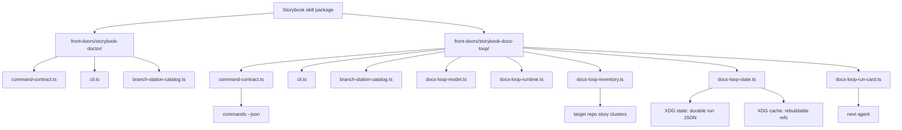
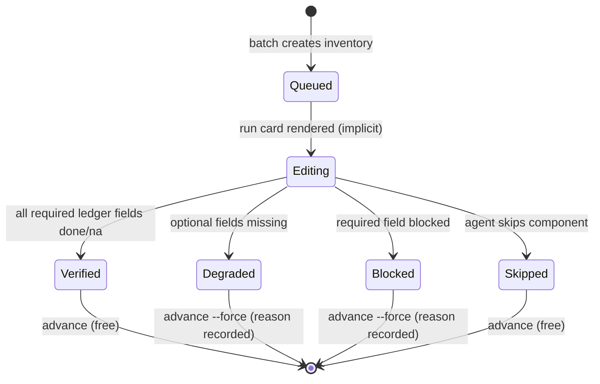
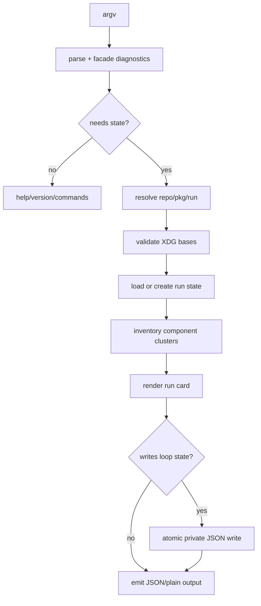

# feat: Add Storybook Docs Loop CLI

## Summary

Add a `storybook-docs-loop` CLI Front Door to the existing Storybook skill package. It gives agents a durable, resumable way to run single-component and batch Storybook docs cleanup while keeping deterministic command contracts in code, discovery metadata, help, and tests.

---

## Problem Frame

The Storybook docs rollout workflow is now rich enough that long sessions need durable state, not another prose checklist. Agents need to scout component clusters, work in small batches, resume cleanly, see the next safe action, and produce receipts for docs order, optional story inclusion, preview, story tests, screenshots, registry checks, Fallow, and the docs workflow checklist.

The package already has the right CLI pattern in `skills/storybook/src/storybook-doctor.ts`: facade-backed command discovery, package-owned result vocabulary, branch station catalogs, process-boundary integration tests, and shared fixture helpers. The docs loop should extend that local pattern instead of creating a new package or parallel agent-only workflow.

---

## Requirements

**CLI Surface**

- R1. Expose `single`, `batch`, `resume`, `status`, `advance`, `mark`, `doctor`, `purge`, and `commands` under the existing Storybook skill package.
- R2. Support `--repo`, `--pkg`, `--component`, `--story`, `--run`, `--batch-size`, `--older-than`, `--field`, `--status`, `--reason`, `--json`, `--plain`, `--no-input`, and `--force` according to command need. When `--run` is omitted on `resume`/`status`/`advance`/`mark`/`doctor`/`purge` and only one active run exists for the resolved repo, infer it; error with choices when multiple exist.
- R3. Support `--help`, `help <command>`, `--version`, and `commands --json` without target repo mutation.
- R4. Emit primary machine data on stdout and diagnostics on stderr.
- R5. Keep `commands --json` probe-free so agents can discover the surface without reading or writing loop state.

**Docs Loop Behavior**

- R6. `single` is read-only scouting: it returns one component run card from a component name or story path without writing any durable state. Working a component uses `batch`.
- R7. `batch` creates or refreshes a run state with inventory, cursor, batch size, current batch, and ledger skeleton.
- R8. `resume`, `status`, and `advance` load existing durable run state and emit the current run card or next batch without editing component files. `resume` surfaces last known verification receipt state for the current batch item so agents can continue from where a previous session left off.
- R9. `doctor` is a diagnostic command (not a lifecycle state) that reports recoverable loop-state problems and the next safe action without guessing through corrupt state. After the agent fixes the issue, the item remains in its previous state and the agent retries.
- R10. `purge` removes loop state or cache via `--run <id> --force` (targeted) or `--older-than <duration> --force` (age-based sweep). Without `--force`, purge previews only.

**Durable State And Privacy**

- R11. Store resumable run state under `${XDG_STATE_HOME:-$HOME/.local/state}` and rebuildable cache under `${XDG_CACHE_HOME:-$HOME/.cache}`.
- R12. Reject relative XDG environment paths with a repair hint before writing.
- R13. Create state and cache directories owner-only and write state files owner-readable only.
- R14. Write JSON state atomically with same-directory temp file plus replacement.
- R15. Persist no raw prompts, transcripts, secrets, cookies, auth-bearing URLs, or full browser payloads.

**Agent Output**

- R16. JSON success and error envelopes include run correlation, retry safety, side-effect stance, and next safe action.
- R17. Run cards tell the next agent which cluster files to read, which story-set decisions to make, and which verification receipts to fill.
- R18. Batch item statuses cover queued, editing, verified, degraded, blocked, and skipped. Transition from queued to editing is implicit when the CLI renders a run card for the item, and surfaced in the run card output.
- R19. Verification ledger fields cover Default/Primary, Matrix, UX tips, focused stories, optional docs inclusion, preview, a11y story tests, screenshot, registry, Fallow, and blocker/degraded reason. Required vs optional field classification follows the docs-workflow-checklist. Individual fields accept three statuses: `done`, `na` (with reason), and `blocked` (with reason).
- R19a. `mark` writes individual verification receipts into loop state via `--field <field> --status done|na|blocked` with optional `--reason`. It does not set item-level status.
- R19b. The CLI derives item-level status from ledger state: all required fields done/na = verified; any required field blocked = blocked; all required resolved but optional fields missing = degraded. `advance` is the agent's explicit commitment boundary — free for verified/skipped, requires `--force` with recorded reason for degraded/blocked. See ADR 0015.

**Skill Integration And Proof**

- R20. Update Storybook skill docs to route docs cleanup through the new CLI when durable loop state matters.
- R21. Keep exact flags, schema fields, state transitions, and result literals in runtime code, generated discovery, CLI help, and tests.
- R22. Prove discovery metadata, rendered help, parser acceptance, runtime semantics, branch station coverage, and process-boundary behavior cannot drift.

---

## Key Technical Decisions

- KTD1. **Extend the existing Storybook package with a multi-front-door layout:** The CLI lives in `skills/storybook` because Storybook docs workflow vocabulary, references, and doctor proof already live there. Adding a second CLI Front Door triggers the `src/front-doors/` pattern from `agent-native-cli-design.md`. A preparatory unit (U0) moves existing doctor files into `src/front-doors/storybook-doctor/` before any docs-loop work begins.
- KTD2. **Facade-backed agent-native CLI:** The existing `@side-quest/cli-command-facade` path is used because agents need discovery, structured repair, run correlation, and command surface alignment proof.
- KTD3. **Front-door-local command contracts:** Doctor and docs-loop own distinct command type unions, result contracts, and action affordances. Each gets its own `command-contract.ts` under its front-door folder. No shared package-level `src/command-contract.ts` because there is no shared vocabulary. Each CLI's `commands --json` projects only its own surface. The Command Contract Locator discovers both via the `src/front-doors/**/command-contract.ts` glob.
- KTD4. **Read/inventory only against target repos:** The CLI writes only its own loop state/cache. Component and story file edits remain a human or agent work step outside the CLI. Run cards (R17) direct agents to make story-set decisions and fill verification receipts as part of that external work step — the CLI emits the guidance, not the edits.
- KTD5. **XDG state/cache split is load-bearing:** Resumable state belongs under XDG state; rebuildable screenshots and cache refs belong under XDG cache.
- KTD6. **Relative XDG paths fail before write:** The XDG spec treats relative base-directory env values as invalid, so docs-loop should return a structured repair hint instead of inventing a fallback silently.
- KTD7. **Atomic private state writes:** Run state uses same-directory temp writes plus replacement so interruption never leaves a half-written final JSON file.
- KTD8. **Plain modules until a second real variant appears:** Use separate model, runtime, inventory, state, and run-card modules because each owns a different pressure. Do not introduce a plugin or strategy registry for inventory rules until another docs-loop target shape exists.
- KTD9. **Branch Station catalog grows with the new front door:** The planning-stage station set is translated into package-owned catalog entries before integration scenarios are added.
- KTD10. **Docs workflow checklist remains the completion proof:** The CLI points run cards at `skills/storybook/references/docs-workflow-checklist.md`; it does not copy that checklist contract into machine data.
- KTD11. **Command side effects are command-specific:** Discovery, help, status, resume, single, and doctor paths stay read-only. Batch, advance, mark, and purge declare scoped loop-state/cache writes, with purge gated as destructive.

---

## High-Level Technical Design

### Ownership Topology



### Run Lifecycle



Note: `doctor` is a diagnostic command, not a lifecycle state. It reports loop-state problems and next safe action; after the agent fixes the issue, the item stays in its current state.

### Command Flow



---

## Output Structure

```text
skills/storybook/
  package.json
  src/
    front-doors/
      storybook-doctor/
        command-contract.ts          ← moved from src/
        cli.ts                       ← moved from src/storybook-doctor.ts, renamed
        runtime.ts                   ← moved from src/storybook-doctor-runtime.ts
        readiness-engine.ts          ← moved
        readiness-model.ts           ← moved
        deep-doctor.ts               ← moved
        target-discovery.ts          ← moved
        branch-station-catalog.ts    ← doctor stations only
        branch-station-evidence.ts   ← moved
      storybook-docs-loop/
        command-contract.ts          ← new, own defineCommandFacadeContract
        cli.ts                       ← CLI entry point
        docs-loop-model.ts
        docs-loop-runtime.ts
        docs-loop-inventory.ts
        docs-loop-state.ts
        docs-loop-run-card.ts
        branch-station-catalog.ts    ← docs-loop stations only
  tests/
    storybook-doctor.test.ts
    storybook-doctor.integration.test.ts
    storybook-docs-loop.test.ts
    storybook-docs-loop.integration.test.ts
    branch-station-catalog.test.ts   ← validates both catalogs
```

This follows the multi-front-door layout from `agent-native-cli-design.md`. Each CLI Front Door owns its own `command-contract.ts` because doctor and docs-loop have distinct command type unions, result contracts, and action affordances. No shared package-level contract. The Command Contract Locator discovers both via the `src/front-doors/**/command-contract.ts` glob.

The implementer may collapse tiny modules within a front-door folder if implementation proves a flatter shape clearer. The owner boundaries remain: contract, model, runtime, inventory, state, run-card, CLI, and tests.

---

## Planning-Stage Branch Station Set

| Station ID | Command | Expected class |
|---|---|---|
| `single.component_json` | `single` | success run card (read-only) |
| `single.story_json` | `single` | success run card from story path (read-only) |
| `single.missing_target` | `single` | usage or blocked target |
| `batch.create_run` | `batch` | state write success |
| `batch.invalid_size` | `batch` | usage error |
| `resume.current_batch` | `resume` | success existing run with receipt state |
| `resume.missing_run` | `resume` | repairable missing state |
| `status.summary_json` | `status` | success state summary |
| `advance.next_batch` | `advance` | cursor advances (verified/skipped) |
| `advance.degraded_without_force` | `advance` | gated blocked advance |
| `advance.degraded_with_force` | `advance` | forced advance with recorded reason |
| `mark.field_done` | `mark` | receipt written |
| `mark.field_na` | `mark` | field exempted with reason |
| `mark.field_blocked` | `mark` | field blocked with reason |
| `mark.invalid_field` | `mark` | usage error (unknown field) |
| `mark.missing_run` | `mark` | repairable missing state |
| `doctor.corrupt_state` | `doctor` | diagnostic repair hint |
| `purge.preview_required` | `purge` | force gate usage error |
| `purge.force_run` | `purge` | targeted run cleanup |
| `purge.force_old_state` | `purge` | age-based sweep cleanup |
| `commands.discovery_json` | `commands` | discovery success |
| `help.top_level` | help path | help success |
| `version.stdout` | version path | version success |

---

## Implementation Units

### U0. Move Existing Doctor Files Into Front-Door Layout

**Goal:** Adopt the multi-front-door package layout before adding the second CLI.

**Requirements:** None (structural refactor, no behavior change).

**Dependencies:** None. Ships as a separate PR and merges before docs-loop work begins.

**Files:**
- `skills/storybook/package.json`
- `skills/storybook/src/front-doors/storybook-doctor/command-contract.ts` ← moved from `src/command-contract.ts`
- `skills/storybook/src/front-doors/storybook-doctor/cli.ts` ← moved from `src/storybook-doctor.ts`, renamed
- `skills/storybook/src/front-doors/storybook-doctor/runtime.ts` ← moved from `src/storybook-doctor-runtime.ts`
- `skills/storybook/src/front-doors/storybook-doctor/readiness-engine.ts` ← moved
- `skills/storybook/src/front-doors/storybook-doctor/readiness-model.ts` ← moved
- `skills/storybook/src/front-doors/storybook-doctor/deep-doctor.ts` ← moved
- `skills/storybook/src/front-doors/storybook-doctor/target-discovery.ts` ← moved
- `skills/storybook/src/front-doors/storybook-doctor/branch-station-catalog.ts` ← moved
- `skills/storybook/src/front-doors/storybook-doctor/branch-station-evidence.ts` ← moved
- `skills/storybook/tests/storybook-doctor.test.ts` ← update imports
- `skills/storybook/tests/storybook-doctor.integration.test.ts` ← update imports
- `skills/storybook/tests/branch-station-catalog.test.ts` ← update imports

**Approach:** Move all existing `src/*.ts` files into `src/front-doors/storybook-doctor/`. Rename the CLI entry point to `cli.ts` and the runtime to `runtime.ts` — the folder carries identity, the filename carries role. Update the `package.json` script to `bun run src/front-doors/storybook-doctor/cli.ts`. Update the contract's `path` field to `src/front-doors/storybook-doctor/command-contract.ts`. Update all import paths in test files. Verify all existing tests pass with no behavior change.

**Patterns to follow:** `skills/cli-execution-auditor/src/fixtures/good-front-door-local/` for the canonical multi-front-door fixture layout.

**Test scenarios:**
- All existing storybook-doctor unit tests pass.
- All existing storybook-doctor integration tests pass.
- All existing branch-station-catalog tests pass.
- `bun run storybook-doctor check --json` still works through the updated package script path.
- Command Contract Locator discovers the contract at its new `src/front-doors/storybook-doctor/command-contract.ts` path.

**Verification:** Zero behavior change. All existing tests green. Import paths updated.

### U1. Add Docs Loop Contract And Package Script

**Goal:** Declare the `storybook-docs-loop` CLI surface and expose it from the existing package.

**Requirements:** R1, R2, R3, R4, R5, R16, R21.

**Dependencies:** U0.

**Files:**
- `skills/storybook/package.json`
- `skills/storybook/src/front-doors/storybook-docs-loop/command-contract.ts`
- `skills/storybook/src/front-doors/storybook-docs-loop/docs-loop-model.ts`
- `skills/storybook/tests/storybook-docs-loop.test.ts`

**Approach:** Add a `storybook-docs-loop` package script pointing at `src/front-doors/storybook-docs-loop/cli.ts`. Define docs-loop commands in a front-door-local `command-contract.ts` with its own `defineCommandFacadeContract` call, command type union, and result vocabulary. Each CLI's `commands --json` projects only its own surface. Keep exact result literals and schema identifiers in `docs-loop-model.ts` or the command contract.

**Execution note:** Start with contract validation, discovery projection, and help expectation tests before command behavior.

**Patterns to follow:** `skills/storybook/src/front-doors/storybook-doctor/command-contract.ts` (after U0), `skills/storybook/tests/storybook-doctor.test.ts`, `skills/create-cli/references/cli-command-facade.md`.

**Test scenarios:**
- Contract validation accepts every docs-loop command and rejects write-implying mutations except documented loop state/cache writes.
- Contract validation marks read-only commands as read/check only, and marks state/cache commands with scoped write or destructive side effects.
- `commands --json` projects every docs-loop command and result contract without reading target repo state.
- Top-level help and command help include the advertised usage lines for each command.
- `--version` writes version text to stdout and exits 0.
- Missing required flags return usage errors with JSON envelopes when `--json` is present.

**Verification:** Discovery metadata, rendered help, parser acceptance, and result contract metadata align for every command.

### U2. Implement Runtime, XDG Resolution, And Atomic State Writes

**Goal:** Provide the runtime boundary for filesystem, env, clock, and process-safe state writes.

**Requirements:** R11, R12, R13, R14, R15, R16.

**Dependencies:** U0, U1.

**Files:**
- `skills/storybook/src/front-doors/storybook-docs-loop/docs-loop-runtime.ts`
- `skills/storybook/src/front-doors/storybook-docs-loop/docs-loop-state.ts`
- `skills/storybook/src/front-doors/storybook-docs-loop/docs-loop-model.ts`
- `skills/storybook/tests/storybook-docs-loop.test.ts`

**Approach:** Add an injectable runtime shaped like Storybook Doctor's runtime. Resolve XDG state and cache bases from env with `$HOME` fallbacks. Reject relative XDG values before writes. Create run directories with owner-only permissions. Write JSON through same-directory temp files and replacement. Keep privacy redaction as a state serialization invariant, not final-response guidance.

**Execution note:** Add characterization tests for XDG and atomic write behavior before command handlers depend on them.

**Patterns to follow:** `skills/storybook/src/front-doors/storybook-doctor/runtime.ts`, `skills/browser-use/src/browser-use-runtime.ts`, `docs/plans/2026-05-14-001-feat-productivity-sync-multi-forge-config-plan.md`.

**Test scenarios:**
- Unset XDG env values resolve to `$HOME/.local/state` and `$HOME/.cache`.
- Absolute XDG env values are accepted and used.
- Relative XDG env values return structured repair hints and do not write.
- State directory creation uses owner-only permissions.
- State file writes produce owner-readable files.
- A simulated write failure leaves no partial final state file.
- Corrupt state JSON returns a repairable error with same-input retry guidance.
- Serialized state omits raw prompts, transcripts, secrets, cookies, auth-bearing URLs, and browser payloads.

**Verification:** Runtime tests prove private path creation, atomic write/read, corrupt-state repair, and privacy filtering.

### U3. Implement Component Cluster Inventory

**Goal:** Discover Storybook component clusters from a component name or story path.

**Requirements:** R6, R7, R17, R18.

**Dependencies:** U0, U1, U2.

**Files:**
- `skills/storybook/src/front-doors/storybook-docs-loop/docs-loop-inventory.ts`
- `skills/storybook/src/front-doors/storybook-docs-loop/docs-loop-model.ts`
- `skills/storybook/tests/storybook-docs-loop.test.ts`

**Approach:** Inventory the target package without editing it. Resolve repo and package paths, then find main stories, matrix stories, focused/state stories, nearby specs, README/MDX/evidence files, and cheap story id hints when reliable. Treat missing or ambiguous targets as structured blocked/degraded results with a next safe action.

**Patterns to follow:** `skills/storybook/src/front-doors/storybook-doctor/target-discovery.ts`, `skills/storybook/references/component-docs-rollout.md`, `skills/storybook/references/docs-workflow-checklist.md`.

**Test scenarios:**
- Component name resolves a cluster with main story, matrix story, focused story, and nearby tests.
- Story path resolves the owning component cluster.
- Missing package path returns blocked target data with a repair hint.
- Ambiguous component names return alternatives when the set is small.
- Inventory does not read outside the resolved repo/package boundary.
- Cheap story id inference is present only when the story title/export shape is reliable.

**Verification:** Inventory tests cover main/matrix/states/evidence discovery and no-write behavior against isolated fixtures.

### U4. Implement CLI Commands And Run Cards

**Goal:** Wire command handlers that create, resume, inspect, advance, mark, doctor, and purge docs-loop runs.

**Requirements:** R6, R7, R8, R9, R10, R16, R17, R18, R19, R19a, R19b.

**Dependencies:** U0, U1, U2, U3.

**Files:**
- `skills/storybook/src/front-doors/storybook-docs-loop/cli.ts`
- `skills/storybook/src/front-doors/storybook-docs-loop/docs-loop-run-card.ts`
- `skills/storybook/src/front-doors/storybook-docs-loop/docs-loop-state.ts`
- `skills/storybook/src/front-doors/storybook-docs-loop/docs-loop-model.ts`
- `skills/storybook/tests/storybook-docs-loop.test.ts`

**Approach:** Keep the dispatcher thin. Put command bodies behind named handlers once they touch state, inventory, or purge behavior. Render compact run cards with component cluster files, story-set decisions, verification ledger fields (with current receipt state on resume), and one next safe action. `mark` writes individual field receipts; the CLI derives item status from ledger state (ADR 0015). `advance` refuses to move past degraded or blocked items unless `--force` records the forced decision with reason. `purge` is preview-safe by default and requires `--force` for deletion, supporting both `--run <id>` (targeted) and `--older-than <duration>` (sweep).

**Execution note:** Implement command semantics through `runForTest()` so parser and handler behavior stay aligned.

**Patterns to follow:** `skills/storybook/src/front-doors/storybook-doctor/cli.ts`, `skills/storybook/references/docs-workflow-checklist.md`, `skills/create-cli/references/agent-native-cli-design.md`.

**Test scenarios:**
- `single --component Notification --json` emits one run card with no durable state writes (read-only scouting).
- `batch --batch-size 1 --run test-run --json` creates run state with cursor, inventory, current batch, and ledger skeleton.
- `status --run test-run --json` emits run summary without mutating state.
- `resume --run test-run --json` emits the current run card with last known receipt state from existing state.
- `resume` with `--run` omitted and one active run infers the run ID.
- `resume` with `--run` omitted and multiple active runs returns an error listing choices.
- `mark --run test-run --component Notification --field preview --status done --json` writes receipt.
- `mark --field matrix --status na --reason "single-variant component" --json` exempts field.
- `mark --field unknown-field --json` returns usage error.
- `advance --run test-run --json` moves the cursor after verified items.
- `advance` refuses degraded or blocked items without `--force`.
- `advance --force --reason "CSS-only, no screenshot needed"` records the forced advance reason.
- `doctor --run test-run --json` reports corrupt or partial state with diagnostic repair hints.
- `purge --run test-run --force --json` deletes targeted run state/cache.
- `purge --older-than 0d --force --json` deletes only isolated test state/cache paths.
- `--no-input` never prompts and returns usage or repair data when input is missing.
- `--plain` emits compact human output while `--json` remains parseable.

**Verification:** Public command tests prove success and error envelopes, retry safety, side-effect stance, derived status, and run-card continuation behavior.

### U5. Extend Branch Station And Process-Boundary Tests

**Goal:** Prove docs-loop command branches through declared stations and real process spawns.

**Requirements:** R21, R22.

**Dependencies:** U0, U1, U2, U3, U4.

**Files:**
- `skills/storybook/src/front-doors/storybook-docs-loop/branch-station-catalog.ts`
- `skills/storybook/tests/branch-station-catalog.test.ts`
- `skills/storybook/tests/storybook-docs-loop.integration.test.ts`
- `skills/storybook/tests/storybook-docs-loop.test.ts`

**Approach:** Add a docs-loop Branch Station catalog under the docs-loop front-door folder, separate from the doctor catalog. The shared `branch-station-catalog.test.ts` validates both catalogs against their respective live command discovery. No station ID collision across catalogs. Use shared facade testing helpers and CLI test fixtures for process-boundary scenarios. Feed evidence into Station Map projection and assert missing required stations surface mechanically.

**Patterns to follow:** `skills/storybook/src/front-doors/storybook-doctor/branch-station-catalog.ts` (after U0), `skills/storybook/tests/storybook-doctor.integration.test.ts`, `runtime/cli-command-facade/src/testing.ts`.

**Test scenarios:**
- Docs-loop branch station catalog validates against docs-loop command discovery.
- Doctor branch station catalog still validates against doctor command discovery.
- No station ID collision across both catalogs.
- Every planning-stage station id is present in the docs-loop catalog.
- Catalog scenario keys exactly match station ids.
- Process-boundary `commands --json` emits the docs-loop discovery contract (not the doctor contract).
- Process-boundary `single`, `batch`, `status`, `advance`, `mark`, `resume`, `doctor`, and `purge` scenarios cover success paths.
- Process-boundary usage errors preserve stdout/stderr separation and exit code semantics.
- Missing or corrupt state stations project as missing/repairable when evidence is absent.

**Verification:** Unit, catalog, and integration tests prove declared branch coverage for required docs-loop stations. Both front-door catalogs validated independently.

### U6. Update Storybook Skill Docs And References

**Goal:** Route durable docs cleanup through the CLI while keeping workflow contracts in owner paths.

**Requirements:** R20, R21.

**Dependencies:** U0, U1, U4.

**Files (all updates, no new files):**
- `skills/storybook/SKILL.md` ← update
- `skills/storybook/CONTEXT.md` ← update (docs-loop glossary terms already added)
- `skills/storybook/references/component-docs-rollout.md` ← update
- `skills/storybook/references/docs-workflow-checklist.md` ← update
- `skills/storybook/references/mcp-agent-workflows.md` ← update
- `skills/storybook/tests/storybook-docs-loop.test.ts` ← update

**Approach:** Add a concise route for long-session or batch docs cleanup. Point exact CLI behavior to command discovery/help, and point docs completion behavior to the existing checklist. Add glossary terms only for project-specific domain concepts introduced by the CLI. Avoid copying flags, schema fields, or state machines into skill prose.

**Patterns to follow:** `skills/storybook/SKILL.md`, `skills/create-skill/references/skill-design-decision-runbook.md`, `skills/storybook/CONTEXT.md`.

**Test scenarios:**
- Skill frontmatter remains valid YAML.
- Owner path check passes for new or changed backticked paths.
- Storybook skill docs name the CLI route without copying deterministic contracts.
- Docs-loop run card still points to the docs workflow checklist owner path.

**Verification:** Skill docs parse, owner paths resolve, and deterministic CLI details remain code/help/test owned.

### U7. Run Target Smoke Against Portal UI

**Goal:** Prove the CLI can produce useful docs-loop output for the target package without editing target files.

**Requirements:** R6, R7, R8, R16, R17, R19, R22.

**Dependencies:** U0, U1, U2, U3, U4, U5.

**Files:**
- `skills/storybook/tests/storybook-docs-loop.integration.test.ts`
- `skills/storybook/references/component-docs-rollout.md`
- `skills/storybook/references/docs-workflow-checklist.md`

**Approach:** Local-only, not CI. CI proof comes from U5's self-contained fixture-driven integration tests. Use `experience-sdk` and `packages/portal-ui` as smoke evidence targets. The smoke should prove `Notification` single run-card output, a one-item batch run, status, advance, resume, and isolated purge. Keep target repo reads observational and record any target dirty-tree findings outside docs-loop state. This is observational evidence, separate from the catalog-driven integration tests in U5 that prove declared branch coverage with self-contained fixtures.

**Patterns to follow:** `skills/storybook/tests/storybook-doctor.integration.test.ts`, `skills/storybook/references/component-docs-rollout.md`.

**Test scenarios:**
- `single` for `Notification` emits a cluster and run card with expected verification ledger fields.
- `batch` with size one creates a run for portal-ui and emits the first batch item.
- `status`, `advance`, and `resume` round-trip through durable test state.
- `purge` deletes only isolated test state/cache paths.
- Target smoke does not modify `experience-sdk` files.

**Verification:** Smoke evidence demonstrates useful run cards against portal-ui and no target source mutation.

---

## Scope Boundaries

- This plan does not implement component docs cleanup itself. The run lifecycle states (Editing, Verified, Degraded, Blocked) track agent work outside the CLI — the CLI derives item status from verification ledger receipts written via `mark` but does not perform the edits.
- This plan does not start Storybook, call MCP, run browsers, edit target stories, or complete docs workflow checklists.
- This plan does not create a separate package for docs-loop.
- This plan does not make Storybook Doctor responsible for docs-loop state.

### Deferred to Follow-Up Work

- Add live Storybook MCP integration that can fill preview, story-test, and screenshot receipts directly.
- Add multi-repo scheduling once one target package loop proves useful.
- Add richer visual reports for long-running docs cleanup after the JSON/plain CLI contract stabilizes.

---

## System-Wide Impact

- **Storybook skill routing:** Agents gain a durable docs-loop front door but still use Storybook Doctor for readiness proof and the docs workflow checklist for completion proof.
- **Facade command discovery:** The package command catalog grows from readiness diagnostics to docs-loop orchestration, so discovery text and side-effect declarations become part of the safety boundary.
- **Local filesystem state:** The CLI introduces user-level state/cache under XDG bases; permission, privacy, purge, and corrupt-state repair behavior become shared operational expectations.
- **Target repo handling:** `experience-sdk` and other target repos remain read-only inputs to inventory and smoke proof. Source edits stay outside the CLI boundary.

---

## Risks & Dependencies

- **Run ID path traversal risk:** Mitigate with a run ID character allowlist (alphanumeric, hyphen, underscore, max length ~64) validated before filesystem path construction, plus a post-construction containment check asserting the final state path is inside the XDG state base directory.
- **State corruption risk:** Mitigate with atomic private JSON writes, corrupt-state diagnostic hints via `doctor`, and branch station coverage for diagnostic paths.
- **Privacy risk:** Mitigate by storing cluster metadata and verification receipts only. Persist no prompts, transcripts, secrets, cookies, auth URLs, or browser payloads.
- **Destructive purge risk:** Mitigate with age filters, preview-safe default behavior, `--force` gating, and isolated path tests.
- **Contract drift risk:** Mitigate with command contract validation, rendered-help tests, public argv tests, Branch Station catalog checks, and process-boundary integration tests.
- **Target repo ambiguity:** Mitigate with explicit `--repo`, `--pkg`, component/story targeting, and blocked/degraded run cards when inventory is ambiguous.
- **Dirty target repo risk:** Mitigate by making docs-loop read/inventory only and recording target smoke as observational evidence.


---

## Documentation / Operational Notes

Update the Storybook skill so agents can choose:

- `storybook-doctor` for readiness proof.
- `storybook-docs-loop single` for read-only component scouting.
- `storybook-docs-loop batch/resume/status/advance/mark/doctor` for long-session docs cleanup with durable receipts.
- `storybook-docs-loop purge` for old state/cache cleanup with force gating (per-run or age-based).

Keep completion proof in the docs workflow checklist. Keep exact command behavior discoverable through `commands --json`, `--help`, and tests.

---

## Sources & Research

- `skills/storybook/src/front-doors/storybook-doctor/cli.ts` and `skills/storybook/src/front-doors/storybook-doctor/command-contract.ts` provide the existing facade-backed CLI pattern (after U0 layout migration).
- `skills/storybook/src/front-doors/storybook-doctor/branch-station-catalog.ts` and `skills/storybook/tests/storybook-doctor.integration.test.ts` provide Branch Station and process-boundary proof patterns.
- `skills/cli-execution-auditor/src/fixtures/good-front-door-local/` provides the canonical multi-front-door fixture layout with front-door-local command contracts.
- `skills/create-cli/references/cli-guidelines.md`, `agent-native-cli-design.md`, and `cli-command-facade.md` define CLI, agent-native, and facade-backed expectations.
- `skills/create-skill/references/skill-design-decision-runbook.md` defines skill-owner-path and deterministic-contract boundaries.
- `skills/storybook/references/component-docs-rollout.md` and `docs-workflow-checklist.md` define Storybook docs cleanup completion proof.
- XDG Base Directory Specification 0.8 confirms `$XDG_STATE_HOME`, `$XDG_CACHE_HOME`, absolute-path requirements, and default locations: https://specifications.freedesktop.org/basedir/latest/
- OWASP AI Agent Security Cheat Sheet informs least privilege, scoped tools, validated memory, human controls, and data handling for agent-facing state: https://cheatsheetseries.owasp.org/cheatsheets/AI_Agent_Security_Cheat_Sheet.html
- Storybook v10.2.9 docs confirm `Primary`, `Controls`, `Stories`, and `!autodocs` behavior through Context7 documentation.
- Node.js filesystem documentation confirms recursive directory creation and filesystem APIs used by the runtime owner: https://nodejs.org/api/fs.html
- ADR 0015 records the derived-status + mark + advance-as-commitment design decision: `docs/adr/0015-docs-loop-derives-status-from-ledger-receipts.md`

---

## Resolved Questions

### From 2026-06-21 grill-with-docs session

All five open questions from the initial review have been resolved:

- **Premise validated.** Component library docs drift over months; drift has already occurred. The CLI gives confidence that all components are fully audited through durable inventory and verification receipts.

- **Verification ledger data source resolved.** Added `mark` command (R19a) that lets agents write individual field receipts back into loop state. CLI derives item status from ledger state (R19b). See ADR 0015.

- **Repair → diagnostic command.** Renamed to `doctor` to match repo pattern. Removed from state diagram — it is a diagnostic command, not a lifecycle state. After agent fixes the issue, the item stays in its current state.

- **Mid-component session loss handled.** `resume` surfaces last known verification receipt state (R8). `mark` writes receipts incrementally, so partial progress survives session loss. No special recovery logic needed.

- **U6 files clarified.** All six U6 files already exist — all are updates, no new files created.
