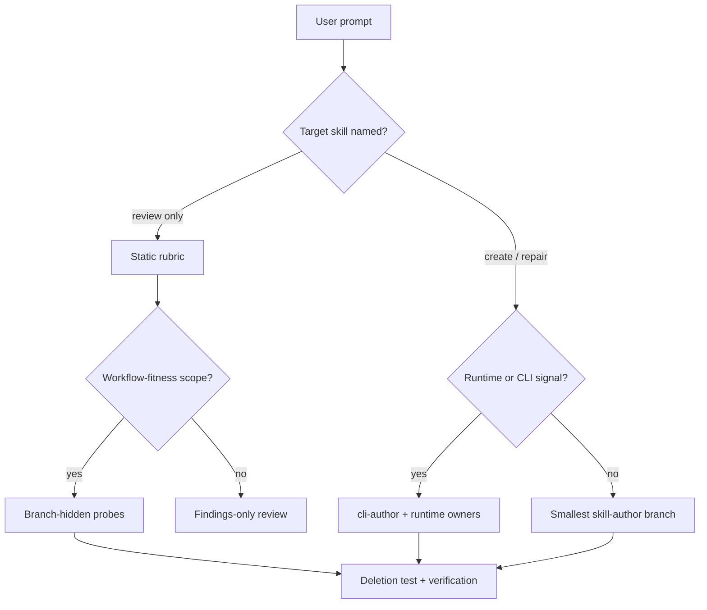

# Skill Author Workflow Hardening - Plan

## Goal Capsule

| Field | Value |
|---|---|
| Objective | Harden `skill-author` so normal agents create and review small, effective skills without missing runtime ownership, workflow probes, or pruning evidence. |
| Authority | `skills/skill-author/SKILL.md` owns routing; branch references own detailed gates; scripts own deterministic checks. |
| Execution profile | Small Markdown/source hardening with no new runtime dependency by default. |
| Stop conditions | Stop if the fix requires changing unrelated `skill-feedback` source, adding broad governance, or creating a second skill-authoring workflow. |
| Tail ownership | `ce-work` or a human implementer executes the units; `skill-author` verification gates prove source shape. |

---

## Product Contract

### Summary

This plan hardens `skill-author` at the workflow seam where static review currently looks good but practical create/review probes still expose misses.
The target outcome is a thinner, more reliable skill-authoring workflow that routes runtime-backed skill creation to the right owners, keeps workflow probes branch-hidden, and makes pruning evidence visible before handoff.

### Problem Frame

The fresh review found that `skill-author` already carries the right vocabulary: `thin router`, `current step only`, `branch-hidden reference`, `single source of truth`, and `deletion test`.
The remaining failure mode is practical routing.
A normal agent can still match generic skill creation before runtime-backed creation, run a static review without testing create flows, or copy authoring patterns that normalize Run Cards and bloated headings.

### Requirements

**Routing**

- R1. Runtime-backed creation prompts route to CLI/runtime ownership before generic create guidance.
- R2. Tiny prose skill creation still routes to the smallest create path and does not inherit runtime gates.
- R3. No-args and ambiguous invocations continue to show the menu instead of creating or patching by default.

**Review Fitness**

- R4. Review-only runs can perform workflow-fitness probes when the target is a skill-authoring workflow, without loading every edit gate for ordinary static reviews.
- R5. Review output stays findings-first and read-only unless the user asks for a patch.
- R6. The bloated-skill probe continues to flag first-screen owner maps, copied contracts, workflow sprawl, and unearned Run Cards.

**Pruning**

- R7. Create, fix, and repair handoffs surface the `deletion test` result as kept, moved, deleted, or none.
- R8. Branch-only probes and examples live behind references, not in the first screen.
- R9. Verification distinguishes live old-name owner drift from historical examples, fixtures, and unrelated `skill-feedback` test data.

### Scope Boundaries

- Keep the active work inside `skills/skill-author/` unless a startup owner path needs a narrow update.
- Do not patch unrelated `skills/skill-feedback/` dirty work.
- Do not remove historical create-skill mentions from decision logs, old plans, fixtures, or test examples unless a live owner-path check proves they affect current routing.
- Do not add a new runtime checker unless manual probe drift repeats after this hardening.

---

## Planning Contract

### Key Technical Decisions

- KTD1. Route runtime-backed creation before generic creation.
  The current top-down classifier can match `"create" / "new skill"` before `Runtime / CLI / helper command`, so the plan makes runtime signals the more specific route.
- KTD2. Add a branch-hidden workflow probe owner rather than bloating `SKILL.md`.
  The probes are valuable for reviewing `skill-author`, but putting them on the first screen would violate the same pruning goal they test.
- KTD3. Keep `skill-review-rubric.md` as the static review rubric and point workflow-fitness reviews to a separate probe reference.
  Static review remains lightweight, while skill-authoring workflow reviews get practical create/review/repair scenarios.
- KTD4. Use existing scripts for deterministic proof.
  `skill-description-audit.ts`, `check-owner-paths.ts`, and `agent-instructions.sh` already cover frontmatter collision, owner paths, and startup delivery.

### High-Level Technical Design

### Assumptions

- The hardening should produce Markdown/source edits only.
- Workflow probes should be reusable review evidence, not a new mandatory audit script.
- Existing checks are sufficient unless implementation exposes a repeated uncheckable miss.

### Sources & Research

- `skills/skill-author/SKILL.md` current classifier and Run Card.
- `skills/skill-author/references/skill-design-decision-runbook.md` branch index, deletion test, and handoff rule.
- `skills/skill-author/references/skill-review-rubric.md` static review lens.
- `skills/skill-author/references/skill-body-shape-gate.md` thin-router and branch-hidden reference rules.
- `docs/scratch/2026-06-30-skill-author-rename-review-handoff.md` current probe set and rename scope.

---

## Implementation Units

### U1. Prioritize Runtime-Backed Creation Routing

- **Goal:** Make runtime, CLI, helper command, machine output, durable write, and repair-envelope signals route before generic skill creation.
- **Requirements:** R1, R2, R3.
- **Dependencies:** None.
- **Files:** `skills/skill-author/SKILL.md`.
- **Approach:** Move or refine the runtime route so the top-down classifier treats it as the more specific create case. Keep generic create available for prose-only skills.
- **Patterns to follow:** Keep the route table compact and first-screen only; do not copy `cli-author` rules into `skill-author`.
- **Test scenarios:**
  - Prompt: “create a skill that wraps a CLI with JSON output and durable writes.” Expected route: runtime behavior with `skills/cli-author/SKILL.md`, `references/agent-native-skill-design.md`, and `references/runtime-portability.md`.
  - Prompt: “create a skill that drafts short release notes from PR facts.” Expected route: generic create path, no runtime references unless later evidence earns them.
  - Prompt: no args. Expected route: menu, no create action.
- **Verification:** Description audit passes; startup check still finds `skills/skill-author/SKILL.md`; manual prompt routing matches the three scenarios.

### U2. Add Branch-Hidden Workflow Probe Reference

- **Goal:** Give reviewers practical probes for skill-authoring workflows without expanding the first screen.
- **Requirements:** R4, R5, R6, R8.
- **Dependencies:** U1.
- **Files:** `skills/skill-author/references/skill-workflow-fitness-probes.md`, `skills/skill-author/references/skill-review-rubric.md`, `skills/skill-author/SKILL.md`.
- **Approach:** Create a small reference that owns the no-args, tiny prose skill, runtime-backed skill, bloated review, body-shape repair, ambiguous request, and rename clarity probes. Point to it only from review routes where workflow fitness is in scope.
- **Patterns to follow:** Mirror the probe list in `docs/scratch/2026-06-30-skill-author-rename-review-handoff.md`; keep it as branch evidence, not a copy template.
- **Test scenarios:**
  - Review prompt: “review skill-author as a working skill-authoring workflow.” Expected behavior: static rubric plus workflow probes.
  - Review prompt: “review this small unrelated skill for trigger clarity.” Expected behavior: static rubric only unless workflow-fitness evidence appears.
  - Bloated target: `skills/skill-feedback/SKILL.md`. Expected behavior: findings-first review flags first-screen owner/workflow bloat without patching.
- **Verification:** Owner-path check passes for the new reference; review rubric still says review-only returns findings unless patch requested.

### U3. Make Deletion-Test Evidence Hard To Miss

- **Goal:** Ensure create, fix, and repair handoffs record whether text was kept, moved, deleted, or not applicable.
- **Requirements:** R7, R8.
- **Dependencies:** U2.
- **Files:** `skills/skill-author/references/skill-design-decision-runbook.md`, `skills/skill-author/references/skill-verification-gate.md`, `skills/skill-author/references/skill-body-shape-gate.md`.
- **Approach:** Tighten the handoff and verification wording so the deletion-test result is part of the normal source-edit closeout, while review-only final responses continue to use `Skill follow-up:`.
- **Patterns to follow:** Preserve existing `Gotcha decision:` checker semantics; do not add a new heading template or broad checklist.
- **Test scenarios:**
  - Body-shape repair moves branch-only detail into a reference. Expected handoff: deletion-test result says moved.
  - Tiny prose skill creation needs no branch-only deletion. Expected handoff: deletion-test result says none.
  - Review-only run finds bloat but does not patch. Expected final response: findings plus `Skill follow-up:`, not a fake deletion-test result.
- **Verification:** `check-gotcha-decision.ts` remains compatible with artifacts that use `Gotcha decision:`; owner-path check passes.

### U4. Verify Live Owner Drift Without Broad Cleanup

- **Goal:** Prove the renamed `skill-author` owner is live while leaving historical `create-skill` examples alone.
- **Requirements:** R9.
- **Dependencies:** U1, U2, U3.
- **Files:** `skills/skill-author/references/skill-verification-gate.md`, `scripts/agent-instructions.sh`, `AGENTS.md`.
- **Approach:** Keep startup and owner-path verification as the live drift checks. If implementation finds live old-name references in startup or active skill-owner paths, patch only those.
- **Patterns to follow:** Use `scripts/agent-instructions.sh check --json` as the startup delivery proof and `check-owner-paths.ts --json` for local owner paths.
- **Test scenarios:**
  - Live startup check names `skills/skill-author/SKILL.md`. Expected result: pass.
  - `rg` finds old `create-skill` in historical docs or `skill-feedback` fixtures. Expected result: no patch unless a live owner check fails.
  - `rg` finds old create-skill paths under active startup or skill-author references. Expected result: patch the live owner path.
- **Verification:** Startup check, owner-path check, and description audit pass after edits.

---

## Verification Contract

| Gate | Applies to | Done signal |
|---|---|---|
| `bun run skills/skill-author/scripts/skill-description-audit.ts --json` | Any route or description change | Status `ok`; no new collisions. |
| `bun run skills/skill-author/scripts/check-owner-paths.ts --json` | Any owner/reference path change | Status `ok`; no missing local owner paths. |
| `scripts/agent-instructions.sh check --json` | Any startup-visible owner path change | Status `ok`; startup delivery points to `skill-author`. |
| YAML parse of edited `SKILL.md` | Any frontmatter edit | Frontmatter loads as valid YAML. |
| Manual workflow probes | All units | Runtime create, tiny prose create, no-args menu, review-only, body repair, ambiguous request, and bloated-skill review behave as expected. |

---

## Definition of Done

- Runtime-backed create prompts cannot be swallowed by generic create routing.
- Workflow-fitness review has one branch-hidden reference and does not bloat the first screen.
- Review-only runs remain findings-only unless patching is requested.
- Handoffs for create/fix/repair include deletion-test evidence or state why none applies.
- Live startup and owner-path checks pass with `skill-author` as the canonical source.
- No unrelated `skills/skill-feedback/` source changes are included.
- Dead-end wording or probe duplicates introduced during implementation are removed before handoff.
