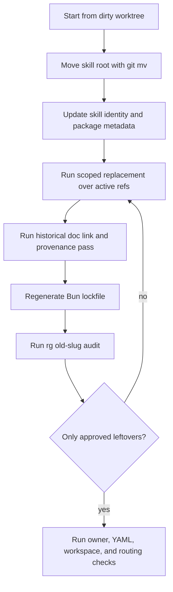

# refactor: Rename CLI skill to cli-author

## Goal Capsule

| Field | Value |
|---|---|
| Objective | Rename the CLI design skill from `create-cli` to `cli-author` across source, workspace metadata, and repo references. |
| Authority | `skills/skill-author/SKILL.md` owns skill rename and routing behavior; `skills/cli-author/SKILL.md` owns the renamed CLI-authoring workflow after the move. |
| Execution profile | Standard refactor; preserve unrelated dirty work and use small mechanical passes with verification after each broad replacement. |
| Stop conditions | Stop if a replacement would rewrite public facade API names, corrupt provenance that must remain literal, or touch unrelated dirty `skills/skill-feedback` work. |
| Tail ownership | After implementation, rerun skill routing probes, workspace checks, and startup instruction delivery checks. |

---

## Product Contract

### Summary

The repo should expose the skill as `cli-author`, not `create-cli`.
All active owner paths, workspace metadata, skill routing, generated links, and local references should point at the new slug.

### Problem Frame

`create-cli` now describes a broader authoring workflow for CLI surfaces.
The old verb-first name reads like a generator command and leaks into many owner-path references.
A rename reduces trigger ambiguity, but only if the repo's discovery surfaces and references move together.

### Requirements

- R1. The skill directory, frontmatter name, visible title, package metadata, workspace entry, and lockfile identity use `cli-author`.
- R2. Active owner references that point to `skills/create-cli` point to `skills/cli-author`.
- R3. Textual skill invocations and route names use `cli-author`, including slash-command references.
- R4. Historical docs, ADRs, plans, audits, and scratch files are migrated consistently enough that repo-local links still resolve after the move.
- R5. Public facade runtime APIs named `createCli*` are not renamed in this refactor.
- R6. The behavior-regression checklist still proves no-args, Basic, Agent-native, Facade-backed, skill-edit, and skill-author-overlap routing.
- R7. Startup instructions and skill-owner checks pass after the rename.
- R8. Any intentional old-name leftovers are recorded as exact hits or stable patterns in a small allowlist with owner, reason, and classification.
- R9. Hyphenated runtime fixture strings that use the old skill slug are either renamed to `cli-author` or allowlisted as fixture provenance.

### Scope Boundaries

- Rename the skill slug and repo-local references.
- Preserve the current uncommitted second patch in the moved files.
- Do not redesign the CLI-authoring workflow while renaming it.
- Do not rename `@side-quest/cli-command-facade`.
- Do not rename public runtime helpers such as `createCliRuntimeSuccessEnvelope`; those are package API names and would require a separate runtime migration.
- Do not edit unrelated dirty `skills/skill-feedback/**` files; inventory those old-name hits as deferred-owner leftovers unless scope is explicitly expanded.

### Acceptance Examples

- AE1. Given an agent sees `AGENTS.md`, when it reads the CLI-surface rule, then the rule names `cli-author` as the contract path.
- AE2. Given an implementation plan cites the CLI owner path, when the path is followed, then it resolves under `skills/cli-author`.
- AE3. Given a prompt says `Update cli-author routing`, when the skill runs, then it routes to `skill-author` before any no-purpose guard.
- AE4. Given `rg` searches for the old slug and path, when the rename is complete, then only allowlisted provenance, public API, or rename-plan leftovers remain.

---

## Planning Contract

### Key Technical Decisions

- KTD1. Use `cli-author` as the canonical slug.
  The directory becomes `skills/cli-author`, the frontmatter name becomes `cli-author`, and package identity becomes `cli-author-scripts`.
- KTD2. Make this a move plus replacement, not a compatibility alias.
  A bridge would keep the old ambiguous trigger alive and make future reference audits harder.
- KTD3. Treat path refs and text refs separately.
  Path refs must resolve mechanically; prose refs should be rewritten unless they are public API names or externally meaningful provenance.
- KTD4. Regenerate workspace metadata through Bun.
  Editing `bun.lock` by hand risks stale workspace identity; `bun install` should own lockfile updates.
- KTD5. Keep facade runtime API names stable.
  The `createCli*` helpers live in `runtime/cli-command-facade` and are broader than the skill name.
- KTD6. Make the old-name audit machine-reviewable.
  The implementation should write an allowlist file for intentional leftovers instead of relying on final-response prose.
  Allowlist rows are exact `rg -n` hits or stable patterns, not coarse file-level approvals unless every old-name hit in that file has the same classification and reason.
- KTD7. Separate public runtime APIs from runtime fixture strings.
  CamelCase `createCli*` helpers stay stable; hyphenated strings such as command examples, executable names, and test fixture command names are ordinary old-slug references unless a local test explains why they are provenance.
- KTD8. Keep historical filenames provenance-first.
  Historical ADR, brainstorm, and plan filenames can retain `create-cli` when the old slug is part of the recorded historical subject; rename those paths only when the inventory marks the file as an active canonical artifact that must move.

### High-Level Technical Design

### Assumptions

- The requested target name is `cli-author` in frontmatter, path, and prose.
- The display heading should be `CLI Author`.
- Strict replacement applies to repo-local references, not public runtime helper identifiers.
- Existing unrelated `skills/skill-feedback` changes are out of scope.

### Sequencing

Move the directory first, then update metadata, then update references.
This keeps path failures obvious and avoids editing files that will move in a later pass.

---

## Implementation Units

### U1. Move skill root and identity

- **Goal:** Rename the source skill and package identity while preserving the current uncommitted patch.
- **Requirements:** R1, R6.
- **Dependencies:** None.
- **Files:**
  - `skills/create-cli/**`
  - `skills/cli-author/**`
  - `skills/cli-author/SKILL.md`
  - `skills/cli-author/package.json`
- **Approach:** Use `git mv skills/create-cli skills/cli-author`.
  Update frontmatter `name`, heading, package `name`, package description, and script names from the old slug to `cli-author`.
  Keep `references/behavior-regression-checklist.md` content intact except for renamed prompts and paths.
- **Patterns to follow:** `skills/skill-author/SKILL.md` rename ownership; current `skills/create-cli/SKILL.md` thin-router shape.
- **Test scenarios:**
  - Parse `skills/cli-author/SKILL.md` frontmatter and confirm `name: cli-author`.
  - Run the moved behavior checklist mentally or mechanically and confirm existing lane probes still route.
  - Confirm `git diff --find-renames` shows a move rather than delete plus unrelated rewrite.
- **Verification:** The moved skill still contains the second patch behavior and has no `skills/create-cli` path refs inside its active files.

### U2. Update workspace metadata and lockfile

- **Goal:** Make Bun workspace discovery and package filtering use `cli-author-scripts`.
- **Requirements:** R1, R7.
- **Dependencies:** U1.
- **Files:**
  - `package.json`
  - `bun.lock`
  - `skills/cli-author/package.json`
- **Approach:** Replace the workspace package entry with `skills/cli-author`.
  Run `bun install` so `bun.lock` updates workspace path and package key data.
  Do not hand-edit lockfile entries unless Bun leaves a stale string that is demonstrably not regenerated.
- **Patterns to follow:** Existing workspace package shape for `skills/fallow`, `skills/test-runner`, and `skills/skill-feedback`.
- **Test scenarios:**
  - `bun --filter cli-author-scripts typecheck` resolves the moved package.
  - `bun --filter cli-author-scripts smoke` runs the moved smoke script.
  - `rg 'create-cli-scripts|skills/create-cli' package.json bun.lock` returns no unapproved hits.
- **Verification:** Bun workspace filters and scripts work under the new package name.

### U3. Replace active owner paths and skill routes

- **Goal:** Update active instructions, skill routes, and owner-path references to `cli-author`.
- **Requirements:** R2, R3, R7.
- **Dependencies:** U1.
- **Files:**
  - `AGENTS.md`
  - `skills/skill-author/SKILL.md`
  - `skills/context-advisor/SKILL.md`
  - `skills/context-advisor/references/storage-routing.md`
  - `skills/bad-practices/SKILL.md`
  - `skills/bad-practices/references/catalog.md`
  - `skills/bad-practices/references/testing.md`
  - `skills/record-decision/SKILL.md`
  - `skills/record-decision/references/operating-manual.md`
  - `skills/skill-self-audit-loop/SKILL.md`
  - `skills/cli-execution-auditor/SKILL.md`
  - `skills/cli-execution-auditor/references/lane-contract-clauses.md`
- **Approach:** Use `rg -l 'create-cli|skills/create-cli|/create-cli|Create CLI|create cli'` and apply a scoped replacement to active source and instruction files first.
  Preserve semantics: `skill-author` still owns skill creation and editing; `cli-author` owns CLI surface design.
- **Patterns to follow:** Current `skill-author` route table; `AGENTS.md` rule that CLI surface changes use the owner skill.
- **Test scenarios:**
  - `Update cli-author routing` routes to `skill-author` before the no-purpose guard.
  - `create a skill that wraps a CLI with JSON output and durable writes` keeps skill creation with `skill-author` and routes only the CLI surface to `cli-author`.
  - Owner-path check reports no missing `skills/create-cli` paths.
- **Verification:** Active startup and skill references no longer point to the old path.

### U4. Inventory and migrate repo-local references

- **Goal:** Make the repo-wide `rg` replacement deterministic, then migrate docs, audits, runtime fixture strings, and generated visual references.
- **Requirements:** R2, R3, R4, R8, R9.
- **Dependencies:** U1, U3.
- **Files:**
  - `skills/cli-author/references/rename-leftovers-allowlist.md`
  - `docs/adr/0007-create-cli-stays-verbatim-upstream-not-forked.md`
  - `docs/adr/0009-create-cli-uses-bounded-local-extension.md`
  - `docs/skill-audits/create-cli/self-audit-loop.md`
  - `docs/scratch/2026-07-01-create-cli-rubric-review-handoff.md`
  - `runtime/cli-command-facade/CONTEXT.md`
  - `runtime/cli-command-facade/src/command-contract.ts`
  - `runtime/cli-command-facade/tests/command-facade.test.ts`
  - `runtime/cli-command-facade/tests/command-metadata.test.ts`
  - `skills/cli-author/playgrounds/create-cli-explorer.html`
  - `skills/cli-author/playgrounds/create-cli-skill.html`
  - Every additional repo file returned by the strict old-slug `rg` audit, inventoried in `rename-leftovers-allowlist.md` before editing.
- **Approach:** Start by writing `rename-leftovers-allowlist.md` as an inventory with one row per exact old-slug `rg -n` hit or stable pattern.
  Each row records path, hit or pattern, classification, action, owner, and reason.
  Use file-level grouping only when every old-name hit in that file has the same classification, action, owner, and reason.
  Classifications include rewrite, path move, runtime fixture, provenance, public API, rename plan, and deferred owner.
  Treat `skills/skill-feedback/**` hits as deferred-owner rows unless scope is explicitly expanded; do not edit those dirty files in this rename.
  Rename repo-local files and directories whose basename includes the old slug only when the inventory marks them as path moves.
  Keep historical ADR, brainstorm, and plan filenames when the old slug is part of the recorded historical subject; update links only when the inventory intentionally moves the path.
  Update links and prose in docs, plans, audits, scratch handoffs, playground HTML, runtime comments, and runtime test fixture strings.
  Treat hyphenated runtime command examples such as `create-cli runtime inspect` as rename candidates, not public API.
  Where a historical sentence needs to mention the former name, use a short provenance sentence and keep that exact hit in the final allowlist rather than hiding the history.
- **Patterns to follow:** Existing ADR and plan naming conventions; `docs/skill-audits/*/self-audit-loop.md` path shape.
- **Test scenarios:**
  - The inventory accounts for every hit returned by the pre-edit old-slug `rg -n` command.
  - File-level grouping appears only when every hit in that file shares one classification, action, owner, and reason.
  - `skills/skill-feedback/**` old-name hits are deferred-owner rows unless scope is explicitly expanded.
  - Historical ADR, brainstorm, plan, and audit-loop links resolve whether retained as provenance filenames or intentionally renamed.
  - Runtime facade tests no longer use `create-cli` as a live executable or command example unless that exact fixture row is allowlisted.
  - Playground HTML still labels the skill as `cli-author`.
  - Final `rg` old-slug audit shows only approved allowlist classifications.
- **Verification:** There are no unclassified old-slug hits, no broken repo-local links caused by the rename, and no hyphenated runtime fixture strings outside the inventory outcome.

### U5. Run verification and delivery checks

- **Goal:** Prove the rename did not break skill discovery, owner paths, workspace package behavior, runtime fixture expectations, or startup instructions.
- **Requirements:** R6, R7, R8, R9, AE1, AE2, AE3, AE4.
- **Dependencies:** U2, U3, U4.
- **Files:**
  - `skills/cli-author/SKILL.md`
  - `skills/cli-author/references/behavior-regression-checklist.md`
  - `skills/cli-author/references/rename-leftovers-allowlist.md`
  - `AGENTS.md`
  - `scripts/agent-instructions.sh`
- **Approach:** Run exact old-slug searches, YAML checks, owner-path checks, description audit, package typecheck, smoke test, and startup delivery check.
  Capture any intentional leftovers in the allowlist with owner, reason, and whether the hit is provenance, public API, or this rename plan.
- **Patterns to follow:** Current verification commands already used for the second patch pass.
- **Test scenarios:**
  - No-args or `make a CLI` offers the lane router and does not invent a spec.
  - `Design a shell CLI for archiving old log files.` stays Basic CLI.
  - `Create a Bun TypeScript CLI for checking project health.` stays ambiguous.
  - `Design an agent-native Python CLI agents can parse and recover from.` stays Agent-native.
  - `Create a facade-backed Bun TypeScript CLI using @side-quest/cli-command-facade.` stays Facade-backed.
  - `Update cli-author routing.` routes to skill-edit handling before no-purpose guard.
  - `create a skill that wraps a CLI with JSON output and durable writes.` keeps `skill-author` as skill owner.
- **Verification:** All checks pass, or each remaining old-name hit has an explicit owner and reason.

---

## Verification Contract

| Gate | Applies to | Done signal |
|---|---|---|
| Old slug audit | U1-U5 | `rg -n 'create-cli|Create CLI|create cli|create-cli-scripts|skills/create-cli|/create-cli'` returns only hits recorded as exact hits or stable patterns in `skills/cli-author/references/rename-leftovers-allowlist.md`. |
| Runtime API exclusion audit | U3-U5 | `rg -n 'createCli' runtime skills` shows only facade API/helper usage, not renamed skill slug leftovers. |
| Runtime fixture string audit | U4-U5 | `rg -n 'create-cli|Create CLI|/create-cli' runtime/cli-command-facade` returns only hits recorded in `skills/cli-author/references/rename-leftovers-allowlist.md`. |
| YAML parse | U1, U5 | `skills/cli-author/SKILL.md` frontmatter parses with `name: cli-author`. |
| Owner path check | U3-U5 | `bun run skills/skill-author/scripts/check-owner-paths.ts --json` passes. |
| Description audit | U1, U5 | `bun run skills/skill-author/scripts/skill-description-audit.ts --json` passes. |
| Workspace typecheck | U2, U5 | `bun --filter cli-author-scripts typecheck` passes. |
| Workspace smoke | U2, U5 | `bun --filter cli-author-scripts smoke` passes. |
| Startup delivery | U3, U5 | `scripts/agent-instructions.sh` shows startup instructions reference `cli-author`. |
| Routing regression | U1, U5 | `skills/cli-author/references/behavior-regression-checklist.md` probes pass with renamed prompts. |

---

## Definition of Done

- The skill source lives under `skills/cli-author`.
- The skill frontmatter name is `cli-author`.
- Active owner paths use `skills/cli-author`.
- Workspace metadata and lockfile point to `cli-author-scripts`.
- Old-name `rg` audit has zero unapproved hits after applying `skills/cli-author/references/rename-leftovers-allowlist.md`.
- Public facade runtime APIs remain unchanged.
- Behavior-regression probes pass with the new skill name.
- Startup instruction delivery and skill-author checks pass.
- The final diff contains no unrelated `skills/skill-feedback` edits from this rename.
- Any dead-end rename scripts, scratch files, or temporary outputs are removed before handoff.

---

## Risks & Dependencies

- **Historical provenance churn:** Strict replacement can blur old decision history.
  Mitigation: keep historical filenames when the old slug is the recorded subject, rename only inventory-marked active canonical paths, and document every remaining exact hit or stable pattern in the allowlist.
- **Lockfile drift:** Manual lock edits can desync Bun workspace identity.
  Mitigation: use `bun install` after package metadata changes.
- **Runtime API overreach:** Replacing `createCli*` helper names would expand this into a facade runtime migration.
  Mitigation: keep camelCase helper API names out of the replacement set.
- **Dirty worktree collision:** Existing unrelated `skills/skill-feedback` changes must not be staged or rewritten.
  Mitigation: use path-scoped edits and status checks before and after.

---

## Sources & Research

- `skills/skill-author/SKILL.md` defines skill edit and owner-routing behavior.
- `skills/skill-author/references/skill-design-decision-runbook.md` defines thin-router, owner-path, and verification rules.
- `skills/create-cli/SKILL.md` and `skills/create-cli/references/behavior-regression-checklist.md` define the current rename target and routing probes.
- `package.json` and `bun.lock` define workspace package discovery.
- Initial `rg` search found about 139 files with old slug, title, package, or path references.
