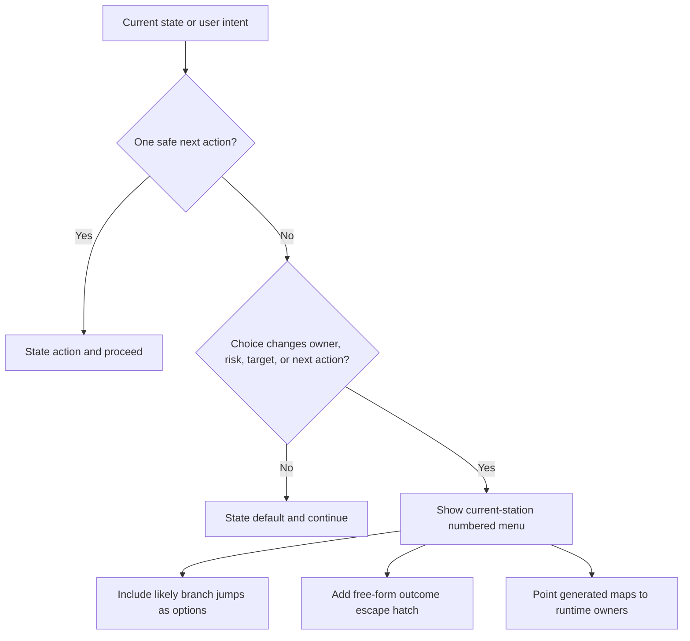

# Numbered Router Helper Rewrite - Plan

## Goal Capsule

| Field | Value |
| --- | --- |
| Objective | Replace the `ADHD-friendly DX` skill-author reference with a general `Numbered router helper` reference. |
| Authority hierarchy | User decisions from this session, then `skills/skill-author/SKILL.md`, then skill-author references and owner-path gates. |
| Execution profile | Documentation/source rewrite in `skills/skill-author`; no runtime behavior changes. |
| Stop conditions | Stop if a proposed edit would redefine facade `Branch Station` or `Station Map` contracts instead of pointing at their owner paths. |
| Tail ownership | `skill-author` owns the reference rewrite; `cli-author` and `cli-execution-auditor` own facade-backed station-map guidance. |

---

## Product Contract

### Summary

Rename and rewrite the current low-load menu reference as `Numbered router helper`. The new helper should teach current-station numbered menus, one recommended default, likely branch jumps as numbered options, and a free-form outcome escape hatch.

### Problem Frame

The current reference name frames the pattern around ADHD-friendly DX, while the desired reusable skill-authoring concept is broader: agents need a menu helper for branching workflows, handoffs, recovery paths, and next safe actions without copying runtime contracts. The rewrite should remove personal-productivity framing and align the wording with the repo's owner-path and facade-runtime rules.

### Requirements

- R1. Replace the active `ADHD-friendly DX` owner path with `Numbered router helper`.
- R2. Define the helper as menu mechanics for the current decision station, not an exhaustive workflow branch catalog.
- R3. Keep `Next Safe Actions` as the default heading for reply-by-number menus.
- R4. Put likely cross-branch jumps in the numbered menu when they matter.
- R5. Use `Reply with a number, or say what outcome you want.` as the canonical escape hatch.
- R6. Treat Branch Maps as orientation and Station Maps as generated runtime evidence when a facade-backed catalog exists.
- R7. Point facade-backed Branch Station and Station Map behavior at runtime/auditor owner paths instead of redefining their fields or semantics.
- R8. Keep prose Branch Maps available only as non-contract orientation for non-facade conversational skills.
- R9. Update active skill-author references and vocabulary so no active owner path still points at `adhd-friendly-dx.md`.

### Scope Boundaries

#### In Scope

- Rename and rewrite the skill-author reference.
- Update active references that point at the old filename or term.
- Add the new glossary term without duplicating facade runtime vocabulary.
- Preserve examples as illustrative, not contractual.

#### Deferred to Follow-Up Work

- Updating example skills such as `classic-cinema` or `lll-account-switch` to remove old `DX lens` wording.
- Adding runtime Station Map support to any CLI that does not already own a Branch Station Catalog.

#### Out of Scope

- Changing `runtime/cli-command-facade` Station Map contracts.
- Making Station Maps mandatory for all skills or CLIs.
- Adding a new CLI surface or command behavior.

---

## Planning Contract

### Key Technical Decisions

- KTD1. **Generated-first station maps:** Facade-backed branch/station views come from package-owned Branch Station Catalogs plus Station Map projection. Skill prose points at owner paths and does not copy catalog fields.
- KTD2. **Current-station menus only:** `Next Safe Actions` shows choices worth offering now. It is not a list of all possible branches.
- KTD3. **Branch jumps are menu options:** Likely jumps appear as numbered options, such as "Quick book - jump to Express", rather than a second route picker.
- KTD4. **Free-form stays outside the menu:** The escape hatch remains a line after the menu, not a `Chat about this` option that competes with actions.
- KTD5. **Glossary defines only the helper:** `skills/skill-author/CONTEXT.md` defines `Numbered router helper`; runtime-owned Branch Station and Station Map terms remain owner-linked, not redefined.

### High-Level Technical Design

### Owner Paths

- Skill-author route and edit workflow: `skills/skill-author/SKILL.md`.
- Current reference to rename: `skills/skill-author/references/adhd-friendly-dx.md`.
- Body shape route: `skills/skill-author/references/skill-body-shape-gate.md`.
- Folder map: `skills/skill-author/references/consolidation-map.md`.
- Vocabulary owner: `skills/skill-author/CONTEXT.md`.
- Branch Station model and Station Map projection owner: `runtime/cli-command-facade/src/station-map.ts`.
- Cross-package Station Map report owner: `skills/cli-execution-auditor/src/station-map.ts`.
- Facade guidance owner: `skills/cli-author/references/cli-command-facade.md`.

### Assumptions

- The old filename has no compatibility requirement; active references can move directly to the new owner path.
- Archive cleanup is not required unless a later pass finds active archive-derived references.
- The rewrite is documentation-only and should not require TypeScript changes.

---

## Implementation Units

### U1. Rename And Rewrite Helper Reference

- **Goal:** Move the reference to the new owner path and rewrite it around numbered router mechanics.
- **Requirements:** R1, R2, R3, R4, R5, R6, R8.
- **Dependencies:** None.
- **Files:** `skills/skill-author/references/adhd-friendly-dx.md`, `skills/skill-author/references/numbered-router-helper.md`.
- **Approach:** Rename the file, then replace the body with the accepted helper model: current-station menus, Branch Map orientation, likely branch jumps as numbered options, and the canonical escape hatch line. Mark runtime examples as illustrative.
- **Patterns to follow:** `skills/skill-author/references/skill-body-shape-gate.md`, `skills/skill-author/references/skill-io-shape-examples.md`.
- **Test scenarios:**
  - Renamed reference exists at the new path and the old path is absent from active reference lists.
  - The reference states that `Next Safe Actions` is current-station only.
  - The examples show likely branch jumps as numbered options rather than a separate route picker.
  - The examples include `Reply with a number, or say what outcome you want.` after the menu.
- **Verification:** The rewritten reference avoids copied flags, schemas, Station Map fields, and runtime contracts.

### U2. Update Skill-Author Routing References

- **Goal:** Retarget active skill-author guidance from the old helper name/path to the new helper.
- **Requirements:** R1, R2, R3, R9.
- **Dependencies:** U1.
- **Files:** `skills/skill-author/references/skill-body-shape-gate.md`, `skills/skill-author/references/consolidation-map.md`.
- **Approach:** Change the body-shape gate to point multi-choice flows at `references/numbered-router-helper.md`. Update the consolidation map folder shape so the active reference inventory matches the filesystem.
- **Patterns to follow:** Owner-path gate guidance: name owner paths instead of copying contracts.
- **Test scenarios:**
  - `skill-body-shape-gate.md` still owns when to use a menu.
  - `numbered-router-helper.md` owns how numbered choices behave.
  - The consolidation map lists the new reference and not the old one.
- **Verification:** Owner-path check reports no missing active `references/` targets.

### U3. Update Skill-Author Vocabulary

- **Goal:** Add durable terminology for the helper without redefining facade runtime terms.
- **Requirements:** R1, R6, R7, R9.
- **Dependencies:** U1.
- **Files:** `skills/skill-author/CONTEXT.md`.
- **Approach:** Replace the old `ADHD-friendly DX` glossary entry with `Numbered router helper`. Define it as a skill-authoring pattern for short reply-by-number menus at current decision stations, with one recommended default, likely branch jumps as menu options, and a free-form outcome escape hatch. Avoid redefining `Branch Station` or `Station Map`; point readers to the runtime owner paths where needed.
- **Patterns to follow:** Existing `CONTEXT.md` term shape with `Avoid` guidance.
- **Test scenarios:**
  - The glossary has one active helper term with the new name.
  - The term does not claim ownership over Station Map field semantics.
  - Avoid terms reject exhaustive branch catalogs, copied Station Maps, chat-as-option, and hidden recommendations.
- **Verification:** The entry is glossary-shaped and free of implementation detail.

### U4. Verify Active References And Delivery

- **Goal:** Prove the rewrite is internally consistent and ready for source implementation.
- **Requirements:** R7, R9.
- **Dependencies:** U1, U2, U3.
- **Files:** `skills/skill-author/references/numbered-router-helper.md`, `skills/skill-author/references/skill-body-shape-gate.md`, `skills/skill-author/references/consolidation-map.md`, `skills/skill-author/CONTEXT.md`.
- **Approach:** Run the owner-path check, search active skill-author references for the old filename/name, and check changed-file whitespace. Run YAML parsing only if a `SKILL.md` is edited during execution.
- **Patterns to follow:** `skills/skill-author/references/skill-verification-gate.md`.
- **Test scenarios:**
  - Active skill-author references contain no `references/adhd-friendly-dx.md`.
  - Any remaining `ADHD-friendly DX` mentions are archive-only or intentionally deferred.
  - Owner-path checks pass after the rename.
  - Changed files have no whitespace errors.
- **Verification:** Implementation report names edited paths, owner-path result, skipped checks, deletion-test result, next safe action, and skill-feedback closeout status.

---

## Verification Contract

| Gate | Applies To | Done Signal |
| --- | --- | --- |
| Owner paths | U1, U2, U4 | `bun run skills/skill-author/scripts/check-owner-paths.ts --json` reports no missing active owner path. |
| Old reference search | U1, U2, U3, U4 | Active skill-author files no longer point at `adhd-friendly-dx.md` or define `ADHD-friendly DX` as the current term. |
| Whitespace check | U1-U4 | Changed files have no whitespace errors. |
| YAML parse | Conditional | Run only if execution edits any `SKILL.md`; parse succeeds. |
| Startup delivery check | Conditional | Run only if execution changes startup-facing `AGENTS.md` or skill routing delivery; `scripts/agent-instructions.sh check --json` succeeds. |
| Skill closeout | U4 | Material skill run closeout is filed through `skill-feedback`. |

---

## Definition of Done

- The old active helper reference is renamed to `numbered-router-helper.md`.
- Active skill-author references point at the new helper.
- `CONTEXT.md` defines `Numbered router helper` and does not duplicate runtime Station Map contracts.
- The helper documents current-station numbered menus, likely branch jumps as options, and the canonical escape hatch line.
- Generated-first Station Map guidance points to facade runtime and auditor owner paths.
- Deferred follow-up work is not hidden in the active units.
- Verification gates pass or skipped conditional gates are named with reasons.
- Material skill run closeout is filed through `skill-feedback`.
- Abandoned draft text or duplicate old helper wording is removed from changed active files.

---

## Appendix

### Sources And Research

- `skills/skill-author/SKILL.md` routes body shape, owner path, and verification work.
- `skills/skill-author/references/skill-design-decision-runbook.md` requires thin-router shape, owner paths, and the deletion test.
- `skills/skill-author/references/skill-body-shape-gate.md` owns when to add `Intent Classification` or `Next Safe Actions`.
- `skills/skill-author/references/skill-owner-path-gate.md` requires deterministic behavior to live in code, help, generated docs, tests, or scripts.
- `skills/skill-author/references/skill-verification-gate.md` names owner-path and startup checks.
- `skills/cli-author/references/cli-command-facade.md` states Branch Station Catalogs and Station Maps are facade-backed proof surfaces.
- `runtime/cli-command-facade/src/station-map.ts` owns the Branch Station model and Station Map projection.
- `skills/cli-execution-auditor/src/station-map.ts` owns cross-package Station Map reconciliation.
