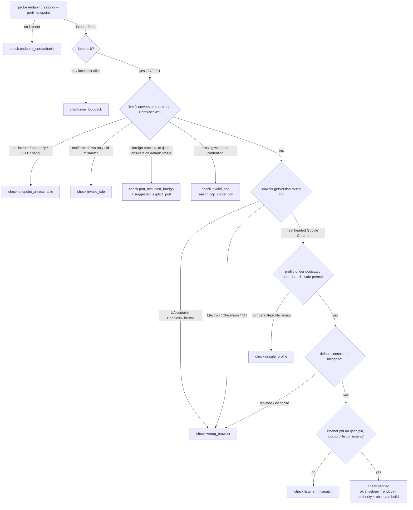

# Warm Chrome Runtime Package - Plan

## Goal Capsule

- **Objective:** Build `runtime/warm-chrome` (`@side-quest/warm-chrome`) — the independently hardened browser-entry package under `browser-use` — implementing the Warm Chrome lifecycle CLI (`check`, `status`, `launch`, `repair`) to a 16-station Branch Station Catalog with drift gate, via a test-first station-by-station port of proof internals from `skills/browser-use/src/preflight-warm-chrome.ts`.
- **Authority hierarchy:** decision log `docs/decisions/2026-07-03-warm-chrome-runtime-package-definition.md` > ADR 0009 (incl. 2026-07-03 amendment) > research capture `skills/browser-use/docs/research/2026-07-03-warm-chrome-cdp-gotchas-and-port-policy.md` > this plan > existing implementation (learn from, don't copy blindly).
- **Stop conditions:** stop if a station's behavior cannot be pinned without changing the accepted catalog semantics (surface, don't improvise); stop if the facade drift validators reject the alias-command or exit-20 shape in a way the browser-use precedent doesn't resolve; never modify `skills/browser-use/src/preflight-warm-chrome.ts` or its tests — it stays authoritative until the deferred parity switchover.
- **Execution profile:** test-first per station — failing station test, then port the proof internal, then green. Old preflight remains untouched and authoritative throughout.
- **Tail ownership:** parity switchover (browser-use bin/docs flip, old file retirement) is deferred follow-up work, not this plan.

---

## Product Contract

### Summary

A new workspace package `runtime/warm-chrome` that owns Warm Chrome readiness proof: prove the agent is attached to the correct warm Chrome — real browser, dedicated profile, loopback CDP, browser-level websocket, listener/profile/port consistency — or fail with a repair path before any adapter acts. It adopts the cli-command-facade Agent-Native CLI Runtime Contract end to end and adds the suggested-explicit-port repair hint that the existing implementation lacks.

### Problem Frame

The existing Warm Chrome proof lives inside the `browser-use` skill directory as a 2000-line single file. The product definition session (decision log above) accepted hardening it into an independent package boundary: the proof is browser-entry authority for every adapter, so it needs its own contract, catalog, drift gates, redaction proofs, and tests — none of which the skill-local file carries today (no station catalog, no redaction fixture assertions, no parity harness). The core failure mode being engineered against is false confidence: tools seeing a port, profile path, or tab list and mistaking it for a usable warm browser.

### Requirements

**Contract and catalog**

- R1. The package lives at `runtime/warm-chrome`, npm name `@side-quest/warm-chrome`, `private: true`, consuming `@side-quest/cli-command-facade` from the package root only (`/testing` in tests).
- R2. Four commands: `check` (agent proof, JSON default), `status` (presentation alias of `check` with plain default), `launch`, `repair`.
- R3. Exit semantics: baseline `0`/`1`/`2` plus package-owned `20` (browser-entry failure), declared in the contract's `exitCodes` and passing the facade baseline-exit drift validators.
- R4. A 16-station Branch Station Catalog with a drift gate against discovery metadata, plus the explicit rule that `launch` and `repair` re-emit `check` proof-failure stations by reference so a diverging envelope is a drift finding.
- R5. One station = one canonical error code = one primary action; fine-grained cause (`chrome_for_testing`, `default_profile`, `non_loopback_websocket`, …) lives in a machine-readable `reason` detail, not the error code.

**Proof behavior**

- R6. `check` proves, in order: a live TCP loopback listener (a real `/json/version` HTTP round-trip, not merely a `--remote-debugging-port` argv token — Cypress's `--remote-debugging-pipe` and Chrome's ws-only configs both put CDP where no TCP listener answers); numeric-loopback bind (`127.0.0.1`, not the `localhost` alias, so a mangled hosts file cannot misclassify); real Google Chrome by process-binary identity, rejecting Chrome for Testing, Chromium, and non-Chrome Chromium/Electron endpoints (Slack, VS Code, and cloud CDP all answer `/json/version`); a dedicated persistent non-default profile with safe permissions where the resolved profile path lives *under* the dedicated `--user-data-dir` (`--profile-directory` remaps into the custom dir on Chrome 136+, so profile-name checks alone are insufficient); browser-level `webSocketDebuggerUrl` taken verbatim from `/json/version` (never synthesized — the ws URL shape is implementation-defined); a trivial CDP round-trip over that websocket (`Browser.getVersion`), because a parseable `/json/version` does not prove an attachable browser; and listener/profile/port consistency.
- R6a. `check` proves it is on the browser's default context, not an isolated or incognito context: the same warm Chrome presents a logged-in dashboard to the default context and a login page to a fresh context, so a reachable endpoint on the wrong context is a false pass. The proof asserts the persistent-profile context, not a fresh one.
- R6b. `check` rejects a headed-looking headless browser: since Chrome 112 headless-new runs the same backend and exposes an identical `/json/version` and browser-ws shape as headed, so endpoint/version/tab-list shape cannot discriminate. The only reliable CDP tell is the User-Agent from `Browser.getVersion` — reject when it contains `HeadlessChrome`/`headless` (reason `headless_not_headed`).
- R6c. `check` treats a `/json/version` answer on the *default* profile as a foreign instance, not confirmation: on Chrome 144+/147/150 the hardened default-profile remote-debugging server has no HTTP endpoint, so a port that both listens and answers `/json/version` while pointed at the default profile is a different Chrome — fail loud rather than adopt it. The proof derives the browser-ws from a single authoritative source and rejects a `DevToolsActivePort` endpoint id that disagrees with the `/json/version` websocket id (reason `endpoint_id_mismatch`).
- R7. Port policy per ADR 0009 amendment: probe `9222`; verify identity-then-liveness (a listener answering `9222` is never proof of *our* warm Chrome — stale sessions and foreign tools get silently adopted by other CDP clients); verify or launch on it; fail loud with exit 20 when a foreign listener occupies it, including an informational `suggested_explicit_port` (first free loopback candidate in a bounded unprivileged window near `9222`, e.g. `9223`–`9299`, never below `1024`; omitted when the window exhausts). The suggestion is never an allocator: no spawn, no persistence, no rebinding; a suggested port becomes usable only via explicit `--port`/`--endpoint` rerun plus successful proof.
- R7a. A CDP connection, listener, or attach error is not proof the browser is dead: `ClosedChannelException`, `No inspectable targets`, and HTTP 400 all occur against a healthy live browser under multi-client contention. On such an error the proof re-probes `/json/version` before emitting a browser-down verdict, and classifies a target missing its `webSocketDebuggerUrl` as contention (reason `cdp_contention`), not `endpoint_unreachable`.
- R8. The ok envelope is the only endpoint authority: it carries the verified endpoint and browser-level websocket URL, and the `use_verified_endpoint` action guidance carries the actual endpoint — consumers must never derive the endpoint from the `9222` convention. This is the Now-scope mitigation for adapter drift: both new first-party attach CLIs (Playwright `attach --cdp=chrome`, Google `chrome-devtools --autoConnect`) default their zero-config path to the *default* profile via the Chrome M144 `chrome://inspect` toggle — the opposite of this package's dedicated-profile posture — so a consumer that trusts the convention over the verified endpoint attaches to the wrong Chrome.
- R9. `launch` has a bounded readiness budget. Spawn-then-proof-failure (or timeout) lands on `launch.spawned_unverified` (exit 20, mutation pin `writes_browser_state`) with guidance that browser state was written and blind respawn is wrong. An immediate second `launch` refuses to respawn by reading Chrome's `SingletonLock` in the dedicated profile through the seam — profile-state inspection, not an ownership record — so refusal holds even in the post-spawn, pre-bind window where the port still looks free.
- R10. Launch race policy: after spawning, re-run the proof; loser detection compares the verified listener's pid to our own spawned child's pid (real Chrome's `ProcessSingleton` may itself retire the loser's child, so the kill must tolerate an already-exited pid without changing station); if we lost, terminate only our own spawned child (never a foreign listener) and land on `launch.already_verified`. A failed kill lands `launch.spawned_unverified` with reason `own_child_kill_failed`.
- R10a. `launch` preserves the old preflight's competing-instance guard: when `--port`/`--endpoint` differs from the convention port and a healthy Warm Chrome already verifies on `9222`, land `launch.already_verified` carrying the `9222` endpoint with no spawn — refusing to spawn a second Warm Chrome, which is a direct adapter-drift feeder.
- R11. `repair` never terminates a listener it did not verify as Warm Chrome.

**Agent-native contract**

- R12. Every envelope is self-describing for a cold agent: canonical error code, severity/recoverability/retryability, `runtime_actions` (no executable command templates) with Runtime Continuation Guidance; every exit-20 envelope carries `no_adapter_fallback` continuation meaning.
- R13. Redaction: foreign-listener diagnostics emit pid and process basename only — no cmdline arguments, no foreign filesystem paths. "Foreign" means a listener whose process identity fails the real-Chrome check; a real-Chrome listener with a mismatched profile/port is non-foreign, and its observed `--user-data-dir` path may appear in `listener_mismatch` envelopes because the agent needs it to act on `inspect_listener`. The ok-envelope redaction exemption applies to the structured JSON output channel only: it carries the verified websocket URL intact, but any diagnostic event (LogTape, debug emits, post-mortem buffer flush) that records a `webSocketDebuggerUrl` redacts it to its path prefix, because the ws URL is a browser capability handle and diagnostic sinks have weaker access control than the primary output. Proven with the facade redaction baseline fixtures plus an ok-path diagnostic fixture and one fixture per side of the foreign boundary.
- R14. Discovery metadata (Command Discovery Tree projection) covers all four commands, exit code 20, actions, and the result contract id, so an agent can learn the CLI without reading source.

**Parity and posture**

- R15. `skills/browser-use/src/preflight-warm-chrome.ts` stays authoritative and unmodified until the deferred switchover; this package owns a new result contract id and schema version.
- R16. A golden-envelope parity harness runs shared runtime-seam fixtures through both the old preflight and the new package, comparing station/exit/envelope outcomes, so parity is measured, not asserted.
- R17. The CDP surface the proof depends on is treated as version-scoped: the ok envelope records the observed Chrome build, and a protocol-shape surprise (an expected `/json/version` field or CDP method absent) fails loud rather than degrading silently. WebDriver BiDi is a recorded migration watch item — Selenium already declares its CDP support transitional — not Now-scope work.

### Scope Boundaries

**Deferred to Follow-Up Work**

- Browser-use switchover: bin/script flip in `skills/browser-use/package.json`, SKILL.md and `references/warm-chrome.md` updates, `build-dist.ts`, retirement of the old preflight file and test — gated on the parity harness passing.
- Runtime Recovery Choice operator menu for `repair.unrepairable` (plain diagnostics ship first).
- npm publishing shape (`files` allowlist, publishConfig) — package ships `private: true`.
- Finalized `reason` detail vocabulary — grows station-by-station during the port; the closed union is pinned in code and tests as it lands.

**Outside this product's identity**

- Browser Adapter Proof (owns adapter-binding-vs-verified-endpoint comparison — the durable fix for adapter drift), Browser Adapter Router, action operations, multi-engine oracle.
- Port allocation, durable port binding, leases, mutation locks, ownership records (ADR 0009; superseded ADR 0008 is the failed approach).
- Terminating unverified listeners; silent fallback to Chrome for Testing or a cold profile; treating `DevToolsActivePort`, a port number, or a tab list as browser identity.

---

## Planning Contract

### Key Technical Decisions

- **16th station `launch.spawned_unverified`** (extends the accepted 15). A post-spawn proof failure mutates the workspace where a read-only check failure does not; the 1:1 station=code=mutation-pin drift gate cannot express "same code, different mutation class" through the re-emit rule. Chosen over a mutation-pin override on re-emits, which would weaken the invariant the gate relies on. *Flagged: extends the decision-log catalog; recorded there after review.*
- **Seam extended with a child handle (one deliberate change over the old seam).** The old `spawnChrome` returns `Promise<void>` — detached, no pid, no kill — so the race policy's "terminate own child" is unimplementable against it, and killing by port lookup would violate R11. `spawnChrome` returns `{ pid, kill(): Promise<boolean> }`; loser detection compares the verified listener pid to the child pid; a failed kill lands `launch.spawned_unverified` with reason `own_child_kill_failed`. Everything else in the seam ports unchanged. U8's parity fixtures adapt the two seam shapes through a thin per-implementation adapter.
- **Second-launch refusal is profile-state-derived, not lock-derived.** ADR 0009 forbids ownership records, but reading Chrome's `SingletonLock` in the dedicated profile is proof-territory profile inspection, not a lease — and it is the only mechanism that holds in the post-spawn, pre-bind window where the port still looks free. Chosen over the weaker probe-only refusal (which would permit a second spawn during a slow cold start, the likeliest `spawned_unverified` cause).
- **Launch race: post-spawn re-verify, loser backs off.** Both racers may spawn; re-verification compares pids and the loser terminates its own child only. Real Chrome's `ProcessSingleton` may retire the loser's child first, so the kill tolerates an already-exited pid without changing station. No new station beyond the 16th.
- **Canonical intent-level error codes with `reason` detail** (accepted in the decision log): agents route on action, codes stay 1:1 with stations; the old implementation's 13+ fine-grained codes become `reason` values.
- **CDP responses are untrusted input.** A rogue listener on `9222` can return a crafted `/json/version` that passes every literal field check; the defense is cross-validating the response's process identity against the `findListener` pid and running a live `Browser.getVersion` round-trip before any station accepts the target. Pinned as an R6 invariant so the drift gate can catch a port that skips the cross-check.
- **Two-layer result vocabulary (ADR 0018):** envelope fields (status, structured error, recoverability, continuation) are facade-owned and reused via facade builders; error codes, reason details, and action ids are a package-owned closed union inside `data`. Never collapse the layers.
- **Redaction policy:** foreign-process detail limited to pid + basename; the ok-envelope exemption is scoped to the JSON output channel and does not extend to diagnostic sinks (see R13). Facade baseline fixtures (`RUNTIME_CONTRACT_REDACTION_FIXTURES`) include CDP debugger websocket URLs, so leak assertions are load-bearing here, not ceremonial.
- **`check` is the Write Preview Capability for `launch` and `repair` via `previewExemption`, not an execution mode.** The facade's write-preview cross-check is strictly per-command — there is no "another command is my preview" vocabulary — so declaring a `check` execution mode on `launch`/`repair` would advertise a preview flag that does not exist. Instead `launch` and `repair` declare `previewExemption` with a reason naming `check` as the preview surface (the `runtime/agent-skills` `ignore` precedent); each command's `executionModes` stays honest to its own flags.
- **Evidence-carrying catalog tests:** follow the `skills/skill-feedback` pattern (importable `BranchStationEvidence` manifest + one scenario per station via `assertStationEnvelope`/`buildStationEvidence`), richer than agent-skills' contract-only gate — right for a 16-station catalog.
- **Single `proof.ts` for the check chain** (not per-probe modules): matches the agent-skills precedent where one module owns the proof chain, and keeps U5's file set deterministic so U8's ARCHITECTURE.md drift gate has a known module map. `src/suggested-port.ts` and `src/envelope.ts` are folded into their callers unless a second consumer emerges — the loopback scan lives in the port-occupied probe within `proof.ts`; envelope construction uses the facade builders directly at each call site with the `no_adapter_fallback` continuation injected by a small shared helper only if two-plus sites need it.
- **Package shape:** `private: true`, scoped name, `sideQuest.sourceLinkedBin: true`, bin → `./src/cli.ts`, tsconfig copied exactly from `runtime/agent-skills/tsconfig.json` (the workspace invariants checker compares options field-by-field and the typecheck script string verbatim).

### High-Level Technical Design

Proof chain and station mapping (`check`; `status` renders the same stations plain; `launch`/`repair` re-emit failures by reference):

`launch` adds its own outcomes around this chain. The pre-spawn probe short-circuits to `launch.already_verified` when a healthy Warm Chrome verifies on the convention port — including the competing-instance case where `--port`/`--endpoint` names a different port but `9222` already runs verified Warm Chrome (no spawn; carry the `9222` endpoint) — or refuses at `launch.port_occupied_foreign` (`fails_closed_without_spawn`). Before any spawn it also reads the dedicated profile's `SingletonLock` through the seam and refuses to respawn when a prior launch is mid-startup (the pre-bind window). After spawn, a bounded readiness poll re-enters the proof chain and terminates at `launch.launched` (proof passed), `launch.already_verified` (lost race, own child terminated, kill tolerant of an already-exited pid), or `launch.spawned_unverified` (budget exhausted, proof failed post-spawn, or own-child kill failed).

### Station Catalog (authoritative table for U3)

| station id | exit | envelope | error code | primary action | mutation pin |
| --- | --- | --- | --- | --- | --- |
| `check.verified` | 0 | ok | — | `use_verified_endpoint` | `read_only` |
| `check.port_occupied_foreign` | 20 | error | `port_occupied_foreign` | `rerun_with_explicit_port` | `read_only` |
| `check.endpoint_unreachable` | 20 | error | `endpoint_unreachable` | `launch_warm_chrome` | `read_only` |
| `check.wrong_browser` | 20 | error | `wrong_browser` | `launch_warm_chrome` | `read_only` |
| `check.unsafe_profile` | 20 | error | `unsafe_profile` | `repair_profile` | `read_only` |
| `check.non_loopback` | 20 | error | `non_loopback` | `change_input` | `read_only` |
| `check.invalid_cdp` | 20 | error | `invalid_cdp` | `inspect_listener` | `read_only` |
| `check.listener_mismatch` | 20 | error | `listener_mismatch` | `inspect_listener` | `read_only` |
| `check.runtime_failure` | 1 | error | `runtime_failure` | `inspect_diagnostics` | `read_only` |
| `check.invalid_usage` | 2 | error | `invalid_usage` | — | `no_runtime_state_read` |
| `launch.launched` | 0 | ok | — | `use_verified_endpoint` | `writes_browser_state` |
| `launch.already_verified` | 0 | ok | — | `use_verified_endpoint` | `no_spawn` |
| `launch.port_occupied_foreign` | 20 | error | `port_occupied_foreign` | `rerun_with_explicit_port` | `fails_closed_without_spawn` |
| `launch.spawned_unverified` | 20 | error | `spawned_unverified` | `inspect_diagnostics` | `writes_browser_state` |
| `repair.repaired` | 0 | ok | — | `use_verified_endpoint` | `repairs_profile_state` |
| `repair.unrepairable` | 20 | error | `unrepairable` | `inspect_diagnostics` | `fails_closed` |

Reason details (non-exhaustive; closed union finalized in code during the port): `wrong_browser` ← `chrome_for_testing`, `chromium`, `electron_or_other`, `headless_not_headed`, `isolated_context`; `unsafe_profile` ← `default_profile`, `throwaway_profile`, `unsafe_profile_permissions`, `invalid_profile_path`, `profile_dir_remap` (profile path not under the dedicated `--user-data-dir`); `non_loopback` ← `non_loopback_endpoint`, `non_loopback_websocket`, `localhost_alias`; `invalid_cdp` ← `malformed_json_version`, `ws_only_no_http`, `endpoint_id_mismatch`, `cdp_contention`, `roundtrip_failed`; `endpoint_unreachable` ← `no_listener`, `pipe_only_no_tcp`, `attach_timeout`; `port_occupied_foreign` ← `foreign_listener`, `listener_uninspectable`, `json_answers_on_default_profile`; `listener_mismatch` ← `port_mismatch`, `profile_mismatch`, `listener_missing`, `pid_mismatch`; `spawned_unverified` ← `readiness_timeout`, `own_child_kill_failed`, plus any check-failure reason observed post-spawn.

A post-spawn failure whose reason is a check-failure reason carries that check station's primary action as a secondary `runtime_actions` entry (e.g. a post-spawn `unsafe_profile` keeps `repair_profile` alongside `inspect_diagnostics`), so the agent does not lose a known-good repair action at its deepest point in the flow.

---

## Implementation Units

### U1. Package scaffold and workspace registration

- **Goal:** `runtime/warm-chrome` exists, passes the workspace invariants gate, and runs an empty test suite.
- **Requirements:** R1
- **Dependencies:** none
- **Files:** `runtime/warm-chrome/package.json`, `runtime/warm-chrome/tsconfig.json`, `runtime/warm-chrome/src/model.ts`, `runtime/warm-chrome/src/index.ts`, `runtime/warm-chrome/README.md`, `runtime/warm-chrome/AGENTS.md`
- **Approach:** copy the `runtime/agent-skills` shape: `private: true`, name `@side-quest/warm-chrome`, `sideQuest.sourceLinkedBin: true`, bin `warm-chrome` → `./src/cli.ts` (stub), exports root + `./cli`, scripts (`test`, verbatim `typecheck`), `workspace:*` facade dep, `catalog:` devDeps. Tsconfig copied exactly. `src/model.ts` pins the new contract id and schema version. The `runtime/*` workspace glob registers it; root `bun install` links it.
- **Patterns to follow:** `runtime/agent-skills/package.json`, `runtime/agent-skills/tsconfig.json`
- **Test scenarios:** `Test expectation: none -- pure scaffolding; the gate is mechanical (workspace invariants checker passes, bun install links the bin).`
- **Verification:** `bun run check:workspace-facade` reports no findings for the new package; package `typecheck` passes.

### U2. Command contract and discovery projection

- **Goal:** the four-command facade contract with flags, exit codes, actions, and discovery metadata an agent can learn the CLI from.
- **Requirements:** R2, R3, R12, R14
- **Dependencies:** U1
- **Files:** `runtime/warm-chrome/src/command-contract.ts`, `runtime/warm-chrome/src/model.ts`, `runtime/warm-chrome/tests/cli-surface.test.ts`
- **Approach:** `defineCommandFacadeContract` with `check`/`launch`/`repair` plus `status` as alias `{ command: "check", defaultArgs: ["--plain"] }` (existing browser-use pattern). Flags: `--port`/`--endpoint` (mutually exclusive), `--profile`, `--json|--plain`, launch-only `--chrome`. Exit codes `0/1/2/20` (copy browser-use's declared-`20` shape, which already passes the baseline-exit validators). Actions: carry over `launch_warm_chrome`, `repair_profile`, `inspect_listener`, `inspect_diagnostics`, `change_input`, `use_verified_endpoint`; add `rerun_with_explicit_port` (no executable command template). Declare `previewExemption` on `launch` and `repair` with a reason naming `check` as the preview surface (the `runtime/agent-skills` `ignore` precedent) — the facade's write-preview cross-check is per-command with no "another command is my preview" vocabulary, so `executionModes` stays honest to each command's own flags.
- **Execution note:** write the cli-surface tests first from the contract table; the contract is the spec.
- **Patterns to follow:** `runtime/agent-skills/src/command-contract.ts` (`previewExemption`), `skills/browser-use/src/command-contract.ts` (alias + exit 20)
- **Test scenarios:** help-flag alignment per command via `assertCommandHelpFlagSurface` (including `absentFlags: ["--chrome"]` for check/status/repair); discovery projection exposes all four commands, exit 20 with its meaning, `capability_roles`, and the result contract id; mutating commands declare write side effects and carry a `previewExemption` naming `check` (assert no phantom `check` execution mode is advertised on `launch`/`repair`); alias `status` resolves to check with plain default; `check` cannot preview launch-only input (`--chrome`) — discovery metadata carries an agent-visible note that launch-input validation is outside preview scope.
- **Verification:** cli-surface tests green; `findCommandFacadeMetadataDrift` and discovery-tree drift return no findings.

### U3. Branch Station Catalog, evidence manifest, and drift gate

- **Goal:** the 16-station catalog is code, drift-gated against discovery, with an importable evidence manifest.
- **Requirements:** R4, R5
- **Dependencies:** U2
- **Files:** `runtime/warm-chrome/src/branch-station-catalog.ts`, `runtime/warm-chrome/src/branch-station-evidence.ts`, `runtime/warm-chrome/tests/catalog.test.ts`
- **Approach:** transcribe the Station Catalog table above as `as const satisfies readonly BranchStation[]`; package wrappers `findWarmChromeBranchStationCatalogDrift` / `projectWarmChromeStationMap` mirroring agent-skills. Encode the re-emit rule: a small exported map from `launch`/`repair` to the `check` stations they re-emit, covering the proof-failure stations **and** `check.invalid_usage` / `check.runtime_failure` (a bogus flag or runtime failure on any command re-emits the check-owned station, so no envelope is drift-ungated — the facade validator has no completeness check to catch this gap otherwise). Tests assert envelope equivalence mechanically. Evidence manifest per the skill-feedback pattern (`listMissing...Evidence`).
- **Execution note:** catalog lands before any proof code; station tests are written from it (initially skipped-evidence) and un-skip as each station's internal is ported in U5-U7.
- **Patterns to follow:** `runtime/agent-skills/src/branch-station-catalog.ts`, `skills/skill-feedback/src/branch-station-evidence.ts`
- **Test scenarios:** drift gate returns `[]`; station-map finding ids sorted-equal catalog ids; verify early that the alias command (`status`, zero stations of its own) passes `findBranchStationCatalogDrift` reconciliation — this is the named unknown (feasibility code-read suggests it passes: the validator only checks station→command references and projects alias commands into discovery, but confirm before the port continues); `launch --bogus-flag` and `repair --bogus-flag` re-emit `check.invalid_usage`; evidence manifest lists all 16 stations as missing before any scenario runs.
- **Verification:** catalog tests green with all stations initially skipped-evidence; drift findings empty.

### U4. Runtime seam, envelope plumbing, and redaction gate

- **Goal:** the injectable runtime seam, ADR-0010 envelope wiring, and the redaction policy — the chassis every station drives through.
- **Requirements:** R12, R13
- **Dependencies:** U2
- **Files:** `runtime/warm-chrome/src/runtime.ts`, `runtime/warm-chrome/src/cli.ts`, `runtime/warm-chrome/tests/redaction.test.ts`, `runtime/warm-chrome/tests/entrypoint.integration.test.ts`
- **Approach:** port the `PreflightRuntime` seam and `createDefaultRuntime` from the old preflight (env, platform, now, fetchJson, findListener, currentUser, statProfile, ensureProfileDir, chmod, writeTextFile, sleep) with one deliberate extension: `spawnChrome` returns `{ pid, kill(): Promise<boolean> }` instead of `Promise<void>`, and the seam gains a `readSingletonLock(profileDir)` probe for the pre-bind refusal (R9). Export `main(argv, deps)` for in-process tests. Envelopes built with the facade builders at each call site (`createCliRuntimeSuccessEnvelope`/`createCliRuntimeErrorEnvelope`, structured-error constructors); exit-20 error envelopes always carry `no_adapter_fallback` continuation meaning via a small shared helper. Redaction: a single `redactListenerDetail` chokepoint limits foreign-listener detail to pid + basename before it reaches any envelope or diagnostic; the ok-envelope exemption is scoped to the JSON output channel, and a `redactWsUrl` pass reduces any `webSocketDebuggerUrl` to its path prefix before it enters a diagnostic event.
- **Execution note:** test-first on the redaction gate — the leak fixtures exist before the emitters.
- **Patterns to follow:** `skills/browser-use/src/preflight-warm-chrome.ts` (seam, lines ~86-100), `runtime/agent-skills/tests/entrypoint.integration.test.ts` (in-process main)
- **Test scenarios:** `assertNoRuntimeContractFixtureLeaks` over error envelopes **and** post-mortem diagnostic flushes and LogTape debug emits using `RUNTIME_CONTRACT_REDACTION_FIXTURES` (includes CDP debugger ws URLs); a fake foreign listener with a secret-bearing cmdline never leaks beyond pid+basename; the ok envelope retains the real `webSocketDebuggerUrl` on the JSON channel (authority survives redaction) while an ok-path diagnostic event redacts it to its path prefix (one fixture per side of that boundary); a non-foreign real-Chrome `listener_mismatch` envelope may expose the observed `--user-data-dir` (agent needs it for `inspect_listener`); `--version`/`--help` pass through the shebang entrypoint without browser work; usage error exits 2 with structured envelope.
- **Verification:** redaction and entrypoint tests green; envelopes validate via `assertJsonErrorEnvelope`/`assertCommandResultContract`.

### U5. `check` proof port — station by station

- **Goal:** all ten `check` stations behave per catalog, with canonical codes and `reason` details.
- **Requirements:** R5, R6, R6a, R6b, R6c, R7, R7a, R8
- **Dependencies:** U3, U4
- **Files:** `runtime/warm-chrome/src/proof.ts`, `runtime/warm-chrome/tests/check-stations.test.ts`
- **Approach:** a single `proof.ts` owns the check chain (agent-skills precedent; keeps U8's module map deterministic). Port probes from the old preflight in proof-chain order (see HTD diagram), collapsing its fine-grained codes into the canonical station codes with `reason` detail, and adding the research-surfaced proof steps: numeric-loopback assertion (`127.0.0.1`, not `localhost` alias); a live `/json/version` HTTP round-trip under a bounded attach timeout (a hang or `--remote-debugging-pipe` argv with no TCP listener is `endpoint_unreachable`, never a pass); browser-ws taken verbatim from `/json/version` (never synthesized) with a `Browser.getVersion` round-trip; reject headless via the `HeadlessChrome`/`headless` UA tell; reject Electron/Chromium/CfT by process-binary identity cross-validated against the `findListener` pid (CDP responses are untrusted input); reject a `/json/version` answering on the default profile as a foreign instance; reject a `DevToolsActivePort` id disagreeing with the `/json/version` ws id; assert the resolved profile path lives under the dedicated `--user-data-dir`; assert the default (non-incognito) context. The loopback scan producing `suggested_explicit_port` lives inline in the port-occupied probe — bounded window `9223`–`9299`, never below `1024`, freeness proven via the seam's `findListener` per candidate, field omitted when the window exhausts. Ok envelope carries verified endpoint + browser-level ws URL + observed Chrome build; `use_verified_endpoint` guidance carries the actual endpoint.
- **Execution note:** strict TDD — failing station test (fixture through the runtime seam), then port/write the internal, then evidence un-skips.
- **Patterns to follow:** `skills/browser-use/src/preflight-warm-chrome.test.ts` fake-runtime approach (`fetchJson` canned CDP payloads, fake `findListener`)
- **Test scenarios:** one scenario per station plus the research reject rules — no listener / pipe-only argv / HTTP hang past timeout → `endpoint_unreachable` per reason; `localhost`-alias endpoint and non-loopback ws → `non_loopback` per reason; malformed `/json/version`, ws-only-no-HTTP, `endpoint_id_mismatch`, failed `Browser.getVersion` round-trip → `invalid_cdp` per reason; target missing its `webSocketDebuggerUrl` under a second client → `invalid_cdp` reason `cdp_contention` (not `endpoint_unreachable`), and re-probe proves the browser is not declared dead; Chrome-for-Testing / Chromium / Electron / clean CDP banner but CfT **binary path** → `wrong_browser` per reason (detection on process identity via `findListener`, never on the CDP banner alone — negative fixture: clean banner + CfT path still rejects); `HeadlessChrome` UA → `wrong_browser` reason `headless_not_headed`; `/json/version` answering on the default profile → `port_occupied_foreign` reason `json_answers_on_default_profile`; crafted `/json/version` whose reported pid disagrees with `findListener` → rejected (untrusted-input cross-check); default/throwaway/bad-perms profile and a profile path not under the dedicated dir → `unsafe_profile` per reason; incognito/isolated context on a reachable warm Chrome → `wrong_browser` reason `isolated_context`; pid/port/profile inconsistency → `listener_mismatch` per reason; lsof-invisible other-user listener (findListener null but connection succeeds) → `port_occupied_foreign` reason `listener_uninspectable`, pid omitted; healthy warm Chrome → `verified` with observed build. Suggested-port proofs: foreign listener on 9222 → exit 20, `suggested_explicit_port` present, in-range, and verifiably free; filesystem/state diff empty after suggestion (non-allocator proof); scan-window exhaustion → field omitted; `check --port <suggested>` against nothing → `endpoint_unreachable`, never `verified`. `status` renders identical station data plain (context parity). Cold-agent envelope test: every error envelope's action id + continuation resolves without external context.
- **Verification:** all `check` and `status` evidence entries green in the manifest; parity harness confirms old-vs-new agreement (or recorded intended divergences) as each station lands.

### U6. `launch` lifecycle

- **Goal:** all four `launch` stations, bounded readiness budget, race policy, competing-instance guard, and no-spawn proofs.
- **Requirements:** R7, R9, R10, R10a
- **Dependencies:** U5
- **Files:** `runtime/warm-chrome/src/launch.ts`, `runtime/warm-chrome/tests/launch-stations.test.ts`
- **Approach:** pre-spawn probe short-circuits — `already_verified` on a healthy convention-port Warm Chrome (including the competing-instance case: `--port`/`--endpoint` names another port but `9222` runs verified Warm Chrome → carry the `9222` endpoint, no spawn), or `port_occupied_foreign` refusing to spawn; before spawning, read the dedicated profile's `SingletonLock` through the seam and refuse the pre-bind-window respawn. Spawn via the seam's handle-returning `spawnChrome`; a bounded readiness poll (budget pinned as a contract constant, replacing the old ad-hoc `sleep(500)` loop) re-enters the proof chain; post-spawn re-verify compares the verified listener pid to the child pid — on loss, `child.kill()` (tolerant of an already-exited pid, since ProcessSingleton may retire it), land `already_verified`; budget exhaustion, post-spawn proof failure, or a failed own-child kill lands `spawned_unverified` with mutated-state guidance and any check-failure reason's secondary action carried through.
- **Execution note:** test-first; the no-spawn proof is a named research requirement.
- **Test scenarios:** free 9222 → spawn → proof passes → `launched`, ok envelope endpoint reflects the actual port; healthy warm Chrome already on 9222 → `already_verified`, seam proves `spawnChrome` never called; competing-instance: `launch --port 9250` with healthy Warm Chrome on 9222 → `already_verified` carrying the 9222 endpoint, no spawn; foreign listener → `launch.port_occupied_foreign`, seam proves no spawn (`fails_closed_without_spawn`), suggestion present; rerun-with-proof path: `launch --port <suggested>` → ok envelope on new port, subsequent bare `check` still fails on 9222 (convention did not move); pre-bind refusal: `SingletonLock` present in the dedicated profile with the port not yet answering → second `launch` refuses to spawn (explicit spawned-but-unbound-window scenario), and the never-bound-timeout case where the port is genuinely free permits spawn; readiness budget exhausted → `spawned_unverified` within budget, envelope names mutated state; post-spawn `unsafe_profile` reason → `spawned_unverified` carrying `repair_profile` as secondary action; race: two launches interleaved through the seam → exactly one surviving Chrome, loser compares pids and kills own child, land `already_verified`; own-child kill returns false → `spawned_unverified` reason `own_child_kill_failed`; ProcessSingleton pre-retired the child (kill hits an already-exited pid) → still `already_verified`, no station change; launch/repair re-emit rule: a proof failure or `launch --bogus-flag` reached via `launch` produces an envelope equivalent to the referenced `check` station (mechanical assertion via the U3 re-emit map).
- **Verification:** all `launch` evidence entries green; mutation pins hold (`fails_closed_without_spawn`, `no_spawn`, `writes_browser_state`).

### U7. `repair` lifecycle

- **Goal:** both `repair` stations; repair never touches unverified listeners.
- **Requirements:** R11
- **Dependencies:** U5
- **Files:** `runtime/warm-chrome/src/repair.ts`, `runtime/warm-chrome/tests/repair-stations.test.ts`
- **Approach:** port profile repair (perms, `DevToolsActivePort` hygiene, profile dir creation) from the old preflight; enumerate cross-tool-visible mutations (chmod 0o700, profile writes) in the mutation pin so `repair_profile` scope is inspectable; guard the `DevToolsActivePort` write against symlink redirection — `lstat`/`O_NOFOLLOW` the target (or write-tmp-then-rename) so a symlink planted inside the profile dir cannot redirect the write outside `$HOME` (chmod alone does not stop an existing symlink); unrepairable conditions exit 20 with plain diagnostics (operator menu deferred).
- **Execution note:** test-first.
- **Test scenarios:** unsafe profile perms → repair chmods and re-proves → `repaired`; missing profile dir → created and `repaired`; symlink planted at the `DevToolsActivePort` path → write refuses to follow it (no out-of-profile write), lands a repair failure rather than corrupting the target; foreign listener on the port → repair refuses to kill it, lands `unrepairable` with `inspect_diagnostics`; repair with healthy warm Chrome → no destructive action (idempotence); re-emit rule holds for proof failures reached via `repair`.
- **Verification:** all `repair` evidence entries green; the never-kill-unverified and never-follow-symlink invariants each have an explicit negative test.

### U8. Parity harness, repo gates, and package docs

- **Goal:** measured parity with the old preflight; the package joins repo-wide entrypoint and docs gates.
- **Requirements:** R15, R16
- **Dependencies:** U5, U6, U7
- **Files:** `runtime/warm-chrome/tests/parity.test.ts`, `scripts/command-entrypoint.integration.test.ts` (modify), `runtime/warm-chrome/tests/docs-drift.test.ts`, `runtime/warm-chrome/ARCHITECTURE.md`, `runtime/warm-chrome/CONTEXT.md`, `runtime/warm-chrome/TASKS.md`
- **Approach:** parity harness drives shared fixture scenarios through the old preflight's exported `runForTest(argv, runtime)` and the new package's `main(argv, deps)`, adapting the two seam shapes (old `Promise<void>` spawn vs new handle-returning spawn) through a thin per-implementation fixture adapter the harness owns. The old fine-grained codes are not a function of one input, so the translation is keyed on `(fixture id, command) → expected station` with a recorded rationale per row, not on the old code alone; old codes with no new home (`warm_chrome_already_running` → `launch.already_verified`; `listener_uninspectable`; platform/unsupported faults) are enumerated up front as intended divergences the report must list. Add warm-chrome to the hard-coded entrypoint map in `scripts/command-entrypoint.integration.test.ts`. Docs-drift test gates ARCHITECTURE.md against `src/` (agent-skills pattern); do not port the old doc-text assertions that point at browser-use SKILL.md.
- **Test scenarios:** every shared fixture produces the expected station and exit code in both implementations (or a recorded intended divergence); divergences print a station-level diff (the deferred switchover checklist consumes this output); entrypoint gate: `--help`/`--version`/JSON matrix for `warm-chrome` in the repo integration script; docs-drift: ARCHITECTURE.md module map matches `src/`.
- **Verification:** parity suite green (or divergences explicitly recorded as intended hardening changes — canonical codes, suggested port, the research reject rules); `bun run command-entrypoint:integration` green; package docs gated.

---

## Verification Contract

| Gate | Command / surface | Applies to |
| --- | --- | --- |
| Bun tests | `skills/test-runner/src/test-runner.sh` (never raw `bun test`) targeting `runtime/warm-chrome/tests/` | U2-U8 |
| Types | MCP `tsc_check` (package `typecheck` is the verbatim `tsc --noEmit -p tsconfig.json`) | all units |
| Lint | MCP `biome_lintCheck` | all units |
| Workspace invariants | `bun run check:workspace-facade` | U1, U8 |
| Entrypoint gate | `bun run command-entrypoint:integration` | U8 |
| Drift gates | catalog drift `[]`, metadata drift `[]`, evidence manifest fully covered | U3, U5-U8 |
| Redaction proof | `assertNoRuntimeContractFixtureLeaks` over envelopes + diagnostic/LogTape emits, both boundary sides | U4-U7 |
| Real-Chrome validation | one manual interleaved-launch run against real Chrome, recorded as switchover-checklist input | U6, U8 |

Exit criterion: all 16 stations have green evidence, drift findings are empty, redaction proofs pass (JSON channel and diagnostic channel), and the parity harness reports agreement (or intentionally-recorded divergences) across all shared fixtures.

---

## Definition of Done

- All eight units complete; every gate in the Verification Contract green through the sanctioned runners.
- All 16 stations covered by evidence-backed tests; the research-mandated proofs exist by name: no-spawn-when-foreign-occupied, suggestion-never-authority-without-proof, headless-UA-rejected, `/json`-on-default-profile-is-foreign, CfT-detected-by-binary-path-not-banner, CDP-error-does-not-declare-browser-dead.
- `skills/browser-use/src/preflight-warm-chrome.ts` and its test are byte-identical to the plan's start state.
- The decision log's station table updated from 15 to 16 stations (`launch.spawned_unverified`) with a dated note; the reason-detail union recorded the research-surfaced additions.
- One manual real-Chrome interleaved-launch validation run, recorded as switchover-checklist input.
- No dead-end or experimental code from abandoned approaches remains in the diff.
- Parity divergence report exists as input for the deferred switchover checklist.

---

## Risks & Dependencies

- **Alias-command catalog reconciliation is unproven** — no repo precedent combines a command alias with a Branch Station Catalog. Feasibility's code-read suggests it passes (the validator checks station→command references only and projects alias commands into discovery), but U3 confirms first; if `findBranchStationCatalogDrift` rejects the shape, surface it rather than working around the validator (stop condition).
- **Adapter drift after suggested-port success** (sharpest system risk): an adapter still defaulting to 9222 would attach to the foreign listener after a rerun on port N. Sharpened by research — both new first-party attach CLIs (Playwright `attach --cdp=chrome`, Google `chrome-devtools --autoConnect`) default their zero-config path to the *default* profile via the M144 `chrome://inspect` toggle, the opposite of our dedicated-profile posture, so a convention-trusting consumer attaches to the wrong Chrome. Now-scope mitigation is R8 (`use_verified_endpoint` carries the actual endpoint); the durable fix is the deferred Browser Adapter Proof, which must forbid adapters from defaulting to the convention.
- **CDP is a version-scoped, moving target**: Chrome's remote-debugging surface hardens per major (136 default-profile block; 144/147/150 default-profile HTTP-discovery absence), and Selenium already declares its CDP support transitional pending WebDriver BiDi. R17 records the observed build in the ok envelope and fails loud on protocol-shape surprises; BiDi migration is a recorded watch item, not Now-scope. Probes are fixture-tested, so churn only bites at the deferred switchover and the one manual real-Chrome run.
- **Readiness budget is an uncalibratable wall-clock constant** — no fixture can prove the right timeout; the old 15s (30×500ms) may false-alarm `spawned_unverified` on loaded machines with fresh profiles. Pinned as a named contract constant so it is tunable in one place; the manual real-Chrome run is the only calibration signal.
- **Uncommitted grounding docs**: the decision log, the research capture, and this plan exist only in this working tree on `fix/agent-skills-projection-hardening`; commit them before implementation starts from another branch or worktree.
- **Old-test doc assertions do not port**: `preflight-warm-chrome.test.ts` asserts browser-use SKILL.md text; copying those tests verbatim would fail against the new package's docs (U8 rewrites them).

---

## Sources & Research

- `docs/decisions/2026-07-03-warm-chrome-runtime-package-definition.md` — the charter; 16 accepted decisions incl. the 15-station table this plan extends by one.
- `skills/browser-use/docs/research/2026-07-03-warm-chrome-cdp-gotchas-and-port-policy.md` — external gotcha sweep (Chrome/CDP, Playwright, Puppeteer, agent-browser, DevTools MCP) and port policy; names the two mandatory negative proofs.
- `docs/adr/0009-browser-use-fixed-cdp-convention-and-runtime-proof.md` (+ 2026-07-03 amendment) — runtime contract; superseded ADR 0008 is the failed durable-binding approach to avoid.
- `docs/adr/0018-result-vocabulary-two-layers.md` — envelope layer facade-owned; domain vocabulary package-owned closed union.
- `runtime/agent-skills/` — scaffold, contract, catalog, and test topology precedent; `skills/skill-feedback/src/branch-station-evidence.ts` — evidence manifest pattern.
- `skills/browser-use/src/preflight-warm-chrome.ts` and its test — port source: runtime seam (lines ~86-100), fake-CDP test approach, declared exit 20, alias contract shape.
- `runtime/cli-command-facade/src/testing.ts` — adopter obligations: redaction baseline fixtures, `assertStationEnvelope`, help-flag alignment, envelope validators.
- CDP-attach gotcha sweep across other tools (Firecrawl, 2026-07-03) — proof obligations that shaped R6/R6a/R6b/R6c/R7a and the reject-rule reason vocabulary:
  - Chrome remote-debugging hardening: default-profile block from Chrome 136 (developer.chrome.com/blog/remote-debugging-port); default-profile HTTP-discovery absence and "`/json/version` answering on the default profile means a foreign instance" from Chrome 144/147/150 (chrome-devtools-mcp issues #914, #1830, #2283).
  - Headless-new is endpoint/version-indistinguishable from headed since Chrome 112; the only CDP tell is `HeadlessChrome` in the `Browser.getVersion` UA (developer.chrome.com/docs/chromium/headless; SeleniumBase #3162).
  - A parseable `/json/version` does not prove an attachable browser — plain `launch()` targets show zero attachable pages; `--remote-debugging-pipe` (Cypress) puts CDP where no TCP listener answers; unreachable attach hangs without timeout (Playwright #11442, Cypress #14835, chrome-devtools-mcp #590).
  - Identity over liveness — a listener on 9222 is silently adopted as the target by other CDP clients (Skyvern docs); Electron/Chromium endpoints answer `/json/version` too (Nova Act); mode/env labels are not identity (Stagehand); the ws URL shape is implementation-defined, never synthesize it (chrome-remote-interface #402).
  - CDP error ≠ dead browser — `No inspectable targets` / HTTP 400 / `ClosedChannelException` occur under multi-client contention against a healthy browser (chrome-remote-interface #402, Selenium #13500).
  - New first-party attach CLIs default to the wrong (default) profile via the M144 toggle (playwright.dev/agent-cli/commands/attach; developer.chrome.com/docs/devtools/agents).
  - Protocol moving-target: Selenium declares CDP support transitional pending WebDriver BiDi (selenium.dev/documentation/webdriver/bidi/cdp).
