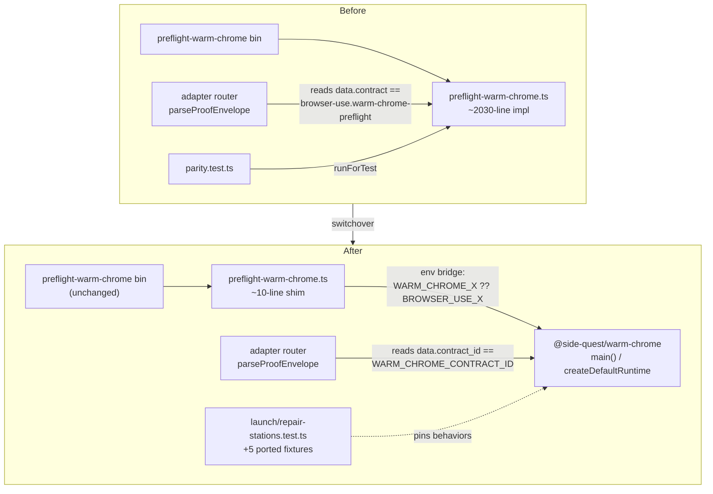

# Browser-use ↔ Warm Chrome Switchover - Plan

## Goal Capsule

- **Objective:** Route `skills/browser-use`'s Warm Chrome preflight through the `@side-quest/warm-chrome` package, delete the legacy `preflight-warm-chrome.ts` implementation and its parity harness, and update the adapter router to consume the package's published proof contract — closing the P1 switchover in `runtime/warm-chrome/TASKS.md`.
- **Authority hierarchy:** The switchover decision log (`docs/decisions/2026-07-04-001-browser-use-warm-chrome-switchover-decision-log.md`) is the source of truth for the eight approach decisions — do not re-open them. `runtime/warm-chrome/AGENTS.md` governs package change recipes and the doc-drift gate. `runtime/warm-chrome/CONTEXT.md` owns package language.
- **Execution profile:** Single PR. The shim, router change, ported station tests, deletions, and doc closure must land together — the parity harness cannot survive a partial state, and the doc-drift gates fail if code and docs split.
- **Stop conditions:** Stop and surface if the U2 coverage gate fails (the 5 ported station tests do not exercise their reasons through the full handler path) — the fallback is a minimal golden test, not blind deletion. Stop if the U6 build unexpectedly trips the dist guard (the decision log predicts it will not; a trip means the Decision-6 premise was wrong).
- **Tail ownership:** Run the Verification Contract gates and the package doc-drift gate before declaring done. Move the P1 task to `TASKS.archive.md` in the same pass.

---

## Product Contract

### Summary

browser-use's front-door preflight (`skills/browser-use/src/preflight-warm-chrome.ts`, ~2030 lines) is currently the authoritative Warm Chrome browser-entry implementation. The `@side-quest/warm-chrome` package reproduces and hardens that behavior (16 stations, measured parity) but is not yet wired in. This plan makes the front-door file a thin delegator to the package's `main()`, deletes the old implementation and the now-redundant parity harness, and points browser-use's adapter router at the package's published `warm-chrome.browser-entry` contract. The cutover makes `rules/browser-access.md` true in practice: browser-use actually gates on the package.

### Problem Frame

The switchover was deferred while the package was built and hardened. Until it lands, `preflight-warm-chrome.ts` stays authoritative and the parity harness measures old-vs-new as migration scaffold. The grill that produced the decision log found that a naive delegation breaks in two non-obvious ways the parity harness never caught — the router gates on a contract id/field the package does not emit, and the env-var namespace differs — because those expectations live in browser-use, outside the parity fixture. The plan encodes the reconciliations for both.

### Requirements

Switchover mechanics:
- R1. browser-use's `preflight-warm-chrome` front door delegates to `@side-quest/warm-chrome`'s `main()`; the bin name, dist entrypoint, and argv contract are unchanged.
- R2. The legacy `preflight-warm-chrome.ts` implementation body is deleted (not retained as a test double).
- R3. The parity harness (`runtime/warm-chrome/tests/parity.test.ts`) is deleted, but only after the behaviors it uniquely covered are pinned elsewhere.

Contract and namespace reconciliation:
- R4. The adapter router gates on the package's `data.contract_id == "warm-chrome.browser-entry"`, importing `WARM_CHROME_CONTRACT_ID` from the package; the legacy `WARM_CHROME_PREFLIGHT_CONTRACT_ID` constant is retired.
- R5. The shim bridges browser-use's `BROWSER_USE_{CDP_PORT,PROFILE_DIR,RUN_ID}` env vars to the package's `WARM_CHROME_*` inputs, with `WARM_CHROME_X ?? BROWSER_USE_X` precedence, so browser-use's public env contract and its run-id correlation chain survive.

Coverage preservation:
- R6. The 5 parity `new`-side behaviors not already pinned by station tests (`readiness_timeout`, `prior_launch_mid_startup`, `foreign_listener_on_port`, `profile_not_owned`, `devtools_active_port_symlink`) are pinned as native station-test fixtures before parity is deleted.

Closure and consistency:
- R7. browser-use owner docs that name `preflight-warm-chrome.ts` as "Warm Chrome runtime" are corrected to note it now delegates to the package.
- R8. Package docs are reconciled: the `CONTEXT.md` "Parity harness" term is retired, the "Browser-use switchover" term status flips deferred → closed, the P1 task moves to `TASKS.archive.md`, and the package doc-drift gate passes.
- R9. browser-use declares `@side-quest/warm-chrome` as a `workspace:*` dependency; the package stays `private:true`.

### Scope Boundaries

**Deferred to Follow-Up Work:**
- Charter-path drift: `runtime/warm-chrome/TASKS.md:6` and `AGENTS.md:63` cite the charter at the package `docs/decisions/`, but it lives at repo-root `docs/decisions/`. Pre-existing; a separate one-line fix.
- Build-guard hardening: the guard checks for a specifier string Bun erases, so it only fires on an un-bundled build. Hardening it to assert warm-chrome proof code is present is out of switchover scope.

**Outside this product's identity:**
- P2 platform guard: the package dropped the old preflight's non-darwin exit-1 refusal. Deferred on the recorded assumption that execution is macOS-only. If Linux/CI is ever added, restore the guard as a package station (exit 20) before relying on it — this plan does not add it.

### Sources

- Decision log (all 8 KTDs): `docs/decisions/2026-07-04-001-browser-use-warm-chrome-switchover-decision-log.md`
- Package charter: `docs/decisions/2026-07-03-warm-chrome-runtime-package-definition.md`
- Router proof consumer: `skills/browser-use/src/browser-adapter-router-prepare.ts` (`parseProofEnvelope`, line ~289)
- Env consumers: `skills/browser-use/src/browser-adapter-router.ts`, `preflight-browser-adapter.ts`, `browser-use.ts`, `browser-use-selection.ts`
- Package entry: `runtime/warm-chrome/src/cli.ts` (`main`, line ~209); contract id: `runtime/warm-chrome/src/model.ts:10`
- Parity table + 14 intended divergences: `runtime/warm-chrome/tests/parity.test.ts`

---

## Planning Contract

### Key Technical Decisions

The eight decisions below are resolved in the decision log; summarized here with the load-bearing reason. Do not re-litigate — cite the log for full rejected-alternative rationale.

- KTD1. **Thin re-export shim, not bin-repoint.** Rewrite `preflight-warm-chrome.ts` to a ~10-line delegator. Smallest consumer blast radius: bin, dist entrypoint, SKILL step 1, and owner-path references keep working. Bin-repoint (rejected) moved dist/bundle/references/contract at once; adapter-level call (rejected) left the standalone CLI on the old impl.
- KTD2. **Router adopts the package contract, not a shim-forged legacy id.** The router reads `data.contract_id` against the package's `WARM_CHROME_CONTRACT_ID`. Ownership direction: the package publishes the canonical contract; the consumer adapts. Shim-forgery and package-emits-both-fields (both rejected) invert ownership.
- KTD3. **Shim bridges the env namespace with `??` precedence.** `WARM_CHROME_X ?? BROWSER_USE_X`, set only when the source is defined. Preserves browser-use's public env contract and run-id correlation (the old preflight already did `applyEnvRunId` from `BROWSER_USE_RUN_ID`). Package-reads-BROWSER_USE and full-rename (both rejected) invert ownership or cascade a family-wide rename.
- KTD4. **Delete parity + old impl; port the 5 gaps to station tests.** After the shim, `runForTest` and `main` are the same path — parity would measure the package against itself. Station behavior is owned by `*-stations.test.ts` (one home per station); a surviving golden file is a second home (drift risk). Convert-to-golden and keep-all-50 (both rejected) duplicate existing coverage.
- KTD5. **Source-run via workspace; package stays private.** Nothing is published (confirmed); browser-use runs from the Bun workspace despite vestigial `publishConfig`. A `workspace:*` dep resolves the import; the package stays `private:true`. Make-package-public (rejected) is a large scope expansion.
- KTD6. **Leave `build-dist.ts` untouched — no guard conflict.** Verified against the built 3 Jul dist: Bun fully inlines the facade and erases the `@side-quest/...` specifier string the guard checks (0 occurrences, symbols present). Bundling the package behaves identically. An earlier plan branch to re-scope the guard was voided by this evidence.
- KTD7. **Defer the platform guard (macOS-only assumption).** Recorded, tripwired. No package change.
- KTD8. **Single-PR closure with the doc-set moving together.** The doc-drift gates fail if code and docs split; the parity harness cannot survive a partial state.

### High-Level Technical Design

The switchover changes what sits behind one unchanged front door, and reconciles two seams (contract id, env namespace) the parity harness could not see.

The critical seams, made explicit:

| Seam | Old (browser-use expects) | New (package emits) | Reconciliation |
|---|---|---|---|
| Proof contract | `data.contract` = `browser-use.warm-chrome-preflight` | `data.contract_id` = `warm-chrome.browser-entry` | Router adopts field + value (U3) |
| Env inputs | `BROWSER_USE_{CDP_PORT,PROFILE_DIR,RUN_ID}` | `WARM_CHROME_*` | Shim bridges with `??` (U4) |
| Exit codes | exit 2 (input) vs exit 20 | exit 20 folds input failures | Invisible to router (binary `status==ok` gate); no consumer branches on it |

### Sequencing

U1 → U2 → U3 → U4 → U5 → U6 → U7. U2 (port gaps) is a hard gate on U5 (delete parity): deletion is conditional on U2's coverage confirmation. U3 (router) and U4 (shim) both depend on U1 (workspace dep) for the import to resolve. U6 (build confirm) depends on U4. U7 (doc closure) is last and depends on U5.

---

## Implementation Units

### U1. Add the workspace dependency

- **Goal:** Make `@side-quest/warm-chrome` resolvable from browser-use so the shim and router can import it.
- **Requirements:** R9
- **Dependencies:** none
- **Files:**
  - `skills/browser-use/package.json` (add `"@side-quest/warm-chrome": "workspace:*"` to `dependencies`)
  - `bun.lock` (regenerated)
- **Approach:** Add the dep, run `bun install` to refresh the lockfile. Package stays `private:true` — do not touch `runtime/warm-chrome/package.json`. browser-use currently declares only `@side-quest/cli-command-facade` as a devDependency; add warm-chrome as a real dependency (the shim needs it at runtime).
- **Patterns to follow:** Existing `workspace:*` declarations in `bun.lock` (e.g. `@side-quest/cli-command-facade`).
- **Test scenarios:** Test expectation: none — dependency wiring; proven by U3/U4 imports resolving under typecheck.
- **Verification:** `bun --filter browser-use-scripts typecheck` resolves the package name once an import exists (added in U3/U4).

### U2. Port the 5 uncovered parity scenarios into station tests

- **Goal:** Pin the 5 `new`-side behaviors parity uniquely covers as native station-test fixtures, so parity can be deleted without losing coverage.
- **Requirements:** R6
- **Dependencies:** none
- **Files:**
  - `runtime/warm-chrome/tests/launch-stations.test.ts` (add `readiness_timeout`, `prior_launch_mid_startup`)
  - `runtime/warm-chrome/tests/repair-stations.test.ts` (add `foreign_listener_on_port`, `profile_not_owned`, `devtools_active_port_symlink`)
- **Approach:** Lift the fixture setups from the corresponding parity rows (`launch_readiness_timeout`, `launch_singleton_lock_held`, `repair_foreign_listener_refused`, `repair_profile_not_owned`, `repair_symlinked_devtools_active_port`) and re-express them in each station test's native idiom, asserting the station code, exit 20, and reason through the full command handler. **Coverage gate:** before this unit is complete, confirm each ported test drives its reason through the real handler/seam path (spawn+readiness for `readiness_timeout`, SingletonLock pre-bind for `prior_launch_mid_startup`, lstat-no-follow for `devtools_active_port_symlink`) — reason-string presence alone is not sufficient. If a scenario cannot be exercised through the handler, stop and flag: the fallback (per decision log) is a minimal golden test, not blind deletion in U5.
- **Patterns to follow:** Existing fixtures in `launch-stations.test.ts` / `repair-stations.test.ts`; the shared runtime-seam construction in `parity.test.ts` (`buildNewRuntime`, `bindSpawned`, singletonLocks/symlinkPaths spec fields) shows the seam inputs each scenario needs.
- **Test scenarios:**
  - `readiness_timeout`: launch spawns Chrome (`spawn: bind_nothing`), the readiness budget elapses without a healthy endpoint → `launch.spawned_unverified`, exit 20, reason `readiness_timeout`; assert spawn count 1.
  - `prior_launch_mid_startup`: port free but SingletonLock held (local pid) → `launch.spawned_unverified`, exit 20, reason `prior_launch_mid_startup`; assert spawn count 0 (pre-bind refusal).
  - `foreign_listener_on_port`: non-Chrome listener on the port under `repair` → `repair.unrepairable`, exit 20, reason `foreign_listener_on_port`; assert no chmod, no write.
  - `profile_not_owned`: profile owned by another uid under `repair` → `repair.unrepairable`, exit 20, reason `profile_not_owned`.
  - `devtools_active_port_symlink`: symlink planted at `DevToolsActivePort` under `repair` → `repair.unrepairable`, exit 20, reason `devtools_active_port_symlink`; assert no write (lstat no-follow guard held).
- **Verification:** `skills/test-runner/src/test-runner.sh run -- runtime/warm-chrome/tests/launch-stations.test.ts runtime/warm-chrome/tests/repair-stations.test.ts` green; each of the 5 reasons asserted through a handler path.

### U3. Point the adapter router at the package contract

- **Goal:** The router accepts the package's proof envelope by reading `data.contract_id` against the package's canonical id.
- **Requirements:** R4
- **Dependencies:** U1
- **Files:**
  - `skills/browser-use/src/browser-adapter-router-prepare.ts` (import `WARM_CHROME_CONTRACT_ID`; change the gate to read `data.contract_id`)
  - `skills/browser-use/src/command-contract.ts` (remove `WARM_CHROME_PREFLIGHT_CONTRACT_ID`)
  - `skills/browser-use/src/browser-adapter-router.test.ts` (fixture at ~line 582: new id + `contract_id` field)
- **Approach:** In `parseProofEnvelope`, replace the `WARM_CHROME_PREFLIGHT_CONTRACT_ID` import with `WARM_CHROME_CONTRACT_ID` from `@side-quest/warm-chrome`, and change `data.contract !== expectedContract` to compare `data.contract_id`. Sweep for other readers before deleting the const: `rg -n 'WARM_CHROME_PREFLIGHT_CONTRACT_ID|data\.contract\b' skills/browser-use/src`. The success gate stays binary (`status == "ok"` + `data.ok === true` + contract match) — do not add exit-code branching; no consumer distinguishes exit 2 from exit 20.
- **Patterns to follow:** Existing import + gate in `browser-adapter-router-prepare.ts`; the package's success envelope shape in `runtime/warm-chrome/src/proof.ts` (`contract_id`, `schema_version`, `ok`, `action: "browser_ready"`).
- **Test scenarios:**
  - Happy path: a package success envelope (`status: ok`, `data.ok: true`, `data.contract_id: "warm-chrome.browser-entry"`, `run_id` present) passes `parseProofEnvelope`.
  - Contract mismatch: an envelope carrying a different `contract_id` is rejected with the contract-mismatch detail.
  - Regression guard: the old `data.contract` field name alone (no `contract_id`) no longer passes — confirms the field switch, not just the value.
- **Verification:** `bun test skills/browser-use/src/browser-adapter-router.test.ts` green; `rg` sweep shows no orphaned readers of the removed const.

### U4. Replace the front door with the delegating shim

- **Goal:** `preflight-warm-chrome.ts` becomes a thin delegator to the package `main()`, with the env bridge, preserving the argv contract and run-id correlation.
- **Requirements:** R1, R5
- **Dependencies:** U1
- **Files:**
  - `skills/browser-use/src/preflight-warm-chrome.ts` (replace the ~2030-line body with the shim)
- **Approach:** Keep the `#!/usr/bin/env bun` shebang. Import `main` and `createDefaultRuntime` from `@side-quest/warm-chrome`. Build a runtime whose `env` maps `WARM_CHROME_CDP_PORT ?? BROWSER_USE_CDP_PORT`, `WARM_CHROME_PROFILE_DIR ?? BROWSER_USE_PROFILE_DIR`, `WARM_CHROME_RUN_ID ?? BROWSER_USE_RUN_ID`, setting each key only when its resolved source is defined (never inject `undefined`). Call `main(process.argv.slice(2), { runtime })` and `process.exit` the result. This unit deletes R2's old implementation body — the parity harness still imports `runForTest` from this file, so U5 must land in the same PR.
- **Execution note:** The old body's deletion and the parity deletion (U5) are coupled — do not run the package test suite between U4 and U5 or `runForTest` will fail to resolve.
- **Patterns to follow:** The package's own `bin` entry (`runtime/warm-chrome/src/cli.ts` tail) for the `main().then(process.exit)` shape; `createDefaultRuntime`'s `env` override parameter (used throughout `parity.test.ts`'s `buildNewRuntime`).
- **Test scenarios:**
  - Happy path (via existing browser-use preflight tests): `preflight-warm-chrome check --json` against a healthy fixture emits the package's ok envelope with `contract_id: "warm-chrome.browser-entry"`.
  - Env bridge — port: `BROWSER_USE_CDP_PORT=9250` with no `WARM_CHROME_CDP_PORT` reaches the package as port 9250 (not the 9222 default).
  - Env bridge — precedence: `WARM_CHROME_CDP_PORT=9260` set alongside `BROWSER_USE_CDP_PORT=9250` uses 9260 (explicit package var wins).
  - Env bridge — run-id: `BROWSER_USE_RUN_ID=abc` surfaces as the proof envelope's `run_id` (correlation chain intact).
  - Undefined safety: neither var set → no `WARM_CHROME_*` key injected as `undefined`; package falls back to its own defaults.
- **Verification:** `bun test skills/browser-use/src` green (preflight path exercises the shim); a manual `bun run preflight-warm-chrome check --json` in `skills/browser-use` returns a package-shaped envelope.

### U5. Delete the parity harness and confirm the package suite

- **Goal:** Remove the migration scaffold now that its unique coverage is ported (U2) and its old side is gone (U4).
- **Requirements:** R3
- **Dependencies:** U2 (coverage gate must have passed), U4 (old impl deleted)
- **Files:**
  - `runtime/warm-chrome/tests/parity.test.ts` (delete)
- **Approach:** `git rm runtime/warm-chrome/tests/parity.test.ts`. Gate: proceed only if U2's coverage confirmation passed for all 5 reasons. If U2 flagged an un-exercisable scenario, do not delete — fall back to a minimal `browser-entry-golden.test.ts` holding only the un-ported rows (decision log fallback), and record the deviation.
- **Test scenarios:** Test expectation: none — deletion. Coverage is proven by U2's ported station tests remaining green.
- **Verification:** `skills/test-runner/src/test-runner.sh run -- runtime/warm-chrome/tests/` green with parity absent and the 5 ported fixtures present; no test imports `runForTest`.

### U6. Confirm the dist build still passes the guard

- **Goal:** Prove empirically that bundling the package does not trip `build-dist.ts`'s workspace-marker guard (KTD6).
- **Requirements:** R1 (bin/dist entrypoint unchanged)
- **Dependencies:** U4
- **Files:**
  - none modified (verification-only unit)
- **Approach:** Run the browser-use build (`bun run src/build-dist.ts` from `skills/browser-use`). Expected: passes — Bun inlines the package + transitive facade and leaves no `@side-quest/...` specifier for the guard. If it throws, stop: the KTD6 premise was wrong and the guard needs the Decision-6-V2 re-scope (out of this plan's default scope — escalate).
- **Test scenarios:** Test expectation: none — build gate. Sanity checks below stand in for assertions.
- **Verification:** Build succeeds; `grep -c '@side-quest' skills/browser-use/dist/preflight-warm-chrome.js` returns 0; a warm-chrome proof symbol (e.g. a station code string) is present in the bundle.

### U7. Reconcile docs and close the task

- **Goal:** Correct browser-use owner docs, retire/flip package terms, move the task, and pass the doc-drift gate.
- **Requirements:** R7, R8
- **Dependencies:** U5
- **Files:**
  - `skills/browser-use/references/warm-chrome.md` (Owners — note delegation to the package)
  - `skills/browser-use/SKILL.md` (Warm Chrome step wording if it implies local implementation)
  - `skills/browser-use/docs/PRODUCT-BASELINE.md` (Warm Chrome runtime ownership line)
  - `runtime/warm-chrome/CONTEXT.md` (retire "Parity harness" term; flip "Browser-use switchover" deferred → closed)
  - `runtime/warm-chrome/TASKS.md` (remove P1; add a Latest Signal)
  - `runtime/warm-chrome/TASKS.archive.md` (archive the P1 rationale)
  - `runtime/warm-chrome/AGENTS.md` (drift anti-pattern / safety-invariant lines that assert the old preflight stays authoritative — reconcile now that it delegates)
- **Approach:** Follow the `AGENTS.md` Doc Drift Gate checklist. The "Parity harness" `CONTEXT.md` term describes a deleted file — remove it. The "Browser-use switchover" term flips status to closed (keep the term; its meaning held). In `AGENTS.md`, the lines "keep the old preflight unmodified until the switchover closes" and the matching safety invariant are now satisfied/closed — update them to reflect the shim, don't leave them asserting authority the file no longer has. Do not fix the pre-existing charter-path drift (deferred).
- **Patterns to follow:** The `AGENTS.md` "Doc Drift Gate" and "Change Recipes → Task closure" sections; existing `TASKS.archive.md` entries for archive wording.
- **Test scenarios:** Test expectation: none — docs. Proven by the doc-drift gate and owner-path check.
- **Verification:** `skills/test-runner/src/test-runner.sh run -- runtime/warm-chrome/tests/docs-drift.test.ts` green; `bun run skills/skill-author/scripts/check-owner-paths.ts --json` for the six package docs passes; `git diff --check -- runtime/warm-chrome` clean.

---

## Verification Contract

| Gate | Command | Applies to |
|---|---|---|
| Package test suite | `skills/test-runner/src/test-runner.sh run -- runtime/warm-chrome/tests/` | U2, U5, U7 |
| Package typecheck | `bun --filter @side-quest/warm-chrome typecheck` | U2, U5 |
| browser-use tests | `bun test skills/browser-use/src` | U3, U4 |
| browser-use typecheck | `bun --filter browser-use-scripts typecheck` | U1, U3, U4 |
| Dist build guard | `bun run src/build-dist.ts` (in `skills/browser-use`) | U6 |
| Doc-drift gate | `skills/test-runner/src/test-runner.sh run -- runtime/warm-chrome/tests/docs-drift.test.ts` | U7 |
| Owner-path check | `bun run skills/skill-author/scripts/check-owner-paths.ts --json <six package docs>` | U7 |
| End-to-end (manual) | `bun run preflight-warm-chrome check --json` in `skills/browser-use`, then confirm the router accepts the proof | Final |

Do not run raw `bun test`, `biome`, or `tsc` via Bash for the Bun-test and quality paths — use the test-runner and MCP runners per repo policy. Exit code 2 from any runner is blocking.

---

## Definition of Done

- Global:
  - All Verification Contract gates green.
  - `preflight-warm-chrome.ts` is a delegating shim; the ~2030-line implementation is gone; no file imports `runForTest`.
  - The router reads `data.contract_id`; `WARM_CHROME_PREFLIGHT_CONTRACT_ID` is removed with no orphaned readers.
  - The 5 ported station tests exercise their reasons through the handler path (U2 gate satisfied), or the recorded golden-test fallback is in place with the deviation noted.
  - The end-to-end manual check shows a package-shaped proof the router accepts.
  - P1 task moved to `TASKS.archive.md`; `CONTEXT.md` terms reconciled; `AGENTS.md` authority lines updated.
  - Abandoned-attempt code removed — no dead scaffold from the cutover left in the diff.
- Per-unit: each unit's Verification bullet is satisfied before the next dependent unit starts, except the U4/U5 coupling (land together; do not run the package suite between them).

---

## Risks & Dependencies

- **U2 coverage gate is the pivotal risk.** If a parity scenario can't be exercised through the real handler, blind deletion (U5) would silently drop coverage for a high-consequence post-mutation station. Mitigation: the gate is explicit, and the fallback (minimal golden test) is pre-decided — do not improvise.
- **Coupled deletion (U4+U5).** Running the package test suite between deleting the old impl and deleting parity fails on the missing `runForTest` import. Mitigation: land both in one commit; the Execution note flags it.
- **KTD6 empirical dependency.** The "no guard conflict" claim rests on Bun's inlining behavior, verified against the prior dist. U6 re-verifies against a build that actually imports the package. If it trips, the guard re-scope is out of default scope and must be escalated, not silently patched.
- **Silent env divergence (mitigated by R5).** Without the bridge, `BROWSER_USE_*` vars would be ignored with no error and run-id correlation would fragment. The shim's `??` bridge is the mitigation; U4's env-bridge test scenarios are the proof.
