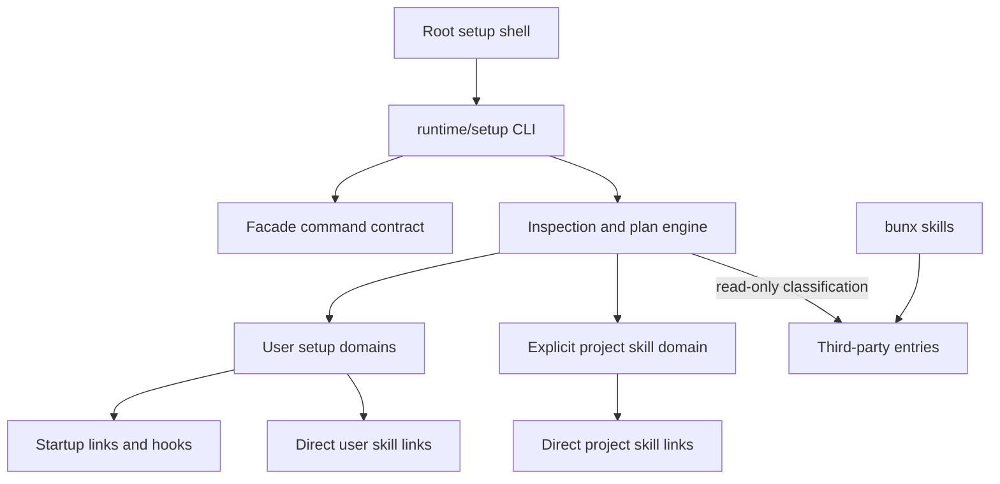
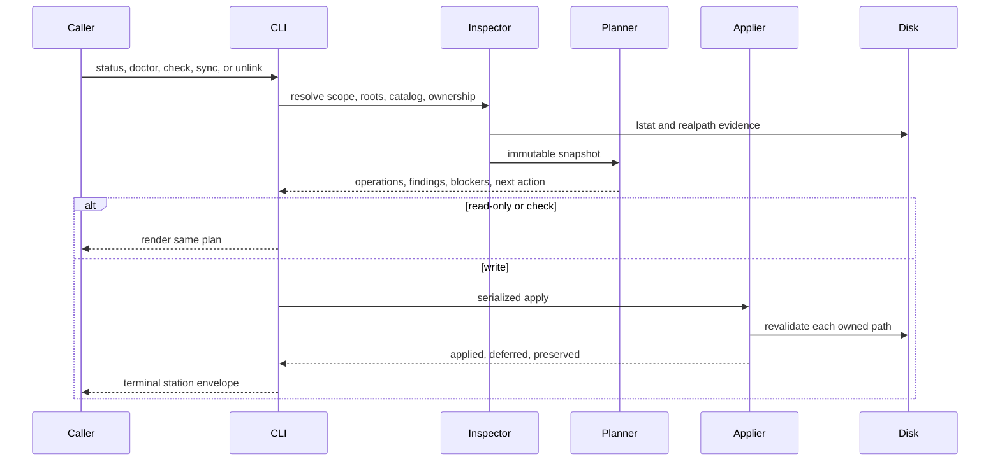
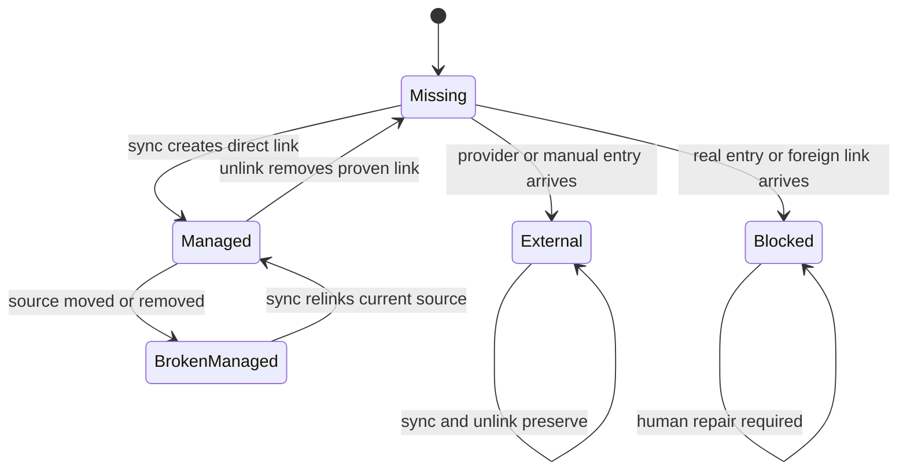
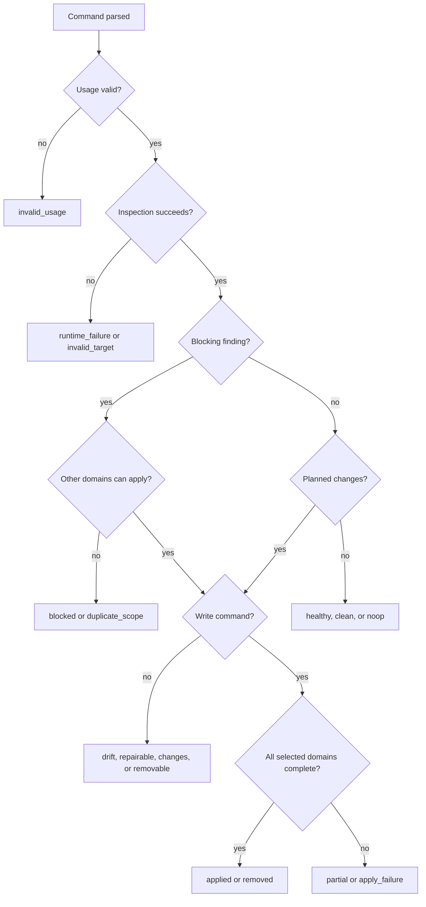

# Agent Setup CLI - Plan

## Goal Capsule

- **Objective:** Replace three overlapping setup mechanisms with one shell-bootstrapped, facade-backed Setup CLI that owns this repo's runtime wiring and live first-party skill projection.
- **Authority:** This plan supersedes the skill-exclusion and deferred-contract decisions in the origin requirements where the later user decisions and current Claude/Codex documentation conflict.
- **Execution profile:** Contract-first migration; characterize retained `agent-skills` behavior before cutting over.
- **Stop conditions:** Stop before overwriting a real directory, foreign symlink, external skill, unsafe projection root, or same-name user/project skill.
- **Tail ownership:** Delete `install.sh` and `runtime/agent-skills/` only after command-surface, station, bootstrap, and parity gates pass.

---

## Product Contract

### Summary

Build one `setup` front door for user runtime wiring and first-party live skill links, plus explicit project-scope projection of a target repo's own skills.
Keep `bunx skills` as the sole third-party acquisition owner.

### Problem Frame

Skill installation currently has three overlapping mechanisms: `install.sh`, `agent-skills`, and `bunx skills`.
Their ownership boundaries drift, their target roots differ, and a contributor cannot tell whether a visible skill is a source link, copied external package, stale projection, or duplicate discovery.

The clean-slate audit removed 480 skill projection symlinks across user and repository scopes.
The replacement must rebuild from that baseline without recreating duplicate discovery or copy-based edit loops.

The origin requirements already selected a single Setup CLI, a Bun-free shell front door, adaptive status, safe repair, git-hook installation, and instruction-health reporting.
Later decisions change two origin boundaries: live first-party skill projection is now Setup-owned, and the CLI is facade-backed with a Branch Station Catalog from its first production version.

### Requirements

#### Command and output contract

- R1. Running `setup` with no command performs the read-only `status` route and shows a bounded dashboard with one next safe action.
- R2. `setup status` reports setup-domain health, projection scope, source catalog, destination roots, counts, blockers, and the next safe action.
- R3. `setup doctor` explains each actionable finding, its ownership, why it matters, and the safe repair or human handoff.
- R4. `setup sync --check` produces a deterministic plan and evidence fingerprint for the current inspection; `setup sync` replans from current evidence before applying.
- R5. `setup sync` applies safe domain plans, reports exact applied, deferred, and preserved paths, and never hides partial completion.
- R6. User unlink previews and removes proven Setup-owned startup and skill links; project unlink handles project skill links only; installed hooks are retained.
- R7. `setup catalog [skill]` lists the selected source catalog and explains visibility, invalidity, collision, and external-occupancy decisions.
- R8. `setup commands --json` exposes machine-readable command discovery from the same facade contract that owns help, flags, exits, side effects, and output modes.
- R9. `--json` emits one result or error envelope on stdout; diagnostics and captured child-process output stay on stderr.
- R10. Human output respects `NO_COLOR`, `TERM=dumb`, and `--no-color`; `--verbose` expands per-path evidence without changing semantics.

#### Scope and projection topology

- R11. User scope is the default and projects this repo's `skills/<id>` directly into `~/.claude/skills/<id>` and `~/.agents/skills/<id>`.
- R12. Project scope requires an explicit target repo and projects only that repo's own `skills/<id>` into its `.claude/skills/<id>` and `.agents/skills/<id>`.
- R13. Setup never projects this personal catalog into project scope; user/project duplication is a blocker rather than a supported layout.
- R14. Claude and Codex receive direct per-skill symlinks to the source catalog; Setup does not copy skill contents or create a Claude-to-Codex symlink chain.
- R15. Skill ids use the existing compatibility-aware canonical fold before collision, ignore, lock, or duplicate-scope comparisons.
- R16. Catalog entries, projection roots, existing parent chains, and link targets are containment-checked before planning and again before mutation.
- R17. Real directories, foreign symlinks, external provider entries, Codex-managed legacy directories, and unknown ownership are preserved.
- R18. Provider evidence is optional attribution only; any unproven same-name destination blocks projection regardless of lock state, and malformed evidence never grants mutation authority.

#### Runtime setup and bootstrap

- R19. User sync retains the origin's startup links, git-hook installation, and instruction-health check while skill projection becomes an additional owned domain.
- R20. The root `setup` file remains a dependency-free shell front door that locates Bun, requests consent before installing Bun, reconciles frozen workspace dependencies, preserves argv, and delegates to TypeScript.
- R21. Missing Bun in a non-interactive run requires explicit `--yes`; dependency reconciliation after Bun exists is automatic.
- R22. Project mode changes only project skill projections; it never installs another repo's startup instructions, hooks, settings, or MCP configuration.
- R23. `bunx skills` remains the owner for third-party list, add, update, restore, and remove operations; Setup supplies collision preflight and post-install diagnosis only.

#### Migration and safety

- R24. Skill projection has preflight atomicity per selected target: any blocker found before apply prevents all projection writes; later syscall or revalidation surprises stop remaining writes and report exact partial evidence.
- R25. Independent setup domains may still apply safe work and return a visible `partial` aggregate when another domain is blocked or fails.
- R26. `sync` and `unlink` use stable user and project mutation locks, revalidate every path immediately before its syscall, and fail closed on concurrent ownership changes.
- R27. The production package uses `@side-quest/cli-command-facade`; hand-built prototype envelopes and duplicated parser/help metadata are removed.
- R28. `install.sh` and `runtime/agent-skills/` are deleted only after retained-feature parity and explicit dropped-feature tests pass.
- R29. Startup instructions, glossary, README, worktree guidance, decision logs, entrypoint tests, and drift checks route contributors to Setup plus `bunx skills`, with no duplicate discovery mechanism.

### Key Flows

- F1. Fresh user setup
  - **Trigger:** A clone has no user runtime links and Bun may be absent.
  - **Steps:** Shell obtains Bun consent if needed, reconciles dependencies, status shows clean slate, sync previews then installs user topology.
  - **Outcome:** Startup links, hooks, instruction health, and direct Claude/Codex skill links are inspectable through one CLI.
- F2. Live skill authoring
  - **Trigger:** A source skill under this repo changes.
  - **Steps:** Claude and Codex follow direct user-scope links to the same source directory.
  - **Outcome:** Edits are visible without copying or reinstalling.
- F3. Explicit project projection
  - **Trigger:** A target repo owns a `skills/` catalog and the operator selects that repo.
  - **Steps:** Setup checks user-scope overlap, previews target-local links, and applies only when no duplicate id or ownership blocker exists.
  - **Outcome:** The target repo's own skills are available at Claude and Codex project scope.
- F4. Third-party acquisition
  - **Trigger:** An operator wants a skill not authored by the selected source catalog.
  - **Steps:** Setup catalog/doctor checks occupancy; `bunx skills` performs acquisition; Setup reclassifies and preserves the result.
  - **Outcome:** Package management and live first-party projection remain separate owners.
- F5. Repair and removal
  - **Trigger:** A link is missing, wrong, broken, source-moved, duplicated, or externally occupied.
  - **Steps:** Doctor explains ownership; check mode previews; sync or unlink revalidates before each mutation.
  - **Outcome:** Managed state is repaired or removed without deleting foreign state.

### Acceptance Examples

- AE1. Given a clean user scope, `setup` reports clean slate and recommends `setup sync --check` without writing.
- AE2. Given approved Bun installation on a fresh machine, the shell installs Bun, reconciles frozen dependencies, preserves arguments, and delegates successfully.
- AE3. Given missing Bun without a TTY or `--yes`, the shell makes no installation attempt and returns an operator-required repair path.
- AE4. Given a healthy user scope, `setup status` reports no work and exits successfully.
- AE5. Given one startup-link conflict and an otherwise safe skill projection, user sync applies the safe projection domain, preserves the conflict, and reports `partial`.
- AE6. Given one skill real-entry blocker, skill sync writes no skill links for that target and reports the blocker with source and destination evidence.
- AE7. Given a changed source `SKILL.md`, both user-scope tools resolve the changed file through their direct links without reinstalling.
- AE8. Given a target project with its own catalog, project sync creates relative target-local links only after the target repo is explicitly selected.
- AE9. Given the same canonical skill id at user and project scope, project check fails before mutation and doctor explains duplicate discovery.
- AE10. Given case, Unicode normalization, sharp-s, or sigma variants of one id, Setup treats them as one collision key.
- AE11. Given a third-party real directory or provider-owned symlink, sync and unlink preserve it byte-for-byte.
- AE12. Given a foreign entry appears after preview, apply-time revalidation stops remaining projection writes, preserves completed writes, and returns exact partial evidence.
- AE13. Given `setup sync --check --json`, stdout contains one valid facade result envelope and no hook or instruction-check prose.
- AE14. Given a link points into a moved or deleted clone that Setup cannot prove as current ownership, doctor preserves it and requires human repair rather than silently transferring ownership.
- AE15. Given successful parity gates, no docs, startup rules, scripts, or integration tests still route to `install.sh` or `agent-skills`.

### Success Criteria

- One documented first-party setup owner.
- Zero copied first-party skills.
- Zero same-id user/project projections created by Setup.
- Zero foreign or third-party entries mutated in adversarial fixtures.
- Every required terminal Branch Station has catalog-driven process evidence.
- Fresh-machine bootstrap works with no preinstalled Bun when consent is supplied.

### Scope Boundaries

#### Included

- User startup topology from the origin requirements.
- User and explicit project live skill projection.
- Collision, containment, duplicate, dependency, hook, and instruction diagnosis.
- Third-party preservation and acquisition guidance.
- Migration from `install.sh` and `agent-skills`.

#### Deferred to Follow-Up Work

- Third-party content-hash verification.
- Non-destructive quarantine or adoption of unknown entries.
- Arbitrary external source catalogs for project projection.
- Provider update orchestration or a wrapper around `bunx skills`.
- Windows-native bootstrap support beyond portable shell-testable semantics.

#### Outside This Product's Identity

- Skill authoring or `SKILL.md` repair.
- Third-party dependency resolution, acquisition, update, or removal.
- Silent deletion of blockers.
- Implicit writes to an unselected repository.
- Project startup-instruction, hook, settings, or MCP installation.

---

## Planning Contract

### Key Technical Decisions

- KTD1. **One permanent shell front door.** Root `setup` remains dependency-free and performs only Bun consent/install, frozen dependency reconciliation, delegation, and exit preservation.
- KTD2. **Facade-backed TypeScript owner.** `runtime/setup` owns command metadata, result vocabulary, parsing, diagnostics, Station Map projection, and runtime envelopes through the existing facade package.
- KTD3. **Direct links into official roots.** User projection targets `~/.claude/skills/<id>` and `~/.agents/skills/<id>`; project projection targets `.claude/skills/<id>` and `.agents/skills/<id>`.
- KTD4. **Catalog follows scope.** User mode sources this repo's `skills/`; project mode sources the explicitly selected target repo's `skills/`; no arbitrary catalog flag enters V1.
- KTD5. **Inspect, plan, apply.** Human output, JSON, check mode, sync, unlink, and doctor consume one inspection/plan model; equal evidence yields equal operations, while every write invocation replans before apply.
- KTD6. **Projection preflight atomicity.** A preflight blocker prevents every skill write for that target; later surprises preserve completed work, stop the domain, and produce `partial` evidence.
- KTD7. **Ownership before convenience.** Setup removes only links whose raw or resolved target proves ownership by the selected source catalog; unknown state is preserved.
- KTD8. **External acquisition stays external.** Provider locks are optional read-only attribution; preservation follows destination ownership evidence, and `bunx skills` remains the only acquisition mutation path.
- KTD9. **Findings are exhaustive; stations are terminal.** Detailed causes live as finding ids under a bounded Branch Station result, preventing combinatorial station growth.
- KTD10. **Bootstrap stations stay outside the TypeScript Station Map.** Pre-Bun outcomes have a separate shell entrypoint contract and process suite because the facade runtime cannot exist before Bun.
- KTD11. **No named design pattern.** The `context/code-style.md` pressure gate supports plain owner modules around shared inspect-plan-apply data; a GoF abstraction adds no compression.
- KTD12. **Setup owns hook planning.** The existing hook installer is migration evidence, not a safe mutation owner; differing unproven hooks are blockers and unlink never removes copied hooks.
- KTD13. **Locks follow mutation authority.** One home-stable lock covers all user domains across clones/worktrees; one canonical-target lock covers each project; external `bunx skills` writes remain protected only by revalidation.

### High-Level Technical Design

#### Ownership topology

#### Inspect-plan-apply lifecycle

#### Projection-entry state model

#### Command outcome routing

### Command Surface

| Command | Purpose | Side effects | Key flags |
|---|---|---|---|
| `setup` / `setup status` | Adaptive read-only dashboard | Read, check | `--scope`, `--repo`, `--json`, `--verbose`, `--no-color` |
| `setup doctor` | Explain findings and repair ownership | Read, check | `--scope`, `--repo`, `--json`, `--verbose`, `--no-color` |
| `setup sync` | Preview or apply selected setup domains | Read, check, write | `--check`, `--scope`, `--repo`, `--json`, `--verbose`, `--no-color` |
| `setup unlink` | Preview or remove proven managed links | Read, check, write | `--check`, `--scope`, `--repo`, `--json`, `--verbose`, `--no-color` |
| `setup catalog [skill]` | Inspect catalog and occupancy decisions | Read | `--scope`, `--repo`, `--json` |
| `setup commands` | Emit command discovery | Read | `--json` |

`--scope user` is the default.
`--scope project` requires `--repo <path>` and never infers a write target from an unrelated current directory.
The shell consumes `--yes` only as Bun-install consent and passes all other arguments unchanged.

### Finding Vocabulary

The runtime owns exact result schemas.
The initial finding families are:

- `missing_link`, `wrong_link`, `broken_managed_link`, `source_missing`
- `real_entry`, `foreign_symlink`, `external_entry`, `legacy_codex_root`
- `invalid_skill`, `catalog_escape`, `canonical_id_collision`, `duplicate_scope`
- `malformed_provider_lock`, `unsafe_root`, `operation_busy`, `stale_operation_lock`
- `dependency_unhealthy`, `hook_unhealthy`, `instruction_unhealthy`, `runbook_artifact_unhealthy`

Invalid source skills block the selected projection catalog.
Provider evidence is searched only in the source/target repo context owned by the selected scope; disagreement or malformed data changes attribution diagnostics, never preservation or mutation authority.

### Branch Station Catalog

The catalog records terminal agent-routing outcomes.
Each station declares expected exit, envelope status, result contract, action affordance, and mutation expectation in code.

| Station id | Trigger | Terminal meaning |
|---|---|---|
| `status.healthy` | All selected domains match desired state | No action required |
| `status.clean_slate` | Selected managed state is absent without blockers | Preview sync next |
| `status.drift` | Repairable changes exist | Sync available |
| `status.blocked` | One or more ownership or containment blockers exist | Doctor or human repair |
| `status.invalid_target` | Project target is missing, not a repo, or lacks an owned catalog | Change input |
| `status.invalid_usage` | Unsupported argv combination | Change input |
| `status.runtime_failure` | Unexpected read or rendering failure | Retry or inspect diagnostics |
| `doctor.healthy` | No findings | No action required |
| `doctor.repairable` | Only Setup-owned drift exists | Sync available |
| `doctor.blocked` | Real, foreign, unsafe, malformed, or unknown ownership exists | Human repair |
| `doctor.duplicate_scope` | A canonical id is visible at user and selected project scope | Remove one scope |
| `doctor.setup_dependency_unhealthy` | Dependency, hook, or instruction checks fail | Repair named domain |
| `doctor.invalid_target` | Project target cannot be resolved safely | Change input |
| `doctor.stale_operation_lock` | A lock exists with no live owner | Inspect then reclaim through Setup |
| `doctor.invalid_usage` | Unsupported argv combination | Change input |
| `doctor.runtime_failure` | Unexpected diagnostic failure | Retry or inspect diagnostics |
| `sync.check_clean` | Preview contains no operations | No write required |
| `sync.check_changes` | Preview contains safe operations | Run sync |
| `sync.check_blocked` | Preview contains a blocked domain | Repair blocker first |
| `sync.check_invalid_target` | Project target cannot be resolved safely | Change input |
| `sync.applied` | Every selected domain applied | Setup healthy |
| `sync.noop` | Revalidated plan contains no work | No action required |
| `sync.partial` | Independent domains applied while another domain was preserved or failed | Repair remaining domain |
| `sync.blocked` | Selected projection domain is blocked and no other domain mutates | Human repair |
| `sync.concurrent_change` | Apply-time ownership differs from preview | Re-run check |
| `sync.operation_busy` | Another Setup mutation owns the scope lock | Retry later |
| `sync.invalid_target` | Project target cannot be resolved safely | Change input |
| `sync.apply_failure` | A filesystem syscall fails after safe revalidation | Inspect diagnostics; retry only if safe |
| `sync.hook_failure` | Hook domain fails before any selected domain mutates | Repair hooks |
| `sync.instruction_failure` | Instruction domain fails while the selected topology already needs no mutation | Repair startup delivery |
| `sync.runbook_failure` | Runbook artifact domain fails before any selected domain mutates | Repair runbook installation |
| `sync.invalid_usage` | Unsupported argv combination | Change input |
| `sync.runtime_failure` | Unexpected runtime failure | Retry or inspect diagnostics |
| `unlink.check_removable` | Proven managed links would be removed | Run unlink |
| `unlink.check_noop` | No proven managed links exist | No action required |
| `unlink.check_blocked` | Unsafe root or ownership evidence prevents a trustworthy preview | Human repair |
| `unlink.check_invalid_target` | Project target cannot be resolved safely | Change input |
| `unlink.removed` | All proven managed links removed | Clean state |
| `unlink.noop` | Revalidation finds nothing removable | No action required |
| `unlink.concurrent_change` | Ownership changes after preview | Re-run check |
| `unlink.operation_busy` | Another Setup mutation owns the scope lock | Retry later |
| `unlink.invalid_target` | Project target cannot be resolved safely | Change input |
| `unlink.partial_failure` | Some proven links remove and another syscall fails | Inspect exact applied/deferred set |
| `unlink.invalid_usage` | Unsupported argv combination | Change input |
| `unlink.runtime_failure` | Unexpected runtime failure | Retry or inspect diagnostics |
| `catalog.listed` | Catalog inventory returns | Inspect or preflight acquisition |
| `catalog.matched` | Named skill resolves with visibility reasoning | Use source or check destination |
| `catalog.blocked` | Named skill resolves to invalid escaped or colliding entries | Repair the catalog |
| `catalog.not_found` | Named skill is absent | Use `bunx skills` discovery |
| `catalog.invalid_target` | Project target cannot be resolved safely | Change input |
| `catalog.invalid_usage` | Unsupported argv combination | Change input |
| `catalog.runtime_failure` | Catalog or occupancy read fails | Repair source or retry |
| `commands.catalog` | Discovery projection succeeds | Agent can select a command |
| `commands.invalid_usage` | Non-JSON or unsupported argv is supplied | Change input |
| `commands.runtime_failure` | Discovery projection fails validation | Repair contract drift |

### Exit and Envelope Semantics

| Command family | Healthy/no-op | Drift or changes | Blocker/partial/failure | Invalid usage |
|---|---|---|---|---|
| `status` | Exit 0, `ok` | Exit 0, `ok` | Exit 0, `ok` inspection | Exit 2, `error` |
| `doctor` | Exit 0, `ok` | Exit 1, `ok` findings | Exit 1, `ok` findings | Exit 2, `error` |
| `sync --check` | Exit 0, `ok` | Exit 1, `ok` plan | Exit 1, `error` | Exit 2, `error` |
| `sync` | Exit 0, `ok` | Exit 0, `ok` applied | Exit 1, `error` | Exit 2, `error` |
| `unlink --check` | Exit 0, `ok` | Exit 1, `ok` plan | Exit 1, `error` | Exit 2, `error` |
| `unlink` | Exit 0, `ok` | Exit 0, `ok` removed | Exit 1, `error` | Exit 2, `error` |
| `catalog` | Exit 0, `ok` | Exit 1 for named miss, `ok` | Exit 1, `error` | Exit 2, `error` |
| `commands` | Exit 0, `ok` | Not applicable | Exit 1, `error` | Exit 2, `error` |

Invalid targets and unexpected runtime failures exit 1 with an `error` envelope for every applicable command.

### Aggregate Result Precedence

Every write result contains domain results with planned, applied, deferred, preserved, and failed sets.

1. Any mutation plus any deferred, blocked, concurrent, or failed domain ends at `sync.partial` or `unlink.partial_failure`.
2. No mutation plus an ownership blocker ends at the command's blocked station.
3. No mutation plus hook, instruction, or runbook failure ends at the named domain-failure station.
4. A busy operation lock is retryable and never reclaimed silently.
5. A stale lock is diagnosed by doctor and reclaimed only through Setup's checked repair path.

Startup delivery repair precedes the full instruction-health check because a clean home cannot pass delivery health before those links exist. If startup repair applies and instruction health then fails, the aggregate is `sync.partial`; `sync.instruction_failure` is the no-write outcome when startup already needs no repair.

### Shell Bootstrap Outcomes

These outcomes are process-tested but excluded from the TypeScript Station Map:

| Outcome | Trigger | Next safe action |
|---|---|---|
| `bootstrap.ready` | Bun exists and frozen dependency reconciliation succeeds | Delegate |
| `bootstrap.bun_consent_required` | Bun missing without TTY or `--yes` | Re-run with consent or install Bun |
| `bootstrap.bun_declined` | Interactive operator declines | Stop unchanged |
| `bootstrap.bun_install_failed` | Official Bun installation fails | Inspect installer diagnostics |
| `bootstrap.dependencies_failed` | Frozen dependency reconciliation fails | Repair lock/network/toolchain |
| `bootstrap.delegated_nonzero` | Delegation succeeds and the TypeScript CLI exits non-zero | Preserve delegated exit and diagnostics |

### `agent-skills` Feature Disposition

| Existing capability | Disposition | Setup replacement |
|---|---|---|
| Status and projection health | Keep | `setup status` and `setup doctor` |
| Check and apply | Keep | `setup sync --check` and `setup sync` |
| Managed-only unlink | Keep | `setup unlink --check` and `setup unlink` |
| Command discovery | Keep | `setup commands --json` |
| Catalog list and visibility reasons | Keep | `setup catalog [skill]` |
| External recognition and preservation | Keep | Read-only provider evidence plus ownership classifier |
| Canonical id folding, containment, revalidation | Keep | Port hardened engine invariants before cutover |
| Ignore editing | Drop | No active `.agent-skills.yml`; archive or source ownership expresses exclusion |
| New-since-snapshot reporting | Drop | No installation decision depends on a projector snapshot |
| Custom projection roots and arbitrary catalogs | Drop | Official user roots and explicit target-repo project roots are the V1 contract |
| External acquisition or restoration | Keep external | `bunx skills` remains owner; Setup emits collision/restore guidance |

### `install.sh` Feature Disposition

| Existing capability | Disposition | Setup replacement |
|---|---|---|
| Thirteen startup links | Keep | User startup-topology domain |
| Hook installation | Keep with stronger safety | Setup-owned inspect/plan/apply; preserve differing foreign hooks |
| Instruction health | Keep | Captured instruction-health domain |
| Issue-to-PR recursive artifact presence | Keep | Doctor finding delegated to the owning runbook/instruction check |
| Status | Keep | `setup status` and `setup doctor` |
| Unlink | Keep with narrower proof | Remove proven startup and skill links; retain copied hooks |
| Whole-folder Claude skill link | Replace | Direct per-skill links |
| Legacy `~/.codex/skills` projection | Replace | Official `~/.agents/skills` user root |

### Dependencies and Sequencing

1. Freeze command, result, finding, station, and feature-disposition contracts.
2. Port read-only inspection and ownership hardening before any new write path.
3. Prove user projection, then explicit project projection, against temp homes/repos.
4. Add serialized apply/unlink and compose startup, hook, and instruction domains.
5. Prove shell bootstrap independently from the TypeScript Station Map.
6. Run parity and surface-alignment gates.
7. Cut over docs and delete old owners in one final unit.

### Risks and Mitigations

- **Provider overwrite hazard:** `bunx skills add` can replace a same-name link. Mitigate with `setup catalog <id>` before acquisition and `setup doctor` after acquisition; Setup cannot make the provider transactional.
- **Ambiguous external ownership:** Missing or malformed provider evidence cannot prove provenance. Preserve the entry and block same-name projection.
- **Moved clone:** A stale raw target cannot prove ownership from a new clone. Preserve it and require human repair; do not infer repo identity from basename or remote URL.
- **Cross-process races:** Per-path checks alone do not serialize sync and unlink. Add an operation lock plus apply-time revalidation.
- **JSON contamination:** Hook and instruction scripts print human prose. Capture their output and translate the result into package-owned findings; never stream child stdout into JSON stdout.
- **Over-broad project writes:** Project projection can modify another repo. Require explicit `--repo`, resolve its git root, show it in preview, and contain every destination under it.
- **Premature deletion:** `agent-skills` contains more hardening than the prototype. Gate deletion on the feature-disposition matrix and adversarial fixture parity.

### System-Wide Impact

- **Agent discovery:** Claude and Codex receive the same source content through different official roots; duplicate ids are blocked before project writes.
- **Startup delivery:** User startup links, instruction health, hooks, and runbook artifacts become Setup domains with independent results and one aggregate station.
- **External package management:** `bunx skills` remains an uncoordinated writer; Setup never claims global serialization against it and relies on apply-time revalidation.
- **Repository boundaries:** User mutations serialize through a home-stable lock across clones; project mutations serialize by canonical target repo.
- **Migration:** Root `setup` stays unadvertised as a write owner until U8 updates routes and removes both legacy writers in the same cutover unit.

### Sources and Research

- `docs/brainstorms/2026-06-18-agent-setup-cli-requirements.md` - origin product requirements.
- `runtime/setup/src/cli.ts` - UX prototype to absorb, not preserve as architecture.
- `runtime/agent-skills/src/projection.ts` and `runtime/agent-skills/src/skills-lock.ts` - hardened ownership and external-classification behavior.
- `docs/decisions/2026-07-02-npx-skills-division-of-labor.md` - acquisition/projection ownership split.
- `docs/decisions/2026-07-03-agent-skills-projection-hardening.md` - canonical folding, containment, lstat tolerance, and apply-time revalidation.
- `runtime/agent-skills/src/command-contract.ts` and `runtime/agent-skills/src/branch-station-catalog.ts` - facade and Station Map migration precedent.
- `skills/cli-author/references/agent-native-cli-design.md` and `skills/cli-author/references/cli-command-facade.md` - command contract and proof path.
- [Claude Code skills documentation](https://code.claude.com/docs/en/skills) - personal/project roots, precedence, and live change detection.
- [Codex skills documentation](https://developers.openai.com/codex/skills/create-skill) - user/project roots, direct symlink support, duplicate-name behavior, and change detection.

---

## Implementation Units

### U1. Freeze package and command contracts

- **Goal:** Convert `runtime/setup` from a prototype into a workspace package with one facade-owned public surface.
- **Requirements:** R1-R10, R27.
- **Dependencies:** None.
- **Files:** `runtime/setup/package.json`, `runtime/setup/tsconfig.json`, `runtime/setup/AGENTS.md`, `runtime/setup/CONTEXT.md`, `runtime/setup/src/model.ts`, `runtime/setup/src/command-contract.ts`, `runtime/setup/src/branch-station-catalog.ts`, `runtime/setup/src/index.ts`, `runtime/setup/tests/command-contract.test.ts`, `runtime/setup/tests/branch-station-catalog.test.ts`, `package.json`, `bun.lock`.
- **Approach:** Define command metadata, aliases, scope grammar, result contracts, finding ids, actions, exits, diagnostics, terminal stations, and feature disposition before implementing mutations. Follow the flat single-CLI package layout.
- **Patterns to follow:** `runtime/agent-skills/package.json`, `runtime/agent-skills/src/command-contract.ts`, `runtime/agent-skills/src/branch-station-catalog.ts`, `runtime/warm-chrome/src/command-contract.ts`.
- **Test scenarios:** Render help from the contract; accept every advertised flag; reject command-foreign flags and invalid scope/repo combinations; validate every station against discovery; prove no-arg aliases status; prove `commands` is JSON-only.
- **Verification:** Package typecheck passes; discovery metadata, rendered help, parser fixtures, and station catalog have zero drift.

### U2. Build read-only source and ownership inspection

- **Goal:** Produce one immutable inspection model for user and explicit project scopes.
- **Requirements:** R11-R18, R22-R23.
- **Dependencies:** U1.
- **Files:** `runtime/setup/src/catalog.ts`, `runtime/setup/src/scope.ts`, `runtime/setup/src/ownership.ts`, `runtime/setup/src/inspection.ts`, `runtime/setup/src/provider-evidence.ts`, `runtime/setup/tests/catalog.test.ts`, `runtime/setup/tests/scope.test.ts`, `runtime/setup/tests/ownership.test.ts`, `runtime/setup/tests/inspection.test.ts`.
- **Approach:** Port canonical folding and hardened realpath/lstat classification. Keep user and project anchors separate. Use provider evidence only for attribution. Detect selected-project ids already visible from user scope. Treat every invalid source skill as a catalog blocker.
- **Patterns to follow:** `runtime/agent-skills/src/catalog.ts`, `runtime/agent-skills/src/projection.ts`, `runtime/agent-skills/src/skills-lock.ts`, `docs/decisions/2026-07-03-agent-skills-projection-hardening.md`.
- **Test scenarios:** Empty catalog; valid skills; missing `SKILL.md`; case/NFKC/sharp-s/sigma collision; catalog symlink escape; unsafe root parent symlink; missing/malformed provider evidence; real directory; foreign symlink; tool-owned link; broken tool-owned link; selected project duplicate with user scope; child vanishes between directory read and lstat.
- **Verification:** Every disk entry receives one ownership classification; no inspection mutates disk; adversarial paths fail closed with stable finding ids.

### U3. Implement planner, status, doctor, and catalog

- **Goal:** Turn inspection evidence into deterministic operations, findings, next actions, and read-only command results.
- **Requirements:** R1-R4, R7, R9-R10, R24-R25.
- **Dependencies:** U2.
- **Files:** `runtime/setup/src/planner.ts`, `runtime/setup/src/doctor.ts`, `runtime/setup/src/renderer.ts`, `runtime/setup/src/cli.ts`, `runtime/setup/tests/planner.test.ts`, `runtime/setup/tests/doctor.test.ts`, `runtime/setup/tests/cli-surface.test.ts`.
- **Approach:** Keep detailed causes below bounded terminal stations. Render human and JSON forms from the same typed plan. Redact projected text and local diagnostics through facade helpers.
- **Patterns to follow:** `runtime/setup/src/cli.ts` for validated UX only, `runtime/agent-skills/src/renderer.ts`, `runtime/cli-command-facade/src/usage.ts`, `runtime/cli-command-facade/src/cli-writer.ts`.
- **Test scenarios:** Healthy, clean-slate, repairable drift, ownership blocker, invalid project target, duplicate scope, dependency/hook/instruction findings, named catalog match, catalog miss, verbose expansion, no-color output, JSON stdout with diagnostics isolated to stderr.
- **Verification:** Status, doctor, and catalog emit their declared station/result contracts with one next safe action and no hand-built envelope literals.

### U4. Implement serialized sync and unlink

- **Goal:** Apply and remove managed topology through one revalidated, ownership-safe engine.
- **Requirements:** R5-R6, R14-R18, R24-R26.
- **Dependencies:** U3.
- **Files:** `runtime/setup/src/operation-lock.ts`, `runtime/setup/src/apply.ts`, `runtime/setup/src/unlink.ts`, `runtime/setup/tests/apply.test.ts`, `runtime/setup/tests/unlink.test.ts`, `runtime/setup/tests/concurrency.test.ts`.
- **Approach:** Serialize through home-stable user and canonical-target project locks; re-read ownership immediately before each syscall; enforce projection preflight atomicity; stop after later surprises; preserve exact applied/deferred/preserved evidence; never delete a real directory or unproven symlink.
- **Patterns to follow:** `runtime/agent-skills/src/projection.ts`, `docs/decisions/2026-07-03-agent-skills-projection-hardening.md`.
- **Test scenarios:** Check/apply equivalence; direct absolute user links; deterministic relative project links; no-op; broken managed relink; source move; real or foreign entry arrives after preview; stale operation lock; concurrent sync/unlink; partial syscall failure; third-party entries survive sync and unlink byte-for-byte.
- **Verification:** Every mutation station has deterministic evidence; blocked projection fixtures perform zero projection writes; post-apply disk state matches the returned applied/deferred sets.

### U5. Compose startup links, hooks, and instruction health

- **Goal:** Preserve the non-skill behavior of `install.sh`, including runbook artifact health, without duplicating ownership or contaminating machine output.
- **Requirements:** R19, R22, R25, R29.
- **Dependencies:** U4.
- **Files:** `runtime/setup/src/startup-topology.ts`, `runtime/setup/src/hook-topology.ts`, `runtime/setup/src/instruction-health.ts`, `runtime/setup/src/runbook-health.ts`, `runtime/setup/tests/startup-topology.test.ts`, `runtime/setup/tests/hook-topology.test.ts`, `runtime/setup/tests/setup-domains.integration.test.ts`, `scripts/install-git-hooks.sh` (delete after parity), `scripts/agent-instructions.sh`.
- **Approach:** Model startup links, hooks, instruction health, and runbook artifacts as independent domains. Setup owns hook inspection and revalidation; equal hooks are healthy and differing unproven hooks block replacement. Capture child output. Remove the obsolete skill-deploy drift check.
- **Patterns to follow:** `install.sh`, `scripts/install-git-hooks.sh`, `scripts/agent-instructions.sh`.
- **Test scenarios:** All origin startup links missing; wrong/broken links; real-file conflict; safe startup repair alongside blocked projection; missing/equal/foreign/concurrently-replaced hook; successful hook/instruction/runbook checks; each child failure; child stdout under JSON mode; user unlink retains hooks; project mode skips these domains.
- **Verification:** Origin startup topology remains covered; aggregate `partial` accurately names completed and failed domains; JSON stdout remains one envelope.

### U6. Build the permanent shell bootstrap

- **Goal:** Make `./setup` work from a fresh clone without preinstalled Bun or dependencies.
- **Requirements:** R20-R21.
- **Dependencies:** U1, U5.
- **Files:** `setup`, `runtime/setup/tests/bootstrap.integration.test.ts`, `README.md`.
- **Approach:** Keep shell limited to repo discovery, Bun detection/consent/install, frozen dependency reconciliation, argv preservation, and delegation. Always preserve the delegated exit code. Do not claim shell outcomes in the TypeScript Station Map.
- **Execution note:** Prefer process-level smoke fixtures over shell unit abstractions.
- **Test scenarios:** Bun present; Bun absent with interactive accept; decline; non-interactive without consent; `--yes`; installer failure; dependency failure; paths with spaces; argv preservation; signal/delegated non-zero preservation.
- **Verification:** Bootstrap outcome suite passes without relying on ambient Bun paths; successful bootstrap reaches `setup commands --json`.

### U7. Prove command and Branch Station alignment

- **Goal:** Provide unit, catalog, and real-process evidence for every declared TypeScript station.
- **Requirements:** R1-R10, R24-R28.
- **Dependencies:** U3-U6.
- **Files:** `runtime/setup/tests/branch-station-catalog.test.ts`, `runtime/setup/tests/setup.integration.test.ts`, `scripts/command-entrypoint.integration.test.ts`, `scripts/check-workspace-facade-invariants.ts`.
- **Approach:** Use an exhaustive station-scenario map and shared facade test helpers. Drive temporary homes and repositories through real Bun processes. Mark no filesystem station skipped unless the platform cannot reproduce it, with a concrete rationale.
- **Patterns to follow:** `skills/cli-author/references/cli-command-facade.md`, `skills/use-storybook/tests/storybook-doctor.integration.test.ts`, `runtime/agent-skills/tests/entrypoint.integration.test.ts`.
- **Test scenarios:** One process fixture per required station; help/argv/output drift; exit and envelope contract; stdout/stderr separation; station evidence projection; user/project scope parity; foreign preservation; concurrent change; unexpected failure wrapping.
- **Verification:** Command Surface Alignment Proof passes across discovery, help, parser, and runtime semantics; Station Map reports every required station covered or justified.

### U8. Cut over owners and retire legacy installers

- **Goal:** Leave one first-party setup owner and one third-party acquisition owner.
- **Requirements:** R23, R28-R29.
- **Dependencies:** U7.
- **Files:** `install.sh` (delete), `runtime/agent-skills/` (delete), `AGENTS.md`, `README.md`, `CONTEXT.md`, `skills/prompt-system-workflow/CONTEXT.md`, `docs/git/worktree.md`, `docs/adr/0011-repo-owned-global-agent-surface.md`, `docs/decisions/2026-07-02-npx-skills-division-of-labor.md`, `docs/decisions/2026-07-03-agent-skills-projection-hardening.md`, `.gitignore`, `package.json`, `bun.lock`.
- **Approach:** Run both feature-disposition matrices before deletion. Keep root `setup` unadvertised as a write owner until this cutover. Update accepted decisions with supersession notes rather than erasing history. Remove stale routes, package references, and config ignores in the same unit. Include the retired hook installer in the repo-wide legacy-route search.
- **Test scenarios:** Repo-wide search finds no executable/documented route to legacy owners; fresh bootstrap from the clean baseline; user check/apply/unlink cycle; explicit project check/apply/unlink cycle; third-party acquisition guidance points only to `bunx skills`.
- **Verification:** Workspace checks and instruction-delivery checks pass; setup docs describe one mental model; deleted owners have no remaining imports, bins, tests, or runtime references.

---

## Verification Contract

| Gate | Applies to | Done signal |
|---|---|---|
| `bun --filter @side-quest/setup test` | U1-U7 | Package unit and process suites pass |
| `bun --filter @side-quest/setup typecheck` | U1-U7 | Setup package typechecks |
| `bun run command-entrypoint:integration` | U6-U8 | Root shell and workspace entrypoint resolve correctly |
| `bun run check:workspace-facade` | U1, U7-U8 | Facade package, discovery, and workspace invariants pass |
| `bun run biome:check` | All changed TypeScript and JSON | No lint or format errors |
| `scripts/agent-instructions.sh check` | U5, U8 | Startup instruction owner checks pass without skill projection recursion |
| Branch Station evidence projection | U7 | Every required TypeScript station is covered or explicitly justified |
| Bootstrap outcome suite | U6 | Every pre-Bun outcome preserves consent, argv, diagnostics, and exit semantics |
| Feature-disposition parity matrix | U8 | Every existing capability is kept with evidence or intentionally dropped with a test/doc decision |
| Clean-baseline smoke | U8 | Fresh user and project fixtures reach healthy, then return to clean state through managed unlink |

---

## Definition of Done

- `./setup` works without preinstalled Bun when installation consent is provided.
- User sync creates direct per-skill links in both official user roots and no copied first-party skills.
- Project sync requires an explicit repo and links only that repo's own source catalog.
- Same-id user/project discovery is blocked before mutation.
- Third-party and foreign entries survive sync and unlink unchanged.
- Status, doctor, check, sync, unlink, catalog, and commands satisfy their facade contracts.
- Every required terminal station has real process evidence.
- Startup links, hooks, and instruction health retain origin behavior with explicit partial results.
- `install.sh` and `runtime/agent-skills/` are deleted after parity passes.
- Startup instructions and docs name Setup for first-party projection and `bunx skills` for third-party acquisition.
- No abandoned prototype, compatibility branch, dead snapshot/config path, or duplicate installer remains in the diff.
