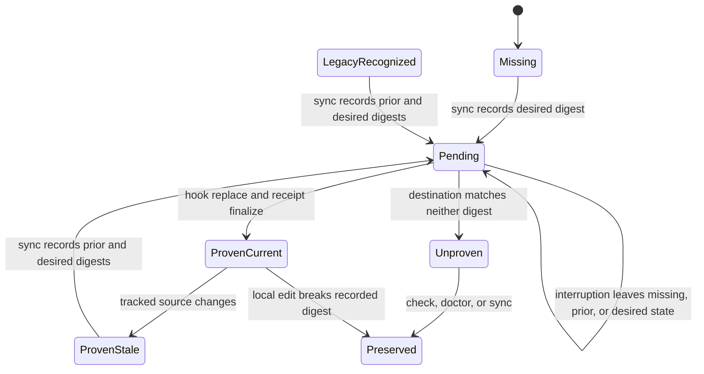

# Repair Pre-Commit Hook Ownership

## Goal Capsule

- **Objective:** Keep commit-time instruction-health protection while making staged relevance exact and copied hook updates safely recoverable.
- **Authority:** The accepted full-repair scope in this planning session refines the hook boundary from the Agent Setup CLI plan and ADR 0011.
- **Execution profile:** Characterize both pre-provenance hook payloads first, then add provenance, staged mode, cutover, and system proof.
- **Stop conditions:** Preserve any edited, foreign, linked, malformed, destination-mismatched, or otherwise unproven hook state.
- **Tail ownership:** Leave `setup unlink` retention, the exit-137 policy, and project-scope isolation intact.

---

## Product Contract

### Summary

Retain the pre-commit instruction-health guard, move staged-change relevance into the health owner, and let Setup reconcile only copied hooks whose ownership is proven by current bytes, two pinned migration payloads, or a valid provenance receipt.

### Problem Frame

The pre-commit hook and `scripts/agent-instructions.sh` currently own separate path inventories.
The hook scans broad trees such as `skills/`, `context/`, and `docs/adr/`, even though the health script checks only specific startup inputs and registered owner paths.
This duplication creates false-positive commit checks and lets the two contracts drift.

Setup currently proves a copied hook only when destination bytes equal the current source.
Any source hook change makes an earlier Setup-installed copy appear foreign, so Setup preserves it and reports `repair_hooks` without a safe automatic repair path.
The installed pre-cutover hook already demonstrates this failure: its bytes differ from the tracked source by an installer comment only.

### Requirements

#### Commit-boundary health

- R1. Retain the pre-commit instruction-health guard as the commit-boundary complement to Setup health checks.
- R2. Make `scripts/agent-instructions.sh` the sole owner of staged relevance and the registered instruction-owner path inventory.
- R3. Add staged-aware `check` behavior that reads the Git index NUL-safely and recognizes additions, modifications, deletions, type changes, and both sides of renames.
- R4. Run full health checks only when staged paths affect `AGENTS.md`, `CLAUDE.md`, `agent-instructions.config`, the health script, instruction appendices, or an exact registered owner path.
- R5. Preserve unconditional `check`, `status`, plain output, JSON output, and existing exit meanings for non-staged callers.
- R6. Emit inspectable staged decision evidence in JSON and reject invalid flag combinations through rendered help and parser semantics.
- R7. Reduce `scripts/hooks/pre-commit` to delegation, log capture, exit handling, and recovery guidance.
- R8. Preserve the current fail-open behavior only for the waited health child exit `137`; block every other non-zero result.

#### Hook provenance and reconciliation

- R9. Store a versioned receipt per canonical hook destination under Setup's existing state root.
- R10. Bind each receipt to hook identity, canonical destination, installed digest, source digest, schema version, and any pending transition evidence.
- R11. Bootstrap provenance only from the frozen pre-change Setup-v1 payload and the exact installed pre-Setup-cutover payload.
- R12. Reconcile future source changes only when destination bytes equal current source, match recognized migration evidence, or match valid recorded ownership.
- R13. Keep `status`, `doctor`, and `sync --check` read-only, including when a receipt is missing or migration is available.
- R14. Revalidate source bytes, destination shape and bytes, and receipt evidence immediately before every hook or receipt mutation.
- R15. Use recoverable pending evidence and atomic same-directory replacement so interruption leaves a classifiable next state.
- R16. Preserve edited files, foreign files, symlinks, directories, malformed receipts, relocated receipts, unknown digests, and concurrently changed state.
- R17. Keep copied hooks and their provenance during `setup unlink`.
- R18. Keep project scope isolated from user hook and receipt inspection.

#### Diagnosis and ownership

- R19. Distinguish Setup-repairable hook drift from unproven hook ownership without adding a new terminal Branch Station.
- R20. Return exact planned, applied, deferred, preserved, and failed hook-domain paths through existing Setup result shapes.
- R21. Give unproven hooks a human repair path and proven drift a safe `setup sync` continuation.
- R22. Keep receipt schemas, migration digests, classification rules, and staged-path mechanics in code and tests; keep docs at the ownership and consequence level.

### Acceptance Examples

- AE1. Given only an unrelated staged skill, context, rule, or ADR path, when the hook runs, then staged health reports not applicable and the commit is not blocked by unrelated delivery drift.
- AE2. Given an exact registered owner path is added, modified, deleted, type-changed, or renamed, when staged health runs, then it executes the full instruction-health check.
- AE3. Given a relevant staged filename contains whitespace or shell metacharacters, when staged health reads the index, then it matches the complete path without word splitting or glob expansion.
- AE4. Given a fresh hook destination, when user sync applies, then Setup installs the copied hook and records provenance under the existing user lock.
- AE5. Given either pinned pre-provenance hook payload, when user sync applies, then Setup reconciles it to current source bytes and records current provenance.
- AE6. Given a receipt-proven copied hook and changed tracked source, when sync applies, then Setup revalidates the recorded installed digest and reconciles the copy.
- AE7. Given a receipt-proven hook was edited locally, when check or sync runs, then Setup preserves it and reports unproven ownership with a human repair continuation.
- AE8. Given interruption before or after hook replacement, when the next sync inspects pending evidence, then it resumes, finalizes, or preserves according to the destination digest without guessing.
- AE9. Given `setup status`, `setup doctor`, or `setup sync --check`, when provenance is absent or stale, then no receipt directory, receipt, or hook byte is written.
- AE10. Given `setup unlink`, when hook provenance exists, then startup and skill links may be removed while the copied hook and receipt remain.

### Success Criteria

- One staged relevance inventory owned by `scripts/agent-instructions.sh`.
- Zero broad `skills/`, `context/`, `rules/`, or `docs/adr/` triggers in the pre-commit adapter.
- Automatic reconciliation for exactly the two pre-provenance payloads and all future receipt-proven copies.
- Zero mutation of one-byte variants, edited copies, foreign hooks, links, non-files, malformed state, or concurrently changed evidence.
- Read-only Setup routes produce zero filesystem writes.
- Existing Setup station catalog and result envelope remain bounded and aligned.

### Scope Boundaries

#### Included

- Staged-aware instruction-health checking.
- Thin pre-commit delegation.
- Versioned hook provenance and crash recovery.
- One-time migration for the two observed legitimate payloads.
- Setup status, doctor, check, sync, unlink, and process-level proof.
- Ownership vocabulary and operator guidance.

#### Deferred to Follow-Up Work

- Receipt inventory, pruning, or an explicit adoption command.
- Reassessment of the exit-137 fail-open policy.
- Recovery tooling after deliberate Setup state deletion.
- Provenance for hook types added after this change.

#### Outside This Product's Identity

- Removing the pre-commit guard.
- Symlinked hooks or a `core.hooksPath` redesign.
- Broad historical digest allowlists.
- Skill catalog archive filtering or other unrelated Setup refactors.
- Hook removal during `setup unlink`.

---

## Planning Contract

### Key Technical Decisions

| ID | Decision | Rationale |
|---|---|---|
| KTD1 | Keep the health script as contract owner and the hook as runtime adapter. | One path inventory drives direct calls, JSON consumers, and commit behavior. |
| KTD2 | Freeze two migration fixtures before editing the hook source. | The tracked Setup payload hashes to `462ff0f88ce44e72474d8aea4a0bbf567962d1604d6b43b955e949d59652eede`; the installed pre-cutover payload hashes to `c58eb459e043374bf66e5da2a65fe4f9e4d8ce3aca1daeb9127087e296fe517f`. |
| KTD3 | Add one plain `hook-provenance` module. | Receipt parsing, validation, hashing, and atomic writes serve inspection and apply; no second adapter earns a named pattern. |
| KTD4 | Key receipts by the canonical existing hook directory plus hook basename. | This binds ownership before a missing destination exists and avoids identity changes through a linked parent. |
| KTD5 | Use a pending transition containing prior state as `missing` or a digest, plus the desired digest. | Fresh install has no prior digest; a discriminated prior state keeps crash recovery and apply-time revalidation honest. |
| KTD6 | Treat reconciliation as selected-source sync, not monotonic version upgrade. | A serialized sync may move a proven copy to the source tracked by the invoking worktree, including an intentional downgrade. |
| KTD7 | Keep read-only routes mutation-free. | Missing receipts and available migration appear as plans; only `setup sync` creates or updates provenance. |
| KTD8 | Add `hook_ownership_unproven` as finding detail, not a terminal station. | Existing blocked and partial stations already express the outcome; a distinct finding preserves the human repair boundary. |
| KTD9 | Share one exact owner-path array inside the health script. | The existence check and staged matcher cannot drift when both consume the same inventory. |
| KTD10 | Preserve the exit-137 behavior unchanged. | This plan fixes ownership and relevance; timeout trust policy remains an explicit follow-up. |
| KTD11 | Resolve pending ownership before reconciling toward the selected source. | Another worktree may inspect interrupted desired bytes; recovery establishes stable ownership before current source policy runs. |
| KTD12 | Treat recorded source digest as audit and transition evidence only. | Destination identity plus installed digest proves ownership; every invoking source is hashed and revalidated independently. |

### High-Level Technical Design

#### Commit-time decision flow

```mermaid
flowchart TB
  Git["Git invokes installed pre-commit"] --> Hook["Thin pre-commit adapter"]
  Hook --> Staged["Instruction health check with staged marker"]
  Staged --> Index["NUL-safe Git index paths"]
  Index --> Relevant{"Exact health input matched?"}
  Relevant -->|No| Skip["Report not applicable, exit 0"]
  Relevant -->|Yes| Health["Run full instruction health"]
  Health --> Result{"Health exit"]
  Result -->|0| Allow["Allow commit"]
  Result -->|137| Warn["Warn and allow under retained policy"]
  Result -->|Other non-zero| Block["Block with repair guidance"]
```

#### Copied-hook ownership lifecycle



### Sequencing

1. Freeze both pre-provenance payloads before changing `scripts/hooks/pre-commit`.
2. Land receipt ownership and Setup reconciliation while the source hook remains unchanged.
3. Land staged-aware health behavior and its command alignment proof.
4. Cut the pre-commit adapter over only after Setup can reconcile both older legitimate copies.
5. Close with process proof, owner docs, and startup delivery checks.

### System-Wide Impact

- **Humans and agents:** Both use the same Git index, health engine, Setup state, and repair evidence.
- **Worktrees:** The user lock serializes reconciliation, but the last successful sync selects the source bytes for a shared canonical hook destination.
- **State loss:** Current or pinned migration bytes can rebuild provenance; older receipt-only versions become unproven and remain preserved.
- **Setup JSON:** Existing result envelopes and terminal stations remain stable; finding detail becomes more precise.
- **Git commits:** Irrelevant staged changes stop triggering instruction delivery health, while exact health inputs retain the guard.

### Risks and Mitigations

| Risk | Mitigation |
|---|---|
| Hook source edited before migration evidence is frozen | Capture byte-exact fixtures and pin both digests in U1 before any hook edit. |
| Receipt authorizes another repository's hook | Bind schema and receipt key to the canonical destination and hook identity. |
| Crash leaves receipt and hook out of sync | Persist prior and desired digests, then classify only those two recoverable states. |
| External edit races apply | Revalidate source, destination, and receipt immediately before each atomic mutation; stop remaining operations on mismatch. |
| State deletion causes unsafe adoption | Fall back to equal-current or pinned migration evidence only; preserve every other differing copy. |
| Worktree sync reverses hook content | Document selected-source reconciliation and serialize through the existing user lock. |
| New staged mode drifts from help or JSON | Prove help, parser acceptance, machine output, and runtime semantics in one test surface. |
| New finding expands station vocabulary | Reuse existing blocked, partial, doctor, and sync stations; test the station catalog unchanged. |

---

## Implementation Units

### U1. Define hook provenance and freeze migration evidence

- **Goal:** Add the state contract that can prove copied-hook ownership before the source hook changes.
- **Requirements:** R9-R12, R15-R16, R22; AE4-AE8.
- **Dependencies:** None.
- **Files:** `runtime/setup/src/hook-provenance.ts`, `runtime/setup/tests/hook-provenance.test.ts`, `runtime/setup/tests/fixtures/pre-commit-setup-v1`, `runtime/setup/tests/fixtures/pre-commit-legacy-installer`.
- **Approach:** Add a versioned receipt reader and atomic writer under a hook-specific state namespace keyed by canonical existing hook directory plus basename.
- **Approach:** Represent stable and pending evidence explicitly; validate schema, destination, hook identity, digest syntax, and restrictive state writes before granting ownership.
- **Approach:** Represent pending prior state as missing or a digest; keep recorded source digest as audit evidence rather than mutation authority.
- **Approach:** Bind the two frozen payloads only to `pre-commit`; future tracked source versions rely on receipts rather than a growing legacy allowlist.
- **Execution note:** Capture and hash both fixtures before touching `scripts/hooks/pre-commit`.
- **Patterns to follow:** `runtime/setup/src/operation-lock.ts` for state-root ownership and atomic evidence posture; `runtime/setup/src/path-safety.ts` for containment and canonical identity.
- **Test scenarios:**
  1. A canonical existing hook directory plus basename produces one stable receipt path before and after a missing destination is created.
  2. A valid stable receipt round-trips without creating state during read-only inspection.
  3. Malformed JSON, wrong schema, wrong destination, wrong hook identity, invalid digests, and linked receipt paths grant no ownership.
  4. A pending receipt accepts only missing prior state, its recorded prior digest, or its recorded desired digest as applicable.
  5. Atomic write failure leaves either the prior complete receipt or one complete pending receipt, never truncated JSON.
  6. The Setup-v1 fixture and legacy-installer fixture hash to the two pinned migration digests; one-byte variants do not match.
- **Verification:** Receipt evidence is deterministic, destination-bound, read-only when inspected, and recoverable across interrupted writes.

### U2. Reconcile only proven copied hooks through Setup

- **Goal:** Extend hook inspection and apply so Setup can install, backfill, reconcile, diagnose, and preserve from immutable provenance evidence.
- **Requirements:** R11-R21; AE4-AE10.
- **Dependencies:** U1.
- **Files:** `runtime/setup/src/hook-topology.ts`, `runtime/setup/src/setup-domains.ts`, `runtime/setup/src/model.ts`, `runtime/setup/src/doctor.ts`, `runtime/setup/tests/hook-topology.test.ts`, `runtime/setup/tests/setup-domains.integration.test.ts`, `runtime/setup/tests/doctor.test.ts`, `runtime/setup/tests/concurrency.test.ts`.
- **Approach:** Carry operation kind, inspected source digest, expected destination shape and digest, and expected receipt evidence from inspection into apply.
- **Approach:** Plan installs for missing destinations, receipt backfill for equal-current bytes, migration for either pinned payload, mode repair for proven non-executable files, and reconciliation for receipt-proven stale bytes.
- **Approach:** Add `hook_ownership_unproven` for destination evidence that Setup cannot mutate; route it to existing blocked or partial stations and human repair.
- **Approach:** Thread `stateRoot` through user check and apply composition; keep project scope free of user hook and receipt probes.
- **Approach:** Under the existing user lock, write pending evidence, revalidate, atomically replace the hook, repair executable mode, and finalize the receipt.
- **Approach:** Resolve pending prior or desired state to stable ownership before comparing the destination with the invoking worktree's selected source.
- **Patterns to follow:** `runtime/setup/src/startup-topology.ts` for inspect-plan-apply evidence; `runtime/setup/src/apply.ts` for stop-after-failure and exact domain results; `runtime/setup/src/doctor.ts` for bounded finding-to-action routing.
- **Test scenarios:**
  1. Missing destination plans and applies a copied executable hook plus stable provenance.
  2. Equal-current destination plans receipt backfill without rewriting hook bytes.
  3. Each pinned pre-provenance payload plans reconciliation and records the new installed digest.
  4. A receipt-proven stale copy reconciles; a locally edited receipt-proven copy is preserved as unproven.
  5. Foreign regular files, symlinks, directories, malformed receipts, wrong-destination receipts, unknown digests, and one-byte migration variants remain unchanged.
  6. A source, destination, or receipt change after inspection stops the current operation and defers later hook writes.
  7. Interruption before replacement resumes from missing or prior bytes; interruption after replacement finalizes from desired bytes; any third digest remains preserved.
  8. A second worktree first resolves another worktree's interrupted desired bytes, then independently reconciles toward its selected source.
  9. Receipt write or hook replace failure returns exact partial evidence and remains safely recoverable on the next sync.
  10. Read-only user routes report planned receipt or hook work without filesystem mutation.
  11. Project routes perform zero user hook or provenance reads; unlink retains both copied hook and receipt.
- **Verification:** Setup proves ownership before every hook mutation, preserves unknown state, and reuses existing result and station contracts.

### U3. Add staged-aware instruction-health checking

- **Goal:** Make the health script own exact staged relevance and expose one aligned human and machine contract.
- **Requirements:** R2-R6, R22; AE1-AE3.
- **Dependencies:** None.
- **Files:** `scripts/agent-instructions.sh`, `scripts/agent-instructions.test.ts`.
- **Approach:** Add `check --staged`; keep `check` unconditional and reject `--staged` on `status` as invalid usage.
- **Approach:** Define one registered owner-path array used by both owner existence checks and staged matching.
- **Approach:** Read index paths NUL-safely with rename detection disabled so removed and added sides remain inspectable.
- **Approach:** Treat only startup sources, config, script, appendices, and exact registered owners as relevant; remove broad tree assumptions from the staged contract.
- **Approach:** Preserve the existing health report shape while adding machine-visible staged decision and matched-path evidence; a valid staged check that cannot inspect Git fails closed as runtime health failure.
- **Patterns to follow:** Current `scripts/agent-instructions.sh` command parser, report aggregation, JSON escaping, help, and exit vocabulary; `skills/cli-author/references/agent-native-cli-design.md` for alignment proof.
- **Test scenarios:**
  1. No staged changes and unrelated-only staged changes return success without full health checks.
  2. Every exact health input triggers full checks for add, modify, delete, type change, and rename-away or rename-into cases.
  3. Broad sibling paths under `skills/`, `context/`, `rules/`, and `docs/adr/` do not trigger unless they are exact registered owners.
  4. Appendix paths and irrelevant paths containing spaces, tabs, newlines, glob characters, and leading dashes remain whole and deterministic.
  5. `check --staged --json` reports the staged decision and matched paths without corrupting the existing health arrays.
  6. Unconditional `check` still runs with an empty index; `status --staged` returns usage exit `2`; staged Git inspection failure returns exit `1`.
  7. Help text, parser acceptance, output modes, and exit semantics describe and enforce the same surface.
- **Verification:** One script-owned inventory determines staged applicability across help, parser, plain output, JSON, and runtime behavior.

### U4. Cut over the thin pre-commit adapter and prove the migration

- **Goal:** Remove duplicate path scanning from the hook after Setup can safely reconcile every legitimate installed predecessor.
- **Requirements:** R1, R7-R8, R11-R18, R20; AE1, AE4-AE10.
- **Dependencies:** U2, U3.
- **Files:** `scripts/hooks/pre-commit`, `scripts/hooks/pre-commit.test.ts`, `runtime/setup/tests/setup-process-fixture.ts`, `runtime/setup/tests/setup.integration.test.ts`, `runtime/setup/tests/cutover.test.ts`.
- **Approach:** Delegate once with `AGENT_INSTRUCTIONS_CHECK_STAGED=1 scripts/agent-instructions.sh check`; retain the plain `check` argv for older linked worktrees, Bash invocation, log capture, normal blocking behavior, the visible exit-137 warning, and direct retry guidance.
- **Approach:** Remove `PROMPT_SYSTEM_PATHS`, staged word splitting, and every relevance decision from the adapter.
- **Approach:** Add production-boundary Setup coverage that starts from each pinned installed payload, previews without writing, applies reconciliation, and returns healthy on the next status.
- **Patterns to follow:** Existing pre-commit child wait and log handling; `runtime/setup/tests/setup.integration.test.ts` for real command entrypoint evidence.
- **Test scenarios:**
  1. The hook invokes staged health exactly once and permits exit `0`.
  2. Health exit `1`, missing helper exit `127`, exit `143`, and ordinary non-zero exits block with one repair message.
  3. Exit `137` alone emits the retained warning and allows the commit.
  4. Hook source contains no staged relevance inventory or broad path globs.
  5. `setup sync --check` reports each pinned predecessor without modifying hook or receipt state.
  6. `setup sync` reconciles each pinned predecessor; follow-up `setup status` is healthy and the receipt records installed source bytes.
  7. A one-byte predecessor variant remains preserved through the same process boundary.
  8. `setup unlink` after migration retains the copied hook and receipt.
- **Verification:** Commit behavior delegates to the health owner, and the released Setup path repairs both legitimate predecessor populations without touching variants.

### U5. Capture ownership and close system verification

- **Goal:** Make the final owner map, state-loss consequence, operator repair path, and verification evidence discoverable without copying runtime contracts into prose.
- **Requirements:** R19-R22; all acceptance examples.
- **Dependencies:** U4.
- **Files:** `runtime/setup/CONTEXT.md`, `docs/adr/0011-lean-startup-instructions.md`, `README.md`.
- **Approach:** Add `hook-provenance.ts` to the Setup owner map and define Hook provenance receipt as Setup state that proves a copied destination's installed content.
- **Approach:** Amend ADR 0011 with the commit-boundary versus topology boundary, provenance-backed copied-hook reconciliation, and the fail-safe consequence of state loss.
- **Approach:** Keep receipt schema, hashes, staged paths, state transitions, and exact output semantics out of docs; point operators to Setup status, doctor, check, and sync.
- **Patterns to follow:** Existing terse owner and invariant sections in `runtime/setup/CONTEXT.md`; the Setup amendment style in ADR 0011; the bounded command map in `README.md`.
- **Test scenarios:** Test expectation: none, documentation records accepted ownership and recovery decisions while runtime and process tests own behavior.
- **Verification:** A future contributor can identify the health owner, hook adapter, provenance owner, repair command, and preservation boundary from the owner docs.

---

## Verification Contract

| Gate | Applies to | Done signal |
|---|---|---|
| `bun test scripts/agent-instructions.test.ts scripts/hooks/pre-commit.test.ts` | U3, U4 | Staged relevance, parser, output, and hook exit behavior pass. |
| `bash -n scripts/agent-instructions.sh scripts/hooks/pre-commit` | U3, U4 | Both shell entrypoints parse successfully. |
| `bun --filter @side-quest/setup test` | U1, U2, U4 | Provenance, migration, concurrency, stations, process routes, and preservation pass. |
| `bun --filter @side-quest/setup typecheck` | U1, U2, U4 | Strict TypeScript accepts every new exported contract. |
| `bun run check:workspace-facade` | U2, U4 | Setup result, station, command discovery, and facade alignment remain green. |
| `scripts/agent-instructions.sh check` | U3, U5 | Unconditional startup instruction health remains healthy. |
| `bun scripts/multi-agent-smoke.ts --tests boundary,propagation` | U3, U5 | Shared startup behavior and delivery propagation remain intact. |
| Focused Biome and diff checks over touched files | All | Formatting, lint, and whitespace checks report no new findings. |

---

## Definition of Done

- R1-R22 are implemented or explicitly superseded by an accepted plan revision.
- AE1-AE10 have direct fixture-backed coverage at the named test owners.
- The two pinned migration fixtures remain byte-exact and bound only to `pre-commit`.
- `scripts/hooks/pre-commit` contains no staged relevance contract.
- `scripts/agent-instructions.sh` owns one exact registered path inventory and aligned staged-mode help, parser, JSON, and runtime semantics.
- Setup read-only routes create no hook or provenance state.
- Setup sync reconciles current, legacy, and receipt-proven copies while preserving all unproven state.
- Pending transitions recover from missing, prior, or desired state and preserve every other state.
- Project scope and unlink retain their existing hook boundaries.
- Existing Branch Stations and Setup result envelopes remain aligned.
- ADR, context, and README name owners and consequences without duplicating deterministic contracts.
- Unrelated worktree changes remain untouched and unstaged.
