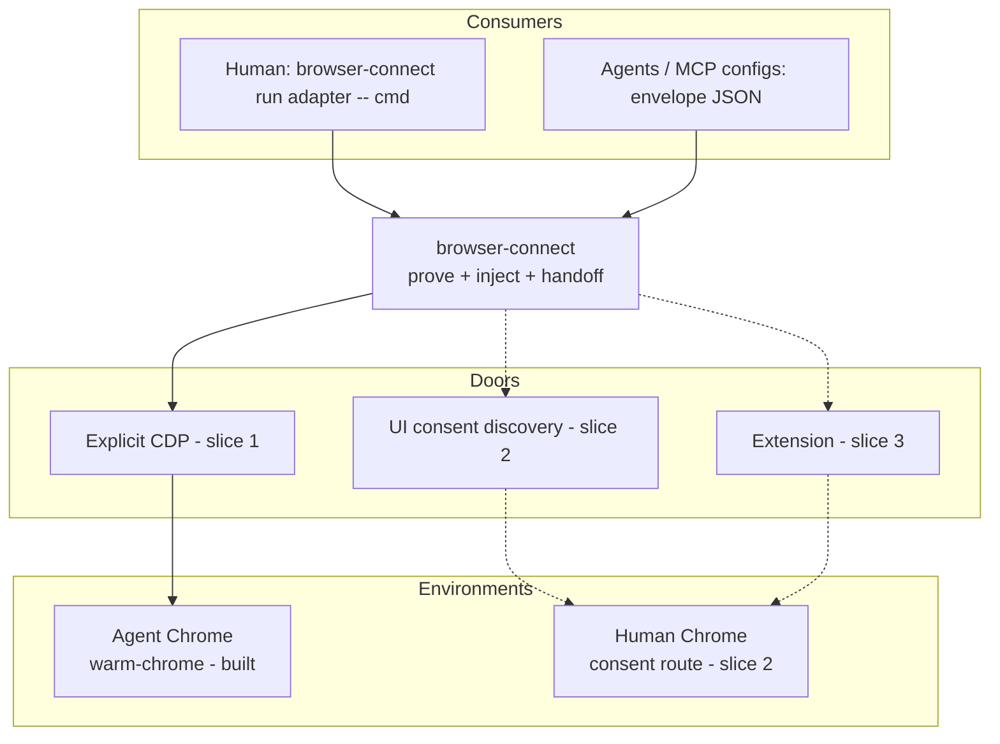
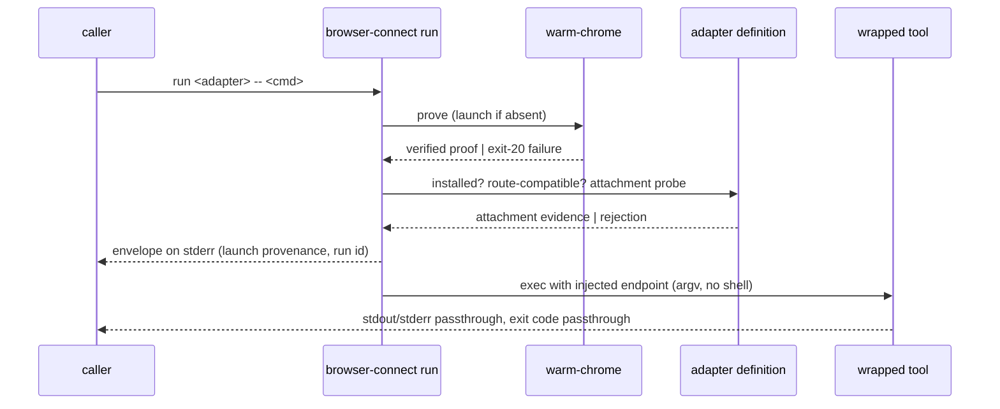

# browser-connect - Plan

## Goal Capsule

- **Objective:** ship slice one of browser-connect — a facade-backed CLI at `runtime/browser-connect` that provably attaches Browser Adapters to Agent Chrome with one command, replacing connection archaeology with a verified handoff.
- **Product authority:** this document's Product Contract. `rules/browser-access.md` invariants are absorbed as R11–R14; the rule retires pointer-first via the prompt-system workflow, outside this plan's diff.
- **Execution profile:** TDD from the Branch Station catalog — catalog and failing tests precede runner behavior. No commits to main; feature branch; ask before new dependencies (plan requires none beyond workspace packages).
- **Stop conditions:** any need to weaken warm-chrome proof invariants; any adapter requiring a new external dependency; any change to startup instructions (`rules/`, `AGENTS.md`) — surface, don't improvise.
- **Open blockers:** none.

---

## Product Contract

### Summary

`browser-connect` (`@side-quest/browser-connect`, home `runtime/browser-connect`) is a new public CLI that provably attaches any installed Browser Adapter to the intended Chrome environment. Humans get one command — `browser-connect run <adapter> -- <cmd>` — that proves the environment, injects the verified endpoint, and runs the tool. Agents and MCP configs get the same guarantee as a verified JSON handoff envelope. The product ends at proven connection; it never performs browser operations.

### Problem Frame

Browser automation in this repo fails at the same place every time: connecting a tool to the right Chrome. The current system conflates four concerns — browser environment (where profile and auth state live), attachment route (how a tool reaches it), Browser Adapter (which tool does the work), and proof (evidence the tool reached the intended environment). The Chrome 150 incident exposed the category error: an everyday-Chrome debugging listener was sent through the Warm Chrome proof, which correctly rejected it as foreign. Earlier, adapters guessing port 9222 stranded orphaned headless browsers.

The cost is recurring and personal: every browser task — running a Playwright suite, having an agent fill a timesheet from a runbook, debugging network requests of a local React app against SIT — risks stalling on connection archaeology instead of the actual work. The router registry advertises three adapters while proof and live operations implement one, so the product promises connections it cannot make.

### Key Decisions

- **The durable core is the environment × route × adapter model, not any Chrome door.** Google has repeatedly moved the way into Chrome (the 9222 flag died for default profiles; Chrome 144 added a consent toggle). Environments, routes, and adapters are separate modeled things; when a door moves, a route implementation is swapped without redesigning the product.
- **Vocabulary: Human Chrome / Agent Chrome.** Human Chrome is the everyday personal Chrome with real logins. Agent Chrome is the dedicated automation Chrome with an explicit CDP endpoint, implemented by `runtime/warm-chrome`. Environment names describe whose browser it is; implementation names stay internal. Grill decision 2026-07-14: browser-connect's CONTEXT.md owns the Agent Chrome entry and names Warm Chrome as its implementation vocabulary (alias findable both directions); v1 has exactly one Agent Chrome instance (warm-chrome convention profile); future multi-identity means multiple Agent Chrome instances distinguished by envelope environment identity, never new environment names.
- **Agent Chrome is the primary environment.** 1Password-backed login inside Agent Chrome removes the logged-in-session dependency on Human Chrome. Agent Chrome is fully controlled, already provable, and offers explicit CDP — the route with the widest adapter support (lesson 0003's retrieval check).
- **Product boundary: verified handoff only.** The product ends when an adapter is provably attached. A harmless probe is proof evidence, not an operations surface. Operations, runbooks, and logins live downstream.
- **Public product; `browser-use` consumes it.** browser-connect is the one door agents and rules point at for browser entry. `browser-use` keeps operational policy but delegates connection.
- **Surface shape: wrapper plus envelope.** The human surface is an exec wrapper in the style of `op run`: prove, inject, exec. The machine surface is the verified handoff envelope. The wrapper is built on the envelope, never beside it.
- **The envelope is the adapter-agnostic connection contract.** One neutral shape — environment, endpoint, route, proof, next safe action — regardless of adapter. Per lesson 0002: proof names the browser-entry mode and the adapter attachment it authorizes; one environment verdict never vouches for a handshake it did not see.
- **Three doors, all modeled; one real adapter per door, sequenced.** Explicit CDP, UI/consent discovery, and extension attachment are first-class route capabilities from day one. Slice one builds the explicit-CDP door; slice two the UI-consent door (Human Chrome); slice three the extension door.
- **Net-new product composed from existing deep modules.** browser-connect consumes `@side-quest/warm-chrome` as the Agent Chrome implementation. It does not inherit the browser-use multi-command workflow, naming, or manifests.
- **Adapters earn their listing.** An adapter appears in the product only when it is installed and passes live attachment proof. No manifest may advertise an adapter that production proof cannot connect.



### Actors

- A1. Nathan — software engineer running browser tools by hand (test suites, DevTools debugging).
- A2. Coding agents (Claude Code, Codex) — consume the envelope or the wrapper to run browser tasks such as runbook-driven form filling.
- A3. Browser Adapters — Chrome DevTools MCP and agent-browser in slice one; Playwright CLI, Playwright MCP, Browser Use CLI, Puppeteer, chrome-remote-interface, Selenium as registry candidates per the lesson 0003 adapter map. Consumers of the verified connection, never trusted to find Chrome themselves.
- A4. Downstream skills — `browser-use` and future browser workflows that delegate connection to browser-connect.

### Requirements

**Connection product**

- R1. One command connects: `browser-connect run <adapter> -- <command>` proves the intended environment, injects the verified endpoint into the adapter's invocation, and execs the command. The caller never supplies ports, profiles, consent modes, or adapter flags.
- R2. A machine surface emits the verified handoff envelope as JSON: environment identity, verified endpoint, attachment route, proof evidence, and on failure exactly one next safe action expressed as an enumerated affordance id — never prose or a shell string.
- R3. Auto-connect: when Agent Chrome is the target and not running, browser-connect launches it through the Agent Chrome implementation and proves it before handoff. Launch provenance is a mandatory structured envelope field, so agents can distinguish an auto-launch from a pre-existing session.
- R4. Every handoff is proof-gated: environment proof (the intended Chrome, not a foreign listener) plus adapter-local attachment proof (this adapter actually reached it). No proof, no handoff.

**Adapter model**

- R5. Each supported adapter has one Adapter Definition owning its identity and executable provenance, compatible attachment routes, endpoint injection mechanics, and attachment proof.
- R6. Adapter identity is separate from attachment route. Routes (explicit CDP, UI/channel discovery, extension) are capabilities an Adapter Definition declares with live evidence; no adapter name encodes a route.
- R7. The product only offers adapters that are installed and have passed live attachment proof; it only offers routes supported by both the chosen environment and the chosen adapter. Everything else is rejected with the reason and one next safe action.
- R8. The envelope schema is identical across all adapters; adapter-specific invocation detail never appears in it.

**Environment model**

- R9. Environments are first-class: Agent Chrome (explicit CDP, built in slice one) and Human Chrome (consent-based route, built in slice two). Adding an environment or route implementation must not change the envelope schema or the Agent Chrome proof.
- R10. Environment selection is explicit or defaulted to Agent Chrome; browser-connect never silently substitutes a different environment.

**Safety and privacy invariants** (absorbed from `rules/browser-access.md`)

- R11. Fail closed: on any proof failure, stop with one next safe action. Never fall back to a cold or headless browser, never launch Chrome for Testing, never retry against a convention port.
- R12. No convention endpoints: endpoints come only from proof envelopes; `127.0.0.1:9222` is never assumed.
- R13. Never mass-kill by port; any process cleanup targets verified process identity only.
- R14. Agent Chrome is treated as auth-bearing: cookies, secrets, auth-bearing URLs, and profile contents stay out of envelopes, diagnostics, and logs — including passed-through wrapper arguments.

**Agent surface and lifecycle**

- R15. Bare `browser-connect` is a read-only, stateless dashboard projection: registered adapters with install/provenance status and declared route evidence status, plus route compatibility per adapter. Reading never probes adapter attachment, proves an environment, launches, or reads persisted run state — live environment truth comes only from `check`/`connect` (grill decision 2026-07-14: no state file, no cached handoff; nothing stale can be trusted).
- R16. The envelope is decision-complete: one read lets an agent pick a valid adapter and route without a trial connection. It names the browser-entry mode and the specific adapter attachment it authorizes, carries a schema version, and correlates via run id (caller-suppliable, warm-chrome `--run-id` parity).
- R17. Exec lifecycle: `run` emits the envelope before exec on a stream the wrapped command cannot pollute, passes the wrapped command's exit code through unchanged, and reserves connection failures to pre-exec — connect failure and wrapped-tool failure are always distinguishable.
- R18. Trust boundary: browser-connect vouches for the connection, not the command. The wrapped command runs with the caller's authority, uninspected; proof-gating is never presented as command-gating.
- R19. Consent-gated routes are interactive-only: in unattended or non-TTY contexts a route requiring operator consent fails closed at a consent-required rejection instead of hanging on a prompt.

### Key Flows

- F1. Test-suite day
  - **Trigger:** A1 runs `browser-connect run <adapter> -- <command>` (e.g. a suite or probe).
  - **Steps:** resolve environment (default Agent Chrome); prove or auto-launch it; check the adapter installed and route-compatible; run attachment proof; emit envelope; inject the verified endpoint; exec the command.
  - **Outcome:** the tool runs against Agent Chrome; A1 never saw a port.
  - **Covers R1, R3, R4, R17.**
- F2. Agent consumes the envelope
  - **Trigger:** A2 needs a browser for a runbook task.
  - **Steps:** agent reads the dashboard or calls `connect <adapter> --json`; receives the verified envelope; configures its adapter from the envelope verbatim.
  - **Outcome:** adapter attached to the proven environment; envelope recorded as evidence.
  - **Covers R2, R4, R8, R15, R16.**
- F3. Fail closed
  - **Trigger:** proof fails (foreign listener, adapter missing, route unsupported, consent unavailable).
  - **Steps:** stop; emit the failure class and exactly one next-safe-action affordance id; make no fallback attempt.
  - **Outcome:** the caller knows what happened and the single next step; no orphaned browsers.
  - **Covers R7, R11, R19.**

### Acceptance Examples

- AE1. **Covers R1, R3.** Given Agent Chrome is not running, when A1 runs `browser-connect run agent-browser -- agent-browser snapshot`, then Agent Chrome launches, is proven, and the snapshot runs against it — one command, no ports typed.
- AE2. **Covers R2, R8.** Given Chrome DevTools MCP is installed, when A2 requests the envelope to debug a local React app against SIT, then the envelope carries the verified endpoint and the MCP attaches using it verbatim.
- AE3. **Covers R7.** Given an adapter supports only explicit CDP and the requested environment offers no CDP route, when connection is requested, then browser-connect rejects with the incompatibility named and one next-safe-action id — it does not attempt another route or environment.
- AE4. **Covers R11, R12.** Given a listener on a conventional port that proof does not verify, when connection is requested, then no handoff occurs and no adapter is pointed at that listener.
- AE5. **Covers R7, R15.** Given an adapter is registered but not installed, when the dashboard is read, then it is shown as unavailable with its install affordance — never advertised as connectable, and no connection attempt fires.
- AE6. **Covers R17.** Given `run` wraps a test suite that exits 1 on failing tests, when the connection succeeds and the suite fails, then browser-connect passes through exit 1 and emits no connect-failure envelope; given a foreign listener instead, `run` exits with the connect-failure code before the suite ever starts.
- AE7. **Covers R3, R16.** Given Agent Chrome already running, when an agent connects, then launch provenance reads false; given it was auto-launched, true — cleanup responsibility is always attributable.
- AE8. **Covers R14, R18.** Given a wrapped command containing an auth-bearing URL argument, when `run` executes it, then no envelope, diagnostic, or log echoes that argument.

### Success Criteria

- Each anchor scene runs with a single command and zero connection troubleshooting: agent-browser snapshot and Chrome DevTools MCP network debugging in slice one; the Playwright suite scene when its adapter slice lands.
- Every connection failure ends in one named next-safe-action id; no failure ends in a guessed port, a cold browser, or an orphaned process.
- A new adapter joins by adding one Adapter Definition; the envelope schema and existing definitions are untouched.

### Scope Boundaries

**Deferred for later (committed follow-up slices)**

- Slice two — Human Chrome via the UI-consent door: Chrome DevTools MCP `--autoConnect` (Chrome 144+ consent flow), consent-aware proof, interactive-only gating. Freshly verifies the territory ADR 0006 recorded as a dead end on the old `chrome://inspect` evidence.
- Slice three — extension door: Playwright MCP `--extension` as the first extension-route adapter.
- Adapter Definitions for Playwright CLI (`attach --cdp` documented), Playwright MCP (`--cdp-endpoint`), Browser Use CLI (`--cdp-url`), and further lesson 0003 map entries — each lands with live injection evidence. The Playwright test-runner scene additionally needs a connect-over-CDP fixture (the runner's own remote mechanism targets a Playwright server, not raw CDP).
- **Adapter fallback (future feature):** ranked selection when the named adapter cannot connect. v1 is strictly no-fallback; the browser-use router engine's evidence-first ranking is the recorded candidate mechanism when this lands.
- **Per-agent target/context allocation (future feature):** lesson 0003's multi-agent boundary — shared CDP transport does not allocate tabs; concurrent agents need their own targets or browser contexts.
- 1Password-backed login inside Agent Chrome — downstream capability building on the `one-password` skill.
- Migration/retirement of existing browser-use CLIs; npm publication of the package.

**Outside this product's identity**

- A universal browser operation API (click/navigate/test across adapters) — adapters keep their own operation surfaces; this product standardizes connection only. A shared operation floor — verbs defined by verified postconditions, per `skills/browser-use/docs/ideation/2026-06-12-floor-verb-semantics-adr0012-ideation.html` — remains a possible future product layered on browser-connect, earned only after multiple adapters connect reliably and repeated cross-adapter scripting shows the pressure.
- Weakening the Agent Chrome (Warm Chrome) proof to recognize other listeners.
- Sandboxing or vouching for wrapped commands (R18).

### Dependencies / Assumptions

- `@side-quest/warm-chrome` (`runtime/warm-chrome`) is the Agent Chrome implementation, consumable as a library: `main` from its `./cli` export, proof factories, contract constants, exit-20 fail-closed semantics. Verified present.
- The browser-use router engine is pure and reusable but is **not consumed in v1** — no-fallback makes its ranking dead weight (deletion test); it remains the candidate for the fallback future feature. Its manifests are not inherited.
- Adapter attach mechanics verified against official docs (2026-07): Chrome DevTools MCP `--browser-url`/`--ws-endpoint`/`--autoConnect`; agent-browser `--cdp <port|url>` / `AGENT_BROWSER_CDP`; Playwright MCP `--cdp-endpoint` (ws form); Playwright library `connectOverCDP` (http or ws). Codex Browser Use exposes no external attach surface today — candidate only.
- Assumption: 1Password-backed login keeps Agent Chrome viable for authenticated tasks. If a site class defeats it, slice two's priority rises.
- Assumption: long-running MCP adapters are served by the same injection contract in launcher form (the MCP config invokes browser-connect as the command wrapper). Shape proven in slice one via Chrome DevTools MCP — including the failure arm: a forced pre-exec exit-20 under an MCP-config launcher, asserting where the failure envelope is observable to the invoking agent (most MCP hosts swallow launcher stderr) and documenting that path in the envelope's next-safe-action guidance.

### Outstanding Questions

**Deferred to implementation**

- Exact station-id naming may adjust during catalog authoring; the catalog in the Planning Contract is the authoritative starting set.
- Whether ADR 0006 needs a superseding note — answered when slice two's live consent-flow verification runs.

**From 2026-07-14 doc review**

- KTD8 duplicates the mcporter no-shell transport package-locally with no drift tripwire between the two copies. When browser-use migrates: consolidate into a small shared workspace module both consumers import, or delete the browser-use copy outright? (product-lens + adversarial, deferred by review)

### Sources / Research

- `runtime/warm-chrome/src/cli.ts`, `src/model.ts`, `src/command-contract.ts` — chassis, exit-code policy, continuation guidance, station tests to mirror.
- `runtime/cli-command-facade/src/index.ts`, `src/station-map.ts`, `src/testing.ts` — facade contract, Station Map model, shared station-test helpers.
- `runtime/cli-test-fixtures` — temp dirs, fake binaries, fixture servers for integration tests.
- `skills/browser-use/src/mcporter-transport.ts` — no-shell argv transport pattern for MCP adapters; `browser-use-transport.ts` — neutral-reason-to-surface-taxonomy mapping.
- `scripts/check-workspace-facade-invariants.ts`, `scripts/command-entrypoint.integration.test.ts`, `scripts/prove-workspace-portability.ts` — workspace gates the new package must pass.
- `docs/adr/0006`, `0009`, `0012`; `docs/decisions/2026-07-03-warm-chrome-runtime-package-definition.md`, `2026-07-04-001-browser-use-warm-chrome-switchover-decision-log.md` — prior decisions: station catalogs drive tests first, `workspace:*` linking, consumer-side env-namespace shims.
- `lessons/0001-chrome-150-and-warm-chrome.html`, `0002-auto-connect-is-not-a-protocol.html`, `0003-chrome-150-adapter-connection-map.html` — four-layer model, entry-mode naming rule, three doors, adapter map, multi-agent boundary.
- `skills/browser-use/docs/ideation/` (2026-06-12) — N-engine facade vision; prerequisite relationship recorded in Scope Boundaries.
- Adapter official docs: ChromeDevTools/chrome-devtools-mcp README (v1.5.0), microsoft/playwright-mcp CLI reference, microsoft/playwright `connectOverCDP`, vercel-labs/agent-browser README (v0.31.2), learn.chatgpt.com/docs/browser.

---

## Planning Contract

**Product Contract preservation:** changed in planning dialogue (all user-confirmed 2026-07-14): R2 sharpened to enumerated affordance ids; R3 sharpened to structured launch provenance; R15–R19 added (dashboard, decision-complete envelope, exec lifecycle, trust boundary, consent gating); Scope Boundaries resequenced — adapter fallback moved from outside-identity to deferred future feature, Human Chrome and extension doors became committed slices, target allocation added; router-engine reuse assumption reversed for v1.

### Key Technical Decisions

- **KTD1 — Private workspace package.** `private: true` + `sideQuest.sourceLinkedBin: true`, bin at `src/cli.ts` with `#!/usr/bin/env bun` — warm-chrome's exact shape. Public npm distribution deferred; a public package could not depend on the private `@side-quest/warm-chrome` and would force the dist-build pipeline.
- **KTD2 — warm-chrome consumed in-process.** Import `main` from `@side-quest/warm-chrome/cli` and parse its JSON envelope for check/launch; no child-process shell-out. Preserves the exit-20 fail-closed contract and proof semantics intact. Environment path stays a plain module — the environment interface is not extracted until slice two's second implementation earns it (`context/code-style.md` gate: second adapter named, seam earned; second *environment* not yet built).
- **KTD3 — Plain adapter registry; no router engine in v1.** Caller names the adapter (no fallback), so evidence ranking fails the deletion test. Registry = static Adapter Definitions + a pure route-compatibility function. The adapter seam is earned now (two real adapters in slice one); the router engine returns as the candidate when the fallback future feature lands.
- **KTD4 — Exit-code policy.** `0` success (or wrapped command's own zero), `1` unexpected runtime, `2` invalid usage, `20` connection-entry failure (warm-chrome's semantic family, same fail-closed meaning), `127` wrapped command not found (browser-connect-authored, emitted after the envelope is on stderr; distinct from the exit-20 connect family). For `run`, post-exec exits are pure passthrough (signal-death maps to 128+signal as part of the passthrough contract); exit 20 can only occur pre-exec, and attribution is anchored by envelope presence, not exit code alone (AE6). Grill decision 2026-07-14: exec-spawn failure additionally emits a second stderr JSON line (failure class `wrapped-command-not-found` + affordance id) before exiting 127, so browser-connect's 127 is mechanically distinguishable from a wrapped tool's own exit 127 — attribution by diagnostic-line presence, never by code alone.
- **KTD5 — Envelope channel for `run`: stderr, before exec.** stdout belongs to the wrapped command end-to-end. The envelope is written to stderr as a single JSON line before exec; `connect --json` remains the clean stdout machine surface. Correlation via `--run-id` (caller-suppliable, generated otherwise).
- **KTD6 — Station catalog drives tests first.** `branch-station-catalog.ts` is authored beside `command-contract.ts` before any runner behavior, per the warm-chrome TDD precedent. Three mandatory layers: unit tests, catalog validation test, catalog-driven integration test with a `Record<StationId, StationScenario>` exhaustiveness map.
- **KTD7 — Three-door route model from day one.** Route capability = `explicit-cdp | ui-consent | extension`, declared per Adapter Definition with an evidence status (`verified-live | documented | candidate`). Slice one implements `explicit-cdp` only; the model prevents the door assumptions from leaking into the envelope schema (R9).
- **KTD8 — MCP adapters ride the mcporter argv transport pattern.** Chrome DevTools MCP attachment proof reuses the no-shell, positional-argv, bounded-timeout invocation shape from `skills/browser-use/src/mcporter-transport.ts`, reimplemented package-locally (browser-use exports no module surface). agent-browser is a plain binary invocation with `--cdp`/`AGENT_BROWSER_CDP` injection.
- **KTD9 — Second adapter: agent-browser.** Trivial, documented endpoint injection; a non-MCP shape that forces the Adapter Definition interface to be honest across two genuinely different invocation models.
- **KTD10 — Redaction chokepoint.** All envelope/diagnostic text passes the facade's text-safety path; wrapper passthrough args are never echoed into envelopes or diagnostics (R14, AE8), mirroring warm-chrome's `sanitizeUsageMessage`/`redactUnsafeText` chokepoints.

### High-Level Technical Design

Component shape (slice one):

```mermaid
flowchart TB
  CLI[cli.ts dispatcher\nfacade contract + help + argv] --> DASH[dashboard.ts\nread-only state projection]
  CLI --> CHECK[check: environment read]
  CLI --> CONNECT[connect: prove-or-launch + envelope]
  CLI --> RUN[run-exec.ts\n-- split, inject, exec, passthrough]
  CONNECT --> ENV[environment.ts\nwarm-chrome in-process gateway]
  CONNECT --> REG[adapters/registry.ts\ndefinitions + compatibility]
  RUN --> CONNECT
  REG --> CDM[adapters/chrome-devtools-mcp.ts\nmcporter argv probe + inject]
  REG --> AB[adapters/agent-browser.ts\nbinary probe + inject]
  ENV --> WC[@side-quest/warm-chrome\nmain via ./cli export]
  CLI --> MODEL[model.ts\nenvelope + affordances + stations vocabulary]
```

`run` lifecycle — connect failure is always pre-exec:



### Branch Station Catalog (initial station ids)

Authoritative starting set; authored test-first in U3. One station = one outcome = one affordance.

| Station id | Command | Exit | Envelope outcome |
|---|---|---|---|
| `dashboard-ok` | (no-arg) | 0 | read-only state projection |
| `usage-invalid` | any | 2 | unknown command/flag/missing operand |
| `run-missing-separator` | run | 2 | no `--` boundary supplied |
| `check-verified` | check | 0 | environment verified, no mutation |
| `check-environment-absent` | check | 20 | Agent Chrome not running (read-only report) |
| `check-foreign-listener` | check | 20 | listener present, proof rejects identity |
| `connect-verified-existing` | connect | 0 | launched:false handoff |
| `connect-verified-launched` | connect | 0 | launched:true handoff |
| `connect-launch-failed` | connect | 20 | launch attempted, proof never verified |
| `connect-foreign-listener` | connect | 20 | fail closed, no fallback |
| `connect-adapter-unknown` | connect | 2 | adapter not in registry |
| `connect-adapter-not-installed` | connect | 20 | registered, binary/package absent |
| `connect-route-incompatible` | connect | 20 | no route shared by environment and adapter |
| `connect-attachment-failed` | connect | 20 | endpoint verified, adapter probe failed |
| `run-preexec-connect-failed` | run | 20 | any connect-family failure; exec never starts |
| `run-wrapped-not-found` | run | 127 | wrapped command missing; envelope already emitted + spawn-failure diagnostic line |
| `run-passthrough-success` | run | 0 | wrapped tool exited 0 |
| `run-passthrough-failure` | run | passthrough | wrapped tool nonzero, no connect-failure envelope |
| `runtime-error-unexpected` | any | 1 | wrapped unexpected exception |

Slice-two/three station families (consent-required rejection, consent-granted handoff, extension attachment) are reserved for those slices' catalogs — not declared-unreachable rows in v1.

### Owners (facade lane)

- **Contract:** `runtime/browser-connect/src/command-contract.ts`
- **Model:** `runtime/browser-connect/src/model.ts`
- **Engine:** `runtime/browser-connect/src/environment.ts`, `src/adapters/registry.ts` (pure policy: compatibility, affordance selection)
- **Discovery:** facade `projectCommandDiscoveryTree` from the contract
- **CLI:** `runtime/browser-connect/src/cli.ts`
- **Test:** `runtime/browser-connect/tests/` + root `scripts/command-entrypoint.integration.test.ts` registration

---

## Output Structure

```text
runtime/browser-connect/
  package.json            # private, sourceLinkedBin, workspace deps
  tsconfig.json           # copied verbatim from warm-chrome
  AGENTS.md  ARCHITECTURE.md  CONTEXT.md  README.md  TASKS.md  TASKS.archive.md
  src/
    cli.ts                # dispatcher, facade wiring, exit policy
    command-contract.ts   # facade contract catalog
    branch-station-catalog.ts
    model.ts              # envelope, failure classes, affordance catalog
    environment.ts        # warm-chrome in-process gateway
    compatibility.ts      # pure route-compatibility check
    dashboard.ts          # read-only state projection
    run-exec.ts           # -- parsing, injection, exec, passthrough
    adapters/
      registry.ts
      chrome-devtools-mcp.ts
      agent-browser.ts
  tests/
    model.test.ts
    compatibility.test.ts
    cli-surface.test.ts   # contract non-drift
    branch-station-catalog.test.ts
    entrypoint.test.ts    # in-process main
    browser-connect.integration.test.ts  # catalog-driven, process boundary
```

Scope declaration, not a constraint — per-unit `Files` stay authoritative.

---

## Implementation Units

### U1. Package scaffold and workspace compliance

- **Goal:** `runtime/browser-connect` exists and passes every workspace gate before feature code.
- **Requirements:** foundation for all.
- **Dependencies:** none.
- **Files:** `runtime/browser-connect/package.json`, `tsconfig.json`, `src/cli.ts` (stub main + shebang), maintainer doc set, root `bun.lock`.
- **Approach:** mirror warm-chrome: `private: true`, `sideQuest.sourceLinkedBin: true`, bin → `src/cli.ts`, `typecheck` script verbatim, `@side-quest/warm-chrome` + `@side-quest/cli-command-facade` as `workspace:*`, dev deps from catalog. Copy warm-chrome's tsconfig byte-for-byte. `bun install` to seed lockfile markers. Seed the six maintainer docs (docs-drift test convention).
- **Patterns:** `runtime/warm-chrome/package.json`, `scripts/check-workspace-facade-invariants.ts` rules.
- **Test scenarios:** `Test expectation: none — scaffolding; proven by workspace gates in Verification Contract.`
- **Verification:** `check:workspace-facade` and `prove:workspace-portability` pass with the new package present.

### U2. Envelope model and affordance catalog

- **Goal:** the package-owned vocabulary: envelope schema, failure classes, next-safe-action affordances, redaction policy.
- **Requirements:** R2, R3 provenance, R8, R14, R16.
- **Dependencies:** U1.
- **Files:** `src/model.ts`, `tests/model.test.ts`.
- **Approach:** contract id + schema version constants; envelope type carrying environment identity, browser-entry mode, authorized adapter attachment, http and ws endpoint forms, launch provenance, run id, proof evidence summary, failure class, single `next_action_id`. Affordance catalog maps every failure class to exactly one action id (facade rule: prose summary + structured action, no command strings). Named structured payload types through the facade result-data helper.
- **Execution note:** test-first — schema and affordance-exhaustiveness tests before the type settles.
- **Patterns:** warm-chrome `model.ts` (contract constants, reason unions), facade result-data helper stance.
- **Test scenarios:** every failure class resolves to exactly one affordance id; envelope round-trips JSON with schema version; reserved keys (`contract_id`, `schema_version`) rejected in payloads; redaction fixtures never appear in serialized envelopes (facade redaction fixtures).
- **Verification:** unit tests green; no hand-built envelope literals outside facade helpers.

### U3. Command contract and Branch Station catalog (test-first)

- **Goal:** the facade contract for no-arg/check/connect/run and the authoritative station catalog, with failing tests that define the CLI before it exists.
- **Requirements:** R2, R7, R11, R15, R17, R19 groundwork.
- **Dependencies:** U1, U2.
- **Files:** `src/command-contract.ts`, `src/branch-station-catalog.ts`, `tests/cli-surface.test.ts`, `tests/branch-station-catalog.test.ts`.
- **Approach:** `defineCommandFacadeContract` with per-command flags, exit codes (KTD4), output modes, side effects (`connect`/`run` declare the `browser` mutation with `previewExemption` reasons; `check`/dashboard read-only), result contracts, and success/failure action affordances from U2. Author every station from the Planning Contract table with expected exit code, envelope status, and result-contract id.
- **Execution note:** this unit is the TDD anchor — catalog and surface tests land red before U4–U7 turn them green.
- **Patterns:** `runtime/warm-chrome/src/command-contract.ts`, its `catalog.test.ts` and `cli-surface.test.ts`.
- **Test scenarios:** contract validates at construction; metadata/discovery drift checks pass; advertised flags render in help and command-foreign flags do not; catalog validates against live discovery; station map with synthetic evidence claims declared branch coverage only; scenario-map keys equal catalog ids (compile-time exhaustiveness).
- **Verification:** catalog and surface tests exist and fail only on unimplemented behavior, not on contract shape.

### U4. Environment gateway (warm-chrome in-process)

- **Goal:** prove-or-launch Agent Chrome as a library call returning typed proof or typed failure.
- **Requirements:** R3, R4, R9 (plain module), R10, R11, R12.
- **Dependencies:** U1, U2.
- **Files:** `src/environment.ts`, `tests/entrypoint.test.ts` (gateway portions).
- **Approach:** call warm-chrome `main` in-process with captured writer, parse its JSON envelope into browser-connect's environment-proof type; map the full exit-20 reason union onto failure classes via an exhaustive record over warm-chrome's exported reason constants with a declared exit-20 default catch class — an unmapped reason must never degrade to `runtime-error-unexpected` (exit 1); launch path drives `launch` then re-proves via `check`. warm-chrome's `main` mutates process-global diagnostics state (`configureCliDiagnostics` … `finally { resetCliDiagnostics() }` reset LogTape), so the gateway re-runs browser-connect's own diagnostics configuration immediately after every in-process `main` return — otherwise the KTD10/R14 redaction chokepoint is silently disabled post-gateway. No environment interface abstraction (KTD2). Launch provenance captured here.
- **Execution note:** characterize against warm-chrome's real envelope fixtures before wiring — its contract is the dependency boundary.
- **Patterns:** warm-chrome `entrypoint.integration.test.ts` in-process invocation with inert-runtime deps.
- **Test scenarios:** verified proof maps endpoint forms (http + ws) into the envelope; exit-20 check failure maps to `check-environment-absent`/`check-foreign-listener` classes; the reason-to-failure-class record is compile-time exhaustive over warm-chrome's exported reason union (a new upstream reason is a type error, and the default catch class stays in the exit-20 family); a post-gateway diagnostic still emits through browser-connect's redactor after `main` returns; launch-then-verify sets provenance true; launch failure never yields a handoff; injected fake runtime — no real Chrome in unit tests.
- **Verification:** unit tests green with zero real-IO reliance.

### U5. Adapter registry and two Adapter Definitions

- **Goal:** honest adapter model: registry, route capabilities with evidence status, compatibility check, and definitions for Chrome DevTools MCP and agent-browser.
- **Requirements:** R5, R6, R7, R8; KTD7–KTD9.
- **Dependencies:** U1, U2.
- **Files:** `src/adapters/registry.ts`, `src/adapters/chrome-devtools-mcp.ts`, `src/adapters/agent-browser.ts`, `src/compatibility.ts`, `tests/compatibility.test.ts`.
- **Approach:** Adapter Definition = identity + executable provenance check (resolve to an absolute path or explicit command vector — no implicit PATH/latest fallback, mirroring the mcporter transport stance — and read the adapter's version against the version pinned in the definition; mismatch or unresolvable path maps to the not-installed failure class) + route capabilities (`explicit-cdp` verified-live for both; `ui-consent` documented for chrome-devtools-mcp per lesson 0003, not implemented) + injection (chrome-devtools-mcp: `--browser-url` arg from envelope http form via mcporter argv pattern; agent-browser: `--cdp <ws>` or `AGENT_BROWSER_CDP`) + attachment probe executed through the adapter's own binary/entrypoint with a read-only invocation (chrome-devtools-mcp via its mcporter argv invocation; agent-browser via a read-only command with the injected endpoint) — browser-connect never probes on an adapter's behalf (R4: proof names a handshake the adapter itself performed), and the envelope's authorized-attachment field names which executable performed the probe. The registry ships with exactly two entries; lesson 0003 map entries join the registry in the same diff as their Adapter Definition, per "adapters earn their listing" — no definition-free candidate rows in v1 (doc-review decision 2026-07-14).
- **Execution note:** implement chrome-devtools-mcp first, prove the definition interface, then agent-browser validates the seam before any interface broadening.
- **Patterns:** `skills/browser-use/src/mcporter-transport.ts` (argv-only, bounded timeout, exit-127 → dependency-missing), `browser-use-transport.ts` reason-mapping.
- **Test scenarios:** compatibility is pure and total over route × environment; uninstalled adapter → not-installed class, never a probe; version-mismatch or PATH-unresolvable executable → not-installed class, never a probe or handoff; probe failure → attachment-failed with evidence; injection produces exact argv per adapter (no shell strings); unknown adapter → usage-class rejection.
- **Verification:** unit tests green; station rows for adapter failures satisfiable with fake binaries.

### U6. check, connect, and dashboard commands

- **Goal:** the machine surface: read-only check and dashboard, prove-or-launch connect emitting the decision-complete envelope.
- **Requirements:** R2, R4, R7, R10, R15, R16.
- **Dependencies:** U3, U4, U5.
- **Files:** `src/cli.ts`, `src/dashboard.ts`, `tests/entrypoint.test.ts`.
- **Approach:** dispatcher wires facade parsing, help, run-id, and the U3 contract. Dashboard is a stateless projection of registry + install/provenance checks + declared route evidence; no environment state, no persistence, never probes attachment or launches (R15). `check` = environment read only. `connect <adapter> [--json]` runs the full gate sequence and emits the envelope on stdout in json mode. All failures route through the affordance catalog — one action id each.
- **Patterns:** warm-chrome `cli.ts` chassis (injectable deps, usage errors, continuation guidance), agent-native no-arg dashboard state gates.
- **Test scenarios:** dashboard with two installed adapters (verified-live declared evidence) + one uninstalled adapter yields a one-read adapter/route decision with no probe fired (AE5, R16 scenario); connect existing session → provenance false; connect with launch → true (AE7); each connect failure station reachable in-process with fakes; `--json` envelopes carry contract id + schema version; no envelope text contains local paths or command strings (facade text safety).
- **Verification:** all check/connect/dashboard stations green in-process; drift tests still green.

### U7. run wrapper

- **Goal:** `browser-connect run <adapter> -- <cmd>`: prove, emit envelope on stderr, inject, exec, passthrough.
- **Requirements:** R1, R14, R17, R18; KTD4, KTD5.
- **Dependencies:** U6.
- **Files:** `src/run-exec.ts`, `src/cli.ts`, `tests/entrypoint.test.ts`.
- **Approach:** split argv at first `--` (absence → `run-missing-separator`); head = adapter + browser-connect flags, tail = wrapped command verbatim. Reuse connect's gate; envelope JSON line to stderr pre-exec; inject endpoint per Adapter Definition into the tail's argv/env; exec positionally, no shell, as spawn-and-wait (Bun exposes no exec(2) process replacement): full stdio inheritance including stdin, SIGINT/SIGTERM forwarded to the child, and signal-death mapped to exit 128+signal as part of the passthrough contract; exit passthrough; wrapped-not-found → 127 after envelope. Passthrough args excluded from all diagnostics (KTD10).
- **Execution note:** the `--` parser and passthrough are net-new with no repo precedent — write the boundary tests before the parser.
- **Patterns:** `spawnMcporterCommand` no-shell exec; warm-chrome redaction chokepoints.
- **Test scenarios:** AE1 shape with fake adapter binary; AE6 both arms (passthrough failure vs pre-exec 20); AE8 auth-bearing arg never echoed; missing `--` → exit 2; wrapped tool absent → 127 with envelope already on stderr plus the spawn-failure diagnostic line, while a wrapped tool self-exiting 127 passes through with no diagnostic line (the two 127s distinguishable); launcher-form shutdown terminates the wrapped process — signal forwarded, no orphan; stdout byte-identical to wrapped tool's stdout.
- **Verification:** all run stations green; stderr envelope parses independently of wrapped output.

### U8. Catalog-driven integration proof

- **Goal:** every station proven through real process spawns; Command Surface Alignment Proof complete.
- **Requirements:** R11, R12, R14 at the process boundary; R13 holds vacuously in v1 code (no process-cleanup surface exists) with its behavioral guidance landing via U9 doc ownership; KTD6.
- **Dependencies:** U3–U7.
- **Files:** `tests/browser-connect.integration.test.ts`, `scripts/command-entrypoint.integration.test.ts` (add contract entries).
- **Approach:** `Record<StationId, StationScenario>` over the full catalog using facade testing helpers (`assertStationEnvelope`, `buildStationEvidence`) and cli-test-fixtures (temp dirs, `writeFakeToolBinary` for adapters, `startFixtureServer` for MCP/HTTP probes). warm-chrome cannot be faked as a binary — KTD2 consumes it in-process and its runtime pins the real Chrome path — so environment stations split by seam (doc-review decision 2026-07-14): gateway stations prove in-process (U4/U6 injected deps, captured writers); foreign-listener stations reach warm-chrome's real proof at the process boundary via endpoint passthrough (warm-chrome's `WARM_CHROME_CDP_PORT` env input) pointed at `startFixtureServer`; verified/launched stations use `buildSkippedStationEvidence` with rationale (live smoke covers them per the Verification Contract). evidence feeds the station-map projector asserting no drift and full coverage-or-skip. Register contract entries in the root cross-package integration test.
- **Patterns:** `skills/archive/use-storybook/tests/storybook-doctor.integration.test.ts` (archived precedent; shared helpers, skipped stations).
- **Test scenarios:** the catalog is the scenario list; plus alignment proof: discovery metadata, rendered help, public argv acceptance/rejection, runtime semantics.
- **Verification:** integration suite green; station map reports every station covered or skipped-with-rationale; root `command-entrypoint:integration` green.

### U9. Adoption pointers and decision record

- **Goal:** downstream consumers can find browser-connect; the architecture decision is durable; no two contexts claim browser-entry ownership.
- **Requirements:** pointer-first sequencing (Scope Boundaries), R11-authority handoff groundwork.
- **Dependencies:** U8.
- **Files:** `skills/browser-use/SKILL.md` (owner line), `docs/decisions/` (new decision log via the record-decision skill), `CONTEXT-MAP.md` (register the browser-connect bounded context + Browser Use → browser-connect relationship), `skills/browser-use/CONTEXT.md` (amend entries claiming connection ownership to delegate to browser-connect).
- **Approach:** add a browser-use owner line delegating browser entry/connection to browser-connect, mirroring its existing warm-chrome delegation line. Reconcile glossaries in the same diff (grill decision 2026-07-14): `runtime/browser-connect/CONTEXT.md` registers in `CONTEXT-MAP.md` with a Browser Use → browser-connect relationship; browser-use's `browser-use` entry drops the "owns all browser entry" claim in favor of delegated connection. The term **Browser Adapter** moves: browser-connect's CONTEXT.md owns the canonical environment-agnostic definition (a tool that attaches to a proven browser environment via a declared route; never trusted to find Chrome itself); browser-use's entry narrows to consumer-of-verified-attachment and drops its Warm-Chrome-only clause. browser-connect's CONTEXT.md also defines **Verified Handoff Envelope** (success-direction: proven connection handed to a consumer) with a contrast line against browser-use's failure-direction **Browser Entry Handoff**; browser-use's entry gains the mirror contrast — both terms live, ambiguity killed in the glossaries. Record the accepted architecture (environment × route × adapter model, three-door roadmap, no-fallback v1) as a decision log with a mandatory "relationship to prior decisions" section (grill decision 2026-07-14): ADR 0009 consumed intact as endpoint authority; ADR 0012 not reversed — the router is deliberately unused in browser-connect v1 and still governs browser-use until migration; ADR 0006's superseding note stays deferred to slice two. No ADR files edited in this diff. `rules/browser-access.md` retirement is follow-up work routed through the prompt-system workflow once the pointer exists — not this plan's diff.
- **Execution note:** smoke-first — this unit is prose and pointers; verification is link-level, not unit tests.
- **Test scenarios:** `Test expectation: none — documentation pointers; docs-drift test covers maintainer docs from U1.`
- **Verification:** browser-use SKILL.md names the owner; decision log exists; browser-connect maintainer docs carry the R13 never-mass-kill guidance verbatim (named successor for the rule's retirement); the prompt-system-workflow rule-update follow-up is filed (the coexistence window's closing trigger); no `rules/` files touched.

---

## System-Wide Impact

- **`skills/browser-use` becomes a consumer.** Its SKILL.md gains a browser-entry owner line (U9); its own preflight path is unchanged by this plan. Full delegation and CLI migration are follow-up work, sequenced after slice one proves the surface.
- **`rules/browser-access.md` authority handoff.** R11–R14 now live in this Product Contract; the rule retires pointer-first via the prompt-system workflow. Until that runs, both texts coexist and a real instruction window is open (doc-review decision 2026-07-14): the rule's endpoint-authority sentence directs agents to take endpoints from warm-chrome's envelope specifically, so a rule-following agent double-gates rather than trusting browser-connect's envelope. The window closes only when the rule update lands; U9's verification includes filing that prompt-system-workflow follow-up as a committed step, not an untriggered intention.
- **`@side-quest/warm-chrome` gains its first in-process consumer.** browser-connect binds to its JSON envelope and exit-20 contract as a library boundary (KTD2). Any future warm-chrome envelope change now has a second contract-pinned consumer; its schema_version is the tripwire.
- **Root proof surfaces grow.** `command-entrypoint:integration` gains browser-connect contract entries; `check:workspace-facade` and `prove:workspace-portability` gate the new package shape (U1, U8).

## Risks & Mitigations

- **Stream contamination in `run`** — an envelope sharing stdout with the wrapped tool corrupts both consumers. *Mitigation:* KTD5 (envelope on stderr pre-exec) plus the U7 byte-identical-stdout test scenario.
- **Envelope under-specification forces probing** — if the envelope omits state agents need, trial connections return. *Mitigation:* R16 decision-completeness plus the U6 one-read dashboard scenario as a regression gate.
- **Adapter flag churn** — `--browser-url`/`--cdp` surfaces are external and move (verified against chrome-devtools-mcp v1.5.0, agent-browser v0.31.2). *Mitigation:* injection mechanics live in one Adapter Definition each; attachment proof fails closed with the not-attached evidence rather than acting on stale flags; versions pinned in Sources.
- **Consent-route stall in unattended runs** — slice two's UI-consent door can hang on an operator prompt. *Mitigation:* R19 makes consent routes interactive-only now, so the failure mode is a designed rejection before the route is ever built.
- **Multi-client target contention** — multiple adapters on one Agent Chrome can collide on tabs (lesson 0003 boundary). *Mitigation:* slice one assumes one active adapter per session; per-agent target/context allocation is a named future feature, not an implicit promise.
- **Private-package coupling** — browser-connect (private) depending on warm-chrome (private) is clean today, but publishing either later forces the dist pipeline and dependency-visibility work. *Mitigation:* KTD1 records the constraint; publication is an explicit deferred item, not drift.

---

## Verification Contract

| Gate | Command | Applies to | Done signal |
|---|---|---|---|
| Types | package `typecheck` (`tsc --noEmit`) | U1–U8 | zero errors |
| Unit + station tests | `bun test ./tests/*.test.ts` in `runtime/browser-connect` (via repo test runner) | U2–U8 | green, station map full coverage-or-skip |
| Contract non-drift | `tests/cli-surface.test.ts` + root `command-entrypoint:integration` | U3, U6–U8 | no metadata/discovery/help/argv drift |
| Workspace shape | `bun run check:workspace-facade` | U1 | zero findings for the new package |
| Portability | `bun run prove:workspace-portability` | U1, U8 | isolated export passes typecheck/test |
| Lint | Biome via repo runner | all | clean |
| Live smoke | `browser-connect run agent-browser -- agent-browser snapshot` on a real Agent Chrome | U7 | AE1 observed end-to-end |
| MCP launcher failure arm | forced pre-exec exit-20 with browser-connect as an MCP-config launcher | U7 | failure envelope observable to the invoking agent; observability path documented |

Run `fallow` after implementation lands; file a `skill-feedback` closeout for the cli-author-driven contract work.

## Definition of Done

- All nineteen catalog stations covered by real process spawns or skipped with recorded rationale; station map claims declared branch coverage only.
- Command Surface Alignment Proof green across its four drift surfaces.
- AE1–AE8 each enforced by at least one named test scenario; AE1 additionally observed live (Verification Contract smoke).
- Both slice-one adapters connect end-to-end against a real Agent Chrome; dashboard one-read decision scenario passes.
- Workspace gates green with the new package; no changes to `rules/`, `AGENTS.md`, or warm-chrome proof internals.
- browser-use owner pointer and decision log landed; abandoned experimental code removed from the diff.
