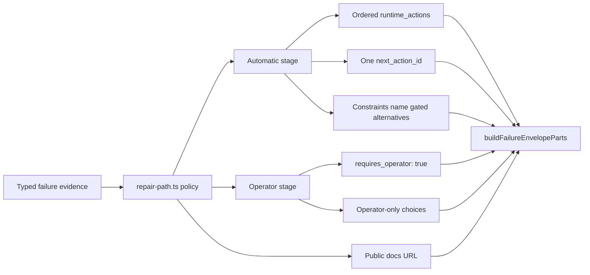
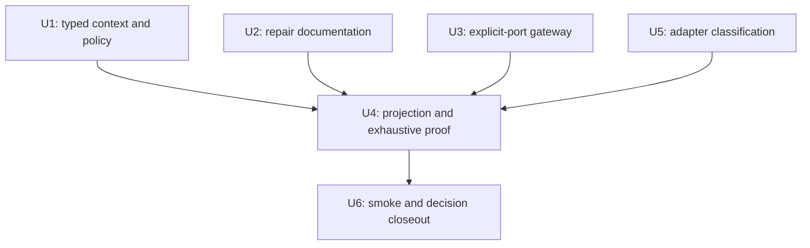

# browser-connect agent-native repair paths - Plan

## Goal Capsule

- **Objective:** make every browser-connect error station expose a deterministic repair path back to a verified adapter-to-Chrome connection.
- **Trigger:** the 2026-07-14 live smoke exposed dead-end `inspect_*` affordances for environment, adapter, and run failures.
- **Scope:** browser-connect model, policy, gateway, adapters, CLI projection, tests, repair docs, and decision record.
- **Auto stage:** emit ordered `runtime_actions`, one `continuation.next_action_id`, and constraints that identify unavailable operator alternatives.
- **Operator stage:** emit `continuation.requires_operator: true`, operator-only `choices`, and no `next_action_id`.
- **Autonomy boundary:** allow reuse, launch on a free explicit port, adapter install or safe upgrade through the explicit repair executor, and re-proof. Gate adapter handoffs, process termination, port freeing, and pin-policy changes.
- **Stop conditions:** never weaken warm-chrome proof, connect to an unverified listener, synthesize an endpoint, switch ports inside a failed invocation, or auto-execute process-destructive work.

---

## Product Contract

### Summary

browser-connect already proves reuse before launch and already has a shared failure-projection chokepoint. The missing contract is a typed recovery policy: each failure needs a stable action, enough structured context to select that action without parsing prose, and either an executable automatic continuation or an explicit operator choice.

This plan preserves the facade schema. `RuntimeContinuationGuidance` permits exactly one automatic `next_action_id` or an operator stage with `requires_operator: true`. `choices` are operator-only and cannot coexist with `next_action_id`. Automatic alternatives therefore live in ordered `runtime_actions`; operator alternatives live in `continuation.choices` only after automatic recovery is exhausted.

“Repair hint” is shorthand, not a new runtime type. One complete Repair Path consists of:

1. one stable action ID;
2. typed repair context containing every required input;
3. one automatic or operator continuation posture;
4. one public `REPAIR.md` anchor describing owner, side effects, success evidence, retry safety, and stop conditions.

An action ID without all four parts is incomplete and cannot ship.

Review every proposed action, operator choice, constraint, and agent-facing summary in the [Repair Hint Ledger](./2026-07-14-002-feat-browser-connect-repair-paths-repair-hint-ledger.md). The ledger is a review surface; accepted decisions return to this plan before implementation.

### Problem Frame

| Failure area | Current gap | Required recovery contract |
|---|---|---|
| Environment | suggestion or cause lost at the gateway | preserve typed cause and suggested explicit port; require a fresh rerun |
| Adapter | one category action hides installed/pinned/probe detail | preserve typed provenance and choose install, upgrade, route, or probe action |
| Run | prose detail carries missing input or pre-exec cause | preserve typed run cause and underlying pre-exec failure |
| Projection | station tests reconcile status and error only | prove recovery posture for every error station |
| Docs | local anchors are invalid facade URLs | use absolute public HTTP(S) URLs whose fragments resolve to local headings |

### Requirements

- **R1.** Each of the 14 target error stations, comprising the 13 current stations plus `repair_adapter.operator_stop`, emits one facade-valid posture: automatic or operator.
- **R2.** Repair actions use stable IDs, prose-safe summaries, declared side effects, recoverability, and valid public docs URLs.
- **R3.** Machine-readable continuation and constraints are authoritative; drivers never infer policy from prose detail.
- **R4.** Recovery policy is exhaustive over the 12 current failure classes and any typed cause variants needed to select a repair.
- **R5.** A verifiable existing Agent Chrome remains the fast path and reports `launched: false`.
- **R6.** Environment recovery preserves warm-chrome reason and `suggested_explicit_port`; a port change requires a fresh explicit invocation.
- **R7.** Safe environment recovery may launch on a free explicit port or re-prove the environment.
- **R8.** Freeing a port, terminating a listener, or touching an existing browser remains external operator-only; browser-connect never projects or ingests authority for that work.
- **R9.** Missing or ambiguous recovery context fails closed to an operator stage.
- **R10.** Environment failures provide a path through absent, occupied, foreign, unverified, and launch-failed states.
- **R11.** Adapter failures preserve safe observed and pinned versions, registry provenance, route cause, and probe cause.
- **R12.** Run failures preserve missing-input, separator, wrapped-command, and underlying pre-exec causes.
- **R13.** A package-owned map specifies recovery expectations for all 14 target error stations. `inspect_*` is never an automatic next action; it appears only in an operator stage with evidence requirements and mutation constraints.
- **R14.** `runtime/browser-connect/REPAIR.md` owns append-only versioned headings in the form `## v1-<action-id>`. Envelope URLs use `https://github.com/nathanvale/claude-code-config/blob/main/runtime/browser-connect/REPAIR.md#v1-<fragment>`. Publish the matching main-branch heading before releasing a binary that emits it; incompatible procedure changes receive a new heading version.
- **R15.** `check`, `connect`, and `run` accept validated `--port` and `--repair-chain-hop <0|1>` options, expose both in discovery metadata and rendered help, and forward the same port through check, launch, and recheck. The default hop is `0`; only a `use_suggested_port` recipe emits hop `1`.
- **R16.** Schema version 1 remains shape-compatible: existing action IDs and the required `data.next_action_id` field remain stable. Value selection deliberately narrows for operator stages, replacing unsafe class-default advice with a known non-mutating compatibility stop. Outer continuation remains authoritative.
- **R17.** Every emitted action satisfies the Repair Action Contract: selection cause, required typed inputs, owner, declared side effects, retry posture, success evidence, stop condition, and public docs anchor.
- **R18.** A table-driven cause matrix covers every typed environment, adapter, and run cause. Tests fail when a cause has no action or operator posture.
- **R19.** Every automatic action has a non-interactive executor owner or a deterministic caller-rerun recipe. Package install and upgrade actions execute only through `repair-adapter <adapter_id> --execute`; missing inputs fail closed to an operator stage.
- **R20.** Compatibility-only action IDs remain discoverable but can never become outer `continuation.next_action_id`.
- **R21.** Adapter install and upgrade use registry-owned package provenance and argv recipes. Policy never infers upgrade safety from semantic-version shape.
- **R22.** Automatic upgrade requires an explicit observed-version-to-pin allowlist entry. Downgrades, unknown versions, privilege prompts, auth prompts, package-manager ambiguity, and pin changes require an operator.
- **R23.** Any permitted transient retry runs at most once inside the owning invocation. `use_suggested_port` is the sole cross-invocation automatic continuation and is available only to `connect` and `run`: it starts one fresh invocation with `--repair-chain-hop 1`. A hop-1 failure cannot emit another `use_suggested_port` action and fails closed to an operator stage.
- **R24.** Operator choices come from the package choice catalogue or trusted Adapter Definition IDs. Choice text and IDs never include caller-authored or third-party prose.
- **R25.** Every recovery posture emits all applicable package constraints; tests reject actions or choices that conflict with forbidden action IDs or side effects. The facade rejects an operator stage without at least one constraint summary, so every operator stage in the cause matrix names at least one applicable catalogue constraint.
- **R26.** Run repair context never projects wrapped argv, arguments, environment values, or full executable paths. Separator repair projects only a non-empty-command marker; missing-executable repair may project a normalized basename only after text-safety validation.
- **R27.** Every automatic action has at least one hermetic process-boundary success-path test from induced selecting failure through owner execution or fresh rerun to its named follow-up proof. Separate negative fixtures cover every declared stop and assert transition to the named operator posture.
- **R28.** Automatic package work runs through an isolated installer boundary: approved absolute package-manager executable, neutral working directory, isolated configuration, fixed canonical registry, exact lock-entry origin validation, environment allowlist, no inherited registry or auth credentials, no shell, and no prompt.
- **R29.** Automatic package work requires source-controlled full dependency-graph integrity and disabled lifecycle scripts. Missing integrity, lock drift, lifecycle-script requirements, downgrade, auth, prompt, privilege, or registry ambiguity makes the action operator-only. Adapter Definition owners review integrity metadata whenever a pin or transition changes.
- **R30.** Legacy `data.next_action_id` mirrors the outer `continuation.next_action_id` only for an automatic stage. For an operator stage, a package-owned typed compatibility selector emits only a cause-appropriate non-mutating stop action from `change_input`, `inspect_listener`, `inspect_diagnostics`, or `list_registered_adapters`. Tests reject legacy actions with `network`, `write`, `browser`, `auth`, or `destructive` effects and any action forbidden by outer constraints.
- **R31.** Manual adapter install, Adapter Definition review, and cross-adapter handoff use stable package-owned choice families derived only from trusted Adapter Definition IDs. Each choice declares direct side effects, a versioned public docs URL, required trusted evidence, success proof, and stop conditions. Choices never embed package commands or caller-authored labels.
- **R32.** Listener ownership is an external operator-completion boundary. browser-connect accepts no ownership claim, PID, process token, evidence file, or continuation receipt as authority; emits no `free_occupied_port` choice or action; and starts every post-remediation invocation from fresh warm-chrome proof.
- **R33.** Add facade-backed `repair-adapter <adapter_id> --check|--execute [--json]`. `--check` is the read-only preview; `--execute` is the sole package-mutation mode; omitting both or supplying both is invalid usage. The command re-reads trusted registry and provenance state, accepts no package, version, registry, lockfile, path, or recipe override, runs non-interactively, and proves fresh exact-pin provenance before success.
- **R34.** Installer preflight accepts only registry-relative lock entries or resolved URLs whose origin exactly matches the Adapter Definition's canonical registry. Any git, file, workspace, HTTP, alternate-origin, or unparseable dependency source stops before network or mutation. The network egress gate permits only the canonical origin and rejects redirects before following the target or publishing mutation.

### Key Flows

- **F1. Verified reuse:** `check` verifies the requested port; browser-connect reuses the endpoint; no launch; `launched: false`.
- **F2. Suggested port:** check reports a typed reason and suggested explicit port but remains a diagnostic surface. Only a failed `connect` or `run` may select `use_suggested_port`; the caller reruns that command once with `--port` and `--repair-chain-hop 1`; browser-connect never changes the port internally or emits a second suggested-port hop.
- **F3. Adapter repair:** typed adapter state selects install or safe pin upgrade, then the caller previews and executes that action through `repair-adapter`. Route incompatibility offers trusted operator adapter handoffs; attachment failure receives bounded re-probe or operator diagnosis.
- **F4. Run repair:** typed run cause selects input correction or separator action; a pre-exec connection failure retains and projects its underlying recovery path.

### Acceptance Examples

- **AE1. Covers R1, R3, R13.** Given any error station, projection produces exactly one valid automatic or operator continuation, matching the package recovery-expectation map.
- **AE2. Covers R5.** Given warm-chrome verifies the requested endpoint, `connect` reuses it with `launched: false` and never calls launch.
- **AE3. Covers R6, R15, R23.** Given `connect` or `run` receives warm-chrome suggestion 9333 at hop 0, the envelope preserves 9333 and selects `use_suggested_port`; only a fresh copy of that command with `--port 9333 --repair-chain-hop 1` uses it. If that invocation fails, it emits an operator stage and no second `use_suggested_port` action. Given `check` receives the same suggestion, it preserves the field but emits an operator diagnostic posture, never an automatic suggested-port continuation.
- **AE4. Covers R8, R9.** Given an occupied unverifiable port, no automatic action terminates or replaces the listener; the continuation requires an operator.
- **AE5. Covers R11, R22.** Given agent-browser 0.26.0, pin 0.31.2, and an Adapter Definition that explicitly allows that exact transition, structured provenance selects `upgrade_adapter_to_pin` without parsing `detail`.
- **AE6. Covers R12.** Given `run <adapter> --` with no tail, structured run cause requires operator input with the `provide_wrapped_command` choice referencing `add_run_separator`; given a missing separator with a non-empty wrapped command preserved only in parser memory, the same station selects automatic `add_run_separator` without projecting wrapped argv.
- **AE7. Covers R2, R14.** Every docs URL is absolute HTTP(S), passes facade validation, uses a versioned action fragment, resolves to a heading in local `REPAIR.md`, and is publishable only after that same heading exists on main.
- **AE8. Covers R16.** Existing consumers still receive schema 1, the required field, and known action IDs. Automatic stages preserve the exact outer action; operator stages receive a known non-mutating stop instead of unsafe class-default advice. New consumers follow outer continuation.
- **AE9. Covers R17, R19.** Given any automatic action, its required context is present, its owner is executable without prose parsing, and its success evidence names the follow-up proof.
- **AE10. Covers R20.** Given a wrapped run pre-exec failure, the envelope inherits the underlying environment or adapter action; `resolve_connect_failure` is never the primary continuation.
- **AE11. Covers R21, R22.** Given an observed adapter version, automatic upgrade occurs only when the adapter registry explicitly permits that exact transition to the current pin.
- **AE12. Covers R23.** Given a typed transient attachment failure, the owning invocation performs at most one read-only re-probe; a second failure emits operator inspection and no retry action.
- **AE13. Covers R24, R25.** Given an ambiguous foreign listener, the operator stage offers only read-only inspection, emits process-destruction and unverified-listener constraints, and contains no automatic next action.
- **AE14. Covers R26.** Given wrapped arguments containing auth-bearing values, separator and missing-command envelopes expose only the typed cause and safe presence or basename fields; serialized envelopes contain none of the arguments.
- **AE15. Covers R27.** Every automatic action has a process-boundary fixture that satisfies its supported selecting preconditions, executes its declared owner or rerun recipe, and reaches its named successful follow-up proof. Separate fixtures violate each safety precondition or induce each execution failure and assert the declared operator stop.
- **AE16. Covers R3, R9.** Given a compatible route exists only on a different registered adapter, policy offers a trusted `choose_registered_adapter:<adapter_id>` operator choice and never changes the adapter automatically.
- **AE17. Covers R28.** Given hostile working-directory configuration, registry environment variables, auth environment variables, or package-manager path shadowing, automatic install uses only its isolated trusted inputs or stops before mutation.
- **AE18. Covers R29.** Given lock drift, missing transitive integrity, or a package requiring lifecycle scripts, automatic install or upgrade is unavailable and the continuation requires an operator.
- **AE19. Covers R16, R30.** Given an adapter is absent but its isolated install recipe is incomplete, the outer continuation requires an operator and offers the complete manual-install or Adapter Definition review choice. Legacy `data.next_action_id` selects only `list_registered_adapters`; it never exposes `install_adapter` or another mutating action.
- **AE20. Covers R24, R31.** Given a trusted registered adapter exposes a compatible route, an operator stage may offer `choose_registered_adapter:<adapter_id>` with direct declared side effects, versioned docs, route evidence, success proof, and stop conditions. Unregistered, caller-authored, or route-incompatible candidates produce no choice.
- **AE21. Covers R8, R13, R32.** Given an occupied or foreign listener, browser-connect offers `inspect_listener` as a terminal operator handoff and forbids process destruction. If the operator remediates the listener externally, a fresh invocation re-proves the port without accepting or replaying ownership evidence.
- **AE22. Covers R19, R33.** Given an eligible missing or safely upgradable adapter, `repair-adapter <adapter_id> --check --json` reports the exact registry-owned action without mutation; `--execute --json` re-evaluates the same trusted state, performs exactly one isolated repair, and succeeds only after exact-pin provenance. Conflicting or absent modes and every caller-supplied package-policy override fail before mutation.
- **AE23. Covers R28, R29, R34.** Given a lockfile with an off-registry transitive URL, git source, local path, or malformed origin, installer preflight stops with zero network access and zero published mutation even when integrity metadata is present. Given a canonical-origin response that redirects, the egress gate performs no redirected request and publishes no mutation.

### Success Criteria

- Every current error station exposes a deterministic next safe action or a bounded operator handoff.
- Automatic actions name an executable, non-interactive owner.
- Existing verified-session reuse stays unchanged.
- Command discovery, help, parser acceptance, forwarding, and runtime semantics agree for `--port`.
- Every automatic action proves successful recovery under supported selecting preconditions; separate negative fixtures prove each declared operator stop.
- Automatic package mutation crosses the isolated installer boundary only with full dependency integrity and lifecycle scripts disabled.
- Automatic adapter mutation has one discoverable preview-and-execute CLI owner; no caller value can override package policy.
- Lockfile integrity and canonical-origin validation both pass before package network access.
- Legacy compatibility data cannot bypass an operator stage or expose a mutating next action.
- Adapter operator choices are complete, stable, registry-derived contracts.
- Listener remediation completes outside browser-connect and returns only through fresh environment proof.
- Package tests and workspace baselines pass through approved runners.

### Scope Boundaries

**Included**

- Typed repair context and pure browser-connect recovery policy.
- Registry-owned adapter install and safe-upgrade recipes.
- Explicit-port command surface and same-port forwarding.
- Error-envelope projection, station expectations, tests, docs, and decision amendment.

**Deferred**

- A generic repair framework or autonomous multi-step repair engine.
- A generic package installer or dependency manager.
- Slice 2 or slice 3 stations not present in the current runtime.
- Human Chrome UI-consent repairs `enable_human_chrome_remote_debugging` and `approve_human_chrome_connection`; review candidates live in the Repair Hint Ledger and require explicit environment selection plus operator consent.
- Agent Chrome version-intelligence actions `review_agent_chrome_upgrade` and `upgrade_agent_chrome`; the accepted two-lane model keeps stale-but-compatible Chrome advisory-only and permits blocking repair only after trusted compatibility proof. Release lookup, upgrade, close, and restart ownership remain deferred.
- Automatic process termination or automatic policy-pin changes.

**Excluded**

- Facade schema changes.
- warm-chrome proof weakening.
- Implicit fallback ports or endpoint synthesis.

### Dependencies and Assumptions

- Facade owners: `runtime/cli-command-facade/src/runtime-envelope.ts` and its validators.
- Environment owner: warm-chrome check, launch, and their existing `suggested_explicit_port` output.
- Current main includes the post-PR #232 verification fix; issues #232 and #233 are not blockers for this plan.
- `buildFailureEnvelopeParts` remains the three-emitter projection chokepoint.
- `REPAIR.md` is the local content source; GitHub main URLs are the public envelope targets.
- Future Agent Chrome freshness uses Google's official VersionHistory service for platform-and-channel version evidence and official Chrome release notes for feature summaries. Fetched prose never becomes runtime contract text.

### Outstanding Questions

- Deferred Agent Chrome version candidates still need an explicit freshness-check trigger and a browser-update lifecycle owner.
- Unexpected untyped failure causes fail closed and become review candidates before adding policy.
- No launch-blocking question remains in the current repair-path scope.

---

## Planning Contract

### Product Contract Preservation

- Preserve the original intent: executable repair paths, verified reuse, safe autonomy, stable actions, and complete station coverage.
- Correct the mechanism: facade choices are operator-only; automatic recovery uses `runtime_actions` plus one `next_action_id`.
- Preserve current truth as the baseline: 12 failure classes, 13 error stations, 19 total stations, 7 real integration rows, and 12 justified integration skips. The `repair-adapter` expansion adds one error station and three success stations, producing a 23-station target with 11 real integration rows and the same 12 justified skips.
- Remove stale `endpoint_id_mismatch` and issue #232/#233 blocker language.

### Key Technical Decisions

- **KTD1. Preserve facade semantics.** Do not add per-choice `requires_operator` or allow choices beside `next_action_id` for one consumer.
- **KTD2. Add typed repair context.** Carry environment, adapter, and run causes through the model; never branch on prose `detail`.
- **KTD3. Add one plain policy module.** Put exhaustive recovery selection in `runtime/browser-connect/src/repair-path.ts`; use switches and small records, not Strategy, Factory, plugins, or a generic engine.
- **KTD4. Preserve the existing gateway sequence.** Check first; reuse verified; launch only for environment absence; recheck the same explicit port.
- **KTD5. Version repair documentation.** Generate URLs from the action contract version plus stable action ID. Keep released headings append-only and gate binary publication on the matching main-branch heading.
- **KTD6. Preserve compatibility without preserving unsafe advice.** Keep `data.next_action_id` required and retain every existing action ID. Automatic stages mirror the outer next action. Operator stages project a typed, cause-appropriate compatibility stop chosen from the closed non-mutating fallback map below; they never preserve a legacy mutating action merely because the failure class once selected it.
- **KTD7. Add explicit port end to end.** One parser/contract owner supplies discovery and help; gateway passes the validated value unchanged.
- **KTD8. Separate branch proof from recovery proof.** Keep Station Map reconciliation and add a package-level exhaustive recovery-expectation map.
- **KTD9. Keep auto actions executable.** Each automatic action maps to a non-interactive CLI or gateway owner; a docs link alone does not qualify. `repair-adapter` is the only package-mutation executor, exposes a read-only `--check` preview, and requires explicit `--execute` for mutation. Execute rechecks trusted state; preview grants no authority.
- **KTD10. Amend the existing decision.** Update `docs/decisions/2026-07-14-001-browser-connect-architecture-decision-log.md`; do not create a competing decision log.
- **KTD11. Treat repair context as action input.** Each action declares its required context fields; policy cannot select an action until those fields exist and validate.
- **KTD12. Bound the only fresh-invocation continuation.** A gateway may perform one typed, read-only transient retry before policy projection. Suggested-port repair carries hop `1` into one fresh invocation; policy cannot emit another suggested-port action at hop `1`. Do not emit standalone re-proof or re-probe actions.
- **KTD13. Keep installer policy adapter-owned.** Adapter Definitions own package identity, canonical registry, install scope, pinned version, install argv, full dependency-integrity evidence, allowed lock-entry origins, lifecycle-script eligibility, and exact safe-upgrade transitions. Recovery policy and `repair-adapter` only consume this trusted declaration.
- **KTD14. Prune unearned actions.** Do not add `terminate_listener`, `reprove_environment`, or `reprobe_attachment`. No current failure safely earns process termination, and a stateless fresh invocation cannot enforce a retry budget. Preserve those behaviors as constraints or bounded in-invocation checks.
- **KTD15. Separate browser freshness from compatibility.** A stale but compatible Agent Chrome may produce only a non-blocking `review_agent_chrome_upgrade` advisory. `upgrade_agent_chrome` becomes a blocking Repair Path only when trusted typed evidence proves the running browser version unsupported. Release research is read-only and official-source-only; update, close, and restart remain operator-controlled.
- **KTD16. Isolate automatic installers.** Execute approved package-manager argv through a dedicated boundary with absolute executable resolution, neutral cwd, isolated config, fixed registry, environment allowlist, no inherited credentials, no shell, and no prompt.
- **KTD17. Pin the dependency graph.** Require source-controlled lock and integrity evidence for every transitive dependency and disable lifecycle scripts. Packages that cannot satisfy both conditions remain operator-owned.
- **KTD18. Complete adapter operator choices at the registry boundary.** Derive manual-install, Adapter Definition review, and adapter-handoff choice IDs only from trusted Adapter Definition IDs. Project direct choice side effects and versioned docs URLs rather than `action_id`, so operator choices need no executable `runtime_actions` entry.
- **KTD19. Keep listener ownership outside the runtime trust boundary.** `inspect_listener` ends browser-connect's continuation. Never ingest ownership evidence or project `free_occupied_port`; an operator may remediate through the process owner's lifecycle, then start a fresh invocation that repeats warm-chrome proof from zero.
- **KTD20. Keep `check` diagnostic-only.** Preserve suggested ports as typed evidence on `check`, but never select `use_suggested_port` there. Only `connect` and `run` have a launch owner capable of completing that repair.
- **KTD21. Retire unreachable same-adapter route repair.** `selectCompatibleRoute` already exhausts every declared route before `route-incompatible`, and current adapters expose no second implemented route. Retain `select_compatible_route` as compatibility-only; new policy uses trusted operator adapter-handoff choices for route incompatibility.
- **KTD22. Separate preview from package execution.** Add `repair-adapter <adapter_id>` with mutually exclusive `--check` and `--execute` modes. Recompute eligibility from registry and provenance in both modes; accept no policy overrides; expose all branches through command discovery, help, parser tests, Branch Stations, and process-boundary integration.

### Code-Style Pressure Gate

- **Pressure:** 12 failure classes, typed cause variants, three emitters, stable IDs, and exhaustive tests need one policy owner.
- **Earned seam:** `repair-path.ts` centralizes selection while `model.ts` owns data, gateways own evidence, and `cli.ts` owns projection.
- **Rejected:** inline emitter branches duplicate policy; a class hierarchy or generic registry adds extension machinery without a second consumer.

### Action Compatibility Matrix

| Existing ID retained | Intended posture |
|---|---|
| `change_input` | automatic when the caller can supply corrected input |
| `add_run_separator` | automatic when parser memory proves a non-empty wrapped command; operator choice when command input is absent |
| `launch_agent_chrome` | automatic only after absence and free-port proof |
| `inspect_listener` | terminal operator handoff; never followed by a browser-connect process action |
| `inspect_diagnostics` | operator fallback for ambiguous proof failures |
| `list_registered_adapters` | compatibility-only discovery; never a primary continuation |
| `install_adapter` | automatic when a supported isolated install owner exists; operator-choice documentation when trusted package identity exists but automatic safety gates fail |
| `select_compatible_route` | compatibility-only discovery; current compatibility selection exhausts same-adapter routes before failure |
| `inspect_attachment_probe` | operator fallback after safe re-probe |
| `resolve_connect_failure` | compatibility-only; never a primary continuation |
| `fix_wrapped_command` | automatic caller-input repair |

| Additive ID | Intended posture |
|---|---|
| `use_suggested_port` | automatic fresh rerun with explicit suggested port |
| `upgrade_adapter_to_pin` | automatic only for supported safe upgrade |
| `adjust_adapter_pin` | operator policy change |
| `review_adapter_definition` | operator source-policy review |

### Legacy Compatibility Projection

`data.next_action_id` remains required for schema-1 consumers, but it is not copied from the old failure-class map after policy selection.

| Outer recovery posture | Legacy compatibility projection |
|---|---|
| automatic | mirror the exact outer `continuation.next_action_id` |
| operator input correction | `change_input` |
| operator listener inspection | `inspect_listener` |
| operator environment or unexpected diagnosis | `inspect_diagnostics` |
| operator adapter install, definition review, version decision, or handoff | `list_registered_adapters` |
| operator attachment diagnosis | `inspect_diagnostics`; the richer outer choice remains `inspect_attachment_probe` |
| nested pre-exec failure | apply the underlying typed posture before selecting the compatibility value |

The compatibility selector consumes typed recovery posture plus cause, not prose. Its operator-stage outputs come from a compile-time closed map and resolve only to action records whose declared effects are `read` or `check`. If the specific map entry is missing or conflicts with an outer constraint, select `inspect_diagnostics`; if that fallback conflicts, envelope construction fails closed rather than serializing.

### Repair Action Contract

Each action definition and matching `REPAIR.md` heading must answer the same questions:

| Field | Required answer |
|---|---|
| Identity | Stable action ID and its allowed automatic, operator-choice, or compatibility-only postures |
| Selection | Exact typed causes and preconditions that permit the action |
| Inputs | Required trusted repair-context fields; no value recovered from prose |
| Owner | CLI, gateway, package manager, caller rerun, or operator |
| Execution | Non-interactive invocation shape for automatic work; no shell string in the envelope |
| Side effects | Facade side-effect declaration plus any narrower package constraint |
| Retry | Same-input safety, attempt budget, and exhausted-budget outcome |
| Success | Machine-observable evidence that closes the repair step |
| Stop | Conditions that forbid execution or require an operator |
| Follow-up | Fresh check, connect, run, provenance read, or attachment proof |
| Documentation | Stable public versioned `REPAIR.md#v1-<action-id>` URL whose heading exists on main before binary release |

### Complete Repair Action Catalogue

| Action ID | Posture | Selected when | Owner and execution | Success evidence | Stop or escalation |
|---|---|---|---|---|---|
| `change_input` | automatic or operator-choice caller rerun | usage cause identifies a correction and supplies accepted usage | caller reruns the same command with corrected typed input | parser accepts the fresh invocation | missing replacement or multiple valid replacements requires operator input |
| `add_run_separator` | automatic or operator-choice caller rerun | separator is missing; automatic posture also requires an in-memory non-empty-command marker | caller inserts `--` into its original invocation and reruns; the envelope never echoes wrapped argv | run reaches the pre-exec gate | empty or unknown command input requires operator input |
| `launch_agent_chrome` | automatic gateway action | warm-chrome reports `no_listener` and proves the explicit port free | warm-chrome launch owner uses the requested explicit port, then rechecks it | verified environment on the same port | any listener, changed port, unverified child, or exhausted launch attempt stops |
| `inspect_listener` | terminal operator fallback | listener is foreign, uninspectable, or ambiguous and no safe suggested port exists | warm-chrome read-only diagnostics plus external operator inspection; browser-connect accepts no ownership evidence | a fresh invocation proves the original or operator-selected explicit port after external remediation | never terminate from pid, port, basename, or prose; never emit a follow-on process action |
| `inspect_diagnostics` | operator fallback | unexpected runtime failure, untyped launch failure, or exhausted read-only retry | rerun the owning read surface with the same run correlation and diagnostic mode | a typed cause or human diagnosis exists | diagnostics alone never authorizes mutation |
| `list_registered_adapters` | compatibility-only | never selected by new outer policy | legacy discovery still lists registered adapter IDs | not applicable | test forbids use as outer `next_action_id` |
| `install_adapter` | automatic package action or operator-choice procedure | executable is absent; automatic posture requires a supported isolated recipe, canonical lock origins, full dependency integrity, and lifecycle-script-free eligibility; operator choice requires trusted package identity, exact pin, install scope, and versioned docs | caller previews with `repair-adapter <adapter_id> --check`, then executes the selected action only through `--execute`; operator posture follows `install_registered_adapter_manually:<adapter_id>` outside agent execution | repair command proves fresh exact-pin provenance, then the caller's original connect or run proves attachment | never offer manual install when package identity, pin, scope, or docs owner is missing; automatic safety-gate failures never downgrade into agent-run package commands |
| `select_compatible_route` | compatibility-only | never selected by revised outer or legacy compatibility policy | released discovery still describes route selection; trusted cross-adapter operator choices use this versioned procedure without `action_id` | not applicable | tests forbid use as outer or legacy `next_action_id` |
| `inspect_attachment_probe` | operator fallback | one bounded safe re-probe failed or probe evidence is ambiguous | adapter-specific diagnostic procedure in `REPAIR.md` | operator identifies adapter, endpoint, or route fault | never weaken environment proof or switch to adapter discovery |
| `resolve_connect_failure` | compatibility-only | never selected by new policy | legacy discovery entry points to inherited underlying repair behavior | not applicable | test forbids use as `next_action_id` |
| `fix_wrapped_command` | automatic or operator-choice caller rerun | verified handoff succeeded but wrapped executable is absent | caller corrects the executable or installs it through its own owner, then starts a fresh run | wrapped command starts; its exit is passed through | unknown replacement, prompt, or privilege escalation requires operator |
| `use_suggested_port` | automatic caller rerun | command is `connect` or `run`, hop is `0`, and typed environment evidence includes a verified free `suggested_explicit_port` | caller starts one fresh copy of the original connect or run with that explicit port and `--repair-chain-hop 1` | fresh invocation launches or verifies Agent Chrome, then proves adapter attachment | `check`, hop `1`, stale suggestion, or another failure emits an operator stage and never another suggested-port action |
| `upgrade_adapter_to_pin` | automatic package action | observed version and current pin match an exact registry-owned safe transition whose isolated recipe, canonical lock origins, full dependency integrity, and lifecycle-script-free eligibility validate | caller previews with `repair-adapter <adapter_id> --check`, then `--execute` recomputes eligibility and runs the allowlisted upgrade without inherited credentials, shell, or prompt | repair command proves fresh exact-pin provenance, then the caller's original connect or run proves attachment | inferred semver safety, off-registry lock source, lock drift, missing integrity, lifecycle scripts, downgrade, unknown version, prompt, auth, registry ambiguity, or privilege escalation requires operator |
| `adjust_adapter_pin` | operator policy action | observed version cannot safely transition to the current registry pin | operator reviews package support and changes the Adapter Definition through normal source review | registry, provenance, type, and attachment tests pass | never mutate pin policy from a runtime envelope |
| `review_adapter_definition` | operator source-policy action | install automation lacks trusted recipe, integrity, lifecycle, scope, or package-owner metadata | operator reviews the named Adapter Definition through normal source review; runtime emits no proposed source value | registry, provenance, integrity, type, and attachment tests pass with reviewed metadata | never infer registry fields from installed state, package-manager output, caller prose, or third-party text |

Adapter package repair installs the adapter executable only. It never runs an adapter-owned browser installer or downloads Chrome for Testing. Each Adapter Definition must declare the exact package manager executable, canonical registry, package name, user-owned install scope, pinned version, install argv, source-controlled full dependency integrity, lifecycle-script eligibility, provenance read, and safe-upgrade allowlist. Its owner reviews this metadata whenever a pin or transition changes. The current adapters use their official npm packages; a package that cannot install with lifecycle scripts disabled stays operator-owned.

### Failure Cause to Repair Matrix

| Failure class or typed cause | Automatic stage | Operator stage or exhausted fallback |
|---|---|---|
| `usage-invalid` | `change_input` only with deterministic correction | `provide_corrected_input` |
| `run-missing-separator: separator_missing` | `add_run_separator` when parser memory proves a non-empty wrapped command | supply intended wrapped command |
| `run-missing-separator: wrapped_command_missing` | none | `add_run_separator` choice after supplying a command |
| `environment-absent: no_listener` | `launch_agent_chrome` on the same proven-free explicit port | `inspect_diagnostics` after failed launch and exhausted re-proof |
| `connect` or `run` environment failure with `suggested_explicit_port` at hop `0` | `use_suggested_port` | inspect environment when suggestion is stale or absent |
| `check` environment failure with `suggested_explicit_port` | none; preserve suggestion as typed diagnostic data | inspect environment or start an explicit connect/run; never emit `use_suggested_port` |
| environment failure at hop `1` | none | inspect environment; never emit another suggested-port action |
| occupied, foreign, or uninspectable listener without suggestion | none | terminal `inspect_listener`; operator remediation stays external and any return starts fresh proof |
| transient environment proof | one bounded in-invocation recheck before projection | `inspect_diagnostics` after failure |
| `adapter-unknown` with one deterministic registered correction | `change_input` with trusted replacement adapter ID | choose among registered adapters or stop when none exist |
| adapter executable absent | `install_adapter` only with complete isolated registry recipe, canonical lock origins, full dependency integrity, and lifecycle scripts disabled; execute through `repair-adapter --execute` | `install_registered_adapter_manually:<adapter_id>` when trusted manual-install inputs exist; otherwise `review_adapter_definition:<adapter_id>` |
| adapter version mismatch with allowed transition | `upgrade_adapter_to_pin` through `repair-adapter --execute` | operator stage when preview or execution reaches any safety stop |
| adapter version mismatch without allowed transition | none | `adjust_adapter_pin` or operator-owned install decision |
| `route-incompatible` after same-adapter route exhaustion | none | `choose_registered_adapter:<adapter_id>` for each trusted implemented candidate; stop when none exist |
| transient `attachment-failed` | one bounded in-invocation read-only re-probe before projection | `inspect_attachment_probe` after failure |
| non-transient or ambiguous `attachment-failed` | none | `inspect_attachment_probe` |
| `preexec-connect-failed` | inherit the exact underlying action | inherit the exact underlying operator posture |
| `wrapped-command-not-found` | `fix_wrapped_command` when correction is deterministic | choose or install the intended command |
| `runtime-error-unexpected` | none | `inspect_diagnostics` |

### Operator Choice Contract and Catalogue

Operator choice IDs come only from package vocabulary or trusted registry IDs. Never derive a choice ID, label, summary, or docs URL from caller input or error prose. Every projected choice carries facade-valid `recoverability`, direct `side_effects`, and a versioned public `docs_url`; omit `action_id`, because these choices represent operator decisions rather than executable runtime actions.

| Choice family | Offered when | Direct side effects | Required trusted evidence | Success proof | Stop or never offer |
|---|---|---|---|---|---|
| `provide_corrected_input` | usage is invalid and no deterministic replacement exists | `check` | typed usage cause plus canonical accepted-usage reference | fresh invocation parses | deterministic correction exists or the choice would contain caller-authored prose |
| `provide_wrapped_command` | run has no non-empty wrapped command | `check` | parsed adapter ID and missing-command cause | fresh run reaches pre-exec proof | parser memory already proves a non-empty command and automatic repair is possible |
| `install_registered_adapter_manually:<adapter_id>` | adapter is absent, automatic install is unavailable, and trusted manual-install inputs remain complete | `network`, `write` | registered adapter ID, exact package identity, pin, user-owned scope, package owner, and `REPAIR.md#v1-install_adapter` | fresh provenance resolves the registered adapter at the exact pin | package identity, pin, scope, owner, or docs is missing; never project a command or allow an agent to execute the choice |
| `review_adapter_definition:<adapter_id>` | automatic and manual install are unavailable because trusted Adapter Definition metadata is incomplete | `write` | registered adapter ID, typed missing-policy fields, and source owner path | reviewed registry, integrity, provenance, type, and attachment tests pass | candidate is unregistered, missing fields came from prose, or runtime proposes replacement values |
| `choose_registered_adapter:<adapter_id>` | adapter correction or route compatibility requires an explicit adapter handoff | `check`, `network`, `browser`, `write` | candidate comes from the trusted Adapter Definition registry and declares an implemented compatible route for the verified environment | fresh invocation with the chosen adapter passes route compatibility and attachment proof | candidate is caller-supplied, unregistered, route-incompatible, or would be selected automatically across adapters |
| `inspect_listener` | listener identity or ownership is ambiguous | `read`, `check` | explicit port, warm-chrome reason, and redacted listener evidence | operator completes any remediation externally; fresh invocation re-proves the port | a safe suggested port permits automatic rerun; never accept ownership evidence back into browser-connect |
| `inspect_diagnostics` | runtime or environment evidence remains untyped after bounded checks | `read`, `check` | run correlation and owning diagnostic surface | typed cause or human diagnosis exists | a typed automatic repair remains available |
| `inspect_attachment_probe` | non-transient probe failure or bounded transient re-probe failure | `read`, `check`, `browser` | adapter ID, route, probe cause, and verified endpoint provenance without endpoint secrets | operator identifies adapter, route, or endpoint fault | environment proof failed or retry still runs inside the invocation |
| `adjust_adapter_pin` | installed version has no registry-approved transition to the pin | `write` | safe observed version, pin, package provenance, and registry source owner | reviewed registry, provenance, type, and attachment tests pass | exact transition is allowlisted for automatic upgrade |
| `fix_wrapped_command` | wrapped executable correction is not deterministic | `check`, `network`, `write` | verified handoff plus safe missing-command identity | fresh run starts the intended command | browser connection failed or executable identity is unsafe |

Choice metadata stays package-owned and exact:

| Choice family | Recoverability | Versioned docs anchor |
|---|---|---|
| `provide_corrected_input` | `change_input` | `REPAIR.md#v1-change_input` |
| `provide_wrapped_command` | `change_input` | `REPAIR.md#v1-add_run_separator` |
| `install_registered_adapter_manually:<adapter_id>` | `repair_state` | `REPAIR.md#v1-install_adapter` |
| `review_adapter_definition:<adapter_id>` | `repair_state` | `REPAIR.md#v1-review_adapter_definition` |
| `choose_registered_adapter:<adapter_id>` | `change_input` | `REPAIR.md#v1-select_compatible_route` |
| `inspect_listener` | `repair_state` | `REPAIR.md#v1-inspect_listener` |
| `inspect_diagnostics` | `repair_state` | `REPAIR.md#v1-inspect_diagnostics` |
| `inspect_attachment_probe` | `repair_state` | `REPAIR.md#v1-inspect_attachment_probe` |
| `adjust_adapter_pin` | `repair_state` | `REPAIR.md#v1-adjust_adapter_pin` |
| `fix_wrapped_command` | `change_input` | `REPAIR.md#v1-fix_wrapped_command` |

### Continuation Constraint Catalogue

| Constraint ID | Meaning | Applied to |
|---|---|---|
| `no_adapter_fallback` | Do not switch to adapter discovery, a cold browser, or another browser environment after proof failure. | every environment and attachment proof failure, plus every route-incompatibility handoff stage |
| `no_internal_port_switch` | The failed invocation cannot consume `suggested_explicit_port`; only a fresh explicit invocation may use it. | every envelope carrying a suggested port |
| `no_unverified_listener_connection` | Never attach to, replace, or treat an unverified listener as Agent Chrome. | foreign, occupied, uninspectable, and proof-mismatch failures |
| `no_process_destruction` | browser-connect cannot stop, kill, replace, or free a process-owned port, and cannot accept external ownership evidence as authority. | every automatic environment recovery and every ambiguous listener stage |
| `no_pin_policy_change` | Automatic recovery cannot edit or reinterpret an Adapter Definition pin. | every adapter version or provenance failure |
| `no_cross_invocation_retry` | No fresh invocation can claim or reset an earlier transient retry budget. The sole suggested-port continuation carries hop `1`, which forbids another suggested-port action. | transient proof and attachment failures after invocation-local exhaustion, plus every hop-1 environment failure |
| `no_synthesized_caller_input` | Corrected input, wrapped commands, and replacement identities stay caller-owned; policy never synthesizes them from error prose or installed state. | every input-correction operator stage: invalid usage, unknown adapter, missing wrapped command, and ambiguous wrapped-executable identity |
| `no_mutation_from_diagnostics` | Diagnostic inspection alone never authorizes mutation; only a fresh typed cause selects the next repair. | every `inspect_*` operator stage, including unexpected runtime failures |

Tests must prove constraints forbid conflicting action IDs and side effects, operator choices never appear beside an automatic next action, every data-derived adapter choice resolves to a trusted registry entry, every choice has direct side effects and a versioned docs URL, every operator stage emits at least one applicable catalogue constraint, and listener stages expose no ownership-ingestion field or follow-on process action.

### `REPAIR.md` Required Shape

`runtime/browser-connect/REPAIR.md` is an action manual, not a list of generic troubleshooting tips.

Use this exact section shape for every catalogue entry:

```markdown
## v1-<action_id>

- Posture:
- Emitted from:
- Selected when:
- Required context:
- Owner:
- Side effects:
- Same-input retry:
- Success evidence:
- Stop and handoff:
- Follow-up proof:

### Procedure

Concrete command or operator steps.

### Examples

One environment, adapter, or run example using safe placeholder values.
```

Additional rules:

- Keep commands only in `REPAIR.md`; envelope summaries stay prose-safe.
- Read package names, pins, install scope, and safe transitions from Adapter Definitions; never duplicate them as policy literals.
- Name placeholder provenance. Never invite a driver to substitute values from error prose.
- Project only a boolean non-empty-command marker for separator repair; never project wrapped argv or arguments.
- Mark compatibility-only actions explicitly and state that new policy never emits them.
- Keep operator actions non-executable by agents; name the evidence an operator needs before acting.
- Parse every heading in tests and prove every emitted docs fragment resolves.

### High-Level Design

```mermaid
sequenceDiagram
    participant Caller
    participant CLI as browser-connect CLI
    participant Warm as warm-chrome
    participant Adapter
    Caller->>CLI: connect adapter --port P [--repair-chain-hop H]
    CLI->>Warm: check P
    alt verified
        Warm-->>CLI: verified endpoint
    else environment absent
        Warm-->>CLI: absent on P
        CLI->>Warm: launch P
        CLI->>Warm: check P
        Warm-->>CLI: verified endpoint
    else occupied or unverified
        Warm-->>CLI: typed reason and optional suggestion
        CLI-->>Caller: repair envelope; no internal port switch
    end
    CLI->>Adapter: connect to verified endpoint
    Adapter-->>CLI: typed result or typed failure
    CLI-->>Caller: success or repair envelope
```





### Owners

- **Contract:** `runtime/browser-connect/src/command-contract.ts`
- **Model:** `runtime/browser-connect/src/model.ts`
- **Policy:** `runtime/browser-connect/src/repair-path.ts`
- **Environment gateway:** `runtime/browser-connect/src/environment.ts`
- **Adapter evidence:** `runtime/browser-connect/src/adapters/agent-browser.ts`, `runtime/browser-connect/src/adapters/chrome-devtools-mcp.ts`, `runtime/browser-connect/src/adapters/registry.ts`
- **Compatibility:** `runtime/browser-connect/src/compatibility.ts`, only if route behavior changes
- **Projection:** `runtime/browser-connect/src/cli.ts`
- **Documentation:** `runtime/browser-connect/REPAIR.md`, `runtime/browser-connect/ARCHITECTURE.md`, `runtime/browser-connect/README.md`
- **Proof:** `runtime/browser-connect/tests/` and `scripts/command-entrypoint.integration.test.ts`

### System Impact

- **Data flow:** gateways collect typed evidence; pure policy selects actions; CLI projects one valid facade posture.
- **Failure behavior:** ambiguity becomes operator handoff; no action selection from prose.
- **Public surface:** additive `--port` and bounded `--repair-chain-hop <0|1>` on check, connect, and run; additive `repair-adapter <adapter_id> --check|--execute [--json]`; additive envelope fields under schema 1.
- **Observability:** station identity remains unchanged; recovery expectation becomes separately inspectable and testable.
- **Security:** public docs URLs contain no local paths; summaries remain facade text-safe; destructive actions stay gated.

### Risks and Mitigations

| Risk | Mitigation |
|---|---|
| Facade-invalid continuation | Construct through one policy/projection helper; validate every error station |
| Legacy field bypasses outer safety | Select legacy compatibility data after outer posture; mirror only automatic actions and allow only closed non-mutating stops for operator stages |
| Action drift | Central stable-ID matrix and exhaustive recovery-expectation map |
| Incomplete or spoofed adapter choice | Derive choice family, label, evidence, effects, and docs only from trusted Adapter Definitions; reject incomplete candidates |
| Listener evidence launders process authority | Accept no ownership evidence; end at `inspect_listener`; require fresh proof after external remediation |
| Help/parser/runtime drift | Run full Command Surface Alignment Proof for all three commands |
| Suggested port used implicitly | Assert no launch or connect occurs on the suggestion until a new explicit invocation |
| Suggested-port repair loops across fresh invocations | Carry hop `1` in the emitted recipe and forbid another suggested-port action at hop `1` |
| Read-only check enters an unfinishable suggested-port chain | Preserve the suggestion as diagnostic data; permit `use_suggested_port` only from connect and run |
| Prose-dependent policy | Typed cause unions plus tests that vary prose without changing action |
| Adapter secrets or unsafe versions exposed | Store only safe observed/pinned provenance; redact through existing envelope path |
| Installer influenced by caller machine state | Isolate executable, cwd, config, registry, and environment; reject inherited credentials and path shadowing |
| Transitive dependency or lifecycle-script compromise | Require source-controlled full-graph integrity and disable lifecycle scripts; otherwise hand off to an operator |
| Lockfile integrity masks off-registry origin | Reject every resolved source outside the exact canonical registry before network or mutation; test hostile transitive sources |
| Docs fragment or release drift | Use append-only versioned headings, parse local fragments, and gate binary publication on matching main content |
| Over-abstraction | Keep one package-local plain module; revisit only after a second consumer exists |

### Sources

- `runtime/cli-command-facade/src/runtime-envelope.ts`
- `runtime/browser-connect/src/model.ts`
- `runtime/browser-connect/src/cli.ts`
- `runtime/browser-connect/src/environment.ts`
- `runtime/browser-connect/src/command-contract.ts`
- `runtime/browser-connect/tests/branch-station-catalog.test.ts`
- `runtime/browser-connect/tests/browser-connect.integration.test.ts`
- `runtime/browser-connect/REPAIR.md`
- `runtime/warm-chrome/src/`
- `docs/plans/2026-06-03-003-feat-facade-operator-recovery-choices-plan.md`
- `docs/decisions/2026-07-14-001-browser-connect-architecture-decision-log.md`
- `https://agent-browser.dev/` official installation and upgrade ownership
- `https://github.com/ChromeDevTools/chrome-devtools-mcp` official package and CLI ownership

---

## Implementation Units

### U1. Typed repair context and pure recovery policy

- **Goal:** create the exhaustive package owner for repair selection.
- **Requirements:** R1, R2, R3, R4, R8, R9, R12, R16, R17, R18, R19, R20, R23, R24, R25, R26, R27, R30, R31, R32.
- **Dependencies:** none.
- **Files:**
  - `runtime/browser-connect/src/model.ts`
  - `runtime/browser-connect/src/repair-path.ts` (new)
  - `runtime/browser-connect/src/command-contract.ts`
  - `runtime/browser-connect/ARCHITECTURE.md`
  - `runtime/browser-connect/tests/model.test.ts`
  - `runtime/browser-connect/tests/repair-path.test.ts` (new)
  - `runtime/browser-connect/tests/cli-surface.test.ts`
- **Approach:** define typed environment, adapter, and run repair context, including bounded repair-chain hop. Add a pure exhaustive selector returning automatic runtime actions plus one next action, or an operator continuation with catalogue choices. Give each action a required-context validator. Add a separate closed legacy compatibility selector: mirror automatic next actions; map operator stages only to cause-appropriate non-mutating compatibility stops. Generate action and choice docs URLs from contract version plus stable IDs. Mark `list_registered_adapters`, `select_compatible_route`, and `resolve_connect_failure` compatibility-only. Keep bounded transient retry inside gateways before policy projection. Derive every adapter choice from a trusted Adapter Definition ID. Make listener inspection terminal and expose no ownership-ingestion seam.
- **Tests first:** encode facade validity, all 12 failure classes, every cause-matrix row, required context, retry exhaustion, hop-1 suggested-port exhaustion, diagnostic-only check suggestions, complete operator adapter choices, compatibility-only route-action exclusion, non-mutating legacy fallbacks, listener terminality, wrapped-command non-projection, stable IDs, versioned URL validation, and fail-closed unknown context.
- **Done signal:** policy tests cover every class and the type checker rejects an unhandled class.

### U2. Repair documentation and URL ownership

- **Goal:** provide executable owner instructions behind every recovery action.
- **Requirements:** R2, R7, R8, R14, R17, R19, R20, R31, R32.
- **Dependencies:** U1 action vocabulary.
- **Files:**
  - `runtime/browser-connect/REPAIR.md` (new)
  - `runtime/browser-connect/ARCHITECTURE.md`
  - `runtime/browser-connect/README.md`
- **Approach:** add one append-only versioned heading per catalogue action and operator choice procedure using the required shape above. Include concrete procedures for environment, both adapters, caller reruns, manual adapter install, Adapter Definition review, adapter handoff, and terminal listener handoff. Name required context, owner, side effects, same-input retry safety, success evidence, stop condition, follow-up proof, and operator boundary. Keep commands in docs, not envelope summaries. State that listener remediation is external and no evidence returns to browser-connect. Publish the matching main-branch heading before releasing any binary that emits it.
- **Test expectation:** U4 proves URL and heading alignment mechanically, rejects missing required sections, and checks every emitted action-contract version has a matching local heading. Release validation checks the corresponding main-branch heading before publication. Adapter procedure tests compare documented package identity and pins with Adapter Definition provenance rather than accepting duplicated literals.
- **Done signal:** every action has a resolvable public URL and an executable or operator-owned procedure.

### U3. Explicit-port command surface and gateway preservation

- **Goal:** carry one validated explicit port and bounded repair-chain hop through check, connect, and run without hidden fallback or fresh-invocation loops.
- **Requirements:** R5, R6, R7, R8, R10, R15, R23, R27.
- **Dependencies:** U1 typed environment context.
- **Files:**
  - `runtime/browser-connect/src/command-contract.ts`
  - `runtime/browser-connect/src/cli.ts`
  - `runtime/browser-connect/src/environment.ts`
  - `runtime/browser-connect/tests/cli-surface.test.ts`
  - `runtime/browser-connect/tests/entrypoint.test.ts`
  - `runtime/browser-connect/tests/environment.test.ts`
- **Approach:** add `--port` and `--repair-chain-hop <0|1>` to check, connect, and run through the canonical command contract. Default hop to `0`; validate both options once. Forward the same port to warm-chrome check, conditional launch, recheck, handoff, and adapter invocation. Preserve reason, suggestion, and hop in typed context. Only connect and run emit one fresh explicit rerun at hop `1`; check preserves the suggestion under an operator diagnostic posture. Fail closed instead of emitting another suggestion.
- **Tests first:** discovery metadata, rendered help, parser acceptance/rejection, runtime forwarding, verified reuse, absent-only launch, same-port recheck, no implicit suggestion use, check suggestion without automatic continuation, one successful fresh connect/run hop, and a hop-1 failure with no second automatic action.
- **Done signal:** Command Surface Alignment Proof passes for each command and existing default-port behavior remains compatible.

### U5. Adapter failure classification and provenance

- **Goal:** choose adapter repair from structured evidence rather than detail strings.
- **Requirements:** R9, R11, R17, R18, R19, R21, R22, R23, R27, R28, R29, R31, R33, R34.
- **Dependencies:** U1 typed adapter context.
- **Files:**
  - `runtime/browser-connect/src/adapters/agent-browser.ts`
  - `runtime/browser-connect/src/adapters/chrome-devtools-mcp.ts`
  - `runtime/browser-connect/src/adapters/registry.ts`
  - `runtime/browser-connect/src/command-contract.ts`
  - `runtime/browser-connect/src/cli.ts`
  - `runtime/browser-connect/adapter-install/<adapter-id>/package.json` (new source manifest for each automatically eligible adapter)
  - `runtime/browser-connect/adapter-install/<adapter-id>/package-lock.json` (generated from the adjacent source manifest)
  - `runtime/browser-connect/src/compatibility.ts` only if route semantics change
  - `runtime/browser-connect/src/cli.ts`
  - `runtime/browser-connect/tests/adapters.test.ts`
  - `runtime/browser-connect/tests/compatibility.test.ts`
  - `runtime/browser-connect/tests/entrypoint.test.ts`
  - `runtime/browser-connect/tests/cli-surface.test.ts`
  - `runtime/browser-connect/tests/browser-connect.integration.test.ts`
- **Approach:** extend Adapter Definitions with package identity, approved absolute package-manager executable, canonical registry, allowed lock-entry origins, install scope, no-shell install argv, source-controlled full dependency integrity, lifecycle-script eligibility, exact safe observed-version-to-pin transitions, and maintainer-authored operator-choice metadata. Give each automatically eligible adapter an adjacent source manifest and generated lockfile. Add facade-backed `repair-adapter`: `--check` previews the exact current action; `--execute` re-reads trusted state, validates every dependency origin before network, copies assets into a neutral temporary root, runs the registry-owned isolated installer through a canonical-origin egress gate that never follows redirects, verifies the expected bin and integrity, and atomically publishes the versioned install tree. Accept no package-policy override. Return safe structured installed/pinned provenance, install state, route cause, and attachment-probe cause. Select install or registry-approved upgrade; retain same-adapter route action as compatibility-only. When automation is unavailable, project only complete registry-derived manual-install, Adapter Definition review, or adapter-handoff choices. Permit one in-invocation read-only re-probe only for an explicitly transient cause; project operator inspection after failure. Never infer safety from semver.
- **Tests first:** repair command discovery, help, mutually exclusive modes, preview without mutation, install success, upgrade success, operator stop, package-policy override rejection, missing adapter with and without automatic recipe, complete and incomplete manual-install choice inputs, Adapter Definition review choice, exact allowed upgrade, unknown version, downgrade, disallowed transition, prompt or privilege boundary, hostile cwd config, path shadowing, inherited registry and auth variables, fixed-registry enforcement, off-registry lock URL, git/file/workspace/HTTP/redirect source, missing transitive integrity, lock drift, lifecycle-script requirement, route mismatch, trusted and untrusted cross-adapter candidates, transient and non-transient attachment failure, retry exhaustion, and safe provenance projection.
- **Done signal:** `repair-adapter --check` is mutation-free; `--execute` reaches fresh pinned provenance when every safety gate passes; off-registry, ambiguous, integrity-incomplete, lifecycle-script-dependent, or cross-adapter cases stop before mutation and require an operator.

### U4. Envelope projection and exhaustive recovery proof

- **Goal:** project policy through every error emitter and prove station recovery completeness.
- **Requirements:** R1, R2, R3, R9, R10, R11, R12, R13, R14, R16, R17, R18, R19, R20, R23, R24, R25, R26, R27, R28, R29, R30, R31, R32, R33, R34.
- **Dependencies:** U1, U2, U3, U5.
- **Files:**
  - `runtime/browser-connect/src/cli.ts`
  - `runtime/browser-connect/src/branch-station-catalog.ts`
  - `runtime/browser-connect/tests/branch-station-catalog.test.ts`
  - `runtime/browser-connect/tests/browser-connect.integration.test.ts`
  - `runtime/browser-connect/tests/run-exec.test.ts`
  - `scripts/command-entrypoint.integration.test.ts`
- **Approach:** retain `buildFailureEnvelopeParts` as the projection chokepoint. Add an exhaustive package recovery-expectation map for all 14 target error stations, separate from Station Map reconciliation, plus the typed cause-to-repair matrix. Expand the Branch Station Catalog with `repair_adapter.preview`, `repair_adapter.installed`, `repair_adapter.upgraded`, and `repair_adapter.operator_stop`. Prove automatic and operator posture, required action context, bounded hop behavior, action ordering, constraints, compatibility-only exclusions, non-mutating legacy compatibility data, complete registry-derived choices, listener terminality, wrapped-command non-projection, text safety, required docs sections, versioned docs fragments, installer isolation, canonical dependency origins, and integrity. Add successful hermetic process-boundary repair-chain fixtures for every automatic action plus separate stop fixtures.
- **Tests first:** make the recovery map fail for every unprojected station, then wire the chokepoint once. Keep missing separator and empty tail on one station while proving their distinct typed causes and recovery postures. For every automatic action, induce its supported selecting failure and drive its declared owner or caller rerun to successful follow-up proof; separately induce every stop and assert the named operator posture.
- **Done signal:** all 14 target error stations match recovery expectations; all 23 target stations reconcile with 11 real process rows and 12 justified skips; process-boundary JSON preserves recovery fields.

### U6. Live smoke and decision closeout

- **Goal:** verify real failure arms and record the final architecture.
- **Requirements:** all success criteria.
- **Dependencies:** U4.
- **Files:**
  - `docs/decisions/2026-07-14-001-browser-connect-architecture-decision-log.md`
  - `runtime/browser-connect/CONTEXT.md`
- **Approach:** rerun safe check, connect, dashboard, repair-adapter preview, and run smoke arms against explicit ports. Drive one representative environment repair and run repair to verified recovery. Use the hermetic repair-adapter execute fixture as the adapter recovery proof; do not mutate the operator's global package state during smoke. Confirm check suggestions stay diagnostic, connect/run suggestions allow one marked fresh invocation, cross-adapter changes and destructive work stay operator-gated, and automatic package work uses only isolated trusted inputs. Amend the existing decision log with staged recovery, typed context, versioned public docs URLs, bounded repair-chain hop, explicit-port ownership, and the adapter repair executor. Add or refine the Repair Path domain term in `CONTEXT.md`.
- **Test expectation:** behavior is covered by U1 through U5; U6 records observed closed-loop smoke evidence and documentation checks.
- **Done signal:** smoke evidence matches the plan and the existing decision record reflects the shipped design.

---

## Verification Contract

| Gate | Approved path | Applies to | Done signal |
|---|---|---|---|
| Focused red/green | `test-runner` for changed browser-connect tests | U1, U3, U4, U5 | focused tests fail for the intended reason, then pass |
| Package suite | `test-runner` over `runtime/browser-connect/tests` | U1 through U5 | all package tests pass |
| Type safety | Bun runner MCP `tsc` with JSON output | U1 through U5 | zero diagnostics; exhaustive failure handling |
| Lint and format | Bun runner MCP `biome` with JSON output | all changed files | clean output |
| Discovery alignment | CLI surface tests and root integration | U3, U4 | discovery metadata, help, parser, and runtime agree for `--port` and `--repair-chain-hop` |
| Port semantics | gateway tests | U3 | same validated port reaches check, launch, recheck, and adapter; suggestion never auto-applies; hop `1` cannot emit another suggestion |
| Recovery coverage | station catalog and recovery-expectation map | U4 | 14 target error stations and 23 target stations reconciled; 11 real rows and 12 justified skips |
| Cause coverage | typed cause-to-repair matrix | U1, U4, U5 | every cause has one automatic or operator posture |
| Action executability | Repair Action Contract tests | U1, U2, U4, U5 | every automatic action has context, owner, execution recipe, success evidence, stop condition, and versioned docs heading |
| Repair-chain closure | hermetic process-boundary fixtures plus representative smoke | U3, U4, U5, U6 | every automatic action reaches named successful follow-up proof under supported preconditions; every stop has a separate operator-posture fixture |
| Retry exhaustion | gateway and policy tests | U1, U3, U4, U5 | one invocation-local transient retry; only suggested-port repair crosses invocations; hop `1` forbids another automatic hop |
| Adapter mutation safety | isolated registry recipe tests | U5 | only explicit observed-to-pin transitions with full dependency integrity and lifecycle scripts disabled automate |
| Installer isolation | hostile cwd, path, config, registry, and environment fixtures | U5 | automatic package work uses approved absolute executable, neutral cwd, isolated config, fixed registry, environment allowlist, no inherited credentials, shell, or prompt |
| Dependency-origin isolation | hostile lockfile and egress fixtures | U5 | invalid or alternate lock sources cause zero network and mutation; canonical-origin redirects are not followed and publish no mutation |
| Adapter repair surface | Command Surface Alignment Proof plus catalog-driven integration | U4, U5 | preview and execute are discoverable, mutually exclusive, non-interactive, and aligned from help through runtime semantics |
| Run repair privacy | model, projection, and process-boundary tests | U1, U4 | no wrapped argv, arguments, environment values, or full paths serialize |
| Text and URL safety | policy/catalog/release tests | U1, U2, U4 | summaries pass safety; URLs are public and versioned; every fragment resolves locally and exists on main before binary release |
| Compatibility | model, catalog, and integration tests | U1, U4 | schema 1 shape and existing action IDs remain compatible; `select_compatible_route` stays discovery-only |
| Legacy fail-safe projection | policy, model, constraint, and process-boundary tests | U1, U4 | automatic stages mirror the outer action; operator stages expose only allowed non-mutating compatibility stops and never conflict with constraints |
| Operator choice completeness | policy, registry, facade-envelope, docs, and process-boundary tests | U1, U2, U4, U5 | every adapter choice is registry-derived and carries stable ID, recoverability, direct effects, versioned docs, evidence, success, and stop contracts |
| Listener trust boundary | policy, projection, argv, and integration tests | U1, U2, U4 | no ownership-ingestion field or `free_occupied_port` action exists; post-remediation runs begin with fresh proof |
| Workspace baseline | approved repo runners from `context/bun-runner.md` | final | no new failures beyond recorded baseline |
| Live smoke | safe explicit-port check/connect/dashboard/repair-preview/run arms | U6 | representative environment and run repairs reach verified recovery; hermetic repair execute fixture proves adapter recovery; no destructive or global package action occurs |

### Command Surface Alignment Proof

For `check`, `connect`, and `run` with `--port` and `--repair-chain-hop`:

- Assert discovery metadata exposes the option and validation.
- Assert rendered `--help` exposes the same option and meaning.
- Assert parser accepts valid ports and hop values, and rejects invalid or duplicate values consistently.
- Assert runtime receives the parsed port and hop unchanged.
- Assert check, launch, recheck, and adapter use the same port.
- Assert hop defaults to `0`, only `use_suggested_port` emits hop `1`, and hop `1` cannot emit another suggested-port action.
- Assert root-level integration detects future drift between contract, parser, and behavior.

For `repair-adapter <adapter_id> --check|--execute [--json]`:

- Assert discovery metadata and rendered help expose the same mutually exclusive modes.
- Assert parser rejects missing modes, duplicate modes, both modes, unknown adapters, and every package-policy override.
- Assert `--check` re-reads trusted registry and provenance state, reports the exact eligible action, and performs no network or mutation.
- Assert `--execute` re-reads the same trusted state, validates exact dependency origins before network, runs non-interactively, and succeeds only after fresh exact-pin provenance.
- Assert Branch Stations and root integration cover preview, install success, upgrade success, and operator stop without contract drift.

### Implementation Order

1. Land U1 typed context and pure policy tests.
2. Land U2 headings and executable repair ownership.
3. Land U3 explicit-port surface and gateway preservation.
4. Land U5 adapter provenance and classification.
5. Land U4 shared projection and exhaustive recovery proof.
6. Land U6 smoke evidence and decision amendment.

## Definition of Done

- All 14 target error stations expose exactly one facade-valid automatic or operator recovery posture.
- All 12 failure classes are exhaustively handled from typed context.
- Every typed cause matches one row in the failure-cause-to-repair matrix.
- No policy branch parses prose detail.
- No automatic action lacks required context, an executable owner, success evidence, or a stop condition.
- No compatibility-only action becomes the primary continuation.
- Legacy `data.next_action_id` mirrors automatic outer actions and degrades operator stages only to a cause-appropriate non-mutating compatibility stop.
- No legacy compatibility value conflicts with outer forbidden actions or side effects.
- Transient rechecks and attachment re-probes run at most once inside one invocation; the sole suggested-port continuation carries hop `1` and cannot emit another automatic hop.
- Run repair context projects no wrapped argv, arguments, environment values, or full executable paths.
- Existing verified-session reuse remains `launched: false` and launch occurs only after environment absence.
- Check suggestions remain diagnostic. Connect and run suggestions remain structured hints until one fresh explicit `--port ... --repair-chain-hop 1` invocation.
- Automatic actions have executable non-interactive owners.
- Process-destructive and pin-policy actions require an operator.
- Adapter installation and upgrades execute only through explicit `repair-adapter --execute`; a read-only preview is available, grants no authority, and execute rechecks trusted state. Isolated registry-owned recipes accept only registry-relative or exact canonical-origin dependencies.
- Only explicit observed-version-to-pin transitions with full dependency integrity and lifecycle scripts disabled automate.
- `select_compatible_route` remains compatibility-only because route incompatibility follows exhaustive same-adapter route selection.
- Cross-adapter route changes require an operator choice.
- Manual adapter install, Adapter Definition review, and cross-adapter handoff choices use trusted registry IDs and complete facade-valid choice contracts.
- Listener inspection is terminal; browser-connect ingests no process-ownership authority and projects no port-freeing action.
- Every automatic action reaches its named successful follow-up proof in a hermetic process-boundary fixture under supported preconditions.
- Every automatic safety stop has a separate operator-posture fixture.
- Representative environment, adapter, and run repairs reach verified recovery.
- All public docs URLs pass validation, use append-only versioned fragments, resolve to `REPAIR.md` headings, and exist on main before the emitting binary releases.
- Command discovery, help, parsing, and runtime semantics remain aligned for both additive options and the additive `repair-adapter` command.
- Existing action IDs, schema 1, and compatibility data remain supported.
- Package, type, lint, integration, and live-smoke gates pass through approved runners.
- Existing architecture decision and package context reflect the shipped contract.

## Review Decisions

### Resolved from 2026-07-15 review

- **Legacy cause-sensitive safety:** retain the required schema-1 field, mirror automatic outer actions, and use a closed non-mutating compatibility selector for operator stages. Never preserve a mutating class default across an operator gate.
- **Adapter choice completeness:** add stable registry-derived manual-install and Adapter Definition review families; complete the adapter-handoff contract with direct effects, versioned docs, required evidence, success proof, and stop conditions.
- **Listener ownership boundary:** choose external operator completion instead of inventing a trusted evidence-ingestion seam. Remove `free_occupied_port` from projected actions and choices; return only through fresh warm-chrome proof.
- **Diagnostic check boundary:** keep suggested ports as typed check evidence; permit the sole cross-invocation suggested-port action only from connect and run.
- **Route reachability:** retain `select_compatible_route` for released compatibility only. Route incompatibility already follows exhaustive same-adapter route selection; offer trusted cross-adapter choices to an operator.
- **Package executor boundary:** preserve the accepted automatic-install scope behind `repair-adapter --check|--execute`. Preview is read-only; execute is the sole package mutation path and accepts no caller policy overrides.
- **Dependency-origin boundary:** allow registry-relative lock entries or exact canonical registry origins only. Reject alternate origins and non-registry sources before network or mutation.
- **Automatic success proof:** require a successful process-boundary closure fixture for every automatic action under supported preconditions, plus separate fixtures for every safety stop.
- **Operator-stage constraint floor:** the facade rejects `requires_operator` without at least one constraint summary (`runtime-envelope.ts` continuation validation). Promote caller-owned input and diagnostics-non-authority to catalogue constraints (`no_synthesized_caller_input`, `no_mutation_from_diagnostics`) and scope route-incompatibility handoffs under `no_adapter_fallback`, so every operator stage in the cause matrix emits at least one applicable constraint.

## Deferred / Open Questions

- No launch-blocking question remains.
- Main-branch repair-doc anchors remain mutable after older binaries release. Treat this as accepted residual compatibility risk; release validation still proves the matching versioned heading before publication.
- Deferred Agent Chrome freshness still needs an explicit trigger and browser-update lifecycle owner before its later slice can plan implementation.
- Unexpected untyped failure causes remain fail-closed review inputs, not launch blockers for the exhaustive current cause union.
