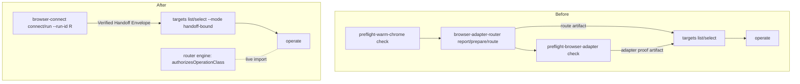
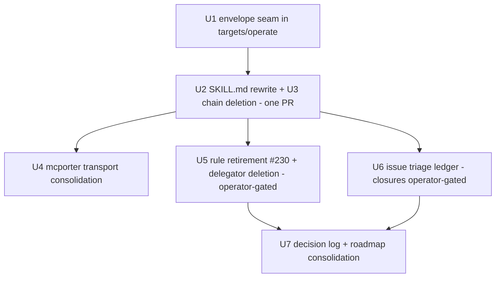

# browser-use migration and cleanup - Plan

## Goal Capsule

- **Objective:** migrate `skills/browser-use` to consume `runtime/browser-connect` for all browser connection, then delete the superseded connection machinery it replaces — router CLI chain, adapter preflight, thin warm-chrome delegator — with unreachability proven before every deletion. Close with the browser-access rule retirement, a stale-issue triage ledger, and one consolidated roadmap home.
- **Authority:** this plan's Product Contract, grounded in `docs/decisions/2026-07-14-001-browser-connect-architecture-decision-log.md` (ADR 0012 not reversed; router engine is the recorded adapter-fallback candidate) and `docs/plans/2026-07-14-001-feat-browser-connect-plan.md` (KTD8, System-Wide Impact). Where this plan and those records conflict, stop and surface.
- **Execution profile:** contract-first TDD — the envelope-acceptance seam (U1) lands red-test-first against real browser-connect envelope fixtures before any deletion unit starts. Skill rewrite and chain deletion land in one atomic change set (switchover precedent: split landings fail drift gates). No commits to main; feature branch; no new external dependencies.
- **Stop conditions:** any need to change browser-connect's envelope schema; any router-chain station whose test coverage cannot be proven through the full handler path (stop, port coverage — never blind-delete); any change to `rules/` outside the prompt-system workflow; issue closures without operator approval.
- **Operator-gated steps:** U5 (rule retirement via prompt-system-workflow) and U6 issue closures. Everything else is agent-executable.

---

## Product Contract

### Summary

browser-use becomes a pure consumer of browser-connect: agents connect through `browser-connect run`/`connect`, and browser-use's surviving surface (`targets`, `operate`) accepts the Verified Handoff Envelope as its binding evidence. The Router continuation chain, adapter preflight, and warm-chrome delegator are deleted after unreachability proof; the pure router engine survives as live code. The browser-access rule retires pointer-first, stale tracker issues get dispositions, and the recorded future pitches land in one roadmap home.

### Problem Frame

browser-connect slice one (merged in PR #236) made the browser-use Router chain's connection role obsolete: one command now proves Agent Chrome, injects the verified endpoint, and attaches an adapter. But browser-use still teaches the six-step Router chain as the front door, its `targets`/`operate` commands hard-gate on artifacts (`browser-use.browser-adapter-proof`, `browser-use.browser-adapter-router` envelopes with an R9 binding tuple) that only the superseded chain can mint, and `rules/browser-access.md` still directs agents to double-gate. Until migration lands, two systems claim the same job, ~4.7k lines of doomed tests are maintained, and the recorded roadmap is scattered across two decision logs and a plan's scope boundaries.

The blocker discovered in research: this is a contract migration, not a prose cleanup. The browser-connect envelope carries none of the binding-tuple fields (`adapter_proof_id`, `verified_endpoint_identity`, `warm_chrome_run_id`) that `targets`/`operate` validate today, and `browser-use-operations.ts` calls the router engine's `authorizesOperationClass` live. Deleting the chain before re-specifying that contract is deletion-by-breakage, not proof of unreachability.

### Actors

- A1. Coding agents (Claude Code, Codex) — the primary users of every surface here: SKILL.md workflow, CLI envelopes, `next_action_id` continuations, Repair Path anchors.
- A2. Nathan — operator for the rule retirement and issue closures; runs live smokes.
- A3. Downstream skills and rules that route browser work (`browser-use` skill body, `rules/browser-access.md` until retired).

### Requirements

**Contract migration**

- R1. `browser-use targets` and `browser-use operate` accept the browser-connect Verified Handoff Envelope as binding evidence; browser-use derives its own binding identity from envelope fields. browser-connect's envelope schema is untouched.
- R2. Recovery-mode target listing survives without an Adapter Proof artifact: recovery listing accepts the browser-connect envelope (or a `connect` failure state) as its evidence input.
- R3. One run id threads the chain: a caller-supplied `--run-id` on `browser-connect connect`/`run` is inherited by `targets` and `operate`; the run-id inheritance point moves from the route artifact to the envelope.
- R4. No dangling continuations: after deletion, no envelope emitted by any surviving command names a `next_action_id`, summary, or help string that references `browser-adapter-router` or `preflight-browser-adapter`. Enforced by a mechanical sweep, not review.
- R5. Operation capability authorization keeps working: `authorizesOperationClass` and the router model types stay live imports of the surviving surface.

**Skill and safety surface**

- R6. `skills/browser-use/SKILL.md` is rewritten through the skill-author workflow as a thin router: connection delegates to browser-connect; browser-use keeps operational policy (adapter choice, targets, operate, auth boundary, safety); Next Safe Action routes blocked agents to browser-connect commands and `runtime/browser-connect/REPAIR.md`.
- R7. Safety invariants survive the migration verbatim where they are not mechanically enforced: no cold-browser fallback, no Chrome for Testing, no convention endpoints, never mass-kill by port, secrets reported by shape only, and the continuation-precedence rule (a login/MFA wall after a passing preflight is an app step, not a preflight failure).

**Deletion**

- R8. The superseded chain is deleted only after per-file deletion tests and a coverage gate: router CLI (`browser-adapter-router.ts`), `browser-adapter-router-prepare.ts`, `-discovery.ts`, `-manifests.ts`, `-report-validation.ts`, `preflight-browser-adapter.ts`, `browser-adapter-map.ts` with its validated reference doc, and (rule-entangled, in U5) `preflight-warm-chrome.ts`. Bin entries, package scripts, `build-dist.ts` entrypoints, and the lockfile change in the same commit as their file deletions.
- R9. The load-bearing router cluster survives: `browser-adapter-router-engine.ts`, `-model.ts`, `-recovery.ts`, validation types, and the router constants in `command-contract.ts` that surviving files import.

**Rule, docs, and closure**

- R10. `rules/browser-access.md` retires pointer-first via the prompt-system workflow (issue #230), with an invariant-by-invariant disposition: each invariant is either mechanically enforced by browser-connect, carried in browser-connect ARCHITECTURE.md (never-mass-kill guidance already lives there verbatim), or kept in browser-use SKILL.md Safety.
- R11. The documentation sweep is enumerated and executed (nothing in CI gates these): browser-use CONTEXT.md glossary, `references/warm-chrome.md`, TEST_MATRIX.md, `runtime/warm-chrome` maintainer docs naming the deleted delegators, `skills/cli-author/references/cli-front-door-layouts.md` exemplar line, and an ADR 0012 disposition note recorded in a new decision log.
- R12. GitHub issues #136–#147 and #170 get a per-issue disposition ledger (keep / re-scope / close, with the new architecture as the yardstick); closures execute only after operator approval.
- R13. The recorded future pitches — UI-consent door (slice two), extension door (slice three), adapter fallback, per-agent target allocation, 1Password-backed login, operation floor — are consolidated in one roadmap home with a source pointer and a revival trigger each.

### Acceptance Examples

Each is driven envelope-only: the verifying agent may read JSON output and REPAIR.md, never source.

- AE1. **Covers R1, R3.** Given a running Agent Chrome, when an agent runs `browser-connect connect chrome-devtools-mcp --run-id R --json`, feeds the envelope to `targets list`, then `targets select`, then `operate`, then every emitted envelope carries run id `R` and the target-state path derives from `R`.
- AE2. **Covers R2.** Given no prior route evidence, when an agent runs recovery-mode `targets list` with only the browser-connect envelope, then it lists evidence-gathering candidates and its continuation names a command that exists.
- AE3. **Covers R4.** Given the post-deletion tree, when every `next_action_id` summary and help string across both command contracts is enumerated and grepped for the deleted command names, then there are zero hits.
- AE4. **Covers R7.** Given Agent Chrome is stopped, when `browser-connect connect` exits 20, then the failure envelope carries exactly one Repair Path whose versioned anchor resolves to a live REPAIR.md heading, and no surviving browser-use path falls back to a cold browser.
- AE5. **Covers R8.** Given the deletion PR, when reviewed, then it contains the recorded unreachability evidence (per-file deletion test results and the coverage-gate outcome), not just the deletions.

### Success Criteria

- An agent completes the full browser workflow (connect → targets → operate) with one run id and zero references to deleted commands.
- `skills/browser-use` sheds the router CLI chain, adapter preflight, and their ~4.7k lines of tests; the surviving package builds, tests, and passes workspace gates.
- One roadmap home answers "what's next for browser work" in one read.

### Scope Boundaries

**Deferred to follow-up work**

- Adapter fallback: revive the preserved router engine's evidence-first ranking. Revival trigger recorded in the roadmap: registry reaches 3+ adapters or the first wrong-adapter incident.
- Per-agent target/context allocation; slice two (UI-consent door); slice three (extension door); 1Password-backed login; operation floor; npm publication — all recorded in the roadmap home (R13), none implemented here.
- Native (non-mcporter) adapter transport — blocked on the 7-item parity checklist carried with the transport module.

**Outside this plan's identity**

- Changing browser-connect's envelope schema or weakening any warm-chrome/browser-connect proof.
- Capability confidence scoring or ranked adapter selection at the current registry size.
- A human route-status projection (`router status` equivalent) — classified Never unless a concrete need appears; browser-connect's dashboard is stateless by design.

### Dependencies / Assumptions

- browser-connect slice one is merged and green (PR #236); its `--run-id` is caller-suppliable with warm-chrome parity.
- The prompt-system workflow is the only legal editor of `rules/` (U5 routes through it).
- Assumption: the binding tuple's security intent (proof and route must describe the same verified endpoint) is satisfiable from envelope fields alone, since the envelope is minted by the same process that performed both proofs. If implementation finds a gap, that is a stop condition, not a shim opportunity.

### Sources / Research

- `docs/plans/2026-07-14-001-feat-browser-connect-plan.md` — KTD8 (transport duplication), System-Wide Impact (migration is the named follow-up), Scope Boundaries (deferred slices).
- `docs/decisions/2026-07-14-001-browser-connect-architecture-decision-log.md` — ADR 0009 consumed intact, ADR 0012 scoped non-consumption, V2 ideas list.
- `docs/decisions/2026-07-04-001-browser-use-warm-chrome-switchover-decision-log.md` — atomic code+doc landings; coverage gate before `git rm`; workspace-dep and build-guard precedent.
- `skills/browser-use/src/browser-use-discovery.ts` — `readAdapterProofFacts` / `readRouteFacts` parsers and the R9 binding-tuple equality check (the migration's hard seam).
- `runtime/browser-connect/src/model.ts`, `src/command-contract.ts` — Verified Handoff Envelope shape, run-id parity, repair-path affordances.
- `skills/skill-author/references/skill-design-decision-runbook.md` — deletion test per SKILL.md line; owner paths, not copied contracts.
- `lessons/0003-chrome-150-adapter-connection-map.html` — the three-door model; survives in browser-connect's route-capability registry (KTD7 there), not in the router chain.
- Learning (session memory): fakes must match real output shape — U1 keeps a process-boundary proof against the real browser-connect CLI, not only fixtures.

---

## Planning Contract

### Key Technical Decisions

- **KTD1 — Consumer-side envelope derivation.** browser-use parses the Verified Handoff Envelope and derives its own binding identity (adapter, endpoint identity, run id) from envelope fields. Rejected alternatives: browser-connect growing consumer fields (pollutes its adapter-agnostic envelope, violates its R8) and native cross-package type imports without a version pin. browser-use pins `BROWSER_CONNECT_SCHEMA_VERSION` as its drift tripwire, making it the envelope's second contract-pinned consumer (after browser-connect's own pin on warm-chrome).
- **KTD2 — Mode rename: `route-bound` → `handoff-bound`.** The mode's evidence becomes a Verified Handoff Envelope; keeping "route-bound" would silently re-ground "route" from the Router's route artifact to browser-connect's attachment route — exactly the term drift the glossary discipline exists to catch. `recovery` mode keeps its name. Glossary contrast updated in the same diff.
- **KTD3 — Engine survival is load-bearing, not sentimental.** `authorizesOperationClass` (engine) and the router model types are live imports of `browser-use-operations.ts` and friends, so the surviving cluster is `engine + model + recovery + validation types + router constants` (~1.6k lines with tests). The severable chain (router CLI, prepare, discovery, manifests, report-validation) is what gets deleted. This dissolves the "dormant code rots" concern: the fallback candidate stays exercised by the surviving surface's tests. A decision log records the post-migration ADR 0012 state.
- **KTD4 — Deletion proof protocol.** Per file: (1) deletion test — does removing it change surviving-surface behavior?; (2) coverage gate — each error station a deleted test pinned is either obsolete with its command or ported to the surviving contract's tests through the full handler path; (3) atomic bin removal — `package.json` bin+scripts, `build-dist.ts` entrypoints (its `verifyDist` fails on unexpected *or missing* dist files), `bun.lock` regen via install, and SKILL.md prose change together. Evidence is recorded in the PR (AE5).
- **KTD5 — mcporter consolidation is a contract merge, not a dedupe.** browser-connect holds no file copy — it reimplemented the no-shell argv shape because `browser-use-scripts` exports no module surface. Direction: a small shared workspace package owning the command-vector types, no-shell spawn, and the 7-item native-transport parity checklist (precedent: `@side-quest/cli-test-fixtures`); browser-use imports it, browser-connect's registry adopts the shared spawn seam. Fallback if the shapes resist merging: keep browser-connect's package-local shape and add a drift-tripwire test instead. The `BROWSER_USE_MCPORTER_COMMAND_JSON` env channel keeps working through the move.
- **KTD6 — Rule retirement and delegator deletion travel together.** `rules/browser-access.md` names `preflight-warm-chrome.ts` as the thin delegator, so that file's deletion sequences with the rule update inside U5, operator-gated, via prompt-system-workflow. The delegator carries real behavior (the `BROWSER_USE_*` → `WARM_CHROME_*` env bridge and an unhandled-failure net); its removal retires that compatibility channel deliberately, named in the decision log.
- **KTD7 — Roadmap home: `runtime/browser-connect/TASKS.md` under a `## Roadmap` section.** Repos own operational truth, and five of the six pitches are browser-connect product features. One line per pitch: name, source pointer, revival/entry trigger. `skills/browser-use/TASKS.md` points at it. Rejected: a standalone docs/ roadmap file (a second home to drift) and the Notion tracker (wrong audience for architecture pitches).
- **KTD8 — Issue triage is ledger-first.** U6 produces a per-issue disposition with evidence against the new architecture; closures and re-scopes execute only after operator approval. Matches the repo's ask-before-destructive-ops rule.

### High-Level Technical Design

The contract seam before and after — the binding tuple's producer changes, the validator stays browser-use-owned:

Unit sequencing — U2+U3 are one atomic change set; U5 and U6 are operator-gated:

---

## Implementation Units

### U1. Envelope-acceptance seam in targets/operate

- **Goal:** `targets` and `operate` run from a Verified Handoff Envelope; the Router/proof artifact inputs are no longer required by any surviving path.
- **Requirements:** R1, R2, R3, R5; AE1, AE2.
- **Dependencies:** none.
- **Files:** `skills/browser-use/src/command-contract.ts`, `browser-use-discovery.ts`, `browser-use-selection.ts`, `browser-use-operations.ts`, `browser-use-core.ts`, `browser-use-test-helpers.ts`, `browser-use-discovery.test.ts`, `browser-use-selection.test.ts`, `browser-use-operations.test.ts`, `browser-use.test.ts`.
- **Approach:** redesign the evidence contract: replace the `--route` + `--adapter-proof` input pair with one `--handoff` envelope input (KTD1 derivation, KTD2 rename); rewrite `readRouteFacts`/`readAdapterProofFacts` into one envelope parser validating contract id, schema version, and `data.ok`; move run-id inheritance to the envelope; rewrite the binding-mismatch diagnostic family and the `supply_adapter_proof`/`refresh_adapter_proof`/`prepare_with_target_discovery` continuations into envelope-era vocabulary; recovery mode accepts the envelope (or explicit no-evidence entry) instead of an adapter proof. Keep `authorizesOperationClass` wiring intact — capability authorization now reads the envelope's attachment fields.
- **Execution note:** test-first against *real* `browser-connect connect --json` output captured as fixtures, plus one process-boundary test that invokes the real browser-connect CLI (fakes must match real output shape — a compact-vs-pretty JSON fake has hidden a real parse bug in this repo before).
- **Test scenarios:** valid envelope → handoff-bound listing succeeds and inherits its run id; wrong contract id, wrong schema version, `ok:false`, and missing attachment fields each → typed rejection with exactly one continuation; caller `--run-id` disagreement with envelope run id → typed mismatch; recovery listing with envelope-only evidence returns evidence-gathering candidates; operate refuses an operation class the envelope's adapter does not authorize; operate accepts one it does.
- **Verification:** package tests green via the repo test runner; the process-boundary proof runs the real browser-connect binary; no surviving file imports `browser-adapter-router-prepare`, `-discovery`, `-manifests`, or `preflight-browser-adapter`.

### U2. SKILL.md rewrite via skill-author

- **Goal:** the skill teaches the browser-connect front door and keeps only operational policy.
- **Requirements:** R6, R7.
- **Dependencies:** U1 (lands in the same PR as U3).
- **Files:** `skills/browser-use/SKILL.md`, `skills/browser-use/CONTEXT.md`, `skills/browser-use/references/warm-chrome.md`, `skills/browser-use/TEST_MATRIX.md`.
- **Approach:** run the skill-author workflow (read `skills/skill-author/references/skill-design-decision-runbook.md` first — hard rule). New shape: name the outcome → connect via `browser-connect run <adapter> -- <cmd>` or `connect <adapter> --json` with one run id → `targets`/`operate` for page work → Next Safe Action routes each blocked state to a browser-connect command and its REPAIR.md anchor. Keep verbatim: the safety invariants (R7), the continuation-precedence rule, auth-pointer boundary, re-snapshot-before-ref-actions guidance. Delete the Router chain workflow, the Router owner lines, and every owner path whose file U3 deletes. Rewrite `references/warm-chrome.md` to point at browser-connect as the front door; archive TEST_MATRIX.md's preflight-keyed live-smoke ledger and replace it with a one-table matrix for the migrated chain (AE1–AE4). Update CONTEXT.md glossary: retire Router-era terms, add the handoff-bound contrast (KTD2), keep the Verified Handoff Envelope / Browser Entry Handoff mirror.
- **Test scenarios:** `Test expectation: none — prose and references; gated by the workspace facade SKILL.md prose check (no bare bin invocations) and the U3 no-dangle sweep.`
- **Verification:** skill-author verification gate passes; YAML frontmatter parses; `rg 'browser-adapter-router|preflight-browser-adapter' skills/browser-use/SKILL.md` is empty.

### U3. Chain deletion with unreachability proof

- **Goal:** the severable chain is gone, with recorded evidence it was unreachable.
- **Requirements:** R4, R8, R9; AE3, AE5.
- **Dependencies:** U1; atomic with U2.
- **Files:** delete `skills/browser-use/src/browser-adapter-router.ts`, `browser-adapter-router-prepare.ts`, `-discovery.ts`, `-manifests.ts`, `-report-validation.ts`, `preflight-browser-adapter.ts`, `browser-adapter-map.ts`, their test files, and `references/browser-adapter-chrome-devtools.md` (validator and validated doc go together); modify `skills/browser-use/package.json` (bins + scripts), `src/build-dist.ts` (entrypoints), `bun.lock`, `src/browser-use-parser.ts` (help prose names the Router chain), `src/command-contract.ts` (retire the deleted commands' contract families and sweep continuation strings).
- **Approach:** apply KTD4 per file: run the deletion test, then the coverage gate — enumerate which stations in `browser-adapter-router.test.ts` and `preflight-browser-adapter.test.ts` pin behavior the surviving contract still has (binding mismatch semantics, recovery continuations) and port those to U1's tests before `git rm`; everything else dies with its command. Keep the surviving cluster (KTD3) including the router constants surviving files import. Then the atomic bin removal (KTD4 step 3). Finish with the mechanical no-dangle sweep: enumerate every `next_action_id` summary, recovery prose, and help string in surviving contracts and grep for deleted command names.
- **Execution note:** the sweep is a gate, not a review note — wire it as a test or a check script run in CI-equivalent verification, so AE3 stays true after future edits.
- **Test scenarios:** Covers AE3 — contract-string sweep finds zero references to deleted commands; surviving package builds with the shrunk entrypoint list (`verifyDist` exact-set passes); `bun run check:workspace-facade` green (lockfile bin markers match shrunk bin set); ported station tests reach their reasons through the full handler path.
- **Verification:** deletion PR carries the recorded deletion-test and coverage-gate evidence (AE5); `prove:workspace-portability` green; command-entrypoint integration test untouched (it never referenced browser-use bins).

### U4. mcporter transport consolidation

- **Goal:** one owner for the no-shell argv transport contract; KTD8 from the browser-connect plan is closed.
- **Requirements:** R11 (KTD8 disposition recorded).
- **Dependencies:** U3 (consumer set is smaller and final).
- **Files:** new workspace package (e.g. `runtime/mcporter-transport/` with `package.json`, `src/index.ts`, tests); `skills/browser-use/src/mcporter-transport.ts` (deleted or reduced to a re-export during the same change), `browser-use-transport.ts`, `browser-use-runtime.ts`, `browser-use-operations.ts`, `browser-use-test-helpers.ts`; `runtime/browser-connect/src/adapters/registry.ts` (adopt the shared spawn seam or gain the drift-tripwire test per KTD5 fallback); root `package.json`/`bun.lock` workspace wiring.
- **Approach:** KTD5. Extract the command-vector resolution, no-shell spawn-with-timeout, and the parity checklist into the shared package; browser-use imports it and keeps its mcporter-specific env channel (`BROWSER_USE_MCPORTER_COMMAND_JSON`) working; browser-connect adopts the shared seam where its `AdapterRuntime` shape allows. Verify the build guard passes after bundling a new workspace dep (proven for warm-chrome, but run it — don't assume it generalizes).
- **Test scenarios:** command-vector resolution honors the env override and rejects shell strings; spawn enforces the bounded timeout and exit-127 → dependency-missing mapping; browser-use transport tests pass unchanged against the shared import; browser-connect adapter probe behavior unchanged (its existing station tests stay green).
- **Verification:** both packages typecheck and test green; `check:workspace-facade` and `prove:workspace-portability` accept the new package; KTD8's open question in the browser-connect plan is answerable with a path.

### U5. Rule retirement and delegator deletion (operator-gated)

- **Goal:** `rules/browser-access.md` retired pointer-first; the coexistence window (issue #230) closed; `preflight-warm-chrome.ts` deleted.
- **Requirements:** R8 (delegator), R10.
- **Dependencies:** U2+U3 landed (invariants must be enforced or re-homed before the rule that carried them retires).
- **Files:** `rules/browser-access.md` (via prompt-system-workflow — not direct edit), `skills/browser-use/src/preflight-warm-chrome.ts` + test (delete), `skills/browser-use/package.json` (bin/script), `src/build-dist.ts`, `bun.lock`; sweep `runtime/warm-chrome/AGENTS.md`, `README.md`, `CONTEXT.md`, `TASKS.md` (delegator references); `runtime/browser-connect/TASKS.md` (close the #230 follow-up); `skills/browser-use/package.json` dependency on `@side-quest/warm-chrome` removed if no surviving file imports it after this unit.
- **Approach:** invoke the prompt-system workflow for the rule change with the invariant-by-invariant disposition (R10): endpoint-from-envelope and fail-closed → mechanically enforced by browser-connect; never-mass-kill → already verbatim in browser-connect ARCHITECTURE.md plus browser-use SKILL.md Safety; gate-before-connect → SKILL.md front-door prose. The workflow decides whether the rule becomes a pointer stub or is removed; this plan supplies the evidence, not the outcome. Delete the delegator in the same change set the rule update lands in (KTD6), with the atomic bin-removal protocol.
- **Execution note:** operator-gated end to end — present the disposition evidence, then wait for Nathan's approval inside the prompt-system workflow before any `rules/` change lands.
- **Test scenarios:** `Test expectation: none — rule prose and deletions; gated by prompt-system health checks, the workspace facade check, and the U3-style sweep extended to `preflight-warm-chrome`.`
- **Verification:** prompt-system workflow health checks pass; issue #230 closeable with the landed change as evidence; no repo file outside `docs/` history names `preflight-warm-chrome` as a live command.

### U6. Stale-issue triage ledger (closures operator-gated)

- **Goal:** every stale browser issue has a disposition against the new architecture.
- **Requirements:** R12.
- **Dependencies:** U2+U3 landed (the new architecture is the yardstick).
- **Files:** ledger appended to the U7 decision log (no new doc); GitHub issues #136, #137, #138, #139, #140, #141, #142, #143, #144, #145, #146, #147, #170 (the full R12 set, all verified open) via `gh`.
- **Approach:** KTD8 — for each issue: restate its intent, judge it against the migrated surface (e.g. #170's run-id coupling documentation is resolved by R3's one-run-id contract; the runbook/recorder/browser-domain-memory cluster #136–#144 predates browser-connect and needs re-scoping onto the roadmap or closing; #146–#147 glossary/consult-gate items may be absorbed by U2's sweep), and record keep / re-scope / close with one line of evidence. Present the ledger; execute approved closures with a comment linking the migration PR and this plan.
- **Test scenarios:** `Test expectation: none — triage judgment; the ledger itself is the artifact.`
- **Verification:** every listed issue has a disposition; no closure executed without approval recorded in the conversation.

### U7. Decision log and roadmap consolidation

- **Goal:** the migration is durable memory; the future has one home.
- **Requirements:** R11, R13.
- **Dependencies:** U5, U6.
- **Files:** new `docs/decisions/` entry via the record-decision skill (migration decisions, ADR 0012 post-migration disposition note, KTD6 env-channel retirement, KTD8 closure, U6 ledger); `runtime/browser-connect/TASKS.md` (`## Roadmap` section per KTD7); `skills/browser-use/TASKS.md` (pointer to the roadmap home); `skills/cli-author/references/cli-front-door-layouts.md` (update the "6 contracts" exemplar line); annotate `skills/browser-use/docs/INDEX.md` / `PRODUCT-BASELINE.md` as historical where they describe deleted machinery (annotate, don't rewrite history).
- **Approach:** the decision log names the relationship to prior decisions explicitly (the repo's precedent): ADR 0009 still intact, ADR 0012's browser-use governance ends at this migration with the engine surviving as the fallback candidate, ADR 0006's note still deferred to slice two. Roadmap section: six pitches, one line each — name, source pointer, trigger (adapter fallback's trigger from KTD3/Scope Boundaries; slice two/three already sequenced; target allocation on first concurrent-agent collision; 1Password login on first auth-blocked runbook; operation floor only after multiple adapters connect reliably).
- **Test scenarios:** `Test expectation: none — documentation; verified by link-level review.`
- **Verification:** decision log exists and names prior-decision relationships; both TASKS.md files agree on the single roadmap home; a fresh-session agent asking "what's next for browser work" is answered by one file.

---

## System-Wide Impact

- **Agent workflow contract changes shape.** Every agent that learned the Router chain re-learns a two-step front door (browser-connect → targets/operate). The skill body, continuations, and REPAIR.md anchors are the only re-teaching surface — which is why R4's no-dangle sweep is a hard gate.
- **browser-connect gains its second contract-pinned consumer.** browser-use pins the envelope schema version (KTD1); future envelope changes now have a cross-package tripwire on each side (warm-chrome ← browser-connect ← browser-use).
- **The instruction topology shrinks.** `rules/browser-access.md` retires (U5); session-start prose is replaced by mechanical enforcement plus SKILL.md safety lines. Until U5 lands, the double-gating coexistence window stays open — that window closing is the plan's most user-visible effect.
- **Workspace surface changes.** browser-use-scripts drops four bins (five with the delegator), possibly its warm-chrome dependency; one new shared transport package may join the workspace (U4). Root gates (`check:workspace-facade`, `prove:workspace-portability`) cover all of it; the root `check:workspace-facade` script's hardcoded browser-use build step keeps working since the package and its build remain.

## Risks & Mitigations

- **Seam under-specification** — if the envelope cannot satisfy the binding tuple's security intent, handoff-bound mode is unbuildable as specified. *Mitigation:* the Dependencies assumption names this a stop condition; U1 is sequenced first so the discovery costs nothing downstream.
- **Deletion window breakage** — between U1 and U3 both evidence paths exist; landing U2/U3 non-atomically strands the skill naming dead commands. *Mitigation:* U2+U3 one PR (switchover precedent), no-dangle sweep as a test.
- **Doc drift is un-gated** — no CI reads SKILL.md/CONTEXT.md/TEST_MATRIX.md here. *Mitigation:* R11 enumerates the sweep file-by-file; U3's sweep is mechanical where it can be.
- **Coverage illusion in dying tests** — 4.7k lines of tests vanish; some pin semantics the surviving contract still owns. *Mitigation:* KTD4's coverage gate with the recorded stop condition (port, never blind-delete).
- **Operator bottleneck** — U5/U6 gates could stall the tail. *Mitigation:* both are sequenced after the atomic landing, so the code value ships regardless; the gates hold only prose and closures.

---

## Verification Contract

| Gate | Command | Applies to | Done signal |
|---|---|---|---|
| Types | package `typecheck` per touched package (via repo runners) | U1, U3, U4, U5 | zero errors |
| Unit + contract tests | browser-use and browser-connect test suites via the repo test runner | U1, U3, U4 | green; ported stations reach reasons through full handler path |
| Process-boundary proof | U1's real-binary test invoking `browser-connect connect --json` | U1 | envelope parsed from the real CLI, not only fixtures |
| No-dangle sweep | contract-string sweep (test or check script) for deleted command names | U3, U5 | zero hits (AE3) |
| Workspace shape | `bun run check:workspace-facade` | U3, U4, U5 | zero findings |
| Portability | `bun run prove:workspace-portability` | U3, U4 | green |
| Live smoke | AE1 chain and AE4 fail-closed run on a real Agent Chrome | U1–U3 | both observed, one run id end to end |
| Instruction health | prompt-system workflow health checks | U5 | pass; #230 closeable |

Run `fallow` after the implementation lands; file a `skill-feedback` closeout for the skill-author run (U2).

## Definition of Done

- AE1–AE5 each enforced by a named test, sweep, or recorded live smoke.
- The severable chain, adapter preflight, delegator, and their bins/tests are deleted with recorded unreachability evidence; the engine cluster survives with green tests.
- SKILL.md teaches only the browser-connect front door; safety invariants and continuation-precedence rule present verbatim.
- `rules/browser-access.md` disposition landed through the prompt-system workflow; issue #230 closed.
- Issue ledger complete; approved closures executed with linked evidence.
- Decision log and single roadmap home landed; browser-use and browser-connect TASKS.md agree on it.
- No abandoned experimental code in the final diff.
