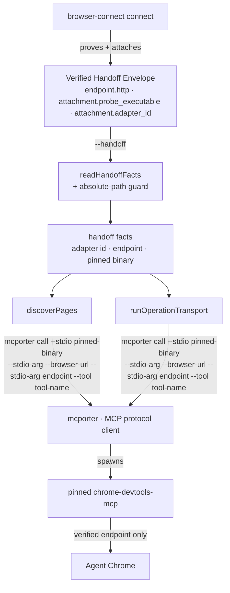
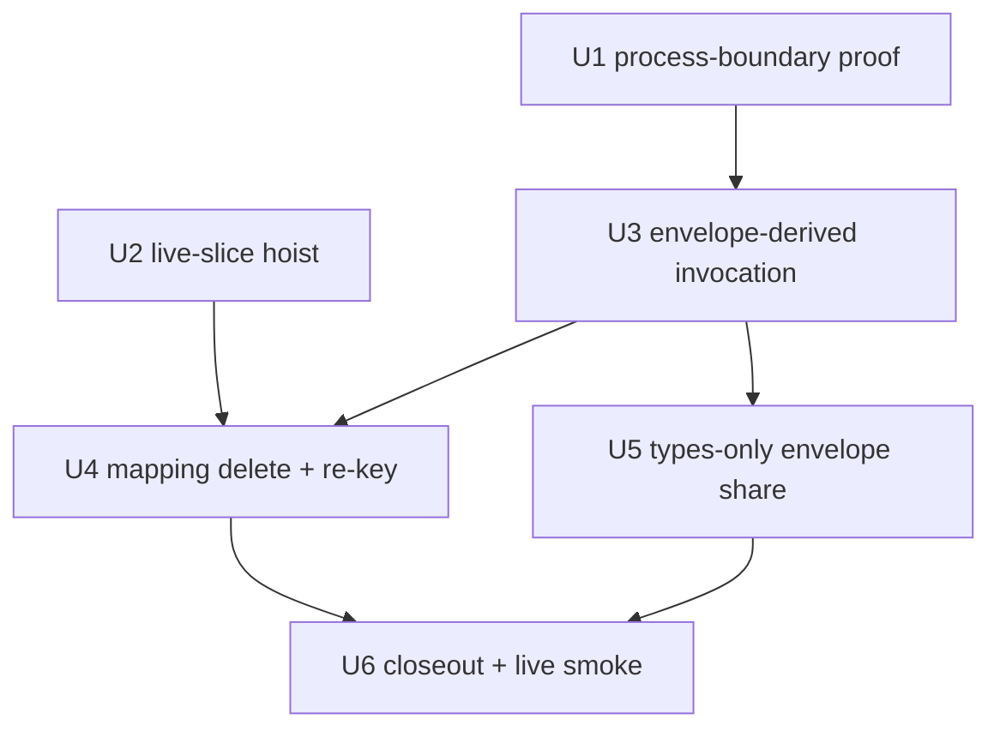

# Envelope-Derived Browser Transport - Plan

## Goal Capsule

- **Objective:** browser-use derives every live adapter invocation from the Verified Handoff Envelope — pinned adapter binary and verified endpoint — deleting the user-level mcporter static-config seam, the two-name adapter vocabulary, and the untested-real-shape gap at the adapter output seam.
- **Authority hierarchy:** this plan → `docs/decisions/2026-07-16-001-browser-use-migration-cleanup-decision-log.md` and `docs/decisions/2026-07-14-001-browser-connect-architecture-decision-log.md` (recorded decisions are not re-litigated) → package CONTEXT.md vocabulary.
- **Stop conditions:** do not modify the dormant router cluster files beyond the named U2 hoist edges (Decision 2 deny-list); do not import the envelope pin constants from browser-connect (Decision 1); never kill a CDP listener by port; never stage `settings.json`; no commits to `main` — feature branch per unit group.
- **Execution profile:** each unit lands as a PR-sized slice; U1's proof lands before U3 changes the transport.

---

## Product Contract

### Summary

Re-anchor browser-use's live transport on the Verified Handoff Envelope: mcporter stays as the MCP protocol client but is fed an ad-hoc, envelope-derived server per call instead of resolving `chrome-devtools` from `~/.config/mcporter/mcporter.json`. A process-boundary proof of the real adapter output lands first. The adapter-id mapping deletes, the live capability slice hoists out of the dormant router cluster, and the envelope type is shared types-only.

### Problem Frame

Endpoint authority (warm-chrome R8: the ok envelope is the only endpoint authority) is honored up to the envelope and then abandoned: `discoverPages` and the operation transport call `mcporter call chrome-devtools.<tool>`, which resolves a server from user-level static config and re-attaches to Chrome on whatever endpoint that config names. The envelope's `attachment.probe_executable` and `endpoint.http` are validated and dropped — zero live reads. This produced real friction in live smoke (hand-wired config entry, silently stale `--browser-url`) and an hour of debugging traced to the same adapter carrying two names across the seam (`chrome-devtools-mcp` in browser-connect's registry, `chrome-devtools` as the mcporter server name). Separately, the adapter-output parsers (`parsePagesText` and peers) are tested only against hand-authored fixtures — the defect class that already produced the PR #241 bug and the never-worked `targets list | select` pipe (Decision 4).

### Requirements

**Transport authority**

- R1. browser-use derives the adapter invocation for discovery and operations — binary and endpoint — from the Verified Handoff Envelope, not from user-level mcporter config.
- R2. The endpoint injected into the adapter is the envelope's `endpoint.http` verbatim (R8 endpoint authority holds to the spawn).
- R3. No browser-stack code path consumes a configured mcporter server name; the `~/.config/mcporter/mcporter.json` entry becomes inert.

**Adapter identity**

- R4. browser-use keys adapters on the envelope's `attachment.adapter_id` verbatim; the `BROWSER_CONNECT_ATTACHMENT_ADAPTERS` mapping is deleted.
- R5. Capability policy re-keys onto envelope adapter ids through a browser-use-owned live registry; the retained R9 registry vocabulary is not edited.

**Proof**

- R6. A process-boundary test proves the real mcporter + pinned-adapter output shape for page listing (and operation output where a hermetic arm can reach it) before the transport change lands.

**Structure**

- R7. Live code no longer imports from `browser-adapter-router-*` files; the dormant cluster survives intact as the recorded adapter-fallback candidate.
- R8. browser-use consumes the envelope payload type via a types-only import from browser-connect; the contract-id and schema-version pin constants stay duplicated in browser-use (the KTD1 runtime tripwire is unchanged).

**Behavior preservation**

- R9. The transport failure taxonomy (`dependency_missing`, `command_override_invalid`, `transport_timeout`, `execution_failed`) and the `BROWSER_USE_MCPORTER_COMMAND_JSON` override channel are preserved.
- R10. Fail-closed posture is preserved: a missing or non-absolute pinned adapter path in the envelope rejects as handoff-invalid; no fallback to configured servers, PATH guessing, or cold browsers.

### Scope Boundaries

#### Deferred to Follow-Up Work

- Native no-mcporter transport (speaking MCP stdio directly) — remains the recorded V2 behind the seven-item parity checklist in `runtime/mcporter-transport/src/index.ts`.
- warm-chrome bin declare-or-collapse — independent decision awaiting the operator's answer on standalone diagnostic use.
- R9 dormant cluster retirement-or-revival — owned by Decision 2's named triggers (3+ adapters, or first wrong-adapter incident).
- `agent-browser` / `playwright-cdp` operation transports — discovery still fails closed for adapters without an implemented transport, unchanged.

---

## Planning Contract

### Key Technical Decisions

- **KTD1 — mcporter stays as the MCP protocol client; the server is derived ad-hoc per call.** `list_pages` / `take_snapshot` / `take_screenshot` / `emulate` are MCP tools, so something must speak the protocol; browser-connect's direct-spawn probe works only because `--list-tabs` is a one-shot CLI flag. mcporter 0.12.2's ad-hoc stdio flags (`--stdio <command>`, repeated `--stdio-arg`, `--tool`) let the invocation carry the envelope's pinned binary and `--browser-url <endpoint.http>` with no config lookup. This fixes parity-checklist item 3 (verified loopback binding) without triggering the checklist itself.
- **KTD2 — proof lands first.** U1 pins the exact ad-hoc selector syntax empirically and captures the real output shapes the parsers must accept, so the transport change is written against observed reality, not intended shape (Decision 4's lesson, extended to this seam).
- **KTD3 — minimal trust guard on the pinned path.** The envelope is consumed verbatim per endpoint-authority doctrine, but the spawn input gets one structural check: `attachment.probe_executable` must be an absolute path. Anything else rejects as handoff-invalid. No re-verification — browser-connect already proved the attachment.
- **KTD4 — hoist before re-key.** U2 extracts the live slice (`authorizesOperationClass`, `OPERATION_CLASS_CAPABILITY`, and the seven live model types) into `capability-policy.ts` and `discovery-model.ts`. The dormant engine imports `OPERATION_CLASS_CAPABILITY` back from `capability-policy.ts` — a one-way dormant→live edge — rather than keeping a drift-prone duplicate. The `Pick<RouteBinding, …>` parameter inlines to a structural type; the live call site already passes an ad-hoc literal.
- **KTD5 — live adapter identity is a new browser-use-owned union keyed by envelope ids.** `BrowserAdapterId` re-points to envelope ids (`chrome-devtools-mcp`, `agent-browser`, `playwright-cdp`); the capability table re-keys onto it. `BROWSER_ADAPTER_ROUTER_ADAPTERS` and the rest of the retained R9 vocabulary stay untouched as dormant-cluster property (Decision 2).
- **KTD6 — types-only envelope share.** browser-connect adds a `./contract` subpath exporting a pure-types module (split from `model.ts`, which mixes 23 value exports). browser-use imports the payload type with `import type`; the pin constants stay duplicated locally so a schema rev still fails closed on an unrevised consumer (Decision 1 preserved). browser-use's dist guard already throws if `cli-command-facade` leaks into the bundle, mechanically catching an accidental value import.

### High-Level Technical Design

Transport path after the change (was: mcporter resolving `chrome-devtools` from `~/.config/mcporter/mcporter.json` and re-attaching on an unverified endpoint):

Unit dependencies:

### Assumptions

- mcporter's ad-hoc `--stdio` selector composes with `--tool` and `--args`/`--output json` the way its help text describes; U1 verifies before anything depends on it. If the composition fails, fall back to `--stdio` with a `--name`-qualified `name.tool` selector; if ad-hoc stdio cannot express the call at all, stop and re-open KTD1 (this is a named stop condition, not a silent pivot to the native transport).
- Per-call adapter spawn cost is comparable to today: `mcporter call` already starts the configured stdio server per invocation, so no latency regression is expected. U6's live smoke confirms.
- The selected-state file that carries handoff facts between `targets select` and `operate` can carry the two new fields (pinned binary, endpoint) without a state-schema version bump; if implementation finds a pinned state contract, the schema rev lands in U3 with its own fixture update.

---

## Implementation Units

### U1. Process-boundary proof of the real adapter output seam

- **Goal:** pin the ad-hoc mcporter invocation syntax and capture the real output shapes for the parsers, before any transport change.
- **Requirements:** R6.
- **Dependencies:** none.
- **Files:** `skills/browser-use/src/mcporter-adapter-process-boundary.test.ts` (new); pattern source `skills/browser-use/src/browser-connect-process-boundary.test.ts`.
- **Approach:** two arms. Hermetic arm: spawn real `mcporter call --stdio <pinned chrome-devtools-mcp path> --stdio-arg --browser-url --stdio-arg <fixture endpoint> --tool list_pages --output json` against a fixture CDP responder; assert the invocation is accepted and capture the verbatim failure/success envelope shapes. Live arm (pending-operator, TEST_MATRIX row): same call against real Agent Chrome capturing real `list_pages` and `take_snapshot` output, fed through `parsePagesText` / `extractRawPages`. Record the observed selector syntax as the contract U3 implements.
- **Execution note:** this unit is deliberately red-first for the whole plan — write it against the current parsers so any shape mismatch surfaces here, not in U3.
- **Test scenarios:**
  - Hermetic: ad-hoc invocation with a valid pinned path and unreachable endpoint exits non-zero with a parseable error (captures the dependency/attachment failure shape).
  - Hermetic: ad-hoc invocation with a missing binary path surfaces the exit-127 dependency-missing family through `runBrowserUseMcporter`'s taxonomy.
  - Live (pending-operator): real `list_pages` output parses to non-empty `RawPage[]` with `id`/`url` populated; real `take_snapshot` output round-trips the operation parser.
- **Verification:** hermetic arm green in CI via the test-runner script; live arm evidence recorded in `skills/browser-use/TEST_MATRIX.md` with run id, or explicitly marked pending-operator.

### U2. Hoist the live slice out of the dormant router cluster

- **Goal:** live code stops importing from `browser-adapter-router-*` files; the dormant cluster stays intact and self-contained.
- **Requirements:** R7.
- **Dependencies:** none (parallel with U1).
- **Files:** `skills/browser-use/src/capability-policy.ts` (new), `skills/browser-use/src/discovery-model.ts` (new), `skills/browser-use/src/browser-adapter-router-engine.ts` (import-only edit), `skills/browser-use/src/browser-use-discovery.ts`, `skills/browser-use/src/browser-use-operations.ts`, `skills/browser-use/src/browser-use-core.ts`, `skills/browser-use/src/browser-use-selection.ts`, `skills/browser-use/src/capability-policy.test.ts` (new).
- **Approach:** move `authorizesOperationClass` + `OPERATION_CLASS_CAPABILITY` + `BrowserOperationClass` into `capability-policy.ts`; inline the `Pick<RouteBinding, "authorized_capabilities">` parameter as a structural type. Move the four pure-live discovery types plus the `BrowserAdapterId` / `AdapterCapability` aliases into `discovery-model.ts`. Engine re-imports `OPERATION_CLASS_CAPABILITY` from `capability-policy.ts` (KTD4). No other dormant-file edits.
- **Patterns to follow:** the extraction map in this plan's sources; existing type-alias style in `command-contract.ts`.
- **Test scenarios:**
  - `authorizesOperationClass` authorizes `snapshot` for a binding carrying `snapshot_refs` and rejects `emulate` for a binding without `viewport_emulation` (direct unit test in the new module).
  - Existing `browser-use-operations.test.ts` capability-authorization cases pass unchanged.
  - A grep-shaped assertion (or the existing no-dangle suite) shows no live module imports `browser-adapter-router-` paths.
- **Verification:** browser-use suite green; typecheck green; dormant files' diffs limited to the engine import swap.

### U3. Envelope-derived adapter invocation

- **Goal:** discovery and operations build the mcporter invocation from handoff facts; the configured-server path is deleted.
- **Requirements:** R1, R2, R3, R9, R10.
- **Dependencies:** U1.
- **Files:** `skills/browser-use/src/browser-use-discovery.ts`, `skills/browser-use/src/browser-use-operations.ts`, `skills/browser-use/src/browser-use-transport.ts`, `skills/browser-use/src/browser-use-discovery.test.ts`, `skills/browser-use/src/browser-use-operations.test.ts`, `skills/browser-use/src/browser-use-transport.test.ts`.
- **Approach:** `readHandoffFacts` starts carrying `probeExecutable` and `endpointHttp` into facts, with the KTD3 absolute-path guard rejecting as handoff-invalid. `discoverPages` and `runOperationTransport` take the facts and build the ad-hoc argv pinned by U1 (`call --stdio … --tool <tool> --args <json> --output json`) through the existing `runBrowserUseMcporter` seam, so the override channel and failure mapping are untouched. The selected-state persistence carries the two new fields. Delete the `${adapter}.tool` configured-server call form.
- **Test scenarios:**
  - Verified envelope with absolute `probe_executable` → discovery issues argv containing the pinned path and `--browser-url <endpoint.http>` (assert on the fake runtime's captured argv).
  - Envelope with relative or missing `probe_executable` → handoff-invalid rejection, `supply_verified_handoff` action, binding fail-closed exit code.
  - Missing binary at spawn → `dependency_missing`; timeout → `transport_timeout`; both unchanged from today's taxonomy.
  - Operate path: snapshot/screenshot/emulate argv all carry the envelope-derived server portion; screenshot still passes `filePath`/`fullPage` args.
  - State round-trip: `targets select` persists the new fields; `operate` consumes them without re-reading the envelope file.
- **Verification:** suites green through the test-runner script; U1's hermetic arm passes against the new call-builder unchanged (same syntax contract).

### U4. Delete the adapter-id mapping; re-key live identity to envelope ids

- **Goal:** one adapter vocabulary across the seam — the envelope's.
- **Requirements:** R4, R5.
- **Dependencies:** U2, U3.
- **Files:** `skills/browser-use/src/command-contract.ts`, `skills/browser-use/src/discovery-model.ts`, `skills/browser-use/src/browser-use-discovery.ts`, `skills/browser-use/src/browser-use-core.ts`, affected test files.
- **Approach:** introduce the live envelope-id union (KTD5); re-point `BrowserAdapterId` and re-key `BROWSER_USE_ADAPTER_OPERATION_CAPABILITIES`; `BROWSER_USE_TRANSPORT_ADAPTERS` becomes `["chrome-devtools-mcp"]`; delete `BROWSER_CONNECT_ATTACHMENT_ADAPTERS` and `mappedAdapterId` — `readHandoffFacts` validates `attachment.adapter_id` directly against the live union. `isBrowserAdapterId` in core keys off the new union. R9 vocabulary in `command-contract.ts` is left byte-identical.
- **Test scenarios:**
  - Envelope naming `chrome-devtools-mcp` → verified facts with that id and its capabilities.
  - Envelope naming an unregistered adapter id → fail-closed handoff-invalid (message no longer mentions mapping).
  - Discovery for `agent-browser` (registered, no transport) still fails closed with `target_discovery_transport_failed`.
  - No-dangle: `"chrome-devtools"` as a bare server name no longer appears in live output or argv.
- **Verification:** suites + typecheck green; grep shows `BROWSER_CONNECT_ATTACHMENT_ADAPTERS` gone and R9 constants untouched.

### U5. Types-only envelope share

- **Goal:** envelope-shape knowledge lives in one place; field drift becomes a compile error.
- **Requirements:** R8.
- **Dependencies:** U3 (same parse region; sequenced to avoid conflicts).
- **Files:** `runtime/browser-connect/src/contract.ts` (new, pure types split from `src/model.ts`), `runtime/browser-connect/package.json` (add `./contract` export), `runtime/browser-connect/src/model.ts` (re-export types from contract), `skills/browser-use/src/browser-use-discovery.ts`, `skills/browser-use/package.json` (devDependency, matching the `@side-quest/mcporter-transport` precedent).
- **Approach:** move the payload type graph (`BrowserConnectHandoffPayload` and its eight referenced types) into a value-free `contract.ts`; `model.ts` re-exports so browser-connect internals are untouched. browser-use `import type`s the payload and narrows its hand parse against it. Pin constants stay duplicated (KTD6).
- **Patterns to follow:** `import type … from "@side-quest/warm-chrome/cli"` in `runtime/browser-connect/src/cli.ts`; subpath-export style in `runtime/warm-chrome/package.json`.
- **Test scenarios:**
  - Typecheck proves the parse reads only fields present on the shared type (a deliberate field-rename locally breaks compile — verified during development, not kept as a test).
  - `build-dist.ts` guard still passes: no `@side-quest/cli-command-facade` marker in the browser-use dist.
  - Runtime pin unchanged: a fixture envelope with `schema_version: "2"` still rejects with the pinned-version message.
- **Verification:** both packages typecheck; browser-use dist builds; process-boundary KTD1 test unchanged and green.

### U6. Closeout: live smoke, matrix, docs, decision record

- **Goal:** the migration is proven live and recorded.
- **Requirements:** R3 (live confirmation), plus documentation obligations from Decisions 4/5.
- **Dependencies:** U4, U5.
- **Files:** `skills/browser-use/TEST_MATRIX.md`, `skills/browser-use/SKILL.md`, `skills/browser-use/CONTEXT.md` (transport wording), `runtime/mcporter-transport/src/index.ts` (parity-checklist note: item 3 resolved by envelope derivation), `docs/decisions/` (new decision-log entry), `runtime/browser-connect/TASKS.md` (roadmap footnote update).
- **Approach:** live smoke on real Agent Chrome: `browser-connect connect chrome-devtools-mcp --json` → `targets list | targets select` → `operate` snapshot through the new path; record run ids in TEST_MATRIX rows (including U1's live arm). Re-run every documented SKILL.md front-door flow as written (Decision 5). Record the decision: the deferred native-transport V2 was resolved as envelope-derived mcporter invocation; note the operator-facing consequence that the hand-wired `chrome-devtools` entry in `~/.config/mcporter/mcporter.json` is no longer consumed.
- **Test scenarios:** `Test expectation: none -- documentation, matrix evidence, and live-smoke execution; the behavior is pinned by U1-U5 suites.`
- **Verification:** TEST_MATRIX rows carry run ids; SKILL.md flows run as written; doc-drift/no-dangle gates green across the workspace.

---

## Verification Contract

| Gate | Command | Applies to |
|---|---|---|
| browser-use suite | `skills/test-runner/src/test-runner.sh --cwd skills/browser-use` | U1-U5 |
| browser-connect suite | `skills/test-runner/src/test-runner.sh --cwd runtime/browser-connect` | U5 |
| Typecheck (per package) | `bun run typecheck` in `skills/browser-use` and `runtime/browser-connect` | all units |
| Lint/format | MCP `biome_lintCheck` (JSON) when the runner is up; otherwise repo biome script | all units |
| Dist guard | browser-use `build-dist.ts` (runs in package build) | U5 |
| Live smoke | `browser-connect connect chrome-devtools-mcp --json` → `targets list/select` → `operate` on real Agent Chrome | U1 live arm, U6 |

Notes: never run raw `bun test` (repo rule); MCP runners drop mid-session — the test-runner script is the reliable path. warm-chrome's suite is untouched by this plan and needs no re-run beyond workspace gates.

## Definition of Done

- All six units landed through feature-branch PRs; nothing committed to `main` directly.
- Grep-proofs hold: no live import of `browser-adapter-router-*` outside the dormant cluster; `BROWSER_CONNECT_ATTACHMENT_ADAPTERS` and `mappedAdapterId` deleted; no `mcporter call <configured-server>.<tool>` call form in the browser stack; R9 retained vocabulary byte-identical.
- Both suites and typechecks green through the Verification Contract commands.
- TEST_MATRIX.md rows for the new-path live smoke (and U1 live arm) carry run ids, or are explicitly marked pending-operator with the blocking listener named.
- SKILL.md documented flows execute as written against the new transport.
- Decision-log entry recorded; parity-checklist item-3 note updated; no abandoned experimental code left in the diff.
