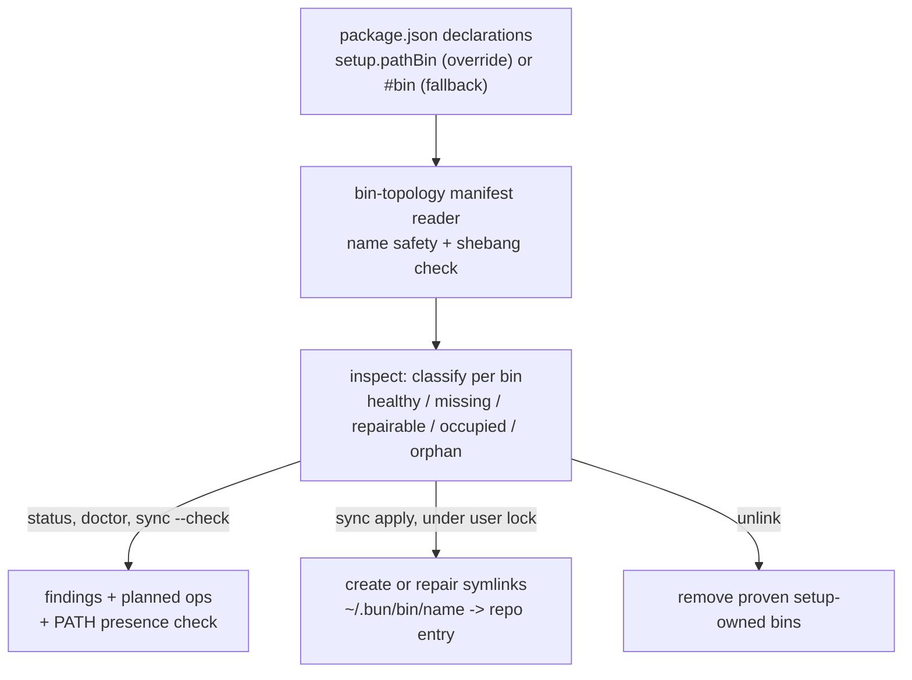

# Repo CLI Bins on PATH - Plan

## Goal Capsule

- **Objective:** every CLI bin declared under `runtime/*` and `skills/*` (`browser-connect`, `warm-chrome`, `browser-use`, `setup`) is invocable from any CWD via setup-owned symlinks in `~/.bun/bin`, planned/applied/verified/removed by the existing setup command surfaces — closing issue #242 defects 1 and 3.
- **Authority hierarchy:** this plan → `docs/decisions/2026-07-17-002-envelope-derived-transport-decision-log.md` (transport decisions are settled; bins deliver the CLIs, they do not reopen transport) → package CONTEXT.md vocabulary.
- **Stop conditions:** no new setup commands or flags (bins ride sync/status/doctor/unlink); never overwrite or remove a destination that is not proven setup-owned; no `bun link`/`npm link`/global-install state; no dotfiles-repo edits; PRs stay open for CodeRabbit and Nathan — no self-merge.
- **Execution profile:** one implementation wave (U1+U2 land together — the domain is useless without the manifest), then docs/closeout; live smoke against the real `~/.bun/bin` only from the orchestrating session, never from tests.

---

## Product Contract

### Summary

The setup CLI gains a bins domain: workspace packages declare a PATH-bin entrypoint in their own `package.json`, and `setup sync` materializes `~/.bun/bin/<name> → <repo>/<pkg>/<entry>` symlinks that `setup status`/`doctor` verify and `setup unlink` removes. Bun executes the TS entrypoints directly via shebang — no dist builds in the delivery path.

### Problem Frame

Issue #242: an agent following browser-use's SKILL.md from a foreign CWD (the `/timesheet` flow) dead-ended at step 1 — `bun run runtime/browser-connect/src/cli.ts` is repo-relative, and the documented `browser-connect` bin does not exist on PATH. The four `runtime/*`+`skills/*` package bins are installed nowhere. Local `~/.bun/bin` precedent supplies the failure modes this plan designs against: `last-30-days → dist/cli.js` is red (dist never built; browser-use's `dist/` is likewise uncommitted), and `cortex → src/cli.ts` — once a working linked TS bin — now dangles because its bun-global link chain outlived its source, the exact orphan class the bins domain must classify and remove.

### Requirements

**Delivery**

- R1. Each declared repo CLI bin resolves on PATH from any CWD as a symlink in `~/.bun/bin` pointing at the package's TS entrypoint inside the repo.
- R2. Packages own their declaration: a setup-owned `package.json` field names the PATH-bin entry, falling back to `package.json#bin`; browser-use overrides to its src entrypoint so the uncommitted dist is never in the delivery path.
- R3. Setup discovers declarations by enumerating workspace packages (`runtime/*`, `skills/*`); no hardcoded package list.

**Safety**

- R4. Setup only mutates destinations it can prove it owns (existing symlink whose realpath resolves inside the source repo). A foreign file or symlink at a declared name fails closed with a repair hint; nothing is overwritten.
- R5. A declared entry that is missing or lacks a `#!` shebang is a finding, never a silently created broken link.

**Lifecycle**

- R6. `setup sync` plans and applies bin links idempotently under the existing user-scope lock; `setup status`/`doctor` verify each bin resolves and that `~/.bun/bin` is on PATH; `setup unlink` removes proven setup-owned bins with the existing concurrent-change discipline.

**Docs**

- R7. browser-use SKILL.md invocation forms make the installed bin the primary form for foreign-CWD agents, and document the two engine lanes: `engine: agent-browser` domains connect with the `agent-browser` adapter and drive its CLI directly; `targets`/`operate` is the `chrome-devtools-mcp` lane (issue #242 defect 3).

### Scope Boundaries

#### Deferred to Follow-Up Work

- Publishing packages to npm or any registry-based install path.
- A `setup` bootstrap story for machines without the repo cloned.
- `runners/*` bins (currently `foundry-dx`, a runner-internal `.mjs` entrypoint) — outside the enumeration scope until a demonstrated need to run them from foreign CWDs.

#### Outside this work's identity

- `bun link` / `npm link` / global-install delivery (researched and rejected: project-scoped or copy-semantics, unverifiable state).
- Dotfiles-repo shims (second repo in the change surface).
- New setup commands or flags.

---

## Planning Contract

### Key Technical Decisions

- **KTD1 — direct setup-owned symlinks in `~/.bun/bin`.** Researched 2026-07-17 (Bun docs via Context7, web sweep): `bun link` is project-scoped and does not expose bins on PATH; `bun install -g` copies without source tracking; npm link adds a second package manager's unmanaged global state. Direct symlinks are inspectable, idempotent, and land in the one domain (`setup`) that already proves and repairs link ownership. `~/.bun/bin` is already on PATH and precedented for dev bins.
- **KTD2 — TS entrypoints, no dist in the delivery path.** All four bin targets carry `#!/usr/bin/env bun` shebangs; Bun executes TS directly. The authoritative proof is the Verification Contract's live smoke (foreign-CWD run through a fresh direct symlink), recorded in the U3 decision log — not the `cortex` precedent, which is a bun-global-chained link that has since gone dangling. browser-use's `#bin` points at uncommitted `dist/` — the `last-30-days` broken-link failure mode — so its declaration overrides to `src/browser-use.ts`; `dist/` remains an npm-pack concern with its leak guard.
- **KTD3 — bins are a domain, not a command.** The bins class joins startup links, hooks, instruction, and runbook inside `checkSetupDomains`/`applySetupDomains`/`unlinkSetupDomains` (`runtime/setup/src/setup-domains.ts`), inheriting the user-scope operation lock, station routing, and findings vocabulary. No new command contract; the cli-author gate is satisfied by keeping the existing contract/help/parser drift proofs green and extending finding/station vocabulary under test.
- **KTD4 — ownership proof is realpath-inside-repo plus manifest match, with a lexical readlink fallback for dangling links.** A setup-owned link whose target vanished has no resolvable realpath; the fallback (the `danglingTarget`/`broken_managed_link` pattern in `runtime/setup/src/ownership.ts`) is what lets orphans classify as removable instead of being fail-closed-preserved forever. Removal and repair never touch anything else.
- **KTD5 — advisory findings do not block.** The setup model historically treats every finding as a blocker (`blocked = findings.length > 0`); the PATH-presence and orphan advisories ride a distinct advisory channel excluded from the blocked/blockers computation, so a machine without `~/.bun/bin` on PATH degrades to a warning, not a blocked sync.

### High-Level Technical Design

### Assumptions

- `~/.bun/bin` exists and is on PATH on this machine (verified); the PATH check covers other machines with an advisory finding rather than a blocker (KTD5).
- Executing a TS entrypoint through a `~/.bun/bin` symlink resolves workspace imports via the repo's physical path (Bun resolves modules from the realpath; proven authoritatively by the live-smoke gate's foreign-CWD run).

---

## Implementation Units

### U1. Package-owned PATH-bin manifest

- **Goal:** setup can discover every declared PATH bin with validated entries.
- **Requirements:** R2, R3, R5.
- **Dependencies:** none.
- **Files:** `runtime/setup/src/bin-topology.ts` (new, manifest half), `skills/browser-use/package.json` (pathBin override), `runtime/setup/tests/bin-topology.test.ts` (new).
- **Approach:** enumerate `runtime/*` and `skills/*` package.jsons; setup-owned field (`"setup": { "pathBin": { "<name>": "./entry.ts" } }`) wins over `#bin` fallback; validate bin name is a single safe path segment, entry resolves inside the package under canonical (realpath) resolution — a symlinked entry escaping the package rejects — exists, and starts with `#!`.
- **Test scenarios:**
  - pathBin override beats `#bin` for the same package.
  - `#bin` fallback yields the three runtime CLIs verbatim.
  - Unsafe names (`../x`, `a/b`) rejected as findings.
  - Missing entry file and shebangless entry each produce the target-unhealthy finding, not a manifest entry.
- **Verification:** setup suite green via the test-runner script; manifest output enumerates exactly the four expected bins on this repo.

### U2. Bins domain riding sync/status/doctor/unlink

- **Goal:** the manifest becomes managed links with fail-closed safety.
- **Requirements:** R1, R4, R6.
- **Dependencies:** U1.
- **Files:** `runtime/setup/src/bin-topology.ts` (domain half), `runtime/setup/src/setup-domains.ts` (compose into check/apply/unlink), `runtime/setup/src/model.ts` (finding ids), `runtime/setup/tests/bin-topology.test.ts`, `runtime/setup/tests/setup-domains.integration.test.ts`.
- **Approach:** per-bin classification (healthy / missing→create / owned-wrong-target→repair / occupied→fail-closed finding / orphan→removable); destination dir and PATH read through injectable seams so tests never touch the real `~/.bun/bin`; a canonical destination-root proof fails closed (`unsafe_root`-grade) when the bin dir's parent escapes the selected home; apply under the existing user lock with per-link failure isolation, re-proving ownership and destination safety immediately before every mutation (remove and symlink) and deferring on concurrent change; unlink joins the removable set with re-inspection before each removal.
- **Patterns to follow:** `runtime/setup/src/startup-topology.ts` and its tests (the sibling link domain — including `unsafeExistingParent` and the pre-symlink re-checks); dangling-link ownership fallback in `runtime/setup/src/ownership.ts`; finding/station naming in `runtime/setup/src/model.ts`.
- **Execution note:** red-first — write the classification and safety tests before the domain logic; the occupied/foreign-symlink fail-closed cases are the point of the unit.
- **Test scenarios:**
  - Healthy link → noop plan; re-apply idempotent.
  - Missing → created; owned-but-wrong-target → repaired.
  - Occupied by regular file and by foreign symlink → fail-closed finding, destination untouched.
  - Orphaned setup-owned link (declaration or target gone, including a dangling target with no realpath) → removable via unlink; concurrent-change re-inspection defers when the link changes mid-run.
  - Destination swapped between plan and apply → mutation deferred, nothing clobbered.
  - Bin dir whose parent escapes the fixture home → fail-closed `unsafe_root` finding.
  - Destination dir absent / not on PATH → advisory finding (non-blocking, KTD5) with repair hint.
- **Verification:** setup suite + typecheck + biome green; existing contract/help/parser drift proofs pass unchanged; no test touches the real home directory.

### U3. Docs, decision record, issue #242 closeout

- **Goal:** the installed bin story is documented and #242 fully dispositioned.
- **Requirements:** R7.
- **Dependencies:** U1, U2.
- **Files:** `skills/browser-use/SKILL.md`, `docs/decisions/` (new same-surface decision log via record-decision), issue #242 comment.
- **Approach:** installed-bin invocation becomes the primary form for foreign-CWD agents (repo-local `bun run` form stays for repo work); add the engine-lane branch (agent-browser vs chrome-devtools-mcp); record KTD1/KTD2 as accepted decisions; comment #242 mapping defect 2 → PR #248 and defects 1+3 → this wave, close on merge.
- **Test scenarios:** `Test expectation: none -- documentation, decision log, and tracker closeout; behavior is pinned by U1/U2 suites.`
- **Verification:** SKILL.md flows read true against a machine with bins applied; #242 acceptance boxes satisfied or explicitly re-scoped in the closing comment.

---

## Verification Contract

| Gate | Command | Applies to |
|---|---|---|
| Setup suite | `skills/test-runner/src/test-runner.sh --cwd runtime/setup` | U1, U2 |
| Typecheck | `bun run typecheck` in `runtime/setup` | U1, U2 |
| Lint/format | repo `bun run biome:check` | all units |
| Live smoke (orchestrator only) | `setup sync` → from `$HOME`: `which browser-connect warm-chrome browser-use setup` + `browser-connect connect chrome-devtools-mcp --json` end-to-end; re-apply noop; unlink leaves `~/.bun/bin` clean | U2, U3 |

Never raw `bun test` (repo rule); tests use fixture roots, never the real `~/.bun/bin`.

## Definition of Done

- All units landed through feature-branch PRs left open for CodeRabbit review and Nathan's merge — no self-merge.
- From a foreign CWD, all four bins resolve and run; `setup status` reports the bins domain healthy; re-apply is a noop; unlink removes only setup-owned links.
- Fail-closed proofs hold: occupied destinations untouched with a named finding; no shebangless or missing target ever linked.
- SKILL.md engine lanes documented; decision log recorded; issue #242 closed with the defect→fix mapping.
- No abandoned experimental code in the diff; fallow audit clean over the wave.
