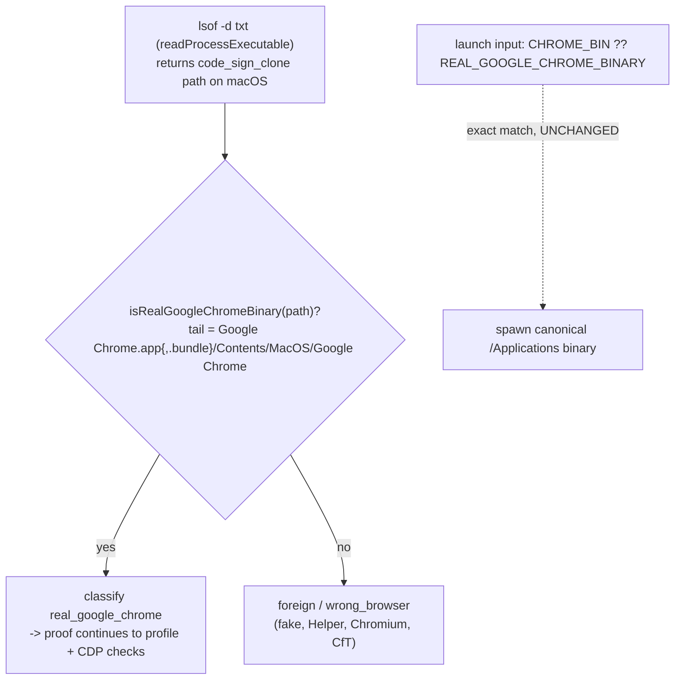

# fix: warm-chrome recognizes real Chrome through the macOS code-sign clone

## Goal Capsule

- **Objective:** warm-chrome recognizes a real Google Chrome listener whose executable resolves to the macOS hardened-runtime **code-sign clone** path, so `status`/`check`/`launch` reattach to and verify a genuine Warm Chrome instead of failing closed with `foreign_listener` — closing issue #252 and the recurrence of #232.
- **Root cause (settled, from diagnose):** `readProcessExecutable` (`runtime/warm-chrome/src/runtime.ts`) resolves the listener binary via `lsof -d txt`, whose first entry on current macOS is `/private/var/folders/.../com.google.Chrome.code_sign_clone/.../Google Chrome.app.bundle/Contents/MacOS/Google Chrome` — never the `/Applications/...` string the identity check exact-matches. Every real Chrome therefore classifies `foreign`. One cause, two symptoms (reattach + fresh-launch-verify).
- **Chosen fix:** replace the *identity* exact-match with a **trailing bundle-structure match** — accept any path ending `Google Chrome.app{,.bundle}/Contents/MacOS/Google Chrome`. Applied only to the two listener-identity sites; the three launch-input sites stay exact.
- **Stop conditions:** do not weaken the anti-spoof stance (a `/tmp/fake-chrome`, `Google Chrome Helper`, Chromium, or CfT binary must still classify non-real); do not change which binary warm-chrome *spawns* (launch input stays the canonical `/Applications` path or `CHROME_BIN`); no new syscall in the probe path; PR stays open for CodeRabbit + Nathan, no self-merge.

---

## Problem Frame

Surfaced verifying the merged PATH-bins wave (#242): from `$HOME`, `browser-connect connect chrome-devtools-mcp --json` fails exit 20 (`foreign_listener`) against a real, working Chrome on `127.0.0.1:9222`, and the suggested-port fallback launch fails `spawned_unverified`. Diagnosis (issue #252) proved both are the same cause: the `lsof -d txt` executable path is Apple's code-sign clone, which never matches `REAL_GOOGLE_CHROME_BINARY`.

The current behavior is enshrined by design: `tests/runtime.test.ts:97` ("true executable path from lsof txt beats spoofable argv0 from ps", commit ed1a6ac5) deliberately trusts the `txt` path over `ps` argv0 on anti-spoof grounds. That decision was sound in the abstract but, on the hardened runtime, made the "true" path one that can never match the real-binary constant. The fix must keep the anti-spoof intent while tolerating the clone.

---

## Requirements

- **R1.** A listener whose observed executable resolves to the code-sign clone path is classified `real_google_chrome` (identity), not `foreign`.
- **R2.** The canonical `/Applications/Google Chrome.app/Contents/MacOS/Google Chrome` path still classifies real (no regression).
- **R3.** Anti-spoof preserved: `/private/tmp/fake-chrome`, `.../Google Chrome Helper`, Chromium, and Chrome-for-Testing binaries still classify non-real (`foreign` / `wrong_browser` as before).
- **R4.** The binary warm-chrome *spawns* is unchanged — launch input stays `CHROME_BIN ?? REAL_GOOGLE_CHROME_BINARY` (canonical), never a clone path.
- **R5.** The redaction contract holds: a real-Chrome listener on a non-default profile may still emit its `user_data_dir`; a default-profile or foreign listener still must not (the clone match must not leak a default-profile path).
- **R6.** Live proof: with the fix applied, `warm-chrome status` reattaches to the running 9222 Chrome, `browser-connect connect chrome-devtools-mcp --json` succeeds from `$HOME` (exit 0), and a fresh launch on a clean port verifies.

---

## Planning Contract

### Key Technical Decisions

- **KTD1 — trailing bundle-structure predicate, not exact string.** Introduce `isRealGoogleChromeBinary(path): boolean` matching any path whose tail is `Google Chrome.app` or `Google Chrome.app.bundle` then `/Contents/MacOS/Google Chrome`. Rationale: survives both `/Applications` and the clone dir with no new syscall; keeps anti-spoof because an attacker's binary would need the exact real bundle structure *and* to expose real-Chrome CDP to get past the later proof steps. Rejected alternatives (from #252): clone-path canonicalization couples to Apple's undocumented clone-dir layout; codesign/bundle-id verification adds a subprocess and failure modes per probe; txt-vs-argv0 cross-validation re-trusts the argv0 the current code deliberately distrusts.
- **KTD2 — apply to identity sites only; launch input stays exact.** The predicate replaces the exact match at the two *listener-identity* sites: `classifyListenerBinary` (`src/proof.ts`) and `redactListenerDetail`'s force-foreign guard (`src/runtime.ts`). The three *launch-input* sites (`src/launch.ts` launch-binary guard, `src/cli.ts` `CHROME_BIN` default, `src/repair.ts`) keep the exact constant — warm-chrome must spawn the canonical binary, not accept a clone as a launch target. `parseProcessCommand` is unchanged: it parses the `ps` command line, which already carries the correct `/Applications` path, so args parse correctly today; the bug is solely in the `lsof -d txt` identity flow.
- **KTD3 — reframe the enshrining test, do not delete the anti-spoof coverage.** `tests/runtime.test.ts:97` asserts the txt path wins over argv0 using a `/private/tmp/fake-chrome` txt value; that assertion (a fake txt path stays the executable and later classifies non-real) is still correct anti-spoof coverage and stays. What changes is adding sibling coverage that the *clone* txt path classifies real — the premise "txt path is authoritative" is preserved; "authoritative txt path must exact-match `/Applications`" is what the fix removes.

### High-Level Technical Design

### Assumptions

- The code-sign clone path shape (`.../Google Chrome.app.bundle/Contents/MacOS/Google Chrome`) is stable enough for a suffix match; the suffix is the app-bundle tail Apple preserves inside the clone, not the private clone-dir prefix (which the predicate ignores). Verified live against Chrome 150 on Darwin 25.5.0 (3 concurrent Chromes, all identical tail).
- The existing profile/default-profile and CDP cross-validation steps downstream of the identity check are unchanged and still gate real attachment, so loosening the *binary* identity does not loosen overall attach safety.

---

## Implementation Units

### U1. Trailing-bundle-structure binary identity predicate

- **Goal:** a single predicate recognizes the real Google Chrome binary through both the canonical and code-sign-clone paths, rejecting spoof shapes.
- **Requirements:** R1, R2, R3.
- **Dependencies:** none.
- **Files:** `runtime/warm-chrome/src/runtime.ts` (add `isRealGoogleChromeBinary`, export it), `runtime/warm-chrome/tests/runtime.test.ts` (predicate unit tests).
- **Approach:** add `isRealGoogleChromeBinary(path: string): boolean` near `REAL_GOOGLE_CHROME_BINARY`. Match the path tail against `Google Chrome.app` or `Google Chrome.app.bundle` followed by `/Contents/MacOS/Google Chrome`, anchored at end of string. Keep `REAL_GOOGLE_CHROME_BINARY` as the canonical launch constant. The predicate must reject `.../Google Chrome Helper` (superstring), `.../Chromium`, CfT paths, and arbitrary paths like `/private/tmp/fake-chrome`.
- **Execution note:** red-first — write the predicate's accept/reject table as failing tests before implementing, since the reject cases are the security contract.
- **Patterns to follow:** existing string-identity helpers and the classification vocabulary in `src/runtime.ts` / `src/proof.ts`; mirror the superstring guard rationale already documented in `parseProcessCommand`.
- **Test scenarios:**
  - Canonical `/Applications/Google Chrome.app/Contents/MacOS/Google Chrome` → true. (R2)
  - Live clone shape `/private/var/folders/.../com.google.Chrome.code_sign_clone/.../Google Chrome.app.bundle/Contents/MacOS/Google Chrome` → true. (R1)
  - `.../Google Chrome.app/Contents/MacOS/Google Chrome Helper` → false (superstring must not pass). (R3)
  - `/Applications/Chromium.app/Contents/MacOS/Chromium` → false. (R3)
  - A Chrome-for-Testing path (`.../chrome-mac/...` / "Chrome for Testing") → false. (R3)
  - `/private/tmp/fake-chrome` → false. (R3)
  - Empty string → false.
- **Verification:** warm-chrome suite green via the test-runner script; the predicate's accept/reject table passes.

### U2. Apply the predicate at listener-identity sites; keep launch input exact

- **Goal:** the running-listener identity checks use the new predicate; the launch-input checks stay exact.
- **Requirements:** R1, R4, R5.
- **Dependencies:** U1.
- **Files:** `runtime/warm-chrome/src/proof.ts` (`classifyListenerBinary`), `runtime/warm-chrome/src/runtime.ts` (`redactListenerDetail` force-foreign guard), `runtime/warm-chrome/tests/check-stations.test.ts` and/or `runtime/warm-chrome/tests/redaction.test.ts` (station + redaction coverage).
- **Approach:** in `classifyListenerBinary`, replace `executable === REAL_GOOGLE_CHROME_BINARY` with `isRealGoogleChromeBinary(executable)` for the `real_google_chrome` branch; leave the CfT/Chromium/electron branches untouched (they run after and still catch non-real). In `redactListenerDetail`, replace the `parsed.executable !== REAL_GOOGLE_CHROME_BINARY` force-foreign test with `!isRealGoogleChromeBinary(parsed.executable)`, and keep `safeProcessBasename(REAL_GOOGLE_CHROME_BINARY)` as the emitted process label (never echo the clone path). Do **not** touch `src/launch.ts:571`, `src/cli.ts:364`, or `src/repair.ts:500` — those decide the spawn/launch binary and must stay the canonical constant (R4).
- **Execution note:** verify the default-profile redaction guard still fires when the identity now passes via a clone path — a clone-path real Chrome on the default profile must still be treated foreign / must not leak the default-profile `user_data_dir`.
- **Patterns to follow:** the existing `redactListenerDetail` doctrine comments (`runtime.ts:1035-1057`) and the `port_occupied_foreign` / `wrong_browser` station assertions in `tests/check-stations.test.ts`.
- **Test scenarios:**
  - A listener whose observed executable is the clone path, on a non-default profile → classifies `real_google_chrome`, proof proceeds past the binary gate (was `foreign_listener`). (R1)
  - `redactListenerDetail` on a clone-path real-Chrome listener → `foreign: false`, `process: "Google Chrome"`, and emits `user_data_dir` for a non-default profile. (R5)
  - `redactListenerDetail` on a clone-path real Chrome whose `--user-data-dir` is the **default** profile → still no `user_data_dir` leak (default-profile guard holds). (R5)
  - Existing `wrong_browser` station cases (Chromium, CfT) and `port_occupied_foreign` foreign cases remain unchanged and green. (R3)
  - `Covers R4.` A launch/spawn path fed a clone string is unaffected — launch guard still requires the canonical constant (existing launch tests stay green).
- **Verification:** full warm-chrome suite + typecheck + repo biome green; check-station and redaction contracts unchanged except the newly-passing clone case.

### U3. Live reattach + launch proof and issue closeout

- **Goal:** the real #242/#252 scenario is proven end-to-end and the issue is dispositioned.
- **Requirements:** R6.
- **Dependencies:** U1, U2.
- **Files:** none (orchestrator-run live smoke); issue #252 comment.
- **Approach:** from `$HOME` with the fix applied: (1) `warm-chrome status --json` against the running 9222 Chrome → reattaches, not `port_occupied_foreign`; (2) `browser-connect connect chrome-devtools-mcp --json` → verified handoff envelope, exit 0; (3) fresh launch on a clean port → verifies (no `spawned_unverified`). Comment #252 with the fix summary + live evidence; close on merge. Cross-note #232 as the same failure class now covered by a shared identity predicate.
- **Test scenarios:** `Test expectation: none -- orchestrator-only live smoke and tracker closeout; behavior is pinned by U1/U2 suites.`
- **Verification:** all three live checks pass from a foreign CWD; #252 acceptance satisfied.

---

## Verification Contract

| Gate | Command | Applies to |
|---|---|---|
| Warm Chrome suite | `skills/test-runner/src/test-runner.sh --cwd runtime/warm-chrome` | U1, U2 |
| Typecheck | `bun run typecheck` in `runtime/warm-chrome` | U1, U2 |
| Lint/format | repo `bun run biome:check` | all units |
| Live reattach + launch (orchestrator only) | from `$HOME`: `warm-chrome status --json` (9222) reattaches; `browser-connect connect chrome-devtools-mcp --json` exit 0; fresh launch on a clean port verifies | U3 |

Never raw `bun test` (repo rule); unit tests inject `lsof`/`ps` output via the existing `findListenerWithSystemTools` exec seam and never probe the real machine.

## Definition of Done

- The identity predicate recognizes canonical and clone paths and rejects every spoof shape (fake, Helper, Chromium, CfT); anti-spoof coverage from `tests/runtime.test.ts:97` stays green with added clone-path coverage.
- Listener-identity sites use the predicate; launch-input sites still require the canonical constant (no clone is ever a spawn target).
- Default-profile redaction guard still fires for clone-path real Chrome; no `user_data_dir` leak.
- Live proof: `warm-chrome status` reattaches to 9222, `browser-connect connect` succeeds from `$HOME`, fresh launch verifies.
- Warm Chrome suite + typecheck + biome green; PR left open for CodeRabbit + Nathan; #252 closed with the fix→evidence mapping and #232 cross-note.
