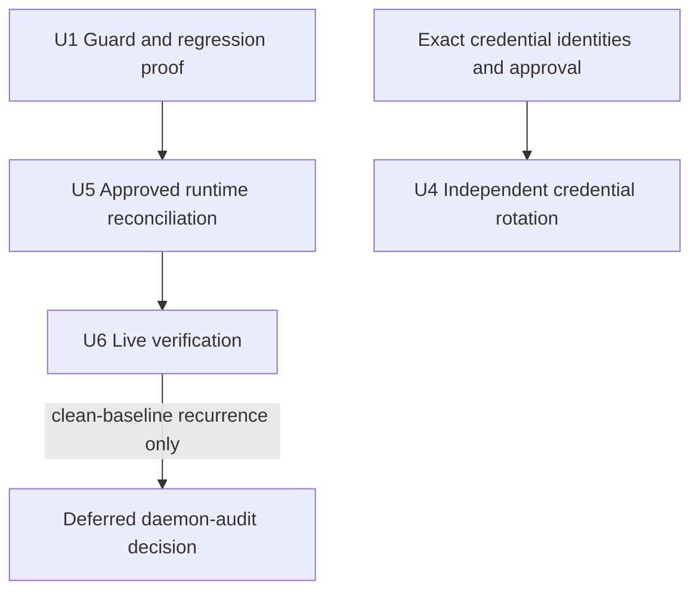

# MC Porter Daemon Orphan Prevention - Plan

## Goal Capsule

- **Objective:** Keep Homebrew as the sole MC Porter installation owner, remove the obsolete FNM lineage and current orphans safely, and prevent `mcp-doctor` health checks from creating new daemons.
- **Authority:** Fresh local evidence first; MC Porter config-scoped lifecycle commands second; exact user approval before machine or credential mutations.
- **Execution profile:** Focused test-first guard fix, one-time approved reconciliation, independent credential rotation, then live verification.
- **Stop conditions:** Stop before process signals, artifact moves, package uninstall, credential rotation, persistent config edits, or external issue filing until exact targets and approval are current.

---

## Product Contract

### Summary

Fix the known keepalive mistake in the existing `mcp-doctor` script and pin it with one public-interface regression test.
Reconcile this Mac to one Homebrew-owned MC Porter installation without changing the four live MCP aliases.
Rotate the exposed Notion and Context7 credentials independently.
Defer a permanent machine-wide daemon audit CLI unless the problem recurs after the clean baseline.

### Problem Frame

The current doctor runs `mcporter list` without forcing the all-server keepalive guard.
`MCPORTER_NO_KEEPALIVE=1` is not a boolean switch because MC Porter parses a server-name list; `*` is the all-server value.
The Mac also has a current Homebrew installation and an obsolete FNM Node 22 installation, which produced multiple runtime lineages.
MC Porter intentionally scopes daemons by config path, so the desired invariant is one installation owner with no superseded or unreachable hosts, not exactly one daemon process.

### Requirements

**Diagnostic prevention**

- R1. Every doctor invocation overlays `MCPORTER_NO_KEEPALIVE="*"` onto the inherited environment before running `mcporter list`.
- R8. The doctor resolves `mcporter` from `PATH` and never auto-installs or selects a package runner.

**Approved runtime reconciliation**

- R9. Remove the obsolete FNM Node 22 global MC Porter only after fresh proof of its exact installation path and explicit approval.
- R10. Stop only the reachable metadata owner sharing an approved anomalous config/socket lineage through MC Porter's exact config-scoped lifecycle command before signaling an unreachable process in that lineage. Preserve unrelated healthy config-scoped daemons.
- R11. Stop the old `0.9.0` metadata owner before terminating a same-lineage orphan so the old cleanup path cannot unlink replacement artifacts.
- R12. Bind every process approval to PID, process start identity, canonical executable path, redacted config fingerprint, and socket identity. Re-read the same tuple immediately before each lifecycle command or signal. Never capture or present process environments, raw argv, or raw metadata.
- R13. Preserve the `notion`, `home-assistant`, `elgato`, and `streamdeck-author` alias definitions and verify each after reconciliation.
- R14. Quarantine a stale daemon metadata/socket pair only after revalidating its confined path, expected file types, user ownership, absent live owner, and no-overwrite destination.

**Credential recovery**

- R17. Bind each rotation approval to the exact non-secret provider account, integration, and secret-owner identity.
- R18. Verify each replacement owner path before revoking the identified old credential where provider overlap permits it; emit no credential values.

**Recurrence boundary**

- R16. Consider a permanent daemon-audit CLI or upstream report only after a clean Homebrew baseline reproduces a superseded or unreachable daemon.

### Acceptance Examples

- AE1. Given an inherited wrong or missing keepalive value, when the doctor runs against a daemon-capable fixture twice, then both child invocations receive `*` and create no daemon marker.
- AE8. Given no exact mutation approval, when local anomalies are discovered, then no lifecycle command, signal, artifact move, uninstall, credential mutation, or external write occurs.
- AE9. Given approved reconciliation, when final verification runs, then Homebrew is the sole MC Porter installation owner and all four aliases retain their expected health or authentication state.
- AE10. Given a clean Homebrew baseline later reproduces an orphan, when evidence is captured, then it is redacted and the larger audit CLI or upstream escalation is reconsidered rather than prebuilt now.
- AE12. Given an approved process identity changes before mutation, when the tuple is re-read, then approval is invalidated and no lifecycle command or signal runs.
- AE14. Given a stale daemon pair, when any owner, path, type, ownership, or destination check fails, then the pair is not moved.
- AE15. Given an approved unchanged orphan survives bounded `TERM`, when the deadline expires, then cleanup stops without `KILL`, broader signaling, or widened targets.

### Scope Boundaries

- Preserve MC Porter's intentional config-scoped daemon model.
- Do not force a machine-wide single-daemon invariant.
- Do not change the four alias definitions or globally disable daemon support.
- Do not add npm MC Porter, a package-runner fallback, or a local MC Porter patch.
- Do not automate cleanup or credential rotation inside `mcp-doctor`.
- Do not use `KILL`, broad `pkill`, recursive deletion, or process-environment inspection.

#### Deferred to Follow-Up Work

- Build a reusable `daemon-audit` CLI only after recurrence under the verified clean Homebrew baseline supplies evidence that the focused fix is insufficient.
- File or comment on an upstream MC Porter issue only after redacted recurrence evidence exists and the user approves the external write.

---

## Planning Contract

### Key Technical Decisions

- KTD1. **Keep Homebrew as this Mac's sole MC Porter installation owner.** (session-settled: user-approved — chosen over adding npm MC Porter: a second package owner recreates the drift being removed.) Repo code remains PATH-first.
- KTD2. **Force `MCPORTER_NO_KEEPALIVE="*"` in the doctor.** (session-settled: user-approved — chosen over `1`: MC Porter parses server names, so `1` does not disable keepalive globally.) Preserve every other inherited environment value.
- KTD3. **Keep inspection read-only and approvals identity-bound.** (session-settled: user-approved — chosen over automated repair: stale process and artifact evidence can target the wrong owner.) Any target identity change invalidates approval.
- KTD7. **Reconcile owners before orphans.** (session-settled: user-approved — chosen over broad or unordered signaling: the old runtime can unlink artifacts still needed by a replacement owner.) Reinspect between actions.
- KTD8. **Allow multiple healthy config-scoped daemons.** The invariant is no obsolete installation lineage and no superseded or unreachable host, not one process globally.
- KTD9. **Escalate only on clean-baseline recurrence.** One mixed-installation incident does not justify a permanent forensic subsystem.
- KTD10. **Rotate the exposed credentials separately.** (session-settled: user-approved — chosen over treating rotation as part of daemon cleanup: the credentials have independent owners and risk.)
- KTD11. **Quarantine stale artifacts instead of deleting them.** Move only an exact revalidated pair to a private no-overwrite location so recovery remains possible.
- KTD12. **Use each credential's existing owner.** Context7 and Notion use their provider integrations plus the matching `API Credentials` 1Password items; the generated `.env.1password` file is refreshed through its owning `sync-api-keys` command, never edited directly. MC Porter's separate Notion OAuth entry is outside this exposed-token rotation unless fresh evidence identifies it as exposed.
- KTD13. **Re-check the installed Homebrew version before reconciliation.** Stop and re-baseline official behavior if the observed version differs from the known `0.12.2` baseline.
- KTD14. **Use a redacted process identity tuple.** PID alone is unsafe after reuse; raw environments, argv, and metadata can expose credentials.
- KTD15. **Treat a TERM-resistant target as blocked.** Stop and request fresh evidence and approval rather than escalating automatically.
- KTD17. **Choose the focused permanent fix.** (session-settled: user-directed — chosen over the full diagnostic CLI: cleanup plus the keepalive guard and regression proof addresses the known cause with less code and maintenance.)

### Sequencing

---

## Implementation Units

### U1. Guard diagnostic health

- **Goal:** Ensure the existing doctor cannot create persistent MC Porter workers.
- **Requirements:** R1, R8; KTD2, KTD17; AE1
- **Dependencies:** None.
- **Files:** `skills/mcp-doctor/scripts/mcp-doctor.ts`; `skills/mcp-doctor/scripts/mcp-doctor.test.ts`; `skills/mcp-doctor/SKILL.md` only if invocation guidance needs correction.
- **Approach:** Start with a public-script integration test using a fake PATH-resolved MC Porter that marks daemon creation unless it receives the all-server guard. Overlay only the guard onto the inherited environment. Remove package-manager-specific recovery guidance that could recreate dual ownership.
- **Test scenarios:** An inherited `1` is overwritten with `*`; a missing guard becomes `*`; two doctor runs create no daemon marker; normal health output and exit behavior remain intact.
- **Verification:** The focused test passes twice, formatting passes, and active guidance contains no npm auto-install instruction.

### U4. Rotate Notion and Context7 credentials

- **Goal:** Revoke both exposed credentials and restore their existing owner-backed access paths.
- **Requirements:** R17, R18; KTD10, KTD12
- **Dependencies:** Exact non-secret credential identities and explicit approval; independent of U1 and U5.
- **Files:** No repository credential files.
- **Approach:** Rotate Context7 and Notion through their provider integrations and exact `API Credentials` 1Password items. Refresh the generated local environment through `sync-api-keys`. Verify replacements before revocation where overlap exists. Keep values out of source, commands, logs, and evidence. Leave MC Porter's separate Notion OAuth entry unchanged unless fresh evidence identifies it as exposed.
- **Test scenarios:** Approval withheld; identity mismatch; replacement verification failure; successful replacement followed by old-value revocation; redacted functional check.
- **Verification:** Provider revocation evidence exists and both replacement owner paths pass redacted checks.

### U5. Reconcile the local runtime

- **Goal:** Remove the obsolete FNM installation lineage and current orphaned state without disrupting healthy config-scoped daemons.
- **Requirements:** R9-R14; KTD1, KTD3, KTD7, KTD8, KTD11, KTD13-KTD15; AE8, AE9, AE12, AE14, AE15
- **Dependencies:** U1; fresh read-only evidence; exact target approval.
- **Files:** No repository files; user-level MC Porter processes, installation, and daemon state only.
- **Approach:** Resolve the active executable and version. Correlate each candidate through the redacted identity tuple: PID, process start identity, canonical executable path, config fingerprint, metadata owner, and open socket. Stop only an approved anomalous lineage's reachable metadata owner through MC Porter first. Signal only an approved unchanged orphan that remains. Remove the proved FNM global installation. Quarantine any exact stale pair only after its safety checks pass. Stop on incomplete correlation, identity drift, ambiguous ownership, or TERM resistance.
- **Test scenarios:** Approval withheld; executable or version drift; target identity changes; owner exits naturally; old installation path differs; TERM-resistant target; alias definition changes.
- **Verification:** Immediately re-inventory after reconciliation. Homebrew is the sole installation owner, no obsolete or unreachable lineage remains, stale pairs are absent from the active daemon directory, and all four aliases retain their definitions and expected callable state.

### U6. Verify the clean baseline

- **Goal:** Prove the focused fix is sufficient and define the recurrence trigger for larger tooling.
- **Requirements:** R13, R16; KTD9, KTD17; AE1, AE9, AE10
- **Dependencies:** U5. Credential recovery remains an independent work item.
- **Files:** `skills/mcp-doctor/scripts/mcp-doctor.test.ts`; optional redacted evidence outside the repo on recurrence.
- **Approach:** Run the doctor twice and compare process and daemon-artifact snapshots. Verify the active MC Porter owner and all four aliases. If a new orphan appears under the clean Homebrew baseline, preserve bounded redacted evidence and return to the deferred daemon-audit decision. Verify credential recovery separately after U4 rather than making it a prerequisite for daemon completion.
- **Test scenarios:** Stable repeated health; one alias unhealthy; process or artifact delta after health; clean-baseline orphan recurrence; evidence redaction.
- **Verification:** Repeated health creates no daemon delta and all four aliases meet expected state. U4 separately verifies that replacement credentials work and identified old credentials are revoked.

---

## Verification Contract

| Gate | Applies to | Done signal |
|---|---|---|
| Focused doctor integration test | U1, U6 | Wrong or missing inherited guard becomes `*`; repeated runs create no daemon marker. |
| Targeted formatting and diff check | U1 | Changed doctor files pass with no unrelated edits. |
| Read-only installation and process inventory | U5 | Exact Homebrew, FNM, process, config, and artifact identities are known before approval. |
| Post-reconciliation ownership check | U5, U6 | Homebrew is the sole installation owner and no approved obsolete lineage remains. |
| Four-alias smoke | U5, U6 | `notion`, `home-assistant`, `elgato`, and `streamdeck-author` retain expected state. |
| Redacted credential verification | U4 | Replacement owner paths work and identified old credentials are revoked. |

---

## Definition of Done

- The doctor always forces the all-server keepalive guard while preserving the inherited environment.
- A focused integration test proves repeated health checks create no persistent-worker marker.
- Homebrew is the sole local MC Porter installation owner.
- The obsolete FNM installation and approved orphaned state are gone. A TERM-resistant target marks execution blocked and prevents completion until a fresh-evidence resume succeeds.
- The four MCP alias definitions remain unchanged and their expected health or authentication states are verified.
- No permanent daemon-audit CLI, package migration, repair automation, or speculative abstraction is added without clean-baseline recurrence evidence.
- No unrelated worktree changes, secret values, abandoned experiments, or generated drift enter the final change.

Credential recovery completes independently when the exposed Context7 and Notion credentials are revoked and their replacement owner paths work.
