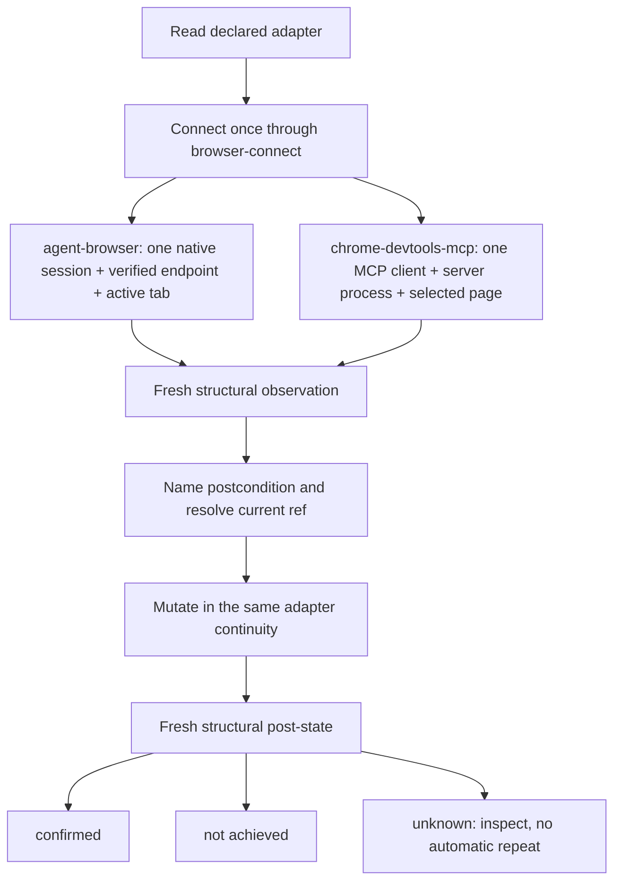

# browser-use action continuity - Plan

## Goal Capsule

- **Objective:** make `browser-use` teach two reliable page-action invariants: preserve adapter-native continuity from ref-producing observation through mutation, then decide completion from a fresh, predeclared structural postcondition.
- **Authority:** this plan's Product Contract, the user-set scope in this session, `skills/browser-use/CONTEXT.md`, and the existing browser connection and command contracts. Current CLI help owns exact commands and flags.
- **Execution profile:** one bounded first-party skill correction plus cross-adapter evidence. Content-only unless implementation proves a documented native sequence is impossible.
- **Stop conditions:** any need to add or change a CLI verb, operation capability, transport, session runtime, classifier, adapter registry contract, or browser-connect envelope; any new domain term that would require `CONTEXT.md`; any operation-floor work.
- **Tail:** run the first-party skill verification gates and file a `skill-feedback` closeout for the material skill run.

---

## Product Contract

### Summary

`browser-use` keeps its current engine lanes. Ref-based page actions use the selected adapter's native continuity rather than an assumed MCP lifecycle. `chrome-devtools-mcp` keeps one MCP client, server process, and selected page. `agent-browser` keeps one explicit native session, verified endpoint, and active tab. Both lanes name the intended postcondition before mutation and verify it from fresh structural state afterward.

### Problem Frame

The current `Engine Lanes` section correctly distinguishes direct `agent-browser` use from the `chrome-devtools-mcp` `targets` and `operate` lane. The `Page Actions` section then collapses both lanes into `browser-use operate`, even though that command exposes only `snapshot`, `screenshot`, and `emulate` and its MCP transport starts a fresh adapter process per call. A ref produced there cannot safely cross into a separate mutation client.

Completion guidance is also too weak. Existing research proves an adapter can report action success after a stale-ref no-op, while ambient verification language can remain present after a structurally successful transition. Action output and keyword matches therefore cannot decide the outcome.

### Actors

- A1. Coding agents using `browser-use` as the browser workflow owner.
- A2. Operators reviewing safe, reversible cross-adapter evidence.

### Requirements

**Adapter-native continuity**

- R1. Select the operating surface from the declared adapter. Never describe browser use as inherently MCP-based.
- R2. Bind every element ref to the adapter, interaction context, browser target, and observed page state that produced it.
- R3. For `chrome-devtools-mcp`, keep the ref-producing observation, mutation, and fresh verification in one MCP client and server process against one explicitly selected page.
- R4. For `agent-browser`, keep the sequence in one explicit native session against the verified endpoint and one explicitly selected active tab.
- R5. After navigation, DOM-changing action, client or process restart, native session change, endpoint change, or target or tab change, discard the old ref and observe again.
- R6. If an adapter owner exposes no documented continuity contract, treat ref mutation as unsupported. Never infer MCP or CLI semantics.

**Structural completion**

- R7. Before a mutating action, name one task-specific structural postcondition: expected URL, scoped DOM or accessibility structure, element presence or absence, control value or state, or persisted target data.
- R8. After mutation, obtain fresh structural state through the same adapter-native continuity. Treat adapter return text and ambient keywords as supporting evidence only.
- R9. Classify the result as `confirmed` when the expected structure is present, `not achieved` when unchanged state is proven, or `unknown` when evidence is partial, unrelated, or insufficient.
- R10. After an `unknown` mutation, inspect without automatically repeating it. Retry only after fresh observation proves no effect and repetition is known safe.

**Bounded scope**

- R11. Keep `browser-use operate` limited to its shipped `snapshot`, `screenshot`, and `emulate` capabilities.
- R12. Change workflow guidance and its evidence only. Do not add a persistent-session runtime, generic keyword classifier, adapter abstraction, or operation-floor verbs.

### Acceptance Examples

- AE1. **Covers R1, R2, R4, R5.** Given `engine: agent-browser`, an agent connects once, pins one native session, the verified endpoint, and one tab, then snapshots, acts on a current ref, and re-observes in that continuity. A tab or page-state change consumes the old ref.
- AE2. **Covers R2, R3, R5.** Given `chrome-devtools-mcp`, an agent selects the intended page and performs snapshot, ref mutation, and fresh snapshot through one MCP client and server process. A replacement client never reuses the prior ref.
- AE3. **Covers R7, R8, R9.** Given stale verification language remains after login, but the predeclared authenticated-workspace landmark is present in fresh structure, the outcome is `confirmed`.
- AE4. **Covers R8, R9, R10.** Given an adapter reports success but fresh structure neither proves the postcondition nor proves no effect, the outcome is `unknown` and the mutation is not automatically repeated.
- AE5. **Covers R11, R12.** Given the completed diff, browser-use command help, runtime modules, transport, operation capabilities, and browser-connect contracts are unchanged.

### Success Criteria

- `Engine Lanes`, `Workflow`, and `Page Actions` describe one coherent adapter-neutral lifecycle.
- A fresh agent can explain the continuity coordinates for both current adapters without treating `agent-browser` as MCP.
- Completion follows a predeclared structural postcondition, not action output or keyword presence.
- Ambiguous mutations stop at inspection rather than risking a duplicate action.

### Scope Boundaries

**Deferred**

- Cross-adapter click and fill operation floor. Keep its existing revival trigger in `runtime/browser-connect/TASKS.md`.

**Outside this plan**

- New CLI verbs or flags.
- Runtime or transport changes.
- Persistent-session infrastructure.
- Generic success or keyword classification.
- Adapter fallback or cold-browser fallback.
- Edits to archived browser-use test ledgers.

### Dependencies / Assumptions

- `browser-connect connect --json` remains the only connection entry and the Verified Handoff Envelope remains the endpoint authority.
- `agent-browser` native session identity survives its command boundaries when the explicit session, endpoint, and active tab stay fixed.
- Chrome DevTools refs remain process-scoped, so one MCP client and server process is required for a ref chain.
- Existing Browser Adapter and Bounded Browser Outcome terms are sufficient. No glossary change is expected.

### Sources / Research

- `skills/browser-use/SKILL.md` - current engine lanes and contradictory page-action guidance.
- `skills/browser-use/src/command-contract.ts` - shipped operation capabilities and adapter ids.
- `skills/browser-use/src/browser-use-transport.ts` - fresh MCP adapter process per operation.
- `runtime/browser-connect/src/adapters/agent-browser.ts` - verified endpoint injection and read-only attachment probe.
- `skills/browser-use/src/prototype-playwright-vocab-map/ref-normalizer-NOTES.md` - uninterrupted per-engine snapshot-to-click sequence.
- `skills/browser-use/docs/research/2026-06-13-ref-staleness-verify-layer-findings.md` - silent no-op and fresh post-state evidence.
- `docs/decisions/2026-07-14-001-browser-connect-architecture-decision-log.md` - deferred operation floor.
- `docs/adr/0002-runbooks-and-skills-use-prose-as-orchestrator.md` - judgment in skill prose, deterministic mechanics in owning code.
- `report:closeout_a140f43aec445f7c` - reported session and ref continuity gap.

---

## Planning Contract

### Key Technical Decisions

- **KTD1 - Adapter-native continuity.** Define one invariant, then name each current adapter's coordinates. Chosen by the user over MCP-only persistence because MCP is one adapter shape and `agent-browser` is a native CLI adapter. `session-settled: user-directed`.
- **KTD2 - Structural post-state authority.** Predeclare one scoped postcondition and classify from a fresh observation. Chosen by the user over action text and keyword classification because both have produced false outcomes. `session-settled: user-directed`.
- **KTD3 - Workflow-only correction.** Edit the first-party skill and bounded evidence. Keep the operation floor deferred. Chosen by the user over a session runtime, classifier, CLI expansion, and full operation floor. `session-settled: user-directed`.
- **KTD4 - Substitute, do not layer.** Replace the misleading `Page Actions` guidance and make only the smallest supporting edits needed in adjacent workflow sections. Add no copied CLI contract, new reference file, glossary term, or ADR.
- **KTD5 - Evidence without contract expansion.** Record current-lane ref and completion cases in the active test matrix. Use safe, reversible actions. Leave the archived Router-era ledger untouched.

### High-Level Technical Design

---

## Implementation Units

### U1. Correct the browser-use page-action workflow

- **Goal:** make the skill's adapter lanes, ref lifecycle, and completion decision internally coherent.
- **Requirements:** R1-R12; AE1-AE5.
- **Dependencies:** none.
- **Files:** `skills/browser-use/SKILL.md`.
- **Approach:** follow the first-party skill-author workflow. Replace the blanket `browser-use operate` page-action guidance with a shared observe, resolve, mutate, structurally verify lifecycle and two concrete adapter branches. Keep exact command syntax owned by current CLI help. State invalidation coordinates, the three result states, and the no-automatic-repeat rule. Re-read `Engine Lanes`, `Workflow`, `Page Actions`, and `Next Safe Action` as one unit. Apply the deletion test to every added line and remove prose that does not change agent behavior.
- **Test scenarios:** agent-browser reader stays on the direct native surface; MCP reader never carries an `operate snapshot` ref into a fresh client; navigation and target changes force re-observation; fresh structure outranks stale success or verification text; ambiguous mutation stops without automatic repetition.
- **Verification:** YAML frontmatter parses; owner-path check passes; no exact CLI schema or unshipped operation is copied into the skill; a targeted diff review confirms no runtime, command-contract, or operation-floor change.

### U2. Record bounded cross-adapter evidence

- **Goal:** prove the rewritten workflow reads true for both current adapter shapes and preserves safe ambiguity handling.
- **Requirements:** R2-R10; AE1-AE4.
- **Dependencies:** U1.
- **Files:** `skills/browser-use/TEST_MATRIX.md`.
- **Approach:** add a small active `Page Action Continuity Matrix` above the archive banner. Record one safe, reversible case for each adapter, one conflicting-signal structural-success case, and one ambiguous-outcome no-repeat case. Use run ids and redact page-specific sensitive data. Do not revive or edit archived Router-era cases.
- **Test scenarios:** agent-browser snapshot and current-ref action in one explicit session, endpoint, and tab; MCP snapshot and current-ref action in one client, server process, and selected page; replacement MCP client rejects or does not reuse the old ref; structural postcondition wins while stale verification language remains; insufficient post-state becomes `unknown` with no repeated mutation.
- **Verification:** every row names the continuity coordinates, predeclared postcondition, fresh post-state, classification, and result. If a required adapter is unavailable, record the blocker rather than manufacturing a pass and stop before claiming implementation complete.

---

## System-Wide Impact

- **Agent workflow:** page-action guidance becomes honest across native CLI and MCP adapters.
- **Runtime:** unchanged. Existing connection, target, transport, and operation behavior remains authoritative.
- **Failure safety:** ambiguous mutation outcomes stop before duplicate submits, saves, sends, or other external actions.
- **Future adapters:** must publish native ref-continuity semantics before the skill can support their ref mutations.

---

## Risks & Mitigations

- **MCP-only wording returns.** Mitigate with paired adapter examples and AE1.
- **“Same session” stays underspecified.** Mitigate by naming endpoint and active tab for `agent-browser`, and client, server process, and selected page for MCP.
- **Structural verification becomes a new keyword heuristic.** Mitigate by requiring one predeclared, scoped postcondition and treating ambient text as supporting evidence only.
- **Unknown action is repeated.** Mitigate with the explicit no-automatic-repeat rule and the ambiguity evidence row.
- **Scope expands into the operation floor.** Mitigate with R11-R12, the stop conditions, and an unchanged-contract diff check.

---

## Verification Contract

- Run `bun run skills/skill-author/scripts/check-owner-paths.ts --json skills/browser-use/SKILL.md`.
- Run the repository's YAML/frontmatter parser against `skills/browser-use/SKILL.md`.
- Run `setup sync --check --json`. Content-only edits need no `setup sync` apply when the check is clean.
- Run `git diff --check` for the two planned files.
- Inspect `git diff -- skills/browser-use/SKILL.md skills/browser-use/TEST_MATRIX.md` and confirm command contracts, runtime files, and archived matrix content are untouched.
- Complete the U2 evidence rows. Do not substitute package unit tests for adapter-native continuity evidence.

---

## Definition of Done

- `browser-use` no longer implies every page action uses MCP or `browser-use operate`.
- Both current adapters have explicit native continuity coordinates.
- Ref invalidation and re-observation rules cover every continuity break named in R5.
- Mutations declare a structural postcondition before acting and classify from fresh post-state afterward.
- `unknown` outcomes never trigger automatic mutation repetition.
- Active evidence covers both adapter shapes, conflicting signals, and ambiguity.
- Operation floor, CLI, runtime, transport, classifier, and glossary remain unchanged.
- First-party skill verification and `setup sync --check --json` pass.
- Material skill-run feedback is filed.

---

## Execution Order

1. Run U1 through the first-party skill-author workflow.
2. Run the U1 verification gates.
3. Execute and record U2 safe evidence.
4. Run the full Verification Contract.
5. Re-read the Product Contract and stop if any deferred surface changed.
6. File the skill-feedback closeout and hand the diff back for review.
