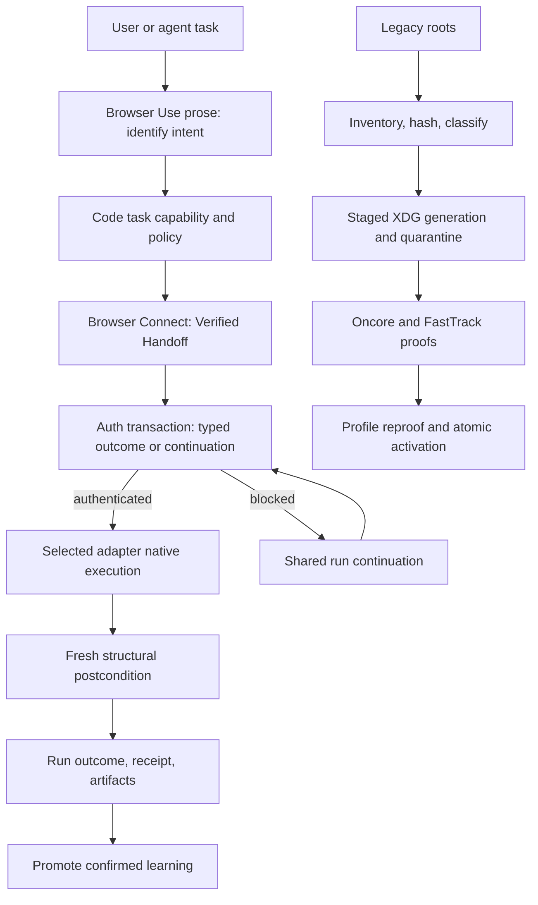

# Browser Use task router and XDG runbook platform - Plan

## Goal Capsule

- **Objective:** turn `browser-use` into the one browser-work front door: interpret the requested outcome, validate a specialist route, attach through Browser Connect, consume a typed authentication outcome, execute or resume durable runbooks, and return structural evidence.
- **Immediate value:** migrate the existing Browser Automation corpus into Browser Use's XDG stores and prove Oncore and FastTrack360 timesheet save-draft flows through Agent Browser.
- **Auth boundary:** `docs/plans/2026-07-21-003-feat-browser-use-cross-adapter-authentication-plan.md` owns the Browser Authentication Transaction, Browser Use Adapter Lane Registry auth admission, 1Password bindings, two-helper raw-secret boundary, sensitive-run guard, and per-lane pause/resume conformance. This plan owns the shared run and consumes its redacted outcome.
- **Authority:** this plan supersedes future-product ownership in `skills/browser-use/docs/PRODUCT.md`, `skills/browser-use/CONTEXT.md`, `runtime/browser-connect/TASKS.md`, and archived `browser-domain-memory` material. Historical documents remain evidence, not roadmap authority.
- **Stop conditions:** bypass Browser Connect proof; duplicate auth internals; execute unreviewed migrated code; retry an `unknown` mutation; activate a partial migration; or delete the legacy corpus without separate approval.
- **Tail:** prove both timesheet shapes, account for every legacy artifact, cut all runtime reads to new XDG roots, add specialist lanes, consolidate product context, and run repository/skill gates.

---

## Product Contract

### Summary

`browser-use` becomes a thin specialist router over deep owned Modules. Skill prose interprets the desired outcome. Code validates task/capability policy, obtains a Verified Handoff from Browser Connect, asks the shared authentication transaction to prove or establish session readiness, preserves adapter-native continuity, executes the selected task/runbook, and classifies completion from fresh structural evidence.

| Outcome | Preferred adapter | Platform responsibility |
|---|---|---|
| Daily automation, runbooks, extraction, scraping | `agent-browser` | Native session, typed inputs, structural postconditions, resumable outcomes |
| Frontend interaction, locator/ARIA assertions, trace/codegen/HAR evidence | `playwright-cli` | Connection proof, task capability, native artifacts, honest CDP limitations |
| Debugging, console/network/heap work, traces, Lighthouse | `chrome-devtools-cli` | Daemon attachment, task capability, private defaults, native evidence |
| Existing snapshot, screenshot, emulation operations | `chrome-devtools-mcp` | Existing MCP continuity and current operation contracts |

No lowest-common-denominator browser API hides adapter semantics. The shared platform contracts stop at task intent, handoff identity, auth outcome, run identity, target identity, postcondition, receipt, artifact, and continuation.

### Problem Frame

The repository has strong lower boundaries but no complete product above them. Warm Chrome proves a browser environment. Browser Connect proves attachment. Browser Use currently exposes target selection plus a small Chrome DevTools MCP operation surface. It lacks the live task router, XDG store, runbook runtime, specialist CLI lanes, migration runtime, durable outcomes, and timesheet vertical proofs.

The legacy `$XDG_CONFIG_HOME/side-quest/browser-automation` corpus contains 30 configured services, 22 domain trees, 65 active domain files, three vendor files, central config and registry, one retained observation, 93 backup files, and two top-level backup files: 166 artifacts total, 71 current non-backup artifacts. It mixes durable knowledge, runtime evidence, executable JavaScript, obsolete absolute paths, 1Password pointers, and retired commands. A raw copy would preserve unsafe execution and the wrong owner.

The product vocabulary also conflicts. `skills/browser-use/CONTEXT.md` assigns knowledge to archived `browser-domain-memory`; `skills/browser-use/docs/PRODUCT.md` still centers N-engine consensus/fallback; Browser Use adapter identity is split across discovery, dormant router, and the Chrome MCP transport. The platform must consolidate future authority while the auth plan establishes the shared Adapter Lane Registry.

### Actors

- A1. Agents asking Browser Use to automate, inspect, debug, audit, replay, or scrape.
- A2. The operator approving risky actions, final submission, and destructive legacy cleanup.
- A3. Browser Use as task, runbook, shared-run, evidence, artifact, and recovery owner.
- A4. Browser Authentication Transaction as the typed session-readiness owner.
- A5. Browser Connect as the only connection and attachment-proof owner.
- A6. Warm Chrome as physical profile, authenticated browser environment, and lifecycle owner.

### Requirements

**Product and ownership**

- R1. `browser-use` is the only user-facing browser-work front door and durable browser-knowledge owner. It owns task interpretation, task capability policy, runbooks, shared runs, evidence, artifacts, and recovery. Its first-release invocation surface is an agent-neutral CLI and JSON contract with equal Claude Code and Codex support; no caller-specific SDK or private API becomes product authority.
- R2. `browser-connect connect <adapter> --json` remains the only adapter attachment route. Browser Use passes the verified endpoint verbatim and never lets an adapter discover or launch a fallback browser.
- R3. Warm Chrome retains physical profile and browser-managed session state. Browser Use stores logical environment/profile references only.
- R4. Retire `browser-domain-memory` as a live owner. Absorb useful runbook, capture, replay, gotcha, and outcome requirements into Browser Use.
- R5. Human-readable output projects the same code-owned JSON contracts agents use. Claude Code, Codex, `launchd`, and future callers invoke the same command and consume the same schema. Prose proposes a route; code proves task capability, handoff, auth readiness, policy, and result.
- R6. Consume the auth plan's lane identity, secret-free transaction fragment, and bounded auth attestation through the platform-owned run integration Port. Revalidate attestation freshness immediately before mutation. Every selected adapter may require auth, but platform code never writes auth fragments directly, implements credential discovery/retrieval/delivery, or switches adapters for login.

**XDG ownership and safe writes**

- R7. Resolve Browser Use paths through one code owner. Reject relative XDG values. Use XDG 0.8 defaults when config, data, state, or cache variables are empty.
- R8. Store non-secret policy, services, environment selectors, adapter preferences, and approved auth-pointer projections under `$XDG_CONFIG_HOME/browser-use/`.
- R9. Store curated domains, vendors, runbooks, gotchas, selectors, playbooks, and approved user-authored assets under `$XDG_DATA_HOME/browser-use/`. Active discovery never scans migration archives.
- R10. Store runs, adapter-session references, checkpoints, outcomes, artifact manifests, auth outcome references, migration manifests, source snapshots, inactive migration archives, and the authoritative Corpus Generation Manifest under `$XDG_STATE_HOME/browser-use/` with explicit retention/deletion routes.
- R11. Store rebuildable indexes, compiled projections, and probes under `$XDG_CACHE_HOME/browser-use/`. Store locks, sockets, and auth-owned ephemeral references under `$XDG_RUNTIME_DIR/browser-use/`, with a private warned fallback when absent.
- R12. Create private roots as `0700` and private files as `0600`. Refuse symlink traversal and version-controlled write targets unless mechanically proven ignored.
- R13. Route durable mutation through Browser Use commands with preview, same-filesystem temp write, content flush, rename, parent-directory flush, lock, validation, redacted receipt, status, repair, and deletion. Reject cross-device rename or use explicit copy-verify-commit semantics. Hand-editing XDG YAML is not an operating procedure.

**Clean-break migration**

- R14. Freeze inventory as a Source Snapshot Manifest containing root identity, relative path, type, size, mode, content hash, and snapshot digest. Assert all 166 artifacts and 71 current inputs. Emit one disposition per snapshot entry plus one explicit alias/shared-domain/unresolved disposition for all 30 services despite the 30-service/22-domain mismatch.
- R15. Transform the 71 current non-backup artifacts into new config/data/state schemas. Put non-secret backups and migration proof in a checksummed inactive state archive outside active discovery/execution. For secret-positive artifacts, retain a hash-bound reference to the read-only source or require a separate encrypted-archive decision; never duplicate plaintext credentials into Browser Use roots.
- R16. Split mixed files by ownership: durable knowledge to data, policy/pointers to config, outcomes/observations to state, rebuildable material to cache.
- R17. Remove obsolete `debug_port`, `user_data_dir`, `surface-manager`, `surface`, retired commands, legacy absolute-path authority, and former-owner names. Convert aliases/folders to logical service/workflow ids and explicit allowed origins.
- R18. Preserve legacy JavaScript losslessly but quarantine it. Promote deterministic code only after origin, workflow, action, syntax, hash, side-effect, and confirmation review; prefer repo-owned runtime actions.
- R19. Stage and verify immutable config/data generations, then activate them through one Corpus Generation Manifest under XDG state. The manifest binds generation ids, hashes, accepted Warm Chrome Profile Migration Receipt ids, and a monotonic activation epoch; commit uses compare-and-swap against the prior epoch. Readers resolve only through this record. Never claim cross-root atomicity from independent renames. After commit, live code reads no legacy path and never rolls back to one.
- R20. Preserve the source and prior Warm Chrome profiles read-only until all artifacts reconcile, both timesheet proofs pass, every candidate profile has an accepted Profile Migration Receipt, and the user separately approves cleanup. Before activation commit, abort leaves the prior generation active. After commit but before external mutation, compare-and-swap rollback may select a fully verified prior XDG generation. After new-generation state or external mutation, stop and repair forward.

**Routing, execution, and evidence**

- R21. Define code-owned task intents and evidence for routine automation, scraping, frontend testing, locator/ARIA assertions, trace inspection, HTTP replay, runbook execution, debugging, performance profiling, and Lighthouse auditing.
- R22. Distinguish Browser Runbook execution, Playwright trace inspection, Playwright code generation, HAR replay, and future Recorder/Puppeteer replay. A trace is evidence, not an executable runbook.
- R23. Keep Lighthouse audit separate from performance profiling. Accessibility-tree/ARIA inspection is not a complete accessibility audit.
- R24. Each shared run persists one of `awaiting-auth`, `awaiting-approval`, `awaiting-user-presence`, `ready`, `running`, `confirmed`, `not-achieved`, `unknown`, or `needs-human`, plus exactly one next safe action where blocked.
- R25. Declare a structural postcondition before mutation, observe fresh post-state through the same adapter continuity, and classify terminal truth as `confirmed`, `not-achieved`, or `unknown`.
- R26. Never retry or switch adapters after a dispatched mutation with `unknown` effect. Fallback is allowed only before mutation or for explicitly read-only work.
- R27. Serialize mutating runs per environment/profile, auth context, target, and runbook initially. Expose lease holder, heartbeat, expiry, monotonic fencing token, activation epoch, and stale-recovery proof. Reject writes and receipts from stale holders or epochs. Distinct proven profiles may proceed independently.
- R28. Preserve selected task-adapter continuity across auth pause/resume, execution, and structural verification. The auth plan's transaction-internal Confidential Field Delivery Helper may act on the same proven target without becoming or switching the task adapter. Invalidate adapter-local refs after helper delivery; sessions, traces, replay formats, and artifact handles never cross lanes.
- R29. Give every raw artifact a manifest with run, task, adapter/version, sanitized target, producer capability, hash, sensitivity, retention class, and outcome. Raw authenticated artifacts are ephemeral by default; failure/drift evidence lasts seven days; explicit exports transfer outside default-retention ownership. Retention deletion is idempotent/crash-resumable, removes bytes and rebuildable indexes, and leaves a redacted tombstone that distinguishes deleted from missing/corrupt. Only curated knowledge enters XDG data.

**Runbooks and timesheets**

- R30. Discover and validate runbooks from XDG data with service/workflow id, allowed origins, typed inputs, auth context reference, Session Identity Proof policy, Human Identity Attestation eligibility, exact mutation-target ownership and scope proof, action policy, selectors, postconditions, approvals, and promoted asset hashes. Runbooks may allow a one-run attestation after bounded proof failure but never define standing identity exceptions or override authoritative mismatch.
- R31. Journal learning to scratch, validate selector meaning, promote only after confirmed success, atomically swap one active runbook per flow, append a redacted outcome, and expose healthy/degrading/stale status with recapture guidance.
- R32. Timesheets accept typed portal, period, daily entries, job/rate, breaks, and submit intent; bind current timesheet id/period before mutation; compare existing values; fill only exact/idempotent or explicitly reconciled state; verify and save draft.
- R33. Final submit requires either an active standing authorization or an exceptional one-use approval. Standing authorization binds portal/service, expected account/tenant, environment/profile, allowed origins, runbook and action-policy hashes, allowed submit class, human-confirmed period/hour/value limits, and duplicate-action key policy. Validated runbook declarations and observed portal constraints may propose limit values and provenance, but cannot authorize them. The human confirms the exact values once; the broker signs those values as the hard boundary. The policy remains valid until explicit revocation or atomic invalidation after runtime observes drift in a bound fact; an invalidated policy id never becomes valid again. Immediately before submit, evaluate the current timesheet id, period, entry digest, identity basis, environment/profile, origin, runbook and action-policy hashes, mutation class, limits, persisted submitted state, and reservation against that policy. Identity basis is either Session Identity Proof or one atomically consumed Human Identity Attestation bound to this exact run and mutation target. Matching runs proceed without Touch ID. Exceeded limits, duplicate/unknown effect, unresolved identity, ambiguity, or scope expansion pauses that run before dispatch. Annual review reminders are advisory and non-blocking.
- R34. Oncore and FastTrack360 run only from the staged/new owner, consume a conforming Agent Browser auth outcome, reconcile partial persistence, and stop at verified save-draft by default.

**Agent-native control**

- R35. JSON discovery exposes task intents, adapter/task capability, auth readiness reference, runbooks, migration status, active leases, artifacts, retention, run status/resume/cancel, and repair. Plain output projects the same state. Invocation carries caller metadata for audit only; caller identity never changes task semantics, authority, or output schema.
- R36. Agents may inspect, prepare, execute approved operations, resume, cancel, export, retain, delete, and repair through the same durable objects as operators. Human gates remain explicit continuations.
- R37. Cancellation reports the last proven external-effect classification. It never implies rollback after a mutation may have reached the site.

### Acceptance Examples

- AE1. **R1-R6, R21.** A timesheet request selects Agent Browser, obtains one handoff, consumes an authenticated outcome, and remains in the same native continuity.
- AE2. **R5, R21-R23.** A frontend accessibility request distinguishes an ARIA regression from a Lighthouse audit and routes or refuses honestly.
- AE3. **R2, R21-R23.** Lighthouse selects full Chrome DevTools CLI; performance selects a trace route; neither reports the other capability.
- AE4. **R7-R13.** Absolute temporary XDG roots create private stores, atomic writes, JSON/plain parity, and restartable state. Relative/unsafe roots fail with one repair continuation.
- AE5. **R14-R20.** Migration accounts for 166 files and 30 services, imports current artifacts once, archives backups outside discovery, quarantines code, and activates with zero legacy reads.
- AE6. **R18.** Unchanged migrated JavaScript refuses execution until a promotion record binds content hash and action policy.
- AE7. **R6, R24, R28.** Any selected lane may return `awaiting-auth`; the shared run survives approval/restart and resumes the same lane. No platform code sees a credential.
- AE8. **R24-R28.** A save timeout after dispatch records `unknown`, keeps same-lane inspection, and never repeats or falls back.
- AE9. **R27, R32-R33.** Two agents targeting one profile/auth context/timesheet serialize; distinct proven profiles remain independent. A submit matching active standing authorization proceeds without Touch ID and records policy/evaluation digests; observed bound-fact drift atomically invalidates its policy id; a duplicate, invalidated, ambiguous, unknown-effect, or out-of-limit submit pauses before dispatch.
- AE10. **R14-R20, R30-R34.** Oncore discovers from staged/new XDG data, consumes Agent Browser auth, saves a controlled week, proves persisted fields and `submitted=false`, and writes a confirmed receipt without legacy reads.
- AE11. **R14-R20, R30-R34.** FastTrack360 proves the same lifecycle through its distinct selector/action shape before corpus activation.
- AE12. **R19-R20.** Interruption before activation commit leaves the prior generation active and source intact. After commit, apply R20's bounded compare-and-swap rollback or repair-forward rule; reapply is idempotent.
- AE13. **R25, R32.** Resume after partial persistence reads fresh server state, reports the exact diff, and never repeats saved values or trusts unchanged-page evidence.
- AE14. **R29.** A HAR, heap, scrape, or trace is high-sensitivity, summarized by bounded reference, removed under default retention, and never promoted automatically.
- AE15. **R35-R37.** A fresh agent in a neutral directory discovers all safe next actions through JSON; cancel after possible mutation reports `unknown`, not rolled back.
- AE16. **R1, R5, R35-R37.** Equivalent Claude Code, Codex, and `launchd` invocations produce the same parsed request, policy evaluation, run state, JSON result, continuation, and repair path. No caller-specific branch grants capability or authority.

### Success Criteria

- Browser Use is the only browser-work front door and durable knowledge owner.
- Routine automation, Playwright frontend evidence, Chrome debugging/performance/Lighthouse, and retained MCP operations attach only through Browser Connect and advertise proven task capabilities.
- Oncore and FastTrack execute from migrated XDG knowledge with typed auth outcome, structural postconditions, resumable state, and confirmed save-draft receipts.
- All 166 artifacts and 30 services have inspectable dispositions; no backup or unapproved executable enters discovery.
- Browser Use performs zero live reads or roadmap routing through Side Quest or `browser-domain-memory`.

### Scope Boundaries

**Included now**

- Specialist task routing for Agent Browser, Playwright CLI, Chrome DevTools CLI, and retained Chrome DevTools MCP.
- XDG config/data/state/cache/runtime ownership and safe mutation.
- Full legacy inventory, transformation, inactive archive, coordinated Warm Chrome profile move/reproof, and no-fallback activation.
- Shared runs that consume the separate auth transaction outcome.
- Runbook discovery/execution/outcomes/promotion, scraping, frontend evidence, debugging, profiling, Lighthouse, and artifacts.
- Oncore and FastTrack360 vertical proofs.
- Agent-neutral invocation through the same CLI/JSON contract from Claude Code, Codex, or an external scheduler while the enrolled user session is available.

**Deferred**

- A Browser Use-owned scheduler, calendar engine, wake/login manager, or long-lived daemon. First-release scheduled use calls the agent-neutral CLI from an external scheduler.
- Cross-machine XDG synchronization.
- Concurrent mutation in one environment or multi-profile fleet scheduling.
- Autonomous selector healing beyond review-gated promotion.
- N-engine quorum, cost-learning routing, and automatic failover.

**Human-only**

- Auth-plan approvals and physical-presence steps.
- One-run Human Identity Attestation when Session Identity Proof cannot be completed and the auth plan permits attestation.
- Final timesheet submission without explicit standing authorization.
- Destructive legacy source/state removal.

**Human-friction budget**

- Routine runbook execution and verified save-draft: zero platform approval grants.
- Final timesheet submission matching active standing authorization: zero per-run Touch ID prompts.
- Creating, expanding, replacing, or revoking standing authorization: one Touch ID-backed interaction. The broker may prefill evidenced limits, but the human confirms their exact signed values once. Annual review reminders never block a run or require reauthorization.
- Destructive legacy cleanup: one separate Touch ID-backed grant for the exact cleanup manifest.
- Auth ambiguity or physical-presence challenges follow the auth plan and do not create duplicate platform prompts.

### Dependencies / Assumptions

- `docs/plans/2026-07-21-003-feat-browser-use-cross-adapter-authentication-plan.md` supplies the lane registry identity, authenticated outcome, user-presence continuation, and auth conformance evidence.
- Timesheet cutover depends on that plan's Agent Browser session-reuse proof and, when an expired login must be recovered unattended, shared-helper delivery with Agent Browser continuity. It does not depend on Playwright or Chrome fresh-login proofs.
- Browser Connect's handoff can evolve atomically with Browser Use's pinned consumer to carry logical environment/profile identity.
- Warm Chrome can migrate and re-prove named profiles without taking task/runbook ownership.
- Pinned Playwright CLI CDP mode and Chrome DevTools CLI advertise only capabilities proven against Warm Chrome.

### Sources / Research

**Repository**

- `skills/browser-use/SKILL.md` - current workflow and adapter routes.
- `skills/browser-use/src/command-contract.ts` - shipped public contract and single live transport.
- `skills/browser-use/src/discovery-model.ts` - current lane identity evidence.
- `skills/browser-use/src/browser-use-discovery.ts` - verified handoff validation seam.
- `skills/browser-use/src/browser-use-runtime.ts` - injectable runtime I/O pattern.
- `runtime/browser-connect/src/adapters/registry.ts` - connection-only Adapter Definitions.
- `runtime/browser-connect/src/contract.ts` - Verified Handoff.
- `runtime/warm-chrome/` - physical profile and browser environment owner.
- `docs/decisions/2026-06-06-001-decisions-skill-decision-log.md` - Decision 101 archives `browser-domain-memory`.
- `docs/decisions/2026-07-14-001-browser-connect-architecture-decision-log.md` - Browser Connect boundary.
- `docs/plans/2026-07-16-001-refactor-browser-use-migration-cleanup-plan.md` - connection migration and stale roadmap pointers.
- `docs/plans/2026-07-21-001-fix-browser-use-action-continuity-plan.md` - ref continuity and three-way terminal truth.
- `skills/browser-use/docs/research/2026-06-13-ref-staleness-verify-layer-findings.md` - fresh post-state proof.
- `skills/browser-use/docs/research/2026-05-30-tape-format-record-replay-browser-automation.md` - replay/runbook constraints.
- `skills/context-advisor/references/storage-routing.md` - XDG ownership.
- Legacy `$XDG_CONFIG_HOME/side-quest/browser-automation` and `$XDG_STATE_HOME/side-quest/browser-automation` - migration input only.

**Official external documentation**

- [XDG Base Directory Specification 0.8](https://specifications.freedesktop.org/basedir-spec/latest/) - path meaning, defaults, absolute paths, and runtime fallback.
- [Agent Browser repository](https://github.com/vercel-labs/agent-browser) - native automation, session/state, and auth surfaces.
- [Playwright CLI capabilities](https://playwright.dev/agent-cli/capabilities) and [attachment](https://playwright.dev/agent-cli/commands/attach) - sessions, CDP attachment, tracing, codegen, and artifacts.
- [Playwright `connectOverCDP`](https://playwright.dev/docs/api/class-browsertype#browser-type-connect-over-cdp) - Chromium-only lower-fidelity attachment.
- [Playwright accessibility testing](https://playwright.dev/docs/accessibility-testing) - automated/manual accessibility boundary.
- [Chrome DevTools CLI guide](https://github.com/ChromeDevTools/chrome-devtools-mcp/blob/main/docs/cli.md) - daemon, generated tool subset, and lifecycle.
- [Chrome DevTools MCP tool reference](https://github.com/ChromeDevTools/chrome-devtools-mcp/blob/main/docs/tool-reference.md) - Lighthouse, performance, debugging, and automation capabilities.
- [Chrome DevTools for agents](https://developer.chrome.com/docs/devtools/agents/get-started) - suite shape and authenticated-browser security warning.

---

## Planning Contract

### Key Technical Decisions

- **KTD1 - Thin specialist router, deep owned Modules.** Prose interprets intent; code validates task capability, handoff, auth outcome, policy, and postcondition. Rejected: universal click/fill/debug facade and prose-only routing.
- **KTD2 - Preserve three ownership layers.** Warm Chrome owns browser environment/profile, Browser Connect owns attachment, Browser Use owns task/runbook/shared-run/outcome. The auth plan owns the authentication sub-transaction.
- **KTD3 - One Browser Use evidence-composition lane registry across both plans.** Browser Connect produces immutable connection evidence; platform lane Implementations produce task evidence; auth conformance produces auth evidence. The registry composes their digests through a stable registration Interface. No unit extends its schema or duplicates executable/provenance facts. Rejected: a second registry or three overlapping identity owners.
- **KTD4 - Browser Use absorbs durable browser knowledge.** Retire Side Quest and `browser-domain-memory` ownership. Preserve useful evidence only.
- **KTD5 - One writer per XDG owner.** Browser Use owns config/knowledge/run state/cache/runtime coordination. Warm Chrome owns profile bytes and browser session state.
- **KTD6 - Clean break through one state-owned Corpus Generation Manifest.** Freeze a source snapshot, transform immutable config/data generations, archive safe history outside discovery, prove two vertical slices/profile receipts, then compare-and-swap one manifest containing all accepted generation ids/hashes and the activation epoch. Rejected: independent cross-root pointers, automatic legacy fallback, and blind rollback after new-generation effects.
- **KTD7 - Migrated code starts inert.** Preserve losslessly, quarantine, promote by reviewed hash/action policy, and prefer repo-owned actions.
- **KTD8 - Authentication is consumed, never reimplemented.** The shared run pauses on a typed auth substate and resumes same-lane continuity. Platform units store no secret or 1Password workflow.
- **KTD9 - Evidence owns terminal truth.** Every mutation declares a structural postcondition and ends `confirmed`, `not-achieved`, or `unknown`. Unknown blocks repeat and adapter switch.
- **KTD10 - Replay names the artifact.** Runbook execution, trace inspection, code generation, HAR replay, and Recorder/Puppeteer replay remain distinct.
- **KTD11 - Timesheet-first clean cutover with a parallel password gate.** Proven Agent Browser session reuse is the release floor. Run the auth plan's U0 two-helper containment and Agent Browser continuity spike in parallel; include fresh password auth only if it conforms, and never delay Oncore/FastTrack or corpus activation on that result.
- **KTD12 - Version-gated specialist lanes.** Pin adapter releases, snapshot discovery/help, use private Chrome defaults, and prove each CDP task capability. Unsupported means typed refusal.
- **KTD13 - Named environment/profile enters the handoff.** Update producer/consumer atomically and serialize initial mutations by profile/auth context/target/runbook.
- **KTD14 - Standing authorization preserves autonomy.** Touch ID establishes a bounded future-action envelope once. Matching runs evaluate it mechanically and record policy/evaluation digests; runtime may narrow or refuse but never expand scope. Rejected: biometric approval on every run and unbounded autonomous mutation.
- **KTD15 - Browser Use is schedulable, not a scheduler.** Release one exposes one agent-neutral CLI/JSON contract with equal Claude Code and Codex support. External callers such as `launchd` or Codex Automations may trigger it while the enrolled user session is available. Browser Use owns run safety and restart semantics, not clocks, calendars, wake/login handling, or missed-trigger policy. Rejected: Codex-specific integration as authority and an internal scheduling platform in the first release.
- **KTD16 - Human Identity Attestation is a one-run auth outcome.** Platform code consumes the auth plan's identity basis and never implements a second override path. The attestation authorizes one exact run and mutation target after bounded Session Identity Proof failure; it cannot become standing authority or override authoritative mismatch, proven wrong account, or unproven target ownership.

### High-Level Technical Design



### Target XDG Shape

```text
$XDG_CONFIG_HOME/browser-use/
  services.yaml
  environments.yaml
  adapter-policy.yaml
  auth-bindings.yaml       # non-secret auth-plan projection

$XDG_DATA_HOME/browser-use/
  domains/<service-id>/
  vendors/<vendor-id>/
  runbooks/<service-id>/<flow-id>/

$XDG_STATE_HOME/browser-use/
  runs/<run-id>/
  outcomes/<service-id>/<flow-id>/
  artifacts/<run-id>/
  migrations/<migration-id>/
    source-snapshot.yaml
    archive/
  active-corpus.yaml

$XDG_STATE_HOME/warm-chrome/
  profiles/<environment-id>/

$XDG_CACHE_HOME/browser-use/
  indexes/
  compiled/
  probes/

$XDG_RUNTIME_DIR/browser-use/
  locks/
  sockets/
```

This is an ownership sketch. Code-owned contracts/schemas remain deterministic authority.

### Open Questions

**Resolved during planning**

- **What is the clean break?** One verified generation activation and zero live legacy reads. Source deletion remains separate approval.
- **What migrates?** All 166 artifacts enter the manifest; 71 current inputs transform; backups/evidence enter a checksummed inactive archive.
- **How far do timesheets go?** Fill and verified save-draft by default. Submit proceeds autonomously when exact current content matches active standing authorization; otherwise it pauses for one-use approval or policy change.
- **Who owns auth?** The separate auth plan. This plan owns the shared run and consumes a typed result for every adapter.
- **What gates first cutover?** XDG substrate, migration, Agent Browser task lane, proven Agent Browser session reuse, Oncore, FastTrack, and Warm Chrome profile reproof. The auth plan's U0 shared-helper containment and Agent Browser continuity spike runs in parallel; a failed password result remains typed unsupported evidence and does not delay cutover. Playwright/Chrome specialist work also stays non-blocking.
- **Is token efficiency assumed?** No. Measure representative output and latency before publishing claims.
- **Who triggers release-one runs?** Claude Code, Codex, humans, or external schedulers call the same agent-neutral CLI/JSON contract. Browser Use does not own scheduling.

**Deferred to implementation evidence**

- Which Playwright CLI task capabilities remain green over lower-fidelity CDP attachment.
- Which Chrome CLI functions remain in its experimental generated subset at the pinned release.
- Which migrated scripts deserve repo-owned ports versus reviewed hash-bound promotion.

### Deferred Work Log: Scheduling Platform

**Status**

- Deferred from release one by ADR 0025.
- Current contract: Browser Use is schedulable through its agent-neutral CLI/JSON surface but owns no clock, calendar, wake/login manager, or scheduling daemon.
- Follow-up trigger: both timesheet verticals pass release-one gates and at least one real Claude Code, Codex, or `launchd` schedule has produced operational evidence. Reopen earlier when external triggering causes a repeated failure that Browser Use cannot repair through its public contract.
- Required output: a separate scheduling plan, ownership ADR, threat-model delta, CLI contract change, and migration path. Never grow scheduling implicitly inside a task or runbook unit.

**Evidence to retain**

- Trigger source, requested wall-clock time, actual start time, timezone, and monotonic receipt time.
- Machine state at trigger: awake/asleep, user logged in, Keychain first-unlock status, Warm Chrome availability, network status, and Browser Use version.
- Run identity, schedule identity, deduplication key, standing-authorization result, lease result, final effect classification, and continuation.
- Missed, delayed, overlapping, cancelled, manually retried, and externally retried trigger outcomes.
- Notification delivery, acknowledgement, escalation, and repair completion.
- Redacted evidence only. Never retain credentials, session bytes, or OP token material.

**Research questions**

- **Ownership:** keep external scheduling permanently, add a thin macOS scheduling owner, or add a Browser Use scheduling Module?
- **Platform:** macOS `launchd` only, agent-host automations only, or a portable scheduler contract with platform Implementations?
- **Temporal model:** wall-clock, calendar recurrence, interval, event-triggered, or deadline-window semantics?
- **Timezone:** which timezone owns a schedule; how do timezone changes, daylight-saving gaps, repeated hours, locale changes, and clock correction behave?
- **Sleep and login:** wake the machine, run on next wake, skip, or expire? What happens before login, before first Keychain unlock, after logout, or during user switching?
- **Missed runs:** skip, queue once, queue every missed occurrence, or require per-workflow policy?
- **Concurrency:** how do schedule identity, run identity, fenced leases, and duplicate-action keys prevent overlapping or replayed mutations?
- **Retries:** which pre-mutation failures permit automatic retry? How are unknown effects, browser submission timeouts, and external scheduler retries forced into inspection?
- **Authorization:** how does scheduling preflight standing authorization, invalidation, limit breaches, passkey/CAPTCHA continuations, and revoked policies without weakening the broker?
- **Browser lifecycle:** who starts, repairs, or refuses Warm Chrome and adapter daemons? Never let the scheduler acquire profile or attachment ownership.
- **Versioning:** what happens when a due run meets a CLI/schema/runbook/adapter upgrade or stale conformance evidence?
- **Notifications:** which events need passive notice, acknowledgement, urgent escalation, or a human continuation? Which owner delivers them?
- **Recovery:** how does an operator inspect backlog, resume one occurrence, cancel future occurrences, and distinguish skipped from failed from unknown?
- **Security:** what principal installs schedules, edits them, reads their state, and invokes Browser Use? How are caller spoofing and schedule-file tampering detected?
- **Multi-machine behavior:** remain single-device, elect one device, or use a remote coordinator? Cross-machine synchronization remains a separate decision.
- **Agent parity:** prove Claude Code, Codex, human-shell, and scheduler-triggered runs preserve identical task semantics and authority.

**Candidate follow-up units**

- S0. Gather external-scheduler evidence and classify failures by trigger, platform, Browser Use, auth, browser lifecycle, or workflow owner.
- S1. Decide scheduler ownership and define schedule, occurrence, missed-run, cancellation, notification, and repair contracts.
- S2. Prove temporal semantics with timezone, daylight-saving, sleep/wake, login, clock-jump, and upgrade fixtures.
- S3. Integrate scheduling with existing run idempotency, fenced leases, standing authorization, duplicate-action reservation, and unknown-effect refusal.
- S4. Add inspectable status, backlog, notification, acknowledgement, resume, skip, cancel, and repair surfaces with JSON/plain parity.
- S5. Run Claude Code, Codex, `launchd`, restart, crash, upgrade, and security conformance before enabling mutation schedules.

**Entry gates**

- Release-one CLI/JSON, run-state, auth, duplicate-action, and repair contracts are stable and proven.
- Oncore and FastTrack scheduled invocations succeed through at least one external caller without caller-specific code.
- Real evidence identifies a benefit that cannot be achieved by a thin external trigger.
- Ownership, security principal, missed-run policy, and notification owner are explicit.

**Exit gates**

- One owner exists for schedule definitions and occurrence state.
- Every occurrence has deterministic start, skip, queue, deduplicate, cancel, and repair semantics.
- Sleep, login, first unlock, timezone, daylight-saving, overlap, retry, upgrade, and unknown-effect tests pass.
- Scheduled mutation cannot bypass standing authorization, identity-basis validation, adapter continuity, or duplicate-action protection.
- Claude Code and Codex remain equal callers of the same Browser Use task contract.

---

## Implementation Units

### U1. Reset product, shared-run, and handoff contracts

- **Goal:** establish one executable platform contract and named environment/profile handoff before moving data.
- **Requirements:** R1-R6, R21-R28, R35-R37; AE1-AE3, AE7-AE9, AE15-AE16.
- **Dependencies:** none. This unit defines the handoff identity, outer run envelope, opaque versioned auth-fragment slot, and integration Port that auth consumes.
- **Files:** `skills/browser-use/src/command-contract.ts`, parser/driver/core/runtime/capability/router model files and tests; `runtime/browser-connect/src/contract.ts`, `model.ts`, `command-contract.ts`, `compatibility.ts` and tests; Browser Use/Connect product/context docs.
- **Approach:** run `cli-author`. Define task intent, task capability, shared-run state/revision, opaque auth fragment/attestation reference, postcondition, receipt, artifact, continuation, environment/profile, and non-authoritative caller-metadata fields once. Retain `targets`/`operate`; add task/runbook/migration/run/artifact/repair families. Prove Claude Code, Codex, human shell, and external scheduler callers use the identical public command and JSON schema. Remove dormant fallback/quorum authority. Bump handoff schema and Browser Use pin atomically. Let auth own its pure fragment and lane/auth commands; platform remains the only run-store writer.
- **Test scenarios:** help/parser/JSON/runtime parity; caller omitted; Claude Code, Codex, and `launchd` caller metadata; identical requests produce identical semantics across callers; caller spoofing cannot grant authority; unknown task; old/malformed handoff; missing/mismatched profile; typed `awaiting-auth`; stale auth outcome; same-lane resume; cancel after possible mutation; current adapter attachment remains green; no live Side Quest/`browser-domain-memory` owner.
- **Verification:** drift gates and real process-boundary fixtures pass; one shared run schema is consumed by auth and platform without duplicate state owners.

### U2. Build the XDG store and resumable-run substrate

- **Goal:** give Browser Use safe config, knowledge, evidence, cache, coordination, and shared-run ownership.
- **Requirements:** R7-R13, R24, R27, R29, R35-R37; AE4, AE7-AE9, AE12, AE14-AE15.
- **Dependencies:** U1.
- **Files:** new `skills/browser-use/src/browser-use-paths.ts`, `browser-use-store.ts`, `browser-use-schemas.ts`, `browser-use-locks.ts`, `browser-use-runs.ts`, `browser-use-retention.ts`, matching tests/fixtures; revise public command files.
- **Approach:** centralize XDG resolution, defaults, ancestor/symlink validation, safe-directory checks, permissions, same-filesystem durable writes, locks, immutable generations, activation epochs, snapshots, retention tombstones, deletion, JSON/plain inspection, and fenced leases. Store auth only as opaque binding/outcome references. Non-secret locks/sockets may use the warned runtime fallback; any auth-plan secret transport must pass its separate Secure Runtime Root admission.
- **Test scenarios:** default/override/relative/unwritable roots; symlinked ancestor; loose permissions; crash before/after file or directory flush; cross-device target; two writers; same-profile contention; distinct-profile concurrency; auth-held lease; expired holder resumes after fenced takeover; process spans activation epoch; restart/resume; idempotent deletion; deleted versus missing artifact; export ownership transfer; runtime fallback; redacted receipts.
- **Verification:** expected modes; power-loss fixtures preserve the prior manifest; stale fencing tokens/epochs cannot write; neutral-CWD process inspects/resumes from JSON; no secret-bearing fixture enters durable state.

### U3. Build the clean-break migration engine and staged corpus

- **Goal:** account for, transform, and stage every legacy artifact without activating unsafe knowledge.
- **Requirements:** R14-R20, R30-R31; AE5-AE6, AE12.
- **Dependencies:** U2 and auth plan U3's binding-schema/candidate-import Interface. Migration never becomes a prerequisite for clean-machine authentication.
- **Files:** new migration/model/legacy-transform/secret-scan modules and tests under `skills/browser-use/src/`; representative fixtures; public command files; generated manifests only under XDG state.
- **Approach:** implement inventory/plan/apply/verify/status from one contract. Freeze the Source Snapshot Manifest before planning. Reject duplicate YAML keys. Inventory relations, backups, profile references, auth-pointer candidates, and stale paths. Bind every output to source snapshot id, transform version, logical destination id, and expected hash. Existing matching outputs are verified no-ops; mismatches are fatal collisions. Treat quarantined code as opaque bytes. Validate all active service/workflow/domain/runbook/action/profile/auth references while allowing explicit unresolved staging records. Leave the Corpus Generation Manifest unchanged until U7.
- **Test scenarios:** exact 166/71 baseline; 30/22 alias/shared/unresolved cases; malformed/duplicate YAML; obsolete commands/paths; repeated auth pointers; source drift after snapshot; destination collision; duplicate content; secret-positive backup; opaque executable asset; kill point between every durable phase; deterministic reapply; dangling/ambiguous active reference; installed discovery cannot see archive.
- **Verification:** every snapshot entry has one disposition; every destination has source/transform provenance and deterministic hash; staged generation is explicit; prior manifest remains active; no plaintext secret, retired owner, legacy authority, dangling active reference, or executable promotion slips through.

### U4. Implement Agent Browser runbooks and prove Oncore

- **Goal:** deliver the first valuable automation through the daily-work lane.
- **Requirements:** R1-R6, R21-R34, R35-R37; AE1, AE7-AE10, AE13-AE15.
- **Dependencies:** U1-U3, auth-plan U8 run integration, and the exact auth-plan U5 choreography row required by Oncore, or a fresh proven session-reuse row.
- **Files:** new runbook/runtime/postcondition/outcome/Agent Browser modules and tests under `skills/browser-use/src/`; staged Oncore XDG records.
- **Approach:** implement native Agent Browser navigate/observe/current-ref action/bounded reviewed evaluate/wait/structural verify. Preserve handoff, environment/profile, page, and native session continuity across auth and execution. Validate typed weekly inputs, timesheet id/period, allowed origins, auth-context reference, promoted actions, postconditions, authorization, and exactly one identity basis. Transform Oncore, reconcile existing rows, fill a controlled week, save draft, and reload/verify persisted values/total/editable state/`submitted=false`. Consume Human Identity Attestation only through the auth outcome, only for the bound run and target, and never as standing policy. Derive proposed authorization limits from validated runbook declarations and observed portal constraints, retain their provenance, and treat only exact human-confirmed broker-signed values as authority. When submit intent matches active standing authorization, reserve the duplicate key, submit without Touch ID, reload, and prove the portal's submitted terminal state; otherwise stop at verified draft with one authorization continuation.
- **Test scenarios:** invalid runbook/input; portal auth-shape preflight; required choreography unavailable; wrong service/origin/account/week/id; exact/conflicting/partial existing values; partial persistence; stale ref/navigation; false success; unknown save; stale auth attestation before mutation; missing/both identity bases; one-run Human Identity Attestation accepted for exact bound run/target; replay/target drift/claim drift/action drift rejected; authoritative identity mismatch and unproven target ownership refuse attestation; no standing identity exception; secret-bearing observation refusal; changed action hash; selector drift; crash/resume; reservation conflict; submit without valid authorization; unconfirmed proposed limits cannot authorize; proposal provenance is inspectable; confirmed limits are signed unchanged; matching standing-authorized submit with no biometric prompt; service/account/tenant/environment/profile/origin/runbook/action/mutation-class drift permanently invalidates the policy id; later fact reversion does not revive it; limit breach pauses only the run; annual review reminder is non-blocking; duplicate submit; unknown submit effect.
- **Verification:** installed neutral-CWD run discovers only new/staged XDG Oncore, attaches through Browser Connect, consumes auth, saves/verifies draft, emits `confirmed`, leak-checks artifacts, and reads no legacy path.

### U5. Add Playwright CLI and Chrome DevTools CLI connection lanes

- **Goal:** prove both specialist adapters attach to named Warm Chrome environments before task routing.
- **Requirements:** R2-R3, R6, R24-R29, R35; AE7-AE8, AE14-AE15.
- **Dependencies:** U1-U2. Coordinate exact lane ids with auth plan U1; connection work may proceed beside U3-U4.
- **Files:** new connection-only adapter files/tests under `runtime/browser-connect/src/adapters/`; registry/compatibility/environment/run/CLI/station/install docs/tests; Browser Use process-boundary fixtures.
- **Approach:** pin exact releases, provenance, rendered help, and capability discovery. Playwright uses named CDP attach/detach without closing Chrome. Browser Connect explicitly manages Chrome CLI daemon start/status/reconnect/stop, forbids implicit browser launch, injects the verified endpoint, and re-proves target/environment after recovery. Apply private Chrome defaults: usage statistics, CrUX, update checks, unredacted headers, and unrestricted roots off. Keep auth out of Adapter Definitions.
- **Test scenarios:** absent/wrong version; help drift; endpoint injection; same-Chrome proof; stale daemon/socket; crash/reconnect; multiple tabs; Playwright detach; privacy flags; restricted roots; no implicit launch; auth fields absent from definitions; browser survives detach.
- **Verification:** both definitions pass install, attachment, station, process-boundary, and harmless-action proofs; Browser Connect remains connection-only. U6 owns task-capability proof and unsupported-task reporting.

### U6. Implement specialist routing and evidence lanes

- **Goal:** expose the one-stop browser product without flattening native capabilities.
- **Requirements:** R1-R6, R21-R29, R35-R37; AE1-AE3, AE7-AE9, AE14-AE15.
- **Dependencies:** U4-U5 and U7 core cutover. Authenticated use of each specialist lane also depends on its auth-plan conformance row. This unit never gates U7.
- **Files:** new task-router/task-policy/Playwright/Chrome/artifact modules/tests; Agent Browser lane revisions; Browser Use skill/product/context/repair/test docs; Browser Connect task docs; `CONTEXT-MAP.md`.
- **Approach:** map language to task intent, then authorize the selected lane from the shared registry's live task/auth/attachment evidence. Implement routine automation and provenance-labelled scrape; Playwright assertions, locator/ARIA evidence, trace/codegen/HAR; Chrome console/network/heap/debug/Lighthouse/performance; retain MCP operations. Ingest bounded summaries/references, enforce sensitivity/retention/approval/reservation/unknown-effect rules, and never promote scrape payload automatically. Benchmark output size/latency before token-efficiency claims.
- **Test scenarios:** route matrix; user override; unsupported/stale evidence; authenticated versus unauthenticated lane; privacy-sensitive scrape; large tree; replay vocabulary; Lighthouse/performance split; read-only fallback; post-mutation fallback refusal; artifact cleanup/retention/export/deletion; JSON/plain parity.
- **Verification:** every route reports intent, lane, reason, handoff/run/environment identity, constraints, artifact refs, outcome, and safe continuation; no route launches Chrome or exposes raw sensitive artifacts.

### U7. Prove FastTrack, migrate profiles/corpus, and cut over

- **Goal:** activate migrated runbooks and retire all live legacy reads without waiting for specialist fast-follow lanes.
- **Requirements:** R1-R20, R24-R37; AE5-AE15.
- **Dependencies:** U3-U4, auth-plan U8 run integration, and the exact auth-plan U5 choreography row required by FastTrack, or fresh session reuse. U5-U6 and auth plan U6-U7/U9 are non-blocking fast-follow work.
- **Files:** staged/activated XDG records; U2-U4 modules; Browser Use skill/context/test/repair docs; Browser Connect context/architecture; Warm Chrome contract/docs/tests for profile reproof; decision record; repository entrypoint/workspace checks.
- **Approach:** transform/prove FastTrack through its distinct selector/action shape. Reconcile remaining records. Stop browser owners; let Warm Chrome snapshot/copy/fsync/hash/validate/start/re-prove each candidate profile, then issue one Profile Migration Receipt without destroying the prior profile. Migrate only Browser Use run state/logical references. Validate referential integrity, compare-and-swap the Corpus Generation Manifest against the prior epoch, install a no-legacy-read tripwire, and preserve source/archive/prior profiles until cleanup approval. Repair forward after any new-generation effect.
- **Test scenarios:** FastTrack exact/conflicting/partial state; auth, fill, Save, reload/list-state verification, unknown Save; remaining dispositions; SSO/multi-origin contexts; profile lock/corruption/reproof failure; one profile fails after others prove; CAS race; restart immediately before/after activation commit; rollback before external effect; rollback refusal after new-generation effect; stale epoch writer; archive invisibility; neutral-CWD commands; old-owner searches.
- **Verification:** Oncore/FastTrack pass from new roots; 166 artifacts/30 services reconcile; one authoritative manifest binds verified corpus/profile generations; no dangling active reference or stale writer survives activation; no active package opens a legacy/retired owner; core workflow works with U5-U6 absent; sync and repository gates pass.

---

## System-Wide Impact

- **CLI contract:** Browser Use grows one agent-neutral task, runbook, migration, shared-run, artifact, retention, and repair surface; `cli-author` prevents discovery/help/parser/runtime drift. Claude Code, Codex, human shells, and external schedulers share it.
- **Connection contract:** Browser Connect adds two connection-only Adapter Definitions and a handoff version carrying logical environment/profile identity.
- **Auth integration:** shared runs reference one auth substate/outcome. Platform files contain no secret values or duplicate binding/delivery state machines.
- **Browser lifecycle:** Warm Chrome owns physical profiles/session bytes. Browser Use carries logical identity only.
- **Persistent data:** 166 artifacts and Browser Use run state move owners; Warm Chrome separately moves/re-proves profiles. Manifests, hashes, locks, private modes, snapshots, and receipts make partial failure recoverable.
- **Agent parity:** Claude Code and Codex gain equal JSON discovery, runbook inspection, execution, resume/cancel, repair, artifact retention/export/deletion, and migration status through the same public contract; human-only gates remain explicit.
- **Roadmap authority:** stale Side Quest, Browser Facade, N-engine fallback, and `browser-domain-memory` ownership cannot remain active context.

## Risks & Mitigations

- **Auth leaks back into the platform.** Accept only opaque auth request/outcome references; prohibit credential fields in platform schemas and fixtures.
- **Legacy JavaScript becomes arbitrary code.** Quarantine, bind reviewed hashes/action policy, and prefer repo-owned actions.
- **Duplicate timesheet mutation.** Structural postconditions, leases, standing-policy evaluation, duplicate-action reservation, persisted submitted-state proof, unknown-effect inspection, and no post-dispatch fallback.
- **Profile corruption.** Warm Chrome owns stop/snapshot-copy/fsync/hash/start/reproof and issues Profile Migration Receipts; prior profiles remain recoverable until cleanup approval.
- **Half-migrated corpus.** Freeze a Source Snapshot, stage immutable deterministic outputs, validate referential integrity, and compare-and-swap one Corpus Generation Manifest while keeping source/prior generations intact.
- **Backups become active truth.** Non-indexed checksummed archive with no execution/discovery path.
- **Capability hallucination.** Pinned discovery/help/live proofs and typed unavailable/repair states.
- **Chrome daemon steals lifecycle ownership.** Browser Connect owns daemon lifecycle, forbids implicit browser launch, and re-verifies after recovery.
- **Playwright CDP overpromises.** Advertise only live-proven capabilities.
- **Telemetry or field-data leak.** Disable Chrome telemetry/CrUX/update checks/unredacted headers by default; explicit task opt-in for CrUX.
- **Roadmap splits again.** One Browser Use product/roadmap owner and one shared lane registry across both plans.

---

## Verification Contract

- Run Browser Use, Browser Connect, and Warm Chrome package tests including real process-boundary fixtures.
- Prove CLI discovery metadata, rendered help, parser, JSON schema, runtime semantics, and repair cannot drift.
- Prove Claude Code, Codex, human-shell, and external-scheduler invocations share parser, policy, state, JSON, continuation, and repair semantics; caller metadata grants no authority.
- Run workspace portability, command-entrypoint, build, type, lint, and diff checks from owning packages.
- Run isolated XDG tests for defaults/overrides, refusal, permissions, atomicity, locks, retention, deletion, and runtime fallback.
- Generate a receipt for 166 artifacts and 30 services; prove idempotent/interrupted apply, inactive archive, and zero live legacy reads.
- Prove Source Snapshot and destination provenance completeness, deterministic hashes, fatal collision handling, and active-reference integrity.
- Prove Corpus Generation Manifest compare-and-swap, activation-epoch fencing, before-effect rollback, after-effect repair-forward behavior, and restart at every commit boundary.
- Prove each Warm Chrome Profile Migration Receipt and recovery when one profile fails after others validate.
- Assert platform state/output contains no credential values and only opaque auth references/outcomes.
- Prove every lane attaches through the exact named Warm Chrome handoff, preserves native continuity, and refuses unproven task/auth capability.
- Prove platform code accepts exactly one identity basis from auth, consumes Human Identity Attestation only for its bound run and target, rejects replay or drift, and contains no standing identity-exception path.
- Prove standing-policy evaluation, policy/run evaluation digests, prompt-free matching submission, atomic permanent invalidation after observed bound-fact drift, no revival after fact reversion, limit refusal without policy widening, non-blocking annual review, duplicate-action reservation, revocation, and unknown-effect no-retry behavior.
- Benchmark representative snapshot, action, trace, Lighthouse, and performance output before token-efficiency claims.
- Run Oncore/FastTrack through installed front doors from a neutral directory; save draft, verify persisted values, scan artifacts, stop before unapproved submit.
- Re-prove each migrated profile/environment; search active packages/docs for legacy owners and paths.
- For first-party skill changes, follow `skill-author`, parse YAML, run owner-path checks, and run `setup sync --check --json`.
- File `skill-feedback` closeouts for material execution skills.

---

## Definition of Done

- Browser Use is the only browser-work front door and durable knowledge owner.
- Claude Code, Codex, humans, and external schedulers invoke the same agent-neutral CLI/JSON contract. Browser Use contains no caller-specific authority or first-release scheduler.
- Prose chooses intent; code proves task route, attachment, auth outcome, policy, and completion.
- Agent Browser, Playwright CLI, Chrome DevTools CLI, and Chrome DevTools MCP attach only through Browser Connect and advertise proven task/auth readiness.
- Browser Use XDG roots own config, knowledge, shared-run state, cache, and runtime coordination; Warm Chrome owns profile/session bytes.
- All 166 artifacts and 30 services have dispositions; current knowledge transforms; backups stay inactive; code stays inert until promoted.
- Runtime reads only new XDG roots. No compatibility reader, Side Quest owner, or `browser-domain-memory` workflow remains live.
- Oncore and FastTrack consume the separate Agent Browser auth proof, save draft, structurally verify, and emit confirmed receipts.
- Unknown mutations never repeat; final submit stays authorization-gated while matching standing-authorized runs remain autonomous.
- Missing Session Identity Proof may use one exact Human Identity Attestation; authoritative mismatch, wrong-account evidence, target drift, replay, or missing target ownership refuses mutation.
- Specialist task routes preserve native continuity and artifact semantics without blocking timesheet-first cutover.
- Package, process-boundary, XDG, migration, live adapter, timesheet, skill, and workspace gates pass.

---

## Execution Order

1. Land U1's handoff identity, outer run envelope, opaque auth slot, and integration Port with no mutual auth dependency.
2. Build U2 XDG/run CAS substrate and single fenced lease owner.
3. Build auth plan U1-U3; then let U3 migration consume its binding-schema/candidate-import Interface.
4. Build U3 migration engine and staged disposition ledgers while auth U0 proves portal session reuse and falsifies the two-helper password path.
5. Deliver U4 Oncore save-draft proof and auth U8 core integration on session reuse; admit auth U5 shared-helper delivery only after a conforming U0 password result.
6. Prove the exact FastTrack auth choreography; run U7 profile/corpus activation. Do not wait for specialist fast follows.
7. Build U5 Playwright/Chrome connection lanes when capacity allows.
8. Complete each lane's auth conformance before U6 advertises authenticated use.
9. Land U6 specialist routes and auth U9's full matrix/product-context closeout.
10. Run both Verification Contracts and preserve legacy/prior-profile sources pending separate cleanup approval.
