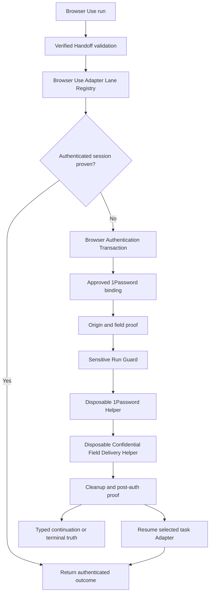

# Browser Use cross-adapter authentication - Plan

## Goal Capsule

- **Objective:** add a deep Browser Authentication Transaction Module and a Browser Use Adapter Lane Registry so Agent Browser, Playwright CLI, Chrome DevTools CLI, and Chrome DevTools MCP can encounter authentication without receiving credential bytes or switching task adapters.
- **Immediate value:** ship the Agent Browser timesheet lane on proven authenticated-session reuse, while an early falsification spike determines whether a disposable shared delivery helper can add safe expired-login recovery without blocking the release.
- **Architecture finding 1:** one Browser Authentication Transaction owns origin proof, 1Password binding, just-in-time secret lease, observer exclusion, disposable confidential field delivery, submission, cleanup, post-auth proof, and continuation.
- **Architecture finding 2:** one Browser Use Adapter Lane Registry owns lane identity, native execution Implementation, continuity, auth admission, evidence provenance, version, probe freshness, and repair state. Browser Connect's Adapter Definition remains connection-only.
- **Architecture finding 3:** one Browser Use Security macOS product owns native signing, installation, versioning, admission, upgrade, and repair while three separately signed executable targets preserve approval, token-retrieval, and confidential-delivery isolation.
- **Stop conditions:** any raw secret in an adapter, adapter plugin/daemon, argv, inherited environment, model context, stdout/stderr, browser evidence, trace, screenshot, crash state, or durable file; any raw-secret process other than the disposable 1Password helper or disposable Confidential Field Delivery Helper; a service-account token exposing zero or multiple vaults; any item binding outside deterministic-match/human-selection policy; any origin drift; any cross-adapter auth fallback; any blind retry after possible submission.
- **Tail:** pass value-aware sentinel tests for each advertised method, prove restart-safe continuations, integrate the auth outcome into the shared Browser Use run, and keep unsupported methods visibly unsupported.

---

## Product Contract

### Summary

Authentication is not generic form filling. The Browser Authentication Transaction is a safety-critical workflow after Browser Connect's Verified Handoff and before task mutation. It binds the selected adapter, environment/profile, target, auth context, exact top-level and credential-frame origins, approved 1Password item, required auth method, and declared post-auth proof into one resumable transaction.

Every adapter may encounter authentication. The selected task lane remains attached while Browser Use either proves an already-authenticated Warm Chrome session or pauses it for one disposable Confidential Field Delivery Helper operating against the same proven target. The helper is transaction-internal, not another task adapter. After auth, Browser Use invalidates stale adapter-local handles, proves identity, and resumes the selected lane. Adapters, plugins, and daemons never receive raw password or OTP bytes.

### Current Adapter Evidence

| Lane | Authenticated-session reuse | Fresh password | OTP | Passkey | Initial policy |
|---|---|---|---|---|---|
| Agent Browser 0.31.2 | Available after exact auth-state proof | Native provider is inadmissible if the plugin materializes raw values; shared helper requires same-target continuity proof | Same shared-helper rule; native pinned `auth login` also ignores OTP | User-presence only | Session reuse until shared delivery and Agent Browser resume pass conformance |
| Playwright CLI 0.1.17 | Available through attached/persistent state; storage state is sensitive | Native symbolic-secret flow is inadmissible if the daemon materializes values; shared helper requires same-target continuity proof | Same shared-helper rule plus multi-step proof | User-presence only | Session reuse until shared delivery and Playwright resume pass conformance |
| Chrome DevTools CLI | Daemon preserves browser state | Public `fill <uid> <value>` is inadmissible; shared helper requires same-target continuity proof | Same limitation | User-presence only | Session reuse until shared delivery and daemon resume pass conformance |
| Chrome DevTools MCP | Reuses attached browser state | Tool JSON is inadmissible; shared helper requires same-target continuity proof | Same limitation | User-presence only | Session reuse until shared delivery and MCP resume pass conformance |

These are planning-time observations, not permanent claims. The code-owned registry derives advertised support from pinned version discovery plus live conformance evidence. An upgrade invalidates evidence until re-probed.

### Actors

- A1. Claude Code, Codex, and other agents preparing, starting, inspecting, resuming, cancelling, or repairing browser runs through the same agent-neutral CLI/JSON contract.
- A2. The operator approving vaults, credential bindings, passkeys, security keys, CAPTCHA, consent, recovery, or terms prompts.
- A3. Browser Use as auth transaction, binding, policy, continuation, and audit-receipt owner.
- A4. Browser Connect as verified attachment owner only.
- A5. Warm Chrome as physical profile and authenticated browser-session owner.
- A6. 1Password as secret truth and authoritative item-access audit.
- A7. Adapter lanes as task-continuity and post-auth observation Implementations; they never receive raw secrets.
- A8. Disposable 1Password and Confidential Field Delivery Helpers as the complete raw-secret trusted computing base.
- A9. Browser Use Security as the single native product owner for the Approval Broker, Token Retrieval Launcher, and Confidential Field Delivery XPC targets.

### Requirements

**Ownership and seams**

- R1. Start authentication only after `browser-connect connect --json` passes Browser Use's pinned Verified Handoff validation. Bind the transaction to handoff schema, adapter id, environment/profile, endpoint identity, selected target, page/frame identity, and run id.
- R2. Keep Browser Connect's Adapter Definition connection-only. It never stores auth capabilities, bindings, selectors, or secrets and never becomes a credential transport.
- R3. Add one Browser Use Adapter Lane Registry keyed by the exact handoff `attachment.adapter_id`. Browser Connect remains authoritative for connection identity, executable version/provenance, and handoff proof; lane Implementations produce task evidence; auth conformance produces auth evidence. The registry composes immutable evidence references/digests and never duplicates producer facts. Resolve `chrome-devtools`/`chrome-devtools-mcp` and `playwright-cdp`/`playwright-cli` identity drift before rollout.
- R4. Represent capabilities as evidence-backed claims bound to executable realpath and digest/package integrity, dependency-lock identity, protocol/help fingerprint, platform, security-policy revision, probe time, proof status, unavailable reason, and next repair action. A same-version replacement, unknown claim, or stale claim fails closed.
- R5. Keep credential-method selection, confidential field delivery, and task-lane execution separate. One transaction-internal Confidential Field Delivery Helper serves every lane against the same proven browser target; it is not a public Browser Adapter. Task adapters publish pause/resume and post-auth evidence but never receive raw values. Never create a credential-source by browser-lane cross-product Interface.
- R6. The platform owns outer run lifecycle, revision, compare-and-swap persistence, and the only run-store writer. Auth owns a pure versioned secret-free transaction fragment and never writes the run store directly. One integration Port atomically commits the fragment plus platform summary against the prior run revision; a run cannot become `ready` without a committed bounded auth attestation.

**1Password vault and binding lifecycle**

- R7. Require `OP_SERVICE_ACCOUNT_TOKEN` for unattended vault access. Store the Browser Automation token as a non-synchronizing `AfterFirstUnlockThisDeviceOnly` item in the macOS data-protection Keychain under a private access group available only to the signed retrieval launcher. Do not require Touch ID or user-presence access control for routine reads. The launcher reads the one item and immediately `exec`s the disposable official `op` helper with an exact environment. Never place the token in Browser Use's parent environment, `with-env`, `.env.1password`, tmux server/session, persistent PTY, shell history, adapter, plugin, daemon, or delivery-helper environment. Reject 1Password Connect variables that would change the principal. Missing first unlock, item, entitlement, signing identity, or token validity returns a typed bootstrap/repair continuation.
- R8. Use a dedicated Browser Automation vault and service account with `read_items` only. The token's effective vault grant is the sole vault authority. Require exactly one token-visible vault; zero or multiple vaults return a typed scope-repair state. Browser Use maintains no parallel vault allowlist.
- R9. Inspect only redacted metadata for the one token-scoped vault. Store its opaque `vault_id` as observed binding context, never as a second permission system. Token rotation may preserve the vault identity; any scope change re-runs the exactly-one-vault proof before item discovery.
- R10. When no item binding exists, enumerate Login metadata only inside the token-scoped vault. Require an exact normalized origin or explicitly approved subdomain/IdP alias. Strip query and fragment; use optional approved login paths or path prefixes only to rank or disambiguate same-origin candidates, never to authorize another origin. Automatically bind exactly one deterministic match across origin, path, service/auth context, and expected account/tenant. Zero matches return missing-item; multiple or conflicting matches require redacted human selection through a signed one-use grant. Cache `service_id + auth_context + allowed_origins + allowed_login_paths + vault_id + item_id + allowed_auth_methods + binding_revision`. Reject file edits, replay, cross-purpose substitution, and expired/revoked grants.
- R11. Runtime authentication uses the approved exact binding and never rescans. Moved, archived, deleted, revoked, expired, or out-of-scope bindings return a typed repair state and never auto-select a replacement.
- R12. Fetch only the required username/password field and current OTP just in time. Never fetch or persist a TOTP seed. Token rotation preserves bindings; token revocation fails closed.
- R13. Keep passkeys in the 1Password extension/user-presence lane. Never extract, export, edit, or silently replace passkeys through service-account CLI access.

**Authentication transaction**

- R14. Prove exact top-level origin and credential-frame origin immediately before every secret delivery. Reject unapproved redirects, embedded frames, target replacement, page replacement, or stale field references.
- R15. Model multi-step authentication: identify auth state; select account context; fill username; submit if required; re-prove origin/page/frame; fill password; submit; detect OTP, passkey, error, lockout, rate limit, or success; then prove the declared authenticated postcondition.
- R16. Acquire a short-lived secret lease only after field and origin proof. The complete raw-secret trusted computing base is one disposable 1Password helper and one disposable Confidential Field Delivery Helper connected by a private inherited pipe. Only the 1Password helper receives `OP_SERVICE_ACCOUNT_TOKEN`; only the delivery helper receives one requested field value and a pre-opened verified browser-channel handle. Unattended service-account reads never pass through tmux, a persistent PTY, or an interactive shell. Tmux or a persistent agent-host PTY, including Claude Code or Codex, may preserve interactive desktop-app sign-in only; that branch returns `awaiting-user-presence`, never feeds raw values into unattended delivery, and resumes through a fresh identity basis. Long-lived Browser Use, approval broker, task adapters, plugins, daemons, agents, and public CLIs receive opaque capabilities or redacted evidence only.
- R17. The internal Sensitive Run Guard acquires the platform's single environment/profile sensitive lease, persists a quarantine marker before secret acquisition, stops and verifies every Browser Use-registered capture producer, disables adapter-native capture, and blocks Browser Use evidence entrypoints until cleanup. Detect known foreign attachments where possible and fail closed. Treat the official `op` binary as a short-lived trusted networked process: give it the exact token/item/field environment but no browser endpoint or channel, and make no false claim of 1Password-domain-only network confinement. Implement the Confidential Field Delivery Helper as a signed disposable macOS XPC service under App Sandbox with no outgoing/incoming network entitlement and no broad file entitlement. Pass only a private secret-pipe descriptor and a pre-opened verified browser-channel descriptor through supported XPC file-descriptor APIs. Admit unattended delivery only after a live probe proves the sandboxed service can use those inherited connected descriptors while it cannot open new connections or unrelated files. The helper exits after one bounded field action. Undetectable external same-user/OS observers are outside the enforceable guarantee and must be named in the threat model. Prohibit clipboard delivery; require an automation-profile policy for browser password saving, autofill, sync, and credential-save prompts.
- R18. On failure, clear secret-bearing DOM fields and prove clearing before observers resume. Zeroize in-process buffers where the runtime permits. Never claim rollback after a submission may have reached the identity provider.
- R19. Treat wrong password, wrong OTP, lockout, throttling, challenge escalation, and unknown submit effect as separate terminal or continuation states. Key attempt budgets by credential binding, expected principal, and identity-provider origin across profiles. Persist `submission_started` before delivery-helper submission; any crash/timeout after it consumes an attempt and requires inspection or explicit human retry. Never blind-retry credentials.
- R20. Browser Use owns one local approval broker. Its device-bound private signing key is non-exportable and requires Touch ID-backed user presence when creating, expanding, replacing, or revoking human authorization. Verifiers trust a pinned public key identity. The broker may issue either a purpose-bound expiring one-use grant or a bounded standing authorization. A standing authorization binds service/workflow, subject/account/tenant, environment/profile, allowed origins, runbook/action-policy hash, allowed mutation classes, human-confirmed hard limits, and duplicate-action key policy. The broker may propose limits from validated runbook declarations and observed portal constraints, but those proposals have no authority until the human confirms the exact values and signs the policy. It remains valid until explicit revocation or atomic invalidation after runtime observes drift in any bound fact. An invalidated policy id never becomes valid again if facts later revert. Matching routine runs evaluate it mechanically without Touch ID and persist the authorization digest plus evaluation evidence. Exceeded limits, ambiguous identity, unknown effect, duplicate risk, or requested scope expansion pauses that run without widening the policy. An annual review reminder is advisory and never changes validity. Rotation or recovery changes the verifier identity and revokes every outstanding authorization. One-use consumption, drift invalidation, and duplicate-action reservation are atomic. Missing biometric capability, cancelled presence, unavailable broker, or headless execution fails only operations that need new human authorization; already-valid standing authorization remains verifiable offline.
- R21. Return exactly one typed next-safe-action for missing token, invalid vault scope, ambiguous binding selection, unavailable Session Identity Proof, Human Identity Attestation, unsupported method, user presence, origin mismatch, capability loss, lockout/rate limit, revoked binding, cleanup failure, adapter crash, and unknown post-submit state.

**Lane conformance**

- R22. Agent Browser pauses on auth while the shared Confidential Field Delivery Helper performs one bounded field action against the same verified target. Its credential-provider plugin and local credential vault remain disabled because any plugin-side raw deserialization violates R16. Re-prove target and origin before delivery; invalidate Agent Browser refs after delivery; resume only after fresh observation, cleanup, and exactly one identity basis.
- R23. Playwright CLI pauses traces, screenshots, codegen, and secret-bearing observation while the shared helper performs one bounded field action against the same verified target. Playwright's symbolic-secret file/daemon path remains inadmissible because the daemon would enter the raw-secret trusted computing base. Resume only after fresh page proof, cleanup, and exactly one identity basis.
- R24. Chrome DevTools CLI and MCP pause capture and secret-bearing observation while the shared helper performs one bounded field action against the same verified target. Current positional CLI and model-visible MCP `fill` paths remain inadmissible. Resume only after target reproof, cleanup, and exactly one identity basis.
- R25. All lanes may resume an already-authenticated Warm Chrome session only after a per-portal Session Identity Proof confirms origin, auth state, subject/account, tenant, and exact mutation-target ownership and scope. Prefer a stable machine-readable application or identity response already used by the page; compare only the required bounded fields and persist a proof digest, not raw identity data. If unavailable, require at least two independent runbook-declared page facts plus exact mutation-target proof. When bounded inspection still leaves evidence missing, weakly conflicting, or non-unique, pause for a one-run Human Identity Attestation. The local broker requires Touch ID and signs the exact run, handoff, lane, environment/profile, origin, current target, claimed subject/account/tenant, mutation target and scope, action-policy hash, and freshness bound; atomic consumption permits one mutation run only. Target, origin, profile, run, claim, scope, action, or freshness change invalidates it. It never becomes standing authorization and never overrides a stable machine-readable identity mismatch, a proven wrong account, or an unproven mutation target. Session presence, cookies, or one display label alone never suffice. Saved storage/profile state is bearer-sensitive and remains under its owning runtime with private permissions and explicit retention.
- R26. Passkey, biometric, security-key, CAPTCHA, consent, recovery-code, and terms steps become `awaiting-user-presence`; resume only after fresh target and authenticated-state proof.

**Agent-native control**

- R27. Expose JSON-first lane discovery, auth readiness, token/vault-scope status, candidate inspection, binding request, transaction status, resume, cancel, and repair. Human output projects the same state. Claude Code, Codex, human shells, and external schedulers consume the same public contract; caller identity never grants auth capability or authority.
- R28. Agents may prepare and inspect candidates, request approval, observe status, and resume. Agents cannot grant approval or complete human-only presence.
- R29. Use the platform's single fenced lease owner. Serialize the sensitive interval per environment/profile and credential attempts per binding/principal/IdP origin. Expose holder, heartbeat, expiry, fencing token, and safe-takeover rule. A cancellation reports observed external-effect truth rather than promising rollback.
- R30. Return a bounded auth attestation containing run/handoff digest, lane and Implementation integrity identity, environment/profile, target/page/frame identity, service, auth context, redacted subject/account/tenant references, identity basis and digest, observation time, and freshness bound. Identity basis is either Session Identity Proof or one consumed Human Identity Attestation; never both and never neither. Revalidate immediately before task mutation; account switch, target/session/profile change, adapter restart, or expiry invalidates it.
- R31. Ship Browser Use Security as one signed and notarized macOS product with three separately signed executable targets: Approval Broker, Token Retrieval Launcher, and Confidential Field Delivery XPC. The product owns stable Team identity, bundle identifiers, provisioning, nested-code signing, notarization, installation, atomic compatible upgrade, native admission manifest, version compatibility, and repair. Every target has its own bundle identity, entitlements, process lifetime, admission evidence, and runtime signature check. Product packaging never unions entitlements or secret custody: the broker receives no raw credential or OP token, the retrieval launcher receives no browser channel, and the delivery target receives no OP token or network entitlement. Use on-demand processes; add no LaunchAgent or daemon without a separate decision.

### Acceptance Examples

- AE1. **R1-R6.** Given a verified Agent Browser handoff, Browser Use resolves one lane entry and starts auth inside the same run. A mismatched or unknown adapter id fails before secret access.
- AE2. **R7-R11.** Given one token-visible Browser Automation vault, Browser Use accepts token scope without a second vault approval. Zero or multiple visible vaults fail before item discovery. One deterministic item candidate binds automatically; zero, multiple, or conflicting candidates return a typed selection continuation. Direct cache edits or grant replay fail.
- AE3. **R10-R12.** Given a moved item or changed token scope, runtime returns a redacted repair continuation and never rescans for a substitute.
- AE4. **R14-R16.** Given a username page that redirects to an approved IdP password page, the transaction re-proves page, frame, and origin before password delivery. An unapproved redirect ends before delivery.
- AE5. **R17-R18.** Given sentinel username, password, and OTP values, Browser Use-registered observers and adapter-native capture pause before fill, failed fields are cleared, and no Browser Use-governed public or persisted evidence surface contains a sentinel after observers resume. Undetectable external observers remain outside the enforceable guarantee.
- AE6. **R19-R21.** Given a submit timeout, the transaction reports unknown effect and offers same-lane inspection. It never re-enters the credential or switches adapters.
- AE7. **R16-R18, R22.** Agent Browser pauses without receiving secret bytes. The disposable delivery helper writes one password field through the same verified target, exits, and Agent Browser resumes only after stale refs are discarded, cleanup passes, and one fresh identity basis exists. Native provider materialization fails admission.
- AE8. **R16-R18, R23.** Playwright pauses capture without receiving secret bytes. The disposable delivery helper writes one password or current OTP field through the same verified target, exits, and Playwright resumes only after fresh page and identity-basis validation. Symbolic-secret daemon materialization fails admission.
- AE9. **R16-R18, R24.** Chrome DevTools CLI/MCP pauses capture without receiving secret bytes. Positional and model-visible fills are rejected; the shared delivery helper may operate only after same-target and OS-containment proof. No hidden Agent Browser fallback occurs.
- AE10. **R25-R26.** Any lane may prove an existing authenticated Warm Chrome session. A stable subject/tenant response passes when available. Without one, at least two independent runbook-declared page facts must agree and the exact mutation target must prove the expected owner and scope, such as employee plus timesheet period. A single account label fails. Missing, weakly conflicting, or non-unique evidence pauses for one Touch ID-backed Human Identity Attestation bound to the exact run and mutation target. It is consumed once and fails after any target, claim, scope, action, profile, or freshness change. A stable machine-readable mismatch, proven wrong account, or unproven mutation target refuses attestation. A passkey challenge pauses for user presence and resumes the same lane only after a fresh identity basis.
- AE11. **R20, R27-R30.** A process restart preserves a redacted continuation. Stale approval or auth attestation after navigation, adapter restart, binding revision, target/account/profile change, or freshness expiry is rejected. A competing agent receives a machine-readable wait continuation.
- AE12. **R16-R19, R22-R24.** Only the disposable 1Password helper and disposable delivery helper observe sentinel secret bytes. Adapter/plugin/daemon memory, argv, environment, output, artifacts, and crash state remain sentinel-free. Replay, wrong binding/origin, post-expiry use, and a second profile racing the same principal all fail before another credential submission.
- AE13. **R31.** One admitted Browser Use Security product version contains three independently verified nested targets. Replacing, resigning, removing, entitlement-widening, or version-skewing any target invalidates product admission. A target cannot use another target's Keychain group, network authority, browser descriptor, signing key, or secret custody.

### Success Criteria

- A fresh Claude Code or Codex agent discovers every lane's auth readiness, evidence age, supported methods, blocked reason, binding state, active lease, and next safe action through the same JSON contract.
- No raw secret reaches the model, public CLI arguments, long-lived Browser Use processes, approval broker, task adapters/plugins/daemons, inherited environments, outputs, XDG durable stores, or Browser Use-governed browser evidence. Undetectable external observers remain an explicit threat-model limit.
- Each timesheet portal is gated by proven Agent Browser session reuse or proven shared-helper delivery with Agent Browser pause/resume continuity. Playwright and Chrome lanes advertise fresh methods only after the same helper and lane-resume conformance passes.
- Vault onboarding, item binding, password/OTP, user presence, restart/resume, cleanup, lockout, and revocation are distinct inspectable states.
- Browser Connect remains connection-only and every auth transaction preserves selected-adapter continuity.
- Browser Use admits one Browser Use Security product version while independently verifying every nested target's identity and least-privilege posture.

### Scope Boundaries

**Included now**

- Browser Authentication Transaction Module.
- Browser Use Adapter Lane Registry.
- Sensitive Run Guard internal to the transaction.
- User-presence-backed approval authority, one-use grants, and bounded standing authorizations for autonomous routine runs.
- Disposable 1Password helper, disposable Confidential Field Delivery Helper, and private inherited transport between them.
- Repair the canonical One Password skill so persistent tmux/PTY is required only for interactive app sign-in; direct service-account reads use the disposable exact-environment helper path.
- Service-account token/vault-scope validation, exact bindings, password/OTP leases, and extension-mediated user presence.
- Auth conformance rows for Agent Browser, Playwright CLI, Chrome DevTools CLI, and Chrome DevTools MCP.
- Shared-helper password proof with Agent Browser continuity for Oncore/FastTrack when session reuse is unavailable.
- Session-reuse proof and honest unsupported states for all lanes.
- One Browser Use Security native product with three isolated executable targets and one install, admission, upgrade, and repair owner.

**Deferred**

- Unattended methods for any lane until the shared helper and that lane's pause/resume continuity pass containment and live conformance.
- Generic 1Password Secure Agentic Autofill integration until a supported third-party contract exists.
- Scheduling, fleet policy, and cross-machine binding synchronization.

**Human-only**

- Ambiguous Login-item selection when deterministic vault-scoped discovery cannot choose exactly one candidate. Stale bindings enter repair; deterministic repaired matches need no approval.
- Human Identity Attestation when Session Identity Proof remains unavailable after bounded inspection. It authorizes one exact run, never a standing exception.
- Passkeys, biometrics, security keys, CAPTCHA, consent, recovery codes, and terms prompts.
- Account recovery and any operation that changes 1Password items.

**Human-friction budget**

- Routine authenticated-session reuse, deterministic item binding, password/current-OTP delivery, and timesheet save-draft: zero approval-broker grants.
- Routine actions, including final submission, that match an active standing authorization: zero per-run Touch ID prompts.
- Creating, expanding, replacing, or revoking standing authorization: one Touch ID-backed interaction. The creation view may prefill evidenced limits, but the human confirms their exact signed values once. Annual review reminders do not block runs or require reauthorization.
- Ambiguous Login-item selection: one Touch ID grant when the binding is created or repaired; no repeat while the binding remains valid.
- Unavailable Session Identity Proof: one Touch ID-backed Human Identity Attestation for the exact run. A later run requires proof or a new attestation.
- Passkey, biometric, security-key, CAPTCHA, consent, recovery, and terms challenges: site/extension user presence, not an approval-broker grant unless a separate risky action also requires approval.
- Browser Automation token enrollment or rotation: one native no-echo setup interaction, not Touch ID on every read.

### Dependencies / Assumptions

- `docs/plans/2026-07-21-002-feat-browser-use-task-router-runbook-platform-plan.md` owns the shared Browser Use run model, XDG substrate, handoff profile identity, specialist routes, runbooks, and cutover. This plan supplies a typed auth substate and outcome.
- Browser Connect can add connection-only Adapter Definitions without acquiring auth policy.
- Warm Chrome remains the owner of physical profiles and browser-managed session state.
- 1Password CLI 2.18.0 or newer and a read-only service-account token are available.
- Adapter versions are pinned during implementation; the planning-time version observations must be re-probed before capability publication.

### Sources / Research

**Repository**

- `runtime/browser-connect/src/adapters/registry.ts` - deep connection-only Adapter Definition.
- `runtime/browser-connect/src/run-exec.ts` - inherited environment and uninspected wrapped argv/output; not a secret transport.
- `runtime/browser-connect/src/contract.ts` - Verified Handoff owner.
- `skills/browser-use/src/browser-use-discovery.ts` - post-handoff validation seam.
- `skills/browser-use/src/discovery-model.ts` and `skills/browser-use/src/command-contract.ts` - current adapter identity and capability drift.
- `skills/browser-use/src/browser-use-transport.ts` - Chrome MCP-specific transport that must not become a universal auth abstraction.
- `skills/browser-use/src/browser-use-runtime.ts` and `runtime/mcporter-transport/src/index.ts` - injectable I/O and unused exact-environment primitive.
- `skills/one-password/SKILL.md` and `skills/one-password/CONTEXT.md` - generic safe `op` owner; exact browser mappings belong here.
- `docs/decisions/2026-07-14-001-browser-connect-architecture-decision-log.md` - Browser Connect boundary.
- `docs/decisions/2026-07-16-001-browser-use-migration-cleanup-decision-log.md` - one-envelope entry and no fallback.
- `docs/decisions/2026-07-17-002-envelope-derived-transport-decision-log.md` - envelope-derived transport and process-local selection state.

**Official external documentation and inspected source**

- [Agent Browser repository and authentication documentation](https://github.com/vercel-labs/agent-browser) - credential vault/provider, session persistence, state-file sensitivity, and CLI surface.
- [Playwright CLI repository](https://github.com/microsoft/playwright-cli) and [Storage & Authentication](https://playwright.dev/agent-cli/commands/storage) - symbolic CLI workflow, sessions, and storage-state reuse.
- [Playwright authentication guidance](https://playwright.dev/docs/auth) - bearer-sensitive storage-state warning and test isolation.
- [Chrome DevTools CLI guide](https://github.com/ChromeDevTools/chrome-devtools-mcp/blob/main/docs/cli.md) - experimental daemon, positional arguments, excluded `fill_form`, and persistent state.
- [Chrome DevTools MCP tool reference](https://github.com/ChromeDevTools/chrome-devtools-mcp/blob/main/docs/tool-reference.md) - `fill`, `fill_form`, snapshots, traces, and Lighthouse surface.
- [Chrome DevTools for agents security guidance](https://developer.chrome.com/docs/devtools/agents/get-started) - authenticated-session authority and browser-content exposure.
- [1Password service accounts](https://developer.1password.com/docs/service-accounts/get-started/) and [CLI secret scripting](https://developer.1password.com/docs/cli/secrets-scripts/) - least privilege, exact access, and process-surface risk.
- [Apple App Sandbox](https://developer.apple.com/documentation/security/app-sandbox) and [outgoing-network entitlement](https://developer.apple.com/documentation/BundleResources/Entitlements/com.apple.security.network.client) - supported filesystem/network containment and the coarse-grained outgoing-connection boundary.
- [Apple XPC](https://developer.apple.com/documentation/xpc) and [sandboxed helper guidance](https://developer.apple.com/documentation/Xcode/embedding-a-helper-tool-in-a-sandboxed-app) - privilege-isolated helper processes, lifecycle, signing, and sandbox inheritance.
- [Apple `xpc_fd_create`](https://developer.apple.com/documentation/xpc/xpc_fd_create(_:)) and [`xpc_dictionary_set_fd`](https://developer.apple.com/documentation/xpc/xpc_dictionary_set_fd(_:_:_:)) - supported transfer of already-open POSIX file descriptors; actual sandboxed connected-socket use remains a live admission probe.
- [Apple TN3137: On Mac keychain APIs and implementations](https://developer.apple.com/documentation/technotes/tn3137-on-mac-keychains) and [keychain access groups](https://developer.apple.com/documentation/security/sharing-access-to-keychain-items-among-a-collection-of-apps) - data-protection Keychain preference, entitlement/provisioning ownership, and private code-signed access groups.

---

## Planning Contract

### Key Technical Decisions

- **KTD1 - Authentication is one deep transaction.** Keep origin proof, binding, lease, observation exclusion, delivery, submit, cleanup, post-auth proof, and continuation together because partial success crosses a high-risk state boundary. Rejected: prose choreography around ordinary click/fill commands.
- **KTD2 - Browser Use owns one evidence-composition lane registry.** Browser Connect's registry stays connection-only and authoritative for connection facts. Task and auth Implementations publish immutable evidence references into Browser Use's composition owner; neither extends its schema ad hoc. Rejected: widening Browser Connect Adapter Definition, duplicating executable/provenance facts, and maintaining split Browser Use identity tables.
- **KTD3 - Preserve selected task-lane continuity.** The selected task adapter stays attached while Browser Use proves session reuse or pauses it around one transaction-internal delivery helper acting on the same target. The helper is not a task adapter; no adapter switch or session transfer occurs. Adapter-local handles are invalidated before resume. Rejected: Agent Browser as a universal login helper and cross-adapter secret/session handoff.
- **KTD4 - Evidence, not booleans.** Capability claims include pinned version, proof, freshness, and repair. Upgrades invalidate proof. Rejected: static YAML support flags.
- **KTD5 - One confidential-delivery seam, many task lanes.** Four task adapters may encounter auth, but none may own raw-secret handling. One transaction-internal helper concentrates field delivery, containment, and leak proof; lane Implementations own pause/resume and post-auth evidence. Deleting the helper would duplicate secret handling across every lane, so the seam earns its keep. Rejected: credential-source by task-lane cross-product.
- **KTD6 - Sensitive Run Guard stays internal and bounded.** It gates Browser Use-owned observers and known attachments through the platform's single lease/quarantine owner. It does not claim control over undetectable external same-user or OS observers. Rejected: a public workflow, nested auth lease, or absolute observer-suppression claim.
- **KTD7 - 1Password remains the database; Browser Use stores indexes.** The vault contains credentials and website metadata. Browser Use stores approved opaque ids, exact origin policy, auth context, and method policy because domain selection is product-specific and requires explicit consent.
- **KTD8 - Session reuse is the universal baseline.** Every lane may consume a proven authenticated Warm Chrome state. Fresh unattended login is advertised only per conformance evidence.
- **KTD9 - Adapter-native secret paths are inadmissible.** Agent Browser provider deserialization, Playwright daemon materialization, Chrome CLI argv, and Chrome MCP JSON all place raw bytes outside the two-helper trusted computing base. Every lane starts with session reuse/user presence; fresh password or OTP requires the shared helper plus lane-specific pause/resume proof.
- **KTD10 - One shared run owner and one writer.** Platform code owns run persistence/revision/CAS. Auth returns a pure fragment and bounded attestation through one integration Port. Rejected: a second lifecycle or direct auth writes to the run store.
- **KTD11 - Browser Use's local approval broker creates authorization, not per-run friction.** A device-bound non-exportable signing key requires Touch ID when creating, expanding, replacing, or revoking one-use or standing authorization. Runbooks and observed portal constraints may propose limits; only the exact human-confirmed values in the signed policy authorize future runs. Standing authorization remains valid until revoked or atomically invalidated by observed bound-fact drift; annual review is advisory. Routine runs inside an active standing envelope evaluate mechanically without Touch ID. Verifiers pin the public identity; rotation or recovery revokes outstanding authorization. YAML/JSON caches accelerate discovery but cannot grant access. Rejected: 1Password as approval authority, unsigned terminal confirmation, runbook-defined automatic authority, calendar expiry for standing authorization, and biometric approval on every autonomous run.
- **KTD12 - Session reuse is the release floor; shared delivery is a parallel gate.** Run a bounded helper-containment and Agent Browser continuity falsification spike before production secret-delivery work. A passing spike may admit fresh password auth into the timesheet release; a failed spike records typed unsupported evidence and leaves session reuse/user presence shippable.
- **KTD13 - Human Identity Attestation is one-run evidence, never standing authority.** When bounded inspection cannot complete Session Identity Proof, the local broker may sign one exact human-confirmed identity and mutation-target claim. Atomic consumption permits one mutation run; any target, profile, claim, scope, action, or freshness change invalidates it. Stable machine-readable mismatch, proven wrong account, or unproven mutation-target ownership refuses attestation. Rejected: treating human presence as Session Identity Proof, reusable identity exceptions, and silently accepting weak page evidence.
- **KTD14 - Browser Use Security is one product with three executable targets.** Signing, provisioning, notarization, installation, compatible upgrade, admission, and repair share one product owner. Approval, token retrieval, and confidential delivery remain separately signed targets with distinct bundle ids, entitlements, lifetimes, and runtime verification. Deleting the product owner spreads lifecycle complexity across three packages; collapsing the targets unions incompatible privileges and violates the raw-secret trusted computing base. Rejected: three independently owned products and one all-powerful process.

### High-Level Technical Design

### Open Questions

**Resolved during planning**

- **Is auth just username/password field filling?** No. Field filling is one interior action. Correctness also requires binding, origin/frame proof, multi-step/MFA handling, observer exclusion, private delivery, cleanup, post-auth proof, rate-limit handling, and restart-safe continuation.
- **Does Agent Browser own auth?** No. Every selected adapter may encounter auth. Secret-bearing field delivery belongs to one disposable shared helper; task adapters pause and resume around it without seeing values.
- **Can Chrome DevTools CLI receive unattended credentials today?** Not through its public CLI contract. Required fill values are positional arguments. Start with session reuse and user presence.
- **Can Playwright CLI do better than raw fill?** Not under the chosen trusted-computing-base boundary. Its symbolic names still resolve to values inside the Playwright daemon, so the native path remains inadmissible even when responses are sanitized.
- **Does Browser Use maintain a vault allowlist?** No. The service-account token's exactly-one-vault scope is the authority. Browser Use stores item Auth Pointers and the observed vault identity, not a second permission system.
- **How does session reuse prove the correct account?** Use a per-portal Session Identity Proof: stable machine-readable subject and tenant evidence when available. Otherwise require at least two independent page-level facts plus exact mutation-target ownership and scope proof. If bounded inspection still cannot complete proof, one Touch ID-backed Human Identity Attestation may authorize the exact run and target once. It never overrides an authoritative mismatch or becomes a standing exception.
- **Does unattended Browser Use auth run through the One Password tmux session?** No. Tmux preserves interactive desktop-app sign-in state only. Direct service-account reads run in the disposable helper; otherwise tmux and its long-lived environment would join the raw-secret trusted computing base.

**Deferred to implementation evidence**

- Whether Chrome DevTools ships a supported secret-reference input before implementation reaches its lane.
- The exact Oncore and FastTrack Session Identity Proof recipes discovered from their authenticated application traffic and page structure.

**Review decision gates before implementation**

- **Resolved: parallel release gate.** Session reuse is the release floor. Run a bounded shared-helper containment and Agent Browser continuity spike; include fresh password auth only if it passes. Failure records the method unsupported and does not block Oncore/FastTrack.
- **Resolved: local approval authority.** Browser Use owns a local broker backed by a device-bound non-exportable key and Touch ID user presence. It owns issue, public verifier identity, atomic one-use consumption, rotation, revocation, and recovery. Headless execution returns `awaiting-user-presence`; no unsigned fallback exists.
- **Resolved: minimal raw-secret trusted computing base.** Only one disposable 1Password helper and one disposable Confidential Field Delivery Helper may observe raw values. Task adapters, plugins, daemons, long-lived Browser Use processes, and the approval broker never do.
- **Resolved: tmux is interactive fallback only.** The Browser Automation token and unattended secret values never enter tmux or a persistent PTY. Interactive app sign-in pauses for user presence and can only produce a subsequently proven browser session, not an unattended secret-delivery stream.
- **Resolved: asymmetric supported macOS containment.** Trust the short-lived official `op` helper as the networked retrieval process without claiming domain-only confinement. Run delivery as a signed App Sandbox XPC service with no network or broad-file entitlements and only transferred secret-pipe/browser-channel descriptors. A live inherited-descriptor probe gates unattended support; never use `sandbox-exec` or private policy profiles.
- **Resolved: low-friction token bootstrap.** Store the Browser Automation service-account token in the macOS data-protection Keychain under the signed retrieval launcher's private access group. Routine reads after login are noninteractive. Human friction is limited to first enrollment, token rotation, new-device/keychain recovery, or signing/access-group repair. Do not use deprecated `SecTrustedApplication` ACLs, ambient env, or broad `with-env` loading.
- **Resolved: autonomy uses standing authorization.** Touch ID creates or changes a bounded policy once. The broker may propose limits from validated runbook declarations and portal evidence; the human confirms the exact values that become the signed hard boundary. Matching routine runs, including explicitly authorized submission, proceed without biometric prompts. Standing authorization remains valid until revoked; observed bound-fact drift atomically and permanently invalidates its policy id. Ambiguity, exceeded limits, duplicate risk, unknown effects, or new scope pause the affected run. Annual review is advisory and non-blocking.
- **Resolved: opaque identity uses one-run human attestation.** When Session Identity Proof cannot be completed after bounded inspection, Touch ID signs one exact identity and mutation-target claim. Atomic consumption permits one run. It never becomes standing authority or overrides authoritative mismatch, wrong-account evidence, target drift, or missing target ownership.
- **Resolved: one native security product, three isolated targets.** Browser Use Security owns the native product lifecycle and admission manifest. Approval Broker, Token Retrieval Launcher, and Confidential Field Delivery XPC retain separate signatures, entitlements, processes, and custody. Default to on-demand execution; no LaunchAgent or daemon.

---

## Implementation Units

### U0. Falsify shared delivery, Agent Browser continuity, and portal-session assumptions

- **Goal:** learn whether the two-helper trusted computing base and same-target Agent Browser pause/resume can safely add fresh password auth without making it the release floor.
- **Requirements:** R14-R22, R25; AE4-AE7, AE10, AE12.
- **Dependencies:** pinned Agent Browser, a controlled auth fixture, and read-only Oncore/FastTrack session-proof access. No production auth module dependency.
- **Files:** bounded research fixture and receipt under the Browser Use test/research surface; no production secret-delivery code.
- **Approach:** prove or refute private-pipe/XPC descriptor transfer, signed App Sandbox delivery containment without network entitlement, same-target delivery, Agent Browser pause/resume, exact-origin reproof, controllable submit/write-ahead ordering, failed-field cleanup, and each portal's Session Identity Proof. Trust but tightly scope the official `op` process; do not claim domain-only network confinement. Inspect the application's normal authenticated identity/session traffic without extracting cookies or bearer tokens; prefer stable subject and tenant fields. When absent, test multiple independent page facts plus exact mutation-target ownership and scope. Use mock credentials and sentinels before any live secret. Treat inherited-descriptor failure, provider raw-deserialization, adapter materialization, or auto-submit outside the delivery helper as a failed result, not a reason to widen custody.
- **Test scenarios:** code signature/entitlement verification; secret-pipe and connected-browser descriptor transfer; no-new-network and unrelated-file denials; exact helper environments; private-pipe replay; helper crash; adapter/plugin sentinel scan; origin drift; auto-submit timeout; stale Agent Browser refs; failed clearing; existing authenticated session; expired session; wrong account/tenant; portal session-proof ambiguity.
- **Verification:** publish one typed result: `password-conforming`, `password-unsupported`, or `upstream-change-required`, plus independent session-reuse evidence for each portal. Only `password-conforming` permits U5 production delivery work.

### U1. Establish the Browser Use Adapter Lane Registry

- **Goal:** create one Browser Use owner for adapter identity, native Implementation, task/auth capabilities, continuity, evidence, and repair.
- **Requirements:** R1-R6, R27; AE1.
- **Dependencies:** platform plan U1's handoff schema/profile identity work.
- **Files:** new `skills/browser-use/src/browser-use-adapter-registry.ts`, `browser-use-adapter-model.ts`, matching tests; revise `discovery-model.ts`, `command-contract.ts`, `capability-policy.ts`, `browser-adapter-router-model.ts`, and `browser-use-transport.ts` boundaries.
- **Approach:** run `cli-author`. Key entries by exact handoff id. Compose Browser Connect connection evidence, lane task evidence, and auth conformance evidence by immutable digest; each claim has one producer. Register lane-specific execution Interfaces rather than stretching the Chrome MCP transport. Task/auth producers register evidence through a stable Interface and never extend registry schema.
- **Test scenarios:** registry completeness; unknown id; identity aliases rejected; duplicate producer; stale/missing evidence; same-version binary/wrapper replacement; dependency/protocol/security-policy drift; unsupported method; exact human/JSON parity; every public lane maps to one handoff and one native Implementation.
- **Verification:** discovery, help, parser, registry, and process-boundary fixtures cannot drift; Browser Connect definitions contain no auth fields.

### U2. Build the Browser Authentication Transaction and continuation model

- **Goal:** make authentication one resumable, auditable substate of the Browser Use run.
- **Requirements:** R6, R14-R21, R27-R30; AE4-AE6, AE11.
- **Dependencies:** U1 and platform plan U2's run/XDG substrate.
- **Files:** new `skills/browser-use/src/browser-use-auth.ts`, `browser-use-auth-model.ts`, `browser-use-auth-transaction.ts`, `browser-use-auth-postconditions.ts`, matching tests; add the secret-free auth fragment and integration Port to shared command/runtime contracts without giving auth direct run-store access.
- **Approach:** model a pure transaction fragment: pre-auth proof, secret-free preparation, platform lease request, sensitive interval, method phases, write-ahead submission, cleanup, post-auth proof, bounded attestation, terminal truth, and typed continuations. Platform code atomically persists fragment plus summary against the prior run revision. Keep site-specific selectors/postconditions in approved runbook/service data.
- **Test scenarios:** username-first, combined form, approved IdP redirect, cross-origin iframe, stale ref, target replacement, login already complete, wrong password, wrong OTP, lockout, rate limit, challenge escalation, submit timeout, crash/restart at every phase, cancel before/after possible external effect, stale approvals, competing agent.
- **Verification:** deterministic transition/property tests reject illegal phases; restart resumes without secrets; every blocked state returns one safe continuation.

### U3. Implement token-scoped vault validation, bindings, and just-in-time 1Password leases

- **Goal:** map services and auth contexts to exact approved 1Password items without duplicating secrets.
- **Requirements:** R7-R13, R16, R20-R21, R27-R28; AE2-AE3.
- **Dependencies:** U2. Legacy migration consumes this unit's candidate-import Interface; clean-machine onboarding never depends on a legacy root.
- **Files:** new `runtime/browser-use-security/` native product owner with maintainer route, glossary, architecture map, Xcode project, Approval Broker and Token Retrieval Launcher targets, distinct entitlement files, admission manifest, install/upgrade/repair integration, and tests; new `skills/browser-use/src/browser-use-auth-bindings.ts`, `browser-use-auth-provider.ts`, `browser-use-op.ts`, `browser-use-auth-approval.ts`, matching tests; revise schemas/store/CLI files; repair canonical `skills/one-password/SKILL.md` plus its tests/references through the first-party skill workflow; clarify `skills/browser-use/CONTEXT.md` and `skills/one-password/CONTEXT.md` without duplicating runtime contracts.
- **Approach:** scaffold one Browser Use Security product and independently signed Approval Broker and Token Retrieval Launcher targets. Give each a stable bundle identity, minimum entitlements, on-demand lifecycle, runtime signature check, and manifest entry; keep product lifecycle ownership separate from target custody. Validate exactly one token-scoped vault, implement deterministic unique Login-item binding, and use signed human selection for ambiguous or stale candidates. Add one local Browser Use approval broker whose non-exportable device key requires Touch ID only when creating, expanding, replacing, or revoking one-use or standing authorization and when issuing a Human Identity Attestation. Let validated runbook declarations and observed portal constraints propose limits, present their provenance, and require one human confirmation of the exact values before signing. Bind Human Identity Attestation to the exact run, handoff, lane, environment/profile, origin, current target, claimed subject/account/tenant, mutation target/scope, action-policy hash, and freshness bound; consume it atomically once; reject authoritative mismatch, proven wrong account, and unproven target ownership. Pin the broker's public verifier identity; evaluate standing policy mechanically against current run facts; make one-use consumption, bound-fact drift invalidation, and duplicate-action reservation atomic; make invalidated policy ids permanently unusable; make rotation and recovery revoke outstanding authorization; emit an annual non-blocking review reminder. Enroll the Browser Automation token once through a native no-echo user-present path into a non-synchronizing `AfterFirstUnlockThisDeviceOnly` data-protection Keychain item owned by the retrieval launcher's private access group. Routine retrieval has no Touch ID prompt. Store opaque non-secret caches only. Define a candidate-import Interface for platform migration that must pass the same match/selection policy. The signed exact-environment launcher reads that one item and immediately `exec`s a disposable `op` helper; wire one exact field directly into a private inherited pipe consumed by the disposable delivery helper. Keep tmux/persistent PTY limited to interactive desktop sign-in and out of unattended delivery. No public TypeScript value or long-lived lease contains secret bytes.
- **Test scenarios:** clean machine with no legacy root; one-time no-echo enrollment; normal logged-in prompt-free retrieval; pre-first-unlock/headless failure; missing/rejected/rotated token; new device and keychain reset; signing/team/access-group entitlement drift; token absent from Browser Use parent/`with-env`/`.env.1password`/tmux/persistent PTY/shell history; exact-environment launcher `exec` proof; interactive tmux fallback cannot feed unattended delivery; Connect override rejected; zero/one/multiple token-visible vaults; token scope change; fabricated/edited/expired/replayed/cross-purpose one-use grant; fabricated/edited/replayed/cross-purpose/revoked/invalidated standing policy; missing/weakly conflicting/non-unique identity evidence offers one-run attestation; authoritative mismatch/proven wrong account/unproven target refuses it; attestation binds exact run/handoff/lane/profile/origin/target/claim/scope/action/freshness; atomic one-use race; target or claim change invalidates it; no standing identity exception; proposed limits expose runbook/portal provenance and cannot authorize before exact human confirmation; confirmed values are signed unchanged; matching autonomous run with no biometric prompt; service/account/tenant/environment/profile/origin/runbook/action/mutation-class drift permanently invalidates the policy id; later fact reversion does not revive it; limit breach pauses only the run; duplicate-action race; concurrent one-use consumption; annual review reminder is non-blocking; stale candidate; missing/cancelled Touch ID when new authorization is required; headless matching standing authorization; headless scope expansion refusal; broker unavailable during valid-policy verification; signing-key rotation/recovery; stale verifier identity; item discovery before exactly-one-vault proof; exact origin; default and explicit ports; query/fragment removal; exact and prefix login paths; renamed login path; path match on wrong origin; subdomain/IdP aliases; multiple website fields/auth contexts; shared item; moved/archived/deleted/forbidden item; token rotation/revocation; CLI version failure; OTP request never returns a seed.
- **Verification:** scope repair and ambiguous selection are JSON-discoverable; runtime performs no unbound or cross-vault scans; values never appear in durable state or public outputs.

### U4. Add the Sensitive Run Guard and value-aware leak harness

- **Goal:** make secret containment and failed-fill cleanup mechanically provable across process, browser, and artifact surfaces.
- **Requirements:** R7, R14, R16-R18, R22-R24; AE5, AE8-AE9.
- **Dependencies:** U2-U3.
- **Files:** add the Confidential Field Delivery XPC target and its distinct App Sandbox entitlements/tests to `runtime/browser-use-security/`; new `skills/browser-use/src/browser-use-sensitive-run.ts`, `browser-use-confidential-field-delivery.ts`, `browser-use-secret-scan.ts`, matching fixtures/tests; exact-environment and inherited-handle changes in `browser-use-runtime.ts` or a narrower private runner; adapter-specific pause/resume harness files.
- **Approach:** extend the admitted Browser Use Security product with a separately signed on-demand Confidential Field Delivery XPC target; never share the retrieval launcher's Keychain group or network authority. Acquire the platform's fenced sensitive lease; persist quarantine before secret acquisition; stop/verify registered capture producers; detect known foreign attachments; use exact child environments; execute official `op` as the trusted disposable retrieval process; connect it to the XPC target through a private descriptor; transfer a pre-opened verified browser-channel descriptor; perform one bounded field action; clear fields on failure; remove quarantine; restore prior observation; and scan sentinel values across process, browser, profile, and artifact surfaces. Verify product manifest, nested signatures, and entitlements at runtime. Add Secure Runtime Root and OS-containment admission. Disable or contain core/heap dumping during the interval. Fail the capability when inherited-descriptor use or helper isolation cannot be mechanically proven.
- **Test scenarios:** observer already active; pause failure; known rogue CDP attachment; second Browser Use process; undetectable observer threat-model note; force-kill at every sensitive phase; loose/symlinked/missing runtime root; signature/entitlement drift; secret-pipe/browser-descriptor transfer; no network entitlement; new connection denied; unrelated file denied; child environment leak; argv leak; same-UID reader; delivery helper attempts token/file/new-network access; task adapter/plugin/daemon sentinel scan; trace/video/codegen active; browser password-save/autofill/sync prompt; clipboard unchanged; browser/helper crash; heap/core/error scan; clear-field failure; restart quarantine repair; multiple sentinels.
- **Verification:** negative fixtures prove each leak surface is caught; observer and cleanup failures fail closed and preserve a human repair path.

### U5. Prove shared password delivery with Agent Browser continuity

- **Goal:** prove password delivery through the shared disposable helper while Agent Browser remains the selected task lane and never receives secret bytes.
- **Requirements:** R14-R22, R25, R27-R30; AE7, AE10-AE12.
- **Dependencies:** U1-U4.
- **Files:** new `skills/browser-use/src/browser-use-auth-agent-browser.ts` and tests; Agent Browser pause/resume and process-boundary fixtures; revise the lane registry.
- **Approach:** pin/integrity-bind the installed release; disable native credential-provider and local-vault paths; pause Agent Browser observation; deliver one field through the shared helper against the same target; discard stale Agent Browser refs; and resume through fresh observation, cleanup, and exactly one identity basis. Prove nonce/origin/binding/expiry enforcement, controllable submission, and profile credential-persistence policy. Advertise each choreography separately: combined form, username-first, password-only, IdP redirect, OTP, user presence, controllable submit, and cleanup.
- **Test scenarios:** each advertised choreography; portal-required shape absent; helper missing/crash/malformed; replay/wrong origin/wrong binding/expired capability; sentinel absent from Agent Browser and plugin; URL/selector mismatch; stale ref rejection; auto-submit unknown effect; wrong password; binding-wide two-profile race; failed clearing; session reuse; passkey challenge; OTP unsupported; integrity change invalidates proof.
- **Verification:** live sentinel proof on a controlled auth fixture; Oncore/FastTrack integration may depend on this unit without depending on Playwright or Chrome units.

### U6. Prove shared secret delivery with Playwright continuity

- **Goal:** determine and advertise the password/OTP methods that preserve Playwright task continuity while the shared helper alone receives values.
- **Requirements:** R14-R21, R23, R25-R29; AE8, AE10-AE11.
- **Dependencies:** U1-U4 and platform plan U5's connection-only Playwright attachment.
- **Files:** new `skills/browser-use/src/browser-use-auth-playwright-cli.ts` and tests; Playwright pause/resume fixtures; revise the lane registry.
- **Approach:** reject Playwright symbolic-secret ingestion because it materializes values in the daemon. Pause trace, codegen, screenshots, and secret-bearing observation; invoke the shared helper against the same target; then force fresh locator/page state and exactly one identity basis before resuming. If same-target continuity or containment fails, retain session-reuse/user-presence only.
- **Test scenarios:** Secure Runtime Root and OS-containment admission; symbolic-secret path rejected; password/current OTP; Playwright process/daemon sentinel scan; trace/video/snapshot suppression; stale locator rejection; wrong password cleanup; session/profile mismatch; integrity invalidation.
- **Verification:** value-aware leak suite plus controlled password+OTP live proof determines advertised capability; unsupported branches remain typed.

### U7. Prove shared secret delivery with Chrome DevTools continuity

- **Goal:** ship session reuse and user-presence, then advertise fresh password/OTP only if shared-helper delivery preserves Chrome DevTools continuity without exposing values.
- **Requirements:** R14-R21, R24-R29; AE9-AE11.
- **Dependencies:** U1-U4 and platform plan U5's connection-only Chrome attachment.
- **Files:** new `skills/browser-use/src/browser-use-auth-chrome-devtools.ts` and tests; revise the lane registry and Chrome lane policy.
- **Approach:** register authenticated-session proof and user-presence continuation. Reject CLI positional and MCP JSON secret paths. Pause Chrome capture, invoke the shared helper against the same target, then re-prove daemon/target identity and establish exactly one identity basis before resuming. Keep fresh methods unsupported until helper containment and Chrome continuity pass.
- **Test scenarios:** valid/expired session; account mismatch; login page; passkey/user login then resume; positional sentinel rejected before process launch; MCP sentinel rejected before tool call; shared-helper password/current OTP; Chrome process/daemon/model-path sentinel scan; daemon restart; target change; integrity re-probe.
- **Verification:** public discovery reports session reuse, user presence, and only live-proven shared-helper methods; no hidden Agent Browser fallback.

### U8. Integrate core auth outcomes into platform runs

- **Goal:** make Agent Browser platform runs pause, survive restart/approval, resume the same lane, and consume one freshly revalidated attestation through the platform's sole run writer.
- **Requirements:** R1-R22, R25-R30; AE1-AE7, AE10-AE12.
- **Dependencies:** U1-U4 plus U0's portal session-reuse evidence. U5 joins only when U0 reports `password-conforming` for shared delivery and Agent Browser continuity; Playwright/Chrome work does not block timesheet cutover.
- **Files:** shared run/auth integration Port and tests; router/runbook lane consumers and command/parser/driver files; `skills/browser-use/REPAIR.md`, `CONTEXT.md`; decision record under `docs/decisions/`.
- **Approach:** platform code atomically commits the secret-free auth fragment and summary against run revision, revalidates the bounded attestation immediately before mutation, and preserves same-run/same-lane resume after onboarding, signed approval, user presence, restart, or crash. Record the two deep Module seams, one-writer rule, evidence composition, and Browser Connect exclusion in a decision record.
- **Test scenarios:** neutral-CWD JSON discovery; pause before mutation; crash before/after every auth-to-run commit; stale revision; no ready run without attestation; signed-grant restart/replay; adapter crash; token rotation; cancellation; two-agent race; Agent Browser session reuse and each advertised shared-helper choreography; password unsupported after failed U0; attestation invalidation after account/target/profile/session/adapter/freshness change; human/plain parity.
- **Verification:** Agent Browser success and honest unsupported rows pass; platform postconditions remain intact; no auth code writes run state directly; timesheet integration can start without U6-U7.

### U9. Complete cross-lane conformance and auth-plan closeout

- **Goal:** finish Playwright and Chrome rows, publish the complete matrix, and satisfy the auth plan's Definition of Done without changing the timesheet gate.
- **Requirements:** R1-R30; AE1-AE12.
- **Dependencies:** U6-U8.
- **Files:** full cross-lane integration tests; `skills/browser-use/TEST_MATRIX.md`, `REPAIR.md`, `CONTEXT.md`; lane discovery and evidence fixtures.
- **Approach:** run the same session-reuse, shared-helper fresh-login, user-presence, attestation, cleanup, integrity, and leak suite for every lane. Publish each method as proven, unsupported, or user-present with one producer/evidence digest and repair path.
- **Test scenarios:** all lanes session reuse; every advertised fresh-login choreography; every unsupported method; integrity invalidation; same-run continuation; stale attestation; human/JSON parity.
- **Verification:** one matrix asserts success and honest failure across all lanes; full repository, decision, documentation, and first-party skill gates pass.

---

## System-Wide Impact

- **Browser Use contract:** new lane discovery and auth transaction families must remain derived across help, parser, JSON, runtime, and repair.
- **Native product:** `runtime/browser-use-security/` owns one signed product lifecycle and admission manifest. Its three executable targets retain independent privilege and custody profiles.
- **Connection boundary:** Browser Connect gains no secret or auth responsibility. Its handoff identity becomes an input digest to authentication.
- **Process security:** ordinary inherited environment and uninspected adapter argv/output are unusable for secrets. Only the disposable official `op` helper and signed App Sandbox XPC Confidential Field Delivery Helper may hold raw bytes; only the former receives the OP token and network access. The `op` helper is trusted, short-lived, and intentionally not claimed as domain-confined. Tmux, persistent PTYs, interactive shells, task adapters/plugins/daemons, and long-lived Browser Use processes never join the unattended trusted computing base. XPC descriptor admission, code-signing/entitlement identity, same-UID isolation, and crash-artifact exposure are gates.
- **Operator friction:** token enrollment is one-time per device and repeats only for token rotation, Keychain reset, or signing/access-group repair. Normal logged-in retrieval is prompt-free. Pre-login/headless-before-first-unlock auth fails with a typed continuation. Touch ID remains an action-approval boundary, not a routine token-read requirement.
- **Bearer-token limit:** Keychain improves at-rest storage and which signed code can retrieve the token, but does not make the service-account token non-exportable. During an admitted retrieval, the disposable launcher/official `op` process receives bearer bytes. Compromise of that trusted process can steal the token; one-vault read-only scope remains the damage boundary.
- **Persistent state:** config stores non-secret vault/item/origin pointers; state stores redacted transaction/attempt receipts; runtime stores ephemeral secret transport; Warm Chrome owns session/profile bytes.
- **Adapter rollout:** each timesheet portal requires proven Agent Browser session reuse or shared-helper delivery with Agent Browser continuity. Playwright and Chrome shared-helper continuity gates independently.
- **Agent parity:** Claude Code and Codex can equally discover, prepare, request, inspect, evaluate standing authorization, resume, cancel, and repair through the same public contract. Caller identity grants no authority. Only humans create, expand, replace, or revoke authorization and complete physical-presence challenges. Agents may surface an annual review reminder but cannot make it blocking.

## Risks & Mitigations

- **Origin confusion or phishing.** Bind exact top-level and credential-frame origins; re-prove immediately before delivery; reject stale redirects and refs.
- **Secret exposure through CLI convenience.** Reject every adapter-native secret path, including Agent Browser provider materialization, Playwright symbolic-secret daemon materialization, Chrome positional fill, and Chrome MCP JSON. Scan adapter processes, argv, environments, outputs, and crash state.
- **Artifacts capture typed values.** Sensitive Run Guard quarantines Browser Use evidence, stops registered producers, detects known attachments, and fails closed when exclusivity cannot be established. Undetectable external observers remain a documented threat-model limit.
- **Credential retry causes lockout.** Classify wrong credential, throttle, lockout, and unknown submit separately; never blind-retry.
- **Auth pause loses task continuity.** Store auth as shared-run substate with lane/environment/target digest and restart-safe continuation.
- **Adapter replacement silently weakens safety.** Bind evidence to binary/package/dependency/protocol/platform/policy integrity, not version strings alone.
- **Shared helper leaks to same-UID agents or unrelated resources.** Require signed App Sandbox XPC containment, no network/broad-file entitlements, private transferred descriptors, exact process environments, and crash/heap controls; otherwise leave unattended auth unsupported. Trust the official networked `op` process explicitly rather than claiming unsupported domain confinement.
- **Product packaging unions privilege.** Verify every nested target independently, reject entitlement or signature drift, and test that no target can exercise another target's Keychain, network, browser-channel, signing-key, or secret authority.
- **Task adapter or plugin observes the secret.** Pause adapter observation and scan every adapter/plugin/daemon surface with sentinels; any materialization fails the method rather than widening the trusted computing base.
- **Agent fabricates approval or widens standing scope.** Accept only signed one-use grants or standing policies from the interactive approval authority. Runtime evaluation can narrow or refuse, never expand. Caches and agent input never grant access.
- **Browser profile duplicates credentials.** Prohibit clipboard flow and enforce password-save/autofill/sync/credential-prompt policy for automation profiles.
- **Capability matrix becomes prose drift.** Derive public discovery from the code-owned registry and live evidence.

---

## Verification Contract

- Prove registry/help/parser/runtime/JSON parity and unknown-adapter fail-closed behavior.
- Prove one Browser Use Security product owns build, signing, notarization, installation, compatible upgrade, admission, and repair while three nested executable targets retain distinct bundle ids, signatures, entitlements, lifetimes, and custody.
- Prove Browser Connect's Adapter Definition and run wrapper contain no auth fields or secret delivery.
- Run deterministic auth-state transitions plus restart/property tests.
- Run token/vault-scope and binding cases for zero/one/multiple vaults and candidates, stale scope, rotation, revocation, aliases, and concurrent selection.
- Reject fabricated, edited, replayed, expired, revoked, cross-purpose, or concurrently consumed one-use grants. Reject fabricated, edited, replayed, revoked, invalidated, or cross-purpose standing policies. Prove observed service/account/tenant/environment/profile/origin/runbook/action/mutation-class drift atomically invalidates the policy id; fact reversion never revives it. Prove limit breaches and duplicate-action attempts pause without requesting Touch ID for matching runs. Prove annual review reminders never block execution.
- Run sentinel leak tests across argv, exact/inherited environment, outputs, JSON, every XDG root, DOM structure, screenshots, traces, videos, generated code, console/network logs, errors, and crash state.
- Prove that only the disposable official `op` and signed XPC Confidential Field Delivery Helpers contain raw sentinels; only `op` contains the OP token and network access; task adapters/plugins/daemons remain clean. Verify delivery-helper signature/entitlements, XPC descriptor transfer, no-new-network/unrelated-file denials, private-pipe replay resistance, same-UID isolation, heap/core/crash containment, clipboard invariance, and browser credential-persistence policy.
- Prove unattended service-account commands bypass tmux and persistent PTYs, the token is absent from their servers and child environments, and interactive sign-in cannot become an unattended secret-delivery path.
- Prove data-protection Keychain access-group isolation, non-synchronizing device-only storage, prompt-free post-login reads, typed pre-first-unlock failure, no broad `with-env` inheritance, and repair after token/signing/access-group rotation.
- Prove quarantine lands before secret presence, registered observers stop, known foreign attachments fail closed, and failed fields clear before evidence resumes.
- Prove same-run/same-lane continuation across vault-scope repair, ambiguous item selection, user presence, adapter crash, and process restart.
- Prove Human Identity Attestation is offered only after bounded Session Identity Proof failure, binds the exact run and mutation target, consumes atomically once, rejects replay or drift, never becomes standing authority, and cannot override authoritative mismatch, proven wrong account, or unproven target ownership.
- Run controlled live fixtures for combined, username-first, password-only, IdP redirect, OTP, user-presence, controllable-submit, and cleanup claims. Assert raw fill occurs only inside the disposable delivery helper and unsupported methods never start it.
- Prove auth attestation freshness and invalidation immediately before task mutation.
- Run two-agent races for onboarding, binding, auth, and one subsequent external mutation.
- Run package, process-boundary, workspace portability, command-entrypoint, type, lint, diff, skill sync, and installed-front-door gates.

---

## Definition of Done

- Browser Authentication Transaction and Browser Use Adapter Lane Registry are named deep Modules with one owner each.
- Browser Use Security is one admitted native product with three separately signed executable targets; no target inherits another target's privilege or secret custody.
- Browser Connect remains connection-only.
- Every adapter can prove session reuse or return a typed reason it cannot.
- Proven Agent Browser session reuse or shared-helper delivery with Agent Browser continuity passes before each portal unblocks.
- Playwright and Chrome fresh-login methods are advertised only when shared-helper delivery and their pinned pause/resume Implementations pass the same conformance suite.
- No secret appears in model context, public argv, long-lived Browser Use or approval processes, task adapters/plugins/daemons, inherited environments, output, durable XDG files, or Browser Use-governed public or persisted browser evidence. Undetectable external observers remain an explicit threat-model limit.
- The One Password skill and Browser Use runtime agree that tmux/persistent PTY is interactive fallback only; direct service-account reads use the disposable exact-environment helper.
- Delivery uses a signed App Sandbox XPC service with verified no-network/no-broad-file entitlements and live-proven inherited descriptors. The official `op` helper remains explicitly trusted and short-lived; documentation makes no domain-only network claim.
- Browser Automation token enrollment is one-time per device; normal logged-in reads are prompt-free and Touch ID-free. Rotation, new-device setup, Keychain reset, or signing/access-group drift returns an explicit repair continuation.
- Ambiguous item selection uses a signed, purpose-bound, redacted, expiring one-use grant; one deterministic item match binds automatically. Standing authorization is signed, bounded, valid until revoked or permanently invalidated by observed bound-fact drift, restart-safe, and mechanically evaluated without per-run Touch ID. Annual review is advisory.
- Missing, weakly conflicting, or non-unique identity evidence may use one Touch ID-backed Human Identity Attestation for the exact run and target. Authoritative mismatch, wrong-account evidence, replay, drift, or missing target ownership refuses mutation.
- Passkeys and other physical-presence challenges remain human-only continuations.
- Authentication resumes the original run, adapter lane, environment/profile, target, and declared task postcondition.
- Discovery, repair, live matrix, repository, and first-party skill gates pass.

---

## Execution Order

1. Run U0 against the two-helper containment boundary, pinned Agent Browser continuity, and both portal session shapes; record password and session-reuse results independently.
2. Land platform U1's handoff identity and outer-run envelope without a mutual auth dependency.
3. Land platform U2's run/XDG CAS store and single fenced lease owner.
4. Build U1's evidence-composition registry and U2's pure auth transaction fragment.
5. Build U3 approval, bindings, candidate-import Interface, disposable 1Password helper, and private inherited transport; repair the One Password tmux/direct-read contract; then let platform migration consume the Interface.
6. Build U4 Confidential Field Delivery Helper, guard/quarantine, OS-containment admission, and negative leak fixtures before live credentials.
7. Run U8 core integration on session reuse. Run U5 production shared-helper password delivery only after a `password-conforming` U0 result; otherwise retain typed unsupported evidence.
8. Prove U6 Playwright pause/resume continuity independently.
9. Prove U7 Chrome pause/resume continuity independently; enable fresh methods only after shared delivery passes.
10. Run U9 full matrix, decision record, documentation, and repository gates.
