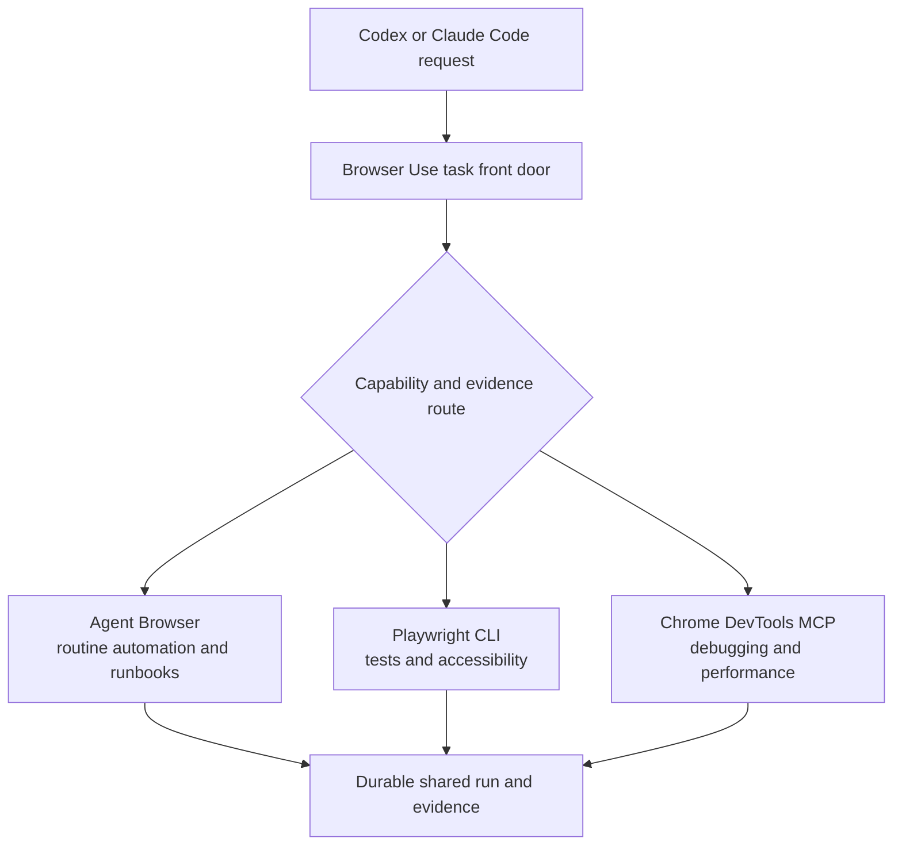

# Browser Use all-lane daily-use closeout - Plan

## Goal Capsule

- **Objective:** finish Browser Use as the agent-neutral front door for routine automation, browser testing, accessibility auditing, debugging, performance analysis, and authenticated daily work across Agent Browser, Playwright CLI, and Chrome DevTools MCP.
- **Product authority:** this contract defines the shared release bar across the platform, authentication, and action-continuity plans. It supersedes conflicting product scope while those plans retain compatible technical ownership.
- **Users:** agents operating from Codex or Claude Code, plus the human supervising identity, risky actions, and user-presence challenges.
- **Release boundary:** all three lanes must execute real work, carry fresh connection, task, and auth evidence, and pass end-to-end workflows. Registry-only or partially proven lanes do not satisfy release.
- **Open blockers:** native macOS signing and provisioning prerequisites, live portal access, and safe test credentials may block conformance proof. They do not reduce the required scope.

---

## Product Contract

### Summary

Complete Browser Use as one dependable daily-use product rather than a collection of browser foundations.
The front door selects the right specialist lane, attaches only through Browser Connect, establishes or proves authenticated Warm Chrome state, executes durable work, and returns inspectable evidence.

### Problem Frame

The project has working lower-level foundations but still stops before useful daily automation.
Browser Connect can verify Warm Chrome and the existing Agent Browser binary can attach to it, yet Browser Use cannot run a routed task.
Agent Browser and Playwright remain registered without native execution implementations.
Chrome DevTools MCP has an execution interface but lacks complete connection, task, and authentication conformance evidence.
Runbook and migration commands still report `browser_use_not_implemented`, while the current repair path fails XDG admission.

This gap makes the system look nearly complete from its contracts while routine outcomes remain unavailable.
The closeout bar must therefore measure end-to-end work, not code volume, registry rows, or isolated unit tests.

### Key Decisions

- **Complete every specialist lane before release** (session-settled: user-directed — chosen over a vertical-slice MVP: daily use requires Agent Browser, Playwright CLI, and Chrome DevTools MCP to be closed out together). Governs R2, R8-R10, R22.
- **Keep the core agent-neutral** (session-settled: user-approved — chosen over a Codex Desktop adapter: the public CLI and JSON contract must work equally from Codex and Claude Code). Governs R1, R3, R19.
- **Preserve specialist semantics** (session-settled: user-approved — chosen over one lowest-common-denominator browser API: each lane exists for a different evidence and execution shape). Governs R5-R10.
- **Treat daily workflows as the release proof** (session-settled: user-directed — chosen over registry-level completion: the product must fill timesheets and perform authenticated accommodation research before it is considered usable). Governs R17, R18, R22.

### Actors

- A1. The operator who owns browser profiles, credentials, approval policy, and final high-impact decisions.
- A2. A Codex or Claude Code agent requesting browser work through the same public contract.
- A3. Browser Use as the task, routing, run, evidence, artifact, continuation, and repair owner.
- A4. Agent Browser as the routine automation, extraction, and runbook lane.
- A5. Playwright CLI as the browser-test, locator, trace, and accessibility lane.
- A6. Chrome DevTools MCP as the debugging, network, console, performance, and Lighthouse lane.
- A7. Browser Connect and Warm Chrome as the attachment-proof and physical browser environment owners.
- A8. The Browser Authentication Transaction as the session-readiness and confidential credential-delivery owner.

### Requirements

**Front door and ownership**

- R1. Browser Use must expose one agent-neutral CLI and JSON front door with equivalent behavior from Codex and Claude Code.
- R2. The release must include operational Agent Browser, Playwright CLI, and Chrome DevTools MCP lanes rather than unavailable or evidence-only registry entries.
- R3. Browser Connect must remain the only attachment route, and Browser Use must pass its verified handoff to the selected lane without private caller APIs.
- R4. Warm Chrome must retain ownership of the physical profile and browser-managed session state.
- R5. Browser Use must preserve each lane's native commands, artifacts, and evidence instead of presenting a lowest-common-denominator browser API.

**Routing**

- R6. The task router must select a lane from requested outcome, required capabilities, current implementation integrity, and fresh connection, task, and auth evidence.
- R7. Routine automation, structured extraction, scraping, and resumable runbooks must prefer Agent Browser when its evidence satisfies the task.
- R8. Browser tests, locator and ARIA assertions, traces, code generation, HAR evidence, and accessibility audits must route to Playwright CLI.
- R9. Console, network, protocol, performance, trace, heap, and Lighthouse work must route to Chrome DevTools MCP.
- R10. An explicit lane override must still pass capability and evidence admission, while an inadmissible route must fail with a repair action instead of silently substituting another lane.
- R11. Any planned transition between specialist lanes must be visible as a new task step with its own verified handoff and evidence rather than an implicit adapter switch.

**Authentication and action safety**

- R12. Every lane must reuse an authenticated Warm Chrome session only after proving the expected origin, account or tenant, and exact mutation target.
- R13. When session reuse is unavailable, the shared authentication transaction must support password and current OTP delivery from approved 1Password bindings for every lane.
- R14. Raw secrets must never reach the model, public arguments, adapter process, durable Browser Use stores, logs, artifacts, or crash evidence.
- R15. Password and OTP delivery must preserve the selected lane and verified target, then resume only after stale references are discarded and authenticated state is freshly proved.
- R16. Passkey, CAPTCHA, consent, recovery, ambiguous identity, and other user-presence steps must return a resumable human continuation rather than attempting a bypass.
- R17. Mutating workflows must apply action policy, prove the current target immediately before mutation, and never retry an unknown external effect.

**Daily-use workflows**

- R18. Agent Browser must complete authenticated Oncore and FastTrack timesheet workflows through save-draft, including restart-safe continuation and structural proof of the employee, period, entered values, and resulting draft state.
- R19. Agent Browser must complete authenticated Airbnb accommodation research, including search criteria, result extraction, comparison evidence, and a clear boundary before booking or payment.
- R20. Playwright CLI must execute browser tests against Warm Chrome and return native test, trace, screenshot, HAR, locator, and accessibility evidence when the requested capability applies.
- R21. Chrome DevTools MCP must perform live debugging, console and network inspection, performance analysis, and Lighthouse runs against Warm Chrome and return native artifacts.

**Evidence, recovery, and closeout**

- R22. Every lane must publish fresh connection, task, and auth-conformance evidence bound to its implementation integrity before Browser Use advertises it as usable.
- R23. `browser-use task run` must create or resume the durable shared run, expose exact observed external-effect state, and return artifacts plus the next safe action.
- R24. Repair status must diagnose XDG admission, Warm Chrome, Browser Connect, lane implementation, evidence staleness, authentication readiness, and portal-specific blockers with executable repair guidance.
- R25. The legacy Browser Automation corpus must be dispositioned and migrated through the existing clean-break migration contract before runtime cutover.
- R26. Agent Browser token-efficiency claims must be supported by repeatable same-task measurements of model-visible tokens, wall time, command count, and artifact volume.
- R27. Human-readable output, JSON output, command discovery, parser acceptance, and runtime behavior must derive from the same code-owned contracts.

### Key Flows

- F1. Routed daily task
  - **Trigger:** An agent asks Browser Use to perform browser work.
  - **Actors:** A2, A3, A7
  - **Steps:** Browser Use resolves the task, verifies one eligible lane, attaches through Browser Connect, proves authentication readiness, creates the shared run, executes, and records evidence.
  - **Outcome:** The caller receives the result, artifacts, observed effect, selected lane, and next safe action.
  - **Covers:** R1-R11, R22-R24

- F2. Session reuse or confidential login
  - **Trigger:** The selected task requires an authenticated portal.
  - **Actors:** A1, A3, A7, A8
  - **Steps:** Browser Use first proves existing session identity. If proof fails without contradiction, the authentication transaction uses an approved binding and confidential delivery. Human-only challenges pause with a continuation.
  - **Outcome:** The same lane resumes with a fresh bounded authentication attestation, or the run remains safely paused.
  - **Covers:** R12-R17

- F3. Timesheet draft
  - **Trigger:** The operator asks an agent to enter time for a named employee and period.
  - **Actors:** A1-A4, A7, A8
  - **Steps:** Agent Browser proves employee and period, enters the requested values, re-proves the target, saves a draft under action policy, and inspects the resulting state.
  - **Outcome:** The run records a structurally verified draft without silently submitting or duplicating entries.
  - **Covers:** R17, R18, R23

- F4. Accommodation research
  - **Trigger:** The operator asks for accommodation options using dates, location, party, and constraints.
  - **Actors:** A1-A4, A7, A8
  - **Steps:** Agent Browser proves session identity, performs the search, extracts comparable options, records criteria and evidence, and stops before booking or payment.
  - **Outcome:** The operator receives a reviewable comparison with links and captured search context.
  - **Covers:** R12, R17, R19, R23

- F5. Frontend and accessibility proof
  - **Trigger:** An agent requests browser tests or an accessibility audit.
  - **Actors:** A2, A3, A5, A7
  - **Steps:** Browser Use admits Playwright CLI, runs the requested native workflow, captures applicable artifacts, and reports assertions and violations against the tested target.
  - **Outcome:** The run contains reproducible test and accessibility evidence.
  - **Covers:** R8, R20, R22, R23

- F6. Debugging and performance proof
  - **Trigger:** An agent requests console, network, protocol, performance, or Lighthouse analysis.
  - **Actors:** A2, A3, A6, A7
  - **Steps:** Browser Use admits Chrome DevTools MCP, runs the requested specialist operation, captures native evidence, and records findings without changing browser identity.
  - **Outcome:** The run contains inspectable debugging or performance artifacts.
  - **Covers:** R9, R21-R23

- F7. Failure and resume
  - **Trigger:** A process exits, evidence expires, user presence is needed, or an external effect becomes unknown.
  - **Actors:** A1-A3, A7, A8
  - **Steps:** Browser Use persists the bounded continuation, reports observed truth, re-proves attachment, identity, target, and evidence on resume, then proceeds only when safe.
  - **Outcome:** The task resumes without hidden browser launch, adapter substitution, duplicate mutation, or secret replay.
  - **Covers:** R10-R17, R23, R24

### Acceptance Examples

- AE1. **Covers R1-R6, R22.** Given the same task request from Codex and Claude Code, both callers receive the same selected lane and schema from the same code-owned routing contract.
- AE2. **Covers R2, R7-R10, R22.** Given fresh evidence for all lanes, routine extraction selects Agent Browser, an ARIA assertion selects Playwright CLI, and Lighthouse selects Chrome DevTools MCP. Stale or missing evidence produces a typed repair continuation.
- AE3. **Covers R3, R4, R10, R11.** Given a lane that cannot consume the verified Browser Connect handoff, Browser Use refuses execution. It does not discover, launch, or substitute another browser or adapter.
- AE4. **Covers R12-R16.** Given a valid authenticated Warm Chrome session, each lane resumes only after identity and target proof. Given no session, approved password and OTP delivery reaches the verified field without exposing values to the lane or model. Given a passkey challenge, the run pauses for the operator.
- AE5. **Covers R14-R16, R22.** Given sentinel username, password, and OTP values, no governed public output, process argument, environment, persisted file, adapter artifact, or crash evidence contains a sentinel after each lane's conformance run.
- AE6. **Covers R17, R18, R23.** Given an Oncore or FastTrack timesheet request, Agent Browser saves one verified draft. A timeout after save reports unknown effect and inspects before any further mutation.
- AE7. **Covers R12, R17, R19.** Given an authenticated accommodation request, Agent Browser returns options matching the search criteria with inspectable links and evidence. It stops before reservation, messaging, booking, or payment.
- AE8. **Covers R8, R20, R22, R23.** Given a frontend test request, Playwright CLI returns the applicable native assertions and artifacts. Given an accessibility request, the result identifies tested scope, rule, target, severity, and evidence.
- AE9. **Covers R9, R21-R23.** Given a performance request, Chrome DevTools MCP returns a Lighthouse or trace artifact tied to the verified page. Given a console or network request, it returns bounded native evidence without leaking authentication material.
- AE10. **Covers R23, R24.** Given the current XDG symlink-ancestor failure, repair status names the refused path condition and a safe repair action. After repair, task execution proceeds through the admitted XDG roots.
- AE11. **Covers R25.** Given the legacy corpus, every source artifact receives a migration disposition before activation. Unreviewed executable code, backups, secrets, and obsolete paths remain inactive.
- AE12. **Covers R26.** Given the same bounded routine task through eligible lanes, the benchmark reports comparable token, time, command, and artifact measurements without assuming Agent Browser is cheaper.

### Success Criteria

- `browser-use lanes list --json` reports implemented native execution plus fresh connection, task, and auth evidence for Agent Browser, Playwright CLI, and Chrome DevTools MCP.
- `browser-use task run` performs real work and no required daily-use command returns `browser_use_not_implemented`.
- Oncore and FastTrack save-draft workflows pass live structural verification without duplicate or unintended submission.
- Authenticated accommodation research passes live extraction and comparison verification without crossing the booking boundary.
- Playwright CLI passes representative interaction, locator, trace, and accessibility tasks against Warm Chrome.
- Chrome DevTools MCP passes representative console, network, performance, and Lighthouse tasks against Warm Chrome.
- Password, OTP, session reuse, human continuation, restart, cleanup, revocation, and lane-resume conformance pass for every lane.
- Repair status is green on the supported daily-use environment or returns a tested command-specific repair path.
- Codex and Claude Code use the same documented commands and receive schema-equivalent results.
- The migrated corpus has no active reads from legacy runtime roots.
- Token-efficiency guidance cites measured results for a repeatable workload.

### Scope Boundaries

**Included**

- The unfinished platform work required from `docs/plans/2026-07-21-002-feat-browser-use-task-router-runbook-platform-plan.md` to satisfy this contract.
- The unfinished authentication and lane-conformance work required from `docs/plans/2026-07-21-003-feat-browser-use-cross-adapter-authentication-plan.md` to satisfy this contract.
- Agent Browser, Playwright CLI, and Chrome DevTools MCP execution implementations.
- The shared task front door, routing policy, XDG repair, durable runs, migration, runbooks, evidence, artifacts, and cutover.
- Password, current OTP, session reuse, identity proof, user-presence continuation, and secret-containment proof for every lane.
- Oncore and FastTrack timesheet proofs, authenticated accommodation research, Playwright testing, accessibility auditing, debugging, and Lighthouse.
- Daily-use documentation, discovery, repair guidance, and repeatable efficiency benchmarks.

**Outside this product's identity**

- A private Codex Desktop or built-in Browser adapter.
- Caller-specific routing authority or behavior differences between Codex and Claude Code.
- A universal browser command abstraction that hides specialist lane semantics.
- Hidden adapter fallback, hidden browser launch, or cross-adapter credential transfer.
- Bypassing passkeys, CAPTCHA, consent, recovery, or other human-presence requirements.
- Accommodation booking, payment, or irreversible purchase.

**Deferred**

- Scheduling, fleet policy, and cross-machine binding synchronization.
- Generic third-party 1Password agentic autofill until a supported external contract exists.
- New specialist lanes beyond the three named in this contract.
- A separate Chrome DevTools CLI product lane. Chrome DevTools MCP owns the debugging and performance role in this release.

<!-- ce-section: work-relationships -->
### How This Work Fits Together

This plan owns the single daily-use release bar.
The breakdown below records current ownership and may be revised during planning without changing the product requirements.

- `docs/plans/2026-07-21-001-fix-browser-use-action-continuity-plan.md`
  - Supplies the completed action continuity and current-page evidence baseline.
- `docs/plans/2026-07-21-002-feat-browser-use-task-router-runbook-platform-plan.md`
  - Owns the shared task, XDG store, migration, runbook, lane execution, routing, and cutover mechanics.
  - Must satisfy R1-R11 and R18-R27.
  - Its separate Chrome DevTools CLI lane proposal is superseded by the three-lane release boundary in R2.
- `docs/plans/2026-07-21-003-feat-browser-use-cross-adapter-authentication-plan.md`
  - Owns the adapter registry, authentication transaction, confidential delivery, identity proof, sensitive-run guard, and per-lane auth conformance.
  - Must satisfy R12-R17 and the auth portion of R22.
- Browser Connect and Warm Chrome
  - Remain upstream attachment and physical environment owners.
  - Must not acquire Browser Use task, routing, runbook, or authentication policy.
- Codex native Browser and Chrome tools
  - Can proceed independently as Codex-only convenience surfaces.
  - Do not become dependencies or adapters in this release.

### Dependencies / Assumptions

- Warm Chrome and Browser Connect remain supported local foundations.
- Agent Browser, Playwright CLI, Chrome DevTools MCP, and 1Password CLI versions are pinned and re-probed before evidence publication.
- Live Oncore, FastTrack, accommodation-site, test-site, and performance-test access is available for conformance.
- Safe test data and action-policy limits exist for mutating portal proofs.
- The native Browser Use Security product may require full Xcode, Apple Developer Program membership, stable signing identities, provisioning, and notarization.
- External site changes may invalidate runbook or auth evidence and must surface through freshness and repair contracts.

### Sources / Research

**Repository**

- `docs/plans/2026-07-21-001-fix-browser-use-action-continuity-plan.md`
- `docs/plans/2026-07-21-002-feat-browser-use-task-router-runbook-platform-plan.md`
- `docs/plans/2026-07-21-003-feat-browser-use-cross-adapter-authentication-plan.md`
- `docs/decisions/2026-07-14-001-browser-connect-architecture-decision-log.md`
- `skills/browser-use/src/browser-use-adapter-model.ts`
- `skills/browser-use/src/browser-use-adapter-registry.ts`
- `skills/browser-use/src/browser-use.ts`
- `skills/browser-use/docs/PRODUCT-BASELINE.md`

**External**

- [Codex Browser](https://developers.openai.com/codex/browser)
- [Codex Chrome extension](https://developers.openai.com/codex/chrome-extension)
- [Agent Browser](https://github.com/vercel-labs/agent-browser)
- [Playwright CLI](https://github.com/microsoft/playwright-cli)
- [Chrome DevTools MCP CLI](https://github.com/ChromeDevTools/chrome-devtools-mcp/blob/main/docs/cli.md)
- [Chrome DevTools MCP tool reference](https://github.com/ChromeDevTools/chrome-devtools-mcp/blob/main/docs/tool-reference.md)
- [1Password service accounts](https://developer.1password.com/docs/service-accounts/get-started/)
