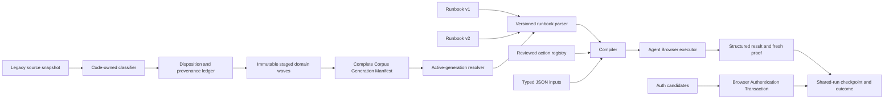

# Browser Use runbook catalog migration - Plan

## Goal Capsule

- **Objective:** migrate every active formal runbook and playbook under `../dotfiles/config/side-quest/browser-automation/domains/` into Browser Use-owned catalog generations, while classifying the rest of the corpus and preserving Browser Use's auth, approval, evidence, and recovery boundaries.
- **Authority:** this focused execution plan refines U3, U4, and U7 of `docs/plans/2026-07-21-002-feat-browser-use-task-router-runbook-platform-plan.md`. The parent plan, accepted ADRs, and Browser Use contracts remain authoritative where this plan is silent.
- **Execution profile:** contract-first migration. Freeze and classify first; add backward-compatible catalog capability; prove one read-only Oncore slice; stage domain waves; activate one complete generation.
- **Immediate value:** expose useful migrated knowledge through `browser-use runbook list/show/run`, starting with structured Oncore diagnosis and Xero statement extraction.
- **Stop conditions:** unclassified source artifact; schema-v1 reinterpretation; copied inline script authority; trusted legacy risk label; partial corpus activation; confidential data in durable state; automatic retry after an unknown mutation; live financial write without separate user confirmation.
- **Operator gates:** approve exact action hashes; authorize any first live financial-write verification; handle OAuth consent, CAPTCHA, terms, biometric, and platform-permission prompts; approve destructive legacy cleanup.

---

## Product Contract

### Summary

Browser Use gains a versioned, generation-bound runbook catalog capable of representing the active legacy corpus safely. The migration accounts for every formal artifact without assuming one source file equals one canonical runbook. Deterministic contracts move into the runbook model, action registry, migration engine, shared-run reducer, and CLI projections. Login narratives become redacted auth import candidates, not business runbooks.

The migration ships in staged domain waves:

1. freeze and classify the current corpus;
2. add runbook schema v2 and reviewed action assets;
3. prove read-only Oncore diagnosis;
4. migrate Oncore and FastTrack save-draft flows;
5. stage Xero read-only extraction as executable in the candidate generation while leaving financial writes staged inactive;
6. route auth narratives to the Browser Authentication Transaction;
7. verify the complete effective catalog and activate one complete corpus generation.

### Problem Frame

Browser Use currently discovers one shipped schema-v1 seed plus operator records under `$XDG_DATA_HOME/browser-use/runbooks`. Its schema supports string inputs, static snapshot refs, and `snapshot`, `open`, `click`, and `fill`. The Agent Browser executor already supports semantic click and hash-bound evaluated actions, but the runbook model cannot declare them. Evaluated action results are discarded, and the top-level numeric resume cursor cannot represent partial progress inside a batch.

The active dotfiles corpus contains:

- 22 domain directories;
- 12 explicit runbook or playbook artifacts;
- 52 documented Target Flows;
- 24 scripts;
- three verified auth narratives;
- two candidate login capabilities;
- 10 domain-script actions;
- runtime evidence, selectors, and domain notes that are not automatically executable.

The corpus mixes orchestration, deterministic mechanics, personal identity, credential references, obsolete browser ownership, candidate code, and observed proof. Raw copying would leak or revive retired authority. One-to-one conversion would also preserve duplicate or superseded flow shapes, including two Oncore candidates for the same intent.

The current migration engine inventories and stages safe bytes, quarantines JavaScript, and leaves `activation_state` unchanged. It does not transform legacy playbooks into runbooks, resolve reviewed action assets, or activate a catalog generation. That missing layer is the work of this plan.

### Actors

- A1. Agents discovering, inspecting, executing, resuming, and repairing Browser Runbooks through the public CLI and JSON contracts.
- A2. The operator approving action promotion, financial-write verification, user-presence gates, and destructive cleanup.
- A3. Browser Use as catalog, migration, shared-run, evidence, and recovery owner.
- A4. Browser Authentication Transaction as auth choreography and sensitive delivery owner.
- A5. Browser Connect as the only attachment and verified-handoff owner.

### Requirements

#### Corpus accountability and ownership

- **R1.** Freeze a current Source Snapshot Manifest for `../dotfiles/config/side-quest/browser-automation/domains/`. Record path, kind, mode, size, hash, source-root identity, and snapshot digest without changing source bytes.
- **R2.** Classify every source entry and every later source addition. Formal artifacts use one of `migrated`, `superseded-by`, `staged-inactive`, or `retired`; supporting artifacts use a typed disposition owned by migration code.
- **R3.** Account mechanically for the known baseline using overlapping predicates: 12 explicit runbook/playbook artifacts, 52 logical Target Flows inside prose, 24 script files, three auth narratives, two login capabilities, and 10 domain-script actions that are also scripts. Count drift blocks planning until the new entries receive dispositions.
- **R4.** Do not require one source artifact to equal one canonical runbook. Every canonical flow lists all source provenance; duplicate and superseded candidates retain inspectable lineage.
- **R5.** Migrate explicit runbooks and playbooks. Classify domain prose, Target Flows, selectors, scripts, run evidence, and capabilities without promoting them automatically.
- **R6.** Store migrated personal and domain knowledge in generation-bound XDG data/state. Keep the shipped catalog limited to safe defaults and testable product examples.
- **R7.** One effective-catalog resolver serves list, show, and run. It composes the immutable shipped base, compatibility XDG v1 overrides, and the active generation with explicit precedence and identical corrupt-shadow behavior. It never reads the legacy source. Source deletion remains separately approved and outside this plan.

#### Runbook v2 and catalog contract

- **R8.** Introduce explicit runbook schema v2. Continue parsing and executing v1 records unchanged; never reinterpret v1 fields with v2 semantics; reject unknown versions.
- **R9.** Give v2 inputs runtime-validated string, number, boolean, enum, array, object, date, UUID, default, bound, and discriminated-union shapes. Reject unknown inputs and invalid defaults.
- **R10.** Add one bounded private-file JSON input route for v2 while retaining scalar `--input <id>=<value>` behavior for v1. Admit owner-private, non-symlinked, non-versioned files; keep values and source paths out of process arguments, output, receipts, and provenance.
- **R11.** Replace durable `@eN` targets in v2 with runtime-resolved semantic targets or reviewed action references. Semantic targets require a fresh snapshot and exactly one match before dispatch.
- **R12.** Support bounded iteration over stable item keys with per-item checkpoints. A batch resumes from the first unproven item and never repeats confirmed effects. A crash after possible dispatch but before fresh proof becomes `unknown`, never an automatic resume.
- **R13.** Expose input shape, effect class, static auth requirement, approval requirement, activation state, health, provenance, and one next safe action through code-owned JSON and plain projections. Dynamic auth readiness remains environment/profile/run state, not catalog metadata.
- **R14.** Invalid or corrupt effective-catalog records cannot disappear silently. Whole-catalog verification reports the expected id, effective source, generation, version, and failure.
- **R15.** Bump affected CLI result contracts when their projected shapes change. Keep discovery metadata, rendered help, parser acceptance, runtime behavior, and packaged assets mechanically aligned.

#### Reviewed action assets and evidence

- **R16.** Store evaluated code as separate content-addressed action assets. A runbook references action id and expected digest; it never embeds script bytes or asserts its own approval.
- **R17.** Bind promotion to exact bytes, exact allowed origin, audited effect class, typed input/result schemas, required postcondition, source provenance, proof requirements, and an operator-approved promotion receipt.
- **R18.** Treat every legacy `reviewed_candidate` as non-executable until its exact current hash is approved. Missing, changed-hash, wrong-origin, unapproved, or schema-mismatched actions fail before browser dispatch.
- **R19.** Derive effect class from audited behavior, not legacy `risk_class`. Navigation, clicks, storage writes, network effects, and final-boundary effects are mutations unless mechanically proven otherwise.
- **R20.** Prefer small checkpointable actions over broad scripts. Split or reject an action when partial effects cannot be observed and resumed safely.
- **R21.** Capture bounded structured results for read actions. Validate and redact them before adding schema id, sensitivity class, bounded summary, digest, proof references, and any governed artifact reference to the shared-run outcome. Large grid or financial payloads stay in retention-owned artifacts, never inline shared-run state.
- **R22.** Preserve write-ahead mutation truth, fresh postcondition evidence, and `confirmed | not-achieved | unknown`. Never retry or switch adapters after an unknown effect.
- **R23.** Enforce or remove every claimed containment policy. Migration cannot carry forward unenforced `detect_only` or final-boundary claims as if they were runtime guarantees.

#### Domain migration

- **R24.** First prove `oncore/timesheet-diagnose` from the genuinely observational `oncore.diagnose_grid_state` action. Return bounded structured grid state, with governed artifact spillover when needed, without mutation.
- **R25.** Migrate the Oncore fill/verify/save-draft intent as checkpointed actions and one active canonical flow. Reconcile the two source candidates through provenance rather than activating both.
- **R26.** Migrate FastTrack `fill-week` and `add-breaks`. Audit navigation and click behavior in diagnostic/verification helpers; classify it accurately; verify persisted save-draft state; prohibit Submit.
- **R27.** Migrate Xero BankStatementsPlus extraction as an active read-only flow with UUID/date bounds and structured response-envelope proof.
- **R28.** Migrate Xero reconciliation and `post-banktransaction` definitions into the staged generation but keep them inactive and non-dispatchable. Schema validation, compilation, simulation, and read-only diagnosis satisfy migration verification; live financial writes require separate user confirmation.
- **R29.** Route the three Okta narratives and two login capabilities into redacted auth-context and Item Binding import candidates. Business runbooks retain only `auth_context_ref`.
- **R30.** Reject credentials, OTP mechanics, cookie clearing, sign-out, profile killing, browser launch, or user-presence gates inside business runbooks. Auth and lifecycle owners return typed continuations.
- **R37.** An authenticated runbook enters the Browser Authentication Transaction before business execution. Persist blocked auth state on the same shared run; resume with the same lane/handoff, fresh attestation and target proof, and discarded refs. Every active `auth_context_ref` requires a live auth route before activation.

#### Staging, activation, and retirement

- **R31.** Stage and validate each domain wave independently, but never make a partial wave the active corpus. Activation compare-and-swaps one complete Corpus Generation Manifest.
- **R32.** Before activation, prove active executable closure for active flows: approved actions, auth route, proof, package/effective-catalog, structured results, and resume closure. Prove inactive definition closure for staged flows: schema, provenance, simulation, inactive reason, and a pre-handoff non-dispatch gate.
- **R33.** Keep staged or blocked financial flows visible through migration status only. Exclude them from active list/show and return typed `runbook_inactive` before handoff acquisition on direct run.
- **R34.** After activation, make legacy paths unreadable in integration tests and prove list, show, run, auth, resume, repair, and neutral-CWD package discovery continue to work.
- **R35.** Persist a monotonic generation-effect fence. A second compare-and-swap may select the prior verified generation only before the first generation-derived run/checkpoint/artifact/auth record or external dispatch; the activation record itself does not trip the fence. After the fence, stop and repair forward.
- **R36.** Preserve caller parity. Claude Code, Codex, and neutral CLI callers receive identical authority, schemas, continuations, and outcome truth.
- **R38.** At run creation, persist an immutable execution binding: generation id and activation epoch, service/flow/version/digest, action-registry digest, normalized input digest or governed input artifact, ordered item-key digest, target scope, and postcondition. Resume rejects replacement authority from flags and resolves only the pinned retained generation.
- **R39.** Activation refuses while a prior-generation mutating run is nonterminal. Retained read-only runs may resume against their pinned generation; new runs resolve the current active generation. An unavailable pinned generation returns typed repair, never current-definition fallback.
- **R40.** Bind the shipped package/catalog digest into effective-catalog verification. Package updates and corrupt compatibility overrides surface typed drift instead of silently changing the effective catalog.
- **R41.** Declare v2 input sensitivity. Persist only normalized digests in ordinary run state; retain resumable values as private high-sensitivity artifacts with bounded retention or require exact digest-matched resupply. Never echo input values in failures or status.
- **R42.** Keep rejected, withdrawn, and invalidated promotion receipts as durable dispositions. A required active action without current approval blocks activation; inactive definitions may retain candidate provenance only behind the non-dispatch gate.

### Acceptance Examples

- **AE1 (R1-R5).** A fresh inventory of the current source root reports the expected baseline and gives every entry one disposition. Adding an unclassified file makes planning fail with its path and next safe action.
- **AE2 (R4-R7).** Both Oncore candidates map to one canonical fill-timesheet flow with complete provenance; neither source file is deleted or read at runtime after activation.
- **AE3 (R8-R15).** The existing shipped v1 seed lists, shows, and runs unchanged. A v2 flow accepts a bounded JSON input object and rejects an invalid enum, UUID, date, nested object, or unknown field.
- **AE4 (R11-R12).** A semantic target with zero or multiple fresh matches refuses before mutation. A crash before dispatch may resume; a crash after write-ahead or possible dispatch but before proof becomes unknown; a confirmed item checkpoint resumes at the next stable key.
- **AE5 (R16-R23, R42).** A runbook that claims an inline script is approved cannot execute. An approved exact action hash runs only on its admitted origin and returns a schema-valid redacted result or a typed refusal. Rejection, withdrawal, or changed bytes invalidate execution.
- **AE6 (R19).** A legacy action labelled read-only but containing navigation or click behavior is classified as mutation or rewritten; it never bypasses write-ahead truth.
- **AE7 (R21, R24-R25).** Oncore diagnosis returns a bounded grid summary plus governed artifact reference when needed. The staged migrated fill flow reconciles existing rows, saves a controlled draft, reloads, and proves persisted values plus `submitted=false`.
- **AE8 (R26).** FastTrack fills and saves a controlled draft, verifies persistence, and leaves Submit untouched.
- **AE9 (R27-R28, R33).** Xero statement extraction validates the response envelope and stores large output through artifact retention. Reconciliation and bank-transaction flows appear only in migration status; direct run refuses before handoff and dispatches zero live financial mutations.
- **AE10 (R29-R30, R37).** Auth candidates contain no personal identity or secret source detail. One shared run moves from `awaiting-auth` to `awaiting-user-presence` for CAPTCHA or consent, then resumes with fresh same-lane proof. Cancellation before business mutation records `not-achieved`.
- **AE11 (R31-R35, R38-R40).** Domain waves validate independently, but only a complete manifest becomes authoritative. Failure before compare-and-swap leaves the prior generation active. Immediate pre-effect rollback may use a second fenced compare-and-swap; any generation-derived effect forces repair forward.
- **AE12 (R32-R36, R40).** With every legacy path denied, the packed/dist CLI discovers the same effective catalog from a neutral directory and emits equivalent results for Claude Code, Codex, and an unlabelled caller.
- **AE13 (R38-R39).** A run starts under generation A and pauses. Generation B cannot activate while that run may mutate. A retained read-only run resumes only from its exact A binding; altered inputs or flow flags refuse, and a new run resolves B.
- **AE14 (R10, R38, R41).** A sensitive structured input enters through an admitted private file, never appears in argv or output, and resumes only through its matching retained artifact or an exact digest-matched resupply.

### Success Criteria

- Every active source artifact has inspectable provenance and disposition.
- Browser Use reads v1 and v2 without semantic drift.
- No runbook can manufacture evaluated-code authority.
- Oncore diagnosis, Oncore save-draft, FastTrack save-draft, and Xero extraction have structural proof.
- Xero financial-write flows are migrated but inactive.
- Auth narratives are redacted import candidates under auth ownership.
- One complete generation activates with zero live legacy reads.
- Source bytes remain unchanged; destructive cleanup stays separately approved.

### Scope Boundaries

**Now**

- Complete corpus inventory and classification.
- Runbook v2, private structured-input custody, semantic targets, bounded iteration, reviewed actions, structured results, immutable run bindings, and checkpoints.
- Oncore diagnosis and save-draft.
- FastTrack fill, breaks, and save-draft.
- Xero read-only extraction.
- Xero write definitions staged inactive.
- Auth candidate routing.
- Complete-generation activation and legacy-read retirement.

**Later**

- Live Xero reconciliation.
- Live Xero `post-banktransaction`.
- Executable migration of the remaining documented Target Flows.
- Recorder replay and deterministic mode.
- Final timesheet Submit beyond existing standing-authorization contracts.

**Human-only**

- Exact action-hash promotion.
- First live financial-write verification.
- OAuth consent, CAPTCHA, terms, biometric, and platform-permission gates.
- Destructive legacy cleanup.

**Never agent-visible**

- Raw passwords or OTP values.
- Credential source paths.
- Private helper payloads.
- Unredacted authenticated artifacts.

### Dependencies and Assumptions

- `docs/plans/2026-07-21-002-feat-browser-use-task-router-runbook-platform-plan.md` remains the parent product contract.
- Browser Connect continues to mint the only Verified Handoff Envelope.
- Browser Authentication Transaction owns live confidential delivery. `buildRunbookAuthDelivery()` remains fail-closed until its sensitive-interval target wiring is complete.
- The legacy source root remains readable and unchanged during migration.
- No external library or service decision is needed. Existing Bun, TypeScript, durable-store, and CLI-facade patterns are sufficient.

### Context and Research

- The current model in `skills/browser-use/src/browser-use-runbook-model.ts` is schema-v1-only and type-casts parsed JSON before total validation.
- Discovery in `skills/browser-use/src/browser-use-runbook.ts` merges shipped records with XDG data overrides, but it does not resolve an active state generation.
- Execution in `skills/browser-use/src/browser-use-agent-browser.ts` already enforces exact origin, hash, approval, write-ahead mutation truth, and fresh mutation postconditions for evaluated actions. It currently accepts inline script bytes and discards successful structured evaluation data.
- Migration in `skills/browser-use/src/browser-use-migration.ts` stages inactive copied knowledge and quarantines JavaScript. It does not transform playbooks or activate a corpus.
- Packaging in `skills/browser-use/src/build-dist.ts` copies `skills/browser-use/runbooks/` into `dist/runbooks/`. Any new shipped asset root needs explicit packaging and closure checks.
- FastTrack actions demonstrate why source labels are not authority: scripts labelled read-only navigate or click. Oncore `diagnose-grid-state.js` is the clean observational first slice.
- No `solutions/` corpus or root `CONCEPTS.md` exists. Current ADRs, decision logs, context, and the parent plan are the governing evidence.

### Sources and References

- `docs/plans/2026-07-21-002-feat-browser-use-task-router-runbook-platform-plan.md`
- `docs/plans/2026-07-21-003-feat-browser-use-cross-adapter-authentication-plan.md`
- `docs/adr/0002-runbooks-and-skills-use-prose-as-orchestrator.md`
- `docs/adr/0004-deterministic-workflow-contracts-live-in-code.md`
- `docs/decisions/2026-07-27-001-browser-use-front-door-decision-log.md`
- `docs/decisions/2026-07-16-001-browser-use-migration-cleanup-decision-log.md`
- `CONTEXT-MAP.md`
- `skills/browser-use/CONTEXT.md`
- `skills/browser-use/src/browser-use-runbook-model.ts`
- `skills/browser-use/src/browser-use-runbook.ts`
- `skills/browser-use/src/browser-use-agent-browser.ts`
- `skills/browser-use/src/browser-use-migration-model.ts`
- `skills/browser-use/src/browser-use-migration.ts`
- `skills/browser-use/src/browser-use.ts`
- `skills/browser-use/src/command-contract.ts`
- `../dotfiles/config/side-quest/browser-automation/domains/`

---

## Planning Contract

### Key Technical Decisions

- **KTD1 - Use a focused execution plan linked to the parent platform plan.** Keep the accepted broad architecture stable and isolate the runbook-corpus implementation scope here. Chosen over editing the broad plan in place. `session-settled: user-approved`.
- **KTD2 - Migrate all formal artifacts without forcing one-to-one output.** Canonical flows may absorb or supersede multiple sources, but every source keeps one disposition and provenance edge. `session-settled: user-approved`.
- **KTD3 - Classify prose; execute only explicit formal artifacts.** Target Flows, selectors, domain notes, and evidence inform migration but do not become executable merely because they were found. `session-settled: user-approved`.
- **KTD4 - Add schema v2 beside v1.** Preserve v1 parsing and semantics; emit migrated records as v2. Rejected: silently expanding schema v1.
- **KTD5 - Keep evaluated authority outside runbooks.** An active-generation action registry and operator promotion receipt own script bytes, digest, effect, schemas, and approval. Rejected: inline JavaScript and self-declared review status.
- **KTD6 - Use atomic checkpointable actions.** Runbooks own orchestration; actions expose bounded effects and structured results. Rejected: one opaque batch mutation with a top-level-only resume cursor.
- **KTD7 - Treat audited behavior as the effect source.** Legacy risk labels are evidence only. Navigation, clicks, and hidden framework calls receive mutation handling unless rewritten to pure observation.
- **KTD8 - Keep auth choreography with the auth owner.** Convert login narratives and capabilities into redacted import candidates; business runbooks carry only `auth_context_ref`. Rejected: copying credential or session-reset procedures.
- **KTD9 - Stage domains, activate one corpus.** Validate each wave independently, then compare-and-swap the complete generation manifest. Rejected: per-domain active pointers and partial cutover. `session-settled: user-approved`.
- **KTD10 - Migrate financial writes inactive.** Preserve definitions and validate them without live mutation; require a new user confirmation before any live reconciliation or bank-transaction proof. `session-settled: user-approved`.
- **KTD11 - Start with Oncore diagnosis.** Prove structured read results, action closure, staged-generation validation, and zero legacy reads before promoting write-capable workflows. Public discovery proof follows complete activation.
- **KTD12 - Preserve source until separate cleanup approval.** Runtime retirement means zero active reads, not deletion. `session-settled: user-approved`.
- **KTD13 - Pin runs to immutable catalog identity.** New runs resolve the active generation; resume uses the retained generation recorded at creation and never accepts replacement flags. Rejected: resolving the current catalog during resume.
- **KTD14 - Use one private-file structured input route.** Avoid argv payloads and avoid shipping both file and stdin transports without evidence. Durable resume keeps only a digest plus a retention-owned high-sensitivity artifact when needed.
- **KTD15 - Separate verification from activation.** Add an explicit `migration activate`; inventory, plan, apply, and verify never change the active manifest.

### High-Level Technical Design

This is an ownership and data-flow sketch. Runtime schemas, action states, dispositions, activation rules, and result envelopes remain code-owned.

### Open Questions

**Resolved during planning**

- **What does “all” mean?** Every formal artifact migrates or receives an explicit supersession, inactive, or retirement disposition. Supporting corpus content is classified.
- **Where does personal catalog data live?** In generation-bound XDG data/state, not automatically in the shipped package.
- **Can Xero writes be verified live?** No. They remain staged inactive until separately confirmed.
- **Can domains activate independently?** No. Domain waves validate independently; one complete generation activates.
- **Can old schema-v1 runbooks continue?** Yes, unchanged.
- **Can a migrated candidate script execute?** Only after exact-hash promotion through the action registry.

**Deferred to implementation evidence**

- Which broad legacy scripts can be split into smaller actions versus rewritten as repo-owned runtime mechanics.
- Which source selectors remain useful after semantic-target and action conversion.
- Whether an activated user-authored action asset needs a shipped safe-example counterpart beyond test fixtures.

---

## Implementation Units

### U1. Freeze and classify the complete corpus

- **Goal:** make migration scope and provenance mechanically complete before changing the runbook contract.
- **Requirements:** R1-R7; AE1-AE2.
- **Dependencies:** none.
- **Files:** `skills/browser-use/src/browser-use-migration-model.ts`, `skills/browser-use/src/browser-use-migration.ts`, `skills/browser-use/src/browser-use-migration.test.ts`, `skills/browser-use/src/browser-use-migration-corpus.test.ts`, new focused fixtures under `skills/browser-use/src/fixtures/browser-use-migration/`.
- **Approach:** extend the existing snapshot and disposition owners with artifact class, formal-flow identity, canonical-target id, provenance edges, and count assertions. Parse formal YAML/JSON through total validators. Keep source inspection read-only. Emit the complete ledger through migration plan/status; do not encode the inventory table in prose.
- **Test scenarios:**
  - Known baseline produces the expected formal-artifact, flow, script, auth, capability, and action counts.
  - New, removed, renamed, duplicate, malformed, unreadable, secret-positive, symlinked, and hash-drifted entries fail or classify deterministically.
  - Both Oncore candidates resolve to one canonical flow with distinct dispositions.
  - Inventory and plan leave the full source tree byte-identical.
- **Verification:** every snapshot entry has exactly one typed disposition; every canonical target lists its sources; no executable or secret-positive entry stages as trusted.

### U2. Add backward-compatible runbook v2 and catalog projections

- **Goal:** represent migrated flows without weakening v1.
- **Requirements:** R7-R15, R40-R41; AE3-AE4, AE12, AE14.
- **Dependencies:** U1.
- **Files:** `skills/browser-use/src/browser-use-runbook-model.ts`, `skills/browser-use/src/browser-use-runbook.ts`, `skills/browser-use/src/command-contract.ts`, `skills/browser-use/src/browser-use-parser.ts`, `skills/browser-use/src/browser-use.ts`, `skills/browser-use/src/browser-use-runbook.test.ts`, `skills/browser-use/src/browser-use-parser.test.ts`, `skills/browser-use/src/browser-use-discovery.test.ts`, `skills/browser-use/src/command-contract-no-dangle.test.ts`, `skills/browser-use/src/browser-use-front-door.test.ts`, `skills/browser-use/src/browser-use-platform-contract.test.ts`, Browser Use anti-drift tests.
- **Approach:** use `cli-author`. Replace unsafe type-cast parsing with version-discriminated total parsing. Add code-owned recursive value schemas, semantic targets, activation/provenance projections, the effective-catalog resolver interface, and one private-file structured input route. Keep v2 iteration/action steps typed unavailable until U3 supplies checkpoints and action resolution. Preserve the current v1 compiler and scalar CLI path as a separate compatibility branch.
- **Test scenarios:**
  - Existing v1 shipped and XDG fixtures list, show, compile, and run unchanged.
  - Valid nested arrays, objects, enums, numbers, booleans, dates, UUIDs, defaults, and discriminated batch entries compile.
  - Invalid type, bound, default, date, UUID, unknown field/input, excessive depth/size, and unknown schema version refuse.
  - Semantic targets require a fresh snapshot and exactly one match.
  - Shipped base, compatibility v1 override, and active-generation precedence is deterministic; corrupt shadowing fails identically in list/show/run.
  - Discovery/help/parser/runtime/result-contract/no-dangle/front-door/platform-contract/anti-drift snapshots cannot drift.
- **Verification:** v1 compatibility suite is unchanged; v2 malformed input never throws; plain output projects the same facts as JSON.

### U3. Add reviewed actions, structured results, and item checkpoints

- **Goal:** make evaluated mechanics safe, inspectable, and resumable.
- **Requirements:** R12, R16-R23, R38, R41-R42; AE4-AE6, AE13-AE14.
- **Dependencies:** U2.
- **Files:** new `skills/browser-use/src/browser-use-runbook-actions.ts` and tests; `skills/browser-use/src/browser-use-agent-browser.ts`, `skills/browser-use/src/browser-use-agent-browser.test.ts`, `skills/browser-use/src/browser-use-run-model.ts`, `skills/browser-use/src/browser-use-runs.ts`, `skills/browser-use/src/browser-use-runs.test.ts`, `skills/browser-use/src/browser-use-schemas.ts`, `skills/browser-use/src/browser-use-schemas.test.ts`, `skills/browser-use/src/browser-use-paths.ts`, `skills/browser-use/src/browser-use-paths.test.ts`, `skills/browser-use/src/browser-use-runbook-model.ts`, `skills/browser-use/src/browser-use-runbook.ts`, `skills/browser-use/src/browser-use.ts`, shared-run tests and fixtures.
- **Approach:** add the manifest schema, generation-aware resolver, and staged-generation validation harness before domain proof. Resolve safe relative action assets only through an explicit staged or active generation. Verify registry record, asset bytes, digest, exact origin, audited effect, schemas, approval receipt, and required proof before constructing an executor step. Redact and validate successful read results. Add first-class step/item checkpoints and immutable run execution bindings rather than overloading only `runbook-resume:<index>`. Preserve current write-ahead and unknown-effect behavior.
- **Test scenarios:**
  - Candidate, rejected, missing receipt, changed digest, path escape, symlink, wrong origin, undeclared effect, invalid input/result, unsupported containment claim, and missing mutation postcondition all refuse before dispatch.
  - A runbook cannot grant its own approval or inline script bytes.
  - A read action returns bounded schema-valid redacted data and records no possible mutation.
  - Large results become bounded summaries plus governed artifact references.
  - A mutation records write-ahead truth before dispatch, verifies fresh post-state, and does not retry unknown.
  - Crash after each batch item resumes from the first unproven stable key.
  - Altered resume flags, stale activation epoch, unavailable pinned generation, and generation drift refuse without current-catalog fallback.
- **Verification:** structured result/proof reaches the shared-run outcome without raw adapter stdout; secret and leak harnesses remain clean.

### U4. Prove Oncore diagnosis, then migrate Oncore save-draft

- **Goal:** prove the full new catalog lifecycle on the safest useful domain before write-capable migration.
- **Requirements:** R21, R24-R25, R31-R40; AE7, AE10-AE13.
- **Dependencies:** U1-U3 and a proven reusable session or conforming auth outcome.
- **Files:** XDG-generation transform logic and fixtures under migration modules; Oncore action/runbook fixtures under `skills/browser-use/src/fixtures/`; `skills/browser-use/src/browser-use-runbook.test.ts`, `skills/browser-use/src/browser-use-agent-browser.test.ts`, `skills/browser-use/src/browser-use-target-realism.test.ts`, `skills/browser-use/src/browser-use-process-hygiene.test.ts`.
- **Approach:** promote the observational diagnose action first and return bounded structured grid state. Prove the explicit staged-generation validation harness, action closure, result persistence, and no source reads without changing public active discovery. Then split the winning Oncore fill candidate into checkpointed entry actions plus verification/save-draft orchestration. Preserve the older candidate as superseded provenance. Public catalog discovery proof waits for U8 activation.
- **Test scenarios:**
  - Diagnosis on correct/wrong origin, wrong timesheet, malformed grid, empty grid, partial grid, and sensitive result.
  - Fill against empty, exact, conflicting, and partially persisted rows.
  - Crash/resume at every entry boundary.
  - Save timeout becomes unknown; no automatic repeat.
  - Reload proves values, totals, editable state, and `submitted=false`.
- **Verification:** hermetic staged diagnosis confirms first; controlled staged save-draft confirms second; Submit is untouched. U8 owns the post-activation public and legacy-root-denial proof.

### U5. Migrate FastTrack fill, breaks, and save-draft

- **Goal:** prove the second portal shape and remove false read-only assumptions.
- **Requirements:** R19-R23, R26, R31-R40; AE6, AE8, AE10-AE13.
- **Dependencies:** U4.
- **Files:** migration transforms and fixtures for FastTrack; action audit fixtures; runbook, executor, shared-run, target-realism, and process-boundary tests under `skills/browser-use/src/`.
- **Approach:** audit each helper's actual DOM, navigation, framework, storage, and network effects. Rewrite pure diagnostics where practical. Split fill and breaks by stable day key. Treat save as mutation with write-ahead truth and persistence proof. Encode Submit exclusion as an action-policy invariant and negative test.
- **Test scenarios:**
  - Diagnostic and verification actions that navigate or click cannot retain read effect.
  - Valid/invalid day names, indices, time ranges, attendance enums, break counts, and existing values.
  - Per-day crash/resume and delayed persistence.
  - Save validation failure, timeout, false success, and stale page.
  - Any Submit target or final-boundary expansion refuses before dispatch.
- **Verification:** a controlled draft survives reload; zero Submit calls occur; the effective catalog uses only promoted exact hashes.

### U6. Migrate Xero extraction and stage financial writes inactive

- **Goal:** deliver read-only Xero value while preserving the financial mutation gate.
- **Requirements:** R21, R27-R28, R31-R36, R38-R41; AE9, AE11-AE14.
- **Dependencies:** U4. May proceed in parallel with U5 after shared U3/U4 proof is stable.
- **Files:** Xero migration transforms and fixtures; runbook/action/schema tests; migration status and catalog projection tests under `skills/browser-use/src/`.
- **Approach:** model BankStatementsPlus inputs and result envelope as typed v2 data. Audit helper scripts before promotion. Convert reconciliation batch variants into stable keyed items, but keep reconciliation and `post-banktransaction` outside active discovery/dispatch. Surface their staged-inactive reason and one confirmation continuation through migration status.
- **Test scenarios:**
  - UUID, date format/order, 366-day bound, malformed JSON response, missing statements envelope, and sensitive response fields.
  - Large responses respect output budgets and retention; full envelopes do not enter shared-run state.
  - Reconciliation discriminated variants validate and checkpoint in simulation without dispatch.
  - `post-banktransaction` validates request shape without live submission.
  - Direct run attempts against staged financial flows refuse before handoff or mutation.
- **Verification:** statement extraction returns validated redacted structure; financial runbooks have complete provenance and zero live mutation calls.

### U7. Route login narratives and capabilities through auth ownership

- **Goal:** preserve useful auth knowledge without creating a second login engine or leaking identity.
- **Requirements:** R29-R37, R40; AE10-AE12.
- **Dependencies:** U1, U3-U4, and the Browser Authentication Transaction import-candidate interface.
- **Files:** migration/auth candidate adapters and tests under `skills/browser-use/src/`; `skills/browser-use/CONTEXT.md` if terminology needs correction; auth binding/transaction tests.
- **Approach:** transform the three narratives and two capabilities into redacted import candidates containing service/auth-context identity, approved origins, method-shape hints, and source provenance only. Strip personal identity, credential source detail, ports, profile paths, cookie/sign-out recipes, and process actions. Keep business runbooks on `auth_context_ref`.
- **Test scenarios:**
  - Personal identity, secret reference, OTP command, profile path, port, cookie clear, sign-out, and process-kill text are absent from candidates and outputs.
  - Duplicate/ambiguous service bindings remain candidates, never live authority.
  - MFA method variation routes through typed auth state.
  - OAuth consent, CAPTCHA, terms, and permission prompts return one user-presence continuation.
- **Verification:** candidates pass secret/leak scans; no business runbook contains login choreography or secret custody mechanics.

### U8. Validate, activate, and retire legacy reads

- **Goal:** cut over once with a complete, inspectable, recoverable corpus generation.
- **Requirements:** R31-R42; AE10-AE14.
- **Dependencies:** U4-U7.
- **Files:** `skills/browser-use/src/browser-use-migration-model.ts`, `skills/browser-use/src/browser-use-migration.ts`, `skills/browser-use/src/browser-use-runbook.ts`, `skills/browser-use/src/browser-use-locks.ts`, `skills/browser-use/src/browser-use-locks.test.ts`, `skills/browser-use/src/browser-use-retention.ts`, `skills/browser-use/src/browser-use-retention.test.ts`, `skills/browser-use/src/browser-use-store.ts`, `skills/browser-use/src/browser-use-store.test.ts`, `skills/browser-use/src/browser-use-schemas.ts`, `skills/browser-use/src/command-contract.ts`, `skills/browser-use/src/browser-use-parser.ts`, `skills/browser-use/src/browser-use.ts`, `skills/browser-use/src/build-dist.ts`; process-boundary, packed-bin, migration, anti-drift, and command-entrypoint tests.
- **Approach:** use `cli-author` to add a distinct `migration activate` command. Reuse the U3 Corpus Generation Manifest schema and resolver with existing immutable generation and compare-and-swap fencing patterns. Validate expected ids, source provenance, active/inactive closure class, auth closure, shipped package digest, effective source, and generation-effect fence. Make the complete manifest authoritative. Add legacy-path poison tests. Keep source bytes and destructive cleanup outside the activation path.
- **Test scenarios:**
  - Missing/corrupt runbook, action, auth candidate, proof, package asset, or provenance blocks activation.
  - Concurrent activators, stale epoch, interruption before/after durable write, source drift, and destination collision.
  - Deterministic generation hash, package/catalog digest drift, corrupt compatibility override, and source-precedence parity.
  - Failure before compare-and-swap leaves prior generation active.
  - Immediate effect-free activation may select a verified prior generation through a second CAS; a run/checkpoint/artifact/auth record or dispatch trips the fence and forces repair forward.
  - Nonterminal prior-generation mutation blocks activation; retained read-only resume stays pinned.
  - Neutral-CWD installed CLI with legacy root unreadable supports list/show/run/auth/resume/repair.
  - Claude Code, Codex, and unlabelled caller projections remain equivalent.
- **Verification:** one authoritative manifest selects a complete generation; staged financial flows remain non-executable; public list/show/run work through the packed/dist binary; active runtime performs zero legacy reads; source tree hash is unchanged.

---

## System-Wide Impact

### Interfaces and entry points

- `browser-use runbook list/show/run` gains version-aware and activation-aware projections.
- `browser-use migration inventory/plan/apply/verify/status` gains formal conversion and domain-wave validation; distinct `migration activate` owns manifest compare-and-swap.
- The CLI facade, parser, driver, build, packaged catalog, and XDG resolver change together.
- Browser Authentication Transaction receives import candidates and remains the only confidential-delivery owner.

### Data and state lifecycle

- Source snapshot and disposition ledger remain under XDG state.
- Immutable domain waves stage outside active discovery.
- One Corpus Generation Manifest selects the active complete generation.
- Action assets, promotion receipts, proofs, and runbooks close over one generation.
- Shared runs persist structured results, immutable execution bindings, item checkpoints, and generation-effect evidence.
- Legacy source remains read-only historical evidence until separate cleanup approval.

### Failure propagation

- Parse and reference failures become typed catalog or migration failures, never silent list omissions.
- Candidate or drifted actions refuse before browser dispatch.
- Read failures report not achieved without inventing possible mutation.
- Mutation ambiguity reports unknown and blocks repeat.
- Auth and user-presence states remain typed continuations.
- Activation failure leaves the prior complete generation selected.

### Agent parity and trust

- Agents see the same effective catalog and shared-run state as the operator.
- Atomic actions expose composable results; runbooks own orchestration.
- Human gates remain explicit durable continuations.
- No caller label changes capability or authority.

---

## Risks and Mitigations

| Risk | Mitigation |
|---|---|
| Legacy read-only labels hide navigation or clicks | Audit script behavior; rewrite or classify as mutation; test write-ahead truth |
| Schema v2 breaks existing records | Separate v1/v2 parsers and compilers; retain v1 fixtures and process tests |
| Runbook self-authorizes code | External action registry plus exact-hash operator promotion receipt |
| Batch action partially mutates before crash | Stable item keys, per-item checkpoint, fresh reconciliation on resume |
| Evaluated result leaks portal data | Bounded result schema, sensitivity class, redaction admission, artifact references |
| Invalid record disappears from catalog | Whole-catalog integrity report with expected ids and effective sources |
| Personal auth narrative leaks identity or secrets | Redacted candidate transform plus secret/leak harness |
| Financial flow appears safe because it compiles | Staged-inactive state outside executable discovery; typed refusal before dispatch |
| Domain-by-domain activation creates mixed authority | Stage domain waves; activate one complete manifest |
| Package omits a referenced asset | Build and pack closure checks over every shipped runbook/action reference |
| Legacy source changes mid-migration | Frozen source hash; drift refusal; source remains read-only |
| Rollback repeats external effects | Roll back only before new-generation effects; otherwise repair forward |
| Resume silently changes runbook or inputs | Immutable execution binding; pinned-generation resume; altered flags refuse |
| Activation races an old mutating run | Block activation on nonterminal prior-generation mutation |

---

## Verification Contract

### Focused gates

- Runbook model, discovery, execution, migration, and corpus tests.
- Structured input property and boundary tests.
- Reviewed-action integrity, redaction, and effect-class tests.
- Per-item crash/resume tests.
- Immutable run-binding, stale-generation, and generation-effect-fence tests.
- Oncore, FastTrack, Xero, and auth transform fixtures.
- Neutral-CWD spawned-process tests with legacy roots denied.

### Package gates

- Browser Use typecheck.
- Browser Use full test suite.
- Browser Use build.
- Package dry-run with shipped runbook/action closure inspection.
- Packed/dist binary neutral-CWD discovery; verify personal XDG generation closure separately.

### Workspace gates

- Command-entrypoint integration.
- Workspace facade consistency.
- Biome checks.
- `setup sync --check --json` when first-party skill content changes.

### Live proof posture

- Run live read-only Oncore diagnosis first through the staged-generation validation harness.
- Run controlled staged Oncore and FastTrack save-draft only after exact action promotion and correct session/auth proof.
- Run Xero statement extraction read-only.
- Do not run Xero reconciliation or `post-banktransaction` live without a new explicit user confirmation.
- Record structural post-state, not adapter success text, as terminal proof.

---

## Definition of Done

- [ ] Current source snapshot frozen and unchanged.
- [ ] Every source entry and formal flow classified.
- [ ] Known baseline counts reconciled or deliberately updated.
- [ ] Schema v1 behavior preserved.
- [ ] Schema v2 parses totally and validates structured inputs.
- [ ] Reviewed actions cannot self-authorize or escape their generation.
- [ ] Structured results and item checkpoints persist safely.
- [ ] Immutable run bindings and private structured-input custody persist safely.
- [ ] Oncore diagnosis returns useful redacted grid state.
- [ ] Oncore save-draft proves persistence and `submitted=false`.
- [ ] FastTrack save-draft proves persistence and never submits.
- [ ] Xero statement extraction proves its response envelope.
- [ ] Xero financial writes remain staged inactive.
- [ ] Auth narratives/capabilities become redacted import candidates.
- [ ] Complete generation passes referential, package, auth, proof, and parity checks.
- [ ] One authoritative manifest activates only a complete generation.
- [ ] Legacy-path denial tests pass.
- [ ] Source deletion remains unperformed and separately gated.
- [ ] Focused, package, and workspace verification gates pass.

---

## Execution Order

1. U1: freeze and classify.
2. U2: add runbook v2 and public catalog contract.
3. U3: add reviewed actions, structured results, and checkpoints.
4. U4: prove Oncore read-only diagnosis, then save-draft.
5. U5, U6, U7: migrate FastTrack, Xero, and auth candidates; run in parallel only after U4 proves the shared seams.
6. U8: validate the complete generation, make its manifest authoritative, and prove zero legacy reads.
