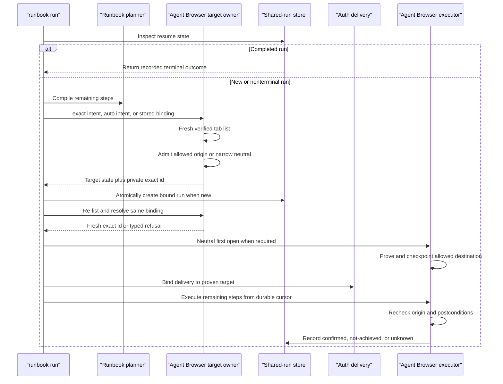

# Browser Use runbook target resolution - Plan

## Current Status

Completed by PR #268 and retained through `285b4948`. Omitted targets resolve exactly one admissible Agent Browser page, persist an opaque binding before effects, independently resolve the CDP target for authentication, re-resolve the adapter binding before business dispatch, and refuse ambiguity, drift, legacy-unbound resume, and concurrent redispatch. Current regression owners are `browser-use-agent-browser.test.ts`, `browser-use-run-model.test.ts`, `browser-use-wave3-dispatch.test.ts`, and `browser-use-platform-process-boundary.test.ts`.

The operator-gated live proof was recorded separately in the Daily Driver Acceptance Ledger. Production Session Identity Proof remains outside this target-resolution plan.

## Goal Capsule

- **Objective:** make `browser-use runbook run` bind deterministically to one admissible Agent Browser tab when `--tab` is omitted, while preserving exact explicit-tab behavior, origin containment, auth binding, and resume identity.
- **Authority:** GitHub issue #267 and its independent reproduction define the defect. Existing Browser Use handoff, runbook, auth, shared-run, and executor contracts remain authoritative where this plan is silent.
- **Execution profile:** extend the existing Agent Browser target owner; resolve after compiling remaining runbook steps; durably create or transition target state through fenced revision checks; re-prove the same target immediately before execution.
- **Immediate value:** a fresh warm profile with one `about:blank` tab can execute a runbook whose first remaining step is an allowed `open`.
- **Stop conditions:** raw adapter tab ID enters public state; ambiguous target selection; origin escape; resume changes targets or replays confirmed steps; auth is delivered before destination proof; mutation occurs after target drift.
- **Tail ownership:** the LFG pipeline owns implementation, review, focused browser proof, commit, push, PR creation, and CI follow-through.

---

## Product Contract

### Summary

Omitting `--tab` becomes an explicit auto-resolution mode, not the synthetic exact id `runbook-tab`. Browser Use lists tabs through the verified Agent Browser handoff, admits only runbook-safe candidates, requires exactly one, and stores versioned redacted target state on the shared run. Resume resolves that binding back to the same live tab and never selects a replacement.

The existing executor remains the final authority. One shared plan-aware admission predicate serves initial resolution and executor reproof. A neutral first `open` reaches and proves the allowed destination before confidential auth delivery. Later actions retain existing origin and postcondition enforcement.

### Problem Frame

The runbook front door currently replaces an omitted `--tab` with `runbook-tab`. The Agent Browser executor interprets every target as an exact raw adapter id, so the synthetic value cannot match a real tab. Passing `--tab 0` also fails because Agent Browser ids are not ordinal indexes.

A real fresh tab does not solve the defect. The executor rejects its current `about:blank` origin before executing the runbook's first allowed `open`. The failure is reported through a generic inspection continuation, and the existing dispatch test accepts either success or exit 20.

### Actors

- A1. Agents running or resuming runbooks through the public Browser Use CLI.
- A2. Browser Use as runbook plan, shared-run, target-binding, auth, and recovery owner.
- A3. Browser Connect as verified handoff owner.
- A4. Agent Browser as tab listing, exact target selection, and browser execution owner.

### Requirements

#### Resolution and admission

- **R1.** Represent runbook target intent as `exact` when `--tab` is present and `auto` when absent. Never manufacture a synthetic exact id.
- **R2.** Resolve `auto` only through a fresh Agent Browser tab listing reached through the verified handoff.
- **R3.** Admit a tab whose current HTTP(S) origin matches the runbook's allowed origins.
- **R4.** Also admit the exact URL `about:blank` only when the first remaining compiled step is `open`. Refuse fragments, inherited blank variants, and every other non-HTTP page. Do not widen public target discovery.
- **R5.** Require exactly one admissible auto candidate. Zero or multiple candidates fail closed before auth delivery or browser mutation.
- **R6.** Preserve explicit `--tab` as an exact raw adapter-id override. Do not interpret numeric strings as indexes and do not substitute another tab.

#### Durable identity and execution

- **R7.** Persist versioned runbook target state on the private shared run before auth delivery or execution. State contains target mode and an opaque binding value derived by the existing collision-resistant candidate-id mechanism from persisted handoff scope plus adapter page identity. Never persist the raw adapter tab id. Never project either identifier publicly.
- **R8.** Resume resolves only the stored binding through the same persisted verified handoff evidence, adapter, and target envelope. A missing or no-longer-admissible target fails closed; resume never falls back to fresh auto-selection.
- **R9.** Re-list immediately before execution, resolve the same opaque binding to one exact raw id, and pass that id privately to the existing executor.
- **R10.** Re-prove current target admission before selection and before confidential auth delivery. A stale, revoked, mismatched, origin-drifted, or disappeared handoff/target dispatches no browser mutation.
- **R11.** Preserve existing destination-origin validation and fresh postcondition proof for `open`. For a neutral target, complete, checkpoint, and prove the first allowed-origin `open` before retrieving or delivering confidential auth. For an already-allowed-origin target, fresh current-origin proof completes before auth retrieval or delivery.
- **R12.** A completed shared run remains a confirmed no-op and does not reacquire a target or auth.

#### Failure and CLI contracts

- **R13.** Resolve initial target cardinality before shared-run creation. Zero or multiple candidates return a typed no-effect failure and a retry continuation without creating an orphan `running` run. Resolution failure on an existing bound run records blocked truth through the shared-run outcome path.
- **R14.** Return one executable repair continuation matched to state. Initial zero or multiple candidates tell the caller to leave exactly one admissible warm target and retry the original command. A missing bound target tells the caller to restore that target or start a replacement run; it never suggests rebinding.
- **R15.** Keep explicit-target failures distinguishable from auto-resolution failures. Report the exact-id mismatch without exposing adapter-private ids from other tabs.
- **R16.** Align command metadata, rendered help, parser acceptance, runtime behavior, JSON/plain projections, and spawned-process behavior. Help states that omitted `--tab` auto-binds one admissible target.
- **R17.** Replace the test that accepts exit 0 or 20 with deterministic success and exact execution assertions.
- **R18.** Persist the next runbook step independently from the repair continuation. Read legacy `runbook-resume:<index>` records, but never let target repair reset progress to step zero.
- **R19.** Define an immutable bound lifecycle. A new successful run is durably created with target mode and binding. Existing bound runs never replace either value. Legacy nonterminal unbound runs fail closed.
- **R20.** Create new bound runs atomically. Update existing bound-run outcomes through the existing fenced lease and revision compare-and-swap. Conflicts or store failures occur before auth, mutation markers, or browser commands.
- **R21.** Keep retrieved confidential auth process-local to one dispatch. Never write it to shared-run state, continuations, logs, or failure output. Discard it after confirmation, refusal, block, or unknown outcome.
- **R22.** Bind target resolution, target state, auth attestation, and execution to the same persisted handoff evidence. A resumed run cannot replace its handoff or target mode.
- **R23.** Public projections expose at most target mode, bound status, and binding schema version. Failures and continuations omit opaque digests, raw ids, URLs, titles, and candidate lists.
- **R24.** Write shared-run records with schema version 2 when they carry independent progress and target state; keep other durable record kinds at version 1. New code dual-reads shared-run versions 1 and 2. Old binaries reject shared-run version 2 before execution.

### Acceptance Examples

- **AE1 (R1-R5, R9-R11).** One fresh `about:blank` tab plus a runbook whose first remaining step is an allowed `open` exits 0, reaches the destination origin, and confirms the postcondition.
- **AE2 (R2-R5).** One tab already at an allowed origin is selected automatically.
- **AE3 (R4-R5, R13-R14).** Zero or multiple admissible tabs return a typed no-effect failure, one repair continuation, `external_effect: none`, and no shared run.
- **AE4 (R4).** A neutral tab with a first remaining step other than `open` is refused before browser mutation.
- **AE5 (R6, R15).** A valid explicit raw id succeeds. `--tab 0` remains a literal exact id and fails if no tab owns that id.
- **AE6 (R7-R10).** A paused run resumes on the same bound target. If that target disappears or another target replaces it, resume reports target movement and never auto-selects the remaining tab.
- **AE7 (R9-R11).** A target that disappears or changes to a refused origin between initial resolution and executor reproof dispatches no action and delivers no confidential auth.
- **AE8 (R12).** Resuming a completed run returns its confirmed outcome without listing tabs or rebuilding auth.
- **AE9 (R16-R17).** Help, discovery, parser, in-process tests, and a spawned-process run all agree on omission, explicit override, success, and failure semantics.
- **AE10 (R18).** A run confirms steps through N, then blocks on target repair. Resume starts at N. A legacy `runbook-resume:N` record also starts at N.
- **AE11 (R19-R20).** An initial ambiguous attempt creates no shared run. Retrying after repair creates one bound run. Concurrent resumes of that bound run produce one executor dispatch. A legacy unbound nonterminal run never auto-binds.
- **AE12 (R21).** A refusal after confidential auth retrieval leaves no auth material in the durable run, continuation, logs, or output.
- **AE13 (R22-R23).** Replacing or revoking handoff evidence, changing target mode, or supplying a malicious origin override fails before auth or mutation. Public output contains no target correlation material.
- **AE14 (R24).** An old binary rejects a new-format shared-run payload before it can drop target state or replay from step zero.

### Success Criteria

- A no-`--tab` runbook succeeds with one admissible fresh tab.
- Auto-resolution never guesses among multiple tabs.
- Resume never switches targets.
- Raw adapter ids are accepted only as explicit input and remain absent from durable state, candidate discovery, and public projections.
- Initial target failure creates no running record; bound-run failure records blocked truth.
- Auth and mutation stay behind fresh same-target proof.
- Repair never resets the runbook cursor or replays a possibly dispatched mutation.
- CLI and process-boundary tests reject the prior false-green behavior.

### Scope Boundaries

**Now**

- Runbook-only Agent Browser target resolution.
- Narrow `about:blank` first-remaining-`open` admission.
- Opaque target binding and resume identity.
- Independent durable runbook progress.
- Typed repair outcomes.
- CLI discovery, help, parser, runtime, and process-boundary coverage.

**Later**

- General neutral-tab discovery.
- Target auto-resolution for non-runbook commands.
- A public selected-target state carrying adapter-private ids.
- Broader new-tab URL admission such as `chrome://newtab`.
- The adjacent runbook `--allowed-origin` contract drift; resolve under a separate issue because runbook definitions currently own origin policy.

**Never**

- Publish raw Agent Browser tab ids in shared-run projections.
- Select the active tab implicitly.
- Pick the first candidate from an ambiguous list.
- Retry after an unknown browser mutation.

### Dependencies and Assumptions

- Browser Connect continues to mint the only verified handoff envelope.
- Agent Browser tab listings continue to expose a stable adapter page id for the life of a tab.
- New code reads legacy shared-run records; new target-bound records use a format old binaries reject.
- The current candidate-id derivation can identify a tab opaquely without retaining its raw adapter id when the persisted handoff evidence is reused.
- Agent Browser raw page ids remain stable and are not reused during the bound tab lifetime. Same-id reuse is outside current observable proof and must not be claimed as detected.
- Exact `about:blank` is the reproduced fresh-profile state. No evidence supports a broader neutral-page set.
- The first neutral `open` does not consume confidential auth and can prove an allowed destination before later auth delivery. If implementation evidence disproves this, stop and revise the Product Contract rather than weaken the auth boundary.

### Context and Research

- `skills/browser-use/src/browser-use.ts` currently supplies `runbook-tab` when `--tab` is absent.
- `skills/browser-use/src/browser-use-agent-browser-target.ts` requires exact raw adapter-id equality before origin checks.
- `skills/browser-use/src/browser-use-agent-browser.ts` checks current origin before the first runbook step.
- `skills/browser-use/src/browser-use-run-model.ts` persists cursor and handoff evidence but no runbook target identity.
- `skills/browser-use/src/browser-use-core.ts` already derives opaque candidate ids from target scope and adapter page identity.
- `skills/browser-use/src/browser-use-wave3-dispatch.test.ts` currently accepts either exit 0 or 20 for the affected path.
- PR #173 intentionally scoped selected-target resolution to `operate`.
- PR #263 added handoff auto-minting, not target auto-resolution.
- No duplicate open issue or pull request was found.
- No `docs/solutions/` corpus or relevant external technology decision exists.

### Sources and References

- GitHub issue #267
- `skills/browser-use/CONTEXT.md`
- `docs/adr/0002-runbooks-and-skills-use-prose-as-orchestrator.md`
- `docs/adr/0004-deterministic-workflow-contracts-live-in-code.md`
- `docs/decisions/2026-07-27-001-browser-use-front-door-decision-log.md`
- `skills/browser-use/src/browser-use.ts`
- `skills/browser-use/src/browser-use-runbook.ts`
- `skills/browser-use/src/browser-use-run-model.ts`
- `skills/browser-use/src/browser-use-schemas.ts`
- `skills/browser-use/src/browser-use-core.ts`
- `skills/browser-use/src/browser-use-agent-browser-target.ts`
- `skills/browser-use/src/browser-use-agent-browser.ts`
- `skills/browser-use/src/command-contract.ts`

---

## Planning Contract

### Known Tradeoff Decisions

- **KTD1. Auto-resolution owner:** resolve inside the runbook target boundary. Reject caller-supplied discovery plumbing because the public front door owns omission semantics. Explicit raw ids remain input-only and never enter discovery, durable state, or projections.
- **KTD2. Resume identity:** persist an opaque binding. Reject re-running unique-candidate selection on resume because it can silently switch tabs.
- **KTD3. Neutral admission:** allow exact `about:blank` only for a first remaining `open`. Reject a global discovery change because non-runbook callers do not have the runbook destination proof.
- **KTD4. Race closure:** resolve and persist before auth, then re-list and re-prove before execution. Reject single-list execution because the tab can disappear or navigate between phases.
- **KTD5. Failure posture:** block with one repair continuation and zero mutation. Reject guessing and generic inspection because neither repairs target cardinality deterministically.
- **KTD6. Structure:** extend `browser-use-agent-browser-target.ts` and existing shared-run types. Reject a new module or named pattern because the existing owner and plain discriminated data are sufficient.
- **KTD7. Progress carrier:** persist runbook cursor independently from the single repair continuation. Reject continuation-only progress because target repair would erase the cursor and replay steps.
- **KTD8. Binding lifecycle:** resolve before creation, create only successful runs bound, and refuse legacy unbound nonterminal runs. Reject persisted pre-bind state because initial cardinality failure has no progress to preserve and can safely retry.
- **KTD9. Handoff stability:** scope the opaque binding to the persisted verified handoff evidence and require that evidence on resume. Reject auto-minting replacement handoff authority because current candidate identity is handoff-scoped.
- **KTD10. Durable transition:** atomically create new bound runs and use the existing fenced lease plus revision compare-and-swap for bound-run outcomes. Reject an unfenced property write because concurrent resumes could dispatch twice.
- **KTD11. Format compatibility:** version shared-run records independently: read versions 1 and 2, write version 2 for target/progress state, and leave other durable record kinds at version 1. Reject a new-code rollback preflight because an already-built old binary cannot enforce it.

### Hypothesis-to-Decision Ledger

- **HTD1.** Hypothesis: completed-run handling can occur before target and auth work without changing current outcome projections. Validation: add a no-tab-list/no-auth completed-resume test. If disproved, stop and revise the Product Contract; completed runs cannot reacquire target or auth.
- **HTD2.** Hypothesis: a neutral first `open` can execute and checkpoint before confidential auth construction without changing later step semantics. Validation: trace compiled inputs plus ordered execution/resume tests before the remaining U2 work. If disproved, stop and revise the Product Contract; never deliver auth before destination proof or silently narrow neutral-target scope.

### Assumptions

- Issue evidence and hermetic probes accurately represent the production Agent Browser transport.
- The runbook compiler exposes the first remaining step after resume cursor application.
- No confidential auth route requires delivery before target identity is known.

---

## Execution Flow

---

## Implementation Units

### U1. Add runbook target intent, admission, and opaque binding

**Owners**

- `skills/browser-use/src/browser-use-agent-browser-target.ts`
- `skills/browser-use/src/browser-use-core.ts`
- `skills/browser-use/src/browser-use-agent-browser.test.ts`

**Change**

- Add a discriminated runbook target request for exact and auto modes.
- Reuse the verified Agent Browser tab-list transport.
- Add one plan-aware admission predicate shared by initial resolution and executor reproof. Accept the first-remaining compiled-step kind as caller-supplied context; U1 does not compile runbooks.
- Produce an opaque binding plus a private exact adapter id.
- Admit current allowed-origin pages.
- Admit exact `about:blank` only when the first remaining step is `open`.
- Resolve an existing opaque binding without fallback.
- Return typed zero, ambiguous, moved, and origin-refused failures.
- Keep general candidate discovery unchanged.

**Tests**

- One allowed-origin candidate.
- One `about:blank` candidate plus first `open`.
- Neutral candidate plus first non-`open`.
- Zero candidates.
- Multiple candidates.
- Exact valid, exact missing, and literal numeric id.
- Stored binding present, missing, replaced, and origin-drifted.
- Same adapter page under distinct handoff scopes yields distinct bindings.
- Stale, revoked, and mismatched handoff evidence.
- Exact `about:blank#fragment` and other blank variants refused.
- Re-list race before execution.

**Done**

- [x] Resolution is deterministic and fresh.
- [x] Raw ids remain input-only and absent from durable state, discovery, and public projections.
- [x] Neutral admission is runbook-specific and narrow.
- [x] Binding re-resolution never selects a replacement.

### U2. Persist target identity and order target, auth, and execution

**Owners**

- `skills/browser-use/src/browser-use-run-model.ts`
- `skills/browser-use/src/browser-use-schemas.ts`
- `skills/browser-use/src/browser-use-run-model.test.ts`
- `skills/browser-use/src/browser-use-schemas.test.ts`
- `skills/browser-use/src/browser-use-runs.test.ts`
- `skills/browser-use/src/browser-use-runbook.ts`
- `skills/browser-use/src/browser-use.ts`
- `skills/browser-use/src/browser-use-runbook.test.ts`
- `skills/browser-use/src/browser-use-run-commands.test.ts`

**Change**

- Add shared-run schema version 2 carrying target state and an independent runbook progress cursor; dual-read shared-run version 1 and its legacy continuation cursor without changing other durable record versions.
- Compile remaining steps before target resolution.
- Wire the compiler's first-remaining step kind into U1 before target resolution.
- Resolve initial target cardinality before run creation; zero or ambiguous results return a retry continuation and create no run.
- For successful new runs, create bound state atomically. Refuse legacy unbound nonterminal runs.
- For bound resumed runs, require persisted handoff evidence, mode, and binding; never auto-select again.
- Route bound-run outcome writes through fenced lease and revision compare-and-swap.
- Re-prove the binding before executor dispatch.
- For a neutral target, execute and prove the first `open` before confidential auth construction or delivery.
- Checkpoint the confirmed neutral `open` before auth retrieval.
- Handle completed runs before target or auth reacquisition.
- Record resolution failures through the shared-run outcome reducer.
- Emit `prepare_unique_runbook_target` for initial cardinality failures.
- Emit `restore_bound_runbook_target` or `start_replacement_runbook_run` when rebinding is forbidden.
- Preserve explicit exact-target failure semantics.
- Keep confidential auth process-local and discard it after every dispatch outcome.

**Tests**

- Shared-run parse, projection, round-trip, and backward compatibility.
- Progress N, target failure, repair, and resume from N.
- Legacy continuation cursor read compatibility.
- New bound creation, initial no-run failure, and legacy-unbound refusal.
- Concurrent resume and compare-and-swap conflict.
- Store failure before binding commit.
- Legacy/new payload dual-read and old-reader new-payload rejection.
- New no-`--tab` success.
- Resume same target.
- Resume moved target.
- Completed resume performs no listing or auth.
- Resolution failure leaves no `running` orphan.
- Auth is not built or delivered before fresh target proof.
- Neutral first `open` completes before secret retrieval or delivery.
- Target changes to a refused origin immediately before confidential delivery: zero retrieval, delivery, or mutation.
- Post-retrieval refusal persists and emits no auth material.
- All refusal paths report `external_effect: none`.

**Done**

- [x] Binding persists privately before effects.
- [x] Progress persists independently from repair.
- [x] Resume retains exact target identity.
- [x] Target proof precedes auth and mutation.
- [x] Every failure records inspectable run truth and one next safe action.

### U3. Align CLI contracts and prove the real process boundary

**Owners**

- `skills/browser-use/src/command-contract.ts`
- `skills/browser-use/src/browser-use-parser.test.ts`
- `skills/browser-use/src/browser-use-discovery.test.ts`
- `skills/browser-use/src/browser-use-platform-process-boundary.test.ts`
- `skills/browser-use/src/browser-use-wave3-dispatch.test.ts`

**Change**

- Document omitted `--tab` as automatic unique-target binding.
- Preserve explicit exact-id parser acceptance.
- Keep discovery metadata, rendered help, parser, runtime, and projections aligned.
- Replace the permissive `[0, 20]` assertion with exit 0, confirmed outcome, destination-origin proof, and exact dispatch assertions.
- Add a spawned-process no-`--tab` success fixture with one fresh neutral tab.
- Add process-boundary zero and ambiguous candidate failures.
- Project target mode, bound status, and format version without the binding value.
- Register and verify every new continuation action.

**Tests**

- Command metadata snapshot.
- Plain and JSON help.
- Parser omission and explicit override.
- JSON/plain projection and redaction parity.
- Assert without behavior change that caller `--allowed-origin` cannot widen runbook-definition policy; the flag contract remains deferred.
- In-process dispatch.
- Spawned source and built/dist execution from a neutral working directory.

**Done**

- [x] CLI surfaces describe actual semantics.
- [x] The prior false-green test cannot pass on exit 20.
- [x] Process-boundary proof covers omission and repair failures.

---

## System-Wide Impact

### Interaction Graph

- `runbook run` compiles remaining steps before target resolution.
- Target resolution consumes verified handoff transport and allowed-origin policy.
- The shared-run store gains private opaque target identity, independent progress, and a new payload version.
- Auth delivery receives only a freshly proven exact private target. Neutral flows first prove the allowed destination.
- The executor retains final origin and postcondition authority.
- Outcome recording gains target-specific blocked continuations.
- CLI metadata and process tests make omission semantics discoverable.

### Error Propagation

- Transport or listing failure remains adapter unavailable.
- Zero auto candidates becomes target unavailable plus one preparation continuation.
- Multiple auto candidates becomes target ambiguous plus one preparation continuation.
- Stored binding mismatch becomes target moved and offers restore-or-new-run repair, never fallback.
- Refused current origin remains target origin refused.
- Fenced transition failure leaves prior durable state unchanged and dispatches no effect.
- Post-dispatch uncertainty remains `unknown`; this change does not retry it.

### State and Compatibility

- New code parses legacy shared-run records through legacy cursor compatibility.
- Old code rejects new target/progress payload format before execution.
- Legacy nonterminal records without target state fail closed.
- New successful runs are created bound before auth or execution.
- Initial zero/ambiguous attempts create no shared run.
- Explicit `--tab` remains accepted as an exact compatibility override.
- Public projections expose at most target mode, bound status, and binding schema version; never raw adapter ids or the binding value.

---

## Risks and Mitigations

| Risk | Mitigation |
|---|---|
| Resume silently switches tabs | Persist opaque binding; resolve only that binding |
| Target repair erases progress | Persist cursor independently; dual-read legacy continuation cursors |
| Neutral exception becomes an origin bypass | Allow exact `about:blank` only for first remaining `open`; retain destination and postcondition checks |
| Tab changes after initial list | Re-list and re-prove immediately before auth and execution |
| Failure leaves run marked `running` | Resolve before new-run creation; route bound-run refusals through the outcome recorder |
| Raw adapter id leaks through durable state | Persist only opaque binding; add projection and serialization tests |
| Opaque digest enables correlation | Omit the binding value from JSON/plain projections |
| Concurrent resumes dispatch twice | Fenced revision compare-and-swap; conflict tests |
| Replacement handoff breaks binding identity | Require persisted verified handoff evidence on resume |
| Same-id tab replacement is undetectable | Accept only the documented adapter non-reuse assumption; fresh origin proof limits exposure but does not claim detection |
| Old binary drops new cursor/target semantics | Bump payload format so old readers reject new records |
| CLI claims drift from parser/runtime | Test metadata, help, parser, runtime, and spawned process together |
| Existing exact callers break | Preserve exact-id override and add explicit compatibility tests |
| Adjacent `--allowed-origin` drift expands scope | Defer to a separate issue; do not reinterpret runbook origin policy here |

---

## Verification Contract

### Focused gates

- `bun test skills/browser-use/src/browser-use-agent-browser.test.ts`
- `bun test skills/browser-use/src/browser-use-runbook.test.ts`
- `bun test skills/browser-use/src/browser-use-run-model.test.ts`
- `bun test skills/browser-use/src/browser-use-schemas.test.ts`
- `bun test skills/browser-use/src/browser-use-runs.test.ts`
- `bun test skills/browser-use/src/browser-use-run-commands.test.ts`
- `bun test skills/browser-use/src/browser-use-parser.test.ts`
- `bun test skills/browser-use/src/browser-use-discovery.test.ts`
- `bun test skills/browser-use/src/browser-use-wave3-dispatch.test.ts`
- `bun test skills/browser-use/src/browser-use-platform-process-boundary.test.ts`

### Package gates

- `bun run --cwd skills/browser-use typecheck`
- `bun run --cwd skills/browser-use test`
- `bun run --cwd skills/browser-use build`
- `bun run --cwd skills/browser-use pack:dry-run`

### Workspace gates

- Run Biome on changed Browser Use source and tests.
- Inspect generated help from the source entrypoint and built binary.
- Confirm `git diff --check`.

### Live browser proof

- Acquire a fresh verified Agent Browser handoff.
- Leave one exact `about:blank` target.
- Run a read-only runbook whose first remaining step is an allowed `open`.
- Require exit 0, confirmed outcome, destination-origin proof, and expected postcondition.
- Require zero confidential auth retrieval or delivery before destination proof.
- If the environment cannot supply a fresh neutral profile, record that gap; hermetic and process-boundary gates remain mandatory.

---

## Definition of Done

- [x] Omitted `--tab` auto-resolves exactly one admissible target.
- [x] Explicit `--tab` remains an exact adapter-id override.
- [x] Fresh `about:blank` works only for a first remaining allowed `open`.
- [x] Zero and multiple candidates fail before auth or mutation.
- [x] Opaque target identity persists privately before effects.
- [x] Runbook progress persists independently from repair continuation.
- [x] New success creates bound state; initial cardinality failure creates no run.
- [x] Legacy unbound nonterminal runs fail closed.
- [x] Concurrent resumes produce one dispatch.
- [x] Resume reuses the same target and never substitutes.
- [x] Race, disappearance, and origin drift fail closed.
- [x] Completed resume bypasses target and auth work.
- [x] Confidential auth follows destination proof and never enters durable or public output.
- [x] Target resolution through execution retains the same handoff evidence and immutable target mode.
- [x] Initial target failures return one retry continuation; bound-run failures record one repair continuation.
- [x] Raw adapter ids remain explicit input only and never enter durable state, discovery, or projections.
- [x] Old binaries reject the new target/progress payload format before execution.
- [x] CLI metadata, help, parser, runtime, and process tests agree.
- [x] The permissive exit 0 or 20 assertion is removed.
- [x] Focused, package, workspace, and available live gates pass.
- [x] No dead experimental code or unrelated refactor remains.
