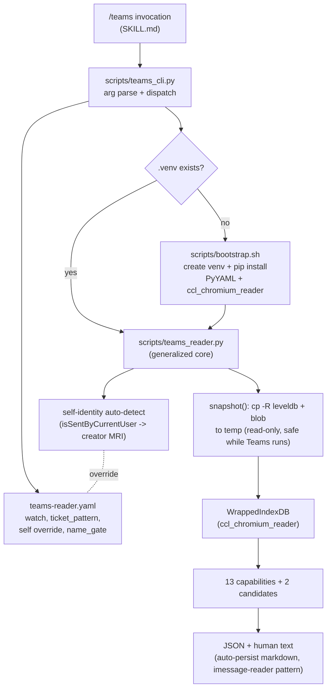
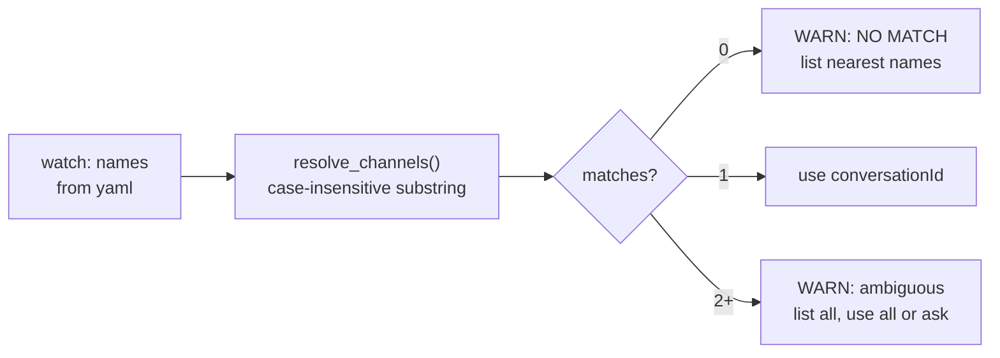

# feat: General-purpose Microsoft Teams local-store reader skill

**Target repo:** `claude-code-config` (the plan lives and executes there, not in the `bunnings-pos-yellow` cwd where it was authored). All paths below are relative to the `claude-code-config` repo root.

---

## Summary

Package the proven `teams_reader.py` prototype into a shippable, **general-purpose** Claude Code skill invokable as `/teams`. The skill reads the local (new Teams v2) IndexedDB store on macOS with zero network to Microsoft, no Graph API, and no app registration. The reader library is already validated against ~9,879 real messages across 13 capabilities. This plan covers: lifting the reader out of the fragile `/tmp` scratchpad, parameterizing the three Bunnings-specific hardcodes into a `teams-reader.yaml` config, auto-detecting self-identity instead of hardcoding an MRI, bootstrapping the load-bearing `ccl_chromium_reader` dependency into a committed venv, and wiring a CLI + `SKILL.md` that exposes all 13 capabilities plus two selected candidate features.

The skill mirrors the existing `imessage-reader` skill's **read-your-own-local-store, stateless-query** shape (same repo). It differs in runtime (Python, not Bun) and store (Teams IndexedDB, not Messages SQLite). **One deliberate divergence:** the proven prototype prints JSON/text and does not persist. Whether v1 also adds imessage-reader's auto-persist-markdown behavior is an open decision (see Open Questions) — the plan does not claim persistence it has no unit to build.

---

## Problem Frame

The reader works but is trapped in an OS-managed `/tmp` scratchpad that can be wiped at any time, and it hardcodes Bunnings-specific values that make it unusable for any other Teams user or tenant:

- `POS-\d+` ticket regex baked into `standup_prep` (line 427).
- `"nathan" in m.content.lower()` name-gating in `action_items` (line 415) and `standup_prep` (line 431).
- Watch-list channel names live in a throwaway `teams-watch.yml` parsed by a hand-rolled mini-parser.
- Self-identity MRI (`8:orgid:f8e08355-...`) is passed in by smoke tests as a literal, with no auto-detection path.

The macOS container path (`com.microsoft.teams2`) is **not** a generalization target: this is a macOS-only skill by design, and the path is already resolved dynamically via glob.

**Compliance is accepted** (user, 2026-07-29): reading one's own already-synced local Teams cache is within scope. Not a blocker.

**What "done" enables:** any Teams user drops a `teams-reader.yaml` next to the skill (the CLI's `--config` default resolves to `skills/teams/teams-reader.yaml`, falling back to the committed `.example.yaml`), runs `/teams`, and gets a digest / search / mentions / thread / ticket-timeline / people-lookup over their own cache. Bunnings becomes one config instance, not a hardcode. If the live `teams-reader.yaml` is user-private it is gitignored (U1).

---

## Requirements

- **R1** — The reader library is copied out of the `/tmp` scratchpad into a durable, committed location in `claude-code-config` before any other work, so a `/tmp` wipe cannot lose the validated core.
- **R2** — All three Bunnings-specific values (ticket regex, name-gating, watch-list) are read from `teams-reader.yaml`; none remain hardcoded in the library. The library works for any tenant when pointed at a different config.
- **R3** — Self-identity (the current user's MRI + display name) is auto-detected from the store, not hardcoded. Config may override, but the default path requires no manual MRI.
- **R4** — Config is real YAML parsed by a proper YAML library, replacing the hand-rolled mini-parser.
- **R5** — The `ccl_chromium_reader` GitHub dependency (NOT PyPI `chromium-reader`) is bootstrapped into a committed venv on first run and reused thereafter.
- **R6** — The skill exposes all 13 proven capabilities plus two selected candidate features (unread catch-up, reaction/sentiment) via a CLI, each returning both structured JSON and human-readable text.
- **R7** — Channel selection resolves config human-names to conversationIds via fuzzy match at runtime, and warns clearly on NO-MATCH or multiple matches rather than silently picking one.
- **R8** — `SKILL.md` documents prerequisites, invocation, config shape, capability menu, and the freshness caveat, mirroring `imessage-reader` conventions.
- **R9** — The three heuristic capabilities (decision-extractor, action-item-detector, standup-prep) ship with an explicit "regex-only, may be noisy" caveat in their output.

---

## Key Technical Decisions

### KTD1. Skill home: `claude-code-config`, invokable as `/teams`
*(session-settled: user-directed — chosen over bunnings-plugins and a standalone plugin: general-purpose tool belongs in the canonical user-scope config repo, not under a Bunnings namespace.)*
Lands at `skills/teams/`, mirroring the sibling `imessage-reader` skill. Installs into user scope via the repo's existing `install.sh` mechanism. Bunnings usage is just the user's `teams-reader.yaml`.

### KTD2. Language: Python
*(session-settled: user-directed — chosen over a Bun/TS port and a Bun+Python hybrid: no npm equivalent exists for the IndexedDB envelope + Blink/V8 structured-clone deserialization that `ccl_chromium_reader` performs; porting is a multi-day reverse-engineering effort, not a port.)*
The validated `teams_reader.py` becomes the skill core unchanged except for the generalization edits.

### KTD3. Config: real YAML via `teams-reader.yaml`
*(session-settled: user-directed — chosen over the prototype's hand-rolled mini-parser: user explicitly asked for YAML.)*
Parsed with `PyYAML` (installed into the same venv as `ccl_chromium_reader`). The mini-parser in `prototype.py` is discarded.

### KTD4. Dependency: committed venv bootstrap
*(session-settled: user-approved — chosen over assume-pre-existing-venv and vendoring: self-contained, survives across sessions, one-time cost; avoids the fragility of a manually-created venv and the maintenance burden of vendored source.)*
A `scripts/bootstrap.sh` (or inline SKILL.md step) creates `skills/teams/.venv` and `pip install`s `PyYAML` plus `ccl_chromium_reader @ git+https://github.com/cclgroupltd/ccl_chromium_reader.git@<commit-sha>` on first run, then reuses it. The `.venv/` is gitignored; the bootstrap script and a fully SHA-pinned `requirements.txt` are committed.

**Pin to a commit SHA, not `v0.3.17`:** the GitHub repo has *no releases or tags* — `0.3.17` is only the `version` string in `pyproject.toml` on `master`, so `@v0.3.17` will fail to resolve. Capture the validated `master` commit SHA during U2 and pin to it. `ccl_chromium_reader` also transitively pulls a **second, undeclared git dependency** (`ccl_simplesnappy @ git+https://github.com/cclgroupltd/ccl_simplesnappy.git`) which must also be SHA-pinned, and an exact `zstd==1.5.7.3` pin that does not appear on PyPI (latest is 1.5.7.2). U2 must run a real clean-venv install to establish the true resolution before trusting these facts — the earlier "yanked zstd, warns but works" characterization is unverified. First-run bootstrap therefore requires network + git + a C build toolchain (this is the only network the skill uses; still zero network to Microsoft).

### KTD5. v1 capability scope: all 13 + 2 candidates
*(session-settled: user-directed — chosen over "10 solid only" and "10 solid + 3 heuristic": user picked all 13 plus selected candidates.)*
All 13 proven capabilities ship. The 3 heuristic ones (decision/action-item/standup) ship opt-in with a concrete caveat per R9 (not surfaced in the first-run menu). Two candidate features are selected for v1, each **gated on a U6 spike** (either may narrow or defer per its outcome): **unread catch-up** (needs a message-level read horizon confirmed — the proven `isRead` is mention-level only) and **reaction summary** (2,850 messages carry reactions; field path unconfirmed). The other 6 candidates (call/meeting log, transcript pointer, topic-change tracker, roster/membership, incremental digest daemon, draft/reminder surfacing) are deferred — see Scope Boundaries.

### KTD6. Self-identity auto-detection strategy
Detect the current user's MRI by scanning `replychains` for messages where `isSentByCurrentUser == true` and reading their `creator` MRI (the modal value is self). Cross-check against the tenant segment of the IndexedDB database name. Fall back to a config-supplied `self.mri` override when auto-detection is ambiguous. This replaces both the hardcoded `VALE_MRI` literal and the `"nathan"` string-gating.

---

## High-Level Technical Design

The skill is three layers: a thin CLI dispatcher, the (generalized) reader library, and the venv-bootstrapped dependency. Config flows in from `teams-reader.yaml`; the live Teams store is snapshotted read-only before any parse.



**Config resolution + channel matching** is the one flow with a real branch worth showing — fuzzy match can miss or hit multiple:



---

## Output Structure

```
skills/teams/
├── SKILL.md                    # invocation, prerequisites, config shape, capability menu, freshness caveat
├── teams-reader.example.yaml   # documented sample config (generic defaults; Bunnings values as a commented e.g.)
├── requirements.txt            # SHA-pinned: PyYAML + ccl_chromium_reader@<sha> + ccl_simplesnappy@<sha>
├── .gitignore                  # ignores .venv/ (+ any persisted-output dir if that lands here)
└── scripts/
    ├── bootstrap.sh            # first-run venv creation + pip install
    ├── teams_reader.py         # the generalized reader library (lifted from scratchpad, snapshot-lifecycle wrapped)
    ├── teams_cli.py            # CLI dispatcher: subcommand per capability, --json / --text
    └── teams_reader_test.py    # pytest coverage (created across U2-U6 test scenarios; owned by U5)
```

The per-unit `**Files:**` sections remain authoritative; the implementer may adjust layout if a better one emerges.

---

## Implementation Units

### U1. Lift the reader out of the scratchpad into the committed skill home

**Goal:** Get the validated `teams_reader.py` into `skills/teams/scripts/` before anything else, so a `/tmp` wipe cannot cost the proven core. Establish the skill directory skeleton.

**Requirements:** R1

**Dependencies:** none (do this first)

**Files:**
- `skills/teams/scripts/teams_reader.py` (copy from scratchpad, verbatim first)
- `skills/teams/.gitignore` (add `.venv/`)
- `skills/teams/scripts/` (create)

**Approach:**
1. Copy `teams_reader.py` from the scratchpad path to `skills/teams/scripts/teams_reader.py` unchanged.
2. Add `.gitignore` with `.venv/`.
3. Commit immediately, before generalization, so the durable checkpoint exists.
4. **Then** wrap the snapshot lifecycle so cleanup is guaranteed by the library, not the caller (security fix). In the lifted prototype, `snapshot()` does the `cp -R` but the `shutil.rmtree(tmp)` cleanup lives only in the caller files (`prototype.py`, `teams_digest.py`) — the library has no cleanup. Since the snapshot is a full plaintext copy of corporate Teams chat, any crash / `SIGINT` / early exit before the caller's `finally` orphans a PII copy in the temp dir. Convert `snapshot()` to a `@contextlib.contextmanager` (or register `atexit`/signal handlers) that yields the paths and `rmtree`s in its own `finally`, so no caller — CLI, tests, future — can skip it. Do not rely on `ignore_errors=True` masking a failed unlink; log if cleanup fails.

**Execution note:** Steps 1-3 are the preservation move (copy + commit first, against a `/tmp` wipe). Step 4 is the one deliberate edit to the lifted file. Verify the copy imports cleanly against a venv (U2) before editing it.

**Test scenarios:**
- No `teams-reader-*` temp dir survives after a normal capability run.
- No `teams-reader-*` temp dir survives after a forced mid-run exception (the cleanup guarantee holds on the failure path, not just the happy path).

**Verification:** File exists at the committed path; content matches the scratchpad source except the snapshot-lifecycle wrap; a mid-run exception leaves no orphaned snapshot.

---

### U2. Dependency bootstrap: committed venv + pinned requirements

**Goal:** Reproducibly install the load-bearing `ccl_chromium_reader` (GitHub, not PyPI) plus `PyYAML` into a skill-local venv on first run.

**Requirements:** R5

**Dependencies:** U1

**Files:**
- `skills/teams/requirements.txt` (create)
- `skills/teams/scripts/bootstrap.sh` (create)

**Approach:**
1. **Install spike first.** Before writing `requirements.txt`, run a real clean-venv install and capture the actual outcome: the resolvable `ccl_chromium_reader` commit SHA, the `ccl_simplesnappy` SHA, and what `zstd` actually resolves to (`1.5.7.3` is not on PyPI — latest is `1.5.7.2`; if it is unresolvable, add a `zstd==1.5.7.2` constraint rather than documenting a warning that does not occur).
2. `requirements.txt` SHA-pins **both** git deps (`ccl_chromium_reader @ ...git@<sha>` and `ccl_simplesnappy @ ...git@<sha>`) plus `PyYAML`; a bare `.git` URL floats `master` and must not ship. Prefer a hashed lockfile (`pip-compile`).
3. **Pin the interpreter.** The library targets Python 3.10; the host default `python3` is 3.14.3. The prototype was validated on 3.14.3 (so 3.14 works), but the venv must pin a known-good interpreter explicitly rather than defaulting to whatever `python3` is, and record it in `requirements.txt` comments + SKILL.md prerequisites.
4. `bootstrap.sh` is idempotent: if `skills/teams/.venv/bin/python` exists and imports the full load-bearing chain (`from ccl_chromium_reader.ccl_chromium_indexeddb import WrappedIndexDB` **and** `zstd`/snappy), exit 0; else create the venv and `pip install -r requirements.txt`. Use the same assertion in bootstrap and Verification so a partial install cannot pass the fast-path probe.

**Patterns to follow:** No existing Python-venv skill in the repo; `imessage-reader` uses Bun. This unit sets the venv-bootstrap precedent — keep it minimal and self-contained.

**Test scenarios:**
- Running `bootstrap.sh` in a clean checkout creates `.venv/` and the full load-bearing import chain (`WrappedIndexDB` + `zstd`/snappy) succeeds.
- Running `bootstrap.sh` a second time is a fast no-op (does not reinstall).
- `pip install` uses the GitHub URL, never PyPI `chromium-reader` (assert the installed module name is `ccl_chromium_reader`, and that a naive `chromium-reader` import path is absent).
- `requirements.txt` contains an `@<sha>`-pinned ref for **both** git deps; a bare `.git` URL fails a guard check.
- The venv interpreter is the pinned major.minor, not whatever `python3` defaults to.

**Verification:** After bootstrap, `.venv/bin/python -c "from ccl_chromium_reader.ccl_chromium_indexeddb import WrappedIndexDB"` exits 0, and the same probe is what `bootstrap.sh` uses for its idempotency fast-path.

---

### U3. Parameterize the three Bunnings-specific hardcodes into config

**Goal:** Remove `POS-\d+`, `"nathan"` name-gating, and the watch-list literal from the library; read them from `teams-reader.yaml`.

**Requirements:** R2, R4, R9

**Dependencies:** U1, U2, U4 (step 3 consumes the resolved self-identity from U4 — land U4 first)

**Files:**
- `skills/teams/scripts/teams_reader.py` (edit: `standup_prep`, `action_items`)
- `skills/teams/teams-reader.example.yaml` (create)
- `skills/teams/scripts/teams_cli.py` (create — the config loader lives here or in a small helper)

**Approach:**
1. Add a config loader using `PyYAML` (the hand-rolled mini-parser lived only in `prototype.py`, which is **not** lifted, so R4 is satisfied by omission — state that explicitly so the requirement isn't dangling). Config keys: `watch` (list of channel names), `ticket_pattern` (regex string, default `[A-Z]+-\d+` for generic Jira-style tickets — document that trackers with other shapes, e.g. GitHub `#1234` or numeric-only, need an override), `lookback_hours`, `max_per_channel`, optional `self.mri`, optional `name_gate` (list of name substrings used to flag "to me" — derived from self-profile by default, see U4).
2. In `standup_prep` (line ~427, pre-generalization; grep to locate): replace the literal `re.compile(r"\bPOS-\d+\b")` with `re.compile(config.ticket_pattern)`.
3. In `action_items` (line ~415) and `standup_prep` (line ~431): replace `"nathan" in m.content.lower()` with a check against the resolved self-identity name/MRI (from U4), falling back to config `name_gate` substrings.
4. `teams-reader.example.yaml` ships the **generic** defaults as the primary shape (generic `[A-Z]+-\d+`, commented `watch`, `self.mri` omitted so auto-detect runs), with the Bunnings values as a commented "e.g." block — not the headline — so a non-Bunnings user has a real on-ramp.

**Patterns to follow:** Config-key naming mirrors the existing `teams-watch.yml` where sensible (`watch`, `lookback_hours`, `max_per_channel`).

**Test scenarios:**
- A config with `ticket_pattern: "JIRA-\\d+"` makes `standup_prep` extract `JIRA-123` and ignore `POS-4059`.
- A config with `ticket_pattern: "POS-\\d+"` reproduces the original Bunnings behavior exactly (regression guard).
- `action_items` with no `name_gate` and a resolved self-identity flags a message addressing that identity as `to_me`, and does NOT hardcode "nathan".
- **Second-tenant characterization (the real generalization proof):** a synthetic-store fixture with a *different* ticket shape AND a *different* self-identity produces correct digest/ticket/action-item output, and the heuristics degrade gracefully when `name_gate`/`ticket_pattern` don't fit — proving generalization, not just literal-string removal.
- Malformed YAML surfaces a clear error, not a stack trace.
- Empty `watch` list is handled (digest over all named conversations, or clear message).

**Verification:** `grep -nE "nathan|POS-|8:orgid:|VALE_MRI" skills/teams/scripts/teams_reader.py skills/teams/scripts/teams_cli.py` returns zero matches (extends the guard to the self-MRI literal R3/U4 removes; scoped to library + CLI, excluding the test file whose fixtures intentionally reference `POS-4059`). This is a lint check, not the generalization proof — the real proof is the second-tenant characterization test below. The two example configs (generic + a non-Bunnings ticket shape + a different self-identity) both drive correct behavior.

---

### U4. Self-identity auto-detection

**Goal:** Detect the current user's MRI and display name from the store instead of hardcoding, with a config override.

**Requirements:** R3

**Dependencies:** U2

**Files:**
- `skills/teams/scripts/teams_reader.py` (add a `self_identity()` method)

**Approach:**
1. Add `self_identity() -> {mri, display_name, confidence}`: iterate `replychains`, collect `creator` MRIs where `isSentByCurrentUser == true`, take the modal MRI as the *candidate* self. Resolve its display name via the `profiles` store (`people()` already returns mri→profile).
2. **Require a confidence margin, don't trust a thin mode.** Only auto-accept the candidate when it dominates — at least N self-sent messages AND ≥ a share threshold (e.g. >60%) of self-sent creators, AND its profile display name resolves. This is the load-bearing guard for the generalization: the modal heuristic is safe for an active single-tenant account (Nathan's case) but breaks silently for low-sent-volume lurkers, shared/relay/delegated mailboxes, multi-orgid (guest/B2B) stores, or bot-dominated stores. Below the margin, refuse to guess.
3. Cross-check the candidate MRI's tenant segment against the IndexedDB database-name tenant segment; on mismatch **hard-stop** (do not merely log) — a cross-tenant pick is always wrong.
4. On low confidence or no `isSentByCurrentUser` messages: fall back to config `self.mri`; if absent, print the resolved candidate for one-time user confirmation (imessage-reader-style prompt) rather than trusting it silently; if still unresolved, enter a clear "self-identity unresolved" state that disables name-gating rather than guessing.
5. Feed the resolved identity into `action_items` / `standup_prep` (U3).

**Test scenarios:**
- On the real store, `self_identity()` returns the current user's MRI with high confidence and matches the tenant segment (Covers R3 — verified against this machine's data, expecting the Vale MRI as the dominant modal self). Machine-local expectation, not a general assertion.
- **Low-volume/ambiguous case:** with only 2 self-sent messages split across identities, confidence falls below the margin and the code refuses to auto-pick (demands `self.mri` or confirmation) rather than coin-flipping.
- With zero `isSentByCurrentUser` messages, falls back to config `self.mri` when present.
- Tenant-segment mismatch hard-stops with a clear message.
- With neither auto-detect nor config, name-gating is disabled and no crash occurs.

**Verification:** `self_identity()` on the live store returns a non-null MRI whose profile display name is the signed-in user; no MRI literal remains in the library or CLI.

---

### U5. CLI dispatcher exposing all 13 capabilities + JSON/text output

**Goal:** A `teams_cli.py` that snapshots the store, loads config, and dispatches a subcommand per capability, emitting both structured JSON and human-readable text.

**Requirements:** R6, R7

**Dependencies:** U3, U4

**Files:**
- `skills/teams/scripts/teams_cli.py` (create/extend)

**Approach:**
1. Argparse with one subcommand per capability: `digest`, `search`, `mentions`, `thread`, `history`, `ticket`, `links`, `code`, `people`, `whois`, `disambiguate`, `decisions`, `action-items`, `standup`. Global flags `--json` / `--text` (default: both), `--config`. (14 subcommands cover the 13 capabilities: `people`/`whois`/`disambiguate` are three views of the people-lookup capability family.) The 3 heuristic subcommands (`decisions`, `action-items`, `standup`) are **opt-in only** — not surfaced in the first-run `/teams` menu or the default digest — so a noisy regex extraction never fronts the skill.
2. Use the library's snapshot context manager (from U1 step 4) so cleanup is guaranteed even on error — the CLI does not own the cleanup `finally`.
3. `resolve_channels` warns on NO-MATCH (list nearest named conversations) and on multiple matches (list all, use all by default), per R7 and the fuzzy-match branch in the design.
4. JSON serialization mirrors the `smoke2.py` proof shape (isoformat times, `creator_mri`, truncated content where appropriate).
5. Heuristic subcommands (`decisions`, `action-items`, `standup`) prepend a concrete caveat — "this is a regex grep over message text, not a summarizer; expect false positives" — to text output and set a `"heuristic": true` flag in JSON (R9).

**Patterns to follow:** `prototype.py`'s snapshot lifecycle and `show_messages` text formatting; `smoke2.py`'s JSON shape.

**Test scenarios:**
- Each subcommand returns non-empty structured output on the live store (smoke-level, one assertion per capability).
- `--json` output is valid parseable JSON for every subcommand.
- `ticket POS-4059` reproduces the proven ticket-timeline result.
- `disambiguate Nathan` cleanly separates the two MRIs (the proven 668-vs-32 split — a machine-local characterization number, not a general assertion).
- A watch name with no match prints a NO-MATCH warning and a nearest-names list, exit non-error.
- A watch name matching multiple conversations lists all and proceeds.
- Heuristic subcommands carry the noisy caveat in both text and JSON.

**Verification:** `teams_cli.py digest --json` and each other subcommand run end-to-end against the live store and clean up the snapshot; output matches the shapes proven in `smoke.py`/`smoke2.py`.

**Execution note:** Prefer running the existing `smoke.py`/`smoke2.py` assertions through the new CLI path as characterization coverage before adding the candidate features in U6 — they are the ground truth for the 13 capabilities.

---

### U6. Two candidate features: unread catch-up + reaction summary

**Goal:** Add the two selected v1 candidate capabilities on top of the proven core, each gated on a probe-before-finalize spike.

**Requirements:** R6

**Dependencies:** U5

**Files:**
- `skills/teams/scripts/teams_reader.py` (add `unread_catchup`, `reactions`)
- `skills/teams/scripts/teams_cli.py` (add `unread` and `reactions` subcommands)

**Approach — both candidates start with a probe-before-finalize spike, then a go/no-go:**
1. **unread catch-up:** the plan cannot assume a channel-level read horizon exists. `mentions()` proved `isRead` *on mention records* — that is NOT the same as a message-level read state for arbitrary messages. **Spike first:** confirm whether the store carries a per-conversation `lastReadMessageId` / consumption-horizon or only mention-level `isRead`. If a message-level horizon exists, ship "unread messages in watched channels since the horizon." If only mention-level `isRead` exists, rename the feature "unread **mentions**" and narrow R6/DoD accordingly rather than silently shipping a smaller thing than promised.
2. **reaction summary** (renamed from "reaction/sentiment" — the feature aggregates emoji counts, there is no sentiment inference; the "sentiment" label would invite scope creep): extract the reactions field per message (2,850 messages carry reactions on this machine); aggregate counts per emoji and surface most-reacted messages. **Spike first:** confirm the exact field path. If reactions are inline on already-read `replychains` records, proceed. If they live in a separate object store the reader doesn't traverse, this is a schema-extension task, not a layer-on-top — **drop reactions to Deferred** and ship U6 with unread-only, per the plan's own precedent for the other 5 candidates.

**Test scenarios:**
- `unread` returns the correct unread set for whichever read-state the spike confirmed; respects the horizon.
- `reactions` aggregates reaction counts and returns the top-reacted messages; empty-reactions messages are excluded.
- Both emit valid JSON and text.

**Verification:** Both subcommands return sensible non-empty output against the live store, OR the feature was explicitly narrowed/deferred per its spike outcome and R6/DoD updated to match.

**Execution note:** Neither candidate is proven — both the reactions field path AND the message-level read horizon are execution-time unknowns. Spike each before committing scope; do not assume either exists.

---

### U7. SKILL.md + example config + install wiring

**Goal:** Document and register the skill so `/teams` is discoverable and self-explanatory, mirroring `imessage-reader`.

**Requirements:** R8

**Dependencies:** U5 (U6 optional for the capability menu)

**Files:**
- `skills/teams/SKILL.md` (create)
- `skills/teams/teams-reader.example.yaml` (finalize from U3)
- Whatever the repo's `install.sh` / skill-registration convention requires (verify at implementation time)

**Approach:**
1. Frontmatter `name: teams` + a trigger-rich `description` (mirror `imessage-reader`'s style: "what did X say in Teams", "digest of my channels", "who mentioned me", "ticket timeline", etc.).
2. Prerequisites section: macOS, new Teams v2 signed in, first-run bootstrap, the freshness caveat (newest messages lag until LevelDB memtable flush; keeping Teams running keeps the cache current).
3. Config shape documentation with the example `teams-reader.yaml`.
4. Capability menu: the 13 + up-to-2 candidates, grouped solid vs heuristic (heuristic ones listed as opt-in with the concrete caveat, not fronted). Cover the no-ticket-system / no-watch-list case in the config docs so a non-Bunnings user has a clear on-ramp.
5. No `install.sh` change expected: it blanket-symlinks the whole `skills/` dir into `CLAUDE_HOME` (sibling `imessage-reader` has no per-skill entry), so `skills/teams/` is auto-discovered. Verify `/teams` discovery post-`install.sh` as a smoke check only.

**Test scenarios:** `Test expectation: none — documentation. Verification is discoverability + a manual invocation smoke.`

**Verification:** `/teams` is listed as an available skill after install; a fresh-machine run bootstraps and returns a digest.

---

## Scope Boundaries

**In scope (v1):** the 13 proven capabilities, unread catch-up, reaction summary, config generalization, self-identity auto-detect, venv bootstrap, SKILL.md. (Both candidates are gated on their U6 spikes — either may narrow or defer per its outcome.)

### Deferred to Follow-Up Work
- The 6 remaining candidate features: call/meeting log, transcript pointer, topic-change tracker, roster/membership, incremental digest daemon (launchd/cron → dated markdown), draft/reminder surfacing.
- LLM-polish layer for the 3 heuristic capabilities (they ship regex-only with a caveat in v1; an LLM summarization pass is the v2 quality upgrade).
- Cross-platform support (Windows/Linux Teams stores). This is a **macOS-only** skill by design; the container path is macOS-specific.
- Distribution beyond the user's own config repo (packaging as a standalone publishable plugin).

---

## Risks & Dependencies

- **`ccl_chromium_reader` schema drift across Teams releases.** Microsoft can change the IndexedDB schema in a Teams update. Mitigation: the reader already dedupes record versions and swallows undecodable records (`bad_deserializer_data_handler`); document that a Teams update may require a reader refresh.
- **Unpinned / unresolvable transitive deps.** The GitHub install has no release tag (pin to a commit SHA), transitively pulls a second unpinned git repo (`ccl_simplesnappy`), and declares `zstd==1.5.7.3` which is not on PyPI (latest 1.5.7.2). The "warns but works" story is unverified. Mitigation: U2's install spike establishes the true resolution and SHA-pins everything (ideally a hashed lockfile) before the plan trusts it.
- **Corporate-PII snapshot leak.** The snapshot is a full plaintext copy of corporate chat in a temp dir. Cleanup must live in the library (U1 step 4, context-manager) so a crash cannot orphan it; `tempfile.mkdtemp` is `0o700` under a per-user `TMPDIR` on macOS (verified), so the residual risk is duration, not readability.
- **Freshness lag.** Newest messages are not in the LevelDB `.ldb` files until the memtable flushes. Documented caveat, not a bug; keeping Teams running keeps the cache warm.
- **Live-store snapshot consistency.** `cp -R` over a live LevelDB dir is not atomic — a mid-copy compaction can rename/delete `.ldb` files or leave the copy internally inconsistent. Mitigation: after copy, verify the LevelDB opens cleanly and retry once on inconsistency; document that a rare mid-compaction snapshot may need a re-run.
- **Both U6 candidates rest on unverified store shape.** Reactions field path AND a message-level read horizon are unconfirmed; U6 spikes each and narrows/defers on a no-go.
- **Full Disk Access.** Like `imessage-reader`, the calling process may need Full Disk Access to read the container. Document in prerequisites.

---

## Sources & Research

- Proven prototype (machine-local, temporary — verified present 2026-07-29): `teams_reader.py` (494 lines, 13 capabilities), `prototype.py`, `smoke.py`, `smoke2.py`, `teams-watch.yml`, and the validated `teams-venv/` (Python 3.14.3) at `/private/tmp/claude-501/-Users-s1010081-code-bunnings-pos-yellow/4def2c76-2f07-415b-99d7-12d0fd3f190d/scratchpad/` — the authoritative behavior reference. **U1's first act is to confirm this path still exists and copy from it (or, if wiped, recover from the handoff + git);** it is OS-managed `/tmp` and the whole point of U1 is to get it into git before a wipe.
- Handoff: `teams-local-reader-skill.md` (ce-handoff/v1) at `/tmp/compound-engineering-501/ce-handoff/bunnings-pos-yellow-c8cf5d7057dc/` — schema facts, capability inventory, generalization checklist. The fallback reconstruction source if the scratchpad is gone.
- Sibling skill: `skills/imessage-reader/` in `claude-code-config` — the read-local-store + stateless-query template this skill mirrors (differs in runtime and store; imessage-reader also auto-persists markdown to a *separate* repo `~/code/personal-messages/...`, a pattern this skill only adopts if the Open-Questions persistence decision says yes).
- Dependency: https://github.com/cclgroupltd/ccl_chromium_reader (canonical, v0.3.17). PyPI `chromium-reader` is broken (hardcodes a `0xC9` global-section byte that is `0x32` in real Teams stores) — do not use.
- External research (2026-07-29): confirmed no npm/JS equivalent exists for the IndexedDB envelope + Blink/V8 structured-clone deserialization; mature readers (`ccl_chromium_reader`, `google/dfindexeddb`) are Python-only. This grounds KTD2 (Python, not a Bun port).

---

## Definition of Done

- `teams_reader.py` lives in `skills/teams/scripts/`, committed, no scratchpad dependency, snapshot lifecycle self-cleaning even on crash (no orphaned `teams-reader-*` temp dir).
- `grep -nE "nathan|POS-|8:orgid:|VALE_MRI" skills/teams/scripts/teams_reader.py skills/teams/scripts/teams_cli.py` returns zero matches (lint check, not the generalization proof).
- A second-tenant characterization test (different ticket shape AND different self-identity) drives correct digest/search/ticket behavior — generalization proven, not just literal-string removal.
- Self-identity resolves from the store with a confidence margin; a thin/ambiguous mode refuses to guess rather than silently mis-attributing; no hardcoded MRI remains.
- Both git deps are SHA-pinned; `bootstrap.sh` produces a working venv from a clean checkout on the pinned interpreter; second run is a no-op.
- All 13 capabilities + whatever the U6 spikes confirmed (unread, and reactions unless deferred) run end-to-end via `teams_cli.py`, emitting valid JSON and readable text, and clean up their snapshot.
- Channel resolution warns on NO-MATCH (lists nearest names) and on multiple matches; it never silently picks one.
- Heuristic capabilities carry the concrete caveat and are opt-in (not fronted in the first-run menu).
- `SKILL.md` documents prerequisites, config (including the no-ticket / no-watch case), capability menu, and freshness caveat; `/teams` is discoverable after install.

---

## Open Questions

- **Persistence (in or out of v1?):** the proven prototype prints JSON/text. Does v1 also adopt imessage-reader's auto-persist-markdown (to a documented location *outside* the tracked repo, `--save-dir` overridable, `--no-save` given corporate PII), or does it ship stateless-print and defer persistence? If in: needs a requirement, a U5 writer, a gitignore/location decision, and a DoD line. If out: the Summary already softened the "mirror" claim to match. **Recommended: defer to a follow-up** — the value the user asked for (digests/search/timelines) does not need persistence, and corporate-PII persistence carries a real "don't commit chat logs" hazard worth designing deliberately rather than inheriting by default.
- **Config resolution model:** confirm the `--config` default (`skills/teams/teams-reader.yaml` → `.example.yaml` fallback) and whether the live config is user-private (gitignored) or committed. Assumed private above.
