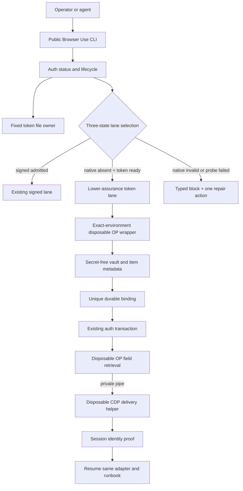

# Complete Browser Use environment-injected token auth

## Goal Capsule

Implement the lower-assurance 1Password service-account token lane already accepted by ADR 0030, then prove a migrated runbook can authenticate and finish through the public Browser Use CLI.

The first live graduation target is Oncore on the MacBook Pro. The same admission and runbook proof must then pass after an actual Mac Mini reboot and token cutover. Only then may the remaining migrated portal runbooks graduate.

This plan fills missing production plumbing. It does not reopen the decision to use a token, implement Apple signing, or replace the existing signed architecture.

---

## Product Contract

### Problem

The corpus migration can discover, import, activate, and diagnose runbooks, but production authentication cannot use the deployment lane Nathan selected. `createProductionBrowserUseRuntime()` still exposes only the signed native seam. When that capability is absent, auth stops at `native-capability-absent` even when the operator has deliberately provisioned a dedicated read-only 1Password service-account token.

ADR 0030 accepted the token lane on 2026-07-28. The implementation gap leaves every fresh password login blocked and prevents an end-to-end runbook proof.

### Requirements

- **R1: Fixed token custody.** Store one token at a fixed path under Browser Use's admitted configuration root. Above that root, require trusted ownership and no group/other write access. From the admitted root down, require owner-matched directories at mode `0700` and an owner-matched regular token file at mode `0600`, link count `1`, with no symlink or hard-link traversal. Validate opened descriptors and prove backup/sync exclusion before use.
- **R2: Explicit lifecycle.** A disposable custody executable, not TypeScript, reads a hidden TTY or explicit standard input, validates a staged token, and writes the fixed file. The TypeScript CLI exchanges only inherited descriptor numbers, fixed paths, exit status, and typed secret-free causes. Reject token values supplied through argv, ordinary environment flags, or config. Re-prove the staged pathname is the validated inode, sync the file, atomically rename through the parent directory descriptor, then sync the parent. Preserve the prior token when validation fails. Detect crash leftovers as a typed repair state. Remove only the exact owned file and distinguish local deletion from remote revocation.
- **R3: Exact execution environment.** A narrow versioned wrapper opens and validates the token file, constructs an allowlisted non-inherited environment, sets only `OP_SERVICE_ACCOUNT_TOKEN`, and immediately `exec`s an absolute supported `op` binary. No shell, PTY, daemon, or intermediate token-bearing child.
- **R4: Three-state lane selection.** An admitted signed product wins. `native-capability-absent` may select the environment-token lane. A present but invalid native product or failed admission probe blocks and never falls back.
- **R5: Secret-free status.** `browser-use auth status --json` reports the selected lane, lower-assurance label, token-file safety, supported `op` readiness, service-account validity, exactly-one-vault scope, dedicated-profile posture, binding readiness, and exactly one next action without reading a credential field.
- **R6: One-vault authority.** Admit only an active service account with exactly one visible dedicated Browser Automation vault and read-item authority. Zero or multiple visible vaults block with scope repair. Use immutable vault and item IDs for all later calls.
- **R7: Deterministic binding.** Resolve credential candidates from unique live metadata. Zero matches, ambiguity, moved or archived items, and binding drift block. The unsigned lane cannot mint selection authority from ambiguous evidence.
- **R8: Credential-clean browser profile.** Admit only a dedicated Agent Chrome profile with password saving, credential autofill, and sync disabled. Existing saved credentials, an unproven profile, or a credential-save prompt blocks. Repair creates a fresh profile only after explicit approval and never scrubs the old profile in place.
- **R9: Raw-secret boundary.** Only the disposable custody executable and official `op` process may see the service-account token. Only the disposable official `op` retrieval process and one disposable delivery helper may see a credential field value. TypeScript, Bun streams, the selected adapter, agents, argv, logs, artifacts, durable state, and unrelated child environments never receive token or credential bytes. The one disposable `op` process necessarily holds the token in its exact environment for the shortest bounded lifetime; this same-UID exposure is an accepted lower-assurance residual risk.
- **R10: Single-use delivery.** Bind each opaque handle to one vault, item, field, target, and expiry. Consume it atomically once. Origin drift, target drift, replay, expiry, helper interruption, or a possibly-written outcome blocks without automatic field retry.
- **R11: Resumable auth.** Detect an approved login redirect even when a runbook has no explicit confidential fill step, pause the same selected adapter, deliver through the confidential helper, prove session identity, and resume the same run. MFA, CAPTCHA, passkey, and other user-presence challenges produce a dispatchable continuation.
- **R12: Public CLI parity and human gates.** Human operators and agents share JSON-first status, runbook execution, continuation inspection, resume, and typed recovery surfaces. Token entry/replacement, MFA, CAPTCHA, passkeys, consent, recovery, profile creation approval, and remote revocation remain human-gated. A non-interactive call returns `human-action-required` and never waits for a TTY. Discovery metadata, rendered help, parser acceptance, runtime semantics, continuations, and repair guidance cannot drift.
- **R13: Rotation and theft semantics.** Support per-host provisioning, at most one hour of rotation overlap, new-host proof before old-token revocation, and explicit off-host theft instructions. Remote revocation is the emergency control; local deletion is cleanup.
- **R14: Deployment proof.** Use two explicit checkpoints. Corpus completion requires every source workflow to have a disposition and every admitted runbook to be imported inactive. Daily Driver Acceptance Proof requires each runbook, one at a time, to pass review, activate in a new generation, authenticate when required, execute through the public front door, and satisfy its end-to-end postcondition. Final acceptance requires every admitted runbook to remain active and proven. Graduate in order: hermetic leak proof, credential-clean Oncore login on the MacBook Pro, public Oncore runbook completion, Mac Mini provisioning and actual reboot, the same status/login/runbook proof, immediate old-token revocation, then every remaining MATest, Monash, FastTrack, Xero, and migrated route.
- **R15: Packaging integrity.** Build, package, install, discover, and run the new surfaces from a neutral working directory without relying on source-tree paths or ambient token state.
- **R16: Secret-free continuation contract.** Persist an opaque continuation ID, run ID, state, reason, required actor, safe-to-retry flag, checkpoint, expiry, resume action, and generation/target/profile bindings. Persist no token, credential, DOM snapshot containing credentials, or reusable delivery handle. Claim continuations atomically. Resume from a fresh process only after re-proving lane, generation, profile, target, origin, and account.
- **R17: Human-finalized mutations.** In the token-only deployment, Browser Use may populate and verify a real mutation such as a timesheet, but it must pause before the final externally consequential control. The continuation presents a secret-free exact mutation summary bound to the run, account, target, and values. The human performs the final click in the same Warm Chrome target. Browser Use then re-proves identity, verifies the external outcome, resumes, and completes the runbook. Terminal confirmation and unsigned automated submission never authorize the mutation.
- **R18: Human-supplied mutation inputs.** Real timesheet values come from explicit structured human input for the run: target week, daily hours or intervals, breaks, project or assignment codes, and notes required by that portal. Browser Use validates the complete input before navigation, preserves its digest in the run, and renders the exact prepared values for human comparison. It never invents payroll data from calendar, browser history, or another portal.
- **R19: Monash SMST workflow census and ownership handoff.** Add the Monash SMST repository as a read-only migration source. Inventory repeatable browser workflows encoded in skills, agents, playbooks, scripts, and runbook documents, regardless of filename. Reconcile overlaps with the existing catalog. Import one canonical runbook per service-and-user-intent pair. Preserve useful non-executable gotchas and reference material as supporting knowledge. Give every discovered candidate an explicit disposition; never silently skip one. After import, Browser Use is the sole canonical owner; Monash SMST artifacts remain historical provenance and are never a second runtime or editable runbook authority.

### Acceptance Examples

- **AE1:** Given a missing token file, `auth status --json` reports the lower-assurance lane unavailable and one install action without invoking `op`.
- **AE2:** Given a symlink, hard link, wrong owner, loose mode, or unsafe ancestor, status and every token-bearing operation block before `op` starts.
- **AE3:** Given a working installed token, a failed replacement leaves the original token installed and usable; no output contains either value.
- **AE4:** Given a token in argv or an ordinary environment option, install rejects it and writes no token file.
- **AE5:** Given an active token that sees exactly one vault, status reports ready without retrieving an item field. Zero or multiple vaults report one scope-repair action.
- **AE6:** Given an admitted signed product, the signed lane wins. Given native absence, the valid token lane may win. Given a present but invalid native product, auth blocks instead of falling back.
- **AE7:** Given a valid unique credential binding and proven login target, one opaque handle delivers one field once. Replay, target drift, helper crash, or unknown write outcome blocks without retry.
- **AE8:** Given a normal Oncore runbook that redirects to login, Browser Use pauses, completes authentication, proves the expected session identity, resumes the same run, and satisfies the runbook postcondition through the public CLI.
- **AE9:** Given MFA or another user-presence challenge, the run remains resumable and reports a dispatchable continuation rather than failing or switching adapters.
- **AE10:** Given first install, failed replacement, cancellation, signal, success, crash, timeout, or validation failure, a sentinel sweep finds no token or credential value in TypeScript-facing mocks, Bun streams, adapter payloads, process argv, unrelated child environments, stdout/stderr, logs, artifacts, state, core reports, or terminal capture. Only the one bounded disposable `op` process may hold the token environment.
- **AE11:** After an actual Mac Mini reboot, `auth status --json`, controlled Oncore login, and the Oncore runbook pass before the old host token is revoked.
- **AE12:** Every remaining active runbook finishes end to end through the public CLI. A user-presence challenge may pause and resume the same run, but completion requires the final postcondition. `unsupported`, blocked, login-wall, or classified-only evidence remains open work and never satisfies migration acceptance.
- **AE13:** A non-interactive agent encountering token entry or user presence receives `human-action-required`, can inspect the secret-free continuation, and can resume from a fresh CLI process after the human action. Two concurrent claimants produce one winner and a typed secret-free loser result.
- **AE14:** Given a real timesheet runbook, Browser Use authenticates, fills the intended week and hours, proves the account and prepared values, and pauses before Submit. The human clicks Submit in the same Warm Chrome target. Browser Use detects that action, re-proves identity, verifies portal acceptance and the submitted values, then satisfies the final postcondition. An agent, terminal prompt, or unsigned helper never clicks Submit.
- **AE15:** Given explicit human input for a timesheet, Browser Use rejects missing, overlapping, malformed, out-of-week, or portal-incompatible values before browser mutation. Given valid input, the prepared mutation summary exactly matches the human input. No inferred or cross-portal value appears.
- **AE16:** Given the current Monash SMST repository, the census identifies the 16 known browser-flow candidates: six FastTrack timesheet intents, seven Monash portal audits, npm publishing setup, Zoom transcript extraction, and Context7 Confluence library creation. The existing FastTrack overlap resolves to one canonical target. Every candidate lands as a canonical runbook, supporting knowledge, or an explicit rejected disposition with evidence.

### Scope

In scope:

- Production token-file custody and lifecycle.
- Exact-environment `op` execution.
- Three-state lane admission and status.
- Vault scope, credential bindings, and active-generation auth-route consumption.
- Credential-clean Warm Chrome admission.
- Disposable confidential field delivery.
- Login redirect interception, session proof, and same-run resume.
- Human-finalized mutation preparation, pause, outcome verification, and resume.
- Read-only discovery and import of every repeatable Monash SMST browser workflow.
- Hermetic, browser, packaging, MacBook, Mac Mini reboot, rotation, and portal-matrix proof.
- Operator documentation and acceptance-ledger updates after verified results.

Out of scope:

- Apple signing, App Sandbox availability work, private Keychain token custody, or signed helper deployment.
- Raw secrets in TypeScript or any browser adapter.
- Vault writes or automatic 1Password service-account creation.
- Automatic MFA, CAPTCHA, passkey, or recovery-flow bypass.
- System-wide Chrome policy or modification of the everyday Chrome profile.
- Automatic off-host theft response.
- Declaring all runbooks migrated before their public end-to-end proofs pass.

### Settled Decisions

- **KTD1: Implement ADR 0030 as written.** `session-settled: user-directed`. Use the environment-injected service-account token lane. Reject Apple signing availability work for this deployment.
- **KTD2: Preserve the two-process secret boundary.** `session-settled: user-approved`. Reuse the opaque-handle, auth-transaction, and confidential-delivery seams. Reject returning raw field values to TypeScript or an adapter.
- **KTD3: Treat the token file as custody, not configuration.** Use a fixed admitted path, descriptor-based validation, atomic replacement, and explicit lifecycle commands. Reject ambient environment, shell-profile, `.env`, and PTY custody.
- **KTD4: Keep lane selection fail-closed.** Signed admitted wins; only proven native absence permits token fallback; invalid native installation blocks. This exposes drift instead of hiding it.
- **KTD5: Keep 1Password as vault authority.** Require exactly one visible dedicated vault and deterministic live item evidence. Reject a second Browser Use vault allowlist or ambiguous cached choice.
- **KTD6: Make status a readiness projection.** Status may validate identity and metadata but never retrieve a credential field. It emits one repair action so agents and humans share the same next step.
- **KTD7: Separate custody, retrieval, and delivery owners.** The token lifecycle module owns the file; the exact-environment executor owns token-bearing `op`; the auth provider owns metadata and opaque handles; the disposable helper owns one field write.
- **KTD8: Graduate by controlled evidence.** Prove corpus import and activation separately from Daily Driver Acceptance Proof. Prove Oncore on the MacBook, then an actual Mac Mini reboot and cutover, then every other active runbook. Reject broad rollout based on unit tests, route classification, typed unsupported results, or login-wall navigation.
- **KTD9: Keep local removal and remote revocation distinct.** Theft response starts with remote revocation from another trusted device. Local removal never claims the credential is revoked.
- **KTD10: Defer retrieval until delivery.** Metadata calls may execute immediately and return allowlisted projections. Credential fetch mints only a deferred single-use capability. The delivery owner atomically consumes it, launches wrapper to `exec(op)`, connects `op` stdout directly to the field writer without a JavaScript/Bun readable stream, and returns a typed outcome.
- **KTD11: Give unsigned executables one runtime owner.** Create a separate unsigned runtime package, provisionally `runtime/browser-use-environment-auth/`, for custody, exact process construction, deferred capability consumption, and disposable delivery. Do not add a fourth target to the three-target signed `runtime/browser-use-security/` contract.
- **KTD12: Treat resumption as a re-admission.** Persist checkpoints before delivery and submission. After process death or unknown outcome, atomically claim the continuation and re-prove lane, generation, profile, adapter kind, browser target, origin, and account. Prove session state before deciding whether to continue post-auth; never repeat credential delivery automatically.
- **KTD13: Keep business mutation authority in the browser human action.** In this unsigned deployment, automation prepares and verifies the exact mutation but never activates the final consequential control. The human's direct click in the proven Warm Chrome target is the action, not a terminal approval signal. This preserves ADR 0020 without restoring Apple signing or inventing an unsigned authorization fallback.
- **KTD14: Keep payroll intent human-authored.** Browser Use may validate, transform, and enter explicit run inputs, but it does not infer hours or treat another portal as payroll authority. This keeps the first end-to-end proof focused on browser execution rather than adding reconciliation scope.
- **KTD15: Classify by executable intent, not artifact name.** A skill, agent, playbook, script, or runbook document may propose a Browser Runbook when it encodes a repeatable browser outcome. Backups, gotchas, memories, and reference prose provide evidence but do not become separate runbooks. This follows the existing Browser Runbook and Durable Browser Knowledge boundaries.
- **KTD16: Make migration one-way.** Browser Use owns every imported runbook, action, binding, generation, and future edit. Monash SMST contributes immutable source evidence for the migration receipt only. Reject continuous sync and cross-repository runtime loading because both create competing operational truth.
- **KTD17: Activate incrementally.** Inactive definitions cannot execute through the public CLI. Review and activate one new target in a generation, complete its auth and end-to-end proof, retain that proof, then expand the next generation. Reject bulk activation because it would make unproven runbooks authoritative at once.

---

## Planning Contract

### Current State

- Corpus migration and activation exist, including real Oncore and FastTrack runbook work.
- Warm Chrome can connect, but fresh service access reaches login walls.
- Production runtime creates the native capability seam and collapses absence into no token retrieval path.
- `auth enroll-browser-automation-token` is a readiness probe, not an installer.
- No `auth status`, install, replace, or remove surface exists.
- `browser-use-op.ts` already models non-inherited `op` commands and opaque handles.
- Existing auth transaction and confidential delivery abstractions already encode the raw-secret boundary, pause/resume behavior, replay protection, and leak tests.
- Production confidential delivery remains blocked because no real unsigned helper is wired.
- Normal runbooks that redirect to login do not necessarily enter auth unless they contain an explicit confidential fill step.
- Active-generation auth candidates and routes are not yet consumed by production auth.
- The Monash SMST repository contains 16 currently identified repeatable browser-flow candidates; one overlaps the existing FastTrack target.

### High-Level Technical Design

This diagram names responsibilities and ordering. It does not prescribe internal classes.

The token value crosses only the token file to the immediate `op` process environment. A credential field crosses only `op` stdout through a private pipe to the disposable delivery helper. All long-lived processes exchange metadata, opaque handles, proofs, and continuations.

### Dependency DAG

```mermaid
flowchart LR
    U1["U1 Token custody"] --> U2["U2 Exact OP executor"]
    U1 --> U3["U3 CLI contracts and lifecycle dispatch"]
    U2 --> U3
    U2 --> U4["U4 Runtime admission"]
    U3 --> U4
    U4 --> U5["U5 Vault bindings"]
    U4 --> U6["U6 Clean Chrome admission"]
    U4 --> U13["U13 Composed auth status"]
    U5 --> U13
    U6 --> U13
    U5 --> U7["U7 Confidential delivery"]
    U6 --> U7
    U7 --> U8["U8 Redirect, session proof, resume"]
    U8 --> U9["U9 Hermetic and packaged proof"]
    U13 --> U9
    U9 --> U10["U10 Oncore MacBook proof"]
    U10 --> U11["U11 Mac Mini reboot and cutover"]
    U11 --> U14["U14 Monash SMST census and import"]
    U14 --> U12["U12 Remaining portal matrix"]
```

### System-Wide Impact

- **CLI contract:** Add status and lifecycle commands through `command-contract.ts`, parser, help, driver, guide, and packaged executable. Use the `cli-author` contract path during implementation.
- **Filesystem:** Add one fixed secret file and explicitly modeled secret-free binding state under the admitted Browser Use root. Extend filesystem evidence with link count, directory-descriptor operations, opened-descriptor validation, durable rename, crash-leftover detection, and backup/sync exclusion.
- **Process model:** Add one unsigned runtime package containing a disposable custody executable, versioned exact-environment wrapper, and disposable delivery helper. Close unrelated descriptors, set close-on-exec correctly, disable core dumps, bound runtime/output, and scrub token variables from every other child.
- **Runtime selection:** Preserve signed-native precedence while adding an explicit lower-assurance branch and distinct typed failures.
- **1Password:** Use official CLI identity and vault metadata calls. Permissions remain immutable external authority; scope repair may require a new service account.
- **Browser:** Add a disposable CDP field writer, semantic field resolution, observation pause, target reproving, and credential-clean profile admission.
- **Runbook engine:** Intercept approved login redirects, persist continuations, resume the same adapter and run, and consume active-generation auth routes.
- **Durable state:** Store only secret-free IDs, fingerprints, lane evidence, status, and continuations. Define binding lifetime and invalidation keys explicitly. Never store token, field bytes, credential-bearing DOM, or reusable delivery handles.
- **Operations:** Provision each host separately. Rotation temporarily overlaps tokens, proves the new host, then revokes the old token. Theft procedures remain off-host and manual.
- **Packaging:** Include wrappers/helpers in distribution and prove absolute-path discovery from a neutral working directory.

### Risks and Mitigations

- **Bearer-token compromise:** Limit the service account to one read-only vault; isolate the token file; scrub child environments; document remote revocation as first response.
- **TOCTOU filesystem attack:** Open with no-follow semantics, validate the descriptor and ancestry, require link count `1`, and execute from the validated open state.
- **Replacement durability and crash residue:** Stage in the same owner-only directory, retain inode identity, re-prove it before directory-relative rename, sync file and parent, and expose kill-9 leftovers as a blocked cleanup action. Prove the installed token after reboot.
- **Ambient 1Password mode precedence:** Construct an exact environment and exclude `OP_CONNECT_HOST`, `OP_CONNECT_TOKEN`, desktop integration overrides, and inherited `OP_SERVICE_ACCOUNT_TOKEN`.
- **Native drift hidden by fallback:** Model native admission as admitted, absent, or present-invalid/probe-failed. Permit fallback only for absent.
- **Secret leakage through process plumbing:** Use private pipes, no shell, no token-bearing intermediate child, no credential-bearing JavaScript stream, strict descriptor inheritance, classified errors instead of verbatim `op` stderr, byte/time bounds, exact metadata schemas, bounded credential frames, sentinel values, disabled core dumps, and crash-path leak sweeps.
- **Wrong credential or target:** Require unique live metadata, semantic field uniqueness, approved origins, target reproving, and post-login session identity proof.
- **Unknown write or submit outcome:** Consume handles before delivery, block on interruption or possible write, and never automatically retry.
- **Mutation authorization confusion:** Distinguish login-form submission from externally consequential business mutation. For business mutations, emit a human-action continuation before the final control, quarantine automation from that control, and verify the outcome after the direct human action.
- **Sensitive browser residue:** Pause adapter observation and all screenshot, video, DOM, and network capture before retrieval. Resume only after fields are cleared or login-page departure and Session Identity Proof are established. Unknown outcomes keep capture paused and require fresh-tab or profile repair.
- **Dirty Chrome profile:** Fail admission and offer fresh-profile creation behind explicit approval. Preserve the old profile.
- **Package/source drift:** Test built and packed artifacts from neutral CWD. Resolve `op` from admitted absolute locations rather than hard-coding Intel Homebrew paths.
- **MacBook-to-Mini cutover failure:** Allow bounded overlap, prove after an actual reboot, retain the old token until proof, then revoke immediately.
- **Unproven read-only authority:** Treat CLI identity and vault visibility as separate evidence. Require a human/admin provisioning receipt for read-item-only authority; never use a destructive write probe or claim read-only from `op user get` alone.
- **Unsigned helper capability:** Record that the helper holds raw credentials and CDP access without App Sandbox. Admit only a versioned executable with trusted non-writable ancestry and constrain its protocol trace to one semantic field write with no cookie, storage, or network methods. A compromised approved origin reading its own field remains an accepted residual risk.
- **Scope explosion across portals:** Keep Oncore as the gating vertical slice. Classify other routes only after shared auth machinery graduates.

### Implementation Invariants

- No implementation unit may print, serialize, log, persist, or return token or credential bytes.
- No generic TypeScript filesystem or stdin port may accept token bytes.
- No public command accepts a token argument or ordinary token environment flag.
- No adapter receives a raw secret.
- No invalid native product falls back to the token lane.
- No field delivery occurs without unique binding, proven origin, proven target, clean profile, and a single-use handle.
- No automatic retry follows an outcome that may have written or submitted credentials.
- No agent, adapter, helper, or terminal confirmation activates the final control for an externally consequential business mutation in the token-only deployment.
- No runbook infers payroll values or silently copies them from another portal.
- No portal graduates before the public CLI proof passes.
- No generation activates more newly admitted targets than the next bounded proof batch.

---

## Implementation Units

### U1: Own the token file lifecycle in a disposable custody executable

**Goal:** Implement safe fixed-path custody, install, atomic replace, remove, and descriptor-based validation.

**Files:**

- Create the unsigned runtime package, provisionally `runtime/browser-use-environment-auth/`
- Create a disposable custody executable and secret-free TypeScript control model
- Create `skills/browser-use/src/browser-use-environment-token.ts`
- Modify `skills/browser-use/src/browser-use-paths.ts`
- Modify the platform filesystem contract used by Browser Use
- Create `skills/browser-use/src/browser-use-environment-token.test.ts`
- Modify `skills/browser-use/src/browser-use-platform-contract.test.ts`

**Approach:**

- Run the code-style pressure gate and keep secret input/file writes out of generic TypeScript ports.
- Define the fixed path under the admitted config root and a secret-free state model.
- Add trusted ancestry, owner, mode, regular-file, backup exclusion, no-follow, and link-count evidence.
- Stage replacements in the same owner-only directory, retain descriptor identity, re-prove the pathname, sync file, rename relative to the parent descriptor, then sync the parent.
- Make remove target only the exact admitted file and return the remote-revocation next action.

**Test scenarios:**

- First install through explicit stdin creates mode `0600` at the fixed path.
- Hidden interactive input follows the same lifecycle without echo.
- Replacement validation failure preserves the previous inode and working token.
- Symlink, hard link, wrong owner, loose mode, non-regular file, unsafe ancestor, and path swap all block before token use.
- Cancellation and write failure leave no usable staging file and never damage the old token.
- Kill-9 residue becomes a typed blocked cleanup state; a reboot after successful replace retains the validated token.
- Sentinel input never appears in TypeScript-facing mocks, argv/env, output, core reports, or terminal capture.
- Remove deletes only the exact admitted file and reports that remote authority remains live.

**Verification:** Adversarial filesystem tests prove AE1-AE4 and R1-R2 without invoking real 1Password.

### U2: Add the exact-environment OP executor and deferred capability topology

**Goal:** Make one narrow executable boundary the sole consumer of token bytes.

**Files:**

- Create `skills/browser-use/src/browser-use-environment-op-executor.ts`
- Add the versioned wrapper to `runtime/browser-use-environment-auth/`
- Modify `skills/browser-use/src/browser-use-op.ts`
- Create `skills/browser-use/src/browser-use-environment-op-executor.test.ts`
- Modify `skills/browser-use/src/browser-use-op.test.ts`
- Modify `skills/browser-use/src/build-dist.ts`
- Modify `skills/browser-use/package.json`

**Approach:**

- Open and validate the token descriptor, construct an allowlisted environment, close unrelated descriptors, disable core dumps, and immediately `exec` an admitted absolute `op` binary.
- Exclude Connect variables and every inherited token value.
- Project bounded metadata through exact allowlist schemas before it reaches logs or state.
- Let field fetch mint a deferred field/item/target-bound capability without running `op`.
- Let the delivery owner consume that capability and pipe bounded framed output directly from `op` to the helper with no JavaScript/Bun readable stream.
- Preserve the existing `inherit: false` and opaque-handle contracts instead of weakening them.

**Test scenarios:**

- A fake `op` observes only the allowlisted environment and one token variable.
- Adapter, browser, helper, setup, diagnostic, and status children never inherit the token.
- Connect variables, ambient token values, shell state, and PTY state cannot override the installed token.
- Missing, replaced, unsupported, or non-executable `op` blocks with one repair action.
- Wrapper crash, signal, timeout, and malformed output expose no token through stdout, stderr, argv, or artifacts.
- Huge output, malformed UTF-8/JSON, secret-bearing stderr, extra frames, embedded NUL/newlines, empty/oversize values, partial output, and signal are classified without verbatim relay.
- Process-topology assertions prove exact PIDs, argv, environments, descriptor endpoints, and absence of shell/intermediate processes.

**Verification:** Process-boundary tests prove R3 and the token half of R9-R10.

### U3: Add public auth contracts and lifecycle dispatch

**Goal:** Give humans and agents discoverable JSON-first lifecycle, continuation, inspection, and resume contracts without pretending human-only actions are autonomous.

**Files:**

- Modify `skills/browser-use/src/command-contract.ts`
- Modify `skills/browser-use/src/browser-use-parser.ts`
- Modify `skills/browser-use/src/browser-use.ts`
- Modify `skills/browser-use/src/browser-use-guide.ts`
- Modify `skills/browser-use/src/browser-use-auth-commands.test.ts`
- Modify `skills/browser-use/src/browser-use-parser.test.ts`
- Modify `skills/browser-use/src/browser-use-front-door.test.ts`
- Modify `skills/browser-use/src/browser-use.test.ts`

**Approach:**

- Use `cli-author` so command metadata, help, parser, and runtime semantics share one owner.
- Add `auth install-token`, `auth remove-token`, continuation inspection, and resume contracts; repeated install performs validated atomic replacement.
- Accept token input only from hidden TTY or explicit stdin.
- Non-interactive install returns `human-action-required`; it never waits for a prompt.
- Define the R16 continuation schema, actor classification, atomic claim results, stable exits, and discovery metadata.
- Keep the old enrollment command only if compatibility needs a clear deprecation route; otherwise replace it at the contract owner.

**Test scenarios:**

- Help and discovery expose the same accepted forms the parser runs.
- Token argv, token flags, and ordinary token environment options are rejected before runtime.
- Lifecycle and continuation commands never print sensitive data.
- Human and agent invocations receive equivalent status/run/inspect/resume actions; human-gated actions are explicit.

**Verification:** Discovery metadata, rendered help, parser acceptance, non-interactive behavior, actor gates, and stable process exits cannot drift; proves R12 and R16.

### U4: Implement three-state production lane admission

**Goal:** Select the accepted lower-assurance lane only when native capability is truly absent.

**Files:**

- Modify `skills/browser-use/src/browser-use-runtime.ts`
- Modify `skills/browser-use/src/browser-use-auth-provider.ts`
- Modify `skills/browser-use/src/browser-use-auth-bindings.ts`
- Modify `skills/browser-use/src/browser-use-runtime-security-wiring.test.ts`
- Modify `skills/browser-use/src/browser-use-auth-provider.test.ts`

**Approach:**

- Stop collapsing native absence, non-admission, and probe failure into `undefined`.
- Introduce a discriminated command-scoped admission snapshot: signed admitted plus port, environment admitted plus lower-assurance evidence and port, or blocked plus typed cause.
- Let signed admitted capability retain precedence without changing its contract.
- Capture native and environment evidence once per command and feed the same snapshot to status and runbook execution.

**Test scenarios:**

- Truth table covers signed admitted, native absent plus token ready, native absent plus token invalid, native present but non-admitted, and native probe failure.
- Native invalid and probe failure never attempt token fallback.
- Lower-assurance status never reports signed-native guarantees.
- Installing an admitted native capability switches selection back without deleting the token option.

**Verification:** Runtime wiring proves AE5-AE6, R4-R6, and KTD1-KTD4.

### U5: Resolve vault authority and durable credential bindings

**Goal:** Turn migrated auth candidates into unique secret-free bindings backed by live 1Password evidence.

**Files:**

- Modify `skills/browser-use/src/browser-use-auth-bindings.ts`
- Modify `skills/browser-use/src/browser-use-auth-provider.ts`
- Modify the active-generation auth-route loader and schemas
- Add or modify the secret-free binding store under Browser Use state ownership
- Modify `skills/browser-use/src/browser-use-auth-bindings.test.ts`
- Modify corpus-generation projection tests

**Approach:**

- Validate the active service-account identity with `op user get --me`.
- Require exactly one vault from `op vault list --format=json`.
- Resolve candidates using IDs and always pass `--vault`.
- Add an auth-generation seam beside existing generation seams and read only digest-bound records from the captured generation.
- Keep matching and vault-scope policy in the existing provider. Keep bindings pure.
- Before adding host-cached state, decide and document command-, run-, or host-lifetime plus invalidation by generation ID, candidate digest, vault ID, item ID, and revision.
- Block zero match, ambiguity, archive, deletion, scope change, and binding drift.

**Test scenarios:**

- One active service account plus one vault and one candidate creates a usable binding without reading a field.
- Zero or multiple vaults block and cannot be overridden by cached state.
- Zero or multiple candidates block and cannot mint selection authority.
- Archived, moved, revoked, or edited items invalidate bindings with one repair action.
- Active-generation change invalidates stale route evidence safely.

**Verification:** Metadata-only fake-OP and generation tests prove R6-R7 and AE5.

### U6: Admit a credential-clean Warm Chrome profile

**Goal:** Prove the dedicated browser profile cannot save, sync, or autofill credentials before confidential delivery.

**Files:**

- Modify `runtime/warm-chrome/src/runtime.ts`
- Modify `runtime/warm-chrome/src/launch.ts`
- Modify `runtime/warm-chrome/src/proof.ts`
- Modify `runtime/warm-chrome/src/repair.ts`
- Modify `runtime/warm-chrome/src/command-contract.ts`
- Add or modify Warm Chrome launch, proof, repair, and CLI tests
- Integrate the proof into Browser Use auth status

**Approach:**

- Keep Warm Chrome as the sole owner of profile inspection and repair. Export one redacted read-only posture proof for Browser Use status.
- Inspect without exposing unrelated profile data.
- Fail closed when existing credentials, save prompts, or unproven controls exist.
- Offer creation through an explicit Warm Chrome command only after human approval.

**Test scenarios:**

- Fresh dedicated profile passes with all required controls.
- Missing or altered controls, saved credentials, sync evidence, and credential prompts block.
- Repair leaves the old profile untouched until separate approved removal.
- Status reports the profile failure and one creation action without mutating it.

**Verification:** Profile fixtures plus real warm-Chrome inspection prove R8 and the profile portion of R5.

### U13: Compose secret-free auth status

**Goal:** Report one command-scoped admission result after token, lane, vault, binding, and profile owners exist.

**Files:**

- Modify `skills/browser-use/src/browser-use.ts`
- Modify `skills/browser-use/src/browser-use-auth-provider.ts`
- Modify `skills/browser-use/src/browser-use-auth-commands.test.ts`
- Modify `skills/browser-use/src/browser-use-front-door.test.ts`
- Modify packaged runtime tests

**Approach:**

- Compose the command-scoped lane snapshot from U4 with the metadata evidence from U5 and redacted Warm Chrome proof from U6.
- Validate service-account identity/activity and vault visibility separately from human/admin read-only authority evidence.
- Project only allowlisted bounded fields and exactly one repair action.
- Never retrieve a credential field or relay raw `op` output.

**Test scenarios:**

- Missing/unsafe token, invalid service account, zero/multiple vaults, absent admin authority receipt, dirty profile, missing wrapper/helper, stale binding, invalid native product, and ready state are distinct.
- Hostile metadata containing extra names, email, URLs, notes, secret-shaped fields, huge JSON, or invalid encoding is rejected rather than partially cleaned.
- Status and runbook execution consume the same captured lane evidence.

**Verification:** Proves R5-R8 and AE1, AE5, AE6 without credential retrieval.

### U7: Implement disposable confidential field delivery

**Goal:** Deliver one credential field through a private pipe without exposing it to TypeScript or the adapter.

**Files:**

- Modify `skills/browser-use/src/browser-use-confidential-field-delivery.ts`
- Modify `skills/browser-use/src/browser-use-auth-transaction.ts`
- Modify `skills/browser-use/src/browser-use-agent-browser.ts`
- Create the disposable unsigned delivery helper under the Browser Use runtime/package owner
- Modify `skills/browser-use/src/browser-use-confidential-delivery-seam.test.ts`
- Modify `skills/browser-use/src/browser-use-confidential-field-delivery-leak.test.ts`
- Modify `skills/browser-use/src/browser-use-confidential-delivery-interruption.test.ts`
- Modify `skills/browser-use/src/fixtures/confidential-runbook-delivery-fixture.ts`

**Approach:**

- Extend delivery requests with a semantic field locator rather than raw selectors chosen by an adapter.
- Pause adapter observation and every browser capture surface, invalidate stale references, re-prove target and origin, atomically consume the deferred capability, and pipe `op` output to one disposable CDP writer.
- Resolve exactly one field, write once, clear buffers, close the channel, then resume only after cleanup.
- Keep signed delivery available as a separate future lane.

**Test scenarios:**

- Username and password each reach exactly one intended field while TypeScript and adapter sentinels remain absent.
- Multiple matching fields, missing field, origin drift, target drift, stale reference, expired handle, and replay block before write.
- Crash before write, possible write, and after write each produce distinct fail-closed outcomes with no automatic retry.
- Success, cancellation, timeout, and signal paths leave no secret in output, logs, state, artifacts, terminal capture, or unrelated child environments.
- Protocol traces contain one allowed semantic field write and no cookie, storage, or network methods.
- Failed auth, helper crash, navigation race, and retained-field scenarios keep observation/capture quarantined until cleanup or fresh-tab repair.

**Verification:** Hermetic real-process leak and interruption harness proves R9-R10 and AE7-AE10.

### U8: Intercept login redirects and resume the same runbook

**Goal:** Make ordinary migrated runbooks authenticate when navigation reaches an approved login wall.

**Files:**

- Modify `skills/browser-use/src/browser-use-runbook.ts`
- Modify `skills/browser-use/src/browser-use-runbook-command.ts`
- Modify `skills/browser-use/src/browser-use-auth.ts`
- Modify `skills/browser-use/src/browser-use-agent-browser.ts`
- Modify `skills/browser-use/src/browser-use-runbook.test.ts`
- Add browser fixtures for redirect, user presence, identity proof, and resume

**Approach:**

- Detect approved service and IdP aliases from active-generation auth routes.
- Check authenticated session first; on approved redirect, enter the existing auth transaction even when the runbook has no confidential fill step.
- Preserve the same run ID, adapter kind, target binding, and continuation through user presence. Across process death, revalidate a new adapter process against the same browser target and session.
- Persist checkpoints before delivery and submit. Submit once, prove the expected session identity, invalidate stale references, and resume from a safe checkpoint.
- Expose inspect/resume through the public CLI, atomically claim continuations, and invalidate stale generation/target/profile evidence.
- Keep authentication-form submission distinct from business mutation. R17 governs the latter.

**Test scenarios:**

- Logged-in session skips credential delivery and runs normally.
- Logged-out Oncore-style redirect authenticates and resumes the original postcondition.
- Unapproved origin, unexpected account, identity mismatch, and unknown submit outcome block.
- MFA, CAPTCHA, and passkey persist a same-run user-presence continuation.
- Resume cannot switch adapter, target, account, or generation silently.
- Restart recovery works from a fresh CLI process. Concurrent claimants receive one winner and typed `already-claimed`, `in-progress`, or terminal results.
- Unknown write/submit first proves session state; it may continue post-auth only when identity is proven and never repeats delivery.

**Verification:** Real-Chrome fixture proves R11 and AE8-AE9 before any live portal.

### U9: Prove hermetic, CLI, packaging, and neutral-CWD behavior

**Goal:** Demonstrate the complete lower-assurance path through the installed public interface without live credentials.

**Files:**

- Modify `skills/browser-use/TEST_MATRIX.md`
- Modify `skills/browser-use/src/browser-use-front-door.test.ts`
- Modify clean-home and packaged-install integration tests
- Modify setup bin-topology tests if packaging changes require it

**Approach:**

- Compose fake 1Password, sentinel credentials, real wrapper, real delivery helper, real Chrome fixture, built distribution, and installed CLI.
- Exercise every failure boundary and leak sweep through public commands.
- Run from a neutral working directory and clean home with no ambient token.

**Test scenarios:**

- Fresh install can discover help, install via stdin, report ready, authenticate fixture, finish runbook, remove locally, and report remote-revoke next action.
- Built and packed artifacts contain every wrapper/helper at resolved absolute paths.
- Crash, cancellation, timeout, replay, invalid native product, dirty profile, vault ambiguity, binding ambiguity, and login origin drift remain typed and secret-free.
- A shared lane-conformance suite runs the same retrieval/delivery contract against signed fakes and the environment implementation.

**Verification:** AE1-AE10 and R12-R15 pass without network or live credential dependence.

### U10: Graduate Oncore on the MacBook Pro

**Goal:** Prove one real migrated runbook end to end on the first host.

**Files:**

- Update `skills/browser-use/docs/plans/2026-07-27-daily-driver-acceptance-ledger.md` only with captured evidence
- Update the Oncore runbook/auth-route artifacts only when live evidence exposes a deterministic defect

**Approach:**

- Provision through the public install command without exposing the token.
- Run `auth status --json`.
- Use a credential-clean warm profile and controlled logged-out Oncore session.
- Prove login, expected identity, same-run resume, and the public Oncore snapshot/diagnosis postcondition.

**Test scenarios:**

- Status is ready and explicitly lower assurance.
- Controlled password login succeeds with no password-save prompt or leak evidence.
- Public `runbook run` completes the migrated Oncore workflow, not merely navigation.
- Any user-presence requirement is recorded as a resumable typed result rather than misreported as success.

**Verification:** R14 and AE8 pass on the MacBook before Mac Mini work starts.

### U11: Prove Mac Mini reboot, cutover, and revocation

**Goal:** Establish automatic post-reboot readiness on the target host and retire the old token safely.

**Files:**

- Update Browser Use operational docs and the acceptance ledger with evidence
- Update the dotfiles-owned off-host theft and post-reboot runbook through its owning repository/workflow

**Approach:**

- Provision a separate replacement token on the Mac Mini.
- Keep overlap under one hour.
- Perform an actual reboot.
- Run status, controlled Oncore login, and the Oncore public runbook after reboot.
- Emit a human-only remote-revocation checkpoint. After independent admin confirmation, remove the MacBook copy, then re-prove the Mini.
- Rehearse non-destructive off-host theft checks without storing administrative credentials.

**Test scenarios:**

- Missing post-reboot machinery blocks before cutover.
- Successful reboot proof survives a clean process environment and neutral CWD.
- Failed Mini proof preserves the old host's working authority.
- Failed Mini proof revokes/removes the new token and preserves old authority.
- The overlap deadline is secret-free durable state; expiry blocks further proof for explicit operator resolution.
- Successful proof requires admin-side old-token revocation evidence before local cleanup.
- Theft rehearsal names remote revocation as the first control.

**Verification:** AE11, R13-R15, and ADR 0030's deployment contract pass before broader rollout.

### U12: Graduate every remaining active runbook

**Goal:** Prove every active runbook through the same public runbook front door, including authentication and its final postcondition.

**Files:**

- Modify portal-specific runbook or auth-route source only when evidence identifies a deterministic defect
- Update corpus generation and activation receipts from source owners
- Update the acceptance ledger with one result per route

**Approach:**

- Run MATest, Monash, FastTrack, Xero, and every other active runbook in bounded batches.
- Reuse shared auth machinery; keep portal-specific code to origin aliases, semantic identity proof, and genuine user-presence classification.
- Require a completed runbook postcondition for `working`.
- Keep `unsupported`, blocked, and classified-only results in the open-work queue until the runbook graduates.
- For mutating runbooks, prepare and prove the exact real values, pause before the final consequential control, let the human act in the same Warm Chrome target, then verify the accepted outcome before completion.
- Accept real mutation values only through the explicit structured input contract from R18 and preserve a digest for pre-submit and post-submit comparison.
- Activate the next reviewed target in a new generation only after the prior target's end-to-end proof is retained.

**Test scenarios:**

- Each runbook reaches its final postcondition; user presence may pause but must resume to completion.
- A generation with the next target active passes before another previously inactive target is promoted.
- A real timesheet run authenticates, prepares the intended week/hours, pauses before Submit, accepts only the human's direct click, and verifies the submitted result.
- Missing, overlapping, malformed, out-of-week, or portal-incompatible human inputs fail before browser mutation; valid prepared values exactly match the input digest.
- Shared IdP aliases resolve to the intended account and service.
- Account mismatch, unexpected redirect, unsupported challenge, and changed form semantics block without credential retry.
- Batch execution does not leak credentials or contaminate another portal's profile/session evidence.

**Verification:** AE12 passes for the complete active-generation matrix. Corpus import/activation may close earlier, but Daily Driver Acceptance Proof becomes true only when the ledger contains end-to-end public-CLI evidence for every active runbook.

### U14: Census and import Monash SMST browser workflows

**Goal:** Convert every repeatable Monash SMST browser workflow into one explicit migration disposition and add each valid non-duplicate flow to the inactive runbook catalog.

**Files:**

- Modify the Browser Use corpus importer, census, composition, and projection owners
- Add a redacted Monash SMST corpus receipt and fixture covering discovered workflow sources
- Add migration tests for skill, agent, playbook, script, and runbook-document discovery
- Treat `/Users/nathanvale/code/monash-smst` as read-only source evidence during the local migration run

**Approach:**

- Snapshot and hash the source closure before classification.
- Start from the 16 known candidates in AE16 and surface any census drift.
- Group candidates by Browser Domain Key and Browser Flow Slug.
- Reconcile the existing FastTrack target instead of duplicating it.
- Convert executable procedure into secret-free inactive runbook definitions and reviewed action candidates.
- Preserve gotchas, selector evidence, and operational notes as supporting Durable Browser Knowledge.
- Record one explicit disposition for every discovered source artifact and candidate.
- Bind each imported target to its Monash source hashes and migration receipt, then make Browser Use the only future edit and execution owner.

**Test scenarios:**

- All six FastTrack intents are represented without turning `add-breaks` or helper scripts into duplicate user-flow runbooks.
- The seven portal-audit targets retain separate domain identity while sharing one audit behavior pattern.
- npm publishing, Zoom transcript extraction, and Context7 Confluence library creation retain their user-visible outcome and human-presence gates.
- Existing FastTrack definitions merge deterministically with no duplicate active target.
- Changing a Monash source after the captured receipt reports provenance drift but never mutates or overrides the Browser Use runbook.
- General Ellucian handover docs and browser gotchas remain supporting knowledge.
- Secret-positive or ambiguous source material blocks that candidate with evidence and never disappears from the ledger.

**Verification:** AE16 passes with a stable source receipt, complete disposition ledger, no duplicate canonical target, no raw secret, one inactive runbook definition per admitted service-and-intent pair, and no runtime dependency on the Monash SMST checkout.

---

## Verification Contract

### Per-unit automated checks

- Run Browser Use tests through `skills/test-runner/src/test-runner.sh run --quiet -- skills/browser-use/src/`.
- Run TypeScript checking for `skills/browser-use`.
- Run Biome lint and format checks for changed TypeScript, JSON, and Markdown where supported.
- Run `bun run build` and `bun run pack:dry-run` from `skills/browser-use`.
- Run Warm Chrome tests when U6 changes that package.
- Run setup bin-topology and clean-home tests when packaging or installed paths change.

### Security proof

- Use sentinel token, username, password, and OTP values.
- Sweep process argv, inherited environments, stdout, stderr, logs, artifacts, durable state, terminal capture, adapter payloads, browser events, and crash output.
- Exercise success, rejection, cancellation, timeout, signal, helper interruption, path swap, replay, target drift, and unknown-write paths.
- Inspect exact process topology, descriptor inheritance, core-report policy, hostile `op` output, metadata projection, credential framing, browser capture quarantine, and CDP protocol trace.
- Prove metadata-only status never invokes a credential-field read.

### Public-interface proof

- Render and inspect top-level and auth help.
- Prove discovery metadata and parser acceptance match.
- Run built and packed CLI from a neutral CWD and clean home.
- Prove JSON output contains lane evidence, typed cause, and exactly one next action.
- Prove agents can perform every ordinary operator action without inspecting secret files or internal state.
- Prove non-interactive human gates return `human-action-required`, continuation inspect/resume works from a fresh process, and two agents racing one continuation produce one claimant.
- Maintain an action-parity matrix for status, run, inspect, resume, install/replace, local removal, profile repair, user presence, and remote revocation.
- Prove automation cannot activate a business mutation's final control, while a human click in the bound Warm Chrome target can be detected, identity-reproved, outcome-verified, and resumed.

### Live graduation gates

1. MacBook Pro `auth status --json`.
2. Credential-clean controlled Oncore login.
3. Public Oncore runbook completion with session identity and postcondition evidence.
4. Separate Mac Mini provisioning.
5. Actual Mac Mini reboot.
6. Mac Mini status, Oncore login, and Oncore runbook proof.
7. Human/admin old-token remote-revocation receipt, then MacBook local removal.
8. Mac Mini re-proof after revocation.
9. Monash SMST census and import with complete dispositions.
10. Every remaining active runbook, one route at a time, until each final postcondition passes.

No live proof may print or capture a credential. Screenshots and governed artifacts must show only secret-free state and postconditions.

---

## Definition of Done

- ADR 0030's token lane is reachable in production when native capability is absent.
- Signed admitted capability retains precedence; invalid native capability never falls back.
- Token install, atomic replace, remove, and secret-free status work through the public CLI.
- Token bytes never enter TypeScript during install, replacement, validation, retrieval, or removal.
- Token custody and every child environment satisfy the fixed-file and exact-environment contracts.
- Exactly one dedicated read-only vault and deterministic live bindings gate all retrieval.
- A credential-clean warm profile gates confidential delivery.
- Raw token and credential values remain outside TypeScript, adapters, agents, argv, logs, artifacts, and durable state across success and every tested failure.
- Login redirects can pause, authenticate, prove identity, and resume the same runbook and adapter.
- Secret-free continuations survive process restart, enforce human gates, and cannot be claimed concurrently.
- Every externally consequential business mutation is human-finalized in the browser and mechanically verified afterward.
- Every real timesheet uses explicit human-supplied values; no payroll value is inferred or copied from another portal.
- Hermetic fixture, full Browser Use suite, type, lint, build, package, clean-home, and neutral-CWD checks pass.
- A real Oncore migrated runbook finishes on the MacBook Pro through the public CLI.
- The same proof passes after an actual Mac Mini reboot and bounded token cutover.
- The old token is remotely revoked and the old local copy removed after cutover.
- Every source workflow has an explicit disposition and every admitted runbook is imported.
- Every repeatable Monash SMST browser workflow has an explicit disposition, and every admitted non-duplicate workflow is imported and activated.
- Every active runbook authenticates when required and satisfies its end-to-end postcondition through the public CLI.
- Every admitted runbook is active only after its own retained proof; no bulk unproven activation remains.
- No `unsupported`, blocked, user-presence-pending, classified-only, or login-wall result counts as Daily Driver Acceptance Proof.
- Acceptance ledger and operational runbooks record only verified evidence.
- Apple signing availability work remains out of scope.

---

## Sources and Research

### Internal

- `docs/adr/0030-environment-injected-op-lane-is-lower-assurance.md`
- `docs/adr/0019-one-password-token-scope-is-browser-automation-vault-authority.md`
- `docs/adr/0021-only-disposable-retrieval-and-delivery-helpers-may-see-browser-secrets.md`
- `skills/browser-use/src/browser-use-runtime.ts`
- `skills/browser-use/src/browser-use-op.ts`
- `skills/browser-use/src/browser-use-auth-provider.ts`
- `skills/browser-use/src/browser-use-auth-transaction.ts`
- `skills/browser-use/src/browser-use-confidential-field-delivery.ts`
- `skills/browser-use/src/browser-use-runbook.ts`
- `skills/browser-use/src/browser-use-paths.ts`
- `runtime/warm-chrome/`
- `skills/browser-use/docs/plans/2026-07-27-daily-driver-acceptance-ledger.md`

### Official 1Password guidance

- [Use service accounts with the 1Password CLI](https://www.1password.dev/service-accounts/use-with-1password-cli)
- [Get started with service accounts](https://www.1password.dev/service-accounts/get-started)
- [Manage service accounts](https://www.1password.dev/service-accounts/manage-service-accounts)
- [Service account security](https://www.1password.dev/service-accounts/security)

The official guidance grounds service-account identity validation, token usage through `OP_SERVICE_ACCOUNT_TOKEN`, immutable post-creation permissions, token rotation, revocation, and minimum supported CLI behavior. Repo ADRs impose the stricter one-vault, fixed-file, exact-environment, and raw-secret boundaries used here.
