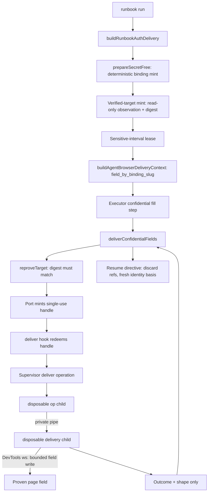

# Browser Use lane-neutral confidential delivery wiring - Plan

## Goal Capsule

- **Objective:** replace the `buildRunbookAuthDelivery` stub so a FastTrack runbook run resolves its credential from the 1Password vault over the Environment-Injected OP Lane and delivers it into the login field through the existing pure choreography — one delivery implementation, no adapter in the write path, no secret bytes in the main TypeScript process or any adapter argv/output.
- **Immediate value:** the daily-driver timesheet run becomes true end-to-end: an agent that hits a missing token follows typed continuations to install it, the run mints the binding deterministically from the vault, and logs in; the daily driver then runs `fill-week` as its next flow (flow chaining is the driver's own orchestration, not a unit of this plan).
- **Authority hierarchy:** ADRs 0021/0022/0027/0028/0030 govern custody; the cross-adapter auth plan (`origin:`) governs transaction semantics; this plan wires the deferred live tail only.
- **Stop conditions:** any raw secret in the main TypeScript process, an adapter/plugin/daemon, argv, inherited environment (beyond the single wrapper→`exec(op)` process), stdout/stderr, model context, or durable file; any second raw-secret process beyond the disposable `op` child and the disposable delivery child; any delivery without fresh target reproof; any automatic retry after a possible write; any selection authority minted in the unsigned lane.
- **Tail:** hermetic end-to-end green, per-lane sentinel-leak proofs, agent-followable token setup, and a documented operator-gated live login proof. Live mutation of the real portal is never autonomous in this plan.

---

## Product Contract

### Summary

Wire the runbook lane's confidential-delivery seam live on the Environment-Injected OP Lane: mint the Item Binding deterministically from the vault, prove and re-prove the exact login target, lease the sensitive interval, and perform each bounded field write inside a disposable delivery child that talks straight to the browser's debug channel — so the same delivery path serves whichever adapter drives the task. Add the ADR 0030 token setup commands so an unenrolled machine is a typed, agent-repairable state, not a dead end.

### Problem Frame

The pure choreography (`deliverConfidentialFields`), the agent-browser executor's confidential-fill routing, deterministic binding match, and both leak harnesses already exist and are green. But the seam that connects them to a live run is a stub returning `ok: false`, and research confirmed four structural gaps behind it: the env-lane port cannot mint a secret handle (its spec matcher admits only metadata operations and the supervisor has no delivery mode), the ADR 0030 disposable delivery process is unbuilt, no CDP client exists anywhere in the repo, and no production code mints a `BrowserUseVerifiedTarget` or its proof digest. Separately, ADR 0030's `install-token` / `remove-token` / `auth status` commands are named but unbuilt, so token setup is not yet agent-followable. Until these land, every confidential runbook fails closed at the login wall.

### Requirements

**Delivery seam**

- R1. `buildRunbookAuthDelivery` composes the live sensitive-interval context: deterministic binding resolution, verified-target proof, sensitive-interval lease, and `provider.buildAgentBrowserDeliveryContext(...)` — with every failure a typed refusal naming its repair continuation, never a crash or bypass.
- R2. The seam is lane-neutral: `BrowserUseVerifiedTarget` mint, `reproveTarget`, and the `deliver` hook are implemented once with no adapter in the write path; secret bytes never appear in any adapter argv/output/environment or in main TypeScript process memory (ADR 0021, ADR 0030).
- R3. The bounded field write executes inside a new disposable delivery child that receives the value over a private pipe from the disposable `op` child and writes it through the browser's DevTools channel to the proven field, then exits — the ADR 0030 two-disposable-process boundary, extended with the browser write.
- R4. Verified-target mint and reproof are secret-free read-only observations producing exact top-level and frame origins, target/page/frame identity, and a canonical proof digest; reproof re-observes and must reproduce the digest or delivery refuses before any handle is minted.
- R5. Secret handles are single-use, field/item/target-bound, expiring, and atomically consumed; an interrupted or possibly-landed write blocks the field with an honest `external_effect_possible`, and the run never retries it automatically.

**Token custody and self-setup**

- R6. The env-lane retrieval port gains secret-handle capability: a supervisor delivery operation plus the TypeScript spec mapping, so `fetchCredentialField` stops being structurally unreachable.
- R7. `auth install-token`, `auth remove-token`, and secret-free `auth status --json` implement the ADR 0030 contract: hidden-prompt or stdin install with validation-without-disclosure and atomic `0600` file creation under the admitted custody root; removal targets only that exact file; status reports lane selection, token-file safety, `op`/token validity, exactly-one-vault scope, and profile policy with one repair action.
- R8. A confidential runbook run on an unenrolled machine returns a typed refusal whose continuation chain reaches the token setup commands, so an agent can enroll and re-run without human interpretation.

**Binding and runbook**

- R9. The FastTrack binding is minted at run time through the existing deterministic single-match path (`prepareSecretFree` → `matchItemBinding`); zero matches and ambiguity block typed; the unsigned lane mints no selection authority (ADR 0030).
- R10. The delivery context maps credential fields by runbook binding slug, not snapshot ref; the executor resolves the mapping at fill time. Plans whose pending bindings resolve to more than one distinct Item Binding refuse typed (single-binding v1).
- R11. A FastTrack login flow runbook exists with confidential fill steps naming the binding slug and allowed origins — no secret, endpoint, or vault UUID in the file.

**Verification**

- R12. Sentinel-leak proof per lane: the agent-browser seam harness extends to the live-shaped wiring, playwright-cdp and chrome-devtools-mcp gain hook-level conformance tests (no sentinel in that lane's argv/output, no native fill dispatched), and a planted-regression test proves the harness catches a leaking delivery child.
- R13. Live login against the real portal is an operator-gated proof step (`auth status` then one controlled run), never part of autonomous verification.

### Acceptance Examples

- AE1. **R7-R8.** Given no token file, `runbook run` on a confidential flow refuses with a continuation chain that reaches `auth install-token`; after a stdin install and a clean `auth status --json`, the same command proceeds past binding resolution.
- AE2. **R9.** Given a vault with exactly one active FastTrack Login item, the run mints the binding with zero prompts; given two candidates, it blocks with a redacted ranked list and mints nothing.
- AE3. **R4.** Given a target whose observed digest changes between proof and delivery, the run refuses before a secret handle is minted.
- AE4. **R3, R5.** Given a delivery-child crash mid-write, the field blocks with `external_effect_possible: true` and honest `field_cleared` truth, and no retry occurs.
- AE5. **R2, R12.** Given sentinel credential values, every lane's recorded argv/output, the shared run's on-disk bytes, and the main-process outputs sweep clean; only the `op` child and the delivery child ever observe the sentinel.

### Scope Boundaries

**Deferred to Follow-Up Work**

- Runbook execution on the playwright-cdp and chrome-devtools-mcp lanes (they have no fill vocabulary; the seam is proven lane-neutral here, but only agent-browser executes runbooks).
- Multi-binding delivery contexts (one distinct Item Binding per run in v1).
- OTP delivery for FastTrack (binding methods start password-only; the choreography already supports `otp-current` when needed).
- Signed-lane re-integration (ADR 0028 U3b, operator-gated on Apple Developer enrollment); installing an admitted signed product later changes lane selection without deleting the env lane.
- The deferred review findings: Swift fork-safety P1, token-String-zeroing P2, `op item-get` contract-drift P2, SIGKILL-cleanup P2.
- Committing the uncommitted daily-driver review fixes (separate, user-approved operation).

**Outside this plan's identity**

- The adapter-native tooling surface (always presenting each adapter's own tools to the model for ad-hoc tasks, e.g. an anonymous Airbnb browse) — a separate product-surface brainstorm; recorded here so it is not lost.

### Sources / Research

- Seam contract and call sites: `skills/browser-use/src/browser-use-confidential-field-delivery.ts`; stub `skills/browser-use/src/browser-use.ts:3501`; executor routing `skills/browser-use/src/browser-use-agent-browser.ts` (confidential fill ~1015-1100); seam type `skills/browser-use/src/browser-use-runbook.ts:489-498`; provider `skills/browser-use/src/browser-use-auth-provider.ts` (`prepareSecretFree` ~504, `buildAgentBrowserDeliveryContext` ~666).
- Env lane: `runtime/browser-use-environment-auth/Sources/BrowserUseEnvironmentAuth/EnvironmentOp.swift` (`runPrivatePipe` ~971, `EnvironmentOpPrivateField` ~1115, `op` digest pin ~73-86), supervisor `Sources/BrowserUseEnvironmentOpSupervisor/main.swift`; port gap `skills/browser-use/src/browser-use-environment-op.ts:23-61` (`operationOf` admits json-evidence only).
- Binding: `skills/browser-use/src/browser-use-auth-bindings.ts` (`matchItemBinding` ~838); no durable binding store exists — mint is in-memory per run.
- Harnesses to extend: `skills/browser-use/src/browser-use-confidential-delivery-seam.test.ts` (argv-leak assertion ~311), `browser-use-confidential-field-delivery-leak.test.ts`, `fixtures/confidential-runbook-delivery-fixture.ts`.
- Custody state on this machine: supervisor binary built; `op` 2.35.0 at `/opt/homebrew/bin/op` (a probed path); `enroll-browser-automation-token` → `token-operational`; signed product absent by design (U0 receipts: `skills/browser-use/docs/research/2026-07-23-browser-auth-u0-evidence-receipt.md`, `2026-07-27-browser-auth-u0-rerun-readiness.md`).

---

## Planning Contract

### Key Technical Decisions

- KTD1. **The CDP write happens inside the disposable delivery child.** (session-settled: user-approved — chosen over per-adapter native secret writes: adapter-native paths are inadmissible per ADR 0021, and one debug-channel write path serves every lane.) A new Swift executable in `runtime/browser-use-environment-auth` reads the value from the private pipe, attaches to the verified target over the handoff's DevTools WebSocket (`Target.attachToTarget` on the proven target id), performs one bounded insert into the proven field, and exits. Rejected: a Bun/TypeScript delivery child (puts value bytes in a repo-owned long-toolchain process and duplicates custody idioms the Swift package already owns); issuing CDP from the main process (value would enter main-process memory, violating ADR 0030).
- KTD2. **The Environment-Injected OP Lane is the live custody path.** (session-settled: user-approved — chosen over blocking on the signed native product: signing is falsified on this machine and ADR 0028's enrollment gate is operator-blocked.) The supervisor gains a `deliver` operation composing `runPrivatePipe` + `EnvironmentOpPrivateField` + the delivery child; runtime lane selection already prefers an admitted signed product and blocks a present-but-non-admitted one.
- KTD3. **One lane-neutral seam.** (session-settled: user-directed — chosen over wiring any adapter's native login: the handoff mandate; adapters pause and resume around delivery, per R22-R24 of the origin plan.)
- KTD4. **Deterministic single-match binding only.** (session-settled: user-approved — chosen over selection grants or a credential mapping file: the unsigned lane cannot mint selection authority per ADR 0030, and `matchItemBinding` already implements the R10 policy.) The runbook file carries only the binding slug and allowed origins.
- KTD5. **Field mapping keyed by binding slug.** The seam runs before execution and cannot know snapshot refs, so `AgentBrowserAuthDeliveryContext` maps `field_by_binding_slug`; the executor resolves the confidential step's `item_binding` slug at fill time. Rejected: predicting snapshot refs (works only in fixtures) and keeping the ref-keyed map (structurally unfillable live).
- KTD6. **A handle is a single-use reservation, not custody.** `fetchCredentialField` validates preconditions and mints an in-memory handle bound to binding + field + target digest with an expiry; the deliver hook redeems it exactly once by invoking the supervisor `deliver` operation. No byte custody or redemption path exists in TypeScript.
- KTD7. **The sensitive-interval lease is scoped per environment/profile and must not collide with the run-scoped dispatch lease** already held by `runRunbookRun` (both currently derive from `leaseKeyForRun`). Direction: distinct key families; exact key shape is implementation-time.
- KTD8. **Pre-auth `account_ref` is a redacted expected-principal reference derived from the binding** (login has no proven session identity yet); post-auth identity proof remains the transaction's job per the origin plan's R25.
- KTD9. **Live portal proof is operator-gated.** (session-settled: user-approved.) Hermetic and sentinel coverage are the autonomous ceiling; the operator runs `auth status` plus one controlled FastTrack login.
- KTD10. **Token setup follows the ADR 0030 command contract verbatim** (install via hidden prompt or stdin, validation without disclosure, atomic replace preserving the prior working token, removal that never claims remote revocation).

### High-Level Technical Design

The choreography, blocked-cause table, and resume-directive semantics are owned by `browser-use-confidential-field-delivery.ts` and are not re-specified here; this plan supplies its three live inputs and the custody chain beneath the hook.

### Open Questions

- **Deferred to implementation:** whether `Input.insertText` alone satisfies FastTrack's Angular form bindings or the delivery child must also dispatch input/change events — the runbook step's postcondition catches a silent miss either way; resolve against the hermetic fixture first.
- **Deferred to implementation:** the exact supervisor `deliver` argv/JSON shape (non-secret: ws URL, target id, field descriptor, timeout) — design within the existing supervisor mode conventions.

---

## Implementation Units

### U1. Supervisor deliver operation and disposable delivery child

- **Goal:** the env lane can perform one bounded confidential field write end-to-end in native code, with the value visible only to the `op` child and the delivery child.
- **Requirements:** R3, R5, R6 (native half).
- **Dependencies:** none.
- **Files:** `runtime/browser-use-environment-auth/Package.swift`; new `Sources/BrowserUseFieldDelivery/main.swift` (delivery child: pipe read, DevTools WebSocket attach, bounded write, outcome JSON); `Sources/BrowserUseEnvironmentOpSupervisor/main.swift` (new `deliver` mode); `Sources/BrowserUseEnvironmentAuth/EnvironmentOp.swift` (wire `runPrivatePipe` + `EnvironmentOpPrivateField` to the child); Swift tests alongside existing ones.
- **Approach:**
  1. Add the delivery child executable: reads exactly one value from the inherited pipe, attaches to the given target over `URLSessionWebSocketTask`, focuses the described field, performs one insert, reports `{ok, shape}` or `{ok: false, reason, field_cleared}` on stdout, exits.
  2. Add the supervisor `deliver` operation: validates non-secret inputs, forks the admitted `op` child via `runPrivatePipe`, forks the delivery child with the pipe read end, never reads the pipe itself, relays the child's outcome verbatim.
  3. Keep the existing ambient-token rejection and `op` digest admission unchanged.
- **Patterns to follow:** existing supervisor mode dispatch and typed-blocker JSON in `main.swift`; the no-copy `consume` posture documented at `EnvironmentOp.swift:969-970`.
- **Test scenarios:**
  - Happy path: sentinel value written, outcome reports shape (kind + length) and never the value.
  - `op` failure (bad token, missing field) surfaces a typed blocker; delivery child never spawns.
  - Delivery child crash mid-action: supervisor reports the crash reason with `field_cleared` truth; exit is nonzero.
  - Sentinel absent from supervisor and child argv, environment, stdout/stderr, and any log surface (planted-regression variant proves the scan catches a leak).
  - A second write attempt on the same invocation is impossible (process exits after one action).
  - Target/ws parameters malformed: typed refusal before any fork.
- **Verification:** Swift package tests green; a TypeScript process-boundary test drives the real supervisor binary with a fake `op` executable fixture and sweeps all captured output for the sentinel.

### U2. Env-lane secret-handle capability and handle registry

- **Goal:** `fetchCredentialField` works on the env lane, yielding single-use handles the deliver hook can redeem.
- **Requirements:** R5, R6.
- **Dependencies:** U1.
- **Files:** `skills/browser-use/src/browser-use-environment-op.ts` (spec mapping for secret-handle capture; deliver invocation); `skills/browser-use/src/browser-use-op.ts` (handle mint/consume semantics if adjustments needed); new tests mirroring `browser-use-environment-op.test.ts` conventions.
- **Approach:** extend `operationOf` to admit the secret-handle spec by mapping it onto the supervisor `deliver` contract; `fetchCredentialField` validates preconditions and registers an in-memory reservation `{handle_id, binding, field, target_digest, expires_at}`; redemption consumes it atomically exactly once and rejects expiry, replay, and target-digest mismatch (KTD6).
- **Test scenarios:**
  - Mint then redeem once: supervisor invoked with non-secret argv only.
  - Second redemption of the same handle: typed rejection, no supervisor call.
  - Expired handle: typed rejection.
  - Redemption with a drifted target digest: typed rejection before any process spawn.
  - Metadata operations (vault-list, item-get) unchanged.
- **Verification:** port-level tests green; no code path returns bytes into TypeScript (type-level: no value slot; test-level: sentinel sweep of port outputs).

### U3. Verified-target mint and reproof

- **Goal:** a secret-free, adapter-independent producer of `BrowserUseVerifiedTarget` and its `reproveTarget` closure.
- **Requirements:** R2, R4.
- **Dependencies:** none (parallel with U1-U2).
- **Files:** new `skills/browser-use/src/browser-use-target-proof.ts` and test; read-only DevTools observation over the handoff endpoint (target info, frame tree, URL → normalized origins).
- **Approach:** observe the resolved target tab through the browser-level DevTools endpoint (read-only, no secrets involved, so main-process execution is legal); derive exact top-level and frame origins; compose the canonical digest over the normalized identity bundle; `reproveTarget` re-runs the same observation and returns the fresh digest. `account_ref` per KTD8. Refuse when the observed origin falls outside the runbook's allowed origins.
- **Test scenarios:**
  - Stable page: mint then reprove reproduces the digest.
  - URL/origin change between mint and reprove: digest differs; choreography-level test confirms delivery refuses.
  - Origin outside allowed set: typed refusal at mint.
  - Target gone (tab closed): typed `target-proof-invalid` shape, no throw.
  - Digest canonicalization: key order and volatile fields (title, timing) do not perturb the digest.
- **Verification:** unit tests green against a faked observation transport; the U6 fixture run proves the composed shape hermetically (live-portal behavior remains operator-gated per R13).

### U4. Replace the stub: live seam composition and context re-keying

- **Goal:** `buildRunbookAuthDelivery` composes binding mint, target proof, lease, and the delivery context; the executor resolves fields by binding slug.
- **Requirements:** R1, R2, R5, R9, R10.
- **Dependencies:** U2, U3.
- **Files:** `skills/browser-use/src/browser-use.ts` (stub body, seam invocation plumbing); `skills/browser-use/src/browser-use-agent-browser.ts` (context type `field_by_binding_slug`, fill-time lookup by the step's `item_binding`); `skills/browser-use/src/browser-use-auth-provider.ts` (context input shape); `skills/browser-use/src/browser-use-runbook.ts` (single-binding guard on `pending_item_bindings`); `skills/browser-use/src/fixtures/confidential-runbook-delivery-fixture.ts` (re-key); tests: `browser-use-runbook.test.ts`, `browser-use-confidential-delivery-seam.test.ts`.
- **Approach:**
  1. Resolve the plan's pending binding slugs; refuse typed when they map to more than one distinct Item Binding (KTD5/R10).
  2. Mint the binding via `provider.prepareSecretFree` (existing gates: token, exactly-one-vault, deterministic match).
  3. Mint the verified target (U3) for the resolved `targetTabId`.
  4. Acquire the sensitive-interval lease under its own key family (KTD7), stamp `in_sensitive_interval`, and release on completion or failure.
  5. Build the context with the real `deliver` hook (U2 redemption) and `reproveTarget` (U3).
  6. Every failure returns the seam's typed `{ok: false, message}` naming the blocking cause and continuation.
- **Execution note:** start from the existing seam test's `buildContext` path so the live composition and the harness evolve together.
- **Test scenarios:**
  - Token absent: refusal chains to token setup (with U5, AE1).
  - Ambiguous/zero vault match: typed block, nothing minted (AE2).
  - Target digest drift before delivery: refusal before handle mint (AE3).
  - Multi-binding plan: typed single-binding refusal.
  - Lease contention: second concurrent confidential run blocks typed; dispatch lease and sensitive lease never collide on key.
  - Full happy path through the real engine against fakes: context built, executor routes the fill, choreography called once per field.
- **Verification:** runbook and seam suites green; the engine's pre-existing typed refusals (`runbook_confidential_native_capability_absent`, `runbook_confidential_delivery_unavailable`) still fire in their branches.

### U5. Token setup command family

- **Goal:** an agent can install, verify, and remove the env-lane token through typed commands, and confidential refusals chain to them.
- **Requirements:** R7, R8.
- **Dependencies:** none (parallel; AE1 closes with U4).
- **Files:** `skills/browser-use/src/command-contract.ts` (new auth subcommands); `skills/browser-use/src/browser-use.ts` (command bodies + refusal continuation chaining); custody primitives already in `runtime/browser-use-environment-auth/Sources/BrowserUseEnvironmentAuth/TokenCustody.swift` via the supervisor `validate`/`admit` modes; parser/help/JSON projections per the derived command contract; tests: `browser-use-auth-commands.test.ts` extensions.
- **Approach:** implement the ADR 0030 contract exactly (KTD10): install accepts stdin or hidden prompt only (token argv/env rejected), validates without disclosure, atomically creates the `0600` file under the admitted custody root, and replacement stages then atomically swaps preserving the prior working token on failure; remove targets only the exact file and names remote revocation as the operator's next action; `auth status --json` reports lane, token-file safety, `op` and token validity, exactly-one-vault, and profile policy with one repair action and zero secret reads.
- **Patterns to follow:** existing auth subcommand evaluation shape (`evaluateAuthReadiness`) and derived help/parser/JSON parity gates; `cli-author` contract path for the new surface.
- **Test scenarios:**
  - Install via stdin: file created `0600`, validation performed, token never echoed in any output.
  - Token passed as argv or ambient env: rejected before any read.
  - Replacement with an invalid staged token: prior file preserved.
  - Remove: exact file only; output names remote revocation as remaining action.
  - Status on healthy custody: secret-free JSON with all gates green; status with unsafe file mode/ancestry: blocked with the one repair action.
  - Confidential runbook refusal on unenrolled machine names the chain to `install-token` (AE1).
- **Verification:** command-contract parity gates (help/parser/JSON/runtime) pass; sentinel sweep on all command outputs.

### U6. FastTrack login runbook and hermetic end-to-end

- **Goal:** a shipped `fasttrack/login` flow exercises the whole path hermetically.
- **Requirements:** R11; closes the hermetic arc of R1-R5.
- **Dependencies:** U4.
- **Files:** new `skills/browser-use/runbooks/fasttrack/login/runbook.json` (open → confidential username/password fills naming the binding slug → sign-in click → postcondition); registry/health entries as the runbook catalog requires; fixture extension in `skills/browser-use/src/fixtures/`; `browser-use-runbook.test.ts` coverage.
- **Approach:** author the flow declaratively (semantic targets, no secrets, no UUIDs); allowed origins pin the exact FastTrack origin; the login postcondition is a structural signed-in proof the resume directive's fresh observation can satisfy. Keep `fill-week` untouched — the daily driver chains flows.
- **Test scenarios:**
  - Runbook health `healthy` in `runbook list --json`.
  - Hermetic run through the real engine with fixture transports: input gate → binding mint → sensitive interval → two bounded writes → postcondition → run record sweep clean.
  - Confidential step with an unknown binding slug: typed refusal.
- **Verification:** `bun run browser-use runbook list --json` healthy; fixture-driven end-to-end green.

### U7. Per-lane sentinel conformance and leak-harness extension

- **Goal:** mechanical proof that the live seam leaks nothing, on every lane.
- **Requirements:** R2, R12.
- **Dependencies:** U4 (U6 for the fixture arc).
- **Files:** `skills/browser-use/src/browser-use-confidential-delivery-seam.test.ts` (live-shaped extension); new `browser-use-confidential-lane-conformance.test.ts` (playwright-cdp + chrome-devtools-mcp: recorded lane argv/output sweep clean while a delivery completes; no native fill dispatched); `browser-use-confidential-field-delivery-leak.test.ts` (planted regression for the delivery-child path); `fixtures/confidential-runbook-delivery-fixture.ts` (ordered journal proves quarantine-before-secret, lease, exactly-one write, containment release with the re-keyed context).
- **Approach:** extend, never duplicate — sentinels via `deriveConformanceSentinel` + `runScopedSentinelNonce`; each lane's conformance test drives its executor fake alongside a completing delivery and asserts the lane surface never contains the sentinel and never receives a fill-shaped command.
- **Test scenarios:**
  - Agent-browser: existing argv-leak assertion holds against the live composition.
  - Playwright-cdp and chrome-devtools-mcp: recorded `runCommand` argv/stdout sweep clean; zero fill vocabulary dispatched.
  - Planted leak in a delivery-child fake (value echoed to stdout): harness fails.
  - On-disk shared-run bytes sweep clean after `markGuardForDeliveryOutcome` and containment release.
- **Verification:** full browser-use suite green via the test-runner; the planted-regression cases prove non-vacuity.

---

## Verification Contract

| Gate | Command / proof | Applies to |
|---|---|---|
| Browser-use suite | `bash skills/test-runner/src/test-runner.sh run -- skills/browser-use/src/` | all units |
| Swift package tests | Swift test run for `runtime/browser-use-environment-auth` | U1 |
| Process boundary | seam + fixture child-process suites (real binaries, temp XDG, sentinel sweeps) | U1, U4, U6, U7 |
| Command contract parity | derived help/parser/JSON/runtime gates for new auth subcommands | U5 |
| Runbook health | `bun run browser-use runbook list --json` shows `fasttrack/login` healthy | U6 |
| Types / lint | `tsc_check`, `biome_lintCheck` MCP runners | all units |
| Operator-gated live proof | `browser-use auth status --json` green, then one controlled FastTrack login run observed by the operator | after all units; not autonomous |

---

## Definition of Done

- The stub is gone: `buildRunbookAuthDelivery` composes live binding, target proof, lease, and context, and every failure branch is a typed continuation.
- Hermetic end-to-end green: `fasttrack/login` runs through the real engine with fixture transports, including binding mint, sensitive interval, two bounded writes, and a clean containment sweep.
- Sentinel-leak proofs pass on all three lanes, including the planted-regression cases; only the `op` child and the delivery child ever observe sentinel bytes.
- An unenrolled machine is agent-repairable: refusal → `auth install-token` → `auth status` → re-run, proven by tests.
- The dirty daily-driver review-fix set remains preserved and uncommitted unless separately approved; no unrelated files are reformatted.
- Abandoned-attempt code from the implementation run is removed before declaring done.
- The operator-gated live login proof is documented as the remaining manual step, with `auth status` as its precondition.

---

## Risks & Mitigations

- **`op` digest pin blocks upgrades.** The Swift admission table pins 1Password CLI 2.35.0 darwin-arm64; any Homebrew upgrade hard-blocks the lane. Mitigation: keep the pin (it is the custody boundary) and document the one-line digest-table update as the repair path; `auth status` must surface the mismatch as its repair action.
- **Angular form bindings may ignore a plain insert.** FastTrack is Angular; a value that lands without input events may not commit. Mitigation: resolve event dispatch inside the delivery child against the hermetic fixture first (Open Question 1); the step postcondition fails closed on a silent miss.
- **Lease collision.** The dispatch lease and sensitive-interval lease both derive from run-keyed helpers today. Mitigation: KTD7 distinct key families, with a contention test in U4.
- **Credential-clean profile gate.** ADR 0030 blocks delivery until the dedicated Agent Chrome profile proves password-save/autofill/sync off; `auth status` (U5) reports it, and an unsafe profile is never scrubbed in place — repair is operator-approved profile creation.
- **Context re-keying touches the executor's hot path.** The `field_by_ref` → binding-slug change alters the one live confidential routing site. Mitigation: the seam test and fixture change in the same units (U4/U7), keeping the co-change proof intact.
