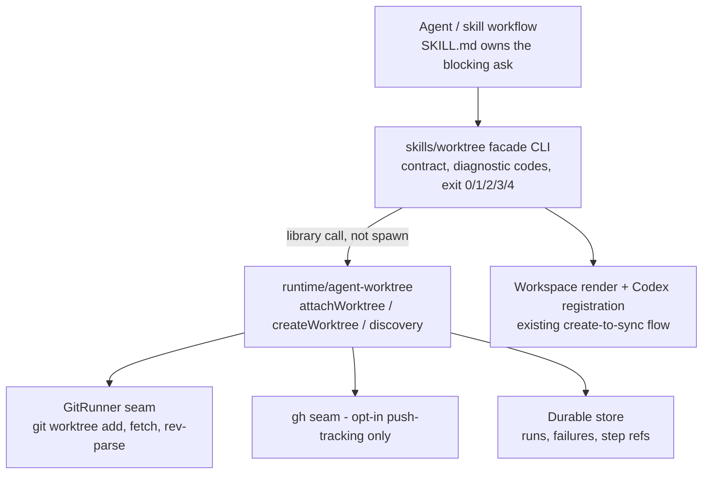
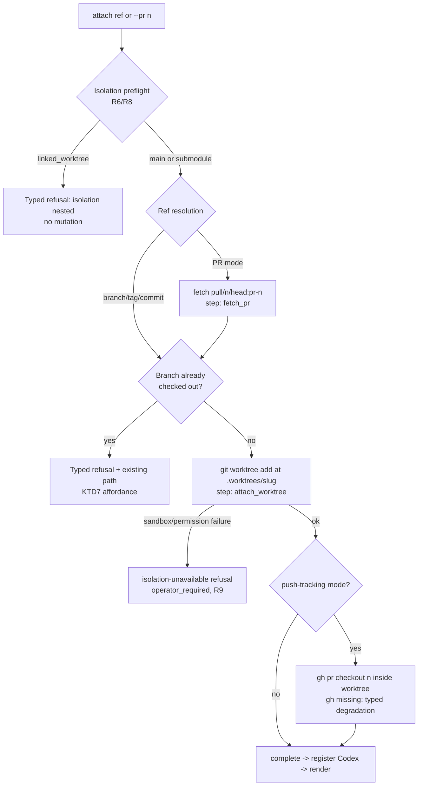
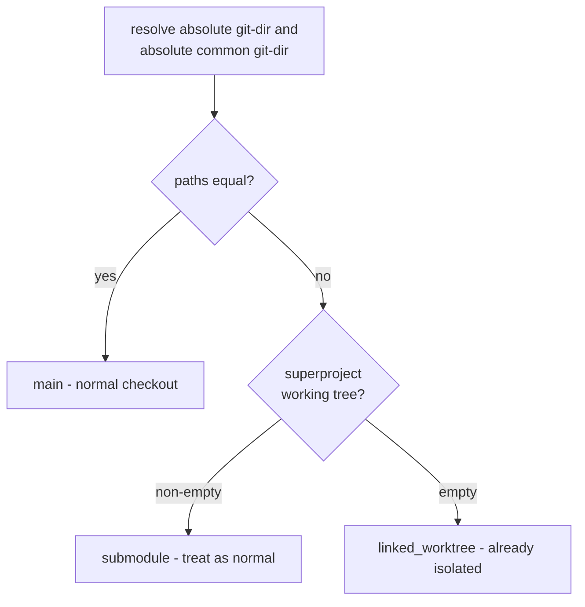

# Worktree Attach, Isolation Detection, and Blocking-Ask - Plan

## Goal Capsule

- **Objective:** Close the three capability gaps between the repo `worktree` skill and the ce-worktree plugin skill — attach-to-existing-ref (including PR heads), first-class isolation detection, and a blocking-ask-then-fallback on create/attach failure — so a standing rule can later redirect all top-level worktree isolation to the repo skill.
- **Authority hierarchy:** This plan > `skills/worktree/SKILL.md` and `skills/cli-author/SKILL.md` contract conventions > ce-worktree reference behavior (read for semantics, never copied).
- **Stop conditions:** Stop and surface if the facade library (`@side-quest/cli-command-facade`) cannot express a new exit code or execution mode the plan requires, or if implementing attach forces a breaking change to an existing verb's envelope.
- **Execution profile:** Two packages (`skills/worktree`, `runtime/agent-worktree`), dependency-ordered units, alignment-proof gates per unit. The AGENTS.md redirect rule is explicitly not part of this plan (see Scope Boundaries).
- **Tail ownership:** After all units land, the follow-ups are (1) the redirect rule via the prompt-system workflow and (2) verifying ce-work's worktree-path assumptions before the rule flips — both outside this plan.

---

## Product Contract

### Summary

Add an `attach` verb that creates a worktree on an existing branch, tag, commit, or PR head with fork-safe checkout rules and a one-branch-one-worktree guard; make "am I already isolated?" a runtime-owned fact surfaced through read verbs and enforced as a create/attach preflight; and give create/attach failures a typed refusal that routes to a documented blocking human ask instead of silent fallback to the main checkout.

### Problem Frame

The repo `worktree` skill is superior to the ce-worktree plugin skill overall (lifecycle safety, workspace render, Codex integration, registry, cleanup preview), but it can only create new-branch worktrees. Reviewing a PR, isolating an existing branch, or pinning a commit requires falling back to ce-worktree or raw git. ce-worktree also detects existing isolation before creating (preventing invisible worktree-in-worktree nesting) and stops for a human decision when isolation cannot be created — the repo skill does neither as a first-class behavior. Until these three gaps close, a standing "prefer the repo worktree skill" rule would claim capability the skill does not have. Getting the failure surface right matters more than usual here: the primary callers are autonomous agents, and today's generic create-failure advertises retry-safe recovery for deterministic failures that will never succeed on retry.

### Requirements

**Attach**

- R1. `attach` creates a worktree at the standard location (`.worktrees/<sanitized-name>` under the main owner root) checked out on an existing branch, tag, or commit — it never creates a new branch from a base.
- R2. PR mode checks the PR head out on a local branch named `pr-<n>` (fetched via the `pull/<n>/head:pr-<n>` refspec) — never a detached `FETCH_HEAD`, which would orphan later commits instead of updating the PR.
- R3. An opt-in push-tracking mode creates the worktree detached, then runs `gh pr checkout <n>` inside it for fork-safe push tracking. A missing `gh` binary degrades with a typed diagnostic code; the default pure-git mode is unaffected.
- R4. One-branch-one-worktree guard: when the requested branch is already checked out in any worktree (including the main checkout), `attach` refuses and reports the existing checkout path as structured data. It never creates a second worktree for the same branch.
- R5. Every attach refusal carries a stable `reason` and a correct `retrySafety` — a deterministic refusal must never advertise `same_input_safe`.

**Isolation detection**

- R6. The runtime owns an isolation classification per invocation directory: `main`, `linked_worktree`, or `submodule` — computed by comparing the resolved absolute git dir against the resolved absolute common git dir, with submodules distinguished via the superproject check. A boolean is insufficient; submodules must not false-positive as isolated.
- R7. The same classification fact is readable before mutation (surfaced in `status`/`doctor` output) and consumed by create/attach preflight — read and mutate paths report identical isolation state.
- R8. Creating or attaching from inside a linked worktree is refused (a worktree-from-a-worktree lands in the wrong tree and is invisible to the harness); a submodule is treated as a normal checkout.

**Blocking-ask on failure**

- R9. When create/attach fails such that isolation cannot be provided (for example a sandbox or permission error from `git worktree add`), the runtime returns a typed refusal with a new human-handoff reason meaning "isolation unavailable — human must choose", `operator_required` retry safety, and a recovery plan naming exactly two choices: work in the current checkout, or stop and resolve the environment.
- R10. The skill workflow documents a mandatory blocking ask (harness question tool, numbered-options fallback) before any work proceeds in the current checkout after such a refusal. Only explicit user confirmation proceeds; the CLI itself never prompts.

**Contract surface**

- R11. All new verbs, flags, diagnostic codes, and exit codes are contract entries in both packages, covered by the existing Command Surface Alignment Proof, diagnostic-code closure tests, and discovery metadata — no hand-maintained surface beyond the front-door usage text, which the tests already pin.

### Scope Boundaries

- **In scope:** the three features above, their tests, and the `skills/worktree/SKILL.md` workflow/safety updates that document them.
- **Deferred to Follow-Up Work:**
  - The AGENTS.md redirect rule ("prefer the repo `worktree` skill for isolation") — lands only after this plan is implemented, via the prompt-system workflow, and needs an AGENTS.md line-budget prune.
  - Verifying ce-work's worktree-path assumptions against the runtime's `.worktrees/<branch>` layout before the redirect flips.
  - An acknowledgment-flag audit trail for the blocking-ask fallback (recording "human approved working in the current checkout" in the JSON envelope). Worth doing; not needed to close the parity gap.
  - A structured "open the existing checkout" continuation that acts on the guard's reported path (beyond reporting it).
- **Outside this product's identity:** per-unit parallel workers in ce-work stay on harness-native isolation — the redirect covers top-level isolation only. The CLI never becomes interactive; asking humans is the skill workflow's job.

---

## Planning Contract

### Key Technical Decisions

- KTD1. **`attach` is a separate command in both contracts, not a mode on `new`/`create`.** (session-settled: user-directed — chosen over extending `new` with flags: attach has different arguments, no base branch, and a different failure vocabulary; a separate contract entry keeps discovery metadata and refusal semantics honest.) The runtime gains an `attachWorktree` lifecycle function beside `createWorktree`, sharing discovery, path-sanitization, store, and Codex-registration helpers.
- KTD2. **Attach's ref argument is a positional `<ref>` plus a `--pr <n>` selector; the existing `--ref` flag is never reused.** (session-settled: user-approved — `--ref` on `recover`/`inspect` is a typed durable-store ref (`worktree|run|failure:<id>`), and overloading it with a git revision would corrupt that contract. `--base` on `create` shows the precedent for revision-valued flags if a flag form is ever needed.)
- KTD3. **Default PR mode is pure git; push-tracking is opt-in via a `--track`-style flag backed by `gh`.** Fork-safe fetch needs no new dependency; `gh` becomes the repo's first programmatic GitHub CLI dependency only in the opt-in mode, and its absence degrades with a dedicated diagnostic code following the `codex_app_not_found` optional-binary pattern (spawn guarded, typed code, install hint, exit 2).
- KTD4. **Isolation detection lives in `runtime/agent-worktree/src/discovery.ts` behind the existing `GitRunner` seam.** (session-settled: user-approved — chosen over a SKILL.md-documented step only: runtime checks over prose policy.) `RepoDiscovery` gains an isolation classification field; the closed `DiscoveryIssue` code union is extended for detection failures; `doctor`/`status` surface the field so read and mutate paths share one fact (the established `statusWorktreesForDiscovery` sharing pattern).
- KTD5. **The refusal is runtime-typed; the ask is skill-owned.** (session-settled: user-approved.) A new `HumanHandoffReason` value (isolation-unavailable) maps to `retrySafety: "operator_required"` and routes through the existing `buildRecoveryPlan` → `operator_handoff` plumbing. `skills/worktree/SKILL.md` Safety gains the blocking-ask rule mirroring its existing dirty-worktree preserve-first pattern. Any caller of the runtime CLI gets the typed refusal; only the skill layer instructs the ask.
- KTD6. **The skill contract adds exit code 4 for "refused: human decision required."** Precedent: exit 3 is reserved for `drift_blocked` precisely so agents branch without scraping stderr. The runtime keeps its 0/1/2 contract; the distinct code lives at the skill layer, like 3 does.
- KTD7. **The one-branch guard is an ordinary recoverable refusal, not a blocking-ask.** The refusal payload carries the existing checkout path and a structured action affordance ("use the existing checkout at this path"); the agent may act autonomously. `deleteWorktree`'s `target_not_found` refusal (typed reason, `changedState: "none"`) is the shape to mirror; the private `isBranchCheckedOutElsewhere` helper is extended to return the conflicting path.
- KTD8. **Create's failure classification is upgraded alongside attach.** Today `createWorktree` maps any git failure to a generic "Worktree creation failed" with no `reason`, and the failure default advertises `same_input_safe` — a retry loop trap for deterministic failures. Both verbs classify at minimum: branch/ref not found, branch already checked out (with path), target path exists, and isolation-unavailable, each with explicit retry safety. Without the backport, attach and create diverge in failure quality.
- KTD9. **Multi-step attach uses the store's step model.** PR attach is fetch-then-attach (`fetch_pr` → `attach_worktree` step ids); a mid-flight failure records `changedState: "partial"` with a step-scoped failure ref, reusing the existing two-phase lifecycle-then-render result shape and `fromLifecycleFailure`/`fromPostLifecycleSyncFailure` on the skill side.
- KTD10. **Attach declares `dry_run` parity with `create`.** The facade validates that write-implying mutations carry a preview mode or exemption; attach previews the resolved ref, target path, and mode without mutating.

### High-Level Technical Design

Component topology — where each feature lives:

Attach flow with guards (protocol steps and decision points):

Isolation classification (detection decision tree):

Attach mode matrix:

| Mode | Selector | Checkout result | New dependency | Failure surface |
|---|---|---|---|---|
| Branch | positional ref | existing branch, guard-checked | none | guard refusal with path; ref not found |
| Tag / commit | positional ref | detached at ref | none | ref not found |
| PR (default) | `--pr <n>` | local branch `pr-<n>` | none (pure git fetch) | fetch failure; guard on `pr-<n>` |
| PR push-tracking | `--pr <n> --track` | detached create, then `gh pr checkout` | `gh` | typed `gh`-missing degradation |

### Sources & Research

- Dispatch path and two-phase result shape: `skills/worktree/src/worktree.ts` (`runLifecycleCommand`, `fromLifecycleFailure`, `syncWorkspace`); the skill calls the runtime as a library through `runtime/agent-worktree/src/index.ts`, never by spawning the runtime CLI.
- Create lifecycle and refusal vocabulary: `runtime/agent-worktree/src/worktrees.ts` (`createWorktree`, `LifecycleResult`, `HumanHandoffReason`, `buildRecoveryPlan`, `isBranchCheckedOutElsewhere`); command union in `runtime/agent-worktree/src/model.ts` (`AGENT_WORKTREE_COMMANDS`, retry-safety values). Note: `writeRun`/`failedLifecycle` locally narrow `command` to create/delete/refresh — widening lands here when `attach` joins the union.
- `--ref` semantics proving the collision: `runtime/agent-worktree/src/model.ts` (typed ref kinds), `inspect.ts` (`parseAgentWorktreeRef`).
- Detection greenfield: no `--git-dir`/`--git-common-dir` or submodule handling exists in either package; `discovery.ts` porcelain parsing and `GitRunner` are the seams.
- Test patterns: argv-keyed fake runners (`skills/worktree/src/worktree.test.ts`, `runtime/agent-worktree/tests/support.ts`); alignment proof and diagnostic-code closure (`skills/worktree/src/worktree.test.ts` ~1044-1179, runtime mirror `tests/cli-surface.test.ts`); process-boundary temp-repo harness with a local fake origin (`skills/worktree/src/worktree.integration.test.ts` ~146-152, new/rm scenarios ~246-281; runtime mirror `tests/entrypoint.integration.test.ts`). Repo learning: fakes must match real output shape; keep at least one process-boundary proof on the real dependency.
- Optional-binary degradation pattern: `launchCode`/`launchCodexApp` in `skills/worktree/src/worktree.ts` (`code_not_found`/`codex_app_not_found`).
- ce-worktree reference semantics (read, not copied): plugin skill ce-worktree 3.21.0 — Step 0 detection, fork-safe PR checkout, sandbox-failure blocking ask.
- No institutional-learnings corpus exists (`docs/solutions/` absent); no external research was needed — reference behavior and all patterns are local.

---

## Implementation Units

### U1. Runtime isolation detection

- **Goal:** `RepoDiscovery` carries an isolation classification (`main` | `linked_worktree` | `submodule`) computed from resolved absolute git-dir vs common-git-dir plus the superproject check, surfaced in `doctor`/`status` output.
- **Requirements:** R6, R7 (read side).
- **Dependencies:** none.
- **Files:** `runtime/agent-worktree/src/discovery.ts`, `runtime/agent-worktree/src/doctor.ts` (or wherever doctor projects discovery), `runtime/agent-worktree/tests/discovery.test.ts`, `runtime/agent-worktree/tests/support.ts` (fake outputs for the new rev-parse calls).
- **Approach:**
  1. Add the rev-parse probes through the `GitRunner` seam and resolve both paths to absolute before comparing (git mixes absolute/relative forms by cwd; raw string compare false-positives).
  2. Extend `RepoDiscovery` with the classification field and extend the closed `DiscoveryIssue` code union for probe failures (degrade to `unknown`-style evidence, do not block read verbs).
  3. Project the field into doctor/status output per KTD4.
- **Patterns to follow:** existing porcelain parsing and issue-as-data conventions in `discovery.ts`; the shared-fact pattern (`statusWorktreesForDiscovery`).
- **Test scenarios:**
  - Normal checkout: equal resolved paths → `main`.
  - Linked worktree: differing paths, empty superproject → `linked_worktree`.
  - Submodule: differing paths, non-empty superproject → `submodule`.
  - Relative-vs-absolute path forms from git normalize before compare (the false-positive case).
  - Probe failure → discovery issue recorded, classification degraded, doctor still returns a readable map.
  - Doctor/status output includes the classification field.
- **Verification:** runtime unit tests pass; doctor output shows the field in a real linked worktree (integration harness).

### U2. Runtime `attach` lifecycle and typed failure classification

- **Goal:** `attachWorktree` attaches to a branch, tag, commit, or PR head (pure-git mode) with the one-branch guard and typed, retry-safe failure classification; `createWorktree` gains the same classification (KTD8).
- **Requirements:** R1, R2, R4, R5; R7/R8 (preflight side, consuming U1); R9 (refusal typing).
- **Dependencies:** U1.
- **Files:** `runtime/agent-worktree/src/worktrees.ts`, `runtime/agent-worktree/src/model.ts` (`AGENT_WORKTREE_COMMANDS`, new handoff reason), `runtime/agent-worktree/src/command-contract.ts`, `runtime/agent-worktree/src/cli.ts`, `runtime/agent-worktree/tests/worktrees.test.ts`, `runtime/agent-worktree/tests/cli-surface.test.ts`, `runtime/agent-worktree/tests/entrypoint.integration.test.ts`.
- **Approach:**
  1. Add `attachWorktree` beside `createWorktree`, sharing discovery, `sanitizeBranchPath`, store writes, and Codex registration; contract entry with positional ref, `--pr`, dry-run mode (KTD10).
  2. Preflight: refuse from `linked_worktree` contexts with the new isolation handoff reason (R8); run the extended `isBranchCheckedOutElsewhere` (returns conflicting path) before mutation (R4, KTD7).
  3. PR mode: `fetch_pr` step (refspec `pull/<n>/head:pr-<n>`) then `attach_worktree` step; partial-state failure refs per KTD9.
  4. Classify create/attach git failures into typed reasons with explicit retry safety (KTD8); map sandbox/permission failures to the isolation-unavailable handoff reason with `operator_required` (R9).
- **Patterns to follow:** `deleteWorktree`'s typed `target_not_found` refusal; existing step/failure-ref store conventions; exhaustive `cli.ts` command switch (TypeScript forces the new case).
- **Test scenarios:**
  - Attach existing branch → worktree at `.worktrees/<slug>`, branch checked out, `changedState: "complete"`, Codex registration invoked.
  - Attach tag and commit → detached checkout at the ref, complete.
  - Attach branch already checked out elsewhere → typed refusal, conflicting path present as structured data, retry safety is not `same_input_safe`, no mutation.
  - PR mode → local branch `pr-<n>` exists; HEAD in the new worktree is not detached; no `FETCH_HEAD` checkout.
  - PR fetch failure → `changedState: "none"`, step-scoped failure ref, typed reason.
  - Fetch succeeds but worktree add fails → `changedState: "partial"`, failure ref names `attach_worktree`.
  - Attach from inside a linked worktree → isolation refusal before any mutation; same classification visible via doctor (parity with U1).
  - Attach from a submodule → proceeds as normal checkout.
  - Unknown ref → typed not-found reason, `change_input`-style recovery.
  - Sandbox/permission failure from `git worktree add` → isolation-unavailable handoff reason, `operator_required`, recovery plan offers exactly the two operator choices (R9).
  - `create` on an existing branch → now classified (no more generic "Worktree creation failed" with retry-safe default).
  - Dry-run attach → preview of ref, path, mode; no mutation.
  - Alignment proof and diagnostic closure updated for the new command and reasons.
- **Verification:** runtime unit + integration + surface tests pass; a real-git integration scenario proves the PR flow against a second local repo acting as origin.

### U3. Push-tracking PR mode via `gh`

- **Goal:** `--track` (name final at contract time) creates the worktree detached, then runs `gh pr checkout <n>` inside it; missing `gh` degrades with a typed code and never affects the default mode.
- **Requirements:** R3.
- **Dependencies:** U2.
- **Files:** `runtime/agent-worktree/src/worktrees.ts`, `runtime/agent-worktree/src/command-contract.ts`, `runtime/agent-worktree/tests/worktrees.test.ts`, `runtime/agent-worktree/tests/entrypoint.integration.test.ts`.
- **Approach:** run `gh` through the existing runner seam (argv-keyed, fakeable); guard absence per the optional-binary pattern (KTD3); record the checkout as its own step so a `gh` failure after worktree creation reports `partial` with a step-scoped ref.
- **Patterns to follow:** `codex_app_not_found` degradation; step model from U2.
- **Test scenarios:**
  - Track mode with `gh` present (faked) → detached create, then checkout step recorded, complete.
  - `gh` absent → typed degradation code with install hint; default PR mode still succeeds in the same suite.
  - `gh pr checkout` fails after worktree creation → `partial`, step-scoped failure ref, retry safety `inspect_first`.
- **Verification:** runtime tests pass; the `gh` seam is faked at the runner boundary only (real-shape fake per repo learning), with the pure-git path still covered by the real-git integration test.

### U4. Skill facade `attach` verb

- **Goal:** The skill exposes `attach` end to end: contract entry, handler delegating to `attachWorktree`, render-after-lifecycle, new diagnostic codes, exit code 4, action affordances, and front-door help.
- **Requirements:** R1-R5, R9 (skill-side mapping), R11.
- **Dependencies:** U2 (U3 for the track flag passthrough).
- **Files:** `skills/worktree/src/command-contract.ts` (`WORKTREE_COMMAND_ORDER`, contract entry, `WORKTREE_DIAGNOSTIC_CODES`, new failure-action affordances, exit code 4), `skills/worktree/src/worktree.ts` (`runCommand` switch, handler, `renderFrontDoorUsage`), `skills/worktree/src/worktree.test.ts`, `skills/worktree/src/worktree.integration.test.ts`.
- **Approach:**
  1. Contract entry mirrors `new` (audience agent, write mutation, dry-run or preview exemption per KTD10, `--force-render`, `--json`), plus attach-specific flags.
  2. Map runtime refusals to skill diagnostics: guard refusal and isolation refusal get dedicated codes and affordances (the guard's affordance names the existing-checkout continuation per KTD7; the isolation refusal's affordance names the ask, exits 4 per KTD6) instead of the generic retry-flavored `inspect_worktrees`.
  3. Reuse `fromLifecycleFailure`/`fromPostLifecycleSyncFailure`; success flows through `syncWorkspace` so render, drift gate, and Codex registration behave exactly as `new`.
- **Patterns to follow:** `new`'s `runLifecycleCommand` flow; `WORKTREE_COLOR_FAILURE_ACTIONS` as the precedent for refusal-specific affordances; exit-3 declaration pattern for the new exit 4.
- **Test scenarios:**
  - `worktree attach <branch> --json` happy path → envelope carries contract id, action, `changed_state: "complete"`, render status.
  - Guard refusal → dedicated diagnostic code, existing path in data, exit code distinct from generic failure, affordance is the use-existing-checkout continuation (not retry).
  - Isolation-unavailable refusal → dedicated code, exit 4, affordance names the human decision.
  - Front-door usage text includes attach (exact-string test).
  - Alignment proof: commands discovery includes attach; help/flag surface asserted; foreign flags rejected; diagnostic-code closure passes with the new codes; exit-code table declares 4.
  - Process-boundary integration: attach + PR attach against a temp repo with a second local repo as origin, asserting envelope and real git state.
- **Verification:** `worktree-scripts` test + typecheck suites pass (via the repo's test-runner/MCP routing).

### U5. SKILL.md workflow, safety, and dependencies

- **Goal:** The skill document teaches the new surface: when to attach vs create, the isolation-detection step, the blocking-ask rule, and the new dependencies.
- **Requirements:** R10; R7 (documented read-before-mutate step); R3 (dependency note).
- **Dependencies:** U1-U4 (documents shipped behavior only).
- **Files:** `skills/worktree/SKILL.md`.
- **Approach:**
  1. Workflow: add attach to the verb-choice step; add "check isolation via `status` before creating when context is uncertain — never nest a worktree from a linked worktree" as a step, citing the runtime-owned fact.
  2. Safety: add the blocking-ask rule (R10) mirroring the dirty-worktree preserve-first shape — on the isolation-unavailable refusal, ask via the harness blocking-question tool with the two options; proceed in the current checkout only on explicit confirmation; add a one-line caution that PR attach materializes untrusted fork code locally (install/test deliberately).
  3. Dependencies: `gh` optional (push-tracking only, absence degrades); note the fresh-worktree bootstrap step per the standing AGENTS.md rule (`scripts/bootstrap-worktree.sh`) applies to attach-created worktrees too.
  4. Route the SKILL.md edit through the skill-author conventions (read the design runbook first, per repo rule).
- **Patterns to follow:** existing SKILL.md Safety and Dependencies sections; owner-path citation, no copied contracts.
- **Test scenarios:** Test expectation: none — documentation unit; correctness is proven by U4's behavior tests and the skill-author frontmatter/YAML checks.
- **Verification:** `setup sync --check --json` clean after the skill edit; SKILL.md names the new verb, the ask rule, and the `gh` dependency.

---

## Verification Contract

| Gate | Command / check | Proves |
|---|---|---|
| Skill tests | `bun --filter worktree-scripts test` (via `skills/test-runner/src/test-runner.sh`) | U4 contract, handler, alignment proof, integration scenarios |
| Skill types | `bun --filter worktree-scripts typecheck` | contract/type closure incl. exhaustive command switch |
| Runtime tests | `runtime/agent-worktree` package `test` script (Bun, via test-runner routing) | U1-U3 lifecycle, detection, surface tests |
| Lint / types | MCP runners `biome_lintCheck`, `tsc_check` | repo quality gates |
| Alignment proofs | included in both packages' test suites | four drift surfaces (discovery metadata, help, parser acceptance, runtime semantics) for every new verb/flag/code |
| Process boundary | integration tests with real git (temp repos, local fake origin) | fork-safe PR flow, guard, isolation refusal against the real dependency |

Repo rule: never raw `bun test`/`biome`/`tsc` — use the test-runner script and MCP runners.

## Definition of Done

- All five units land dependency-ordered; every gate in the Verification Contract passes.
- Agent-native refusal quality holds: no new failure path advertises `same_input_safe` unless a retry can actually succeed; the guard refusal carries the existing checkout path; the isolation refusal exits 4 with the two-choice recovery plan.
- Read/mutate parity holds: the isolation classification reported by `status`/`doctor` equals what create/attach preflight enforced, proven by a shared-scenario test.
- `skills/worktree/SKILL.md` documents attach, the detection step, and the blocking-ask; `setup sync --check` is clean.
- No implementation of the AGENTS.md redirect rule, no edits to ce-work, no per-unit-worker changes — those remain follow-ups.
- Abandoned experimental code from the implementation run is removed before done is declared.
