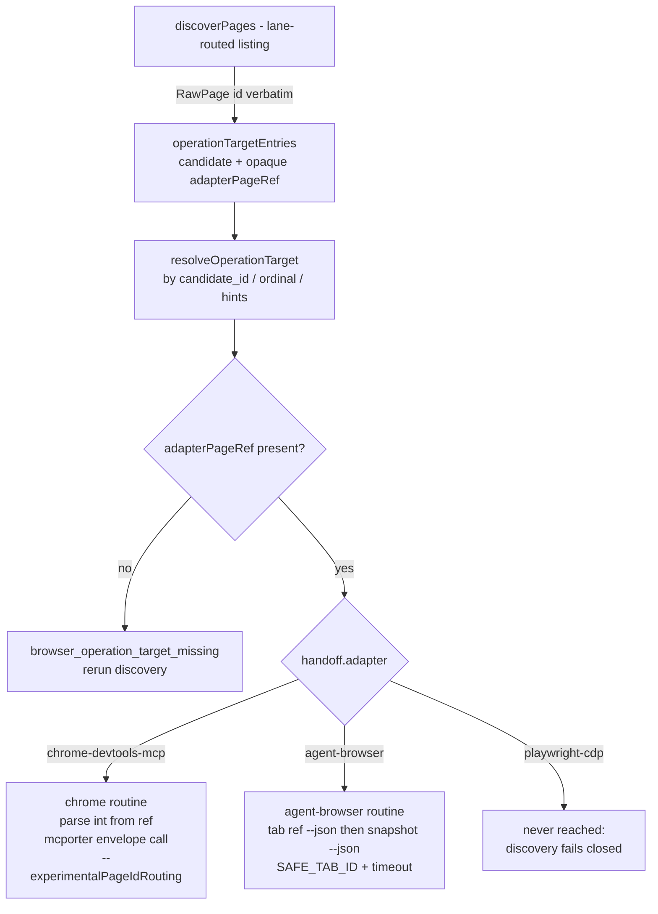

# Browser Use operate opaque adapter page ref - Plan

## Goal Capsule

- **Objective:** make `browser-use operate` resolve and execute against the agent-browser lane by carrying the adapter's page/tab handle as an opaque, adapter-owned ref and routing operate execution per lane — never by parsing the handle in the harness.
- **Authority:** this plan; repo git policy (feature branch, no direct commits to `main`, no `git add .`, PR left open for CodeRabbit); code-quality runners (test-runner script, MCP biome/tsc).
- **Stop conditions:** stop and surface if the fix requires changing the Verified Handoff Envelope schema, the selected-target state schema, or the chrome-devtools-mcp argv contract pinned in `skills/browser-use/src/mcporter-adapter-process-boundary.test.ts` — none of those should move.
- **Execution profile:** test-first; the red seam test exists (see U4 origin) and must be promoted, not rewritten from scratch.

---

## Product Contract

### Summary

`browser-use operate snapshot` fails on the agent-browser lane with `browser_operation_target_missing` even after successful `targets list`/`targets select`. Discovery faithfully reports agent-browser's native string tab ids (`t1`, `t2`), but the operation layer parses every adapter page handle as a non-negative integer and silently drops any handle that is not one. The fix removes the harness's knowledge of handle shape entirely: the harness carries the handle verbatim as an opaque ref, and each lane's execution routine — the only code that owns its adapter's identity model — interprets it.

### Problem Frame

The operate pipeline (`skills/browser-use/src/browser-use-operations.ts`) maps discovered pages through `parseAdapterPageId` (`Number(value)`, integer, `>= 0`), so agent-browser's `t1` becomes `undefined` and the resolved target is rejected at the `targetEntry.pageId === undefined` gate. This is a symptom of a deeper defect: the harness hard-coded chrome-devtools-mcp's integer page-id shape as if it were universal, and its execution path (`runEnvelopeAdapterCall`, the mcporter spawn with `--experimentalPageIdRouting`) is registered for the chrome-devtools-mcp lane only, yet operate uses it unconditionally. Adapters have three incompatible identity spaces (agent-browser `t1` strings, CDP hex target GUIDs, Playwright page objects); any adapter whose handle is not a small integer breaks, and "also accept strings" re-breaks with the next adapter.

The repo already contains the correct discipline three times: candidate identity hashes the raw id opaquely (`candidateIdentityOf` in `skills/browser-use/src/browser-use-core.ts`), the confidential-delivery custody seam carries a CDP target id it never interprets, and the runbook target binding persists an opaque candidate binding and round-trips it to a raw tab id only inside the agent-browser executor (`docs/plans/2026-07-28-002-fix-runbook-target-resolution-plan.md`, R7/R9/KTD2). Operate is the one layer that violates it.

### Requirements

**Target resolution**

- R1. `operate snapshot` on the agent-browser lane resolves a discovered http(s) tab with a native string id (`t1`) to an executable target; it never returns `browser_operation_target_missing` for a tab discovery just surfaced.
- R2. The harness target-resolution layer carries the adapter page handle as an opaque ref: stored verbatim from discovery, never parsed, never persisted, never emitted in any envelope, diagnostic, or display projection.
- R3. Only the owning lane's execution routine interprets its ref. A ref malformed *for that lane* (e.g. non-integer on chrome-devtools-mcp) fails as a lane-honest transport/input failure, not as `browser_operation_target_missing`.
- R4. A resolved candidate whose target entry genuinely lacks a handle (discovery reported no id) still fails with the existing `browser_operation_target_missing` + `rerun_handoff_bound_target_discovery` repair action.

**Execution routing**

- R5. Operate execution dispatches per lane, matching the Adapter Lane Registry's declared execution interfaces (`skills/browser-use/src/browser-use-adapter-model.ts` lane table): `mcporter-envelope-call` for chrome-devtools-mcp, `agent-browser-native-call` for agent-browser. One lane's binary is never spawned through another lane's call shape.
- R6. The agent-browser operate routine runs through the native CLI-subcommand transport with the same guards as existing agent-browser spawns: `SAFE_RUN_ID`/`SAFE_TAB_ID` validation before the id enters argv, and a bounded command timeout.
- R7. `--bring-to-front` keeps its focus meaning per lane: chrome-devtools-mcp keeps the explicit `select_page {bringToFront:true}` call; on agent-browser, native tab activation carries the focus side effect.

**Behavior preservation**

- R8. chrome-devtools-mcp operate behavior is unchanged: same argv contract (envelope-derived spawn, `--experimentalPageIdRouting`, `MCPORTER_NO_KEEPALIVE` guard), same call sequence, same envelopes.
- R9. The selected-target state schema (`SelectedTargetState` in `skills/browser-use/src/browser-use-selection.ts`) is untouched — it already binds identity through the opaque `target_candidate_id`; the page handle is process-local per operate run and is never written to state.
- R10. Capability policy is unchanged: `operate screenshot`/`operate emulate` on agent-browser stay `browser_operation_capability_unauthorized`; playwright-cdp operate stays fail-closed at discovery with the existing not-implemented message.

### Acceptance Examples

- AE1. **Given** a verified agent-browser handoff and one http(s) tab with id `t1`, **when** `operate snapshot --handoff <env> --json` runs, **then** the exit code is 0 and the envelope's `data.adapter` is `agent-browser` with a snapshot payload. Covers R1, R5.
- AE2. **Given** the same setup, **when** any operate failure or success envelope is emitted, **then** the string `t1` appears nowhere in stdout/stderr. Covers R2.
- AE3. **Given** a chrome-devtools-mcp handoff and a discovered page id `1`, **when** `operate snapshot` runs, **then** the mcporter spawn and `{pageId: 1}` args are byte-identical to today's pinned contract. Covers R8.
- AE4. **Given** an agent-browser handoff, **when** `operate screenshot` runs, **then** the failure is `browser_operation_capability_unauthorized` (unchanged). Covers R10.

### Scope Boundaries

- **Not the bug — do not touch:** the http(s)-only discovery filter (`parseUrlSafe`, `skills/browser-use/src/browser-use-core.ts`) is working as designed (browser-use release-contract rule R32, not one of this plan's R-IDs); `file://` fixtures are served over http instead.
- **Task path is already lane-correct:** `browser-use task` derives tab handles per lane at its front door (string `--tab` for agent-browser, numeric for chrome/playwright in `skills/browser-use/src/browser-use.ts`) and dispatches to lane executors natively. The prior handoff's "operate/task" framing over-generalized; only operate shares the broken seam. No task changes.
- **Deferred to follow-up work:** a playwright-cdp discovery + operate transport (lane stays honestly fail-closed); promoting the lane dispatch into a typed execution-interface registry if a fourth lane ever lands; marking the bug fixed in `skills/browser-use/docs/research/2026-07-31-confidential-delivery-prototype-findings.md`.

### Sources and Research

- Failure sites: `skills/browser-use/src/browser-use-operations.ts` — rejection gate (`targetEntry.pageId === undefined`), `operationTargetEntries` + `parseAdapterPageId`, `runOperationTransport`, `focusOperationPage`.
- Discovery id source: `skills/browser-use/src/browser-use-discovery.ts` (`extractAgentBrowserPages`, `id: tab.tabId`); lane-routed discovery branch in `discoverPages` is the dispatch pattern U2 mirrors.
- Chrome-lane-only transport: `skills/browser-use/src/browser-use-transport.ts` module header + `envelopeAdapterCallArgs` (`--experimentalPageIdRouting` is an argument to the chrome-devtools-mcp binary; it never applies to agent-browser).
- Native executor patterns to mirror: `skills/browser-use/src/browser-use-agent-browser.ts` (session-scoped spawns, `tab <tabId> --json` activation, `snapshot --json`, 30s timeout) and `skills/browser-use/src/browser-use-agent-browser-target.ts` (candidate-id round-trip via `targetBindingOf`).
- Red seam proof: facade-level test demonstrating discovery succeeds (`tab list` spawn observed) and operate still returns `browser_operation_target_missing` for a `t1` tab — reproduced 2026-07-31 with the session-scratchpad test promoted by U4.
- Prior art for the opaque discipline: `docs/plans/2026-07-28-002-fix-runbook-target-resolution-plan.md` (R7, R9, KTD2).

---

## Planning Contract

### Key Technical Decisions

- KTD1. **Opaque adapter-owned page ref** (session-settled: user-directed — chosen over widening `parseAdapterPageId` to also accept strings: any harness-side parse keeps the harness coupled to one adapter's private handle shape, and the next adapter re-breaks it; opaque carriage matches the candidate-id, custody, and runbook-binding patterns already in the repo). `OperationTargetEntry`/`ResolvedOperationTarget` carry `adapterPageRef?: string` holding `page.id` verbatim; `parseAdapterPageId` is deleted.
- KTD2. **Lane dispatch as a plain adapter branch in `browser-use-operations.ts`**, mirroring `discoverPages`' existing `facts.adapter === "agent-browser"` branch. Rejected: a new execution-interface registry/strategy layer — two implemented operate lanes today; the lane table already names the interfaces; a branch keyed on the handoff adapter id is the smallest seam that cannot silently cross lanes. Revisit only if a third operate transport lands (see Scope Boundaries).
- KTD3. **The chrome routine owns its integer parse.** The `Number.isInteger && >= 0` validation moves inside the chrome-devtools-mcp execution routine, which converts its own ref before building `{pageId}` args. A non-integer ref there is a lane-honest transport failure, never `browser_operation_target_missing` (R3).
- KTD4. **agent-browser operate snapshot = native `tab <ref>` activation + `snapshot --json`**, mirroring the task executor's spawn shape and guards. Rejected: routing operate through the full `executeAgentBrowserTask` machinery — operate is a read-only single operation; the task executor carries mutation checkpoints, origin policy, and auth-delivery seams that operate must not engage.
- KTD5. **No persistence or schema change.** `target_candidate_id` already binds selection identity opaquely across runs; the page ref is recomputed from fresh discovery on every operate call and stays process-local (R9).

### High-Level Technical Design

The harness's reasoning surface stays adapter-neutral facts it already normalizes (origin, path shape, title, candidate id/ordinal). The ref crosses the harness untouched, from the lane's discovery transport to the same lane's execution routine.

### Assumptions

- The agent-browser CLI's `tab <tabId> --json` + `snapshot --json` sequence works against an operate-selected tab exactly as it does in the task executor (same session naming `browser-use-<runId>`, same CDP ws endpoint). Evidence: the executor runs this today; verify live in U5.
- Snapshot output normalization (`SNAPSHOT_MAX_BYTES`/`SNAPSHOT_MAX_LINES` bounding) applies to agent-browser snapshot text the same way it does to chrome text; the agent-browser envelope (`{success, data}`) needs its own unwrap before bounding.

---

## Implementation Units

### U1. Carry the opaque ref through target resolution

- **Goal:** the operation target layer stores and forwards the adapter page handle verbatim; no harness code parses it.
- **Requirements:** R1, R2, R3 (carriage half), R4.
- **Dependencies:** none.
- **Files:** `skills/browser-use/src/browser-use-operations.ts`, `skills/browser-use/src/browser-use-operations.test.ts`.
- **Approach:**
  1. Replace `pageId?: number` with `adapterPageRef?: string` on `OperationTargetEntry` and `ResolvedOperationTarget`; `operationTargetEntries` assigns `page.id` verbatim (absent id stays `undefined`).
  2. Delete `parseAdapterPageId`; the rejection gate keys on the absent ref and keeps its exact failure envelope (R4).
  3. Thread the ref (not a number) into `focusOperationPage` and `runOperationTransport` signatures; their lane-specific interpretation lands in U2/U3.
- **Patterns to follow:** `candidateIdentityOf` in `browser-use-core.ts` — raw id as opaque string input.
- **Test scenarios:**
  - A discovered agent-browser page `{id: "t1", url: http(s)}` yields a target entry whose ref round-trips to the execution seam (not `undefined`).
  - A chrome page `{id: "1"}` yields ref `"1"` — no numeric conversion at this layer.
  - A page with no `id` yields an entry with no ref, and a resolution landing on it emits `browser_operation_target_missing` with `rerun_handoff_bound_target_discovery`.
- **Verification:** existing operations suite still green except tests that pin the numeric type internally (updated alongside), plus the new scenarios above.

### U2. Lane-routed execution dispatch; chrome routine owns its parse

- **Goal:** operate execution and `--bring-to-front` focus dispatch on the handoff adapter; the chrome-devtools-mcp routine converts its own ref to the integer `pageId` and keeps today's transport contract byte-stable.
- **Requirements:** R3, R5, R7, R8.
- **Dependencies:** U1.
- **Files:** `skills/browser-use/src/browser-use-operations.ts`, `skills/browser-use/src/browser-use-operations.test.ts`.
- **Approach:**
  1. Introduce a lane branch (mirror of `discoverPages`' adapter branch) where `runOperate` currently calls `focusOperationPage`/`runOperationTransport`.
  2. Chrome routine: parse the ref (`Number.isInteger && >= 0`) inside the routine; on failure emit a lane-honest transport/input failure naming the expected shape; on success build the existing `runEnvelopeAdapterCall` calls unchanged.
  3. Update the module-header comment to describe lane-routed execution.
- **Test scenarios:**
  - Chrome snapshot/screenshot/emulate: existing pins (argv, env guard, `{pageId: 1}` args, no `select_page` without `--bring-to-front`) stay green unmodified — the byte-stability proof (AE3).
  - Chrome lane with ref `"t1"` (simulated cross-lane corruption): fails with the lane-honest failure, not `browser_operation_target_missing`.
  - `--bring-to-front` on chrome still issues `select_page {pageId, bringToFront: true}` before the operation.
- **Verification:** `mcporter-adapter-process-boundary.test.ts` and `browser-use-transport.test.ts` untouched and green.

### U3. agent-browser native operate routine

- **Goal:** `operate snapshot` (and its `--bring-to-front` focus) executes on the agent-browser lane through the native CLI-subcommand transport.
- **Requirements:** R1, R5, R6, R7, R10.
- **Dependencies:** U1, U2.
- **Files:** `skills/browser-use/src/browser-use-operations.ts` (routine may delegate to a helper beside the discovery transport in `browser-use-discovery.ts` if sharing the spawn builder is cleaner), `skills/browser-use/src/browser-use-operations.test.ts`.
- **Approach:**
  1. Validate the ref against `SAFE_TAB_ID` and the run id against `SAFE_RUN_ID` before either enters argv (R6).
  2. Spawn `<probe> --cdp <ws> --session browser-use-<runId> tab <ref> --json` to activate/route, then `... snapshot --json`; both bounded by the executor's 30s timeout constant.
  3. Unwrap the `{success, data}` envelope (reuse the discovery-side envelope guard), then feed snapshot text through the existing operation bounding.
  4. `--bring-to-front`: tab activation is the focus side effect; no extra call.
  5. Failure mapping: non-zero exit/timeout → operation transport failures; `{success:false}` → transport-failed with the adapter's error text redacted to the existing diagnostic bounds.
- **Patterns to follow:** `discoverAgentBrowserPages` (argv build, safe-id guard, envelope parse) and the task executor's snapshot step in `browser-use-agent-browser.ts`.
- **Test scenarios:**
  - Happy path: `t1` tab → exact argv pair pinned (activation then snapshot), exit 0, envelope `data.adapter: "agent-browser"` with bounded snapshot text (AE1).
  - `t1` never appears in any emitted envelope (AE2).
  - Unsafe ref (fails `SAFE_TAB_ID`) → typed input failure before any spawn.
  - Adapter `{success:false}` and timeout → distinct transport failures, no retry loop.
  - `operate screenshot`/`emulate` on agent-browser → `browser_operation_capability_unauthorized` before any transport (AE4).
- **Verification:** operations suite green; no mcporter spawn observed on the agent-browser path in any test.

### U4. Promote the red seam test and pin the lane matrix

- **Goal:** the diagnosis test becomes the repo's regression seam, green under the fix.
- **Requirements:** R1, R2, R10.
- **Dependencies:** none for porting the red test — that happens first and stays red; U1-U3 for the green success-envelope assertions.
- **Files:** `skills/browser-use/src/browser-use-operations.test.ts`.
- **Approach:** port the session-scratchpad red test (agent-browser envelope fixture + faked `tab list` spawn asserting the resolved `t1` target survives resolution) into the operations suite with repo-local imports; extend it to assert the full success envelope now that execution exists.
- **Execution note:** port the test first and watch it fail against pre-U1 code if any doubt remains about seam coverage; it must pass only after U3.
- **Test scenarios:**
  - The ported seam test: discovery spawn observed, no `browser_operation_target_missing`, exit 0.
  - The seam test captures all emitted stdout/stderr across both success and failure paths and asserts the raw ref (`t1`) appears nowhere (AE2).
  - playwright-cdp handoff → operate fails closed at discovery with the existing not-implemented message (R10).
- **Verification:** full browser-use suite green through the test-runner; the scratchpad copy deleted.

### U5. Live lane proof (operator-gated)

- **Goal:** prove the fix against the real agent-browser lane end-to-end.
- **Requirements:** R1, R5, R6.
- **Dependencies:** U1-U4.
- **Files:** none (live verification; findings-note status line update allowed).
- **Approach:** Agent Chrome via `browser-connect connect --json` only (never the default Chrome profile — ledger DDA-F26); serve a fixture over local http; `targets list --mode handoff-bound` → `targets select` → `operate snapshot` → expect status ok; then `operate screenshot` → expect capability-unauthorized.
- **Test expectation:** none — live operator verification of behavior already unit-pinned in U3/U4.
- **Verification:** ok envelope from `operate snapshot` on the agent-browser lane recorded in the PR description.

---

## Verification Contract

| Gate | Command / check | Applies to |
|---|---|---|
| Unit + regression suite | `skills/test-runner/src/test-runner.sh run -- skills/browser-use/src` | U1-U4 |
| Types | MCP `tsc_check` (`response_format: "json"`) | U1-U3 |
| Lint/format | MCP `biome_lintCheck` (`response_format: "json"`) | U1-U3 |
| Chrome contract byte-stability | `mcporter-adapter-process-boundary.test.ts`, `browser-use-transport.test.ts` pass unmodified | U2 |
| Live lane proof | U5 sequence returns status ok on agent-browser | U5 |

## Definition of Done

- The promoted seam test (U4) is green in the repo suite; the scratchpad red test is deleted.
- All chrome-devtools-mcp operate pins pass without modification (R8).
- Full browser-use suite, `tsc_check`, and `biome_lintCheck` clean; exit code 2 from any runner blocks.
- No occurrence of a raw adapter page ref in any emitted envelope, state file, or diagnostic (R2 spot-checked in U3/U4 assertions).
- Live agent-browser `operate snapshot` returns ok (U5, operator-gated; may land as a PR follow-up check if the operator defers it).
- No leftover dead code: `parseAdapterPageId` and any abandoned dispatch scaffolding removed.
- Work lands on a feature branch with a PR left open for CodeRabbit review; the pre-existing dirty tree (deleted `skills/coding-task-tracker/`, `skills/component-library-standard/`, the findings note) stays out of the commits.
