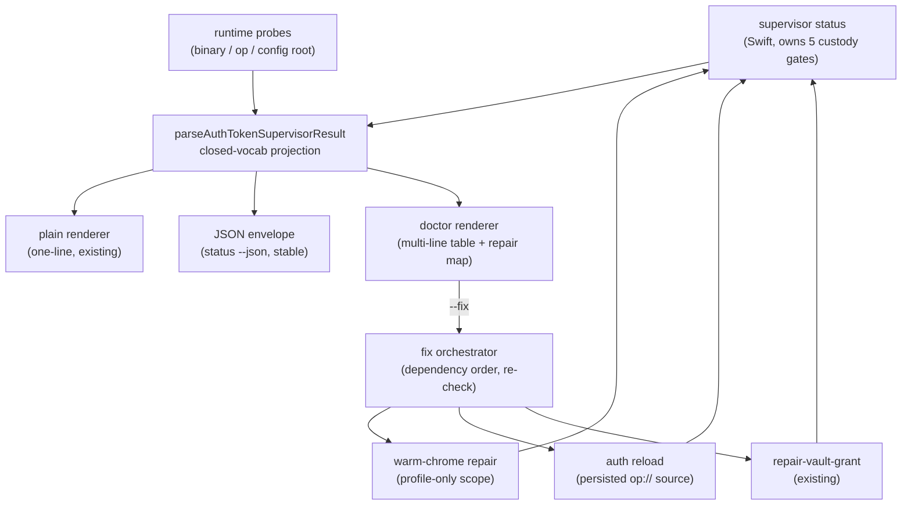

# Token-management DX — honest self-healing doctor (env lane) - Plan

## Goal Capsule

- **Objective:** make the browser-use **environment-injected OP lane** custody token a self-explaining, self-healing daily-driver surface. One command (`browser-use auth doctor`) tells you the exact per-gate state and the one-command repair for anything red; `--fix` performs the safe repairs by delegating to each gate's owner. Scope is the env lane only.
- **Product authority:** the merged confidential-delivery custody design (ADR 0030 token custody; PR #290 `2c2e9a8f`) is the substrate. This plan adds the operator-facing DX on top; it changes no custody invariant.
- **Prerequisite (landed):** the `auth status` crash fix — typed envelopes for credential-named continuations — is committed on `fix/auth-status-envelope-id-gate` (`0c4ff516`, PR #292). This plan stacks on that branch; land it first or branch from it.
- **Deferral lifted:** the e2e-proof hold on this plan was lifted by the operator on 2026-08-01 for this run.
- **Stop conditions:** any change that would relax a custody invariant (token bytes visible to the agent process, unsafe profile scrubbed in place, token value as argument/env) is out of authority — stop and surface it.

---

## Product Contract

### Summary

Add an operator-facing token-management DX layer to the browser-use env lane: a read-only `auth doctor` that renders every custody gate (`token_file`, `op`, `token`, `vault_scope`, `profile_policy`) as green/red with a one-command repair per red gate, plus a zeroth runtime gate for the states where the supervisor cannot run at all; an opt-in `auth doctor --fix` that runs the safe, non-interactive repairs by delegating each to its owner; a `warm-chrome`-owned writer that makes a credential-clean Chrome profile (the gap that leaves the lane blocked today); and a zero-arg `auth reload` backed by a persisted `op://` source reference. Expiry surfacing is deferred to a fast-follow gated on a token-claim feasibility spike.

### Problem Frame

The custody spine is merged and correct, and a freshly installed token is valid (4 of 5 gates green). But the operator experience around it is hostile in three proven ways (receipt: `skills/browser-use/src/prototypes/2026-08-01-token-doctor-self-heal/findings.md`):

1. **The status tool crashed on its own repair instruction.** The remaining gate's continuation is named `create-credential-clean-profile`; the shared facade guard bans the word "credential" from projected text, so `auth status` threw `CliRuntimeContractError` instead of telling the operator what to do. The envelope half is fixed (`0c4ff516`); the human render half is this plan.
2. **The credential-clean profile gate cannot be fixed today.** The supervisor verifies the profile flags (`profilePolicyCheck`, `runtime/browser-use-environment-auth/Sources/BrowserUseEnvironmentOpSupervisor/main.swift:624`) but nothing anywhere writes them — a fresh dedicated profile sits `profile-policy-unproven` forever with no repair path.
3. **Token staleness is invisible and reload is friction.** A stale token surfaces only as a failed run; re-installing means remembering `op read <ref> | install-token --stdin --replace`. There is no `reload`, and no stored source to make it zero-arg.

The prototype proved the whole doctor + profile self-heal is achievable browser-free — it drives the real supervisor `status` and flips a scratch profile to 5/5 green with zero Chrome attach.

### Requirements

**Doctor surface**

- R1. `browser-use auth doctor` renders each evaluable custody gate (`token_file`, `op`, `token`, `vault_scope`, `profile_policy`) as green/red, and for every red gate prints exactly one repair command; it never crashes on any gate state, including credential-named continuations.
- R2. Bare `auth doctor` is read-only — running it never mutates custody state, a Chrome profile, or a token. Checking status is always side-effect-free.
- R3. `auth status --json` remains the stable machine envelope (scripts/CI); `auth doctor` is a separate human render + repair layer computed over the same gate evaluation. The two coexist; `doctor` does not replace or alias `status`.
- R12. When the supervisor cannot produce the gate map (missing/unbuilt binary, missing `op`, unsafe config root), `doctor` renders a zeroth runtime gate red with the distinct cause and its one-command repair, and shows the five custody gates as unknown — never a bare error or a fabricated verdict.

**Self-heal**

- R4. `auth doctor --fix` performs every safe, non-interactive gate repair by delegating to that gate's owner, refuses the unsafe or interactive ones with the precise manual next step, then re-checks and re-renders. It is opt-in (only the `--fix` flag heals). Every delegated call is bounded — a repair that would block on interactive auth (e.g. `op` signed out) is refused fast with a typed reason, never hung.
- R5. Each repair is delegated to its existing owner, never reimplemented in the doctor: profile → `warm-chrome` repair; token → `auth reload` / `install-token`; vault → `repair-vault-grant` (a pure re-proof — the grant itself is a manual 1Password step). The doctor is a thin orchestrate-and-render surface.
- R13. The profile path the gate check evaluated and the path the profile repair writes are byte-identical: the resolved path is passed explicitly across the delegation seam and never re-resolved by the delegate.

**Credential-clean profile**

- R6. `warm-chrome` gains the ability to write a credential-clean Chrome profile: `Default/Preferences` with `credentials_enable_service`, `profile.password_manager_enabled`, `autofill.profile_enabled`, `autofill.credit_card_enabled`, and `sync.requested` all `false`, an owner-only `0700` profile dir, and no non-empty `Default/Login Data`. The writer merges the flags into existing Preferences JSON (creating a minimal file only when absent), writes atomically, guards against symlinked paths, and refuses while a live Chrome holds the profile (`SingletonLock` liveness).
- R7. The profile fix auto-completes the safe cases behind `profile-policy-unproven` (missing dir, wrong mode, missing flags — no saved logins). It refuses a non-empty `Login Data` (= real saved credentials, the supervisor's `profile-policy-unsafe`) and refuses a symlinked or non-canonical path (which the supervisor reports as `unproven`, not `unsafe`), surfacing the exact manual next step for the sub-cause it found; it never auto-deletes credential data. (Fail-closed posture is ADR-mandated: `docs/adr/0030-environment-injected-op-lane-is-lower-assurance.md`.)

**Token reload**

- R8. `install-token` accepts an optional `--from op://<vault>/<item>/<field>` that fetches the token over an fd-to-fd pipe into the supervisor's stdin (token bytes never buffered or readable by the agent-visible process) and, only after a successful install, persists the source reference `0600` in the custody dir (`auth.nosync/token-source.json`); the reference is owner-only, same posture as the token file.
- R9. `auth reload` re-installs the token from the persisted source, fully non-interactive when `op` is authenticated; before use it re-validates the stored source file (regular file — never a symlink or hard link — owner-matched, mode `0600`, ref re-parses as `op://vault/item/field`) and refuses with a typed error otherwise. With no stored source it degrades to the hidden-prompt install only when stdin is a TTY — non-TTY with no source is a typed error naming the manual step, never a prompt or a hang. `auth reload` is both a standalone command and the `--fix` token-gate repair — one mechanic, two entry points.

**Supervisor binary presence**

- R11. `auth doctor` detects a missing or unbuilt release supervisor binary (`runtime/browser-use-environment-auth/.build/release/browser-use-op-supervisor` — a per-worktree, gitignored build artifact absent in any fresh worktree) and surfaces it via the runtime gate (R12) with the exact one-command build repair, rather than letting a downstream custody op fail with a confusing "binary missing". The fix is a runtime check + build hint, never an auto-build — the binary must match the worktree's source bytes.

**Expiry (deferred)**

- R10. v1 surfaces token staleness only as a red `token` gate in `auth doctor` with `auth reload` as the fix — honest, with no fabricated countdown. A proactive "expires in N days" is out of v1 (see Open Questions).

### Acceptance Examples

- AE1. **R1, R2.** Given the current custody state (4/5 green, `profile_policy` blocked), `auth doctor` renders four greens + one red with a one-line repair, exits cleanly, and mutates nothing. (Proven: prototype Q1.)
- AE2. **R4, R5, R6, R7.** Given a `profile-policy-unproven` state, `auth doctor --fix` delegates to the warm-chrome profile repair, which writes the clean profile, and the re-check shows all 5 gates green. Given a `profile-policy-unsafe` state, `--fix` refuses, names the sub-cause-specific manual step, and deletes nothing. (Self-heal-to-green proven browser-free: prototype Q2.)
- AE3. **R8, R9.** Given a token installed with `--from op://…`, `auth reload` re-installs non-interactively and `token` returns green; given no stored source on a TTY, `reload` falls back to the hidden prompt; given no stored source without a TTY, `reload` exits with a typed error and no prompt.
- AE4. **R3.** `auth status --json` returns the stable typed envelope for a script; `auth doctor` renders the human view — both over one evaluation, neither breaking the other.
- AE5. **R11, R12.** In a fresh worktree with no built supervisor binary, `auth doctor` exits cleanly showing the runtime gate red with the exact build command and the five custody gates as unknown — not a crash, not a bare "binary missing".

### Scope Boundaries

**Explicitly out of this plan**

- The live login itself and the U8 login-engine → runbook production driver wiring (a separate follow-up; the live proof is operator-gated).
- The Keychain / Secure-Enclave signed lane (rejected direction — exists as `runtime/browser-use-security` `TokenRetrievalLauncher`, Apple-Developer-signing-gated per ADR 0028).
- A proactive expiry countdown UI (deferred per R10 / Open Questions).
- The shared-facade banned-vocabulary guard reconsideration (flagged in the crash-fix handoff; that broader decision is not this plan's).
- The `auth status` crash fix itself — a landed prerequisite (`0c4ff516`), not scope.
- Any doctor-unique machine schema, agent-side `--fix` orchestration wrapper, or supervisor vocabulary expansion (frozen in v1 per KTD12).
- Auto-building the supervisor binary from `--fix` or bootstrap (hint-only per R11).

### Sources / Research

- Proven-mechanic receipt (browser-free post-build accept spike): `skills/browser-use/src/prototypes/2026-08-01-token-doctor-self-heal/findings.md` — doctor render on every gate state + profile self-heal to 5/5 green, zero Chrome attach. Liftable sketches in `doctor-spike.ts`: `REPAIR` cause→command map, `GATE_ORDER`, `renderDoctor`, `makeProfile(clean)` (the exact Preferences JSON the writer must produce).
- Custody substrate: `docs/adr/0030-environment-injected-op-lane-is-lower-assurance.md` (binding: token value never as argument/env; install via hidden prompt or stdin only; unsafe profile never scrubbed in place — repair fails closed).
- Gate evaluation seam: `parseAuthTokenSupervisorResult` (`skills/browser-use/src/browser-use.ts:5165`) — validated projection with closed vocab sets (`AUTH_TOKEN_SUPERVISOR_CAUSES`, `AUTH_TOKEN_SUPERVISOR_ACTIONS`, `AUTH_TOKEN_CHECK_STATUSES`); fail-closes to `token-supervisor-unavailable` on any unknown cause. Renderers hang off `emitAuthTokenLifecycleResult` (`:5227`).
- Degraded states: `authSupervisorUnavailable` synthetic envelope carries no `checks` map (`skills/browser-use/src/browser-use-runtime.ts:187-219`); distinct causes `token-supervisor-unavailable`, `op-path-unavailable`, `unsafe-config-root`.
- Facade text-safety: `runtime/cli-command-facade/src/runtime-text-safety.ts:20` bans credential vocabulary, `op://` refs, local paths, and command examples in all projected envelope text — repair command text lives in human stdout only; envelopes carry typed action ids.
- Profile owner: `runtime/warm-chrome/src/repair.ts` (`createRepairCommandHandler`, refusal seam `WARM_CHROME_REPAIR_REASONS`, mutation pins `WARM_CHROME_REPAIR_ACTION_IDS`, deps seam `WarmChromeRepairDeps`); current repair re-proves through the browser-entry proof chain (`repair.ts:339,416`); Chrome liveness via `SingletonLock` (`runtime/warm-chrome/src/launch.ts:353`).
- CLI contract wiring: `skills/browser-use/src/command-contract.ts` (`BROWSER_USE_AUTH_SETUP_SUBCOMMANDS:450`, contract entries near `:2439-2513`, flag groups `browserUseAuthInstallFlags:1722`); drift sweep `skills/browser-use/src/command-contract-no-dangle.test.ts` auto-covers new subcommands.
- Repair Path rubric (per-repair: summary, posture, success signal, stop condition; stable IDs in code): `docs/plans/2026-07-14-002-feat-browser-connect-repair-paths-repair-hint-ledger.md`.
- Supervisor build owner: `build:release` script in `runtime/browser-use-environment-auth/package.json` — the canonical command R11's hint names.
- Prerequisite fix: commit `0c4ff516` (`runtime/cli-command-facade/src/runtime-envelope.ts` shape-gated action ids; `emitCliError` total). Regression tests exist in `skills/browser-use/src/browser-use-auth-commands.test.ts` and `runtime/cli-command-facade/tests/runtime-envelope.test.ts`.

### Key Decisions

- KTD1. **Delegate to owners; the doctor is a thin orchestrate-and-render surface.** (session-settled: user-directed — chosen over a monolithic doctor that reimplements repairs: keeps each repair with its owner per the repo's "name the owner, never copy contracts" rule; the profile-clean-prefs writer lands in warm-chrome, its natural owner.) Governs R5, R6.
- KTD2. **The `auth status` crash is a separate prerequisite, not scope.** (session-settled: user-directed — chosen over folding it in as unit 1: the doctor renders its own stdout and works even with the crash present, and the crash is a distinct facade-contract bug with its own blast radius.) Governs R1, R3.
- KTD3. **`--fix` profile auto-fixes the safe `unproven` case, refuses the `unsafe` case.** (session-settled: user-directed — chosen over auto-recreate or prompt: never silently deletes a profile holding real saved logins; surfaces the manual step instead.) Governs R7.
- KTD4. **Bare `doctor` read-only; self-heal behind an explicit `--fix`.** (session-settled: user-directed — chosen over always-heal or report-only: preserves the "checking is always safe" invariant while keeping the self-heal one keystroke away.) Governs R2, R4.
- KTD5. **`install-token --from op://…` persists the source `0600`; `reload` uses it.** (session-settled: user-approved — chosen over prompt-every-time: enables zero-arg non-interactive reload; the source is low-sensitivity but kept owner-only alongside the token.) Governs R8, R9.
- KTD6. **Expiry deferred for v1; honest red gate over a fabricated countdown.** (session-settled: user-directed — chosen over shipping a last-validated staleness heuristic: a nagging guess is worse DX than an honest red gate + `reload`; real expiry is a fast-follow gated on the token-claim spike.) Governs R10.
- KTD7. **`status` (machine) and `doctor` (human) coexist over one evaluation.** (session-settled: user-directed — chosen over `doctor` absorbing `status`: keeps the stable `status --json` machine contract while adding the human/heal layer.) Governs R3.

---

## Planning Contract

### Key Technical Decisions

- KTD8. **Doctor is a third renderer over the one validated projection.** `auth doctor` consumes `parseAuthTokenSupervisorResult` output exactly as the plain and JSON renderers do — no second gate evaluation, no doctor-side supervisor parsing. Repair knowledge is a code-owned structured map (cause → repair command, posture, success signal, stop condition — the Repair Path rubric), rendered by the doctor and never assembled as free strings. Governs R1, R3, R5.
- KTD9. **Doctor's `--json` mode is the status envelope, verbatim — semantics included.** (session-settled: user-approved — chosen over a human-stdout-only command or a doctor-unique schema: the facade's uniform output contract keeps `outputModes: [json, plain]`, and reusing the status serializer makes two-schema drift impossible by construction.) The multi-line green/red table is doctor's plain mode; `--json` adopts status's envelope and exit pairing wholesale — success envelope + exit 0 when ok, error envelope + exit 20 when not — keeping the envelope's embedded `process_exit_code` truthful. The exit-0-with-reds rule applies to plain mode only. Repairs appear in `--json` only as typed action ids. Governs R3.
- KTD10. **Cold states render as a zeroth runtime gate plus unknown custody gates.** (session-settled: user-approved — chosen over teaching the supervisor to emit partial checks: no supervisor changes in v1; the doctor distinguishes the three synthetic causes — `token-supervisor-unavailable`, `op-path-unavailable`, `unsafe-config-root` — and maps each to its own repair.) Governs R11, R12.
- KTD11. **`--from` fetches and records via an fd-to-fd pipe into the supervisor's existing `--input stdin` mode — zero Swift changes.** (session-settled: user-approved — chosen over record-only beside a normal install: record-only lets the persisted ref drift from the installed token; the pipe shape keeps token bytes out of the agent-visible process per ADR 0030, and the ref persists only after a successful install.) The wiring: TS resolves the absolute `op` path (the runtime's existing `opPaths` list — the scrubbed spawn PATH will not find `op`), spawns `op read <ref>` under the operator's own `op` session with stdout piped, and passes that child's stdout file descriptor directly as the supervisor install child's stdin — never a JS ReadableStream pump. The fetch `op` invocation runs outside supervisor op-admission, same trust as the manual `op read <ref> | install-token --stdin` flow it replaces; the custody service token is never injected into any TS-spawned `op`. A bounded non-interactive install-from spawn variant lands beside the interactive `stdin: "inherit"` path. Governs R8.
- KTD12. **Warm-chrome re-derives profile sub-causes locally; supervisor vocabulary is frozen in v1.** (session-settled: user-approved — chosen over adding supervisor sub-causes: any new supervisor cause requires lockstep edits to the fail-closed vocab sets; the profile owner can lstat/read the profile itself to tell "missing dir" from "wrong mode" from "foreign owner" from "missing flags", and "symlinked path" from "real saved logins".) Governs R7.
- KTD13. **Delegation is by CLI subprocess, not a new workspace dependency.** `--fix` spawns the warm-chrome CLI (and the existing auth subcommands) — `skills/browser-use` gains no dependency on `@side-quest/warm-chrome`. Resolution rule: resolve `runtime/warm-chrome/src/cli.ts` worktree-relative from browser-use's own module location and spawn it via the current bun executable (`process.execPath`), so the spawned code is always this worktree's bytes — never a PATH bin, which resolves to the main checkout. When the entrypoint is unresolvable (e.g. a dist layout), `--fix` renders the profile repair as manual with the exact `warm-chrome` command instead of failing "not found". Child-env contract: every owner spawn uses an allowlisted environment (PATH plus the minimum the owner needs, e.g. HOME for profile resolution) and never inherits `OP_SERVICE_ACCOUNT_TOKEN`, mirroring the supervisor spawn's scrubbed env. Governs R5.
- KTD14. **Profile repair is a profile-only mode flag on the existing `warm-chrome repair` command.** The existing repair re-proves through the browser-entry proof chain (live CDP listener); the profile-policy repair must run browser-free, so `warm-chrome repair` gains a flag-selected mode that performs the profile write + verification without the listener proof chain — a flag, not a new named scope concept (one consumer in v1; a second consumer can justify promotion later). The refusal seam (`WARM_CHROME_REPAIR_REASONS`, exit 20) and mutation pins are extended, not bypassed. Governs R6, R7.
- KTD15. **`--fix` policy: dependency order, continue past refusals, verdict by re-check.** Repairs run in dependency order (runtime hint first, then token chain, `profile` independently); a refusal doesn't abort unrelated repairs, only its dependents; the final re-check decides the exit — 0 iff all gates green, else the blocked exit (20). `vault_scope` is re-provable-not-mutable: `--fix` runs `repair-vault-grant` only as a post-token-repair re-proof, and a persisting vault-red renders the manual 1Password grant step. `--fix` never runs `swift build` (hint-only per R11) and never prompts. Governs R4.
- KTD16. **`token-source.json` is a TS-side writer with token-file posture — on write and on read.** Written `0600` via atomic temp+rename in `auth.nosync/`, only after a successful install; every read re-validates shape, ownership, mode, and non-symlink ancestry per R9 before use. `remove-token` keeps the ref (it is a pointer, not a secret — a revoked item makes `reload` fail typed, which the doctor renders honestly). Envelopes report source presence only, never the ref string (the facade text guard bans `op://` in projected text regardless). Governs R8, R9.

### High-Level Technical Design

Prose is authoritative: the doctor never talks to the supervisor directly and repairs never bypass their owners.

---

## Implementation Units

### U1. Repair map + degraded-state projection groundwork

- **Goal:** the shared layer both renderers and `--fix` consume: code-owned repair map with Repair Path fields, and cause-level distinction of the three degraded runtime states.
- **Requirements:** R11, R12; KTD8, KTD10.
- **Dependencies:** none.
- **Files:** `skills/browser-use/src/command-contract.ts`, `skills/browser-use/src/browser-use.ts`, `skills/browser-use/src/browser-use-runtime.ts`, `skills/browser-use/src/browser-use-auth-commands.test.ts`.
- **Approach:**
  1. Register `doctor` and `reload` in `BROWSER_USE_AUTH_SETUP_SUBCOMMANDS` (never the repair group — those names must equal continuation ids) and add contract entries modeled on `auth-status` (`:2493`).
  2. Add the repair map: per cause — repair command text, posture (auto-fixable / manual-only), success signal, stop condition. Lift the spike's `REPAIR` map and `GATE_ORDER` as the starting point.
  3. Distinguish `token-supervisor-unavailable` / `op-path-unavailable` / `unsafe-config-root` in the degraded path so each maps to its own repair (build command from `build:release` in `runtime/browser-use-environment-auth/package.json`; `op` install hint; config-root manual step).
  4. Any new supervisor action id lands in `AUTH_TOKEN_SUPERVISOR_ACTIONS` in the same change (fail-closed drift trap).
- **Patterns to follow:** contract entry shape at `command-contract.ts:2493`; closed-set discipline at `browser-use.ts:5010-5113`.
- **Test scenarios:**
  - Contract drift sweep passes with the new subcommands (auto-covered by `command-contract-no-dangle.test.ts`).
  - Repair map covers every cause in `AUTH_TOKEN_SUPERVISOR_CAUSES`; unmapped causes fall back to an explain hint, never a crash.
  - Each of the three degraded causes maps to a distinct repair.
  - Vocabulary-guard regression: every new action/continuation id passes the facade text-safety scan.
- **Verification:** unit tests green; drift sweep green.

### U2. `auth doctor` read-only renderer

- **Goal:** the human surface — multi-line per-gate table with one repair per red, runtime gate + unknown render for degraded states; `--json` emits the status envelope.
- **Requirements:** R1, R2, R3, R12; AE1, AE4, AE5; KTD8, KTD9.
- **Dependencies:** U1.
- **Files:** `skills/browser-use/src/browser-use.ts`, `skills/browser-use/src/browser-use-auth-commands.test.ts`.
- **Approach:** dispatch `doctor` through `runAuthTokenLifecycle`; render over the existing projection (tolerate absent `checks` — the synthetic envelope has none); plain mode is the table (this is a deliberate break from the one-line plain convention, contract-declared); `--json` reuses the status serializer unchanged.
- **Execution note:** start from the spike's `renderDoctor` fixture states — write the renderer tests against exact supervisor envelopes (including the all-red synthetic) before wiring the dispatch.
- **Test scenarios:**
  - 4/5-green state renders four greens, one red, exactly one repair line, exit 0, no mutation (AE1).
  - Degraded no-binary state renders runtime gate red + build command + five unknowns, exit 0 (AE5); same shape for `op-path-unavailable` and `unsafe-config-root` with their own repairs.
  - Previously-crashing continuation state renders without error.
  - `--json` output is byte-shape-identical to `auth status --json` on the same fixture, and the exit code matches the envelope on both green (0) and red (20) fixtures.
  - No repair command text appears in any envelope field (facade guard scan).
- **Verification:** all doctor render states pass against fixture envelopes; AE1/AE5 shapes proven.

### U3. Warm-chrome credential-clean profile writer (profile-only repair scope)

- **Goal:** the writer that today does not exist: flip a profile to credential-clean, safely, browser-free.
- **Requirements:** R6, R7, R13; AE2; KTD12, KTD14.
- **Dependencies:** none (parallel-safe with U1).
- **Files:** `runtime/warm-chrome/src/repair.ts`, `runtime/warm-chrome/src/model.ts`, `runtime/warm-chrome/src/cli.ts`, `runtime/warm-chrome/tests/repair-stations.test.ts`.
- **Approach:**
  1. Profile-only mode flag on `warm-chrome repair` that skips the browser-entry proof chain (KTD14); takes the target profile path explicitly (R13 — no re-resolution).
  2. Sub-cause derivation: missing dir → create `0700`; wrong mode → chmod; foreign owner → refuse; missing/false-drifted flags → merge the five flags into existing Preferences JSON (minimal file only when absent), atomic temp+rename, lstat symlink guard (mirror `repair.ts:387`).
  3. Refusals through `unrepairableError` (exit 20): non-empty `Login Data`, symlinked/non-canonical path, foreign owner, live Chrome on the profile (`SingletonLock` liveness via the existing probe).
  4. New mutation-pin action id in `WARM_CHROME_REPAIR_ACTION_IDS`; new refusal reasons in `WARM_CHROME_REPAIR_REASONS` (both unions live in `model.ts`).
  5. Conformance target is the supervisor's exact predicate set (`profilePolicyCheck`): mode exactly `0700`, `euid` ownership, standardized-path equality (a trailing slash in the configured path fails it), Preferences ≤ 1 MiB, `Login Data` non-emptiness by lstat size. The writer's success must satisfy those predicates or the re-check stays red — note the symlinked-dir case surfaces from the supervisor as `unproven`, and warm-chrome still refuses it (R7).
- **Patterns to follow:** station-test pins in `repair-stations.test.ts`; deps seam `WarmChromeRepairDeps` for injected fs probes.
- **Test scenarios:**
  - Missing dir → created `0700`, flags written, success signal reports clean.
  - Existing Preferences with unrelated keys → five flags merged false, unrelated keys byte-preserved.
  - Non-empty `Login Data` → refusal, nothing written, sub-cause-specific manual step (AE2 refusal arm).
  - Symlinked profile path → refusal before any write.
  - `SingletonLock` held by a live process → refusal naming "stop warm chrome, rerun".
  - Concurrent double-run converges (atomic rename; second run idempotent).
  - Path identity (R13): the writer acts only on the exact path passed; a differing configured default is never silently substituted.
  - Every new refusal reason id and projected message passes the facade vocabulary-guard scan; Chrome flag names and saved-login wording appear in human stdout only.
- **Verification:** station tests green; refusal cases mutate nothing (assert on fs state).

### U4. `install-token --from` + persisted source + `auth reload`

- **Goal:** zero-arg reload: fetch-and-record install, `token-source.json`, TTY-gated fallback.
- **Requirements:** R8, R9; AE3; KTD11, KTD16.
- **Dependencies:** U1.
- **Files:** `skills/browser-use/src/command-contract.ts` (flag group `browserUseAuthInstallFlags`), `skills/browser-use/src/browser-use.ts`, `skills/browser-use/src/browser-use-runtime.ts`, `skills/browser-use/src/browser-use-auth-commands.test.ts`.
- **Approach:**
  1. `--from` validates the `op://vault/item/field` shape up front and pre-checks `op` auth with a bounded `op whoami` under the operator's own `op` session (the custody service token is never injected into any TS-spawned `op`) so failure is fast and typed.
  2. The fetch is the KTD11 pipe: TS-resolved absolute `op` path, `op read <ref>` with piped stdout, that fd passed directly as the supervisor install child's stdin (`--input stdin`) — never read or buffered in TS. The ref is an argument (allowed; the token value is not). New bounded non-interactive spawn variant beside the interactive `stdin: "inherit"` path.
  3. On successful install, write `token-source.json` `0600`, atomic temp+rename.
  4. `reload`: stored source → re-validate per R9 (lstat regular file, owner, mode, ref shape) then non-interactive re-install; no source + TTY → hidden prompt; no source + non-TTY → typed error. All `op` calls bounded by a deadline so `--fix` and agents never hang.
  5. `remove-token` leaves the ref in place (KTD16).
- **Patterns to follow:** supervisor spawn contract in `browser-use-runtime.ts:141-270`; `install` stdin-inherit path at `:245`; `previewExemption` stance on the `install-token` contract entry stays accurate.
- **Test scenarios:**
  - `--from` with malformed ref → typed error, nothing persisted.
  - `--from` with `op` signed out → fast typed refusal (no hang), nothing persisted.
  - Successful `--from` install → ref file exists `0600`; envelope reports presence only, never the ref string.
  - `reload` with stored source → non-interactive success (AE3).
  - `reload`, no source, non-TTY → typed error, no prompt, bounded time (AE3 non-TTY arm).
  - Failed install after fetch → no ref persisted (order proven).
  - Symlinked `token-source.json` → typed refusal, nothing spawned; stored ref failing shape validation → typed refusal.
  - Every spawned child env in the `--from`/`reload` paths excludes `OP_SERVICE_ACCOUNT_TOKEN` (assert the captured spawn env).
- **Verification:** contract tests green over exact supervisor envelope fixtures; no token bytes in any captured TS-side buffer (assert the spawn wiring, not just outputs).

### U5. `auth doctor --fix` orchestration

- **Goal:** the opt-in heal loop: delegate per the repair map, honor postures, re-check, verdict.
- **Requirements:** R4, R5, R13; AE2; KTD13, KTD15.
- **Dependencies:** U2, U3, U4.
- **Files:** `skills/browser-use/src/browser-use.ts`, `skills/browser-use/src/browser-use-auth-commands.test.ts`.
- **Approach:** iterate reds in dependency order (runtime → token chain → vault; profile independent); auto-posture repairs spawn the owner CLI (KTD13) passing the resolved profile path explicitly (R13); manual-posture reds render their step and are skipped; a repair failure aborts only its dependents; finish with one re-check and re-render; exit 0 iff all green else 20.
- **Test scenarios:**
  - `unproven` profile + stale token → both repaired via owners, re-check green, exit 0 (AE2 heal arm).
  - Mixed safe + unsafe reds → safe repaired, unsafe refused with manual step, exit 20, refusal did not block the unrelated repair.
  - All-manual reds → no mutation, every manual step rendered, exit 20.
  - Owner subprocess failure → typed surface of the owner's error, dependents skipped, unrelated repairs still ran.
  - `--fix` in a degraded runtime state → renders the build/install hint, runs nothing (hint-only, KTD15).
  - Vault-red state → no mutation, one `repair-vault-grant` re-proof, manual 1Password grant step rendered on persistence (KTD15).
  - The resolved profile path passed to warm-chrome is byte-identical to the path the gate check evaluated (R13).
  - Every owner spawn env excludes `OP_SERVICE_ACCOUNT_TOKEN` (assert the captured spawn env, KTD13).
  - Unresolvable warm-chrome entrypoint → profile repair rendered as manual with the exact command, no "not found" failure (KTD13).
- **Verification:** orchestration tests over fixture owners; exit-code table proven.

### U6. Process-boundary flip proof + integration sweep

- **Goal:** the real-dependency tier: prove the whole loop against the real Swift binary, per the repo's fakes-match-real-shape rule.
- **Requirements:** AE2, AE3, AE5; Verification Contract.
- **Dependencies:** U2, U3, U4, U5.
- **Files:** `skills/browser-use/src/browser-use-auth-doctor-process-boundary.test.ts` (new; mirror `browser-use-environment-op-deliver-process-boundary.test.ts` — darwin-only, hard-fails when the binary is absent: build, never skip).
- **Approach:** scratch config root + scratch profile; drive the real supervisor gate check; dirty profile blocks → run the real warm-chrome profile repair → re-run the gate check → 5/5 green (the spike's Q2, now through the shipped surfaces). Include the cold-state render against a config with no binary path.
- **Test scenarios:**
  - Dirty scratch profile → doctor red → `--fix` → re-check green (real binary, real writer).
  - Unsafe scratch profile (non-empty `Login Data`) → refusal end-to-end, file intact.
  - Cold no-binary run → AE5 shape from the real CLI.
  - Symlinked profile dir and trailing-slash configured path → doctor's posture and warm-chrome's verdict agree (refusal, no write) against the real supervisor predicates.
  - Given `op` authenticated and a stored `token-source.json`, `auth reload` drives the real supervisor fetch pipe and the `token` gate returns green (AE3 real-binary arm; gate on `op` availability).
- **Verification:** process-boundary suite green on darwin with the release binary built.

---

## Verification Contract

| Gate | Command | Applies to |
|---|---|---|
| Unit + contract tests | MCP `bun_runTests` (or `skills/test-runner/src/test-runner.sh`) — never raw `bun test` | U1-U5 per unit; full sweep before ship |
| Process-boundary proof | same runner, darwin, after `bun run build:release` in `runtime/browser-use-environment-auth` | U6 |
| Lint / format | MCP `biome_lintCheck` / `biome_formatCheck` | all changed TS |
| Types | MCP `tsc_check` | all changed TS |
| Contract drift | `command-contract-no-dangle.test.ts` + warm-chrome `cli-surface` / `docs-drift` sweeps | U1, U3 |
| Facade text-safety | vocabulary-guard regression tests over every new action/continuation id | U1, U2, U3, U4 |

Exit-code contract: read-only `doctor` in plain (human) mode exits 0 even with reds (checking is safe; the render is the product); `doctor --json` keeps status's envelope↔exit pairing (0 when ok, 20 when not — KTD9); `--fix` exits 0 iff the re-check is all green, else 20 (`BINDING_FAIL_CLOSED_EXIT_CODE`). Supervisor-blocked states keep their existing exit semantics under `status`.

---

## Definition of Done

- Every unit's verification green through the MCP runners; process-boundary suite green on darwin with the release binary built from this worktree.
- AE1-AE5 each proven by a named test.
- No custody invariant relaxed: token bytes never buffered or readable in the TS process, no prompt without a TTY, unsafe profiles never scrubbed, `--fix` never builds or prompts, and no spawned child of any new subprocess class inherits `OP_SERVICE_ACCOUNT_TOKEN` (guard tests prove it).
- No repair command text or `op://` ref in any projected envelope field (guard tests prove it).
- Contract surfaces (discovery metadata, rendered help, parser acceptance, runtime semantics) covered by the drift sweeps — no hand-maintained duplicates.
- Abandoned experimental code from the run removed; the diff contains only the shipped surfaces and their tests.

---

## Open Questions

- **Expiry feasibility spike (deferred, non-blocking):** does the 1Password `ops_` service-account token carry a parseable expiry claim readable inside the native custody child (secret-safe)? If yes → real "expires in N days" is a fast-follow. If no → choose deliberately between a last-validated heuristic or a scheduled `auth doctor` ping — do not default to the nagging heuristic.

---

## Appendix

**Product Contract preservation note:** restructured and tightened with user confirmation (scoping synthesis + doc-review fixes, 2026-08-01): R1, R6, R8, R9 amended (evaluable-gate wording; merge/live-Chrome safety; fd-pipe fetch-and-record with read-side re-validation; TTY gate); R5/R7 clarified (vault re-proof-only; supervisor's symlink→unproven mapping); R12, R13 added; AE5 added; AE2/AE3 extended with refusal/non-TTY arms; Goal Capsule blockers resolved (deferral lifted, prerequisite landed). All original R/AE/KTD IDs preserved; no scope removed.
