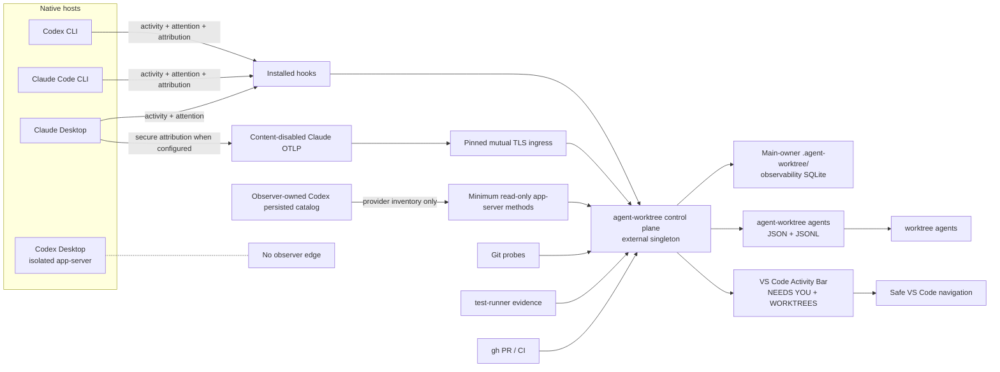
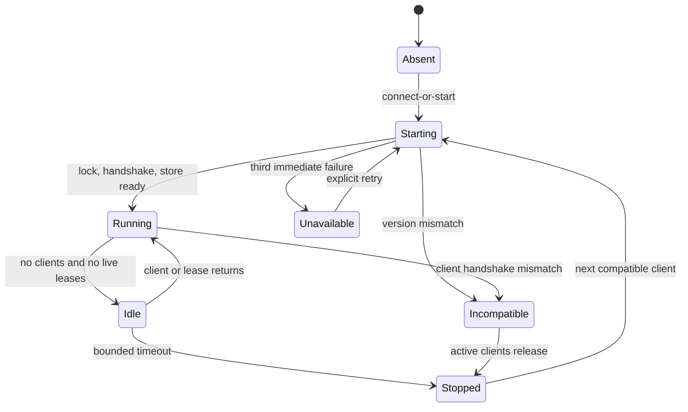
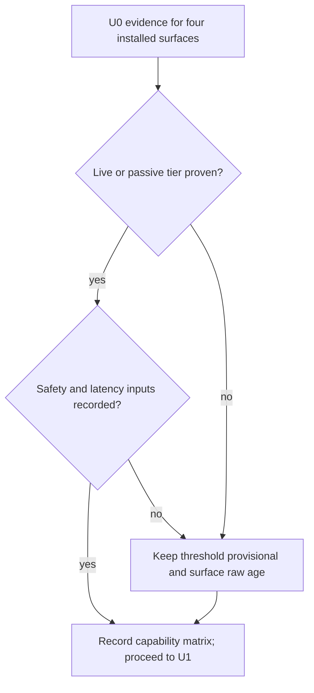

# VS Code agent worktree observability - Plan

## Goal Capsule

- **Objective:** make VS Code the primary observability console for agent work across Git worktrees. Show Codex CLI, Codex Desktop, Claude Code CLI, and Claude Desktop sessions under their repository and worktree, with attention state, Git progress, test evidence, PR evidence, freshness, and safe navigation.
- **Product authority:** the confirmed session scope in this plan. `runtime/agent-worktree/` remains the Git/worktree lifecycle owner. Native hosts remain the session and native-worktree lifecycle owners.
- **Execution profile:** Deep, cross-host, cross-process, stateful, privacy-sensitive, and UI-bearing.
- **Tail ownership:** `runtime/agent-worktree/` owns the normalized control plane and CLI. `runtime/agent-worktree-vscode/` owns the VS Code projection. Host hook and telemetry adapters own only source normalization.
- **Stop conditions:** stop if implementation requires scraping private Desktop databases, private process memory, or undocumented transcript formats as a primary contract. Stop if implementation would label an unproven Desktop event or source as live. Stop if a VS Code action would start, stop, approve, archive, delete, merge, or otherwise take over a native host lifecycle. Stop if raw prompts, assistant prose, tool payloads, command bodies, tokens, transcript contents, or unleased repository metadata would enter durable observability storage.

---

## Product Contract

### Summary

Add an Agent Worktrees Activity Bar view to VS Code. The view groups current-workspace repositories, their real Git worktrees, and zero or more Codex or Claude sessions per worktree. It shows host-reported activity and attention separately from Git, test, PR, and CI evidence. It persists recent metadata across restarts and marks every field with source freshness and capability.

A host-neutral control-plane process lives outside the VS Code extension host. Hooks and supported telemetry feed it only for repository roots actively leased by a trusted VS Code workspace or explicit CLI watch. The `agent-worktree` CLI and VS Code are peer clients of the same bounded projection and update stream. VS Code remains a read-only projection and navigation client.

### Problem Frame

Git worktrees make concurrent agent work safe, but they fragment the operator's view. Codex Desktop, Codex CLI, Claude Desktop, Claude Code CLI, terminals, generated workspaces, Git status, tests, and pull requests each show part of the truth. Their session histories are not interchangeable. Desktop hosts can create and remove their own worktrees. A branch name or a quiet terminal does not prove identity, completion, or failure.

The current repo already owns worktree lifecycle and recovery in `runtime/agent-worktree/`, generated VS Code workspaces in `skills/worktree/`, and a dormant best-effort event seam in `hooks/git/event-bus-client.ts`. It does not own a normalized session model, concurrent event ingestion, a live subscription surface, or a VS Code extension. The current `agent-worktree` store rewrites JSON records and full JSONL trails, so it is not safe as a multi-process telemetry store.

Public host APIs also differ. Codex hooks and Claude hooks expose strong lifecycle events, but Desktop live-state and deep-link parity are incomplete. Codex app-server can inventory persisted threads but cannot be assumed to subscribe to unrelated running CLI or Desktop processes. Claude OpenTelemetry supplies CLI/Desktop activity, but delivery is delayed and does not prove attention state. The product must expose these differences instead of fabricating parity.

#### Problem Evidence

The evidence is qualitative, not instrumented: the operator explicitly confirmed the need for VS Code as the observability console, and the repository contains two earlier worktree-dashboard artifacts that did not reach a shipped extension. No baseline yet measures missed approvals, time spent locating attention, or active cross-host session frequency. U4 therefore includes a live operator checkpoint: compare one real parallel-agent session against the current native-dashboard and terminal workflow before continuing to full evidence and closeout breadth.

### Actors

- A1. **Operator in VS Code:** scans all worktrees for the current workspace, finds attention, inspects evidence, and jumps to the correct context.
- A2. **Codex or Claude host:** owns its sessions, approvals, conversation history, and host-managed worktrees.
- A3. **Control plane:** ingests supported metadata, reconciles independent truth sources, persists recent state, and emits bounded projections.
- A4. **Git, test runner, and forge:** own code state, test results, and PR/CI state respectively.

### Key Flows

- F1. **Open the observer:** VS Code resolves workspace folders to canonical Git common roots, deduplicates generated focus/repo folder pairs, connects to the control plane, and renders repository → worktree → session rows.
- F2. **Watch progress:** a host event changes session activity or attention; the control plane persists and reduces it; the update stream invalidates the affected repository; VS Code refreshes the bounded projection.
- F3. **Investigate attention:** the operator expands a worktree, sees the session needing approval or input, checks source age and capabilities, then returns to the exact owning surface when supported or opens the mapped worktree.
- F4. **Inspect evidence:** the operator sees changed files, HEAD-bound test state, and HEAD-bound PR/CI state without treating agent prose as proof.
- F5. **Handle loss or drift:** a host disconnects, a native worktree disappears, a path is reused, a store becomes corrupt, or schemas mismatch; the UI keeps unaffected repositories visible and shows the precise degraded state and repair owner.

### Requirements

#### Control-plane model and ownership

- R1. The control plane emits one normalized, versioned read model for repositories, worktree lifetimes, sessions, activity, attention, actionability, capabilities, Git state, test state, PR/CI state, provenance, and freshness. Each projected session carries a stable ID, actionable reason and rank, service-instance identity, and projection revision.
- R2. V1 shows repositories represented by the current VS Code workspace and every Git-linked worktree under those repositories, including native-host worktrees that are not workspace folders. Machine-wide repository browsing is deferred.
- R3. The tree represents zero, one, or many sessions per worktree. It also represents discovered worktrees with no session. A repository-level Unmapped Sessions group keeps observed but unmappable sessions visible after real worktrees, sorted by attention then recency, with the mapping failure reason and only capability-backed actions. A first-class unresolved request from an actively leased repository remains visible there with provider, surface confidence, reason, source age, and mapping repair. It exposes no worktree or resume action until mapping succeeds.
- R4. Session lifecycle and current activity are separate. A completed turn never becomes a completed task or ended session without an explicit host event.
- R5. Git common-dir plus a package-owned worktree lifetime ID forms worktree identity. Paths, branches, folder names, HEADs, and host owner labels remain mutable evidence, not identity.
- R6. Native hosts retain lifecycle ownership. Observation never creates, removes, prunes, restores, archives, resumes, approves, or moves a native session or worktree.

#### Host coverage and capability honesty

- R7. V1 recognizes Codex CLI, Codex Desktop, Claude Code CLI, and Claude Desktop as distinct surfaces under two host providers.
- R8. Every session carries explicit capabilities for inventory, live activity, attention, cwd, worktree mapping, surface attribution, exact resume, host open, history, and deep link. A live surface supplies exact identity and surface attribution plus live activity or attention. A passive surface supplies exact identity and repository mapping but no actionable live state. A weaker or ambiguously attributed surface renders as detected-but-unsupported with the missing capability. Mapping failure does not suppress a first-class request from an actively leased repository. V1 ships the proven live lanes without fabricating parity for Codex Desktop.
- R9. Hooks own high-value lifecycle and attention transitions where supported. Strict attention requires a first-class approval or direct-input request; idle, ready, failure, stale, silence, and Git state never create it. Claude Desktop hooks and content-disabled OpenTelemetry may join on the native session ID. Codex app-server owns persisted inventory and status only for threads loaded by that app-server process; a separate observer process cannot claim live Codex Desktop state.
- R10. No adapter infers stuck, completed, failed, approval, or input-needed from silence alone. The initial ten-minute no-evidence threshold changes freshness to stale only; it never changes lifecycle or attention state. Fresh unresolved requests render as `Needs you`; expired requests render as `Last observed needing you · stale`, stay separately counted and ranked below fresh requests, and clear only from causally matched host evidence. U1 keeps the threshold provisional and exposes raw source age until representative host inter-event samples justify a frozen percentile.
- R11. The compatibility matrix and fixture corpus bind supported host versions and event names. Observer health records configured, discovered, trusted, and delivered independently. Unknown breaking schemas fail that adapter closed while Git-only observability remains available.

#### Repository progress evidence

- R12. Git owns branch, HEAD, dirty state, changed files, commits ahead, detached state, prunable state, and worktree existence.
- R13. Only structured `test-runner` results bound to repository, worktree lifetime, HEAD SHA, and observation time produce a pass or fail badge. Arbitrary shell test runs and agent claims remain unknown.
- R14. GitHub PR and CI evidence comes from `gh`, binds to head SHA and observation time, and becomes stale immediately on HEAD mismatch or after the initial five-minute refresh threshold. U6 measures representative forge latency and must freeze or revise the threshold at its entry gate before implementing forge refresh.
- R15. Worktree rows aggregate the highest attention across child sessions but render Git, test, PR, and CI evidence once at the worktree level. Repository rows preserve the highest child attention, affected-worktree count, newest activity, and projection-connectivity state while collapsed.

#### VS Code observability and navigation

- R16. VS Code contributes one Agent Worktrees Activity Bar container with two native Tree Views: `NEEDS YOU` for host-reported unresolved first-class operator requests and `WORKTREES` for repository → worktree → session and evidence hierarchy. Each attention row shows provider, attributed or unknown surface, delivery state, source age, and bounded reason. Only first-class approval and direct-input requests enter `NEEDS YOU` in runtime-owned rank order. Failure and ready for review remain prominent and ranked in `WORKTREES` with working, stale, idle or turn complete, ended, and unknown, but do not enter `NEEDS YOU`. Attention and freshness use text and icons, never color alone.
- R17. The default sort is attention first, then recent activity. Visible order stays stable while the view has focus; changed ranking is announced and applies automatically when focus returns. Stable node IDs preserve expansion and selection across refetch, reconnect, and reranking. After reranking, the selected node is revealed without moving focus; if it vanished, focus moves to the nearest surviving ancestor and announces the change. The UI shows approval, needs input, failure, working, session-evidence stale, idle/turn complete, session ended, and unknown as distinct labels.
- R18. Multiple VS Code windows are independent read-only clients of one external control-plane process. Versioned invalidations update both Tree Views and open evidence documents without a refresh click. Manual Refresh is a recovery action only. Closing or reloading a window never changes host or worktree state.
- R19. Open Worktree validates current Git discovery and opens the folder in a new VS Code window by default. A vanished path refreshes to unavailable rather than being recreated.
- R20. Safe session navigation exposes only capability-backed actions: open worktree, open an empty terminal at the worktree, open a changed file or read-only diff, open a read-only virtual document for canonical test detail, open an allowlisted PR URL, copy a validated and deterministically quoted exact resume command, or use an adapter-allowlisted documented host deep link. While a request is unresolved, resume is hidden and the next-safe-action names the owning surface. Host open is executable only through an exact documented route; otherwise the UI says `Return to <surface>` and offers Open Worktree when mapping is proven. Unsupported or invalid actions remain visible as capability explanations, not executable fallbacks.
- R21. Restricted Mode disables subprocess, terminal, and host-navigation actions. Observation shows a trust-required state. Browser-only VS Code and remote-only extension hosts are unsupported in V1.
- R22. Projection connectivity and per-source freshness are orthogonal fields. Initial connection, lazy detail loading, observer disconnect with timestamped last snapshot, simultaneous stale session evidence, retry exhaustion, empty workspace, no observed sessions, missing bundled control plane or Bun runtime, schema mismatch, adapter disconnect, corrupt store, unavailable worktree, and bounded-result truncation each have distinct accessible labels, preserved-data behavior, and owner-specific repair hints. Truncated results carry total and returned counts plus an “N more” node that opens a bounded continuation or exact CLI inspection route.

#### Durability, privacy, and performance

- R23. Durable events use an allowlisted metadata schema. Prompts, assistant messages, tool inputs/outputs, command bodies, diffs, transcript contents, raw native session IDs, secrets, tokens, cookies, and auth-bearing URLs are never persisted. Same-user processes remain inside the local trust boundary and may forge host claims or enrollment state, so human approval is an honest-client product invariant rather than an OS security boundary. Host metadata never authorizes navigation or lifecycle behavior without independent Git, adapter, capability, and URL revalidation.
- R24. Active plus seven days of recent sessions show by default. Normalized events, session summaries, and sanitized repair exports retain for 30 days, then expire transactionally. Retention applies only to the new observability namespace, never existing lifecycle runs, failures, worktrees, backups, or JSONL trails. Maintenance uses secure SQLite deletion, bounded WAL checkpoints, and expiry across spools and repair exports; filesystem snapshots remain outside the guarantee. Rejected ingress persists only a digest and redacted structural reason. `doctor` stays diagnostic. V1 exposes inspect plus one explicit rebuild route that first exports only validated allowlisted rows; unreadable raw corruption is never copied. Pinning and manual observability-data deletion remain Later. VS Code never invokes repair.
- R25. User-local runtime directories use mode 0700 and user ownership. Socket, lock, rendezvous, database, WAL, SHM, spool, temporary, migration, diagnostic, and sanitized repair-export files use mode 0600 regardless of umask. Creation and open paths reject unsafe symlinks, unexpected hard links where detectable, foreign ownership, and permission drift. Offline spools use private XDG state; per-repository canonical state stays under the main-owner `.agent-worktree/` store.
- R26. Hook ingestion exits without stdout, never changes the host outcome, rejects input above 1 MiB before full decoding, and targets a 100 ms p95 local budget. Normalized records cap at 16 KiB. Parsing also caps JSON depth, item and key counts, individual string length, duplicate-key behavior, and wall time. Offline spools cap at 64 MiB or 10,000 records per user and 16 MiB or 2,500 records per repository; repeated sources cap at 100 events/second with a 200-event burst. Canonical storage also enforces global and per-repository accepted-event budgets, active-source cardinality, bounded deduplication state, disk reserve, and deterministic coalescing or rejection under pressure. U0 records these provisional input, quota, and hook-latency limits. U4 freezes them with the packaged reference fixture before UI breadth. The initial one-second summary and two-second affected-repository refresh targets follow the same gate. U8 confirms the packaged system; larger machine-wide stress targets remain Later.

#### Agent-facing CLI parity

- R27. `agent-worktree` exposes facade-backed ingestion, query, watch, doctor, and inspect behavior with JSON or JSONL machine output. `worktree` exposes the operator-facing agents view by delegation to the runtime owner.
- R28. Discovery metadata, rendered help, parser acceptance, runtime behavior, Branch Station catalogs, and catalog-driven process tests remain aligned for both CLIs.
- R29. Every field and safe navigation action visible in VS Code has an equivalent machine-readable field or closed action ID. VS Code does not parse the SQLite store, hook logs, transcripts, terminal output, or a host TUI.
- R30. One documented first-run path installs and verifies the VSIX, bundled control plane, and supported host observers. It ends with the first observable session or one exact `doctor` action for every unavailable or untrusted capability.
- R31. Durable ingestion is limited to canonical repository roots with a human-approved enrollment record. Supported clients create first enrollment only after VS Code Workspace Trust or interactive CLI confirmation; non-interactive supported clients may use but never create it. This is an honest-client invariant inside the same-user trust boundary named by R23. The client presents its resolved root and intent; the service independently verifies the approval record and a real user-owned Git common root before granting the lease, then records the owning client for diagnostic listing. Clients renew every 30 seconds; leases expire after two minutes and release on clean shutdown. Before U2, U0 freezes a bounded no-subprocess lookup algorithm for untrusted hook `cwd` values: bounded ancestor traversal and file reads, canonical path checks, no Git or host process, no unsafe `.git` indirection, and service-side revalidation. A global hook with no matching lease drops the event without database, spool, diagnostic, or log metadata.
- R32. Provider payload version, normalized event version, IPC/projection protocol version, and SQLite migration version are independent. Every client handshakes before requests. An incompatible client never replaces an active service; the UI stays visibly mismatched until clients release it and the next compatible start owns migration.
- R33. Restricted Mode is checked before repository enrollment, extension-started processes, service startup, Git or host subprocesses, watchers, durable writes, or path display. An untrusted workspace renders inert trust guidance. A host may still launch the configured global observer hook, but that hook performs only the bounded R31 lease lookup and leaves no child or persistent process, socket, watcher, diagnostic, log, spool, database, or path metadata.
- R34. The packaged VSIX uses an exact file allowlist, reproducible bundle manifest, and recorded integrity digest. It contains no runtime state, credentials, host config, private fixtures, symlinks, unexpected executables, or source-checkout dependency.
- R35. Setup atomically installs versioned observer hook bundles and global observer config into a private runtime directory. All hook and service subprocesses use ownership-checked absolute interpreter/artifact paths, fixed argv without a shell, sanitized environments, and recorded digests. Git probes disable repository-controlled executable integrations. App-server and `gh` enforce deadlines, stdout/stderr byte limits, JSON depth/item limits, bounded incremental parsing, process-group termination, and restart circuit breakers.

### Acceptance Examples

- AE1. **R3, R7, R15-R17.** Given one worktree with a Codex session needing approval and a Claude session working, the worktree row shows approval as its aggregate attention and both sessions remain independently visible.
- AE2. **R4, R10.** Given a turn-completed event followed by silence exceeding the U0-frozen no-evidence threshold, the UI shows “Turn complete · session evidence stale”; it never shows task completed, session ended, or failed.
- AE3. **R5, R6, R19.** Given a Codex-managed worktree disappears and the same path later returns without reliable generation evidence, the old lifetime stays historical/unavailable and the new path receives a new lifetime. The extension never restores or deletes either.
- AE4. **R13, R14.** Given tests and CI passed at HEAD A, then the worktree moves to HEAD B, both badges become stale immediately and cannot render green for B.
- AE5. **R8, R20.** Given a Claude Desktop session with no documented exact-resume contract, the session explains that resume is unsupported and offers Open Worktree only. It never starts a new Claude session.
- AE6. **R18, R24.** Given two VS Code windows and a control-plane restart, both reconnect, replay one deduplicated current state, and preserve the recent history without either window becoming a writer.
- AE7. **R22-R24.** Given one repository store is corrupt, that repository renders a Doctor/Inspect repair state, other repositories remain visible, and no raw bytes are deleted or rewritten automatically on corruption detection. Later retention follows R24.
- AE8. **R23.** Given hook payloads containing prompts, tool bodies, commands, transcript paths, and tokens, persisted rows contain only allowlisted identifiers, timestamps, capability fields, safe labels, and source provenance.
- AE9. **R11, R22, R29.** Given the extension receives a newer incompatible projection schema, it refuses to render partial state, keeps the last compatible snapshot visibly stale, and shows an upgrade mismatch repair.
- AE10. **R8, R22, R30, R31.** Given a clean supported machine, one setup flow installs the VSIX and observers, trusts the workspace, enrolls its repository, starts the bundled service through the recorded Bun path, verifies hook trust and delivery, then shows the first session. A missing or unsupported seam ends with one exact `doctor` repair action instead of an empty tree.
- AE11. **R23, R31, R33.** Given a trusted workspace lease for repository A, hook activity in unrelated repository B or any untrusted workspace performs only the bounded global hook lookup. It creates no repository-B lease, child or persistent process, socket, database, spool, diagnostic, log, watcher, or persisted path evidence. Repository A's shared service and socket remain untouched.
- AE12. **R11, R22, R32.** Given an old extension and a newer active service, the handshake refuses partial rendering without replacing the service. After the old client releases it, the next compatible start performs the owned migration and both current clients reconnect.
- AE13. **R5, R11.** Given a worktree is deleted and recreated at the same path and branch while observation is offline, changed Git administrative identity starts a new lifetime. Without reliable generation evidence, the session stays ambiguous/unmapped rather than inheriting old history.
- AE14. **R24, R34.** Given a unique expired marker and a packaged VSIX, retention removes the marker from active SQLite, WAL, spool, and the sole sanitized repair-export artifact, while package inspection finds only allowlisted files and the recorded digest matches.
- AE15. **R15-R22.** Given one real parallel-agent session, the operator finds the highest attention, opens the correct worktree, and identifies the next action from VS Code without opening a native host dashboard. Collapsed repositories, observer disconnection, stale session evidence, and hidden-result counts remain visible and distinct.
- AE16. **R23, R34, R35.** Given a hostile `PATH`, mutable source checkout, malicious Git executable configuration, oversized child output, or never-exiting app-server/`gh`, the observer executes only verified installed artifacts and absolute tools, disables repository-controlled executable integrations, bounds and terminates children, and exposes a structured degraded state without leaking output.
- AE17. **R16-R18, R22.** Given an attention transition while VS Code is idle, `NEEDS YOU`, `WORKTREES`, their badges and summaries, and any open evidence document update from one versioned invalidation without a click. Given revision N+1 arrives while revision N is being fetched, the client coalesces to the highest requested revision, atomically replaces both views and open evidence only after the snapshot reaches that high-water mark, and keeps the prior snapshot stale until then.
- AE18. **R1, R16, R27-R31.** Given the same fixture through `agent-worktree agents`, delegated `worktree agents`, `NEEDS YOU`, and `WORKTREES`, stable session ID, actionability, reason, rank, and projection revision agree. Given an unapproved repository, a non-interactive watch creates no enrollment, lease, or metadata and returns the human-owned approval action.
- AE19. **R8-R11, R16, R23.** Given Claude emits an exact `AskUserQuestion` followed by generic permission signals for the same interaction, `NEEDS YOU` keeps the exact bounded question until a causally later resolving event from the same provider session lifetime and interaction ID where available. Unrelated, duplicate, delayed, and pre-request `PostToolUse`, `UserPromptSubmit`, `Stop`, or `SessionEnd` events cannot clear it. Given a Claude Desktop hook, OTLP event, and version-gated structured `claude agents --json --all` row carry the same native session ID within one compatible surface and service lifetime, the adapter joins independent observations under one opaque durable ID without persisting the native ID. Loss of secure OTLP removes Desktop attribution but preserves provider-level hook activity. Given running Codex Desktop plus a persisted `source=vscode` row, the observer reports unknown surface and never interprets `notLoaded`, poll age, or observer-owned notifications as Desktop state. A later direct exact Desktop hook upgrades the same session without duplication. Given Codex Default mode emits no first-class input request, the capability remains unsupported and assistant prose is never scraped. Given a configured hook is not discovered or trusted, observer health names that exact state and cannot claim attention delivery.

### Success Criteria

- All four host surfaces appear in the capability matrix and fixtures. Codex CLI and Claude Code CLI meet the live R8 tier. Claude Desktop meets it only after production-safe surface attribution passes; otherwise its hook activity remains provider-level with unknown surface. Codex Desktop remains passive or detected-but-unsupported until a direct delivered-event fixture proves live attribution.
- Attention changes sourced by local hooks reach the VS Code row within the R26 budget.
- Normal observation never requires repeated Refresh clicks. Automatic invalidation and sequence-gap recovery pass in the extension-host lane.
- A user can move from an attention row to the correct worktree, file, test detail, PR, or copied resume command without changing native lifecycle state.
- Restart, replay, concurrent-window, disconnect, path-reuse, and corruption tests pass.
- No stored fixture or live smoke contains forbidden R23 content.
- Unleased, unrelated, and Restricted Mode repositories leave no observability metadata or process footprint.
- Finder-launched packaged VS Code reaches the verified service without ambient `PATH` or source-checkout dependencies.
- The U4 live checkpoint completes AE15 and records whether VS Code replaces the native-dashboard and terminal scan for the observed session; a failure pauses breadth work for product re-evaluation.

### Scope Boundaries

**Now**

- Current-workspace repository discovery and all Git-linked worktrees under those repositories.
- Local macOS VS Code on Apple Silicon, launched from either Finder or a terminal.
- Four host surfaces with capability-tiered honesty. Codex Desktop live attention is not a V1 claim without a direct delivered-event fixture.
- Recent metadata, live updates, Git/test/GitHub evidence, Activity Bar Tree View, and safe navigation.
- Internal VSIX packaging and local installation proof.

**Later**

- Machine-wide repository browsing outside the current VS Code workspace.
- Windows, Linux, macOS Intel, remote SSH, Dev Containers, and Codespaces extension hosts.
- A 50-repository, 200-worktree, 1,000-session machine-wide stress target.
- Continuous background telemetry while VS Code and the control-plane service are closed.
- Non-GitHub forge providers and arbitrary test-runner providers.
- Cost/token telemetry, timeline charts, webviews, notifications, and shared attention acknowledgements.

**Out of V1**

- Starting, stopping, resuming, messaging, approving, archiving, merging, deleting, pruning, moving, or restoring host sessions or native worktrees.
- Changing existing `agent-worktree` delete, clean, or lifecycle mutation semantics; native-ownership hardening remains a separate lifecycle-safety plan.
- Scraping Claude TUI or text output, transcripts as a primary API, Codex/Claude private databases, Desktop UI state, or undocumented `workbench.*` commands. The version-gated structured `claude agents --json --all` command proven by fixtures remains allowed for inventory.
- Claiming equal live-state fidelity across all four host surfaces.

### Sources / Research

- Existing runtime owner and durable state: `runtime/agent-worktree/src/model.ts`, `runtime/agent-worktree/src/discovery.ts`, `runtime/agent-worktree/src/store.ts`, `runtime/agent-worktree/src/projection.ts`.
- Existing workflow/UI projection: `skills/worktree/CONTEXT.md`, `skills/worktree/src/worktree-engine.ts`, `skills/worktree/src/worktree.ts`.
- Dormant event seam: `hooks/git/event-bus-client.ts`; hook patterns: `hooks/git/git-context-loader.ts`, `hooks/git/command-logger.ts`, `hooks/skill-feedback-codex-stop.ts`, `hooks/skill-feedback-stop.ts`.
- Identity and state decisions: `docs/decisions/2026-06-14-001-agent-worktree-decision-log.md`.
- Transcript safety lessons: `skills/skill-feedback/docs/plans/2026-06-11-002-feat-skill-feedback-loop-v0-pilot-plan.md`, `skills/skill-feedback/docs/plans/2026-06-12-002-feat-skill-feedback-pattern-ledger-v2-plan.md`.
- Historical VS Code dashboard need: `docs/brainstorms/2026-06-14-wt-worktree-workspace-renderer-requirements.md`, `docs/plans/2026-06-18-001-feat-worktree-adhd-dx-improvements-plan.md`.
- [VS Code Tree View API](https://code.visualstudio.com/api/extension-guides/tree-view), [Views UX](https://code.visualstudio.com/api/ux-guidelines/views), [extension hosts](https://code.visualstudio.com/api/advanced-topics/extension-host), [Workspace Trust](https://code.visualstudio.com/api/extension-guides/workspace-trust), [testing extensions](https://code.visualstudio.com/api/working-with-extensions/testing-extension), [publishing extensions](https://code.visualstudio.com/api/working-with-extensions/publishing-extension).
- [Codex hooks](https://developers.openai.com/codex/hooks), [Codex app-server](https://developers.openai.com/codex/app-server), [Codex worktrees](https://developers.openai.com/codex/environments/git-worktrees), [Codex monitoring](https://developers.openai.com/codex/security#monitoring-and-telemetry).
- [Claude hooks](https://code.claude.com/docs/en/hooks), [Claude monitoring and OpenTelemetry](https://code.claude.com/docs/en/monitoring-usage), [Claude sessions](https://code.claude.com/docs/en/sessions), [Claude Desktop](https://code.claude.com/docs/en/desktop), [Claude worktrees](https://code.claude.com/docs/en/worktrees).
- [VS Code Agent Sessions](https://code.visualstudio.com/docs/chat/chat-sessions) as UI prior art only. It does not supply Codex or Claude state.
- [XDG Base Directory Specification](https://specifications.freedesktop.org/basedir/latest/) for runtime and state placement.
- Prototype evidence: `prototypes/vscode-agent-observer/SPIKE-VERDICTS.md`, `prototypes/vscode-agent-observer/REALTIME-SPIKE.md`, `prototypes/vscode-agent-observer/native-extension/`, `prototypes/vscode-agent-observer/state-model/`, `prototypes/vscode-agent-observer/desktop-prover/`.

### Key Decisions

- KTD1. **VS Code is the primary observability UI.** (session-settled: user-directed — chosen over relying on Codex and Claude native dashboards: one VS Code console keeps worktrees, files, tests, and PRs beside the code.) Governs R16-R22.
- KTD2. **Cover Codex CLI/Desktop and Claude Code CLI/Desktop.** (session-settled: user-directed — chosen over one-vendor scope: the operator runs both hosts and needs one worktree map.) Governs R7-R11.
- KTD3. **V1 is read-oriented plus safe navigation.** (session-settled: user-approved — chosen over cross-host controls: native lifecycle semantics differ and a wrong action can corrupt or fork session state.) Governs R6, R19-R22.
- KTD4. **Native hosts keep session and host-managed worktree ownership.** (session-settled: user-approved — chosen over lifecycle takeover: the observer must survive native cleanup without fighting it.) Governs R5, R6.
- KTD5. **Group by repository and worktree, then nest sessions.** (session-settled: user-approved — chosen over a flat session list: worktree code state is the shared context for one or many agents.) Governs R2, R3, R15-R17.
- KTD6. **Persist recent normalized state across restarts.** (session-settled: user-approved — chosen over an ephemeral live-only dashboard: session handoff and native worktree cleanup need recent context.) Governs R23-R25.

---

## Planning Contract

### Key Technical Decisions

- KTD7. **Extend `runtime/agent-worktree/` as the control-plane owner; add a separate Node VS Code package.** The accepted shared-runtime decision already names `runtime/agent-worktree/` as the library and CLI owner. Session observation belongs beside Git/worktree discovery, while `runtime/agent-worktree-vscode/` isolates the Node extension host from Bun and SQLite runtime code. A new general observability framework is not earned. Governs R1-R6, R16-R18, R27-R29.
- KTD8. **V1 repository scope comes from the current VS Code workspace.** The extension canonicalizes workspace folders to Git common roots and discovers every linked worktree from the runtime owner. This covers generated multi-root workspaces without adding a machine-wide repository catalog or widening the privacy boundary. Governs R2, R22.
- KTD9. **Use one leased, on-demand singleton control-plane service outside VS Code.** `agent-worktree serve` owns observability writes, reduction, reconciliation, subscriptions, and optional telemetry receivers. CLI and VS Code clients connect as peers through a user-owned private Unix socket. A mode-0600 rendezvous file carries instance identity and a per-start token with at least 256 CSPRNG bits; compare it in constant time and never persist it across restarts or expose it through logs, diagnostics, errors, or `doctor`. Verify peer UID before a fixed bounded authentication frame, enforce handshake deadlines, unauthenticated connection caps, message limits, and immediate close before request decoding. The token scopes accidental cross-process access but does not distinguish same-user processes or make host claims authoritative. Connect or bind fails closed on ownership, mode, or symlink mismatch. A trusted VS Code workspace or explicit CLI watch presents its canonical root and intent; the service independently verifies the user-owned Git common root before recording the lease owner. Unleased hook events drop without metadata. Hooks use quota-bound immutable private spools only for a still-valid lease. One global restart budget permits at most three automatic starts in 60 seconds across all clients before a stable unavailable state with `doctor` output and manual retry. The service enters idle only when no clients and no live leases remain. Continuous Desktop telemetry after every observer closes remains Later. No LaunchAgent ships in V1. Governs R18, R23-R32.
- KTD10. **Store canonical state per repository in SQLite under the main-owner `.agent-worktree/` root.** Use WAL, schema migrations, one service writer, transactional retention, immutable source-event identity, global and per-repository budgets, active-source cardinality limits, bounded deduplication state, disk-reserve behavior, and derived current projections. Keep the XDG spool rebuildable, bounded, and non-canonical. The extension watches the control-plane stream, never database files. `doctor` remains diagnostic. V1's sole mutating maintenance path is an explicit typed rebuild with confirmation after exporting only validated allowlisted rows; rejected ingress and unreadable raw corruption are never copied. Inspect is read-only, and pin/manual-delete routes are deferred. Existing lifecycle stores never enter this retention or mutation boundary. Governs R1, R23-R26.
- KTD11. **Give every worktree a package-owned lifetime identity.** The first reliable discovery starts a lifetime under the canonical Git common root. An observed absence closes it. Changed Git administrative identity starts a new lifetime. A delete/recreate gap that occurred while observation was offline stays ambiguous/unmapped unless generation evidence proves continuity; it never silently reuses history. Legacy path-plus-branch record IDs remain readable aliases but do not become new identity. Governs R3, R5, AE3, AE13.
- KTD12. **Model lifecycle, activity, attention, freshness, and capability as separate closed vocabularies.** Host adapters may update only fields their capabilities own. Strict attention contains approval and direct input only; failure and ready are review states. Within one unresolved interaction, direct input outranks approval and exact bounded reasons outrank generic notifications, so a late permission notification cannot erase an exact question. A resolving event clears attention only when it is causally later and matches provider, native session lifetime, and interaction ID where available; otherwise the request remains stale or uncertain. Time alone never clears it. Source sequence wins when available; otherwise monotonic ingest sequence plus event time prevents late events from regressing an ended lifecycle. The reducer keeps contradictory evidence diagnostic without projecting two current truths. Governs R1, R4, R8-R11.
- KTD13. **Correlate canonical sessions from independent observations without inventing surface ownership.** Canonical identity uses provider, host profile or service instance, and native session ID during the adapter lifetime, then persists only an opaque normalized ID. Observations remain separately keyed by adapter instance, source, surface, service name, and timestamp. Capabilities join only after exact compatible identity correlation; conflicts stay separate or unmapped, `surface=unknown` remains honest, and one native session is never duplicated merely because hook, structured inventory, OTLP, CLI, and Desktop observed it. Hooks remain primary for attention. Claude `AskUserQuestion` may supply an exact ephemeral question; generic permission signals cannot overwrite it. Governs R7-R11, R23.

  **KTD13 provider boundary.** The observer-owned Codex app-server process is a read-only persisted catalog using a minimum method allowlist. Its request and status notifications describe only threads loaded into that observer connection and never prove Codex Desktop state. The Codex Desktop-owned stdio app-server is an isolated native boundary with no observer edge. The observer never loads, attaches, or resumes a thread to observe it. `source=vscode` is ambiguous. A direct exactly correlated Desktop hook may upgrade the same canonical session without duplication. Codex Default mode input stays unsupported unless the installed version emits a first-class request.

  **KTD13 telemetry readiness.** Claude Desktop surface attribution requires either a versioned exact hook or structured inventory field that identifies Desktop, or content-disabled OTLP through explicit-loopback mutual TLS with pinned client and server certificates. The disposable plain-loopback spike proved behavior and correlation only. Without secure attribution, hook activity remains provider-level live evidence with `surface=unknown`; it does not qualify as a Claude Desktop live lane. Unknown `service.name` fails closed. A plugin system remains deferred until a third provider creates real variation. Governs R7-R11, R23.
- KTD14. **Keep truth owners independent.** Host adapters own session facts. `runtime/agent-worktree/src/discovery.ts` and Git probes own worktree/code facts. `test-runner` emits structured test evidence. `gh` owns PR/CI evidence. Every derived value carries HEAD SHA, observed time, source, and freshness. Governs R12-R15.
- KTD15. **Add facade-backed `agents`, `observe`, and `serve` runtime routes, then delegate `worktree agents`.** `agents` emits bounded summary/detail projections and a JSONL watch stream. The CLI and VS Code client both consume the control-plane protocol; VS Code never shells through the CLI. One private Unix socket supports two authenticated conversation modes: short-lived request/response connections for queries and action resolution, and long-lived subscriptions where a client sends one subscribe envelope then receives bounded NDJSON snapshots and revision invalidations. A sequence gap or service-instance change stops incremental application, marks the shared snapshot stale, and triggers a bounded refetch. The client atomically replaces the shared snapshot only after instance identity and revision satisfy its high-water mark, ignores older events, then resumes. WebSocket and SSE transports are not production dependencies. `observe` is a diagnostic/fixture ingestion front door; hooks call the same library owner. Existing `status` keeps lifecycle semantics. Branch Station catalogs and catalog-driven integration land before surface expansion. Governs R18, R27-R29.
- KTD16. **Use two stable native Tree Views, not a webview.** `NEEDS YOU` projects the actionable queue. `WORKTREES` projects repository → worktree → session and evidence hierarchy. `window.createTreeView` and native provider change events supply reveal, selection, visibility, badges, and push invalidation. Summary nodes load first; session and evidence detail loads on expansion. One Activity Bar container avoids UI fragmentation. VS Code owns the initial relative split, while users can resize it and VS Code preserves the layout. The extension declares `extensionKind: ["ui"]`, targets stable APIs only, and treats browser-only/remote-only hosts as unsupported. Governs R16-R18, R21, R22.
- KTD17. **Navigation maps closed action IDs to stable VS Code APIs.** Runtime-owned resolution returns presentation actions only after realpath containment, current Git-lifetime, HEAD, capability, source, and unresolved-request state revalidation. Folder and terminal actions both re-resolve containment immediately before execution and return unavailable on a vanished or escaped path without falling back to workspace root or home. PR URLs require HTTPS, no credentials, and the hostname from authenticated `gh`. Host links require adapter-owned exact route templates, query-key allowlists, canonical parse-and-reserialize checks, and documented non-mutating semantics. Resume copy stays hidden while attention is unresolved. After resolution, it requires a fixture-proven provider version and declared shell dialect; it validates session IDs, keeps cwd separate, quotes each argument for that dialect, displays the exact control-stripped command as inert text before copy, and falls back to session ID plus capability reason on mismatch. VS Code executes only the returned folder, terminal, document, diff, clipboard, or external-URI presentation action. Never execute resume or use undocumented `workbench.*` commands. Governs R19-R21, R23, R29.
- KTD18. **Persist and render allowlisted metadata only, with bounded retention.** Store provider/surface/version, opaque package IDs, timestamps, state transitions, safe model label, canonical paths, capabilities, HEAD-bound evidence, and redacted diagnostic codes. Raw native IDs remain ephemeral correlation inputs and never enter SQLite, WAL, spool, repair exports, CLI, IPC, fixtures, logs, diagnostics, or VSIX artifacts. Drop unknown fields before persistence and revalidate every spooled record during drain. Render host-derived strings as inert text with bidi and terminal control characters removed, trusted Markdown and HTML disabled, and command URIs prohibited. Logs never include `gh` arguments, authorization headers, rejected payloads, or raw host fields. Show seven days by default and expire new observability artifacts after 30 days with secure SQLite deletion and bounded checkpointing; existing lifecycle artifacts and filesystem snapshots stay outside this ownership. VS Code storage owns only filters and presentation preferences. Governs R23-R26, R31.
- KTD19. **Keep the observer's action registry mechanically non-mutating.** Every action ID maps to a read or navigation effect, and tests compare native session, worktree, and lifecycle stores before and after each action. Existing delete, clean, and lifecycle mutation semantics remain outside this plan; any ownership hardening ships through a separate lifecycle-safety plan. Governs R5, R6, R19-R21.
- KTD20. **Ship a macOS Apple Silicon internal VSIX with its control-plane artifact against the installed VS Code floor first.** Set the initial compatibility floor to VS Code 1.131.0. Package two generated bundles: the Node extension and a Bun service bundle built from the runtime owner. Setup resolves and ownership-checks absolute non-symlink Bun, Git, `gh`, app-server, and hook-interpreter paths, then records them in a mode-0600 install manifest without depending on GUI `PATH`. Before every launch, the caller revalidates manifest ownership/mode and each recorded executable; drift fails closed to a `doctor` repair state. Every child uses fixed argv without a shell, a sanitized environment, disabled pager/editor behavior, and no repository-controlled executable Git integration. VS Code loads the service only from its verified extension path. An exact package-file allowlist and reproducible bundle manifest record integrity. Prove Finder and terminal launch, install, upgrade, disable, uninstall, extracted no-source-tree runtime, manifest tamper, substituted tools, malicious Git configuration, and hostile `PATH` behavior before wider platform work. New extension build/test dependencies require approval before their implementation unit edits manifests. Governs R16-R23, R30, R34, R35.
- KTD21. **Reject a CLI-only or extension-local thin projection for V1.** On-demand JSON avoids a service but cannot receive delayed events while a query is absent, coordinate two extension windows, own one durable writer, or replay after restart. An extension-local JSONL tail also makes window lifecycle the data owner. The external service is the smallest design that satisfies confirmed persistence, multi-window, delayed-event, and restart requirements. Revisit only if U0 removes those seams. Governs R18, R24-R29.
- KTD22. **Version and upgrade boundaries stay independent.** Provider payload, normalized event, IPC/projection, and SQLite migration versions handshake separately. Hooks may spool only a normalized version the active service declares compatible. An incompatible starter never replaces an active service or migrates its store; clients show mismatch until the service is unused, then the next compatible start performs the sole migration. Governs R11, R22, R32.
- KTD23. **Keep dependency direction toward runtime-owned contracts.** VS Code, Setup, hooks, host adapters, `test-runner`, and the `worktree` facade may depend on exported runtime contracts. `runtime/agent-worktree/` never imports VS Code, Setup, skill UI, or host-specific presentation code. Navigation validation and the narrow observation client remain runtime-owned exports. Governs R1, R27-R29.
- KTD24. **Execute installed observer artifacts, not mutable checkout sources.** Setup builds and atomically installs versioned hook bundles plus observer config under the private runtime root, records digests, and points global Claude/Codex hook entries at ownership-checked absolute installed paths without a shell. `doctor` verifies integrity and reports one reinstall action. Source files remain build inputs only. Governs R23, R25, R30, R35.

### High-Level Technical Design



The diagram shows ownership and contributed capability, not equal coverage. Each adapter can contribute only supported fields. The observer-owned Codex catalog never supplies Desktop activity, attention, or attribution. Git and evidence probes continue when a host adapter is disconnected.

```mermaid
sequenceDiagram
  participant H as Host hook or telemetry
  participant G as Privacy and schema gate
  participant L as Repository lease
  participant S as Socket or bounded spool
  participant C as Control plane
  participant V as VS Code or CLI client
  H->>G: bounded metadata input
  G->>L: canonical repository check
  alt trusted and actively leased
    L->>S: allowlisted normalized event
    S->>C: authenticate, deduplicate, reduce, commit
    C-->>V: repository revision invalidation
    V->>C: re-query bounded projection
  else untrusted, unleased, or invalid
    L-->>H: drop without metadata; host outcome unchanged
  end
```





The diagrams are contract sketches, not implementation code. Dependency direction is one-way: presentation and host packages depend on runtime-owned contracts; the runtime does not import VS Code, Setup, or host-specific UI code.

### System-Wide Impact

- **Hook topology:** `settings.json` and a new global-only `codex-hooks.json` remain canonical build inputs. Setup atomically installs versioned observer bundles and observer config into private runtime state, then global Claude/Codex hook entries reference ownership-checked absolute installed paths. The repository-active `.codex/hooks.json` stays separate so Codex cannot load the observer twice. Setup preserves real files and foreign links through existing topology rules; no global observer executes a mutable checkout artifact.
- **Runtime state:** `.agent-worktree/` gains an observability database and revision metadata. Existing lifecycle run/failure/worktree JSON remains readable and independently owned.
- **Repository enrollment:** a trusted VS Code workspace or explicit CLI watch renews short-lived canonical-root leases. Global hooks drop unleased repositories without persistence or diagnostics.
- **Process lifecycle:** the control plane becomes a packaged connect-or-start local service with private authenticated socket ownership, bounded restart and spool budgets, idle suppression while observed, offline spool recovery, and structured doctor output.
- **CLI contracts:** `agent-worktree` and `worktree` gain new facade routes. Existing lifecycle `status`, mutation exits, and JSON schemas do not change meaning.
- **Mutation safety:** the new action registry contains no lifecycle mutation. Existing delete, clean, and lifecycle behavior remains unchanged by this plan.
- **Test runner:** successful or failed structured runs emit best-effort HEAD-bound observation metadata. Observation failure never changes the test command result.
- **VS Code:** the repo gains its first extension package, Node build output, extension-host test lane, and VSIX packaging lane.
- **Workspace Trust:** Restricted Mode is a pre-activation boundary. It prevents enrollment, service and subprocess launch, watchers, persistence, and path display, not only command execution.
- **Privacy:** repository paths and host session metadata become durable local state. All stores, spools, diagnostics, fixtures, and backups inherit the same private metadata classification.

### Risks & Dependencies

- **Desktop capability drift:** public contracts do not provide equal live state or deep links. Mitigation: U0 fixtures, version gating, capability reasons, detected-but-unsupported rendering, and no `NEEDS YOU` entry without direct delivered-event attribution.
- **Local service duplication:** separate VS Code windows can start simultaneously. Mitigation: external socket/lock ownership, connect-or-start race tests, and one-writer SQLite access.
- **Telemetry endpoint impersonation:** a same-user process can pre-bind a Unix socket or loopback port and capture bearer credentials. Mitigation: direct OTel requires explicit-loopback mutual TLS with pinned client and server certificates plus disabled content capture. U0 proves pre-bound rogue endpoints receive no credential or content; otherwise Setup never configures direct OTel and Desktop surface attribution remains unavailable.
- **Same-user forgery:** local credentials cannot distinguish mutually untrusted processes running as the same user. Mitigation: host events remain observational claims; independent Git, lifetime, capability, version, path, and URI checks gate every action.
- **Runtime shadowing:** GUI launch and hostile workspaces can alter `PATH` or provide shadow modules. Mitigation: Setup records ownership-checked absolute tool paths, every child uses fixed argv without a shell, and installed observer and VSIX service paths are integrity-checked.
- **Mutable hook source or child-process abuse:** a modified checkout, shadowed Git/`gh`, executable Git config, or unbounded child can turn observation into code execution or denial of service. Mitigation: atomically installed digested hook bundles, absolute ownership-checked tool paths, fixed argv, sanitized environments, disabled repository-controlled Git integrations, bounded incremental child parsing, deadlines, termination, and circuit breakers.
- **Path reuse:** native worktrees may disappear and return. Mitigation: worktree lifetime IDs, tombstones, and no path-only reassociation.
- **Misleading stale green:** test or CI state can outlive its commit. Mitigation: mandatory HEAD binding and immediate staleness on mismatch.
- **Event volume:** tool events can be noisy or high-cardinality. Mitigation: reject oversized or structurally complex payloads before normalization, cap spool and canonical storage globally and per repository, cap active sources and deduplication state, retain bounded state transitions rather than raw deltas, reserve disk, and preserve host outcomes on flood paths.
- **Corrupt or privacy-invalid data:** partial writes or schema bugs can poison a repository and raw backup can preserve forbidden content. Mitigation: transactional writes, record-level validation, repository isolation, digest-only rejection records, a diagnostic `doctor`, and repair exports containing validated allowlisted rows only.
- **Upgrade collision:** old hooks, extensions, and CLIs may meet a newer service or store. Mitigation: four independent version handshakes, no active-service replacement, one migration owner, and visible mismatch state.
- **New dependencies:** VS Code typings, test harness, packaging, and bundling have no repo baseline. Mitigation: approve the exact manifest diff at U4, pin through the root catalog, and prove packaged installation.
- **Host config activation:** hook definitions may require restart, reload, or explicit Codex trust. Mitigation: U0 records reload behavior; setup and `doctor` distinguish configured, trusted, delivered, and stale states and provide one exact repair action.
- **Sustainment and retirement:** third-party host schemas and the first VS Code package create recurring upkeep. Mitigation: compatibility checks run on host upgrades, adapters fail visibly, and retirement removes the VSIX, installed observer bundles/config, service manifest, and observability namespace while leaving all existing lifecycle stores untouched.

### Resolved Planning Assumptions

- Current-workspace scope is sufficient for V1 because generated workspaces already gather one repository's worktrees. Machine-wide browsing remains a distinct later privacy and discovery decision.
- Open Worktree defaults to a new window so the observer window survives navigation.
- “Completed” is not a UI state. The view distinguishes Turn complete from Session ended.
- GitHub via authenticated `gh` is the only forge provider in V1.
- `test-runner` is the only source allowed to assert test pass/fail in V1.
- Recent view is seven days; retention is 30 days; no shared attention acknowledgement exists.
- U0 is a capability-recording gate, not a parity gate. The first operator-usable checkpoint is U4: Claude Code CLI activity plus basic Git evidence in the packaged VS Code view. Validate that slice before broadening hosts in U5 and evidence in U6.
- The throwaway spikes prove two native Tree Views and push invalidation on VS Code 1.131.0. The visible actionable count changed from three to two without user input, with 2 ms local event-to-provider invalidation in the captured frame. U4 must repeat this through the packaged control plane and measure each latency segment.
- The attention spike on Claude Code 2.1.220 proved exact `AskUserQuestion` capture, specificity-preserving reduction across later generic permission signals, and clearing through `PostToolUse` and `Stop`. Codex CLI 0.146.0 proved real `PermissionRequest` delivery and generic `Approve bash` fidelity only after explicit discovery and trust in a standalone repository. The linked-worktree-local Codex attention hooks were not discovered, and Default mode exposed no `request_user_input`; global installed hooks and capability-gated free-form input are therefore fixed constraints, not implementation guesses.
- Codex Desktop uses an app-owned app-server process. A separate app-server can inventory persisted `cli` and `vscode` threads, but its rows are `notLoaded`, the `vscode` source does not uniquely identify Desktop, and it cannot subscribe to the app-owned process. Global Codex hook trust and delivery passed through Codex CLI, but direct Desktop delivery remains unproven because the running Codex task cannot restart and drive its own app. V1 therefore shows Codex Desktop passive evidence only when attribution is proven and otherwise renders detected-but-unsupported.
- Claude Desktop behavior and exact correlation are proven over the disposable spike. A fresh Code task delivered `UserPromptSubmit` and `Stop`; both matched the interactive structured `claude agents --json --all` row. Content-disabled OTLP logs reported `service.name=claude-code-desktop` and the same session fingerprint. The exercised prompt hook arrived 483 ms after host hook-start telemetry. Production Desktop classification remains conditional on pinned mutual TLS OTLP or another versioned exact attribution field; without it, the hook remains provider-level live evidence with unknown surface.
- V1 targets one operator on one Apple Silicon Mac. Multi-operator distribution, shared state, and cross-machine synchronization are deferred.
- “Corrupt copy” is the sole observability repair-backup artifact. Backup-before-rebuild creates that private copy; no second backup namespace exists.

---

## Implementation Units

### U0. Four-host compatibility spike and fixture contract

- **Goal:** bind the exercised 2026 event, inventory, telemetry, navigation, and performance seams to an honest capability matrix before freezing the model.
- **Requirements:** R7-R11, R20, R23, R26, R31; AE2, AE5, AE11, AE19.
- **Dependencies:** none.
- **Files:** `runtime/agent-worktree/docs/host-observability-compatibility.md` (new), `runtime/agent-worktree/src/fixture-capture.ts` (new), `runtime/agent-worktree/package.json`, `runtime/agent-worktree/tests/fixtures/observability/` (new), `runtime/agent-worktree/tests/host-capabilities.test.ts` (new), `runtime/agent-worktree/tests/fixture-capture.test.ts` (new).
- **Approach:** begin with a readiness precheck for installed applications, versions, accounts, trust, and required local configuration across all four surfaces. Add a package-owned capture/redaction utility and script. Convert the prototype evidence into redacted fixtures for lifecycle, approval, direct input, activity, request resolution, disconnect, worktree mapping, and source attribution. Record provider, surface, version, capture date, schema digest, sequence support, config restart behavior, and missing fields. Generate Codex app-server schema from the installed CLI, request the minimum persisted inventory shape, and reject deprecated event names. Record that Codex Desktop owns a separate stdio app-server process and that an independent observer cannot subscribe to it. Repeat Codex hook discovery from a main checkout and linked worktree; require the global installed hook path when repository-local worktree discovery differs. Prove exact-question precedence and causally matched clearing. Freeze the R31 no-subprocess lease lookup algorithm across linked worktrees and hostile paths. Prove pinned mutual TLS lifecycle or leave Desktop surface attribution unavailable. Keep Codex free-form input unsupported where Default mode exposes no first-class request. Treat Claude `WorktreeCreate` as behavior-replacing and never register it for observation. Record a reference benchmark profile and provisional R10/R26 inputs for U4 to freeze. Record exact resume/open support and shell dialect without executing a concurrent resume.
- **Decision gate:** exercise all four surfaces and classify each as live, passive, detected-but-unsupported, or unavailable-not-evaluated under R8. Codex CLI and Claude Code CLI must meet the live tier. Claude Desktop meets it only after production-safe attribution passes. Codex Desktop may remain passive or detected-but-unsupported; it never enters `NEEDS YOU` without direct delivered-event attribution. Missing prerequisites produce one exact human action but do not block the proven vertical slice.
- **Test scenarios:** deterministic capture provenance and redaction; shared capabilities map to the same semantic fixture assertions; unsupported attention remains unknown; exact Claude question survives later generic permission signals; unrelated, duplicate, delayed, pre-request, and mismatched-lifetime events cannot clear attention; idle, ready, failure, stale, and silence never enter strict attention; Codex Default-mode prose question remains unsupported; delayed OTel cannot end a session; plain-loopback, bearer-over-Unix-socket, rogue-listener-vulnerable, or content-bearing telemetry fails readiness; pre-bound rogue endpoint receives no credential or content; certificate install, rotation, restart, expiry, and uninstall; app-server inventory and request schemas do not claim subscription to an unrelated process; deep unrelated paths, symlink ancestors, hostile `.git` indirection, linked worktrees, vanished roots, path reuse, and non-local paths leave zero footprint on lease miss; same-UID client can forge enrollment as an explicitly accepted trust-boundary result but cannot unlock lifecycle mutation; missing app, account, trust, and configuration each produce a resumable unavailable-not-evaluated record with one exact human prerequisite action; resumption exercises only the blocked surface and preserves prior captures; hook configured-but-undiscovered, discovered-but-untrusted, and trusted-but-never-delivered are distinct; main-checkout and linked-worktree hook discovery are compared; deprecated Codex and Claude fields fail adapter readiness; fixtures contain no R23 durable content.
- **Verification:** the readiness matrix names all four exercised surfaces, versions, accounts/trust/config state, supported-version evidence, provisional or frozen R10 and R26 inputs, telemetry certificate lifecycle, unmapped rate, reference benchmark profile, degraded paths, navigation tier, and the capability classification. Fixture schema tests pass. A prerequisite block records a resumable state and cannot be misreported as unsupported. U1 may start once both CLI live lanes and honest Desktop degraded behavior are recorded; production-safe Claude Desktop attribution remains an independent U5 gate.

### U1. Identity, event model, reducer, and durable store

- **Goal:** create the normalized contract and restart-safe state owner under `runtime/agent-worktree/`.
- **Requirements:** R1-R6, R23-R26, R31, R32; AE2, AE3, AE6-AE8, AE13, AE14; KTD10-KTD12, KTD18, KTD22.
- **Dependencies:** U0.
- **Files:** `runtime/agent-worktree/src/observability-model.ts` (new), `runtime/agent-worktree/src/session-engine.ts` (new), `runtime/agent-worktree/src/session-store.ts` (new), `runtime/agent-worktree/src/session-projection.ts` (new), `runtime/agent-worktree/src/observability-paths.ts` (new), `runtime/agent-worktree/src/index.ts`, `runtime/agent-worktree/tests/session-engine.test.ts` (new), `runtime/agent-worktree/tests/session-store.test.ts` (new), `runtime/agent-worktree/tests/session-projection.test.ts` (new).
- **Approach:** define array-backed closed vocabularies and separate provider, normalized-event, IPC/projection, and migration versions. Add repository, worktree lifetime, canonical session, independent observation, capability, source, event, evidence, issue, lease, and closed navigation-action records. Implement KTD13 exact correlation, deterministic reduction, late-event rules, source freshness, attention precedence, tombstones, conservative offline path-reuse ambiguity, and bounded summary/detail projection with total/returned counts and continuation cursors. Add parameterized SQLite writes, secure deletion, bounded WAL checkpointing, transactional retention limited to the observability namespace, exact R25 ownership/mode checks, quota-bound spool revalidation, digest-only invalid-record diagnostics, corrupt-record isolation, read-only inspect, and sanitized allowlist-export-before-rebuild repair. Keep existing lifecycle JSON stores byte-for-byte independent.
- **Test scenarios:** zero/one/many sessions; one canonical native session observed by multiple sources without duplication; unknown surface later gains exact attribution without stable-ID change; uncorrelated observations cannot union capabilities; identity collision remains separate or unmapped; ambiguous evidence never enters `NEEDS YOU`; simultaneous Codex and Claude sessions; detached HEAD; canonicalization failure; observed remove/recreate; offline same-path/same-branch ambiguity; late working event after ended event; duplicate replay; stale attention remains separately ranked and never clears by age; flood unique sources and sessions across restart while database growth and deduplication stay bounded; recognizable native-ID canary absent from every durable and public artifact; prompt/token canaries absent after corruption, inspect, sanitized export, rebuild, and expiry; seven-day view boundary; 30-day expiry removes a unique marker from DB, WAL, spool, and repair-export artifacts; lifecycle artifacts remain byte-for-byte unchanged; every artifact class under hostile umask; foreign owner, symlink, and hard-link refusal where detectable; interrupted migration; malformed or crafted spool row; one corrupt repo with another healthy repo; U0 representative projection bounds and truncation metadata.
- **Verification:** reducer fixtures are deterministic; restart/replay is idempotent; store concurrency and migration tests pass; privacy allowlist rejects unknown durable fields; the U0 representative projection records a provisional R26 baseline for U4 without blocking U2.

### U2. Control-plane service and facade-backed CLI surfaces

- **Goal:** expose one process owner and one agent-native projection contract for hooks, VS Code, and humans.
- **Requirements:** R18, R22, R25-R29, R31, R32; AE6, AE7, AE9, AE11, AE12, AE18; KTD9, KTD15, KTD22, KTD23.
- **Dependencies:** U1.
- **Files:** `runtime/agent-worktree/src/control-plane.ts` (new), `runtime/agent-worktree/src/observability-client.ts` (new exported subpath), `runtime/agent-worktree/src/navigation-actions.ts` (new), `runtime/agent-worktree/src/git-reconciliation-scheduler.ts` (new), `runtime/agent-worktree/src/branch-station-catalog.ts` (new), `runtime/agent-worktree/src/model.ts`, `runtime/agent-worktree/src/command-contract.ts`, `runtime/agent-worktree/src/cli.ts`, `runtime/agent-worktree/src/doctor.ts`, `runtime/agent-worktree/package.json`, `runtime/agent-worktree/tests/scaffold.test.ts`, `runtime/agent-worktree/tests/cli-surface.test.ts`, `runtime/agent-worktree/tests/branch-station-catalog.test.ts` (new), `runtime/agent-worktree/tests/entrypoint.integration.test.ts`, `runtime/agent-worktree/tests/control-plane.test.ts` (new), `runtime/agent-worktree/tests/navigation-actions.test.ts` (new), `runtime/agent-worktree/tests/git-reconciliation-scheduler.test.ts` (new), `skills/worktree/src/branch-station-catalog.ts` (new), `skills/worktree/src/model.ts`, `skills/worktree/src/command-contract.ts`, `skills/worktree/src/worktree.ts`, `skills/worktree/src/worktree.test.ts`, `skills/worktree/src/worktree.integration.test.ts`, `skills/worktree/src/branch-station-catalog.test.ts` (new), `scripts/command-entrypoint.integration.test.ts`.
- **Approach:** add connect-or-start `serve`, diagnostic `observe`, bounded `agents`, JSONL watch, doctor, read-only inspect, sanitized allowlist-export-before-rebuild repair, and runtime-owned navigation resolve/revalidate behavior. Export a narrow `./observability-client` subpath for approved package consumers. Create the R25 runtime directory, socket, lock, CSPRNG token, lease, approval-record, and rendezvous files without following symlinks; validate ownership and modes before bind or connect. Authenticate every message, negotiate all four version layers before requests, and reject before decoding the body. Never replace an active incompatible service. Require a human-approved root record before any lease; non-interactive CLI calls may use but never create that record. On lease grant, run worktree discovery and baseline Git probes. Debounce trusted filesystem notifications into full Git re-probes, add a bounded periodic fallback for missed notifications, re-probe on explicit refresh and before navigation, and stop watchers when the final lease expires. Implement KTD15's request and subscription modes over the private socket. Each client tracks service-instance identity and the highest requested repository revision. It coalesces invalidations, stops incremental application on gaps or instance changes, rejects regressive responses, and atomically swaps the shared snapshot only after refetch reaches the high-water mark. A bounded reconciliation check repairs missed-event drift without making polling the normal update path. Enforce independent lease verification, renewal/expiry/release, the global three-starts-per-60-seconds budget, stable failure state, explicit retry, and idle only when no clients and no live leases remain. Keep stdout machine-clean. Add Branch Station catalogs first, then make existing package and root command-entrypoint suites iterate their catalogs. Delegate `worktree agents` to the runtime owner without copying schemas or reduction rules.
- **Test scenarios:** two simultaneous starters yield one service; old/new client, service, hook, and migration arbitration; token entropy source, rotation, constant-time comparison, and absence from diagnostics; peer-UID mismatch; slowloris, fragmented token, huge declared frame, invalid-token flood, stale socket, and restart race preserve legitimate-client responsiveness; stale lock and stale lease recovery; interactive approval record creation; non-interactive unapproved watch creates no approval, lease, or metadata; approved-root CLI and VS Code context parity; forged lease request and independently verified trusted root; unrelated or expired-lease repository drop without metadata; initial, filesystem-driven, periodic-fallback, explicit-refresh, and pre-navigation Git reconciliation; external commit/create/remove; duplicate and out-of-order invalidations; missing revision; service restart with revision reset; invalidation during refetch; two windows converge without Refresh; watcher stop at final lease expiry; pre-created symlink and foreign-owner refusal; missing/invalid token refusal before payload decode; repeated immediate exits reach the global restart limit across multiple clients; crafted spool revalidation and digest-only rejection record; idle requires no clients and no live leases; watch disconnect/backoff; slow client isolation; malformed event remains a structured issue; summary/detail limits; JSON and JSONL stdout purity; discovery/help/parser/runtime/root-entrypoint drift; schema mismatch; concurrent service latency records the provisional R26 baseline for U4.
- **Verification:** unit, Branch Station, catalog-driven subprocess, IPC authorization, crash-loop, and frozen performance tests pass for both CLIs; one service owns all writes under concurrent clients.

### U3. Claude Code CLI vertical slice

- **Goal:** prove one real host event reaches durable state, CLI projection, and the update stream without changing Claude behavior.
- **Requirements:** R7-R11, R18, R23, R26-R29, R31, R35; F2; AE1, AE2, AE6, AE8, AE11, AE16, AE19.
- **Dependencies:** U0, U2.
- **Files:** `runtime/agent-worktree/src/claude-observer.ts` (new), `hooks/agent-worktree-claude.ts` (new), `hooks/git/event-bus-client.ts`, `hooks/git/event-bus-client.test.ts`, `settings.json`, `hooks/agent-worktree-observers.test.ts` (new), `runtime/agent-worktree/tests/host-observers.test.ts` (new), `runtime/agent-worktree/tests/entrypoint.integration.test.ts`, `runtime/setup/src/observer-install.ts` (new), `runtime/setup/tests/observer-install.test.ts` (new).
- **Approach:** normalize supported passive Claude SessionStart, PermissionRequest, Notification, PostToolUse, Stop, SessionEnd, and failure events through one thin fail-open handler. Never register behavior-replacing WorktreeCreate; derive creation and removal from session cwd plus Git discovery/reconciliation. Build and atomically install the observer handler under the private runtime root; global hook config calls an ownership-checked absolute interpreter and installed bundle path with fixed argv and no shell. Keep audit command logging separate and exclude its command body from observability. Reject oversized stdin before full decoding. Resolve the canonical repository and active lease before normalization; no lease means a metadata-free drop. Send allowlisted metadata to the service through the authenticated shared client; on bounded connection failure, write one quota-bound immutable spool record only while the lease remains valid. Complete the vertical proof from hook stdin to SQLite to `agents` and watch invalidation. Include basic Git branch, HEAD, dirty, and changed-file state so the first VS Code slice is useful before U6 adds test and forge evidence.
- **Test scenarios:** startup/resume/compact sources; permission prompt; idle prompt; tool activity; exact question survives generic signals; only causally matched same-lifetime resolution clears attention; unrelated, duplicate, delayed, and pre-request clearing events fail closed to stale or uncertain; turn stop versus session end; cwd-based worktree discovery and Git removal reconciliation; WorktreeCreate absent from delivered settings; leased repository delivery; unrelated and expired-lease metadata-free drop; invalid, oversized, deeply nested, key-flooded, duplicate-key, control-bearing, long-string, and worst-case valid stdin; parse deadline; service absent; spool record and byte cap; disk full; duplicate delivery; payload with forbidden content; observation failure leaves hook exit/output unchanged; R26 hook budget.
- **Verification:** a real Claude CLI smoke updates the CLI projection and watch stream; existing Claude hooks still run; no hook stdout or host-blocking failure is introduced.

### U4. VS Code Activity Bar vertical slice

- **Goal:** render the Claude vertical slice in a thin, read-only, multi-window-safe VS Code extension.
- **Requirements:** R1-R3, R15-R23, R26, R29-R35; F1-F3; AE1, AE5-AE7, AE9-AE12, AE14-AE19; KTD16, KTD20, KTD22-KTD24.
- **Dependencies:** U3.
- **Files:** `package.json`, `bun.lock`, `runtime/agent-worktree-vscode/package.json` (new), `runtime/agent-worktree-vscode/tsconfig.json` (new), `runtime/agent-worktree-vscode/esbuild.mjs` (new), `runtime/agent-worktree-vscode/service-build.mjs` (new), `runtime/agent-worktree-vscode/.gitignore` (new), `runtime/agent-worktree-vscode/src/extension.ts` (new), `runtime/agent-worktree-vscode/src/control-plane-client.ts` (new), `runtime/agent-worktree-vscode/src/tree-model.ts` (new), `runtime/agent-worktree-vscode/src/attention-provider.ts` (new), `runtime/agent-worktree-vscode/src/worktree-provider.ts` (new), `runtime/agent-worktree-vscode/src/evidence-provider.ts` (new), `runtime/agent-worktree-vscode/src/commands.ts` (new), `runtime/agent-worktree-vscode/resources/agent-worktrees.svg` (new), `runtime/agent-worktree-vscode/tests/` (new), `runtime/setup/src/runtime-install-manifest.ts` (new), `runtime/setup/tests/runtime-install-manifest.test.ts` (new).
- **Approach:** after dependency approval, freeze the one-second summary and two-second refresh targets on the U0 reference profile using the U1/U2 runtime and representative fixture, then add VS Code typings, stable extension-host test packages, packaging, and bundling through the root catalog. Produce a Node extension bundle and a Bun service bundle sourced from `runtime/agent-worktree/`; include both in the VSIX. In a trusted workspace, revalidate the Setup-owned manifest and absolute Bun path at every launch, then launch fixed argv without a shell and register renewable canonical repository leases. In Restricted Mode, render inert trust guidance before any enrollment, extension-started process, service, watcher, Git, host, or persistence action. Contribute one Activity Bar container with `NEEDS YOU` and `WORKTREES` native Tree Views. Project both from one immutable client snapshot. Use provider and virtual-document change events when repository invalidations arrive, with no refresh click. Canonicalize and deduplicate workspace folders to Git common roots, then request every linked worktree for each root from the runtime owner, including native worktrees outside workspace folders. Load repository summaries first, lazy-load details, subscribe to invalidations, and reconnect with backoff. Preserve the last snapshot with a distinct observer-disconnected label and timestamp; keep session-source freshness separate. Render repository-level attention/activity counts while collapsed, loading and retry-exhausted nodes, and explicit “N more” continuation nodes for bounded results. Keep changed ranking pending while the view has focus, announce it, and apply it automatically when focus returns while preserving selection and expansion. Add the repository-level Unmapped Sessions group. Render all host strings as inert text with controls stripped, trusted Markdown and HTML disabled, and no command URIs. Resolve Open Worktree through the U2 runtime action route before executing the returned presentation action in a new window. Keep manual Refresh as forced refetch and diagnostics only. Keep extension caches rebuildable and presentation-only. Finish U4 with the AE15 live operator checkpoint before U5/U6 breadth.
- **Test scenarios:** Finder and terminal activation; empty window; Restricted Mode creates no enrollment, extension-started process, socket, store, spool, watcher, path display, terminal, or URI; host-launched global hook performs only the bounded lease lookup; initial connecting; lazy detail loading; one repo with duplicate focus/repo workspace folders and an external native worktree; collapsed repository with urgent attention; fresh and stale attention have separate labels, counts, and rank; only first-class approval and input-needed fixtures enter `NEEDS YOU`; urgent unmapped request stays visible with restricted actions; failure and ready-review remain prominent in `WORKTREES`; working, idle, ended, and unknown do not enter `NEEDS YOU`; `agent-worktree agents`, delegated `worktree agents`, `NEEDS YOU`, and `WORKTREES` agree on stable ID, reason, rank, and revision; automatic `NEEDS YOU`, `WORKTREES`, badge, summary, and open-evidence updates without user input; revision N+1 during revision N fetch coalesces to the high-water mark without regressing the snapshot; event ordering, instance-change, and sequence-gap stale/refetch behavior; missed-event reconciliation; manual Refresh forced-refetch repair; lease renewal/release/crash expiry; worktree with no sessions; one mapped and one unmapped Claude session; unavailable worktree; two extension-host clients; hostile `PATH`, shadow executable/module, tampered install manifest, and substituted Bun path; service restart; observer disconnect plus simultaneous session-evidence staleness; retry exhaustion; watch coalescing; truncation count and continuation; focus/selection/expansion preservation across reranking and disappearance; schema mismatch; malicious labels/tooltips; screen-reader announcements; packaged extracted no-source-tree activation; AE15 live exercise.
- **Verification:** unit tests, `@vscode/test-electron` activation suite, packaged VSIX smoke, and AE15 operator checkpoint pass on VS Code 1.131.0 and current Stable; no store file is parsed and no source-checkout TypeScript is loaded by extension or service code. If the live checkpoint does not replace the observed native-dashboard/terminal scan, pause U5/U6 breadth for product re-evaluation.

### U5. Codex and Desktop host adapters

- **Goal:** add the remaining three surfaces under the same capability contract.
- **Requirements:** R7-R11, R22, R23, R31, R32, R35; AE1, AE2, AE5, AE8, AE11, AE12, AE16, AE19; KTD13, KTD22, KTD24.
- **Dependencies:** U0, U3, U4.
- **Files:** `runtime/agent-worktree/src/codex-observer.ts` (new), `runtime/agent-worktree/src/codex-app-server.ts` (new), `runtime/agent-worktree/src/otel-observer.ts` (new), `hooks/agent-worktree-codex.ts` (new), `codex-hooks.json` (new global-only source), `runtime/setup/src/startup-topology.ts`, `runtime/setup/tests/startup-topology.test.ts`, `runtime/agent-worktree/tests/host-observers.test.ts`, `runtime/agent-worktree/tests/codex-app-server.test.ts` (new), `runtime/agent-worktree/tests/otel-observer.test.ts` (new), `hooks/agent-worktree-observers.test.ts`.
- **Approach:** pass four ordered gates: Codex CLI global installed-hook delivery; Claude Desktop exact hook, structured inventory, and pinned-mTLS attribution join; observer-owned Codex persisted catalog with unknown or degraded surface; then optional telemetry generalization. Keep the global Codex observer source outside the repository-active `.codex/` layer; Setup atomically installs the digested bundle and config under private runtime state while preserving real files and foreign links. Global commands use absolute installed interpreter/artifact paths without a shell. Onboarding and `doctor` distinguish installed-integrity, configured, trusted, delivered, stale, schema-mismatched, surface-attribution-missing, and cross-process-live-unavailable states. Configure direct OTel only through U0-proven pinned mutual TLS. Require the exact method, path, content type, encoding, certificate, connection, decoded-size, nesting, attribute-count, and parse-time contract; disable CORS and unsupported compression; reject before parsing where possible; apply parameterized persistence and byte/rate quotas. App-server uses the recorded absolute path, fixed argv, sanitized environment, a minimum read-only method allowlist, deadline, stdout/stderr byte caps, JSON depth/item limits, bounded incremental parsing, process-group termination, and a restart circuit breaker. Never load or attach threads for observation. Do not use a separate app-server's rows or notifications to claim live state from the Codex Desktop-owned process. Enable Codex Desktop attention only after a direct exactly correlated installed-hook fixture passes.
- **Test scenarios:** Codex approval/turn/item/worktree events; source checkout mutation does not alter installed observer behavior; one global observer load in this repository; installed digest mismatch, configured-but-untrusted, configured-but-never-delivered, and attribution-missing doctor states; app-server minimum persisted catalog without subscription or transcript items; running Codex Desktop plus `source=vscode` remains unknown surface; `notLoaded` never means idle, ended, or non-actionable; catalog poll freshness never becomes activity freshness; direct exact Desktop hook upgrades without duplication; unleased app-server output is discarded before normalization, diagnostics, persistence, or logging; oversized, recursive, slow, and never-exiting app-server responses; generated-schema version mismatch; deprecated event rejection; documented configured OTel producer; unknown `service.name` fails closed; OTel loss removes surface attribution; mutual TLS never binds wildcard/non-loopback; rogue listener before startup, restart, and idle shutdown; certificate rejection before parse; certificate install, rotation, expiry, and uninstall cleanup; wrong method/path/type/encoding; gzip bomb, chunked over-limit body, recursive values, attribute flood, slow client, and SQL metacharacters; content-bearing attributes discarded without logging; sequence ordering and delayed delivery; host disconnect independence; detected-but-unsupported Desktop state; Setup conflict preservation.
- **Verification:** the three live lanes and the Codex Desktop passive/degraded lane reproduce U0 through installed digested artifacts. A capability regression fails that lane closed and updates `doctor`; it never silently upgrades or removes another proven lane.

### U6. Git, test, PR, and CI reconciliation

- **Goal:** show code progress once per worktree from authoritative sources.
- **Requirements:** R12-R15, R22, R26, R31, R35; F4; AE4, AE11, AE16; KTD14, KTD20, KTD23.
- **Dependencies:** U2, U4.
- **Files:** `runtime/agent-worktree/src/session-reconciliation.ts` (new), `runtime/agent-worktree/src/discovery.ts`, `runtime/agent-worktree/src/merge-intelligence.ts`, `runtime/agent-worktree/tests/session-reconciliation.test.ts` (new), `runtime/agent-worktree/tests/discovery.test.ts`, `skills/test-runner/src/test-runner.ts`, `skills/test-runner/src/test-runner.test.ts`, `skills/test-runner/package.json`, `package.json`, `bun.lock`.
- **Approach:** follow U4's dependency-approval and lockfile step, then add the runtime owner's narrow observability-client export as a workspace dependency. At U6 entry, measure representative authenticated forge latency and freeze or revise R14. Reuse raw runtime discovery, including detached and prunable worktrees, through U2's reconciliation scheduler. Probe independent Git facts in parallel with the recorded absolute Git path, fixed argv, sanitized environment, disabled pager/editor and repository-controlled executable integrations. Emit best-effort test-result observation after `test-runner` has produced its canonical result; observation cannot change its stdout, stderr, or exit. Query authenticated `gh` lazily for expanded/visible worktrees using its recorded absolute path, fixed argv, sanitized environment, deadline, stdout/stderr limits, bounded incremental JSON parsing, process-group termination, and a circuit breaker. Bind every result to HEAD and observed time, validate external URLs against the authenticated forge hostname, and keep the last known result stale on network failure. Expose bounded canonical test-detail data and a closed action handle with bound HEAD, observation time, freshness, command label, outcome summary, and explicit expired-result state. U7 owns read-only virtual-document rendering. Never log `gh` arguments or auth-bearing output. Do not build a generic provider registry in V1.
- **Test scenarios:** dirty/staged/untracked counts; commits ahead; detached/prunable entries; malicious Git fsmonitor/pager/editor/hook config disabled; test pass/fail at current HEAD; test detail current/stale/expired and seven-day view boundary; test result after HEAD change; observation failure after test completion; PR open/merged/none; CI pass/fail/pending; `gh` absent or unauthenticated; frozen forge expiry; oversized, recursive, slow, and never-exiting `gh` output; credential-bearing, non-HTTPS, and wrong-host URL refusal; concurrent host activity does not overwrite worktree evidence.
- **Verification:** Git/test/PR truth precedence and staleness tests pass; observation failures preserve byte-for-byte test-runner stdout/stderr and the original exit; no agent-authored text can create evidence.

### U7. Safe navigation and non-mutation enforcement

- **Goal:** make attention rows useful to jump from while proving every new action is non-mutating.
- **Requirements:** R5, R6, R8, R19-R23, R29, R32, R33; F3-F5; AE3, AE5, AE11-AE13; KTD17, KTD19, KTD22, KTD23.
- **Dependencies:** U4-U6.
- **Files:** `runtime/agent-worktree/src/navigation-actions.ts`, `runtime/agent-worktree/src/control-plane.ts`, `runtime/agent-worktree/src/observability-client.ts`, `runtime/agent-worktree/src/observability-model.ts`, `runtime/agent-worktree/src/discovery.ts`, `runtime/agent-worktree/tests/navigation-actions.test.ts`, `runtime/agent-worktree/tests/discovery.test.ts`, `runtime/agent-worktree-vscode/src/commands.ts`, `runtime/agent-worktree-vscode/src/tree-provider.ts`, `runtime/agent-worktree-vscode/src/diff-provider.ts` (new), `runtime/agent-worktree-vscode/src/test-detail-provider.ts` (new), `runtime/agent-worktree-vscode/tests/commands.test.ts` (new).
- **Approach:** extend the runtime-owned action registry and resolve/revalidate route for folder, terminal, file, virtual diff, virtual test detail, PR URL, clipboard resume argv, and documented host URI presentation actions. Revalidate canonical realpath containment, lifetime, HEAD, trust, capability, authenticated forge host, exact adapter route template, and canonical URI form immediately before resolution. Folder and terminal cwd never fall back when a path vanishes or escapes. Validate session IDs against provider-version and shell-dialect fixture contracts, reject option-like or control-bearing identifiers, keep cwd out of command text, and quote each argument deterministically for the declared dialect. Display the resolved control-stripped command as inert session-detail text before copy. VS Code executes only the typed result and never reconstructs validation. Hide non-executable context-menu items but keep inert capability reasons in details/tooltips. Never fall back from copy/open to execution. Do not change existing delete, clean, or lifecycle routes.
- **Test scenarios:** forged attention, cwd, session ID, URI, and PR fields cannot unlock an action without independent validation; unresolved request hides resume and names the owning surface; exact host route opens only when documented and validated; unknown route returns `Return to <surface>` plus mapped Open Worktree; vanished/replaced path; folder and terminal path replaced by symlink after resolution; no fallback to workspace root or home; HEAD changes before diff; expired test handle; credential-bearing/non-HTTPS/wrong-host PR URL; allowed scheme with mutating route, encoded userinfo, alternate authority, unexpected query or fragment; resume identifiers with metacharacters, newlines, controls, and option prefixes; supported shell dialect and provider version; version/dialect mismatch returns session ID plus reason; exact valid CLI resume command renders inertly then copies but never executes after the request resolves; no Desktop deep link; Restricted Mode direct command invocation refusal; navigation leaves all host/store lifecycle state unchanged.
- **Verification:** every UI action has an equivalent closed machine action; direct invocation tests enforce validation below menus; a before/after assertion proves zero host, worktree, or lifecycle-store mutation and existing lifecycle command semantics remain unchanged.

### U8. Recovery, performance, distribution, and documentation

- **Goal:** make the observer installable and trustworthy under restart, scale, and partial failure.
- **Requirements:** R11, R22-R26, R30-R35, Success Criteria; AE6-AE16.
- **Dependencies:** U1-U7.
- **Files:** `runtime/agent-worktree/tests/observability-process-boundary.test.ts` (new), `runtime/agent-worktree-vscode/tests/extension-host.integration.test.ts` (new), `runtime/agent-worktree-vscode/README.md` (new), `runtime/agent-worktree-vscode/CHANGELOG.md` (new), `skills/worktree/CONTEXT.md`, `skills/worktree/SKILL.md`, `docs/git/worktree.md`, `context/known-issues.md`, `runtime/setup/src/startup-topology.ts`, `runtime/setup/tests/startup-topology.test.ts`.
- **Approach:** add kill/restart, replay, corruption, service race, adapter disconnect, privacy, and representative-scale fixtures. Re-run the frozen R26 budgets against the packaged system. Package an internal VSIX containing the generated extension and service bundles under an exact file allowlist, reproducible manifest, and integrity digest; prove Finder and terminal launch, install, upgrade, disable, uninstall, extracted no-source-tree runtime, and hostile-workspace isolation. Add one clean-machine Setup and doctor flow covering absolute tool resolution, install manifest, installed observer bundles, VSIX, service, observer configuration, Codex trust, delivered-event verification, and exact degraded repairs. Before changing `skills/worktree/SKILL.md`, follow the skill-design decision runbook; keep the skill thin and link runtime-owned contracts. Document capability tiers, retention/repair behavior, current-workspace scope, native ownership, retirement, and internal install without broad cleanup of pre-existing worktree docs. Finish meaningful implementation with `fallow` and file the material skill-run `skill-feedback` closeout.
- **Test scenarios:** service killed mid-event; bounded restart failure; spool replay and quota exhaustion; DB migration interruption; corrupt one-repo inspect, sanitized allowlist-export-before-rebuild repair, and automatic expiry; four adapters disconnect independently; U0 representative fixture; 30-day expiry across every owned artifact; first-run success and each unavailable/trust state; source-checkout mutation leaves installed hook behavior unchanged; extension disable/uninstall leaves host and worktree state unchanged; extracted VSIX contains no runtime state, credentials, host config, private fixtures, symlinks, unexpected executables, or source dependencies; Setup sync preserves foreign hook configs and avoids a double-loaded repository/global Codex observer.
- **Verification:** process-boundary, extension-host, privacy, frozen performance, onboarding, package-allowlist, integrity, setup, skill YAML, skill projection-sync, `fallow`, and skill-feedback closeout gates pass; generated bundles identify their source and stay out of manual edits.

---

## Verification Contract

| Gate | Command or owner | Applies to |
|---|---|---|
| Runtime unit and integration tests | `skills/test-runner/src/test-runner.sh` through the repo test-runner workflow | U0-U3, U5-U8 |
| Types | MCP TypeScript runner against every touched package: runtime, setup, worktree, test-runner, and VS Code extension | U0-U8 |
| VS Code unit tests | package test script through the repo test-runner workflow | U4, U7, U8 |
| VS Code extension-host tests | `@vscode/test-electron` at minimum supported VS Code and current Stable | U4, U8 |
| Facade contract | package unit tests, Branch Station catalog tests, catalog-driven subprocess integration, and root command-entrypoint suite | U2 |
| Hook delivery | fixture tests plus live smokes for proven live lanes; provider-level and degraded Desktop fixtures when exact surface attribution is unavailable | U0, U3, U5 |
| Attention integrity | exact request precedence, causal clearing, stale attention, unmapped urgent requests, unknown-surface isolation, and no capability union across uncorrelated observations | U0, U1, U3-U5, U8 |
| Store/process boundary | real singleton service, SQLite, spool, restart, and concurrent client tests | U1-U3, U8 |
| Lint and format | MCP Biome lint/format checks | all changed TypeScript/JSON/Markdown |
| Privacy and trust | forbidden-field and unrelated-repository scans across database, WAL, spool, IPC, CLI, logs, sanitized repair exports, VSIX fixtures, and Restricted Mode | U0-U8 |
| Performance | reference-profile R26 fixture with recorded cold/warm p50/p95 hook, projection, service, and packaged latency plus U6 forge threshold | U0-U6, U8 |
| Non-mutation | before/after host session, worktree, and lifecycle-store snapshots plus adapter, hook, catalog, and direct-invocation validation | U0, U3, U5, U7, U8 |
| Dependencies | lockfile regeneration plus frozen install for each manifest change | U4, U6 |
| Packaging | allowlisted VSIX package, digest, extracted no-checkout Finder/terminal install/upgrade/disable/uninstall smoke | U4, U8 |
| Setup | `setup sync --check --json` plus focused observer-install, runtime-manifest, and startup-topology tests | U3-U5, U8 |
| Skill delivery | skill-design runbook, YAML parse, `setup sync --check --json`, `fallow`, and material `skill-feedback` closeout | U8 |

Live-host smokes establish capability, activation, and payload shape. Fixtures provide deterministic regression. A weaker surface stays visible with its exact capability reason and never enters `NEEDS YOU`.

---

## Definition of Done

- R1-R35 and AE1-AE19 each trace to a passing named test or live capability smoke.
- All four host surfaces appear in the capability and health matrix with honest freshness. Session rows appear only after exact identity and approved-repository mapping; urgent unmapped first-class requests use the restricted repository-level row. Codex Desktop may remain health-only detected-but-unsupported. A provider row or running app never fabricates a Desktop session.
- VS Code renders a `NEEDS YOU` queue and a `WORKTREES` hierarchy through two native Tree Views in one Activity Bar container.
- Attention counts, worktree summaries, and open evidence update from versioned control-plane invalidations without a refresh click. Manual Refresh remains recovery-only.
- The same bounded data is available through `agent-worktree` and delegated `worktree` machine output.
- Two VS Code windows share one external service and remain read-only.
- Trusted current-workspace leases are the only durable-ingestion scope; unrelated and Restricted Mode repositories leave no metadata.
- Every observer action is mechanically non-mutating, and existing lifecycle command semantics remain unchanged.
- No safe navigation action starts or resumes a host session; exact resume is copied only.
- Restart, replay, late events, duplicate events, path reuse, corruption, schema mismatch, retention, and adapter disconnect are proven.
- Old/new client and service combinations arbitrate versions without active replacement or split migration ownership.
- Forbidden R23 content is absent from durable stores, spools, outputs, fixtures, logs, backups, and packaged artifacts.
- R26 latency budgets pass on the declared fixture.
- Internal VSIX install, upgrade, disable, and uninstall pass on VS Code 1.131.0 and current Stable.
- Finder-launched VS Code uses recorded absolute tool paths and the verified packaged service without ambient `PATH`, shell launch, or source checkout.
- Global observers execute only atomically installed digested bundles, and every Git/`gh`/app-server child uses verified absolute paths, bounded I/O, fixed argv, sanitized environment, and termination/circuit-breaker controls.
- A clean first run reaches one observable session or an exact owner-specific `doctor` action for every unavailable capability.
- U0 ends in a recorded capability matrix. A missing prerequisite records a resumable unavailable-not-evaluated state without invalidating completed evidence or the proven vertical slice.
- Documentation names owners, capability tiers, degraded behavior, storage, retention, repair, and install without copying deterministic schemas.
- Abandoned spike and experimental code is removed. Generated bundles name their source and are not edited by hand.
