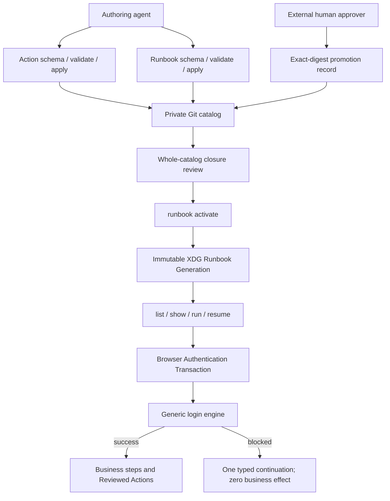
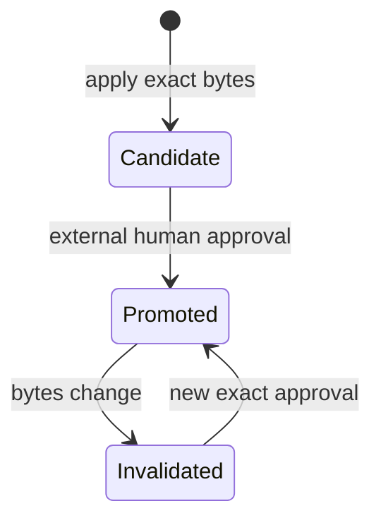
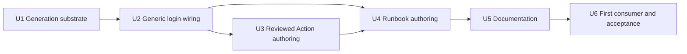

# feat: Private Runbook activation and authoring front doors

## Goal Capsule

- **Objective:** Deliver one agent-readable Browser Use surface that authors Reviewed Actions and complete Runbook Drafts into a private Git catalog, activates a reviewed complete catalog into an immutable XDG Runbook Generation, and executes only the selected generation.
- **Authority:** ADRs 0031-0033 define catalog, authoring, activation, and promotion boundaries. Existing runbook, action, auth, Shared Browser Use Run, and facade modules remain code owners.
- **Execution profile:** Build dependency-ordered vertical slices. Start each feature-bearing slice with the refusal and lifecycle tests that prove its safety boundary.
- **Stop conditions:** Stop for any design that lets packaged runtime mutate source, lets an agent promote executable action bytes, permits partial activation, exposes credentials, or restores runtime fallback after cutover.
- **Tail ownership:** Implementation, review, and landing remain outside this planning run.

---

## Product Contract

### Summary

Add permanent `browser-use runbook` and `browser-use action` authoring front doors around one private Git source and one immutable runtime projection. Agents discover model-owned schemas, validate complete documents, apply guarded source changes, inspect source-versus-active state, and request whole-catalog activation. Packaged runtime executes the selected Runbook Generation and refuses source authoring.

Runbooks declare `auth_context_ref`; the Browser Authentication Transaction resolves the approved Item Binding and the existing generic login engine owns username, password, multi-step, and OTP choreography. Reviewed Actions contain business JavaScript only. Agents may author and validate them, but only an external human promotion can make an exact digest referenceable by a Runbook.

**Product Contract preservation:** changed R1-R7 after ADRs 0031-0033 and four pre-build prototypes replaced flag-level CRUD, package-carried private assets, and mutable-runtime reads with complete-document authoring and generation activation. R8-R9 retain the original first-consumer and operator-documentation intent. R10-R14 make the accepted activation, authentication, action-promotion, and synchronization boundaries explicit.

### Problem Frame

The current CLI exposes only `runbook list`, `show`, and `run`. Authoring means editing JSON directly. Current discovery can resolve XDG overrides or package/repo runbooks, and `build-dist.ts` copies private runbooks and action assets into `dist`. The generic login engine and Reviewed Action execution guards exist, but the public Runbook path does not yet bind them into one authoring-to-execution lifecycle.

The required boundary is sharper:

- Private Git files are authoring source, not live runtime state.
- Explicit activation validates one complete catalog and selects one immutable XDG generation.
- Runtime uses only that selected generation after bootstrap cutover.
- Agents can author source documents and inspect state, but cannot self-promote executable code.
- Runbook login intent routes through the existing generic engine and Shared Browser Use Run identity.

### Actors

- A1. **Authoring agent** discovers schemas, validates drafts, applies guarded source changes, inspects drift, and requests activation.
- A2. **External human approver** reviews exact Reviewed Action bytes and creates the promotion authority that agents cannot mint.
- A3. **Browser Use runtime** resolves only the active Runbook Generation, preserves each Shared Browser Use Run's immutable generation binding, and fails closed on missing authority.
- A4. **Operator** owns the source checkout, Item Bindings, human-presence prompts, and any real-portal acceptance.

### Requirements

#### Complete-document authoring

- R1. `runbook schema --json`, `runbook validate --file`, and `runbook apply --file` use one complete Runbook Draft contract derived from the existing model and validator. Apply creates an absent record, returns `changed:false` for identical content, and requires the previously observed record digest before replacing different content.
- R2. A differing apply without an expected digest or with a stale digest refuses before write and identifies the current record digest needed for repair.
- R3. `runbook delete` requires the exact observed digest for a present record. Deleting an absent record is an idempotent `changed:false` no-op. Source deletion does not change active runtime until a later activation.
- R4. Every Runbook validation and apply uses `parseRunbookRecord` then `validateRunbook`; unresolved, absent, unpromoted, or stale Reviewed Action references refuse before catalog mutation.
- R7. Runbook Drafts contain no secret values, login steps, inline JavaScript, or 1Password item details. They may carry non-secret `auth_context_ref`, Item Binding slugs for non-login confidential fields, and Reviewed Action id plus exact digest.

#### Private source and runtime activation

- R5. Only the setup-owned source-checkout front door may mutate the Private Runbook Catalog and Reviewed Action source. Packaged invocation refuses mutation with a typed repair path.
- R10. `runbook activate` reviews and activates the complete Private Runbook Catalog plus referenced promoted-action closure. It requires the reviewed whole-catalog digest, proves catalog and action bytes belong to one Git commit, ignores unrelated working-tree dirt, and refuses drift before staging or selection. Activation also refuses while any prior-generation mutation-capable run is nonterminal; retained read-only resumes remain allowed.
- R11. Activation stages an immutable XDG Runbook Generation, then atomically selects it. First activation bootstraps cutover; reactivating the active digest is a no-op; a later digest retains the prior generation. After cutover, missing or corrupt active state returns typed `activation-required` repair with zero repo, package, or compatibility-XDG fallback.
- R14. Source-checkout `runbook list` and `show` expose the current source-catalog digest, active generation digest and epoch, record digest, a catalog-level `in-sync` or `activation-required` status, and a record-level `in-sync`, `new-pending-activation`, or `deletion-pending-activation` status. Invalid or unreadable source entries surface as typed activation blockers rather than disappearing. Packaged reads expose active-generation provenance and mark the current source view unavailable; they never read or imply knowledge of current source bytes.

#### Generic authentication and Reviewed Actions

- R12. A Runbook carrying only `auth_context_ref` enters the existing generic login engine, preserves Shared Browser Use Run and handoff identity, and dispatches its first business step only after authentication succeeds. Any blocked, ambiguous, or human-presence result produces zero business dispatch and one typed continuation.
- R13. The action front door exposes machine-readable schema, validation, guarded source apply, and promotion-state reads. Apply creates an unpromoted content-addressed candidate and never overwrites signed promotion history. Only an OS-isolated, presence-backed human approval broker whose signing authority is unavailable to the agent process may promote exact bytes. Promotion binds the source commit and cannot override mechanically prohibited capabilities. Source byte changes invalidate promotion for future activation but do not rewrite immutable active generations. Runbook reference succeeds only for exact promoted digest, matching origin, mechanically audited capability/effect/containment, and non-credential behavior.

#### CLI and first consumer

- R6. Every new command stays on the `@side-quest/cli-command-facade` lane. Discovery metadata, help, parser acceptance, structured results, diagnostic codes, and runtime handlers cannot drift.
- R8. Author the private read-only UniFi `login-screen-verify` Runbook through the complete-document front door. It opens the observed `/login` URL, verifies that URL, captures a fresh interactive snapshot, and contains no credential binding or login mutation.
- R9. Document Runbook and Reviewed Action authoring, activation, synchronization states, human promotion, and the existing Item Binding custody sequence without echoing secrets.

### Acceptance Examples

- AE1. Given no source Runbook exists, when a valid complete draft is applied, then one catalog record is created and reports `new-pending-activation` without changing runtime.
- AE2. Given a source Runbook exists, when identical bytes are applied, then the command returns `changed:false`; when different bytes arrive without the current record digest or with a stale digest, then it refuses and leaves source unchanged.
- AE3. Given a source Runbook was deleted with its exact digest, when runtime still uses a generation containing it, then `show` reports `deletion-pending-activation` and execution remains pinned until a later activation.
- AE4. Given a reviewed catalog digest and complete promoted-action closure, when the first activation succeeds, then one immutable generation becomes active. Repeating the same activation is a no-op. Selecting a later generation retains the prior one.
- AE5. Given activation drift, incomplete action closure, a stale compare-and-swap epoch, or interruption before pointer commit, when activation runs, then no partial generation becomes authoritative and the prior generation remains selected.
- AE6. Given a Runbook with `auth_context_ref`, when generic authentication succeeds, then the same run identity resumes and the first business step dispatches exactly once. An ambiguous login screen yields `human-identity-attestation-required` and zero business effect.
- AE7. Given an agent-authored Reviewed Action candidate, when no verifier-backed human promotion exists, its bytes or source commit change, or its code uses a prohibited capability, then source reference and future activation refuse that candidate. Execution and resume pinned to an immutable active generation continue validating its sealed promotion authority. Exact promoted bytes with permitted capabilities at the declared origin pass.
- AE8. Given a public build or package dry run, when its payload is inspected, then runtime code and schemas are present and private runbooks, action assets, source registries, approval records, and credentials are absent.

### Success Criteria

- Agents can discover, validate, apply, inspect, and repair authoring state from structured CLI output without hand-editing schema details.
- Runtime execution and resume use immutable generation identity, never mutable source or fallback paths.
- Human approval remains the sole promotion authority for executable action bytes.
- Source-versus-active drift is visible before activation and cannot be mistaken for live runtime state.
- All pre-build prototype claims become production tests or post-build acceptance gates.

### Scope Boundaries

**In scope:** Runbook Generation activation and cutover; generic-login product wiring; Reviewed Action authoring plus external-human promotion boundary; complete-document Runbook authoring; list/show synchronization state; private-asset package exclusion; docs; one private UniFi read-only consumer; localhost Agent Chrome acceptance.

**Human-only:** Reviewed Action promotion; passwords and OTP values; OAuth consent; CAPTCHA; biometrics; terms acceptance; platform permission prompts; ambiguous identity attestation; real-portal mutations.

**Deferred to follow-up:** emergency runtime revocation of an already active Reviewed Action; Reviewed Action deletion; interactive authoring wizard; alternate user-data authoring roots; per-service activation; automatic activation; portal-specific login branches; deletion of retained prior generations; explicit rollback command; legacy source deletion; real-portal sign-in or mutation beyond operator-approved acceptance.

**Outside this plan:** changes to `browser-connect`, Warm Chrome proof, Browser Adapter discovery, 1Password secret retrieval mechanics, router configuration, or public package publication.

---

## Planning Contract

### Key Technical Decisions

- KTD1. **Keep every command on the facade-backed lane.** Each vertical slice adds its contract, parser rule, handler, structured result, diagnostics, help, and drift proof together. Rejected: a bespoke parser or an advertised command without a live handler.
- KTD2. **Use one private Git authoring source and one immutable XDG execution source.** Source checkout mutation is reviewable and portable; XDG generations are complete runtime snapshots. Rejected: `build-dist` as activation, mutable XDG authoring, or direct runtime reads from repo/package files.
- KTD3. **Derive authoring schemas from model owners.** Reuse `parseRunbookRecord`, `validateRunbook`, `actionAssetDigest`, `actionDigestIsValid`, and `auditActionEffectClass`. Rejected: CLI-local schemas, digests, or effect inference.
- KTD3b. **Expose source and active truth explicitly.** Catalog reads anchor to the private source; execution reads anchor to the selected generation; list/show project both digests and their synchronization state. Rejected: a store-first resolver that silently chooses one view.
- KTD4. **Use complete-document optimistic concurrency.** Apply replaces only with the observed record digest; delete removes only with that digest; identical and absent operations are no-ops. Rejected: field patches, clear flags, unguarded overwrite, and force-only delete preview semantics.
- KTD5. **Keep login generic.** `auth_context_ref` selects the Browser Authentication Transaction; the existing login engine observes page shape. Runbooks and actions never encode login choreography.
- KTD6. **Separate action authoring from cryptographic human promotion.** Agents author and validate candidates. An OS-isolated, presence-backed broker holds the promotion signing authority and emits an offline-verifiable receipt binding source commit, exact bytes, origin, mechanically audited capabilities/effect, schemas, postcondition, and approval reference. Agent-visible caller labels and metadata remain audit-only. Source changes are prospective: they cannot alter authority already sealed into an immutable active generation. Rejected: self-promotion, unsigned approval data, and inline Runbook JavaScript.
- KTD7. **Activate one commit-tree closure.** Resolve one full Git commit object, reject unsupported object types, and load every catalog, action, and promotion byte from that commit tree. Derive the reviewed closure digest and staged generation from those exact bytes. Working-tree state is drift reporting only. A reviewed whole-catalog digest gates stage-then-atomic-select; partial service activation and action-incomplete generations refuse before selection.
- KTD8. **Pin and revalidate complete immutable generation authority.** New runs bind generation manifest, catalog, Runbook, action-registry, referenced action, and promotion digests plus activation epoch, inputs, item ordering, target scope, and postcondition under the same activation barrier that resolves the active pointer. Resume revalidates every pinned component and never acquires a newer generation by fallback.
- KTD9. **Sequence prerequisites by runtime authority.** Build the fail-closed generation and activation substrate, then generic-login wiring, then Reviewed Action authoring and promotion, then Private Runbook authoring. Perform bootstrap cutover only after U3/U4 close the real catalog. This preserves the prototype-backed build order without activating forgeable authority.

### High-Level Technical Design

Authoring and execution authority:



Activation sequence:

```mermaid
sequenceDiagram
  participant Author as Authoring agent
  participant Source as Private catalog
  participant Activate as Activation engine
  participant Stage as XDG generation store
  participant Pointer as Active pointer
  Author->>Source: Observe complete catalog digest
  Author->>Activate: activate(expected digest)
  Activate->>Source: Lock, verify Git provenance and action closure
  Activate->>Stage: Write immutable staged generation
  Activate->>Stage: Verify staged bytes and digest
  Activate->>Pointer: Atomic compare-and-swap selection
  Pointer-->>Author: Active digest, epoch, previous generation
```

Reviewed Action authority lifecycle:



### Open Questions

All are deferred to named implementation evidence and do not change product scope:

- **U1:** Define the real catalog content-addressing scheme and canonical byte order. It must be deterministic, collision-resistant, and close over referenced action bytes.
- **U1:** Define the Git provenance proof that binds catalog and referenced action bytes to one commit while ignoring unrelated dirt.
- **U1:** Prove the active pointer uses a genuine atomic rename or equivalent compare-and-swap on the admitted XDG filesystem.
- **U1:** Prove the actual `dist` and packed tarball exclude every private Runbook, action asset, source registry, and approval record.
- **U3/U4:** Define the canonical private-source root and setup-owned checkout admission that let authoring mutate the intended catalog without treating current working directory as authority.
- **U3:** Select the durable private promotion-registry location and the external-human write mechanism. No agent-callable self-promotion route may exist.
- **U6:** Complete post-build Agent Chrome execution acceptance for a newly authored action and the public `auth_context_ref` route.

### Sequencing



---

## Implementation Units

### U1. Runbook Generation activation substrate

- **Goal:** Build the fail-closed generation, activation, and active-only runtime substrate without performing bootstrap cutover before real promotion authority exists.
- **Requirements:** R5, R10, R11, R14; AE3-AE5, AE8.
- **Dependencies:** none.
- **Files:** new `skills/browser-use/src/browser-use-private-runbook-catalog.ts`; new `skills/browser-use/src/browser-use-private-runbook-catalog.test.ts`; new `skills/browser-use/src/browser-use-runbook-generation.ts`; new `skills/browser-use/src/browser-use-runbook-generation.test.ts`; `skills/browser-use/src/browser-use-runbook.ts`; `skills/browser-use/src/browser-use-locks.ts`; `skills/browser-use/src/browser-use-store.ts`; `skills/browser-use/src/browser-use-retention.ts`; `skills/browser-use/src/browser-use-paths.ts`; `skills/browser-use/src/browser-use-paths.test.ts`; `skills/browser-use/src/browser-use-schemas.ts`; `skills/browser-use/src/build-dist.ts`; `skills/browser-use/src/command-contract.ts`; `skills/browser-use/src/browser-use-parser.ts`; `skills/browser-use/src/browser-use.ts`; `skills/browser-use/src/browser-use-wave3-dispatch.test.ts`; `scripts/command-entrypoint.integration.test.ts`; affected platform, process-boundary, parser, facade, and package tests.
- **Approach:** Build one vertical slice from `runbook activate` contract through immutable storage and active-generation resolution. Give one private-catalog module ownership of source-root admission, canonical record bytes, closure scans, digest, Git provenance, catalog lock, apply, and delete. Resolve one full commit object and read the closure from that commit tree; reject symlinks, submodules, filters, non-blob objects, and index/worktree substitution. Treat working-tree comparison only as drift reporting. Stage with exclusive no-follow creation under admitted XDG data, validate owner/mode/type for every descendant, fsync and verify the full manifest, then update selection and activation epoch under one activation lock so run creation cannot observe a mismatched pair. Keep bootstrap cutover gated until U3/U4 provide verifier-backed promotions and a complete valid catalog; U6 performs the cutover. Populate the existing immutable run-execution binding when a Shared Run is created. Runtime and resume revalidate every pinned generation component against the trusted manifest. Make source-checkout list/show project source and active digests; packaged reads project active provenance and `source_unavailable`. Bump affected result-contract versions. Remove copied and embedded private bytes from the runtime dependency graph, then prove `dist` and package exclusion with private canaries and known digests.
- **Execution note:** Start with characterization tests for the current active-generation/compat-XDG/shipped-base resolver, then write failing cutover and no-fallback tests before changing resolution.
- **Patterns to follow:** existing active-generation seam in `browser-use-runbook.ts`; file locks in `browser-use-locks.ts`; durable writes in `browser-use-store.ts`; content-addressed action mechanics in `browser-use-runbook-actions.ts`; facade contract owner in `command-contract.ts`.
- **Test scenarios:**
  - Before U3 supplies verifier-backed promotion, activation of any action-bearing closure refuses rather than trusting unsigned source data.
  - Covers AE4. With a test verifier, first activation stages and selects generation A; repeat activation of the same reviewed digest returns `changed:false`.
  - Covers AE4. A later complete digest selects generation B and retains A as previous.
  - Covers AE5. Stale reviewed digest, incomplete action closure, invalid source record, Git provenance mismatch, and stale activation epoch refuse before selection.
  - Source-path replacement between proof and stage, symlink, submodule, filter, and index/worktree mismatch refuse because staged bytes come from the resolved commit tree.
  - Covers AE5. Interruption before pointer commit leaves the prior active pointer authoritative; concurrent activators select at most one valid next epoch.
  - Activation refuses while a prior-generation mutation-capable run is nonterminal; retained read-only resume remains pinned and allowed.
  - Crash injection at each stage, verification, selection, and epoch boundary recovers one internally consistent generation/epoch pair before admitting a new run.
  - Malicious temp symlink, generation-directory substitution, pointer tamper, and post-activation byte tamper refuse before selection, execution, or resume.
  - Post-cutover missing or corrupt active generation returns typed `activation-required` and records zero reads from repo, `dist`, or compatibility XDG.
  - List/show distinguish all four synchronization states and report the same active generation, digest, and epoch runtime resolves.
  - Fresh runs persist the selected generation id, epoch, Runbook digest, and action-registry digest; resumes reject unavailable or drifted retained authority.
  - A fresh-run-versus-activation race either commits the complete old binding under the barrier or retries wholly against the new generation; it never compiles one generation and persists another.
  - Independent tamper of the manifest, catalog, Runbook, registry, referenced action, or promotion receipt refuses resume.
  - Covers AE8. `dist` and packed payload contain runtime/schema assets and zero private catalog or promotion assets.
  - Private canaries and known action digests are absent from compiled JavaScript and the tarball, not only absent as file paths.
  - Packaged `runbook activate` refuses with the setup-owned source-checkout repair route; packaged schema, validate, reads, run, and resume remain available where their required inputs exist.
- **Verification:** Generation storage, activation, resolver, packaging, process-boundary, facade, parser, and anti-drift tests pass. A poison-path test proves runtime cannot read retired roots.

### U2. Generic login-engine product wiring

- **Goal:** Route `auth_context_ref` through Item Binding lookup and the existing generic login engine while preserving one Shared Browser Use Run.
- **Requirements:** R7, R12; AE6.
- **Dependencies:** U1, U2.
- **Files:** new `skills/browser-use/src/browser-use-runbook-auth.ts`; new `skills/browser-use/src/browser-use-runbook-auth.test.ts`; `skills/browser-use/src/browser-use-runbook.ts`; `skills/browser-use/src/browser-use-login-engine.ts`; `skills/browser-use/src/browser-use-auth-bindings.ts`; `skills/browser-use/src/browser-use-auth-provider.ts`; `skills/browser-use/src/browser-use-auth-transaction.ts`; `skills/browser-use/src/browser-use-auth.ts`; `skills/browser-use/src/browser-use-run-model.ts`; `skills/browser-use/src/browser-use-runs.ts`; `skills/browser-use/src/browser-use-task-run.ts`; `skills/browser-use/src/browser-use.ts`; `skills/browser-use/src/browser-use-wave3-dispatch.test.ts`; corresponding login-engine, runbook, auth-binding, Shared Run, task-run, and process-boundary tests.
- **Approach:** Validate `auth_context_ref` against the auth-owned closed vocabulary before source write, activation, or run creation. Resolve `(service_id, auth_context_ref)` against the approved Item Binding; never hardcode the prototype's `interactive-login` value. Enter the Browser Authentication Transaction through the existing run integration Port after target binding and dispatch-lease acquisition but before business execution. Persist every auth transition before submit or continuation. On restart, use the auth-owned restart reducer; a crash after submission becomes unknown post-submit state. Preserve run id, handoff evidence, target proof, generation binding, and compare-and-swap revision across authentication. Dispatch business steps only after fresh actual-target origin proof and immediate revalidation of an auth-owned authenticated-state attestation. Text heuristics alone never authorize `ready`; distinguish a verified pre-existing session from a post-submit transition. Convert ambiguity, challenge, binding failure, origin drift, wrong identity, stale observation, and attestation failure into one typed continuation without business dispatch. Migrate existing private Runbook auth-context values through the same validation path.
- **Execution note:** Start with the P1 positive and planted-near-miss acceptance as failing integration tests around the real public route.
- **Patterns to follow:** `runBrowserUseLoginEngine` in `browser-use-login-engine.ts`; `matchItemBinding` in `browser-use-auth-bindings.ts`; `BrowserUseRunIntegrationPort` and `createRunIntegrationPort`; existing write-ahead and resume guards.
- **Test scenarios:**
  - Covers AE6. A Runbook with only `auth_context_ref` enters the generic engine, keeps the same run/handoff identity, and dispatches the first business step exactly once after success.
  - Combined, password-only, unlabelled multi-step, and OTP fixtures succeed without portal-specific branches.
  - An initial page containing generic signed-in words such as “Welcome” or “Dashboard” does not authorize business dispatch without fresh origin and authenticated-state proof.
  - Moved targets, post-submit redirects, stale snapshots, and wrong-identity sessions refuse or require attestation with zero business dispatch.
  - Ambiguous input, human challenge, binding absence/drift, wrong origin, stale run revision, and failed attestation return one typed continuation and zero business dispatch.
  - Crash before login submit resumes safely; crash after submit-before-outcome becomes unknown; crash after ready commit-before-business revalidates attestation; crash after business write-ahead never redispatches blindly.
  - After activation advances, a retained read-only run resumes against its generation; a nonterminal prior-generation mutation-capable run blocks activation; unavailable retained authority refuses without current-generation fallback.
- **Verification:** Login-engine, auth, Shared Run, runbook integration, and Agent Chrome fixture gates pass; leak scans show no credential values in run state, results, diagnostics, or receipts.

### U3. Reviewed Action authoring and promotion boundary

- **Goal:** Let agents author and validate business JavaScript while an external human remains the sole promotion authority.
- **Requirements:** R5, R7, R13; AE7.
- **Dependencies:** U1.
- **Files:** new `skills/browser-use/src/browser-use-reviewed-action-authoring.ts`; new `skills/browser-use/src/browser-use-reviewed-action-authoring.test.ts`; new `skills/browser-use/src/browser-use-reviewed-action-approval.ts`; new `skills/browser-use/src/browser-use-reviewed-action-approval.test.ts`; `skills/browser-use/src/browser-use-runbook-actions.ts`; `skills/browser-use/src/browser-use-runbook-actions.test.ts`; `skills/browser-use/src/browser-use-auth-approval.ts`; private `skills/browser-use/actions/`; `skills/browser-use/src/command-contract.ts`; `skills/browser-use/src/browser-use-parser.ts`; `skills/browser-use/src/browser-use.ts`; affected facade, parser, platform-contract, process-boundary, and secret-scan tests.
- **Approach:** Expose `action schema --json`, `validate --file`, `apply --file`, and promotion-state reads. Derive digest and effect from shipped action mechanics. Before persistence, enforce a closed capability model that rejects dynamic code/property access, credential-field reads, cookies/storage, network APIs, navigation, submission, and indirect aliases that escape the reviewed business-action vocabulary; human approval cannot override these prohibitions. Apply writes an unpromoted private-source candidate and uses record-digest concurrency. Keep promotion on an OS-isolated presence-backed broker with offline verification of signed exact facts, following the structural boundary in `browser-use-auth-approval.ts`; the agent process cannot access its signing authority. Caller labels, `approver_ref`, and operator audience metadata remain audit-only and cannot promote. Bind source commit, exact bytes, origin, audited capabilities/effect, schemas, postcondition, and approval reference. Verify the receipt during apply closure, activation, execution, and resume. Replace the shipped-action seam with the active-generation action seam from U1.
- **Execution note:** Start with a candidate lifecycle test and the self-promotion refusal before persistence work.
- **Patterns to follow:** `actionAssetDigest`, `actionDigestIsValid`, `auditActionEffectClass`, generation-scoped `resolveReviewedAction`, and promotion receipt guards in `browser-use-runbook-actions.ts`.
- **Test scenarios:**
  - Schema output includes wrapper, origin, audited effect, input/result schemas, postcondition, and a minimal example that validates unchanged.
  - Valid observational bytes validate as `read`; credential-bearing or login-capable bytes refuse with precise repair.
  - Dynamic-code, alias, computed-property, credential-field, cookie/storage, network, navigation, and form-submission evasion fixtures refuse mechanically; human approval cannot override the refusal.
  - Apply writes one unpromoted exact digest; identical apply is a no-op; missing/stale replacement digest refuses.
  - Agent/self promotion, forged caller metadata, replayed approval, and approval for different bytes or origin refuse. Presence-backed external-human promotion binds exact facts without secrets.
  - Changed bytes invalidate promotion and may change audited effect. Old, absent, unpromoted, stale, wrong-origin, and auth-capable references all refuse before Runbook apply or activation.
  - Source byte changes make the new candidate unpromoted while the immutable active generation retains its old signed authority until a later activation or separate emergency revocation.
  - Applying a candidate cannot overwrite, truncate, or forge prior signed promotion receipts.
- **Verification:** Action authoring, action resolution, facade, parser, secret-scan, and package-exclusion gates pass. U6 owns real Agent Chrome execution of a newly authored action.

### U4. Complete-document Private Runbook authoring

- **Goal:** Provide agent-readable Runbook schema, validation, guarded apply/delete, and explicit catalog-versus-active reads.
- **Requirements:** R1-R7, R14; AE1-AE3, AE7.
- **Dependencies:** U1, U2, U3.
- **Files:** new `skills/browser-use/src/browser-use-runbook-authoring.ts`; new `skills/browser-use/src/browser-use-runbook-authoring.test.ts`; `skills/browser-use/src/browser-use-runbook-model.ts`; `skills/browser-use/src/browser-use-runbook.ts`; `skills/browser-use/src/command-contract.ts`; `skills/browser-use/src/browser-use-parser.ts`; `skills/browser-use/src/browser-use.ts`; affected facade, parser, platform-contract, process-boundary, front-door, and anti-drift tests.
- **Approach:** Expose model-derived schema and accept one complete document for validate/apply. Before normalization or digesting, reject duplicate JSON keys and enforce exact recursive allowed-key sets so ignored fields cannot hide scripts, secrets, or approval metadata. Resolve the setup-owned private source without using current working directory as authority. Apply creates, no-ops, or digest-guarded replaces. Delete uses the same observed-digest guard. Validate the complete Reviewed Action closure before write. Project source and active facts with the four synchronization states. Packaged calls remain read/execute-only and return the source-checkout repair route.
- **Execution note:** Start with the create/no-op/guarded-replace lifecycle and unresolved-action refusal as failing integration tests.
- **Patterns to follow:** two-pass Runbook parser/validator in `browser-use-runbook-model.ts`; active-generation projection from U1; facade contract and redaction helpers.
- **Test scenarios:**
  - Covers AE1-AE2. Apply absent, identical, differing without digest, stale digest, and matching digest produce the required outcomes without unintended writes.
  - Covers AE3. Delete wrong digest refuses; matching digest removes source only; absent delete is a no-op and active generation remains unchanged.
  - Incomplete documents name every missing field and repair. Valid schema example validates unchanged.
  - Missing, unpromoted, stale, wrong-origin, or auth-capable action closure refuses before source write.
  - Packaged apply/delete refuse. A source-checkout invocation outside the owning checkout also refuses rather than guessing from CWD.
  - List/show report catalog-level `in-sync`/`activation-required` separately from record-level `in-sync`/`new-pending-activation`/`deletion-pending-activation`, with both catalog and active digests.
  - Invalid or unreadable source records remain visible as typed activation blockers and never disappear from list output.
  - Unknown `auth_context_ref` values refuse before source write, activation, or run creation.
  - Runbook document containing secret values, login steps, inline JavaScript, or credential-shaped targets refuses without echoing offending bytes.
  - Duplicate and unknown keys at the root, nested schema, step, target, and postcondition levels refuse before normalization; ignored fields can never disappear from the digested document.
- **Verification:** Authoring, model, resolver, facade, parser, process-boundary, secret-scan, and anti-drift tests pass.

### U5. Authoring, activation, and custody documentation

- **Goal:** Make the complete lifecycle operable without copying hidden contracts into prose.
- **Requirements:** R5, R9, R14.
- **Dependencies:** U1-U4.
- **Files:** new `docs/runbooks/authoring-runbooks.md`; `skills/browser-use/SKILL.md`; `skills/browser-use/CONTEXT.md` only if shipped terminology differs from the accepted glossary.
- **Approach:** Document discovery-first authoring, whole-document validation/apply/delete, observed digest repair, action promotion handoff, catalog-versus-active statuses, activation, packaged-runtime refusal, and Item Binding custody. Link code-owned schemas and CLI help instead of copying their fields, flags, status machine, or result envelopes. Name human-only boundaries and never include secret values.
- **Test scenarios:** Test expectation: none for prose. Verify links resolve, examples parse against the real facade, and terminology matches `skills/browser-use/CONTEXT.md`.
- **Verification:** Documentation checks and `setup sync --check --json` pass after the first-party skill link change.

### U6. First private Runbook and end-to-end acceptance

- **Goal:** Prove the production authoring-to-activation-to-execution path with one private consumer and one newly authored Reviewed Action.
- **Requirements:** R6, R8, R12-R14; AE4, AE6-AE8.
- **Dependencies:** U1-U5.
- **Files:** `skills/browser-use/runbooks/unifi/login-screen-verify/runbook.json`; focused localhost fixtures under `skills/browser-use/src/fixtures/`; new or extended end-to-end tests beside `browser-use-runbook-authoring.test.ts`, `browser-use-reviewed-action-authoring.test.ts`, and `browser-use-login-engine.test.ts`.
- **Approach:** Author the UniFi read-only Runbook through `schema` → `validate` → `apply`. Use localhost fixtures and dummy values to apply and promote a benign Reviewed Action through the real presence-backed authority, then author a Runbook with `auth_context_ref`. Activate the now-complete catalog, perform bootstrap cutover, confirm all fallback paths are disabled, and enter the generic engine through real Agent Chrome. Dispatch the business step only after auth success. Keep real-portal sign-in and mutation operator-gated and outside this unit.
- **Patterns to follow:** the four prototype receipts; current UniFi discovery receipt; `browser-connect connect agent-browser --json`; existing target-proof and fixture-server helpers.
- **Test scenarios:**
  - The UniFi Runbook is authored through the production front door, reports pending activation, becomes `in-sync` after activation, and is discoverable from the active generation.
  - Public `dist`/packed runtime lists and runs only activated XDG content and contains no private source bytes.
  - A newly authored and externally promoted benign action executes through Agent Chrome and returns its bounded postcondition result.
  - A Runbook carrying only `auth_context_ref` preserves run identity and dispatches exactly one business step after auth success.
  - The ambiguous near-miss returns `human-identity-attestation-required`, leaves the business counter at zero, and closes fixture tabs and processes.
- **Verification:** Fresh one-command product acceptance passes with real Agent Chrome, dummy credentials, localhost fixtures, no open tabs/processes, and no private or secret bytes in artifacts.

---

## System-Wide Impact

### Interfaces and entry points

- `runbook` gains `schema`, `validate`, `apply`, `delete`, and `activate`; `list`, `show`, `run`, and resume become generation-aware.
- `action` gains discovery, validation, guarded source mutation, and promotion-state reads. External-human promotion is not an agent capability.
- Facade contracts, parser, runtime driver, schemas, results, diagnostics, docs, and tests change as one contract surface.

### Data and state lifecycle

- Private Git source stores Runbook Draft records, action candidates, and human promotion records.
- XDG data stores immutable Runbook Generations and the atomic active/previous selection metadata.
- Shared Browser Use Runs pin immutable generation and action authority for resume.
- Source edits and deletes become visible drift, not immediate runtime changes.

### Failure propagation

- Validation, concurrency, promotion, provenance, closure, and activation failures return typed repair before write or browser dispatch.
- Failed activation preserves the prior active generation.
- Missing active authority never falls through to mutable or packaged bytes.
- Ambiguous authentication and possible mutation remain blocked/unknown with one continuation and no automatic retry.

### Agent parity and trust

- Agents and operators see the same source and active digests, synchronization state, promotion state, and structured repairs.
- Agents receive composable primitives. Runbooks own orchestration; action promotion remains human-only.
- Public packages expose runtime and schema capability without private operator knowledge.

---

## Risks & Dependencies

| Risk | Mitigation |
|---|---|
| Current resolver silently falls back to compatibility or shipped records | Characterize it, bootstrap one valid generation, then add poison-path tests before removing fallback |
| Activation interruption, pointer tamper, or path substitution exposes partial state | Use no-follow staged writes, verify the full manifest, select under one lock, and revalidate on execution/resume |
| Catalog digest or Git proof races mutable checkout bytes | Resolve one commit object and build the closure from its tree; treat the working tree only as drift evidence |
| Fresh run races activation or a live mutation crosses generations | Create the run binding under the activation barrier and refuse activation while prior-generation mutation-capable runs are nonterminal |
| Source changes appear live to agents | Project separate catalog and record statuses with current-source and active digests |
| Agent forges human promotion | Keep signing authority outside the agent process and verify signed exact facts at every authority boundary |
| Approved JavaScript reads credentials or exfiltrates data | Enforce a closed capability model before promotion; human approval cannot override prohibited capabilities |
| Changed action bytes retroactively alter active authority | Treat source changes as prospective; immutable generations retain sealed authority until later activation or explicit emergency revocation |
| Login text heuristic releases business work early | Require fresh origin proof and auth-owned attestation immediately before business dispatch |
| Ignored or duplicate Runbook fields hide forbidden content | Enforce recursive closed-world keys and duplicate-key refusal before normalization and digesting |
| Packed package leaks private catalog data through files or bundled constants | Scan `dist` and tarball with filenames, private canaries, and known digests |
| Resumed run acquires newer or tampered authority | Persist and revalidate the complete manifest/catalog/Runbook/action/promotion binding |

---

## Verification Contract

### Pre-build evidence to preserve

| Claim | Command | Receipt | Result |
|---|---|---|---|
| `auth_context_ref` routes through generic login and gates business dispatch | `bun run prototype:auth-context-generic-login-route` | `skills/browser-use/src/prototypes/2026-08-02-auth-context-generic-login-route/findings.md` | PASS on real Agent Chrome; positive and fail-closed near-miss |
| Complete-document Runbook authoring lifecycle | `bun run prototype:runbook-document-authoring` | `skills/browser-use/src/prototypes/2026-08-02-runbook-document-authoring-contract/findings.md` | PASS, 19/19 checks |
| Whole-catalog generation activation and cutover | `bun run prototype:runbook-generation-activation` | `skills/browser-use/src/prototypes/2026-08-02-runbook-generation-activation-contract/findings.md` | PASS, 8/8 checks |
| Reviewed Action authoring and promotion boundary | `bun run prototype:reviewed-action-authoring` | `skills/browser-use/src/prototypes/2026-08-02-reviewed-action-authoring-contract/findings.md` | PASS, 12/12 checks |

These receipts prove architectural coherence only. Production gates below must replace their scratch digest, filesystem, registry, routing, and package assumptions.

### Focused production gates

| Gate | Applies to | Done signal |
|---|---|---|
| `bun test src/browser-use-runbook-generation.test.ts` | U1 | activation, CAS, atomic selection, retention, drift, no-fallback, and sync-state scenarios pass |
| `bun test src/browser-use-login-engine.test.ts src/browser-use-runbook.test.ts src/browser-use-runs.test.ts` | U2 | auth route preserves run identity and blocks business effects until success |
| `bun test src/browser-use-reviewed-action-authoring.test.ts src/browser-use-runbook-actions.test.ts` | U3 | candidate, promotion, invalidation, reference, secret, and package-refusal scenarios pass |
| `bun test src/browser-use-runbook-authoring.test.ts src/browser-use-runbook.test.ts` | U4 | schema, validate, apply, delete, closure, and four-state projection pass |
| `bun test src/browser-use-parser.test.ts src/command-contract-no-dangle.test.ts src/browser-use-front-door.test.ts src/browser-use-platform-contract.test.ts` | U1-U4 | discovery, help, parser, runtime, result, and diagnostic surfaces stay aligned |

### Package and workspace gates

- `bun run typecheck` reports zero errors in `skills/browser-use`.
- `bun run build` and `bun run pack:dry-run` succeed, and the payload lists zero private Runbook, action, source-registry, or approval files.
- The full Browser Use test suite passes through the repository test runner.
- Secret, redaction, process-boundary, target-proof, and artifact-retention suites remain green.
- `setup sync --check --json` is healthy after any first-party skill source change.
- `git diff --check` is clean.

### Post-build acceptance

- Run the production localhost acceptance from U6 through `browser-connect connect agent-browser --json` against real Agent Chrome.
- Confirm identical run id before auth and business dispatch, zero business effect before auth success, exactly one effect after success, and zero effect on the ambiguous near-miss.
- Confirm a newly authored and externally promoted benign action executes from the active generation.
- Confirm all fixture tabs, servers, clients, and scratch generations close in cleanup paths.

---

## Definition of Done

- U1-U6 satisfy their requirements and test scenarios in dependency order.
- `runbook` authoring, activation, reads, execution, and resume use one facade-backed contract and one selected Runbook Generation.
- Reviewed Action candidates are agent-authorable; promotion remains external-human-only and exact-digest-bound.
- Runbook apply refuses incomplete action closure and secret/login content.
- Source and active truth are both inspectable; only active truth grants runtime authority.
- Post-cutover execution performs zero reads from repo, package, or compatibility-XDG Runbook/action roots.
- Public build and packed payload contain zero private catalog or promotion assets.
- The generic login route preserves Shared Browser Use Run identity and gates all business dispatch behind verified authentication.
- The UniFi private Runbook and localhost end-to-end fixture prove authoring, activation, and execution without real credentials or router mutation.
- All focused, package, workspace, browser, leak, and alignment gates pass.
- Abandoned experimental code and superseded compatibility branches are removed from the implementation diff; retained prototypes remain clearly marked as pre-build evidence.

---

## Sources & Research

- `docs/adr/0031-private-runbook-catalog-activates-a-runbook-generation.md`
- `docs/adr/0032-runbook-authoring-validates-and-applies-complete-documents.md`
- `docs/adr/0033-reviewed-actions-have-a-separate-authoring-front-door.md`
- `skills/browser-use/CONTEXT.md`
- `skills/browser-use/src/browser-use-runbook.ts`
- `skills/browser-use/src/browser-use-runbook-model.ts`
- `skills/browser-use/src/browser-use-runbook-actions.ts`
- `skills/browser-use/src/browser-use-login-engine.ts`
- `skills/browser-use/src/browser-use-auth-bindings.ts`
- `skills/browser-use/src/browser-use-run-model.ts`
- `skills/browser-use/src/browser-use-runs.ts`
- `skills/browser-use/src/command-contract.ts`
- `skills/browser-use/src/build-dist.ts`
- `docs/plans/2026-07-28-001-feat-browser-use-runbook-catalog-migration-plan.md`
