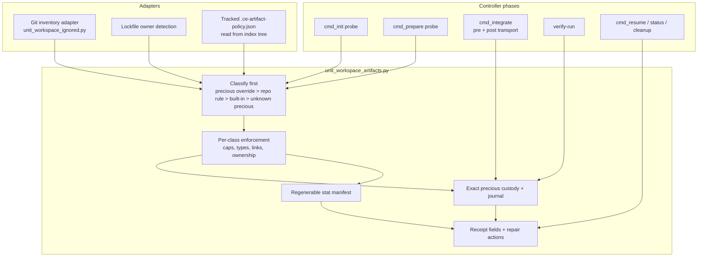
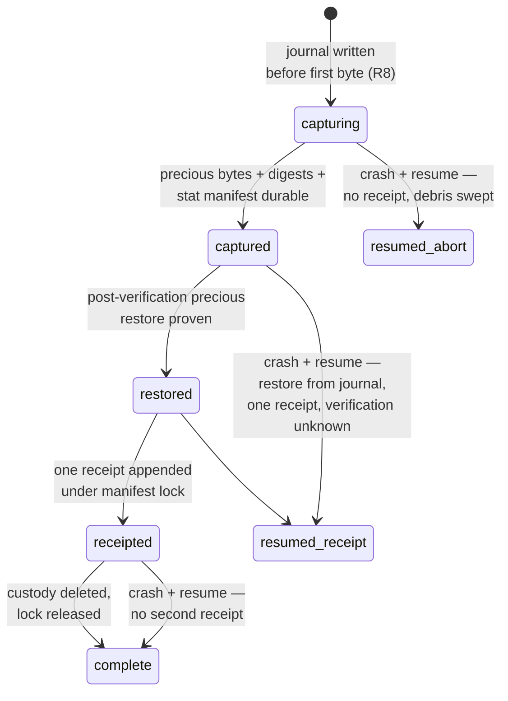

# ce-work Artifact Policy Module - Plan

**Target repo:** `EveryInc/compound-engineering-plugin` (fork of upstream `main`, baseline commit `82e6ae0` = PR #1302). All file paths below are relative to that repo unless marked `[config-repo]`, which means `nathanvale/claude-code-config`.

---

## Goal Capsule

- **Objective:** Implement the Artifact Policy Module across the full ce-work controller seam — advisory probes (init, prepare), authoritative transactions (integrate including the transport window, verify-run), crash resume, and receipt consumers — on a fork of upstream main.
- **Authority:** This plan > falsification evidence (`[config-repo] docs/research/2026-08-01-ce-work-artifact-policy/`) > upstream repo conventions (`AGENTS.md` in target repo). Product behavior disputes resolve to the R-IDs; implementation mechanism disputes resolve to the KTDs.
- **Stop conditions:** Do not open, push, or draft-publish a PR — the PR is user-gated (KTD2). Stop and report if evidence invalidates a session-settled KTD, or if upstream main moves under the branch in a way that changes the seam (new commits touching `skills/ce-work/scripts/`, `tests/skills/ce-work-*.test.ts`, `skills/ce-work/SKILL.md`, or `skills/ce-work/references/cross-model-execution.md`).
- **Execution profile:** Code implementation with tests, on a local fork clone. No changes to `nathanvale`'s installed plugin cache.
- **Tail ownership:** Ends with a green fork branch and a drafted (unpublished) PR description. Opening the PR, posting on issue #1300, and any local-cache carry are follow-up decisions owned by the user.

---

## Product Contract

### Summary

Replace the ce-work controller's whole-inventory ignored-file snapshot (512 entries / 64 MiB, refusing every warm JS checkout) with typed artifact policy: classify ignored paths first, give precious state exact proven custody, give regenerable trees detect-and-disclose with owner repair actions, and report both through one truthful receipt with crash-safe journaling and resume.

### Problem Frame

`integrate` and `verify-run` byte-copy every git-ignored file and refuse above hardcoded caps, so any checkout with `node_modules` installed cannot land work through the controller (issue #1300: 6,934 ignored files from one Bun install, 13.5x the cap; symlinks refuse independently of the caps). PR #1302 moved the refusal earlier (init/prepare probe with complete diagnostics) but kept the policy: warm checkouts still refuse, and users work from cold checkouts, wiping and reinstalling dependencies around every integration. The Artifact Policy Module design was validated by a falsification experiment against the 3.21.0 controller: 96/96 checks across a five-point crash matrix with resume, Bun link farms, pnpm external hardlinks, opaque nested repos, transport-added `.gitignore` reclassification, and introduced unknown precious state.

### Requirements

**Warm-checkout availability**

- R1. A warm checkout with a root `node_modules` above the current entry, byte, and symlink limits passes init, prepare, integrate, and verify-run.
- R2. Classification runs before every enforcement rule: entry caps, byte caps, entry-type rules, ownership checks, and hardlink rules apply per class, not to the whole inventory.
- R3. Classification precedence is: precious override > repository regenerable rule > built-in root `node_modules` rule > unknown precious.

**Custody and receipt truth**

- R4. Precious entries get exact custody — regular bytes, mode, mtime, symlink payload, parent directory modes — with restoration proven per entry; unprovable restoration blocks and retains recovery state.
- R5. Regenerable divergence is detected by stat manifest and disclosed with one owner repair action per affected root (e.g. `bun install --frozen-lockfile`); the controller never runs the repair and never claims restoration it did not perform (`bulk_restored: false` always).
- R6. An introduced unknown precious path is preserved and blocks the transaction; the controller never auto-deletes it.
- R7. The receipt embeds `artifact-policy.receipt.v1` fields (`precious_restoration_proven`, `precious_introduced`, `bulk_divergence_detected`, `bulk_restored`, `canonical_ignored_state_preserved`, `repair_actions`) and drops the `cleaned: true` claim; `canonical_ignored_state_preserved` is never true while divergence, an observation error, or unproven restoration remains.
- R18. Repair actions carry provenance: built-in lockfile-detected argv is emitted as runnable; repo-override `repair_argv` must match an allowlist of known package-manager install invocations or is emitted as inert display text flagged unverified — never as a runnable action.

**Crash safety**

- R8. A journal entry naming the custody root is durable before the first custody byte is copied.
- R9. Resume after any crash window restores precious state idempotently from the journal, emits exactly one receipt per transaction, records the verification result as unknown with a blocker forcing re-run (pre-commit windows), and deletes nothing outside controller-private directories.
- R10. Orphan custody debris is removed only by a reference-counted sweep of controller-private directories.

**Seam coverage**

- R11. Init and prepare advisory probes classify with the same policy as the authoritative path, and refusal reports keep complete diagnostics — per-class `blocking_counts`, `top_offenders`, `repair_route` — including an exact `regenerable_roots` override stanza when package-local `node_modules` trips the precious caps.
- R12. Integrate reloads policy and re-inventories after `cherry-pick --no-commit`; authoritative classification wins over the pre-transport probe; the receipt records both policy digests when they differ. A post-apply downgrade of any pre-transport precious path to regenerable does not waive custody: the path is captured this transaction, the downgrade is recorded in the receipt, and the relaxed classification takes effect from the next transaction.
- R13. `.ce-artifact-policy.json` is authoritative only when tracked, read from the post-apply index tree; an ignored working-copy version classifies as unknown precious and produces a track-the-policy-file repair hint.
- R14. Divergence consequence honors the policy's `disclose` (default) or `block` mode; `disclose` passes verification with the divergence in the receipt.
- R15. Status and resume surface any open artifact transaction; a non-complete journal makes the run unfinished for resume discovery; legacy receipts stay readable and are never rewritten.

**Compatibility**

- R16. Existing consumer contracts hold: receipts keep `verification_exit`, `accepted_units`, `canonical_head`, `evidence_digest`; attempt-row shapes stay TrustFailure-valid; refusal words and the soft `INTERRUPTED` fault convention are unchanged.
- R17. Documentation moves with the code: `skills/ce-work/references/cross-model-execution.md` steps 2, 3, 10 and the completed-run section, and the `skills/ce-work/SKILL.md` receipt language.

### Scope Boundaries

- **Deferred to Follow-Up Work:** opening the PR and posting the design summary on issue #1300 (user-gated); optional local plugin-cache carry until an upstream release ships; APFS copy-on-write custody fast path (see Alternatives); built-in recognition of package-local `node_modules` beyond the repo root.
- **Outside this change:** Windows link/timestamp semantics (classification refuses unsupported shapes; documented unsupported); attribution of crash-window mutations (disclosed as divergence, never attributed); package-manager store/link-farm topology (owners repair; the controller never installs); the terminalize-side worker-output ignored seam (`unit_workspace_jobs.py` ~line 1097) — a different seam sharing vocabulary, untouched here. Workers that install dependencies inside their own workspaces still refuse at that terminalize seam: this change unblocks the canonical checkout only, and the worker-side seam is deliberate follow-up territory.

### Sources

- Issue #1300 (problem statement, real-repo numbers, symlink refusal evidence, APFS `clonefile` spike results in comments).
- PR #1302 (advisory probe + diagnostic report shape now on main).
- `[config-repo] docs/research/2026-08-01-ce-work-artifact-policy/` — `prototype/` (validated module), `falsification/FALSIFICATION.md` (96/96 evidence, four production findings, residuals), `falsification/controller-wiring.patch` (seam shape; targets 3.21.0 — stale against main where the probe moved into `unit_workspace_ignored.py`).

---

## Planning Contract

### Key Technical Decisions

- KTD1. **Adopt the Artifact Policy Module boundary** — classification-first typed policy replacing whole-inventory snapshot custody. (session-settled: user-approved — chosen over keeping the capped whole-inventory snapshot: falsified-tested at 96/96 including crash resume; the cap can never admit a warm JS checkout.)
- KTD2. **Build on a fork of upstream main now; hold the PR.** (session-settled: user-directed — chosen over comment-first-then-build and over opening the PR immediately: build it anyway, no PR until the user says go.)
- KTD3. **Cover the full seam in one branch** — advisory probes, integrate including the transport window, verify-run, resume, receipt consumers. (session-settled: user-approved — chosen over a verify-run-only first slice: the deletion test only lands when one policy owner serves every phase.)
- KTD4. **Module layout:** new `skills/ce-work/scripts/unit_workspace_artifacts.py` owns policy load, classification, custody, journal, and receipt fields; `unit_workspace_ignored.py` shrinks to the Git inventory adapter plus a classification-aware probe facade that preserves the #1302 report shape (`blocking_counts`, `top_offenders`, `repair_route`). Rationale: the probe report and its stderr are test-pinned; the module boundary matches the validated design's deletion test.
- KTD5. **Receipt embedding, not replacement:** the artifact fields live in an `artifact` sub-object inside the existing verification receipt and the `UNIT_COMMITTED` body; the four consumer-critical fields (R16) stay top-level. Rationale: `unfinished_run`, `receipted_plan_wide_verification`, and attempt validation are load-bearing resume machinery.
- KTD6. **Custody and journal live in a dedicated `<run>/artifact-custody/` directory,** cleanup-gated on journal phase `complete`. Rationale: today's placements are unsafe — unit custody under `units/<uid>/result` is rmtree'd wholesale by `remove_finalized_artifacts`, and verify-run custody under `jobs/` has no cleanup owner; both break the never-delete-unproven-custody rule.
- KTD7. **Keep the upstream soft-fault convention:** `test_fault` raises `Operational("INTERRUPTED")`; the five new artifact fault points use it. No `os._exit` hard mode upstream. Rationale: hard-kill resilience is already proven by the external falsification run; a process-kill switch in `unit_workspace_state.py` needs its own justification and is not required for regression coverage of the resume contract.
- KTD8. **Built-in regenerable rule stays root-`node_modules`-only,** with lockfile-detected owner argv; monorepo package-local trees opt in through the tracked policy file, and the refusal report emits the exact override stanza (R11). Rationale: conservative default preserves unknown-precious safety; the repair stanza makes the monorepo path one paste away.
- KTD9. **Journal schema `artifact-transaction.phase.v1`:** `capturing → captured → restored → receipted → complete`, one file per transaction keyed `{run_id, unit_id|run, attempt_id, lock nonce}`, written atomically; acquire refuses when a non-complete journal belongs to a different transaction. Directory-restore proofs filter symmetrically around introduced precious paths on both the before and after snapshots (falsification finding 4).
- KTD10. **Expected-divergence rule:** under `disclose`, regenerable divergence never blocks. Under `block`, a root is exempt only when the tracked policy declares it per root (`divergence_expected_during_verification: true`) or when a built-in lockfile-detected owner's argv equals or prefixes the verification argv; repo-override `repair_argv` never qualifies for the argv exemption. Rationale: the literal argv test cannot see script-wrapped installs (`bun run ci`), and an attacker-editable override argv must not be able to neuter block mode.
- KTD11. **Stat-manifest detect-only for regenerable trees; no copy-on-write custody in v1.** Rationale: the issue-#1300 `clonefile` spike shows APFS byte custody is cheap (12k entries in 1.6 s at 0.92% real allocation), but it is macOS-only, hardlink identity semantics are unresolved, and detect-and-disclose already meets the receipt-truth bar cross-platform. Recorded in Alternatives for a follow-up.

### High-Level Technical Design

Module boundary and seam placement:

Journal state machine (per transaction, under `<run>/artifact-custody/`):

Integrate transport window sequencing: advisory classify → `cherry-pick --no-commit` → reload policy from post-apply index + re-inventory → authoritative classify governs capture, restore target, and receipt; on verification failure, precious restore targets the post-apply capture while `_restore_owned_verification` resets tracked state to pre-fold, and both digests appear in the receipt.

### Alternatives Considered

- **Tiered CoW byte custody for regenerable trees** (issue-#1300 spike): rejected for v1 per KTD11; revisit as a platform fast path once the module boundary lands — the policy interface would gain a custody-strategy field without changing classification or receipts.
- **Env-override for the caps:** withdrawn in issue #1300 by experiment — symlinks refuse independently of the caps; raising caps does not admit real `node_modules`.
- **Extending `unit_workspace_ignored.py` in place into the full module:** rejected — a 700-line mixed adapter/policy file recreates the coupling the deletion test scores against; the probe facade keeps test-pinned shapes while the module owns policy.

### Risks & Dependencies

- **Upstream drift:** maintainers have not engaged on #1300 beyond #1302; main may move under the branch. Mitigation: rebase before each unit lands; Goal Capsule stop condition covers seam-touching upstream commits.
- **Receipt consumer breakage:** ~12 `cleaned_paths` equality assertions across `tests/skills/ce-work-unit-workspace.test.ts` and `ce-work-cross-model-integration.test.ts` rewrite in the same units that change the shape (U5, U6, U8); resume-discovery fields are pinned by R16.
- **Test runtime:** `ce-work-unit-workspace.test.ts` is already the slowest CI file (~61 s). New coverage goes to a new test file for parallel isolation (`bun test --parallel`); heavyweight warm fixtures are sized to prove the caps without minutes of file churn.
- **Platform:** macOS case-insensitive path collisions can alias two inventory entries to one inode — classification detects case-folded duplicates and refuses precious custody for the colliding set. The repo's Windows CI job does not run ce-work tests, but scripts must resolve the Python interpreter per `docs/solutions/conventions/resolve-python-interpreter-not-python3.md` in tests.
- **Release process:** release-please owns versions (`package.json`, `.claude-plugin/*.json` synced by `bun run release:sync-metadata`); the branch must not hand-edit version metadata.

---

## Implementation Units

### U1. Fork bootstrap and baseline

- **Goal:** A local fork clone of `EveryInc/compound-engineering-plugin` on a feature branch from `main` (`82e6ae0` or later), with the existing suite proven green before any change.
- **Requirements:** enables all; cites KTD2.
- **Dependencies:** none.
- **Files:** none modified (clone + branch only).
- **Approach:** Fork under the `nathanvale` account, clone locally, branch `fix/ce-work-artifact-policy`. Run the ce-work suite and record the baseline result. Diff the falsification wiring patch (`[config-repo] docs/research/2026-08-01-ce-work-artifact-policy/falsification/controller-wiring.patch`) against this baseline and record the updated seam mapping as a local note for the U5/U6 work — the patch targets the 3.21.0 controller and is stale against main. Do not push a PR (KTD2).
- **Test scenarios:** Test expectation: none — setup unit; the baseline suite run is the verification.
- **Verification:** `bun test tests/skills/ce-work-unit-workspace.test.ts` and `bun run test` pass on the unmodified branch.

### U2. Policy module core

- **Goal:** `unit_workspace_artifacts.py` owns policy load, classification, per-class enforcement, and repair-action provenance (R2, R3, R11 diagnostics data, R13, R18).
- **Requirements:** R2, R3, R13, R18; KTD4, KTD8.
- **Dependencies:** U1.
- **Files:** `skills/ce-work/scripts/unit_workspace_artifacts.py` (new); `tests/skills/ce-work-artifact-policy.test.ts` (new).
- **Approach:**
  1. Port classification, precedence, policy loading, and enforcement from the validated prototype (`[config-repo] docs/research/.../prototype/artifact_policy.py`), rewritten to upstream idioms: stdlib-only, `Operational(word, message, detail)`, compact-JSON output.
  2. Policy source: built-in root `node_modules` rule with lockfile-owner detection (bun/pnpm/yarn/npm), plus tracked `.ce-artifact-policy.json` read from the index tree (`git cat-file` via the existing `git()` helper), never the worktree copy.
  2b. Repair-action provenance (R18): built-in owner argv is runnable; repo-override `repair_argv` validates against a package-manager install allowlist or is downgraded to inert display text flagged unverified.
  3. Enforcement produces per-class diagnostic counters compatible with the #1302 report vocabulary.
  4. Case-folded duplicate path detection refuses precious custody for colliding sets.
- **Patterns to follow:** module-level Python probe testing via the interpreter-resolution convention (`docs/solutions/conventions/resolve-python-interpreter-not-python3.md`); the `python3 -c` probe precedent at `tests/skills/ce-work-unit-workspace.test.ts:2137`.
- **Test scenarios:**
  - Precedence: a precious override inside `node_modules` classifies precious; a repo regenerable rule beats the built-in; unknown paths default precious.
  - Tracked policy from index wins over a differing worktree copy; an ignored (untracked) policy file classifies unknown-precious and yields the track-it repair hint.
  - Malformed policy file (bad schema, bad root, absolute/escaping root) refuses with named detail.
  - Lockfile detection maps bun.lock/bun.lockb/pnpm-lock.yaml/yarn.lock/package-lock.json to the right repair argv; no lockfile yields the placeholder owner.
  - Per-class caps: 5,000-entry regenerable inventory with 5 precious files passes; 600 precious files refuses on the precious entry cap only.
  - Case-collision fixture (two paths differing only by case) refuses precious custody with a named reason.
  - Repair-action provenance (R18): an allowlisted override argv stays runnable; an off-allowlist override argv is emitted inert and flagged unverified, never runnable.
- **Verification:** new test file green; no existing tests touched.

### U3. Custody engine and durable journal

- **Goal:** Exact precious custody, regenerable stat manifests, and the `artifact-transaction.phase.v1` journal with capturing-first durability and reference-counted debris sweep (R4, R5 detection, R8, R10).
- **Requirements:** R4, R5, R8, R10; KTD6, KTD9.
- **Dependencies:** U2.
- **Files:** `skills/ce-work/scripts/unit_workspace_artifacts.py`; `tests/skills/ce-work-artifact-policy.test.ts`.
- **Approach:**
  1. Custody: `O_NOFOLLOW` fd copies with dev/ino and size/mtime/ctime change detection (mirror the existing `_snapshot_ignored_artifacts` hardening), symlink payload custody without following targets, parent-mode capture, per-entry proven restore.
  2. Journal: one atomic JSON file per transaction under `<run>/artifact-custody/`, `capturing` entry naming the custody root written before the first byte (falsification finding 2); records policy digest, precious records, stat manifest, and lock identity.
  3. Sweep: custody directories not referenced by any journal are removable; referenced ones only after phase `complete`.
  4. Durability proof (R8): one harness-side hard-kill regression — the test spawns the controller as a child process, kills it at the mid-capture fault point, then asserts the journal exists with phase `capturing` naming the custody root and that resume restores precious state. No production kill switch; KTD7 holds.
- **Execution note:** Port test scenarios from the falsification harness (`[config-repo] docs/research/.../falsification/harness.py`) rather than inventing coverage; the harness names the exact mutations that must round-trip.
- **Test scenarios:**
  - Precious mutation during verification restores byte-exact (content, mode, mtime, symlink payload) with restoration proven.
  - Journal exists with phase `capturing` before any custody byte (assert via fault point injected after journal write, before copy).
  - Crash mid-capture (soft fault in the copy loop) leaves debris that the sweep removes only via the reference count; a journal-referenced custody dir survives the sweep.
  - Hard kill (controller child process killed from the test harness) mid-capture: the journal is already durable with phase `capturing`; resume restores precious state and sweeps debris.
  - Restore is idempotent: entries already matching their record are untouched (mtime unchanged on second restore).
  - External-hardlink precious file refuses custody before verification.
- **Verification:** new test file green.

### U4. Advisory seam: init and prepare probes

- **Goal:** `cmd_init` and `cmd_prepare` classify before enforcement so warm checkouts pass, while refusals keep the #1302 diagnostic report shape (R1 advisory half, R11).
- **Requirements:** R1, R2, R11; KTD4.
- **Dependencies:** U2.
- **Files:** `skills/ce-work/scripts/unit_workspace_ignored.py`; `skills/ce-work/scripts/unit_workspace_state.py`; `skills/ce-work/scripts/unit_workspace_jobs.py`; `tests/skills/ce-work-unit-workspace.test.ts`.
- **Approach:**
  1. `unit_workspace_ignored.py` becomes the inventory adapter plus probe facade: `require_ignored_snapshot_capability` classifies via the module, enforces per class, and renders the existing report keys (`inventory`, `blocking_counts`, `top_offenders`, `repair_route`, `effective_limits`) now scoped to the precious class, with regenerable roots summarized separately.
  2. Package-local `node_modules` refusals include the exact `regenerable_roots` override stanza in `repair_route` (KTD8).
  3. Init/prepare call sites keep their placement and words; only the classification behind them changes.
- **Test scenarios:**
  - Warm fixture (root `node_modules` with symlinks, over both caps) passes init and prepare.
  - 600 unknown-precious files still refuse at init with per-reason counts and offenders.
  - Monorepo fixture (`packages/app/node_modules`) refuses precious caps and the report carries a pasteable override stanza.
  - Round trip: pasting the emitted override stanza verbatim into a tracked `.ce-artifact-policy.json` makes the previously refusing monorepo fixture pass init.
  - Existing pinned probe tests (`ce-work-unit-workspace.test.ts:2075-2175`) updated: same words, same report keys, new per-class semantics.
- **Verification:** `bun test tests/skills/ce-work-unit-workspace.test.ts` green.

### U5. Authoritative seam: verify-run

- **Goal:** `_verify_run_locked` runs the artifact transaction — authoritative classify, capture, verify, proven restore, symmetric directory proof, embedded receipt — replacing whole-inventory snapshot/restore (R1, R4-R9, R14, R16).
- **Requirements:** R1, R4, R5, R6, R7, R8, R9 (journal side), R14, R16; KTD5, KTD6, KTD7, KTD9, KTD10.
- **Dependencies:** U3.
- **Files:** `skills/ce-work/scripts/unit_workspace_transaction.py`; `tests/skills/ce-work-artifact-policy.test.ts`; `tests/skills/ce-work-unit-workspace.test.ts` (assertion updates).
- **Approach:**
  1. Follow the falsification wiring (`[config-repo] .../falsification/controller-wiring.patch`) translated to main's shape: the preflight import comes from the module; custody parent moves to `<run>/artifact-custody/` (KTD6).
  2. Directory snapshots filter regenerable roots and introduced-precious ancestors symmetrically on before and after sides (falsification finding 4).
  3. Receipt keeps `verification_exit`, `accepted_units`, `canonical_head`, `evidence_digest` top-level and adds the `artifact` sub-object (KTD5); `VERIFIED_WITH_REGENERABLE_DIVERGENCE` passes under `disclose` (R14, KTD10).
  4. New soft fault points: `artifact-after-reclassify`, `artifact-during-precious-capture`, `artifact-before-precious-restore`, `artifact-after-restore-before-receipt`, `artifact-after-receipt-before-release` (KTD7).
- **Test scenarios:**
  - Warm fixture verify-run passes with divergence disclosed, precious restored, bun repair action emitted, `canonical_ignored_state_preserved: false`.
  - Clean fixture verify-run passes with `canonical_ignored_state_preserved: true` and no repair actions.
  - Introduced unknown precious file: blocked outcome, file preserved, truthful receipt, lock released, dispatchable after the user removes it.
  - Verification failure (exit 1): existing failure semantics hold with the artifact receipt embedded.
  - `block` mode: regenerable divergence blocks; a root carrying the policy's expected-divergence flag passes with disclosure; a repo-override root whose repair argv prefixes the verification argv still blocks; a built-in owner argv prefixing the verification argv is exempt (KTD10).
  - `block` mode with a script-wrapped install (verification is a wrapper script that runs the install): the expected-divergence flag exempts the root; without the flag it blocks (KTD10).
  - Resume-discovery still finds the run: `unfinished_run` matches the new receipt (R16).
- **Verification:** both test files green.

### U6. Authoritative seam: integrate and the transport window

- **Goal:** `cmd_integrate` runs the same artifact transaction with the transport window handled: advisory classify pre-cherry-pick, authoritative reload post-apply, pre-fold interplay on failure, crash windows around the canonical commit (R1, R12, R13; falsification residual closed).
- **Requirements:** R1, R12, R13, R7, R8, R9; KTD5, KTD6, KTD9.
- **Dependencies:** U3, U4, U5.
- **Files:** `skills/ce-work/scripts/unit_workspace_transaction.py`; `tests/skills/ce-work-artifact-policy.test.ts`; `tests/skills/ce-work-cross-model-integration.test.ts` (assertion update).
- **Approach:**
  1. Pre-cherry-pick probe stays advisory (fail-early UX); after `cherry-pick --no-commit`, reload policy from the post-apply index and re-inventory — authoritative classification governs capture, restore, and receipt (R12).
  2. On verification failure, `_restore_owned_verification` resets tracked state to pre-fold while precious restore targets the post-apply capture; the receipt records both policy digests when transport changed classification inputs.
  3. `UNIT_COMMITTED` body: `cleaned: true` replaced by the artifact receipt summary.
  4. Journal spans the existing `before-canonical-commit` / `after-canonical-commit-confirmed` windows so a post-commit crash leaves a resumable record.
- **Test scenarios:**
  - Transport commit adds a `.gitignore` rule: post-apply classification captures the newly ignored path as precious; receipt records the digest change.
  - Transport commit downgrades a pre-transport precious path to regenerable (adds a rule or drops an override): custody is still captured this transaction, the receipt records the downgrade, and the relaxed policy governs only the next transaction (R12).
  - Transport commit modifies `.ce-artifact-policy.json`: the post-apply tracked version governs (R13).
  - Warm fixture integrate commits successfully end-to-end.
  - Verification failure after transport: pre-fold tracked restore plus proven precious restore; receipt truthful.
  - Soft fault at `before-canonical-commit` and at `after-canonical-commit-confirmed` with an open journal: manifest state and journal agree on recovery ownership.
- **Verification:** suite green including the updated cross-model integration assertion.

### U7. Resume, status, and cleanup integration

- **Goal:** Crash recovery is first-class: `cmd_resume` replays the artifact transaction, status surfaces open transactions, cleanup is custody-safe, and retry-after-block works (R9, R10, R15).
- **Requirements:** R9, R10, R15; KTD6, KTD9.
- **Dependencies:** U5, U6.
- **Files:** `skills/ce-work/scripts/unit_workspace_lifecycle.py`; `skills/ce-work/scripts/unit_workspace_transaction.py`; `tests/skills/ce-work-artifact-policy.test.ts`; `tests/skills/ce-work-unit-workspace.test.ts`.
- **Approach:**
  1. `cmd_resume` branches (`restoring`/`integration-pending`/`integrated`/`verified`, and `resume_finalize_committed`) replay artifact resume before semantic restore proofs: restore precious from the journal, emit the single receipt with `verification_exit: null` plus a re-run blocker for pre-commit windows; post-commit, the recorded `mark-verified` evidence stands and the resume receipt records restoration only. This supersedes the pinned upstream behavior where a crashed plan-wide verification resumes to BLOCKED with the lock retained: the pending attempt transitions to receipt-recorded with verification unknown, the re-run blocker carries no lock retention, and the lock releases — the pinned resume-after-crash tests in `tests/skills/ce-work-unit-workspace.test.ts` are rewritten accordingly.
  2. `unfinished_run` treats a non-complete journal as unfinished; `cmd_status` lists open artifact transactions per unit and run-wide.
  3. `remove_finalized_artifacts` and `cmd_cleanup` refuse to delete a custody root whose journal is not `complete`; the reference-counted sweep runs during resume of the owning run.
  4. Retry after `BLOCKED_PRECIOUS_RESTORATION` requires the recovery blocker resolved and re-inventories live state — old custody bytes are never the new baseline. The retry entry point is owned by `unit_workspace_lifecycle.py`, mirroring its existing `resolve_unit_recovery_blockers`.
- **Test scenarios:**
  - Soft-fault crash at each of the five artifact points, then resume: precious intact, exactly one receipt (zero for pre-capture windows), lock released, second resume is a no-op, fresh verify-run succeeds.
  - Crash after receipt, before release: resume emits no second receipt.
  - Status during an open transaction shows it; after `complete` it does not.
  - Cleanup refuses on a non-complete journal; succeeds after `complete`.
  - Legacy manifest (receipt without `artifact` sub-object) resumes and reports without rewrite (R15).
- **Verification:** new test file green; full suite green.

### U8. End-to-end fixtures, consumer assertions, and docs

- **Goal:** The warm-checkout story is proven end-to-end at realistic shape, every `cleaned_paths`-era assertion reflects the new receipt, and the docs describe the typed-artifact behavior (R1, R17).
- **Requirements:** R1, R7, R17; all KTDs exercised.
- **Dependencies:** U4, U5, U6, U7.
- **Files:** `tests/skills/ce-work-artifact-policy.test.ts`; `tests/skills/ce-work-unit-workspace.test.ts`; `tests/skills/ce-work-cross-model-integration.test.ts`; `skills/ce-work/references/cross-model-execution.md`; `skills/ce-work/SKILL.md`. No module edits in this unit — assertion rewrites only; the shapes under test are owned by U2–U7.
- **Approach:**
  1. Warm E2E fixture: generated root `node_modules` over both caps with `.bin` symlinks and a package-local tree, driven through init → prepare → integrate → verify-run in one flow.
  2. Sweep the remaining `cleaned_paths` / `cleaned: true` assertions (~12 sites) to the new receipt shape.
  3. Update `cross-model-execution.md` steps 2, 3, 10 and the completed-run section; update the `SKILL.md` receipt sentence: capability refusal language becomes classification language, repair routes name owner argv.
  4. Draft the PR description (upstream template: free-form body plus mandatory Security Disclosure and Agent Disclosure sections; title `fix(ce-work): ...`) and save it in the branch as an untracked local file for the user — do not open the PR (KTD2).
- **Test scenarios:**
  - E2E warm flow lands a unit commit and a plan-wide verification with truthful receipts.
  - Fixture generation keeps per-test runtimes inside the suite's `setDefaultTimeout` convention and does not materially extend overall `bun run test` wall-clock.
  - Docs: no remaining reference to whole-inventory snapshot semantics in the two updated docs (grep gate).
- **Verification:** `bun run test`, `bun run release:validate`, `bun run plugin:validate` all green.

---

## Verification Contract

| Gate | Command | Applies to |
|---|---|---|
| Module + seam tests | `bun test tests/skills/ce-work-artifact-policy.test.ts` | U2-U8 |
| Controller suite | `bun test tests/skills/ce-work-unit-workspace.test.ts` | U4-U8 |
| Cross-model integration | `bun test tests/skills/ce-work-cross-model-integration.test.ts` | U6, U8 |
| Full suite (CI parity) | `bun run test` | U8 and before declaring done |
| Release metadata | `bun run release:validate` | U8 (no version files hand-edited) |
| Plugin structure | `bun run plugin:validate` | U8 (CLAUDE.md symlink intact) |

Quality gates: no new runtime dependencies (stdlib-only Python, no new npm packages); new test coverage lives in the new file to protect `--parallel` runtime; interpreter resolution follows the repo convention, never hardcoded `python3` in tests.

---

## Definition of Done

- All eight units landed as commits on the fork branch `fix/ce-work-artifact-policy`, conventional titles (`fix(ce-work): ...` scope per unit).
- Full `bun run test`, `release:validate`, and `plugin:validate` green at branch head.
- Warm E2E fixture proves init → prepare → integrate → verify-run on an over-cap `node_modules` checkout with symlinks.
- Crash matrix: five artifact fault points each recover through `cmd_resume` with exactly one truthful receipt and no unowned deletion.
- No PR opened, no push to any `EveryInc` remote, no issue comment posted — drafted PR description delivered to the user instead.
- No abandoned-attempt code in the diff; the falsification harness stays in `[config-repo]`, not in the upstream branch.
- Per-unit: the unit's test scenarios exist and pass; feature-bearing units name their test file in Files.
