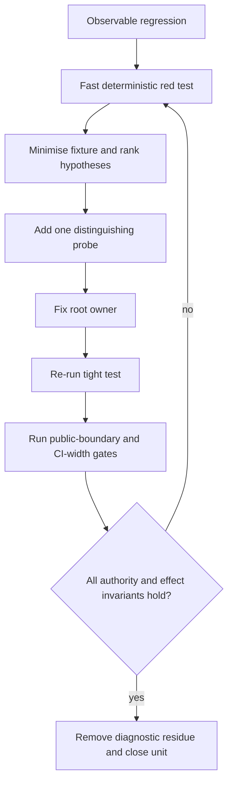
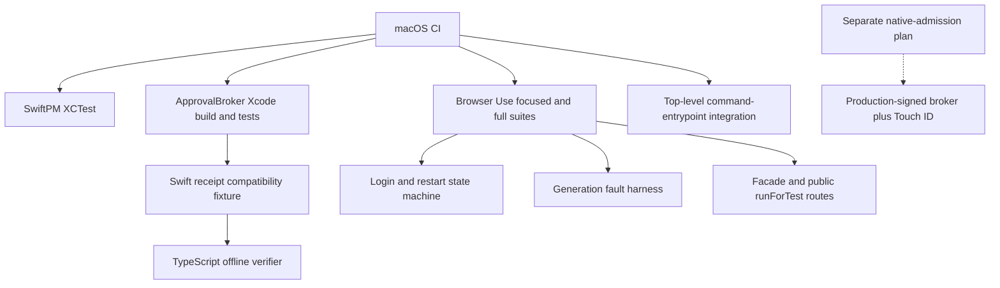
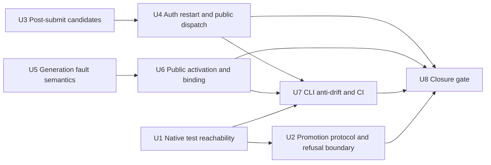

# PR 303 Regression Closure - Plan

## Current Status

Completed at PR #303 merge commit `41a0b606`. The merge-blocking native, approval, authentication-restart, generation-authority, public-command, package-boundary, and CLI anti-drift gates landed before merge. Main at `285b4948` retains those gates and adds signed Human Identity Attestation plus approved-submit attestation renewal through PR #300.

Retained deferrals are production Session Identity Proof, automated expected-subject/account/tenant detection, and operator-gated live acceptance. The original statement that production promotion and Human Identity Attestation were unavailable is historical; PR #300 later wired the admitted signed ApprovalBroker. The exported `runBrowserUseCli` runtime-injection seam remains a separate production-authority follow-up.

## Goal Capsule

- **Objective:** Close every verified regression gap in PR #303 before merge, including defects that a new red test exposes in production control flow.
- **Authority:** The Product Contract in `docs/plans/2026-08-02-001-feat-runbook-crud-cli-front-door-plan.md` owns intended behavior. ADRs 0020 and 0031 own human approval and Runbook Generation authority. ADR 0026 constrains the deferred production identity-attestation design.
- **Execution profile:** Use the `diagnosing-bugs` loop for each unit. Establish one fast deterministic failing test, minimise the case, rank three to five hypotheses, add the smallest probe that distinguishes them, fix the root cause, then widen verification.
- **Stop conditions:** Stop if a fix weakens authenticated-state proof, lets first-use key pinning admit a broker, lets agents mint human authority, retries a possibly dispatched mutation, permits generation fallback, or requires real credentials, Touch ID, or browser writes in merge-blocking CI.
- **Tail ownership:** Implementation runs in an isolated worktree. Real signed-product installation, admission, and Touch ID acceptance require a separate reviewed plan.

---

## Product Contract

### Summary

Add merge-blocking regression gates for the native Swift, approval-broker, generic-login, restart, generation, public CLI, and command-entrypoint surfaces changed by PR #303. Anchor acceptance at observable product boundaries, while starting each diagnosis at the narrowest red-capable seam; do not rely on private helper coverage alone. Where the new tests expose unreachable proof paths or ambiguous crash outcomes, correct production behavior without adding portal-specific logic or weakening authority.

### Problem Frame

The current CI job builds the Swift custody package but never runs its XCTest target. It does not compile or test the ApprovalBroker target. Browser Use tests cover many internal helpers, but omit markerless and delayed post-submit states, durable restart boundaries, public activation routes, generation crash/tamper paths, and new leaf-command help surfaces. The changed top-level command-entrypoint integration test also sits outside CI.

These gaps allow a green PR even when native code does not compile, native tests do not run, a broker is admitted by self-reported identity, login proof is unreachable, a restarted run repeats an external effect, activation reports an ambiguous post-commit failure, or CLI contract layers drift.

### Actors

- A1. **Authoring agent** discovers and invokes machine-readable Runbook and Reviewed Action commands from the admitted source workspace.
- A2. **Operator** owns production broker installation, signed-product admission, Touch ID, and real-portal acceptance.
- A3. **Browser Use runtime** preserves run identity, authentication state, generation authority, and effect uncertainty across restart.
- A4. **CI** compiles native products and executes hermetic native, TypeScript, facade, and process-boundary regression gates.

### Requirements

#### Native execution and approval authority

- R1. Required CI runs every `BrowserUseEnvironmentAuthTests` XCTest case, including profile login-data and metadata projection tests, instead of treating `swift build` as test execution.
- R2. Required CI compiles ApprovalBroker and runs hermetic promotion-protocol tests for versioned request and response schemas, canonical receipt bytes, exact-fact binding, signature verification, verifier rotation, replay, corruption, and cancellation or crash outcomes. A lost broker response is a typed unknown result that never triggers automatic issuance retry.
- R3. Production promotion remains unavailable while Browser Use Security reports `native-capability-absent`. Browser Use never constructs a promotion broker from an arbitrary executable path or self-reported verifier, and it never persists first-use trust without an admitted native-product handle from the code-owned admission runtime.
- R4. The Swift test owner generates one checked-in Reviewed Action promotion receipt and public key as the cross-runtime compatibility vector. Native and TypeScript tests consume the same file, and CI refuses canonical-payload drift, an invalid fixture signature, or any byte, fact, key, or key-id change.

#### Authentication and durable execution

- R5. After credential submission, a stable-origin snapshot with credential fields and advance or challenge controls gone is proof-eligible even without signed-in words. It becomes authenticated only after fresh `BrowserUseAuthenticatedStateProof` success.
- R6. A delayed single-page transition remains within the bounded observation loop. An unchanged or persistent credential form, exhausted bound, failed proof, or lost process returns one `unknown-post-submit-state` continuation with zero credential replay and zero business dispatch.
- R7. The public Runbook path preserves one Shared Browser Use Run identity, persists submission and proof state before side effects, and dispatches the first business step exactly once only when an approved authenticated-state proof owner succeeds. The production CLI fails closed with `human-identity-attestation-required` and zero business dispatch while no approved production proof owner exists.
- R8. Restart from persisted pre-submit, submission-started, authenticated, and mutation-dispatched states reconstructs the same run. A possibly dispatched mutation returns `task_run_effect_unknown` with `external_effect: "unknown"` and performs zero browser calls.

#### Generation authority and public command parity

- R9. Activation fault tests cover every declared crash boundary, staged-file and pointer tamper, failed rename, stale epoch or digest, nonterminal mutation-run blocking, read-only retained resume, selection races, and post-cutover no-fallback behavior.
- R10. A crash after authority commit has a defined retry result: an already selected, fully verified requested digest returns idempotent success with the same epoch. Corrupt or mismatched authority refuses and never creates a second epoch.
- R11. A fresh run racing activation binds wholly to either the prior or new manifest and epoch before browser dispatch. A retained run resolves only its complete pinned generation; missing or tampered authority never falls forward to the active generation.
- R12. Each new `runbook` and `action` leaf has aligned discovery metadata, rendered help, parser acceptance, handler, structured result, and diagnostic coverage. Public behavioral success and refusal coverage targets activation, run, and unknown-effect routes. Human-only promotion remains absent from agent-callable discovery.
- R13. Required CI executes the changed top-level command-entrypoint integration suite as well as the Browser Use suite, native gates, typecheck, lint, build, and package leak checks.

#### Hermetic acceptance

- R14. Merge-blocking tests use fake brokers, test keys, fixture pages, volatile filesystems, and fake browser transports. They never invoke real Touch ID, 1Password, credentials, production signing keys, external portals, or business writes.
- R15. Operator documentation states that production promotion is unavailable until the separately reviewed signed-product installation, static and dynamic admission, and repair lifecycle exists. This plan makes no production Touch ID or Developer ID acceptance claim.

### Key Flows

- F1. Native promotion protocol compatibility
  - **Trigger:** CI exercises exact Reviewed Action bytes through the hermetic native protocol target.
  - **Actors:** A3, A4
  - **Steps:** Encode and sign a canonical fixture receipt with test authority; verify it offline in TypeScript; mutate each covered fact and assert refusal; exercise production construction with native capability absent.
  - **Outcome:** Swift and TypeScript agree on the protocol, while production refuses before broker launch, verifier persistence, or presence.
  - **Covered by:** R2-R4, R14-R15

- F2. Generic post-submit authentication
  - **Trigger:** The login engine records credential submit dispatch.
  - **Actors:** A3
  - **Steps:** Observe bounded snapshots; classify signed-in text or markerless disappearance as proof candidates; request fresh authenticated-state proof; persist the outcome before business dispatch.
  - **Outcome:** The same run becomes ready and dispatches once, or returns one typed continuation with no replay or business effect.
  - **Covered by:** R5-R8

- F3. Activation and run binding
  - **Trigger:** Activation races a new or retained Runbook run.
  - **Actors:** A1, A3
  - **Steps:** Stage and verify a complete generation; atomically commit authority; bind a new run under the selection barrier or resolve the retained run's pinned authority.
  - **Outcome:** Each run sees one complete generation. Crash retry is idempotent, and tamper never falls back.
  - **Covered by:** R9-R11

- F4. Agent command use
  - **Trigger:** An agent discovers and invokes a new `runbook` or `action` leaf.
  - **Actors:** A1, A3, A4
  - **Steps:** Render help from the facade contract; parse the request; dispatch the public runtime path; return stable source, active-generation, run, lifecycle, and repair context.
  - **Outcome:** Every advertised agent command is executable and every human-only action remains unavailable.
  - **Covered by:** R12-R13

### Acceptance Examples

- AE1. **Covers R1.** Given a deliberate failure in `ProfilePolicyLoginDataTests`, when CI runs, then the SwiftPM test step fails even though debug and release builds compile.
- AE2. **Covers R2-R4.** Given the checked-in Swift-owned promotion vector, when the native test reconstructs its canonical payload and the TypeScript verifier reads the same file, then both pass. Changing one covered field, byte, key, key-id, signature, or generated payload fails.
- AE3. **Covers R3, R15.** Given production CLI construction, an arbitrary absolute broker path, or a self-reported verifier, when promotion is requested without an admitted native-product handle, then it returns typed native-capability repair before verifier persistence, broker launch, or Touch ID.
- AE4. **Covers R5-R7.** Given submitted credentials followed by a changed markerless page, when fresh proof succeeds, then the same run becomes ready and dispatches business work exactly once.
- AE5. **Covers R5-R7.** Given a delayed page that retains the form for bounded snapshots before changing, when proof later succeeds, then no early no-progress failure or duplicate submit occurs.
- AE6. **Covers R6-R8.** Given a persistent credential form, proof refusal, or process loss after submission started, when execution continues, then one `unknown-post-submit-state` continuation returns with zero credential replay and zero business dispatch.
- AE7. **Covers R8.** Given a persisted run with `mutation_dispatched: true`, when the public Runbook route resumes, then `task_run_effect_unknown` and `external_effect: "unknown"` return and the browser transport receives zero calls.
- AE8. **Covers R9-R10.** Given a crash at each activation boundary, when dependencies restart, then pre-commit crashes preserve prior authority and post-commit retry returns the same selected digest and epoch.
- AE9. **Covers R9-R11.** Given tampered staged bytes, a corrupt pointer, concurrent activation, or a retained run pinned to an older generation, when resolution occurs, then it returns one complete authorized generation or a typed refusal with no fallback.
- AE10. **Covers R12-R13.** Given any new leaf command, when contract, help, parser, handler, result, diagnostic, and command-entrypoint gates run in CI, then removing a declared flag, handler, result field, or diagnostic fails the merge gate. Public activation, run, and unknown-effect tests separately fail on behavioral drift.

### Success Criteria

- Every executable file and test added or changed by the native auth and ApprovalBroker work is reached by a required CI gate.
- Every post-submit and restart terminal state has a red-capable deterministic test at the public boundary or nearest state-machine seam.
- Every activation crash label has observable semantics and a regression test.
- Every new agent-callable CLI leaf has anti-drift coverage. Activation, run, and unknown-effect routes have public outcome coverage.
- Production construction cannot accept fixture verifiers or proof adapters through environment, config, package exports, or generic runtime overrides.
- No merge-blocking test requests real human presence or performs an external write.

### Scope Boundaries

**In scope:** CI reachability; native promotion protocol compilation and hermetic tests; broker-to-TypeScript compatibility; fail-closed production broker composition; generic markerless and delayed login behavior; production fail-closed behavior when no authenticated-state proof owner exists; persisted auth restart; generation crash, tamper, selection, and retained-resume behavior; public activation and run routes; CLI anti-drift; package leak regression.

**Human-only:** Production Developer ID admission, Secure Enclave key creation, Touch ID, ambiguous identity attestation, real credentials, and real portal or timesheet writes.

**Deferred:** Production signed-product installation, discovery, static and launched-guest admission, compatible upgrade, repair, and Touch ID acceptance; production operational enablement for opaque session proof, including a broker identity-attestation command, exact-claim human review, cross-runtime receipt proof, and durable one-run assignment or consumption; emergency revocation; explicit rollback; retained-generation deletion; automatic activation; portal-specific login branches; automatic retry after an unknown mutation effect.

**Outside this plan:** Broad test-suite cleanup unrelated to PR #303, new external dependencies, browser adapter changes, public package publication, and redesign of the existing auth or generation models.

### Assumptions

- PR CI remains hermetic and cannot possess a production Developer ID private key.
- The existing `BrowserUseAuthenticatedStateProof` port is retained. Hermetic tests inject it explicitly. Production CLI construction has no approved adapter in this plan and therefore fails closed.
- ApprovalBroker gets a test target and shared pure protocol seams only where current private or top-level code prevents direct testing. No new native package is introduced without implementation-time pressure evidence.
- The current macOS CI lane remains the owner for Darwin-only native gates. It records the selected Xcode and Swift versions so runner-image drift is diagnosable.

### Sources

- `docs/plans/2026-08-02-001-feat-runbook-crud-cli-front-door-plan.md`
- `docs/plans/2026-07-21-003-feat-browser-use-cross-adapter-authentication-plan.md`
- `docs/adr/0020-browser-use-local-broker-is-human-approval-authority.md`
- `docs/adr/0026-human-identity-attestation-is-one-run-only.md`
- `docs/adr/0031-private-runbook-catalog-activates-a-runbook-generation.md`
- [Swift testing guide](https://www.swift.org/documentation/server/guides/testing.html)
- [GitHub Actions Swift build and test guide](https://docs.github.com/en/actions/tutorials/build-and-test-code/swift)
- [Apple Xcode command-line tool reference](https://developer.apple.com/documentation/xcode/xcode-command-line-tool-reference)
- [Apple signed-code validation](https://developer.apple.com/documentation/security/secstaticcodecheckvalidity%28_%3A_%3A_%3A%29)
- [Apple code-signing requirements](https://developer.apple.com/documentation/technotes/tn3127-inside-code-signing-requirements)

---

## Planning Contract

### Key Technical Decisions

- KTD1. **Make each defect red before changing production code.** Start with one deterministic command at the narrowest seam that can disprove the intended outcome. Record reproduction evidence, minimise the fixture, rank three to five hypotheses, add one distinguishing probe, and remove diagnostic-only changes after the root fix. Rejected: fix-first edits followed by tests that only confirm the chosen implementation.
- KTD2. **Separate native compilation and hermetic protocol proof from future human acceptance.** `swift test` and `xcodebuild` own merge gates. Real Developer ID, installed-product admission, and Touch ID require a separate plan with their own architecture and operator gate. Rejected: claiming an unsigned build proves product admission or making biometric prompts a PR dependency.
- KTD3. **Keep production native capability absent until Browser Use Security can admit it.** Preserve `runtime/browser-use-security/src/admission.ts`, `runtime/browser-use-security/src/model.ts`, and `runtime/browser-use-security/src/runtime.ts` as the only admission owners. Browser Use consumes an admitted handle or typed absence and cannot turn a path or verifier response into authority. Rejected: implementing an unplanned native admission primitive in this patch, absolute-path admission, self-reported first-use pinning, and generic production overrides.
- KTD4. **Keep markerless state as a proof candidate, not a new authority product.** Reuse the existing authenticated-state proof port and hermetic fake. Production CLI composition fails closed until a separately reviewed proof owner exists. Rejected: page-shape authorization, portal-specific signed-in markers, test proof injection in production, and pulling a new identity-attestation product into this regression-closure change.
- KTD5. **Persist lifecycle intent before irreversible dispatch.** Submission-started and mutation-dispatched records remain the restart oracle. Restart proves the observed outcome or fails closed; it never repeats credentials or business work automatically. Rejected: reconstructing intent from the current page alone.
- KTD6. **Use the existing volatile filesystem and dependency reconstruction seams for generation faults.** Direct function tests inject crash and tamper. Public `runForTest` tests prove command wiring and returned repairs. Rejected: public-only tests that cannot target fault boundaries or helper-only tests that bypass dispatch.
- KTD7. **Define post-commit activation as committed authority with retry-safe reporting.** Invoke the declared `after_authority_commit` fault after the atomic authority change. Retry validates the selected generation and returns idempotent success without advancing the epoch. Rejected: removing the boundary or returning an ambiguous failure that can mint a second epoch.
- KTD8. **Gate every facade layer and public outcome.** Per-leaf help and parser tests protect syntax. Contract no-dangle and `runForTest` tests protect dispatch, JSON results, diagnostics, source admission, and packaged refusal. Rejected: parser-only confidence and changed integration tests outside CI.
- KTD9. **Expose equal context without equal authority.** Agent and operator reads receive the same source, active-generation, run, lifecycle, and repair facts. Promotion and real human presence remain operator-only. Rejected: hiding authority state from agents or advertising promotion as an agent command.
- KTD10. **Separate production composition from test injection.** `createProductionBrowserUseRuntime` accepts only explicit non-authority options such as environment and admitted source root; it accepts no generic runtime overrides or security seam. Hermetic construction remains in test helpers and is not re-exported from `browser-use.ts` or the built package. Environment, config, exports, and runtime overrides cannot inject fixture keys, broker, verifier, native admission, or proof adapters into production construction. Rejected: a production constructor whose generic overrides can replace authority.

### High-Level Technical Design

The implementation follows one diagnostic loop across several owners. The diagram is a sequencing guide, not an alternative state machine.

Authority and test layers:

### System-Wide Impact

- **CI:** The macOS job gains required native test and broker build/test steps plus the root command-entrypoint suite. Toolchain versions become failure context.
- **Native trust:** ApprovalBroker protocol tests use test authority. Production remains `native-capability-absent`, so test keys, paths, and fixtures cannot satisfy admission or trigger presence.
- **Authentication:** Markerless and delayed screens enter proof evaluation, but no page text or disappearance authorizes dispatch. Restart uses persisted auth fragments.
- **Run lifecycle:** Public Runbook dispatch becomes the outcome oracle for exactly-once and unknown-effect behavior.
- **Generation lifecycle:** Every crash label maps to a pre-commit or post-commit outcome. Selection races cannot mix manifest and epoch.
- **Agent surface:** Discovery, help, parser, JSON, diagnostics, and runtime results remain aligned while human-only promotion stays undiscoverable.

### Sequencing

### Risks and Mitigations

| Risk | Mitigation |
|---|---|
| A test broker or deterministic key becomes reachable from production | Separate production composition from test construction; add cold packaged-CLI and package sentinel tests |
| First-use verifier pinning admits an arbitrary executable | Require a Browser Use Security admitted handle; typed native absence wins before path, launch, or pinning |
| Native and TypeScript canonicalization drift | Make one Swift-produced compatibility vector mandatory in both native and TypeScript gates |
| Markerless heuristics release business work | Require fresh proof for every candidate and retain zero-dispatch near-miss tests |
| Restart duplicates credential or business dispatch | Persist write-ahead state and assert transport call counts at each restart boundary |
| A lost broker response repeats human authority issuance | Return a typed unknown result and require a fresh operator action; never auto-invoke the broker after transport loss |
| Markerless coverage is mistaken for operational proof | Assert the production CLI fails closed without an approved proof owner; keep identity-attestation design in a separate review |
| Activation crash after commit advances epoch twice | Treat committed verified authority as idempotent success on retry |
| Concurrent activation creates mixed binding | Bind manifest and epoch under the existing selection barrier before browser dispatch |
| Retained run silently acquires current authority | Revalidate its complete pinned generation and poison every fallback source in tests |
| CI runner image changes native behavior | Record Xcode and Swift versions; keep commands explicit and diagnose image drift separately from product failure |
| Broader root suite has unrelated failures | Add the changed command-entrypoint script as a dedicated required step; do not widen to unowned failing subsystems |

---

## Implementation Units

### U1. Make native custody tests merge-blocking

- **Goal:** Prove that the existing SwiftPM XCTest target executes in required CI.
- **Requirements:** R1, R13-R14
- **Dependencies:** None
- **Files:** `.github/workflows/ci.yml`; `runtime/browser-use-environment-auth/Package.swift`; `runtime/browser-use-environment-auth/Tests/BrowserUseEnvironmentAuthTests/ProfilePolicyLoginDataTests.swift`; `runtime/browser-use-environment-auth/Tests/BrowserUseEnvironmentAuthTests/MetadataProjectionTests.swift`
- **Approach:** Start with a controlled failing assertion in the new XCTest surface and show the current CI-equivalent build command stays green. Add the required SwiftPM test step, remove the controlled failure, and keep debug and release builds only where process-boundary tests need their binaries.
- **Test scenarios:** Test discovery includes both new files; malformed profile data refuses; valid SQLite projection remains admitted; WAL and lock behavior follows the package policy; metadata projection rejects missing or mismatched authority.
- **Verification:** The native test step reports executed test cases and fails on a seeded XCTest failure. Build-only steps remain separate.

### U2. Prove promotion protocol and fail-closed admission boundary

- **Goal:** Prove one promotion contract slice end to end while production native capability remains safely absent.
- **Requirements:** R2-R4, R14-R15
- **Dependencies:** U1
- **Files:** `runtime/browser-use-security/BrowserUseSecurity.xcodeproj/project.pbxproj`; `runtime/browser-use-security/BrowserUseSecurity.xcodeproj/xcshareddata/xcschemes/ApprovalBroker.xcscheme`; `runtime/browser-use-security/targets/ApprovalBroker/ApprovalBroker.swift`; `runtime/browser-use-security/targets/ApprovalBroker/ApprovalBrokerProtocol.swift`; `runtime/browser-use-security/targets/ApprovalBroker/Info.plist`; `runtime/browser-use-security/entitlements/ApprovalBroker.entitlements`; `runtime/browser-use-security/targets/ApprovalBrokerTests/ApprovalBrokerProtocolTests.swift`; `runtime/browser-use-security/targets/ApprovalBrokerTests/GeneratePromotionFixture.swift`; `runtime/browser-use-security/targets/ApprovalBrokerTests/Fixtures/reviewed-action-promotion-v1.json`; `runtime/browser-use-security/src/admission.ts`; `runtime/browser-use-security/src/runtime.ts`; `runtime/browser-use-security/tests/admission.test.ts`; `runtime/browser-use-security/tests/runtime.test.ts`; `skills/browser-use/src/browser-use-live-acceptance.ts`; `skills/browser-use/src/browser-use-live-acceptance.test.ts`; `skills/browser-use/src/browser-use-reviewed-action-promotion.ts`; `skills/browser-use/src/browser-use-reviewed-action-approval.test.ts`; `.github/workflows/ci.yml`
- **Approach:** First add a compile gate that exposes native errors. Add a shared Xcode scheme and test target. Extract only deterministic promotion receipt encoding and verification inputs needed by product and tests. Keep Secure Enclave and presence calls outside hermetic execution. Store the cross-runtime vector under the Swift test target with `generated_by` metadata naming `GeneratePromotionFixture.swift`; regenerate it with `swift runtime/browser-use-security/targets/ApprovalBrokerTests/GeneratePromotionFixture.swift runtime/browser-use-security/targets/ApprovalBrokerTests/Fixtures/reviewed-action-promotion-v1.json`. The native test reconstructs and compares canonical payload bytes and verifies the fixture signature; the TypeScript test reads that exact file after the Xcode gate. Remove `BROWSER_USE_REVIEWED_ACTION_APPROVAL_BROKER` path construction from live acceptance. Make production promotion query only the existing Browser Use Security admission runtime. When it returns `native-capability-absent`, return typed repair before temporary files, fixture-server startup, broker launch, or verifier persistence.
- **Test scenarios:** Versioned promotion request and response; unknown or extra fields; valid canonical promotion receipt; field-order stability; exact-byte and source-commit drift; forged signature; wrong key and key-id; verifier rotation; replay; Touch ID unavailable or cancelled as protocol results; broker crash before response returns typed unknown with no automatic retry; both runtimes consume the same checked-in Swift vector; native canonical-payload drift fails; each fixture mutation refuses; production native absence; the old broker-path environment variable and a self-reported verifier cannot bypass absence; live acceptance with every enablement variable set still refuses before files, server, broker, pinning, or presence; fixture broker, key, and verifier cannot enter cold packaged CLI construction.
- **Verification:** Unsigned Xcode build and hermetic Xcode tests pass without Touch ID. The later TypeScript compatibility test consumes the same checked-in vector and cannot substitute a local copy. Production live acceptance returns typed native absence before any side-effect spy fires. No test-only broker, key, generator, or fixture appears in product membership, exports, or packed output.

### U3. Make generic post-submit candidates reachable

- **Goal:** Recognize generic signed-in and markerless proof candidates after submit without granting authority from page heuristics.
- **Requirements:** R5-R6, R14
- **Dependencies:** None
- **Files:** `skills/browser-use/src/browser-use-login-engine.ts`; `skills/browser-use/src/browser-use-login-engine.test.ts`
- **Approach:** Reproduce markerless success as a failing engine test before changing classification. Separate proof-candidate detection from proof success. Evaluate a changed stable-origin post-submit snapshot before the current fingerprint no-progress return. Do not add portal names, selectors, FastTrack branches, or a standing identity exception.
- **Test scenarios:** Signed-in words plus proof success; signed-in words plus proof refusal; markerless changed page plus proof success; markerless page plus missing or failed proof; delayed transition across bounded identical snapshots; persistent form; origin drift; target drift; challenge; pre-existing authenticated session; exhausted iteration bound.
- **Verification:** Every successful path records a proof. Every unsuccessful post-submit path returns one continuation with zero credential replay and zero business calls.

### U4. Prove durable auth restart and exactly-once public dispatch

- **Goal:** Cover persisted auth fragments and run effects through the public Runbook path.
- **Requirements:** R6-R8, R12, R14
- **Dependencies:** U3
- **Files:** `skills/browser-use/src/browser-use-auth-transaction.ts`; `skills/browser-use/src/browser-use-runbook-auth.ts`; `skills/browser-use/src/browser-use-runbook-auth.test.ts`; `skills/browser-use/src/browser-use-runtime.ts`; `skills/browser-use/src/browser-use-runtime-security-wiring.test.ts`; `skills/browser-use/src/browser-use-test-helpers.ts`; `skills/browser-use/src/browser-use-package-authority-boundary.test.ts`; `skills/browser-use/src/browser-use.ts`; `skills/browser-use/src/browser-use-wave3-dispatch.test.ts`; `skills/browser-use/src/browser-use-task-run.test.ts`
- **Approach:** Build table-driven restart fixtures from the persisted fragment owner. Start with public-route tests that count credential, proof, and browser dispatches. Replace the generic production factory signature with an explicit non-authority options type. Keep injectable authority ports and security seams behind test helpers, remove their re-exports from the public entrypoint, and add a temporary-bundle import test that inspects the built module's exports and drives the production CLI with hostile environment keys. Change production only where a failing state can repeat work, lose run identity, bypass fresh proof, or expose test authority.
- **Test scenarios:** Pre-submit restart resumes safely; submission-started restart never submits again; post-submit proof success advances the same run under an explicit hermetic proof port; production CLI without a proof owner returns `human-identity-attestation-required`; ready restart requires fresh proof; proof failure returns one continuation; authenticated restart dispatches once; `mutation_dispatched` restart returns unknown effect; malformed or stale fragment refuses; compile-time production options reject `runbookAuthenticatedStateProof`, `reviewedActionApprovalVerifier`, `authTokenRetrieval`, and a security seam; a temporary production bundle exports no default or test runtime factory; cold bundled CLI refuses fixture authority through environment or config.
- **Verification:** Assertions cover stable run id, persisted fragment, continuation id, auth proof, business-dispatch count, credential-dispatch count, `mutation_dispatched`, and `external_effect`. The fake browser transport receives zero calls on every blocked, unknown, or production-proof-absent path.

### U5. Define every generation fault and authority outcome

- **Goal:** Turn declared activation crash, tamper, concurrency, and barrier semantics into deterministic regression tests.
- **Requirements:** R9-R11, R14
- **Dependencies:** None
- **Files:** `skills/browser-use/src/browser-use-runbook-generation.ts`; `skills/browser-use/src/browser-use-runbook-generation.test.ts`; `skills/browser-use/src/browser-use-platform-test-helpers.ts`
- **Approach:** Replace direct temporary-filesystem setup where fault behavior matters with the existing volatile overlay and dependency reconstruction seam. Classify each boundary as pre-commit or post-commit. Invoke `after_authority_commit` at its named boundary and make retry inspect committed authority before allocating a new epoch.
- **Test scenarios:** `before_stage`, `after_stage`, `after_verification`, `before_authority_commit`, and `after_authority_commit`; fsync or rename failure; staged manifest or file tamper; active pointer tamper; missing authority after cutover; stale digest; stale epoch; same-digest no-op; concurrent activation; fresh-run selection race; nonterminal mutation-capable run block; tampered or incomplete retained-generation revalidation; no current-generation fallback.
- **Verification:** After each injected crash, reconstruct dependencies and assert selected digest, epoch, retained directories, typed error, and fallback read counts. Post-commit retry returns the original committed digest and epoch.

### U6. Exercise activation and generation binding through public commands

- **Goal:** Prove facade dispatch, source admission, activation repair, run binding, and retained resume as callers observe them.
- **Requirements:** R9-R12, R14
- **Dependencies:** U5
- **Files:** `skills/browser-use/src/browser-use.ts`; `skills/browser-use/src/browser-use-runbook-e2e.test.ts`; `skills/browser-use/src/browser-use-wave3-dispatch.test.ts`
- **Approach:** Add `runForTest` cases after engine fault semantics are stable. Use admitted source fixtures and fake transports. Keep fault mechanics in U5. Assert composed JSON outcomes, generation binding, and zero browser dispatch rather than repeating the complete fault matrix.
- **Test scenarios:** Source-checkout activation success; packaged mutation refusal; stale catalog digest; same-digest no-op; activation blocked by nonterminal mutation run; source-versus-active projection; fresh run bound wholly before or after concurrent activation; one representative retained-generation tamper or missing-authority repair with no active-generation fallback.
- **Verification:** Public JSON carries source digest, active digest, epoch, run id, generation binding, lifecycle state, diagnostic code, and repair action. Packaged and tampered paths perform zero writes or browser calls.

### U7. Complete CLI anti-drift and CI coverage

- **Goal:** Make every new command surface and the changed root integration test merge-blocking.
- **Requirements:** R12-R14
- **Dependencies:** U1, U4, U6
- **Files:** `skills/browser-use/src/command-contract.ts`; `skills/browser-use/src/browser-use-parser.test.ts`; `skills/browser-use/src/command-contract-no-dangle.test.ts`; `skills/browser-use/src/browser-use-front-door.test.ts`; `skills/browser-use/src/browser-use-platform-contract.test.ts`; `scripts/command-entrypoint.integration.test.ts`; `.github/workflows/ci.yml`
- **Approach:** Use the existing facade testing helper for per-leaf rendered help. Keep this unit structural: parser acceptance, handler presence, result and diagnostic contracts, and human-only capability absence. U4 and U6 own public behavioral success and refusal. Add the existing root package script as a dedicated required CI step instead of widening to unrelated failing suites.
- **Test scenarios:** Runbook schema, validate, apply, delete, activate, list, show, and run; Reviewed Action schema, validate, apply, and state reads; required and forbidden flags; structured result contract; diagnostic code; missing handler; runbook catalog count; human-only promotion absent from discovery.
- **Verification:** Deleting or changing any advertised flag, parser branch, handler, result field, diagnostic, or root integration expectation causes a required CI step to fail.

### U8. Close the product gate without live side effects

- **Goal:** Prove the combined fix at focused, package, and workspace boundaries while keeping deferred human boundaries unavailable.
- **Requirements:** R1-R15
- **Dependencies:** U2, U4, U6, U7
- **Files:** `.github/workflows/ci.yml`; `skills/browser-use/package.json`; `runtime/browser-use-security/package.json`; `docs/runbooks/authoring-runbooks.md`; `runtime/browser-use-security/README.md`
- **Approach:** Run tight tests first, then the full affected suite. Keep merge gates hermetic. Update operator docs to state that production promotion is unavailable and route signed-product installation, admission, and presence-backed acceptance to a separate plan.
- **Test scenarios:** Native seeded-failure reachability; full promotion receipt matrix; production native-absence and fixture-injection matrix; full post-submit and restart matrix; full generation fault matrix; public CLI matrix; private-asset canary scan; no Touch ID or real portal mutation.
- **Verification:** All required commands pass on a clean implementation worktree. The packed payload contains no private runbooks, action candidates, approval records, test keys, or fixture broker. Operator docs describe native capability as unavailable and route signed-product enablement to a separate plan.

---

## Verification Contract

| Gate | Applies to | Done signal |
|---|---|---|
| `swift test --package-path runtime/browser-use-environment-auth` | U1 | All SwiftPM XCTest cases execute and pass |
| `xcodebuild -list -project runtime/browser-use-security/BrowserUseSecurity.xcodeproj` | U2 | ApprovalBroker and its shared test scheme are discoverable |
| `xcodebuild -project runtime/browser-use-security/BrowserUseSecurity.xcodeproj -scheme ApprovalBroker -configuration Debug -destination 'platform=macOS' CODE_SIGNING_ALLOWED=NO test` | U2 | Native broker compiles and hermetic protocol tests pass without presence |
| `bun test runtime/browser-use-security/tests` | U2 | Browser Use Security manifest, policy, runtime admission, and refusal tests pass |
| `bun run --cwd runtime/browser-use-security typecheck` | U2 | Browser Use Security TypeScript sources report zero errors |
| `bash skills/test-runner/src/test-runner.sh run --cwd skills/browser-use --mode compact --plain -- src/browser-use-live-acceptance.test.ts src/browser-use-reviewed-action-approval.test.ts src/browser-use-runtime-security-wiring.test.ts src/browser-use-package-authority-boundary.test.ts src/browser-use-auth-approval.test.ts src/browser-use-login-engine.test.ts src/browser-use-runbook-auth.test.ts src/browser-use-runs.test.ts` | U2-U4 | Shared-vector compatibility, native absence, production-factory refusal, markerless, delayed, persistent-form, proof, and restart cases pass |
| `bash skills/test-runner/src/test-runner.sh run --cwd skills/browser-use --mode compact --plain -- src/browser-use-runbook-generation.test.ts src/browser-use-runbook-e2e.test.ts src/browser-use-wave3-dispatch.test.ts src/browser-use-task-run.test.ts` | U4-U6 | Crash, tamper, binding, retained-resume, public dispatch, and unknown-effect cases pass |
| `bash skills/test-runner/src/test-runner.sh run --cwd skills/browser-use --mode compact --plain -- src/browser-use-parser.test.ts src/command-contract-no-dangle.test.ts src/browser-use-front-door.test.ts src/browser-use-platform-contract.test.ts` | U6-U7 | Discovery, help, parser, handler, result, and diagnostic layers stay aligned |
| `bun run command-entrypoint:integration` | U7 | Changed top-level entrypoint expectations execute and pass |
| `bash skills/test-runner/src/test-runner.sh run -- skills/browser-use/src/` | U8 | Full affected Browser Use suite passes |
| `bun run --cwd skills/browser-use typecheck` | U8 | TypeScript reports zero errors |
| `bun run --cwd skills/browser-use build && bun run --cwd skills/browser-use pack:dry-run` | U8 | Build succeeds and package inventory excludes private or test authority |
| `bun run biome:check` | U8 | Lint and format checks pass |
| `git diff --check` | U8 | No whitespace errors remain |

Required CI logs include `swift --version`, `xcodebuild -version`, and the selected runner image metadata when a native gate fails. CI test failure output must not include credential values, signing private keys, or secret material.

---

## Definition of Done

- U1-U8 satisfy every traced requirement and acceptance example.
- CI executes native tests, native broker build/tests, focused Browser Use tests, the root command-entrypoint integration test, full affected tests, typecheck, lint, build, and package inspection.
- Markerless and delayed post-submit states reach fresh authenticated-state proof without page heuristics granting authority.
- Persistent forms, failed proof, process loss, and mutation uncertainty return typed continuations with zero retry and zero business dispatch.
- Production promotion returns typed native-capability absence before path resolution, broker launch, verifier persistence, or presence.
- One Swift-produced receipt is accepted by TypeScript and every single-field mutation refuses.
- Promotion request and response parsing rejects unknown fields, cross-purpose envelopes, replay, and malformed canonical bytes.
- Production construction cannot accept fixture authority through environment, config, package exports, or generic runtime overrides.
- Every generation crash boundary has an asserted restart outcome.
- Post-authority-commit retry preserves digest and epoch.
- Public activation, run, and resume tests assert JSON context and transport call counts.
- Every new leaf command has discovery, help, parser, handler, result, and diagnostic coverage. Activation, run, and unknown-effect routes have public success and refusal coverage.
- Real Touch ID, production signing, credentials, and external writes remain outside merge-blocking automation.
- Operator documentation states that production promotion remains unavailable and routes native admission to a separate reviewed plan.
- Abandoned probes, controlled failures, temporary logging, duplicate fixtures, and dead-end code are removed from the implementation diff.
