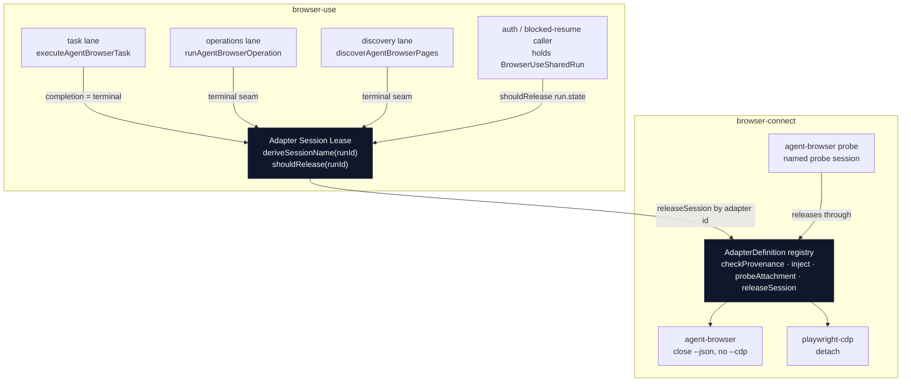

# feat: Adapter Session Lease

**Target repo:** claude-code-config (implement in the codex worktree holding the partial diff: `~/.codex/worktrees/95d7/claude-code-config`, detached at `origin/main`).

---

## Product Contract

### Summary

Give agent-browser daemon sessions a per-run lifetime owned by one lease module, released at each lane's terminal seam through a browser-connect adapter registry mechanic. The session name is minted in one place; release argv stays behind the ADR-0031 seam; release failure is reported as debt, never folded into task truth. This closes the leak that has accumulated ~45 orphaned `browser-use-<uuid>` sessions in the live daemon (56 total observed).

### Problem Frame

Every browser-use lane that spawns `agent-browser --cdp <ws> --session browser-use-<runId> ...` implicitly creates a daemon session. Five sites construct that name (task, operations, discovery, playwright, plus the uncommitted discovery release); only the uncommitted discovery diff ever closes one, and it does so on every discovery invocation — which breaks the cross-invocation continuity the run model depends on, and flattens release failure into discovery-transport failure. The task and operations lanes never release at all. browser-connect's own agent-browser probe leaks the daemon's default session too. The result is unbounded session growth in Agent Chrome.

An ICA pass (report `architecture-review-20260811`) identified the deepening: session identity has no owning module, and the release mechanic sits as a loose export bypassing the AdapterDefinition registry. A logic prototype and a live spike (`skills/browser-use/src/prototypes/2026-08-11-adapter-session-lease/`) proved the per-run lease model end to end against real Agent Chrome.

### Requirements

- **R1** — Session identity (`browser-use-<runId>`) is derived in exactly one place; all agent-browser derivation sites migrated in this plan (task, operations, discovery) call it. The playwright lane's inline construction (`browser-use-playwright-task.ts`) persists until its migration lands (deferred); R1's "exactly one place" is a within-scope claim over the migrated lanes, not a global one.
- **R2** — Release argv lives behind the browser-connect adapter registry as a per-adapter mechanic; browser-use never encodes `close`/`detach` argv (ADR-0031).
- **R3** — agent-browser release uses `--session <name> close --json` with **no `--cdp`** (a `--cdp` on close could mint a replacement attachment mid-shutdown).
- **R4** — Session lifetime is per-run: a lane releases when its run is terminal or has no durable run; a blocked or active-continuation run holds its session.
- **R5** — Release truth is reported separately from task truth. A task that succeeds but whose release fails still reports task success; release failure rides as typed non-fatal debt with a repair hint.
- **R6** — Release verification bounded-re-reads session inventory until it settles (release truth settles asynchronously; a single read is insufficient — proven by the live spike).
- **R7** — Release is named-session scoped only. Never `close --all`, never a broad sweep, never touching sessions the run does not own (DDA-G14).
- **R8** — Every live proof runs against Agent Chrome only (DDA-F26) and preserves the `MCPORTER_NO_KEEPALIVE` spawn guard (DDA-H22).
- **R9** — The task lane releases at a single terminal seam (one outcome funnel), not scattered across its ~24 return sites.
- **R10** — browser-connect's agent-browser probe adopts a named probe session and releases it through the same mechanic (stops the probe contributing to the leak it now owns cleanup for).

### Key Decisions

- **Adapter Session Lease** (session lifetime owner) — *(session-settled: user-directed — chosen over the loose free-function export and the other three ICA candidates: the registry mechanic honors ADR-0031, the lease concentrates name-minting and the lifetime rule)*. Governs R1, R2, R4.
- **Per-run lifetime, released at run-terminal, held across blocked/resume** — *(session-settled: user-approved via prototype + live spike — chosen over per-invocation release: continuity across invocations is a run-model requirement)*. Governs R4.

### Scope Boundaries

In scope: agent-browser release mechanic in the registry, the lease module, wiring into the task/operations/discovery lanes, the task-lane funnel refactor, the probe-session fix, the ADR and CONTEXT.md vocabulary, and graduating the live spike as an acceptance test.

#### Deferred to Follow-Up Work

- **Orphan session sweep (ICA candidate 4).** ~45 orphaned sessions exist in the live daemon today; a browser-connect inventory/repair station that diffs owned-name sessions against live inventory and closes orphans by name is deferred. Depends on this plan's "owned" definition. Closes DDA-H18 systematically.
- **Playwright lane migration onto the lease.** playwright-cdp gets the registry `releaseSession` mechanic (R2) but keeps its existing inline `detach` in `browser-use-playwright-task.ts`; migrating that lane to call the mechanic through the lease is deferred.
- **chrome-devtools-mcp release mechanic.** Registered adapter, but its native session release is out of scope until a lane needs it.

---

## Planning Contract

### Key Technical Decisions

- **KTD1 — `shouldRelease(runId)` is `isTerminal-or-no-run → release`, not `blocked → hold, else release`.** *(session-settled: user-directed — refined during grilling + research)*. Run states split three ways: blocked (`awaiting-auth`, `awaiting-approval`, `awaiting-user-presence`, `needs-human`), active (`running`, `ready`), terminal (`confirmed`, `not-achieved`, `unknown`). A `blocked?hold:release` predicate would wrongly release a `running` run. The predicate releases only on terminal-or-absent state; both blocked and active hold. Reuses existing `BROWSER_USE_TERMINAL_RUN_STATES` / `BROWSER_USE_BLOCKED_RUN_STATES`. Governs R4.
- **KTD2 — The task lane treats its own completion as terminal; no run-state read Port.** *(session-settled: user-directed — chosen over a new injected `readRunState` Port)*. The task lane works from `AgentBrowserTask` and never loads a `BrowserUseSharedRun`, and has no blocked/active run to distinguish — so it releases on completion (success or typed failure). `shouldRelease(runId)` is used only by callers that already hold a run record (the auth/blocked-resume path). Avoids threading a new Port and run identity into the task lane. Governs R4, R9.
- **KTD3 — `releaseSession` is a 4th `AdapterDefinition` member, resolved by id via `findAdapterDefinition`.** browser-connect adds a `./registry` (or `./adapters`) package export so browser-use resolves the mechanic through the registry rather than importing adapter argv. The existing standalone `agent-browser-session.ts` becomes the agent-browser implementation the registry member delegates to (or is inlined into the adapter file). Governs R2.
- **KTD4 — Release failure is non-fatal; the funnel inverts playwright's fatal-detach severity.** The task lane mirrors the playwright lane's single-`taskOutcome` funnel *structure* but not its semantics: playwright's failed `detach` returns a `playwright_task_detach_failed` failure that overrides the outcome, whereas the agent-browser lane keeps task truth and attaches release debt. Governs R5, R9.
- **KTD5 — Release result carries bounded re-read.** The mechanic verifies release by re-reading session inventory (`session list`) with a bounded retry (≤6 attempts, ~1s apart) until the owned name is absent, rather than trusting the `close` exit envelope alone. Governs R6.
- **KTD6 — "Adapter Session Lease" is a distinct term from the existing env/profile run lease.** `browser-use-locks.ts` already owns a `leaseKeyForRun` lease (fencing tokens, env/profile authority) and CONTEXT.md defines "Browser Authentication Access Lease". The new term is scoped and `_Avoid_`-fenced against both to prevent drift. Governs R1.

### Assumptions

- The existing `agent-browser-session.ts` argv (`--session <name> close --json`, no `--cdp`) is correct and reused — proven by the live spike. The bounded re-read verification (session list, ≤6×~1s, the `still-present` arm) is **new logic U2 adds on top**: the existing envelope-only success check (`success === true`, single read) is insufficient because release settles asynchronously (spike finding 2). "Reuse the argv, add the verification" — not a from-scratch rewrite, not a pure generalization.
- `session list --json` returns `{success:true,data:{sessions:[...]}}` as observed live; the bounded re-read parses that shape.

---

## High-Level Technical Design



Lifetime rule (KTD1/KTD2):

```mermaid
stateDiagram-v2
  [*] --> Active: run running/ready
  Active --> Blocked: awaiting-auth/approval/presence/needs-human
  Blocked --> Active: resume
  Active --> Terminal: confirmed/not-achieved/unknown
  Blocked --> Terminal: run ends
  Terminal --> Released: shouldRelease = true
  Active --> Held: hold session
  Blocked --> Held: hold session
  note right of Released: task lane: completion IS terminal (KTD2)
  note right of Held: named-session scoped only (R7)
```

---

## Implementation Units

### U1. Adapter Session Lease module (name derivation + lifetime predicate)

**Goal:** One module owns session identity and the per-run lifetime rule.
**Requirements:** R1, R4. Cites KTD1, KTD2, KTD6.
**Dependencies:** none.
**Files:**
- `skills/browser-use/src/browser-use-adapter-session-lease.ts` (new)
- `skills/browser-use/src/browser-use-adapter-session-lease.test.ts` (new)
- `skills/browser-use/src/browser-use-run-model.ts` (export `isTerminalState` / `isBlockedState` helpers if not already exported)

**Approach:**
1. Export `deriveSessionName(runId): string` returning `browser-use-${runId}` — the sole constructor of the name.
2. Export `shouldRelease(state: BrowserUseRunState | undefined): boolean` = `state === undefined || isTerminalState(state)`. Reuse `BROWSER_USE_TERMINAL_RUN_STATES`; do not hand-roll the classification.
3. No run-state reader Port (KTD2) — `shouldRelease` takes a state (or undefined), the caller supplies it from a run record it already holds.

**Consumer scope (important):** the three lanes migrated in this plan (task, operations, discovery) all release via KTD2's completion-is-terminal path and never call `shouldRelease`. `shouldRelease` and the R4 hold-across-blocked/active behavior have **no wired consumer in this plan** — the auth/blocked-resume caller that would hold a `BrowserUseSharedRun` and call the predicate is deferred future work. This unit ships `shouldRelease` with unit-test coverage only (proven in isolation, not in situ); `deriveSessionName` ships with four live consumers. If shipping an unconsumed predicate is undesirable, split U1: land `deriveSessionName` now and defer `shouldRelease` with the auth/resume wiring it serves.

**Patterns to follow:** `deriveProbeSessionName()` in `runtime/browser-connect/src/adapters/playwright-cdp.ts`; the `(X as readonly BrowserUseRunState[]).includes(state)` idiom in `browser-use-run-model.ts`.
**Test scenarios:**
- `deriveSessionName("run-42")` returns `browser-use-run-42`.
- `shouldRelease` returns true for each terminal state (`confirmed`, `not-achieved`, `unknown`) and for `undefined`.
- `shouldRelease` returns false for each blocked state and for `running` and `ready` (the mis-release guard from KTD1 — explicitly assert `running` holds).
**Verification:** module compiles, all predicate cases pass, no migrated lane (task, operations, discovery) still builds the session name inline (grep) — the deferred playwright lane is out of this grep's scope per R1.

### U2. `releaseSession` registry mechanic (browser-connect)

**Goal:** Release argv lives per-adapter behind the AdapterDefinition registry; browser-use resolves it by id.
**Requirements:** R2, R3, R6. Cites KTD3, KTD5.
**Dependencies:** none (parallel to U1).
**Files:**
- `runtime/browser-connect/src/adapters/registry.ts` (add `releaseSession` to `AdapterDefinition`, `AdapterReleaseResult` type, `RELEASE_TIMEOUT_MS`)
- `runtime/browser-connect/src/adapters/agent-browser.ts` (implement `releaseSession`: `close --json`, no `--cdp`, bounded re-read)
- `runtime/browser-connect/src/adapters/playwright-cdp.ts` (implement `releaseSession`: `detach`)
- `runtime/browser-connect/src/agent-browser-session.ts` (generalize/relocate the existing release into the agent-browser adapter; retire the standalone `./agent-browser-session` package export or make it delegate)
- `runtime/browser-connect/package.json` (replace the `./agent-browser-session` export with a registry-resolving export, e.g. `./adapters` or `./registry`)
- `runtime/browser-connect/tests/adapters.test.ts` (browser-connect tests live in `tests/`, not co-located under `src/`)

**Approach:**
1. Add `releaseSession: (runtime: AdapterRuntime, input: { sessionName: string }) => Promise<AdapterReleaseResult>` to `AdapterDefinition`, matching the house-style of `probeAttachment` (runtime-first, `Promise` of a typed-result union).
2. `AdapterReleaseResult = { released: true } | { released: false; cause: "command-failed" | "invalid-response" | "still-present"; detail: string }`. The existing `agent-browser-session.ts` result uses `reason: "command-failed" | "invalid-response"` (no `still-present`). Absorb it: widen that union to `cause` + `still-present` + `detail` rather than wrapping, so the new `still-present` state (the load-bearing bounded-re-read outcome) cannot be dropped at a delegate boundary.
3. agent-browser impl: spawn `--session <name> close --json` (no `--cdp`), then bounded re-read `session list --json` (≤6 × ~1s) until the name is absent; `still-present` after the budget is a typed failure (KTD5). Preserve `MCPORTER_NO_KEEPALIVE` and the 30s outer timeout (R8).
4. playwright-cdp impl: `detach` through its session, reusing `detachProbeSession`'s argv.
5. Export a registry accessor from the package so browser-use calls `findAdapterDefinition(id).releaseSession(...)` rather than importing argv.

**Patterns to follow:** existing `probeAttachment` / `checkProvenance` signatures and `AdapterProbeResult` typed-cause union in `registry.ts`; `detachProbeSession` in `playwright-cdp.ts`; the existing `releaseAgentBrowserSession` typed result in `agent-browser-session.ts`.
**Execution note:** the live spike proved the bounded re-read is load-bearing — implement it, don't shortcut to a single read.
**Test scenarios:**
- agent-browser `releaseSession` emits exactly `[executable, "--session", <name>, "close", "--json"]` — assert **no `--cdp`** in the vector (mirror the existing discovery close-argv assertion).
- Release re-reads `session list` and returns `released:true` once the owned name is absent.
- Release returns `still-present` when inventory keeps showing the name past the retry budget.
- Release returns `command-failed` on non-zero exit / timeout, `invalid-response` on unparseable stdout.
- playwright-cdp `releaseSession` emits the `detach` vector.
- `findAdapterDefinition("agent-browser").releaseSession` is defined (registry membership).
**Verification:** both adapters expose `releaseSession`; browser-connect builds; no browser-use file imports adapter argv.

### U3. Wire release into the task lane via a terminal-seam funnel

**Goal:** `executeAgentBrowserTask` releases exactly once at a single terminal seam, task truth owning the exit, release debt riding the payload.
**Requirements:** R5, R7, R9. Cites KTD2, KTD4.
**Dependencies:** U1, U2.
**Files:**
- `skills/browser-use/src/browser-use-agent-browser.ts`
- `skills/browser-use/src/browser-use-agent-browser.test.ts`

**Approach:**
1. Refactor the ~24 post-session return sites (from `selectAgentBrowserTarget` at the first live spawn onward) into a single `let taskOutcome` funnel mirroring `browser-use-playwright-task.ts` — no early return once the session is live.
2. Pre-session validation returns (`validateTask`, checkpoint-unavailable) stay early; they never created a session.
3. At the single terminal seam, call the registry `releaseSession` via the lease-derived name. Attach a `release?: { released: false; cause; detail }` field to both the success and failure result arms (extend `AgentBrowserExecutionResult`), following the existing `withDelivery` spread pattern. Task success/failure keeps its own outcome and exit; release debt never overrides it (KTD4 — the inversion of playwright's fatal detach).

**Patterns to follow:** the `taskOutcome` funnel + trailing seam in `browser-use-playwright-task.ts`; the `withDelivery` / `failure` factories in `browser-use-agent-browser.ts`.
**Test scenarios:**
- Terminal task releases the owned session (graduate the uncommitted red test — `activeSessions` empty after a terminal task).
- Successful task + failed release → `result.ok === true` AND a populated `release` debt field (assert both — this is the KTD4/R5 core).
- Each former early-return failure path still returns its typed failure AND releases the session once (no path leaks, no double-release).
- No `--cdp` appears in the release vector.
**Verification:** the red terminal-task test passes; no return site between session-live and the seam bypasses release.

### U4. Wire release into the operations lane and fix the discovery ordering

**Goal:** operations releases at its terminal seam; discovery's release moves to a single seam that no longer flattens release failure into transport failure.
**Requirements:** R5, R7. Cites KTD4.
**Dependencies:** U1, U2.
**Files:**
- `skills/browser-use/src/browser-use-operations.ts`
- `skills/browser-use/src/browser-use-discovery.ts`
- `skills/browser-use/src/browser-use-operations.test.ts`
- `skills/browser-use/src/browser-use-discovery.test.ts`

**Approach:**
1. Operations (`runAgentBrowserOperation`): add a single terminal release seam before each return (currently zero release — a leak site), lease-derived name, release debt on the payload.
2. Discovery: replace the mis-ordered release (computed at the top, consulted only on the success path) with one terminal seam after the outcome is decided. Release truth becomes its own reported debt, distinct from the tab-list transport outcome — a failed release no longer converts a successful listing into `target_discovery_transport_failed`.
3. Both call the registry mechanic through the lease-derived name (R1/R2), replacing the direct `releaseAgentBrowserSession` import.

**Patterns to follow:** U3's funnel seam; the existing `transportFailure` factory in `browser-use-discovery.ts` for discovery's own failure vocab.
**Test scenarios:**
- Operations releases the owned session after a successful operation and after a typed failure (was leaking before).
- Discovery: successful tab list + failed release → listing still returns its pages, release debt reported separately (the ordering-bug regression).
- Discovery: tab-list transport failure still releases the session once and reports the transport failure (not swallowed).
- No `--cdp` in either lane's release vector.
**Verification:** the existing 52-test discovery slice stays green under the reordered semantics (adjust the two assertions the uncommitted diff added to match the terminal-seam shape); operations no longer leaks.

### U5. Name the agent-browser probe session and release it through the mechanic

**Goal:** browser-connect's agent-browser probe stops leaking the daemon default session.
**Requirements:** R10, R3, R8. Cites KTD3.
**Dependencies:** U2.
**Files:**
- `runtime/browser-connect/src/adapters/agent-browser.ts`
- `runtime/browser-connect/tests/agent-browser.test.ts` (browser-connect tests live in `tests/`, not co-located under `src/`)

**Approach:**
1. The probe (`probeAttachment`) currently spawns with no `--session`, mutating the daemon default session. Give it a derived probe session name (mirror `deriveProbeSessionName` from playwright-cdp).
2. Release that probe session through the new `releaseSession` mechanic after the probe completes, success or fail.

**Patterns to follow:** `deriveProbeSessionName()` and `detachProbeSession()` in `playwright-cdp.ts`.
**Test scenarios:**
- Probe spawns with a `--session <probe-name>` flag (no longer default-session).
- Probe releases its named session after success and after probe failure.
- Probe release uses `close` with no `--cdp`.
**Verification:** probe no longer touches the default session; browser-connect builds and its probe tests pass.

### U6. ADR-0034 + CONTEXT.md vocabulary

**Goal:** Record the registry-owned session-release decision and add the new terms.
**Requirements:** R1, R2. Cites KTD3, KTD6.
**Dependencies:** U1, U2 (write once the shape is settled in code).
**Files:**
- `docs/adr/0034-session-release-is-an-adapter-registry-mechanic.md` (new — 0034 avoids the existing 0031 duplication)
- `skills/browser-use/CONTEXT.md` (add "Adapter Session Lease")
- `runtime/browser-connect/CONTEXT.md` (add the `releaseSession` mechanic term)

**Approach:**
1. ADR-0034 (frontmatter `status: accepted`, `date: 2026-08-11`; body prose + `## Considered Options`): the release mechanic belongs in the AdapterDefinition registry, not a loose browser-use export — extends ADR-0031's delegation boundary to session release. Options: loose export (rejected — bypasses the registry, first browser-action surface in an attachment-only runtime), browser-use-owned argv (rejected — violates ADR-0031), registry mechanic (chosen).
2. CONTEXT.md entries in the `**Term**:` / `_Avoid_:` / `_Developer example_:` house shape. "Adapter Session Lease" `_Avoid_`-fenced against "Browser Authentication Access Lease" and the env/profile run lease (KTD6).

**Patterns to follow:** `docs/adr/0031-browser-use-delegates-browser-mechanics-to-adapters.md`; existing CONTEXT.md entries in both files.
**Test scenarios:** `Test expectation: none — docs/vocabulary unit, no behavioral change.`
**Verification:** ADR YAML parses; both CONTEXT.md files YAML-lint clean; new terms disambiguated from the two existing "lease" meanings.

### U7. Graduate the live spike as an acceptance test

**Goal:** Turn the proven live spike into a repeatable acceptance receipt for the built code.
**Requirements:** R3, R6, R7, R8.
**Dependencies:** U2, U3, U4.
**Files:**
- `skills/browser-use/src/prototypes/2026-08-11-adapter-session-lease/` (keep as captured spike; reference from the plan/PR)
- an acceptance test or documented manual receipt exercising the built mechanic against Agent Chrome

**Approach:** Re-point the spike (or a hermetic equivalent) at the built `releaseSession` mechanic and the lane seams rather than raw argv, asserting: owned session created → reused across invocations → released with bounded re-read → inventory back to baseline, foreign sessions and Chrome PID untouched. Keep the planted-regression variant so the absence assertion is falsifiable.
**Execution note:** live proof runs against Agent Chrome via `browser-connect connect` only (DDA-F26); named-scope only (R7).
**Test scenarios:**
- Built mechanic releases exactly the owned session live; baseline inventory count restored; Chrome PID stable.
- Planted regression (skip release) flips the absence assertion to fail.
**Verification:** acceptance receipt recorded; closes the DDA-H18 evidence gap for this path (systematic sweep still deferred).

---

## Verification Contract

- `skills/test-runner/src/test-runner.sh run --cwd skills/browser-use` — full browser-use slice green, including the graduated terminal-task test and the reordered discovery assertions.
- `skills/test-runner/src/test-runner.sh run --cwd runtime/browser-connect` — browser-connect adapter tests green, including the new `releaseSession` argv (no `--cdp`) and registry-membership assertions.
- `tsc_check` and `biome_lintCheck` clean on all touched files.
- No file under `skills/browser-use/src` imports adapter release/close argv directly (grep gate for R2).
- No live release path emits `--cdp` (test-asserted for R3).
- Live acceptance receipt (U7) recorded against Agent Chrome, named-scope only.

## Definition of Done

- R1–R10 satisfied and traced to their units.
- The uncommitted red terminal-task test passes; the discovery slice stays green under terminal-seam semantics.
- ADR-0034 and both CONTEXT.md updates landed.
- The loose `./agent-browser-session` export is retired or delegating; release resolves through the registry.
- Orphan sweep, playwright-lane migration, and chrome-devtools-mcp release explicitly deferred (not silently dropped).

---

## Sources & Research

- ICA report: `architecture-review-20260811` (five candidates surfaced; candidates 1+2 selected for this plan, candidate 4 — orphan sweep — deferred, candidates 3+5 not pursued).
- Logic prototype: `skills/browser-use/src/prototypes/2026-08-11-adapter-session-lease/lease-demo.html`.
- Live spike + receipt: `skills/browser-use/src/prototypes/2026-08-11-adapter-session-lease/findings.md` (Q1–Q4 PASS; bounded re-read finding).
- ADR-0031 `docs/adr/0031-browser-use-delegates-browser-mechanics-to-adapters.md` (the delegation boundary this extends).
- DDA ledger `skills/browser-use/docs/plans/2026-07-27-daily-driver-acceptance-ledger.md`: H18 (orphan cleanup — this plan closes the per-run evidence gap; the systematic sweep that fully closes H18 is deferred), G14 (owned-scope only), F26 (Agent Chrome only), H22 (no keepalive).
- Solutions: `docs/solutions/architecture-patterns/hermetic-doubles-preserve-production-identity-namespaces-and-lifecycle-states.md`, `authentication-is-proven-state-not-successful-navigation.md`.
- Run-model states + classification helpers: `skills/browser-use/src/browser-use-run-model.ts`.
