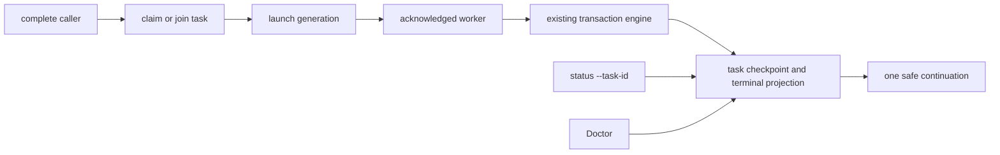
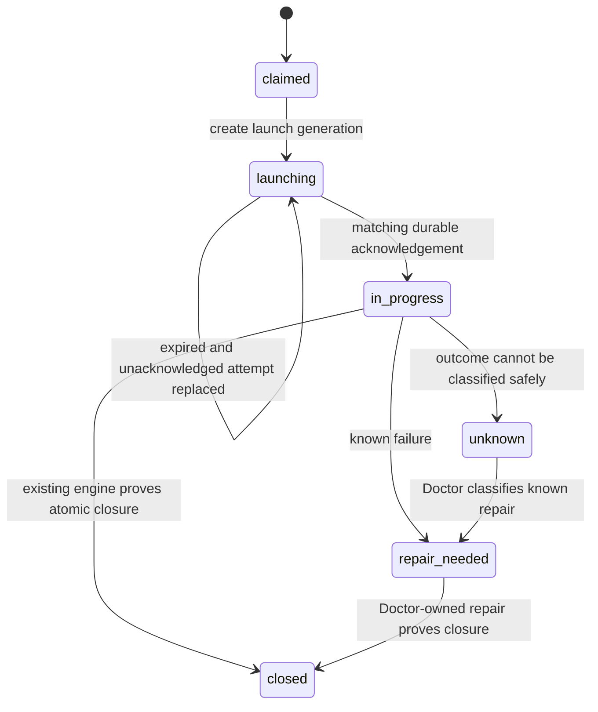

# feat: Vault Git V2 background worker

## Goal Capsule

- **Objective:** make `vault-git complete` return an opaque task identifier within two seconds after durable exclusive admission and worker acknowledgement, while one background worker closes the existing transaction safely.
- **Authority:** [issue #361](https://github.com/nathanvale/claude-code-config/issues/361), its confirmed acceptance criteria in `docs/runbooks/issue-to-pr/issue-361-ledger.md`, and the canonical vault project `projects/vault-git-transaction-manager/GOAL.md`.
- **Execution profile:** one bounded Vault Git worker. Keep Git, checker, receipt, remote-ledger, release-ledger, and Doctor mutation semantics in their current owners.
- **Stop conditions:** foreground success before durable acknowledgement; two workers for one transaction generation; any weakened exact-path, head, lease, activation, capability, or generation fence; automatic retry after unknown publication; public leakage of private worker material.

## Product Contract

### Summary

Replace the current foreground wait on a private child's whole lifecycle with durable task admission plus an acknowledged background worker. The public caller receives a stable task identifier quickly. `status --task-id` projects bounded progress and one safe continuation. Long-running healthy work remains `in_progress`; launcher faults, lost workers, remote failures, repair states, and genuinely unknown outcomes retain distinct meanings.

### Problem Frame

The public CLI launches `complete` privately with `DEFAULT_TIMEOUTS.pushMs`, waits for child close, and kills the process group when that deadline expires. Timeout and malformed child output then collapse to `remote_unavailable`. A healthy transaction can therefore be killed and mislabeled after 30 seconds even when the remote is available.

Current receipts protect transaction revisions and capability custody but do not own task admission, exclusive worker claims, launch acknowledgement, heartbeat, or worker terminal state. Current `status` cannot select or project a task. Detaching the existing child alone is unsafe because the parent retains its output pipes and no durable claim/ack recovery boundary exists.

### Requirements

- **R1:** return one durable opaque task identifier within two seconds, only after exclusive claim and matching worker acknowledgement.
- **R2:** join identical transaction, generation, capability, and normalized-input fingerprints to one task and one worker; refuse every changed fingerprint dimension.
- **R3:** keep the existing engine as sole transaction mutation owner and preserve every current write fence.
- **R4:** add task-selected status with state, phase, observational heartbeat, checkpoint, elapsed time, terminal result, foreground-continuation signal, and exactly one next action.
- **R5:** keep public results free of capabilities, credentials, auth-bearing URLs, private paths, raw Git output, child output, and process diagnostics.
- **R6:** separate admission, launch-acknowledgement, heartbeat-freshness, and transaction-stage timing; healthy work beyond 30 seconds stays `in_progress`.
- **R7:** distinguish launch failure, launch-protocol corruption, lost worker, genuine remote failure, `repair_needed`, and genuinely `unknown`.
- **R8:** recover claim-before-spawn, acknowledgement-before-response, restart, stale-heartbeat, and late-child cases without duplicate mutation or authority.
- **R9:** keep discovery metadata, rendered help, parser acceptance, public schemas, and runtime semantics aligned.
- **R10:** prove the real public processes, concurrency, crash matrix, privacy, guard falsification, and existing regressions.
- **R11:** after separate approval, prove one live exact-path transaction, remote closure, aligned `main`, and clean-clone vault check.
- **R12:** finish at the exact implementation head with zero open P0/P1 findings and green hosted CI.

### Scope Boundaries

In scope: one transaction-specific task lifecycle, private XDG task state, exclusive claim/join, acknowledged detached launch, task inspection, safe classification, recovery, and production-shaped proof.

Out of scope: a generic scheduler, notification transport, model router, the separate inspect-only preflight worker, automatic unknown-outcome retry, vault reconciliation, identity repair, activation, remote setup, or performance tuning beneath the transaction stages.

### Acceptance Examples

- Twenty identical callers receive one task identifier while one checker invocation proves one worker.
- A changed summary, capability, transaction identifier, or lease generation refuses rather than joins.
- Killing the foreground after durable acknowledgement leaves the worker alive; retry returns the same task.
- A held healthy worker remains inspectable beyond the scaled former 30-second deadline.
- Malformed or missing acknowledgement produces a launch-specific repair continuation, never `remote_unavailable`.
- Stale heartbeat triggers Doctor inspection and never authorizes a replacement worker.

## Planning Contract

### Key Technical Decisions

- **KTD1: task state is a separate private aggregate.** Store task lifecycle under owner-only XDG state. Reuse existing durability and publish-ordering primitives. Never put operational task state in the vault, remote ledger, or transaction receipt.
- **KTD2: claim identity and launch identity are different fences.** Bind one stable, receipt-scoped exclusive claim slot to transaction, receipt, remote, lease generation, capability digest, and normalized input fingerprint. Bind each launch attempt to a replaceable launch generation. A same-input `complete` retry may rotate an expired unacknowledged generation once, then become the launch winner. Any acknowledged or outcome-uncertain attempt routes to inspection instead.
- **KTD3: acknowledgement precedes engine entry and foreground success.** The matching child durably transitions `launching` to `in_progress` before transaction mutation. The foreground returns only after observing that durable transition.
- **KTD4: heartbeat is evidence, never authority.** Heartbeat and checkpoint are observational. They do not renew the lease, extend a capability, bypass a transaction fence, or authorize replacement.
- **KTD5: the existing engine remains the mutation boundary.** The worker invokes the current complete/join/repair composition. It does not duplicate checker, commit, push, release, receipt, or Doctor rules.
- **KTD6: public projection is additive within lifecycle schema 1.** Preserve `vault-git.lifecycle-result` and every existing lifecycle field. Add optional task fields plus task-selected status. Keep status without a selector on the existing transaction-inspection path. Update the command contract, parser, schema, and runtime together.
- **KTD7: split launch timing from transaction timing.** Use a configurable 1.5-second start/ack deadline only for admission. Persist acknowledgement in task state, never infer it from stdout. Spawn with detached standard streams, close caller-owned descriptors, and unref after acknowledgement. Do not reuse `pushMs` as the worker-lifecycle deadline.
- **KTD8: recovery is state-dependent and fail closed.** Known failure exposes one Doctor-owned action. Unknown worker or publication outcome retains its last checkpoint and never auto-retries.
- **KTD9: tests cross the public process boundary.** Keep the three committed RED rows and atomic-close GREEN canary. Add task-layer barriers only where the production state machine creates real boundaries.
- **KTD10: task updates use revision CAS.** Persist immutable task revisions plus a validated current pointer. Every heartbeat, checkpoint, terminal write, and recovery transition compares the expected revision and launch generation. Terminal state never regresses.
- **KTD11: task IDs never become unchecked paths.** Validate opaque IDs before resolution; reject symlinks; keep task directories `0700` and files `0600`. Opportunistic cleanup may remove only terminal records older than 30 days. Active, `repair_needed`, and `unknown` evidence is never pruned automatically.
- **KTD12: production source closure includes the worker.** Add every new production module to the executable-source identity list and refresh activation proof before live qualification.
- **KTD13: heartbeat freshness is deterministic but non-authoritative.** A healthy worker records heartbeat at most every five seconds. Status marks it stale after 20 seconds using injected time for tests. Staleness changes the inspection action only; it never changes lease validity or permits relaunch.

### Domain Terms

- **Task claim:** stable, exclusive admission for one transaction-generation-input-capability fingerprint.
- **Launch generation:** replaceable identity for one unacknowledged worker start attempt.
- **Worker acknowledgement:** durable proof that the matching child owns the launch generation before engine entry.
- **Task heartbeat:** observational liveness sample with no write authority.
- **Checkpoint:** last durably classified transaction stage used by status and Doctor.

### High-Level Technical Design





### Existing Owner Map

- `src/model.ts`: public lifecycle/task vocabulary and safe projection types.
- `src/store.ts`: existing receipt durability primitives and private capability process launcher.
- New task lifecycle/store modules: pure transition invariants plus private atomic persistence.
- `src/cli.ts`: thin claim/join, acknowledged launch, worker invocation, and public projection.
- `src/command-contract.ts`: task-selected status discovery, help, and parser contract.
- `src/engine.ts`: unchanged sole transaction mutation owner.
- `tests/live-acceptance.integration.test.ts`: primary public real-process seam.
- `tests/smoke/durable-phase-matrix.integration.test.ts`: transaction-stage crash and recovery proof.

## Implementation Units

### U1. Durable task admission

Create the private task aggregate and atomically claim one opaque task before launch. Use one stable receipt-scoped claim slot, immutable revision history, and CAS updates so random task IDs cannot let concurrent callers each win. This unit establishes deterministic fingerprint inputs, path validation, permissions, durability ordering, and terminal-only retention. It does not invoke the transaction engine.

```yaml
id: durable-task-admission
name: Durable task admission
goal: Return one durable opaque task ID within 2 seconds, only after exclusive claim and worker acknowledgement.
files:
  - runtime/vault-git-transaction-manager/src/model.ts
  - runtime/vault-git-transaction-manager/src/task-state.ts
  - runtime/vault-git-transaction-manager/src/task-store.ts
  - runtime/vault-git-transaction-manager/src/store.ts
  - runtime/vault-git-transaction-manager/tests/task-state.test.ts
  - runtime/vault-git-transaction-manager/tests/task-store.test.ts
depends_on: []
execution_mode: tdd
acceptance_tests:
  - "AC 1 holds: a real complete process observes one receipt-scoped exclusive claim, immutable CAS-backed task state, and matching durable worker acknowledgement before returning one opaque task ID in under two seconds."
ac_mapping:
  - 1
rationale: null
```

### U2. Single-flight join and refusal

Add atomic claim-or-join semantics. Identical calls share the stable task. Every changed fingerprint dimension fails closed. The existing twenty-caller RED row becomes the owning integration test.

```yaml
id: single-flight-join-refusal
name: Single-flight join and refusal
goal: Join identical concurrent calls to one task and one worker; refuse changed transaction, generation, capability, or input.
files:
  - runtime/vault-git-transaction-manager/src/task-state.ts
  - runtime/vault-git-transaction-manager/src/task-store.ts
  - runtime/vault-git-transaction-manager/src/cli.ts
  - runtime/vault-git-transaction-manager/tests/task-state.test.ts
  - runtime/vault-git-transaction-manager/tests/task-store.test.ts
  - runtime/vault-git-transaction-manager/tests/live-acceptance.integration.test.ts
depends_on:
  - durable-task-admission
execution_mode: tdd
acceptance_tests:
  - "AC 2 holds: twenty identical public completions return one task ID and cause one worker, while changed transaction, generation, capability, and summary fingerprints refuse."
ac_mapping:
  - 2
rationale: null
```

### U3. Fenced worker composition

Introduce a bounded worker composition that may enter the existing engine only after matching launch acknowledgement. Only the launch winner receives capability bytes through the existing inherited-FD custody lane; joiners never spawn. Keep every write operation behind current owners and add regressions that would detect a bypass.

```yaml
id: fenced-worker-composition
name: Fenced worker composition
goal: Keep the existing engine as sole mutation owner and preserve every exact-path, head, lease, activation, capability, and generation fence.
files:
  - runtime/vault-git-transaction-manager/src/task-state.ts
  - runtime/vault-git-transaction-manager/src/task-worker.ts
  - runtime/vault-git-transaction-manager/src/cli.ts
  - runtime/vault-git-transaction-manager/src/engine.ts
  - runtime/vault-git-transaction-manager/tests/task-worker.test.ts
  - runtime/vault-git-transaction-manager/tests/live-acceptance.integration.test.ts
depends_on:
  - single-flight-join-refusal
execution_mode: tdd
acceptance_tests:
  - "AC 3 holds: background completion invokes the existing engine after acknowledgement and every existing exact-path, head, lease, activation, capability, and generation regression remains green."
ac_mapping:
  - 3
rationale: null
```

### U4. Task-selected public status

Add the schema-1 public task projection and `status --task-id`. Preserve status-without-selector and all existing lifecycle fields while exposing only bounded, agent-usable worker state and one next action. Validate task IDs before any path lookup; not-found status remains local and performs no activation or network work.

```yaml
id: task-selected-status
name: Task-selected public status
goal: Expose task-selected status with state, phase, heartbeat, checkpoint, elapsed time, terminal result, and one next action.
files:
  - runtime/vault-git-transaction-manager/src/model.ts
  - runtime/vault-git-transaction-manager/src/command-contract.ts
  - runtime/vault-git-transaction-manager/src/cli.ts
  - runtime/vault-git-transaction-manager/tests/command-contract.test.ts
  - runtime/vault-git-transaction-manager/tests/cli.test.ts
  - runtime/vault-git-transaction-manager/tests/live-acceptance.integration.test.ts
depends_on:
  - durable-task-admission
execution_mode: tdd
acceptance_tests:
  - "AC 4 holds: status selects the returned task ID and reports state, phase, heartbeat, checkpoint, elapsed time, terminal result, foreground continuation signal, and exactly one next action."
ac_mapping:
  - 4
rationale: null
```

### U5. Safe public task projection

Constrain task persistence and CLI output to safe fields. Add capability, credential, path, auth-URL, raw-Git, child-stdout, and child-stderr canaries across complete and status.

```yaml
id: safe-task-projection
name: Safe public task projection
goal: Keep public task output free of credentials, capabilities, private paths, auth URLs, raw Git output, and child output.
files:
  - runtime/vault-git-transaction-manager/src/model.ts
  - runtime/vault-git-transaction-manager/src/task-state.ts
  - runtime/vault-git-transaction-manager/src/cli.ts
  - runtime/vault-git-transaction-manager/tests/cli.test.ts
  - runtime/vault-git-transaction-manager/tests/live-acceptance.integration.test.ts
  - runtime/vault-git-transaction-manager/tests/process-cli.ts
depends_on:
  - task-selected-status
execution_mode: tdd
acceptance_tests:
  - "AC 5 holds: combined complete and task-status stdout and stderr disclose none of the injected credential, capability, private-path, auth-URL, raw-Git, child-output, or process diagnostic canaries."
ac_mapping:
  - 5
rationale: null
```

### U6. Acknowledged detached launch

Separate worker start and acknowledgement timing from the end-to-end transaction. Poll the exact launch generation's durable acknowledgement within the configurable 1.5-second admission budget. Spawn detached with no caller-owned standard streams, then unref. Keep a held worker alive beyond the scaled former deadline.

```yaml
id: acknowledged-detached-launch
name: Acknowledged detached launch
goal: Keep healthy work beyond 30 seconds in_progress; never falsely report remote_unavailable.
files:
  - runtime/vault-git-transaction-manager/src/task-state.ts
  - runtime/vault-git-transaction-manager/src/task-worker.ts
  - runtime/vault-git-transaction-manager/src/store.ts
  - runtime/vault-git-transaction-manager/src/cli.ts
  - runtime/vault-git-transaction-manager/tests/store.test.ts
  - runtime/vault-git-transaction-manager/tests/live-acceptance.integration.test.ts
  - runtime/vault-git-transaction-manager/tests/process-cli.ts
depends_on:
  - fenced-worker-composition
  - task-selected-status
execution_mode: tdd
acceptance_tests:
  - "AC 6 holds: complete returns after durable acknowledgement while the worker remains alive and status stays in_progress beyond the scaled former 30-second private-launch deadline without remote_unavailable."
ac_mapping:
  - 6
rationale: null
```

### U7. Cause-true failure classification

Give launcher, acknowledgement, worker-loss, remote, repair, and unknown paths distinct internal causes and public outcomes. Reconcile worker failure against current receipt and Doctor evidence instead of mapping every catch to `repair_needed`. Keep one Doctor-owned continuation for known repair and no unsafe continuation for unknown publication.

```yaml
id: cause-true-failure-classification
name: Cause-true failure classification
goal: Distinguish launch failure, lost worker, genuine remote failure, repair_needed, and genuinely unknown.
files:
  - runtime/vault-git-transaction-manager/src/model.ts
  - runtime/vault-git-transaction-manager/src/task-state.ts
  - runtime/vault-git-transaction-manager/src/task-worker.ts
  - runtime/vault-git-transaction-manager/src/cli.ts
  - runtime/vault-git-transaction-manager/tests/task-state.test.ts
  - runtime/vault-git-transaction-manager/tests/cli.test.ts
  - runtime/vault-git-transaction-manager/tests/live-acceptance.integration.test.ts
  - runtime/vault-git-transaction-manager/tests/process-cli.ts
depends_on:
  - acknowledged-detached-launch
execution_mode: tdd
acceptance_tests:
  - "AC 7 holds: malformed and missing acknowledgement, spawn failure, lost worker, genuine remote failure, repair_needed, and unknown each retain cause-true status and exactly one safe continuation where one exists."
ac_mapping:
  - 7
rationale: null
```

### U8. Ownership crash recovery

Add durable launch generations, revision CAS, recovery inspection, and public-process kill barriers at the two parent-death windows. A same-input retry may rotate exactly one expired unacknowledged launch generation; acknowledged or uncertain work cannot relaunch. Prove late children refuse before engine entry and stale heartbeat never creates replacement authority.

```yaml
id: ownership-crash-recovery
name: Ownership crash recovery
goal: Recover claim-before-spawn, acknowledgement-before-response, restart, and stale-heartbeat cases without duplicate workers, commits, pushes, or lease owners.
files:
  - runtime/vault-git-transaction-manager/src/task-state.ts
  - runtime/vault-git-transaction-manager/src/task-store.ts
  - runtime/vault-git-transaction-manager/src/task-worker.ts
  - runtime/vault-git-transaction-manager/src/cli.ts
  - runtime/vault-git-transaction-manager/tests/task-state.test.ts
  - runtime/vault-git-transaction-manager/tests/live-acceptance.integration.test.ts
  - runtime/vault-git-transaction-manager/tests/process-cli.ts
  - runtime/vault-git-transaction-manager/tests/smoke/fixture.ts
depends_on:
  - cause-true-failure-classification
execution_mode: tdd
acceptance_tests:
  - "AC 8 holds: foreground death after claim and after acknowledgement, process restart, stale heartbeat, and a late expired-attempt child yield at most one task, worker, commit, push, and lease owner."
ac_mapping:
  - 8
rationale: null
```

### U9. Aligned CLI contract

Lock the discovery-to-runtime surface for the new option and additive schema-1 task fields. Add every production task module to executable-source identity before activation checks, then prove rendered help, parsing, envelopes, and runtime semantics together.

```yaml
id: aligned-cli-contract
name: Aligned CLI contract
goal: Align CLI discovery, help, parsing, schemas, and runtime behaviour.
files:
  - runtime/vault-git-transaction-manager/src/model.ts
  - runtime/vault-git-transaction-manager/src/command-contract.ts
  - runtime/vault-git-transaction-manager/src/cli.ts
  - runtime/vault-git-transaction-manager/tests/command-contract.test.ts
  - runtime/vault-git-transaction-manager/tests/cli.test.ts
  - runtime/vault-git-transaction-manager/README.md
depends_on:
  - task-selected-status
  - cause-true-failure-classification
execution_mode: tdd
acceptance_tests:
  - "AC 9 holds: discovery metadata, rendered status help, parser acceptance, additive lifecycle schema 1, production executable-source identity, and real runtime behaviour agree on the same task-selected contract."
ac_mapping:
  - 9
rationale: null
```

### U10. Production-process proof matrix

Complete the real-process concurrency, crash, privacy, and transaction-stage matrix. Add mutation-based negative controls only after the worker seams stabilize, so the suite proves its uniqueness and generation guards are load-bearing.

```yaml
id: production-process-proof-matrix
name: Production-process proof matrix
goal: Pass real-process admission, concurrency, crash, privacy, guard-falsification, and existing regression suites.
files:
  - runtime/vault-git-transaction-manager/tests/live-acceptance.integration.test.ts
  - runtime/vault-git-transaction-manager/tests/process-cli.ts
  - runtime/vault-git-transaction-manager/tests/activation-negative-controls.integration.test.ts
  - runtime/vault-git-transaction-manager/tests/background-worker-negative-controls.integration.test.ts
  - runtime/vault-git-transaction-manager/tests/smoke/durable-phase-matrix.integration.test.ts
  - runtime/vault-git-transaction-manager/tests/smoke/fixture.ts
  - runtime/vault-git-transaction-manager/tests/smoke/fixture-selftest.integration.test.ts
depends_on:
  - ownership-crash-recovery
  - safe-task-projection
  - aligned-cli-contract
execution_mode: tdd
acceptance_tests:
  - "AC 10 holds: the public admission, twenty-caller, parent-death, restart, stale-heartbeat, worker-phase, privacy, guard-falsification, exact-path, atomic-close, two-clone, Doctor, repair, and unrelated-state suites pass."
ac_mapping:
  - 10
rationale: null
```

### U11. Live exact-path qualification

After local convergence, refreshed source-linked activation, and separate live-mutation approval, run one canonical transaction through the real vault and remote. Store raw receipts only in private XDG state; record bounded immutable proof in the issue ledger and canonical vault result owner.

```yaml
id: live-exact-path-qualification
name: Live exact-path qualification
goal: Prove one separately approved live exact-path transaction, remote closure, aligned main, and clean-clone vault check.
files:
  - docs/runbooks/issue-to-pr/issue-361-ledger.md
  - runtime/vault-git-transaction-manager/tests/live-acceptance.integration.test.ts
  - runtime/vault-git-transaction-manager/tests/smoke/real-path.integration.test.ts
depends_on:
  - production-process-proof-matrix
execution_mode: proof_first
acceptance_tests:
  - "AC 11 holds: with separate approval, one live exact-path complete returns within two seconds, its worker closes remotely, local and remote main align, and a clean clone passes the vault check."
ac_mapping:
  - 11
rationale: null
```

### U12. Exact-head qualification

Run the full package and repository gates at one immutable head, then obtain adversarial exact-head review and hosted CI. Keep any finding resolution as one finding, one commit before repeating the qualification.

```yaml
id: exact-head-qualification
name: Exact-head qualification
goal: Finish with zero open P0/P1 findings and green hosted CI.
files:
  - docs/runbooks/issue-to-pr/issue-361-ledger.md
  - runtime/vault-git-transaction-manager/package.json
  - runtime/vault-git-transaction-manager/src/cli.ts
  - runtime/vault-git-transaction-manager/src/task-state.ts
  - runtime/vault-git-transaction-manager/src/task-worker.ts
  - runtime/vault-git-transaction-manager/tests/live-acceptance.integration.test.ts
depends_on:
  - live-exact-path-qualification
execution_mode: proof_first
acceptance_tests:
  - "AC 12 holds: exact-head adversarial review reports zero open P0/P1 findings and every required hosted CI check is green at that same head."
ac_mapping:
  - 12
rationale: null
```

## System-Wide Impact

- **Foreground callers:** regain control after proved admission and may continue non-vault work while inspecting by task ID.
- **Transaction engine:** remains the sole mutation owner; receives work only from an acknowledged matching launch generation.
- **Private state:** adds one owner-only task aggregate. Receipt and remote ledger formats remain focused on transaction truth.
- **CLI consumers:** receive additive task fields and one new task selector. Compatibility is characterized before the schema-version decision.
- **Doctor:** retains repair ownership and gains task checkpoint evidence, not a second repair implementation.

## Risks and Mitigations

- **Duplicate worker after crash:** exclusive task claim plus launch generation; kill-window and twenty-caller proof.
- **Late child crosses authority:** compare launch generation before engine entry; mutation-based negative control.
- **Stale heartbeat misused as lease:** type and test heartbeat as observational; never call lease renewal from task reporting.
- **Detached process still anchors caller:** use detached standard streams and return after durable ack; held-worker latency proof.
- **False remote diagnosis persists:** independently test spawn, missing ack, malformed ack, lost worker, and real remote failure.
- **Private output leak:** safe projection allowlist plus capability/credential/path/auth/child-output canaries.
- **Public contract drift:** one command-contract owner and discovery/help/parser/runtime parity tests.
- **Test hook becomes production authority:** barriers observe real persisted boundaries; production code never trusts a test-only signal for mutation.

## Verification Contract

- Run focused task-state, task-store, worker, CLI, command-contract, store, and live-acceptance tests after their owning units.
- Run the worker phase matrix, exact-path, unrelated-state, atomic-close, two-clone fencing, takeover, Doctor, repair, stale-writer, and activation negative-control suites before live proof.
- Run package typecheck, formatter/linter, and the repository's canonical verification commands.
- Run mutation-based guard falsification for exclusive claim and late-child generation refusal.
- Obtain separate approval before the live vault transaction, push, pull request, merge, or deployment.
- Bind final review, hosted CI, and live proof to the same exact source head where their contracts require it.

## Definition of Done

- One opaque task ID returns under two seconds after durable claim and acknowledgement.
- Identical calls join one worker; changed authority or input refuses.
- Healthy long-running work stays inspectable and cause-true.
- Every crash and restart case yields at most one worker and one safe continuation.
- Existing transaction fences and atomic closure remain green.
- Public task surfaces reveal no private material.
- CLI discovery, help, parser, schema, and runtime agree.
- Separately approved live proof closes the exact path and passes clean-clone validation.
- Exact-head review has zero open P0/P1 findings and hosted CI is green.

## Execution Order

1. Establish U1 through U3: durable claim, single-flight identity, and fenced engine entry.
2. Establish U4 through U7: status, privacy, detached launch, and cause-true classification.
3. Establish U8 through U10: crash recovery, contract parity, and the full production-process proof matrix.
4. Request the existing separate gate for U11 live vault proof.
5. Run U12 exact-head review and hosted qualification before landing.
