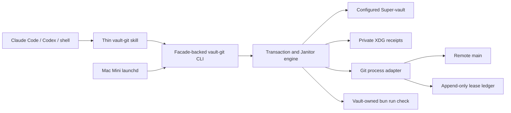
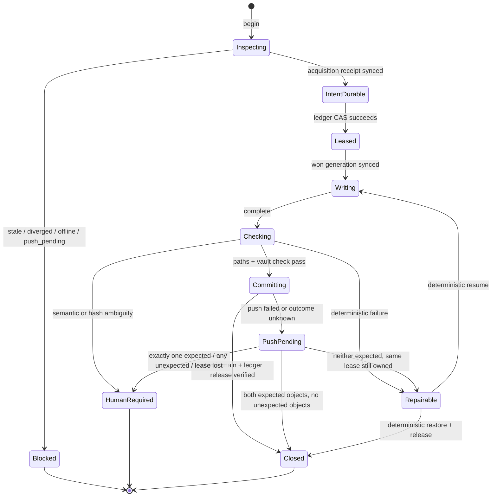

# Vault Git Transaction Manager - Plan

Primary implementation repository: `claude-code-config`.

Scheduled-host adapter repository: `dotfiles`.

The Super-vault owns this plan and its decisions. It does not own the reusable
runtime or the Mac Mini machine configuration.

## Goal Capsule

Build one agent-native transaction boundary for safe, direct-to-`main`
Super-vault writes. It must preserve unrelated work, prevent concurrent laptop
and Mac Mini writers, create meaningful Git history, recover from interrupted
operations, and run a conservative nightly hygiene pass.

Authority order:

1. The accepted decision log owns product behavior.
2. `~/.config/context/vault.md` owns configured-vault identity and write authority.
3. The new runtime package owns transaction, lease, receipt, recovery, and
   Janitor mechanics.
4. The vault's `bun run check` owns vault document validity.
5. The thin skill owns agent workflow and calls the runtime.
6. Dotfiles owns the Mac Mini schedule and installation.

Execution profile:

- Implement code-repository units in isolated worktrees and separate PRs.
- Keep vault plan/status edits scoped on the canonical vault `main` checkout.
- Start with a hermetic two-clone vertical slice.
- Activate live vault writes only after remote access and reconciliation pass.
- Install no nightly schedule until Nathan selects its Melbourne-time window.

Refuse live mutation when:

- the configured vault cannot be resolved;
- remote freshness cannot be proved;
- the lease owner is active or cannot be proved inactive;
- local `main` is behind or diverged;
- a `push_pending` transaction blocks new admission and non-owner mutation;
  deterministic owner recovery follows R17a-R17b;
- declared paths changed outside the transaction;
- a repair would require semantic judgment, conflict resolution, data loss, or
  secret-bearing output.

Tail ownership:

- `claude-code-config` owns runtime and skill PR review, tests, and release.
- `dotfiles` owns schedule installation and reboot proof on the Mac Mini.
- The Super-vault records rollout evidence and the chosen run time.

## Product Contract

### Summary

Agents start a transaction before changing canonical vault files. The manager
proves freshness, records a durable acquisition intent, obtains the
single-writer lease, and records the won generation before granting write
authority. The owning workflow writes only declared paths, then explicitly asks
the manager to complete the meaningful event. The manager validates, commits,
pushes, releases the lease, and returns exactly one next safe action.

The Nightly Vault Janitor uses the same manager. It repairs only deterministic
manager-owned or checker-owned hygiene on a clean tree. Everything ambiguous is
reported without mutation.

### Problem Frame

Routine worktrees make the Super-vault stale and costly to maintain. Direct
uncoordinated writes solve freshness but create race, history, recovery, and
partial-failure risks. Raw Git commands also force every agent to reconstruct
the same safety policy from prose.

The system needs one mechanical owner that keeps the vault current without
turning every note into a branch or every save into a commit.

### Actors

- A1. Foreground workflow: a Claude Code, Codex, or human-shell caller that owns
  one meaningful vault event.
- A2. Hygiene worker: a bounded internal worker started at transaction close,
  by `tidy now`, or by the nightly schedule.
- A3. Operator: Nathan, who resolves semantic ambiguity, stale remote ownership,
  destructive repair, and schedule activation.
- A4. Scheduled host: the Mac Mini, the only machine allowed to register the
  recurring Janitor job.

### Requirements

#### Transaction admission and single-writer safety

- R1. A caller must invoke `begin` with one event type and an explicit initial
  set of owned leaf-file paths. Every owned path must be admitted and baselined
  before its first canonical vault filesystem mutation. At admission, each path
  must be clean in both index and worktree, or absent for an admitted new file.
  A move owns both source and destination; a directory request expands to leaf
  paths before write permission is granted for them.
- R2. `begin` must resolve the configured vault, fetch remote state, and require
  local `main` to equal fetched upstream `main` exactly. Behind, ahead,
  diverged, unreachable, or `push_pending` states refuse admission; an ahead
  state without a matching recoverable receipt requires A3.
- R3. `begin` must acquire one remote lease before allowing writes and bind the
  lease generation, local HEAD, remote HEAD, event, actor, and initial owned
  paths to an opaque transaction ID. During the writing phase, `join` may add a
  fresh path only after the manager validates and baselines it and durably
  appends it to the receipt. Only then may the nested workflow mutate that path.
  An admitted path cannot be removed or rebaselined.
- R4. Only one conforming writer may hold authority. A second writer must make
  no canonical vault filesystem change.
- R5. Lease expiry alone must never authorize takeover. V1 has no automatic
  stale-lease reclaim, including on the same host; every stale or expired lease
  requires A3 because the short-lived CLI process cannot prove the caller that
  owns the editing session is dead.
- R6. Every manager-owned write-capable phase must revalidate the transaction
  ID and lease generation so an operator-replaced lease fences the old writer.
  The lease fences manager-owned commits and pushes, not raw filesystem writes
  by a stale editor. A superseded host is quarantined on its next manager call
  until `doctor` proves its local state reconciled.

#### Meaningful event completion and Git history

- R7. The owning workflow must invoke `complete` explicitly. Idle time, file
  watches, save events, and the Janitor must not infer completion.
- R8. One meaningful event creates one commit, including its related files and
  mechanical spelling, link, or formatting corrections. Each such path must be
  admitted through `begin` or `join` before that path is mutated.
- R9. Event types include project creation; material goal, scope, or owner
  change; accepted or superseded decision; admitted note creation; durable
  document completion, move, rename, archive, or deletion; and meaningful
  handoff, completion, or reopening.
- R10. Questions, drafts, candidate wording, conversational progress, and
  private offline captures must not create canonical commits.
- R11. `complete` must commit only paths admitted in the current durable
  receipt and verify each against its recorded baseline,
  prove unrelated staged, unstaged, and untracked state is unchanged, run the
  vault-owned check, and freeze only declared path content in a private
  temporary index. It must build and verify the exact candidate tree before
  advancing local `main` with an expected-old-OID ref update. The frozen owned
  blobs must equal the content hashes recorded immediately before the vault
  check. Only owned entries in the real index may then change. Every Git
  pathspec must use top-level literal encoding; no working-tree reread may occur
  after candidate freeze.
- R12. The manager must accept a meaningful agent-written summary, validate a
  Conventional Commit subject, and append stable `Vault-Event`,
  `Vault-Transaction`, and `Vault-Actor` trailers.
- R13. Commit messages and remote lease records must omit secrets, private
  paths, raw evidence, and private receipt content.
- R14. The manager must push the verified commit immediately and verify remote
  state before reporting success.
- R14a. Each live host must use a dedicated repository-scoped Git identity
  admitted by A3. The runtime must not read, store, print, or install its
  credential; the transport must prove host identity and non-interactive access
  without embedding credentials in remote URLs, receipts, logs, or launchd.

#### Recovery and private evidence

- R15. The manager must write a private receipt before the first canonical
  change and append each phase transition without erasing prior evidence.
- R16. Receipts, recoverable copies, offline drafts, and Janitor reports must
  live outside the vault under private XDG state with owner-only permissions.
- R17. A failed or unknown push must preserve the local commit. The originating
  host records local `push_pending` until remote reconciliation; the remote
  ledger remains the cross-host authority.
- R17a. The host that owns an unpublished commit owns its retry. Other hosts
  block on the observed active or unknown remote lease and report its
  non-sensitive host ID, transaction ID, and one next safe action. If remote
  `main` and the ledger prove the exact atomic close already landed, any host
  may classify the transaction closed. A lost-acknowledgement transaction also
  classifies closed when its expected main commit and matching release record
  are ancestors of the current append-only tips, even after later transactions
  land.
- R17b. After every unsuccessful or unknown atomic push, the manager must fetch
  exact `main` and ledger refs. Any unexpected object takes precedence and is
  `host_contract_breach`. With no unexpected objects, both expected objects
  means closed; neither is retryable only while the same lease generation
  remains owned; exactly one expected object is `host_contract_breach`. A
  breach requires A3 and has no automated retry.
- R18. Remote movement during a transaction must stop completion and preserve
  evidence. Recovery must deliberately replay in a new transaction and must
  never auto-rebase or auto-merge.
- R19. `doctor` must report what happened, what changed, same-input retry
  safety, one next safe action, and a diagnostics reference.
- R20. `repair` may resume or restore only when current hashes and recorded
  phase prove the action deterministic. Any mismatch requires A3.
- R20a. Human stale-lease recovery must use a named
  `repair stale-lease-takeover` action bound to the expected transaction ID and
  ledger generation plus a single-use confirmation token generated from a
  fresh `doctor` proof. It revalidates HEADs, receipt, and owned-path hashes,
  appends an audited superseding-abandon transition and private receipt, and
  has no force or generic bypass. A3 must attest the prior writer is stopped;
  the superseded host remains quarantined until its local receipt, HEAD, index,
  and owned paths reconcile without discarding evidence.
- R21. Offline mode must keep the canonical vault read-only and must create no
  hidden local commit. Optional captures remain private and unapplied.

#### Agent-native interface

- R22. One non-interactive CLI must expose `begin`, `join`, `complete`,
  `status`, `preview`, `doctor`, `repair`, the exact immediate-worker command
  `tidy now`, Janitor invocation, help, and machine-readable command discovery.
- R23. No-arg use must show a bounded, read-only state dashboard with exactly
  one next safe action.
- R24. JSON results must expose run correlation, transaction phase, write
  permission, changed state, retry safety, and one next safe action without
  leaking local private paths.
- R25. Human help, parser acceptance, discovery metadata, structured result
  contracts, exit behavior, and runtime semantics must be mechanically aligned.
- R26. Claude Code, Codex, human shell, and scheduled callers must receive the
  same policy. Caller labels grant no extra authority.
- R26a. Nested vault workflows must join the outer transaction ID and add fresh
  owned paths through the manager before mutating them. `begin` issues separate
  transaction-scoped owner and join capabilities; only the owner capability may
  complete, repair, or release. Capabilities must never appear in argv, logs,
  diagnostics, receipts, or remote records. V1 capabilities prevent accidental
  role misuse inside one trusted Unix account; they are not a security boundary
  against a hostile process running as that same account.

#### Janitor and bounded delegation

- R27. The Janitor must prove remote access, current `main`, a clean whole tree,
  and the writer lease before any unattended repair.
- R28. It may auto-apply only deterministic manager-owned repairs or
  checker-owned repairs identified by stable machine-readable IDs and a
  checker-owned repair registry. Semantic rewrites, conflicts, unfinished
  work, secrets, raw evidence, and private receipts remain preview-only.
- R29. V1 document quality is limited to the vault-owned deterministic check.
  Semantic Agent Writing review remains deferred and disabled for unattended
  runs until a concrete privacy and execution owner exists.
- R30. Every Janitor run must report stale receipts, lease anomalies,
  `push_pending`, proposed transaction groups, skipped repairs, and one next
  safe action.
- R31. A hygiene worker may start only at transaction close, for explicit
  `tidy now`, or from the nightly schedule. It must acquire a new transaction
  and lease, emit its receipt, and exit.
- R32. While a hygiene worker holds the lease, other agents must treat the
  vault as read-only. The foreground agent may continue non-vault work.

#### Rollout and scheduling

- R33. Deterministic tests must cover lifecycle failures and a real two-clone
  race representing the laptop and Mac Mini.
- R34. Live activation must remain blocked while the current vault is ahead of
  its inaccessible remote or contains unresolved `push_pending` history.
- R35. The runtime must be schedulable but must not own machine scheduling.
- R36. Dotfiles must install at most one Mac Mini schedule, no laptop schedule,
  and no implicit time. A3 selects the Melbourne-time window at installation.
  The installer and every run must verify the system timezone is
  `Australia/Melbourne`.
- R36a. The scheduled wrapper must persist the last successful Melbourne local
  date and run at most one catch-up after wake or boot when a scheduled day was
  missed. It must never replay multiple missed days. Calendar, wake-catchup,
  and boot-catchup triggers use the same local singleton and remote lease.

### Key Product Decisions

- One meaningful event is the commit boundary. Governs R7-R14.
- The Super-vault writes on current `main`; code repositories keep their normal
  worktree rule. Governs R1-R6 and R34.
- A remote lease and private receipt precede canonical writes. Governs R1-R6
  and R15-R21.
- The Janitor is conservative and check-owned. Governs R27-R32.
- The Mac Mini is the sole scheduled host. Governs R35-R36a.

### Flows

#### F1. Foreground transaction

1. A1 calls `begin` with event, actor, and owned paths.
2. The manager resolves the vault, checks global blockers, fetches, and proves
   freshness.
3. The manager durably writes an acquisition-intent receipt containing the
   proposed transaction ID before attempting the remote compare-and-swap.
4. The manager acquires the remote lease, appends the won generation to the
   receipt, and only then returns write authority.
5. A1 writes the declared files.
6. A1 calls `complete` with the transaction ID and summary.
7. The manager re-proves lease and freshness, validates state, runs the vault
   check, freezes the exact owned-path tree in a private index, advances local
   `main` by expected OID, and performs the atomic remote close.
8. The manager verifies both remote refs and reports the next action.

#### F2. Interrupted or failed transaction

1. A caller invokes `status` or `doctor`.
2. The manager reconciles private receipt phase, local HEAD, remote `main`, and
   remote lease generation.
3. It classifies the state as deterministic resume, deterministic restore,
   `push_pending`, remote movement, or human-required ambiguity.
4. For an unknown push result, it checks whether both expected objects exist in
   the current remote histories before deciding to close or retry. A partial or
   unexpected ref state becomes `host_contract_breach` and stops.
5. `repair` executes only the classified deterministic action and only on the
   host that owns an unpublished commit.

#### F3. Nightly Janitor

1. A4 invokes the Janitor by calendar, wake catch-up, or boot catch-up. The
   wrapper proves Melbourne timezone, the local-date run key, installed binary,
   and host-local singleton before calling the runtime.
2. The runtime refuses if the whole tree is dirty, the remote is unavailable,
   or any global blocker exists.
3. It acquires a new hygiene transaction and runs manager and vault checks.
4. It applies only admitted deterministic repairs.
5. It completes through F1 or produces a private preview report with no commit.

#### F4. Transaction-close worker

1. F1 finishes and releases its lease.
2. The caller may start a bounded A2 worker.
3. A2 acquires a separate hygiene transaction through F1.
4. A2 reports its receipt and exits. It never inherits the prior lease.

### Acceptance Examples

- AE1. Two clones call `begin` from the same remote generation. Exactly one
  returns write authority; the loser changes no canonical vault byte. Covers
  R3-R6 and R33.
- AE2. Unrelated files are staged, unstaged, and untracked before `begin`.
  `complete` commits only owned paths and leaves all unrelated bytes and index
  intent unchanged. Covers R11.
- AE3. The remote moves after local validation. `complete` creates no merge or
  rebase and returns a deliberate replay action. Covers R18.
- AE4. A local commit succeeds and the push result is unknown. The origin
  reports local `push_pending`; the other host blocks on the active or unknown
  remote lease. If the exact atomic close is present, both reconcile to closed.
  Covers R17-R17a.
- AE5. The process stops after every durable phase in separate runs. `doctor`
  identifies the phase and returns exactly one safe continuation. Covers
  R15-R20.
- AE6. The Janitor sees a semantic rewrite suggestion. It stores only a private
  proposal and creates no commit. Covers R28-R30.
- AE7. The Mac Mini reboots. One scheduled job remains registered, the laptop
  has none, and overlapping runs are fenced by the same lease. Covers R35-R36a.
- AE8. Project creation calls note routing and decision-log helpers. Both join
  one transaction and the outer workflow creates one commit. Covers R26a.
- AE9. Local `main` is one commit ahead without a matching receipt. `begin`
  returns human-required and publishes nothing. Covers R2.
- AE10. A declared existing path is staged or modified before `begin`.
  Admission fails without altering its bytes or index entry. Covers R1 and R11.
- AE11a. An owned file changes after its checked-content hash is recorded but
  before private-index freeze. Completion refuses as repairable: no local
  commit, unchanged `HEAD` and remote refs, a repairable receipt, and unchanged
  real index and worktree bytes. Covers R11.
- AE11b. An owned file changes after private-index `write-tree` but before
  `update-ref`. Completion commits and pushes only the frozen checked bytes;
  the later edit remains as an unstaged worktree change after the owned index
  entry updates. The receipt becomes closed after verified atomic close or
  `push_pending` after an unknown or failed push. Covers R11 and R17.
- AE12. An atomic push reports failure after exactly one remote ref moves. The
  manager classifies `host_contract_breach`, performs no retry, and routes to
  A3. Covers R17b.
- AE13. A stale writer resumes filesystem edits after operator takeover. Its
  next manager call is fenced and quarantined; no stale commit or push occurs,
  and its local evidence remains recoverable. Covers R6 and R20a.
- AE14. The Mac Mini is powered off for several scheduled days. On boot it runs
  one catch-up, not one run per missed day, and records the trigger and local
  date. Covers R36a.

### Success Criteria

- Every R-ID is traced to at least one implementation unit and one observable
  verification outcome.
- Exactly one writer succeeds in the two-clone race across 20 repeated runs.
- Crash injection at each durable phase never loses a committed outcome or
  silently releases an unresolved lease.
- Unrelated staged, unstaged, and untracked fixtures remain byte-for-byte and
  index-equivalent after success, refusal, and repair.
- A fresh agent can discover the correct next command from CLI output alone.
- No canonical vault mutation occurs in offline, stale, diverged, ambiguous,
  or semantic-review states.

### Scope Boundaries

Included now:

- one configured Super-vault;
- foreground transactions and bounded hygiene workers;
- remote single-writer lease and fencing;
- private receipts, doctor, and deterministic repair;
- exact owned-path commits and push recovery;
- deterministic Janitor using manager-owned and vault-checker-owned repairs;
- Claude Code, Codex, shell, and Mac Mini schedule parity.

Deferred:

- multiple vaults;
- alternative lease services;
- a TUI or dashboard application;
- automatic semantic document rewriting;
- semantic Agent Writing or advisory document-review integration;
- a general workflow engine for non-vault repositories.

Human-only:

- unproven cross-host stale-lease takeover;
- semantic conflict resolution;
- destructive restoration when current hashes differ;
- stale-host filesystem reconciliation after operator takeover;
- intended-host atomic-push contract breach;
- activation time selection;
- reconciliation of the current inaccessible remote.

### Dependencies and Sources

- Configured vault policy: `~/.config/context/vault.md`.
- Accepted product decisions:
  `projects/vault-git-transaction-manager/decisions/vault-git-transaction-manager-decision-log.md`.
- Existing lifecycle/store precedent:
  `runtime/agent-worktree/src/model.ts`,
  `runtime/agent-worktree/src/store.ts`, and
  `runtime/agent-worktree/src/doctor.ts`.
- Existing CLI enforcement:
  `runtime/cli-command-facade/CONTEXT.md` and
  `scripts/command-entrypoint.integration.test.ts`.
- Existing startup route:
  `AGENTS.md` and `scripts/agent-instructions.sh`.
- Existing Git conventions: `docs/git/conventions.md` and
  `docs/git/workflows.md`. The vault manager is a scoped exception and must not
  weaken those general rules.
- Institutional lifecycle lesson:
  `docs/solutions/architecture-patterns/hermetic-doubles-preserve-production-identity-namespaces-and-lifecycle-states.md`.
- Git compare-and-swap ref update behavior and atomic local ref transactions:
  <https://git-scm.com/docs/git-update-ref>.
- Git atomic push, non-fast-forward rejection, and expected-ref lease
  semantics: <https://git-scm.com/docs/git-push>.
- Git receive-pack advertises atomic push as a protocol capability:
  <https://git-scm.com/docs/protocol-capabilities>.
- Git `commit --only` working-tree semantics, which rule it out as the frozen
  snapshot boundary: <https://git-scm.com/docs/git-commit>.
- Git pathspec magic and top-level literal pathspec encoding:
  <https://git-scm.com/docs/gitglossary>.
- Git receive-pack hook and ref-update behavior:
  <https://git-scm.com/docs/git-receive-pack>.
- Node file flush primitive used by the receipt store:
  <https://nodejs.org/api/fs.html#filehandlesync>.
- Git configuration controls for protocol allowlists, disabled hooks, SSH
  command ownership, and credential helpers:
  <https://git-scm.com/docs/git-config>.
- Distributed-lock precedent for lease generations, sequencers, and stale
  client rejection: <https://www.usenix.org/legacyurl/osdi-06-paper-2>.
- Apple scheduled-job behavior across sleep and power-off:
  <https://developer.apple.com/library/archive/documentation/MacOSX/Conceptual/BPSystemStartup/Chapters/ScheduledJobs.html>.
- Apple launchd job construction and environment behavior:
  <https://developer.apple.com/library/archive/documentation/MacOSX/Conceptual/BPSystemStartup/Chapters/CreatingLaunchdJobs.html>.

## Planning Contract

### Key Technical Decisions

- KTD1. Create one flat facade-backed package at
  `runtime/vault-git-transaction-manager/`. The package owns contract, model,
  policy engine, Git adapter, receipt store, Janitor, CLI, and tests. This seam
  is earned because foreground workflows, workers, repair, and launchd must use
  one state machine. Governs R1-R36a.
- KTD2. Use an append-only remote branch named
  `vault-system/transaction-ledger` as the lease ledger. Each state transition
  is a one-parent fast-forward child of the freshly fetched full ref
  `refs/heads/vault-system/transaction-ledger`. Reject symbolic destinations,
  wildcard or configured push refspecs, force flags, and a parent other than
  the observed tip. Concurrent
  acquisition becomes a compare-and-swap race without force push or a new
  service. The ledger commit is the sequencer presented again at each
  write-capable operation, matching the stale-client fencing pattern in the
  Chubby lock-service paper. V1 records lease age for diagnostics but has no
  renewal or expiry-driven authority change. (session-settled: user-approved — chosen over local-only locks: the
  laptop and Mac Mini need one shared authority.) Governs R3-R6.
- KTD3. Treat the observed ledger commit as a fencing generation. Every
  write-capable command rejects stale generations. V1 never reclaims a
  stale or expired lease automatically: a CLI PID proves only that one command
  ended, not that the foreground editor or agent stopped writing. All takeover
  routes to A3. Governs R5-R6 and R17-R20.
- KTD4. Close a successful transaction with one atomic remote push that advances
  exact full refspecs for `main` and the ledger release record together. One Git
  adapter method is the sole owner of every remote `main` mutation and always
  uses `--atomic --porcelain --no-verify`; import and command audits ban other
  push call sites. Refuse live activation if the remote does not support atomic
  pushes. Treat any observed partial ref update as a host-contract breach, not
  ordinary `push_pending`. Governs R14 and R17-R17b.
- KTD5. Store a current transaction pointer and immutable history separately under
  `$XDG_STATE_HOME/vault-git-transaction-manager/<repo-id>/`. Use a stable hash
  of non-secret repository identity for `<repo-id>`. Store directories as
  owner-only and receipt files as owner-readable/writable only. Every
  load-bearing receipt transition uses temp write, file sync, atomic rename,
  and parent-directory sync. If the platform cannot establish that durability,
  `begin` refuses write authority. The local pointer is recovery metadata only;
  remote ledger revalidation owns write authority. Governs R15-R16.
- KTD6. Use a non-secret transaction ID for correlation plus separate secret
  owner and join capabilities. Store capabilities in owner-only files. A
  short-lived internal launcher loads the requested role from private state and
  passes capability bytes to the operation through an inherited file
  descriptor, never argv, environment variables, or ordinary output. This is
  cooperative role separation inside one trusted Unix account, not protection
  from a hostile same-UID process. The receipt owns the immutable event, actor, owned paths, baseline
  HEADs, lease generation, and pre-state hashes but never capability material.
  Nested workflows receive constrained join capability, may extend owned paths,
  and cannot redefine, complete, repair, or release the event. Governs R1, R3,
  R7, R13, and R26a.
- KTD7. Preserve the real Git index and unrelated working-tree state. Freeze
  owned content in a private temporary index seeded from the exact baseline
  HEAD; use top-level literal pathspecs; create the candidate with `write-tree`
  and `commit-tree`; verify its exact tree delta and bind the frozen blobs to
  the pre-check content hashes; then advance local `main` with expected-old-OID
  `update-ref`. Update only the owned entries in the real index afterward.
  Never use `git commit --only` as a snapshot boundary, stage the whole tree,
  or reread the working tree after candidate freeze. Governs R1 and R11.
- KTD8. Let the caller supply a concise semantic summary. The manager owns
  Conventional Commit validation, event-to-scope policy, stable trailers,
  redaction, and commit-tree proof. This keeps messages agentic without adding
  an LLM dependency to the runtime. (session-settled: user-directed — chosen
  over generic messages: agents must reconstruct meaningful history.) Governs
  R12-R13.
- KTD9. Use `@side-quest/cli-command-facade` for discovery, help, JSON
  envelopes, redaction, run correlation, errors, and Station Map proof. Keep
  vault-specific phases, events, repair actions, and result literals in KTD1's
  package. Governs R22-R26.
- KTD10. Keep the configured vault and validation external. Resolve the vault
  through `~/.config/context/vault.md`; invoke its declared `bun run check`;
  never copy schema, routing, or frontmatter rules into KTD1's package. Before
  unattended execution, A3 admits the checker entrypoint and dependency bundle
  by hash into private state. A changed or unadmitted checker is preview-only.
  The checker owns stable finding IDs and its deterministic repair registry.
  Governs R2, R11, and R27-R30.
- KTD11. Implement the Janitor as a caller of KTD1, not a second Git engine.
  Transaction-close and explicit workers release then reacquire a distinct
  hygiene transaction. This keeps receipts, commits, and lease authority
  separate. (session-settled: user-directed — chosen over a permanent
  background agent: the foreground agent must stay free without hidden work.)
  Governs R27-R32.
- KTD12. Add a thin first-party `vault-git` skill after runtime behavior is
  stable. Route the existing startup vault-write rule through it using the
  prompt-system workflow. The skill contains workflow, not copied runtime
  contracts. Governs R22 and R26.
- KTD13. Keep scheduling outside the runtime. Dotfiles owns a server-only
  launchd template and installer that requires an explicit Melbourne-time
  value and registers no desktop schedule. A wrapper combines the calendar
  trigger with at-most-once local-date catch-up after wake or boot, verifies the
  timezone on every run, and acquires a host-local singleton before the remote
  lease. Governs R35-R36a.
- KTD14. Defer general semantic Agent Writing integration. The current
  `writing-for-agents` skill covers agent-facing instructions, not general
  vault-note review. V1 defines no advisory adapter or external-content egress;
  a later project must name its privacy and execution owner. Governs R29.
- KTD15. Add one configured-vault resolver inside the package. It accepts
  exactly one unambiguous root declaration, canonicalizes the root and Git
  common directory, derives the non-secret repository identity, and proves the
  same repository before every write-capable phase. Missing, duplicate, stale,
  non-repository, or changed-after-`begin` identity fails closed. One owned-path
  validator accepts normalized repository-relative paths only; it rejects
  absolute paths, traversal, `.git`, ignored paths, option ambiguity, NULs, and
  symlinks, and re-proves containment before every mutation or restore. Governs
  R1-R3 and R11.
- KTD16. Keep dependency direction mechanical: domain model and ports import no
  facade, process, filesystem, or Git adapter; adapters implement ports; the
  engine depends on ports; CLI and Janitor call the engine; Janitor never calls
  Git or receipt storage directly. Add import-boundary and cycle checks.
  Governs R1-R36a.
- KTD17. The runtime never launches an agent task. It returns worker eligibility
  and one next safe action; Claude Code or Codex may start a bounded worker only
  after user-authorized workflow routing. Launchd calls Janitor directly.
  Governs R31-R32 and R35.
- KTD18. Publish `vault-git` through the package `bin` field and the existing
  managed-bin projection owner in `runtime/setup/src/bin-topology.ts`. Dotfiles
  renders an absolute admitted executable path into private generated config.
  Every scheduled run re-proves its realpath, owner, non-writable path chain,
  runtime hash, and Bun hash/version; it never trusts interactive-shell `PATH`
  or a source-tree target. Governs R22-R26 and R35-R36a.
- KTD19. Keep Git credentials outside the package. A3 admits one dedicated,
  repository-scoped identity per live host through the existing machine
  identity owner. SSH admission creates a dedicated owner-only `known_hosts`
  file with reviewed pinned keys and requires batch mode, strict host-key
  checking, that exact file, and the exact identity. U9 proves rotation,
  revocation, and redaction. No unattended trust-on-first-use, ambient agent,
  keychain fallback, or personal broad-scope identity is allowed. Governs R14a
  and R34-R36a.
- KTD20. Harden the Git adapter as an execution boundary: spawn argv without a
  shell; use a scrubbed environment and controlled config; allowlist transport
  schemes and hosts; disable hooks and `ext` protocol; reject embedded
  credentials, unexpected `core.sshCommand`, executable fsmonitor, and
  unapproved helpers. Preserve only admitted credential and host-verification
  settings. Governs R2-R6 and R13-R14a.

### High-Level Technical Design

State identity must keep these values distinct:

- facade run ID;
- transaction ID;
- actor ID and non-sensitive host ID;
- lease generation and lease record ID;
- baseline local HEAD and remote HEAD;
- commit SHA;
- current transaction pointer and immutable receipt/history entries.

### CLI Design Brief

- Command: `vault-git`; purpose: transact and repair the configured
  Super-vault safely.
- Users: agents, scripts, scheduled jobs, and humans.
- Commands: `begin`, `join`, `complete`, `status`, `preview`, `doctor`,
  `repair`, `tidy now`, `janitor`, plus command discovery.
- No args: bounded read-only dashboard with one next safe action.
- Output: concise human text by default; stable `--json`; diagnostics on
  stderr; no prompts under `--no-input`.
- Side effects: every command declares read, preview, local write, remote write,
  or recovery posture through the facade contract.
- Safety: mutating commands require an admitted transaction or a deterministic
  repair token. Human-required states have no force bypass.
- Capability material enters through an inherited file descriptor; argv may
  name only the numeric descriptor, never capability bytes or a private path.
- Smoke path: `status --json` against a temporary configured vault and bare
  remote.

### Implementation Constraints

- Use Bun and strict TypeScript. Add JSDoc for exported APIs.
- Add no new dependency unless existing Git/process and facade owners cannot
  satisfy the contract.
- Keep Git execution behind one injectable adapter. Tests use real Git
  repositories, not only command mocks.
- Keep facade text safe. Hints name an action and documentation reference, not
  local paths or inline shell commands.
- Keep receipt writes crash-safe through write-to-temp, `FileHandle.sync()`,
  rename, parent-directory sync, and directory permission checks. Test the
  observable operation order and fail closed when the platform cannot provide
  the load-bearing durability.
- Retain unresolved receipts until repair. Remove recoverable file copies only
  after verified publication; keep bounded non-sensitive metadata for audit.
- Use explicit time and process adapters so expiry, interruption, and
  liveness scenarios remain deterministic.
- Bound fetch, lease acquisition, push, check, and repair operations with
  timeouts.
- Do not edit general Git rules to make this workflow legal. Add a narrow
  configured-vault route.
- Do not install hooks in the Super-vault. The owning workflow calls the CLI.
- Keep raw Git bypass outside the cooperative lease boundary. Detect it as
  remote movement and stop; do not claim the lease prevents non-conforming
  writers.
- Never execute the mutable vault checker unattended unless its admitted hash
  still matches. Run it with a scrubbed environment, bounded resources, and no
  credential material beyond what its read-only data access needs.

### System-Wide Impact

- Foreground agents gain explicit write admission and one-commit completion;
  read-only vault access remains unchanged.
- Nested note, routing, and decision helpers call `join`; they do not open or
  close independent transactions.
- The Super-vault remains the canonical direct-to-`main` checkout, but raw Git
  writes are no longer the supported agent path.
- Claude Code and Codex project the same installed `vault-git` binary and thin
  skill from `claude-code-config`.
- The Mac Mini invokes that installed binary through one server-only launchd
  manager with explicit install, uninstall, status, and rollback behavior.
- Private receipts and Janitor reports remain outside Git and the vault; only
  safe identifiers appear in diagnostics and commit trailers.
- Live Git identity and checker admission are explicit activation gates, not
  package-owned secret or trust stores.

### Risks and Dependencies

- The lease is cooperative. A raw Git writer can bypass admission; freshness
  and remote-movement checks contain the damage but cannot prevent the bypass.
- Lease generations fence manager-owned commits and pushes, not stale editor
  filesystem writes. Operator takeover requires stopping the old writer, and
  the superseded host remains quarantined until local reconciliation.
- Owner and join capabilities reduce accidental role confusion but do not
  defend against a hostile process running as the same Unix account. V1 relies
  on single-user host trust and owner-only private state.
- The intended Git host must prove atomic push and custom ledger-ref behavior
  with a disposable repository before live activation.
- Any observed partial atomic update is a host-contract breach and blocks all
  automated recovery until A3 investigates the Git host.
- Crash safety depends on file and parent-directory sync behavior. Unsupported
  platforms refuse live mutation instead of weakening the receipt contract.
- The unresolved remote access failure and locally-ahead vault `main` block
  live acceptance and activation; the exact gap must be refreshed at rollout.
- Stale leases require human recovery in V1. This sacrifices unattended
  takeover for a simpler, truthful safety boundary.
- The Mac Mini schedule depends on the admitted installed binary and Bun,
  server profile detection, pinned unattended Git identity, Melbourne timezone,
  local-date catch-up state, and bounded private logs.
- Checker updates pause unattended repair until A3 admits the new reviewed hash.

### Sequencing

1. Prove ledger compare-and-swap and fencing with two real clones.
2. Add private receipts and the state machine.
3. Complete exact owned-path commit and atomic remote close.
4. Add recovery and `push_pending` handling.
5. Publish the facade-backed CLI contract and proof.
6. Add Janitor classification and bounded workers.
7. Route agents through the thin skill.
8. Qualify the full system before live activation.
9. Add and activate the Mac Mini schedule last.

## Implementation Units

| Unit | Title | Primary files | Depends on |
| --- | --- | --- | --- |
| U1 | Package and command contract | `runtime/vault-git-transaction-manager/` | none |
| U2 | Remote ledger and fencing slice | package `src/remote-ledger.ts` | U1 |
| U3 | Private receipt state machine | package `src/store.ts`, `src/engine.ts` | U1-U2 |
| U4 | Exact completion and atomic close | package `src/git-adapter.ts`, `src/engine.ts` | U2-U3 |
| U5 | Doctor and deterministic repair | package `src/doctor.ts`, `src/repair.ts` | U3-U4 |
| U6 | Facade CLI and process proof | package CLI/catalog/tests | U1-U5 |
| U7 | Janitor and bounded workers | package `src/janitor.ts` | U4-U6 |
| U8 | Thin skill and startup routing | `skills/vault-git/`, `AGENTS.md` | U6-U7 |
| U9 | Full qualification and rollout gate | package acceptance tests and docs | U1-U8 |
| U10 | Mac Mini schedule adapter | dotfiles launchd source and installer | U9 |

### U1. Scaffold the facade-backed runtime contract

Goal: establish one package owner and a mechanically discoverable surface
without enabling live mutations.

Requirements: R22-R26.

Files:

- `runtime/vault-git-transaction-manager/package.json`
- `runtime/setup/src/bin-topology.ts`
- managed-bin projection tests beside `runtime/setup/src/bin-topology.ts`
- `runtime/vault-git-transaction-manager/src/model.ts`
- `runtime/vault-git-transaction-manager/src/ports.ts`
- `runtime/vault-git-transaction-manager/src/command-contract.ts`
- `runtime/vault-git-transaction-manager/src/branch-station-catalog.ts`
- `runtime/vault-git-transaction-manager/src/cli.ts`
- `runtime/vault-git-transaction-manager/src/index.ts`
- `runtime/vault-git-transaction-manager/tests/command-contract.test.ts`
- `runtime/vault-git-transaction-manager/tests/branch-station-catalog.test.ts`

Approach:

- Define package-owned event, phase, changed-state, blocker, and repair-action
  vocabulary.
- Add facade contracts for every command and side-effect class.
- Start mutating stations as explicit unavailable/refusal outcomes until their
  units land.
- Keep one flat CLI package because all commands share one lifecycle model.
- Declare the `vault-git` executable in the package `bin` field and register it
  with the existing managed-bin topology.
- Add import-boundary and cycle checks for KTD16.

Test scenarios:

- Contract construction rejects drifted flags, unsafe text, foreign result
  literals, and missing side-effect metadata.
- Help and discovery advertise the same command set.
- A clean setup projection resolves `vault-git` without a source-tree path.
- No-arg and `status --json` remain read-only.

Verification:

- Package unit and Branch Station catalog tests pass.
- The facade auditor reports no contract-construction issue.

### U2. Prove the remote ledger and fencing vertical slice

Goal: retire the highest-risk concurrency uncertainty before local vault writes
exist.

Requirements: R2-R6 and R33.

Files:

- `runtime/vault-git-transaction-manager/src/remote-ledger.ts`
- `runtime/vault-git-transaction-manager/src/git-adapter.ts`
- `runtime/vault-git-transaction-manager/src/model.ts`
- `runtime/vault-git-transaction-manager/tests/remote-ledger.test.ts`
- `runtime/vault-git-transaction-manager/tests/two-clone-race.integration.test.ts`

Approach:

- Represent acquisition, operator takeover, and release as append-only ledger
  commits based on one observed ledger head. Lease age is diagnostic only.
- Use the exact full branch ref, one-parent commits, and explicit non-force
  fast-forward refspecs as compare-and-swap. Reject symbolic destinations,
  configured or wildcard refspecs, force flags, and unexpected parents.
- Bind every call to the observed generation.
- Return human-required for every stale or expired lease; add no PID-based
  automatic reclaim.

Test scenarios:

- Two clones race from the same generation; exactly one acquisition succeeds.
- An operator-replaced generation fences completion and release by the old
  writer.
- Missing ledger bootstraps once; concurrent bootstrap has one winner.
- Remote unavailable, non-fast-forward, malformed ledger, stale lease, and
  unknown ownership each refuse writes with one action.
- A stale writer resumes after operator takeover; its completion is fenced and
  the superseded host becomes quarantined without losing its local edits.

Verification:

- The race succeeds with one writer across 20 repetitions against a real bare
  remote.
- A disposable repository on the intended Git host proves advertised atomic
  push, custom ledger-ref create/update, concurrent bootstrap, and
  all-or-nothing server rejection before U3 can grant write authority.
- No test uses force push or mutates a vault worktree.

### U3. Add private receipts and the transaction state machine

Goal: make every phase resumable without putting operational evidence in the
vault.

Requirements: R1, R3, R6-R7, R15-R21, and R26a.

Files:

- `runtime/vault-git-transaction-manager/src/store.ts`
- `runtime/vault-git-transaction-manager/src/engine.ts`
- `runtime/vault-git-transaction-manager/src/clock.ts`
- `runtime/vault-git-transaction-manager/tests/store.test.ts`
- `runtime/vault-git-transaction-manager/tests/engine-lifecycle.test.ts`

Approach:

- Separate the current transaction pointer from append-only receipt history.
- Persist an acquisition-intent receipt before remote CAS, then append the won
  lease generation before returning write authority.
- Expose `join` to admit and durably baseline owned paths before the nested
  workflow mutates them in the active outer transaction.
- Exercise the short-lived internal capability launcher across separate CLI
  processes. Keep the same-UID cooperative trust boundary explicit.
- Resolve and re-prove one canonical configured-vault identity at every
  write-capable phase.
- Reject dirty, staged, ignored, symlinked, or pre-existing untracked owned
  paths at admission; only absent admitted new files may begin untracked.
- Record durable phase transitions and one next safe action.
- Inject time, actor identity, host identity, and interruption points.

Test scenarios:

- XDG state uses owner-only directory and file modes.
- Crash injection at every phase preserves a readable latest state and history.
- Crash injection covers before CAS, after CAS, and before won-generation
  acknowledgement; `doctor` never loses an orphan acquisition.
- Receipt tests assert temp write, file sync, rename, then parent-directory sync.
- Corrupt, truncated, legacy, and conflicting receipts fail closed.
- Offline `begin` creates no canonical change or hidden commit.
- A nested child joins one transaction, extends owned paths safely, and cannot
  complete the outer event.
- Separate-process begin, join, complete, and repair preserve role separation;
  a wrong-role capability fails. A documented hostile same-UID probe confirms
  this is not treated as a security boundary.

Verification:

- Store tests prove atomic writes and history preservation.
- Lifecycle matrix covers absent, active, expired, superseded, unknown,
  `push_pending`, repairable, human-required, and closed states.

### U4. Complete exact owned-path commits and atomic remote close

Goal: convert one admitted event into one exact commit without disturbing
unrelated work.

Requirements: R7-R14 and R17-R18, including R17a-R17b.

Files:

- `runtime/vault-git-transaction-manager/src/git-adapter.ts`
- `runtime/vault-git-transaction-manager/src/commit-policy.ts`
- `runtime/vault-git-transaction-manager/src/engine.ts`
- `runtime/vault-git-transaction-manager/tests/transaction-complete.test.ts`
- `runtime/vault-git-transaction-manager/tests/atomic-close.integration.test.ts`

Approach:

- Capture full status and index intent at `begin`.
- Recheck owned-path baselines and unchanged unrelated state at `complete`.
- Invoke the vault-owned check from the resolved vault root.
- Freeze admitted owned blobs and deletions in a private temporary index seeded
  from the exact baseline HEAD. Use `:(top,literal)` pathspecs, then
  `write-tree` and `commit-tree`; inspect the exact tree delta; bind frozen
  owned blobs to the pre-check content hashes; advance local `main` with
  exact-old-OID `update-ref`; then update only owned entries in the real index.
  Never use `git commit --only` as the snapshot boundary or reread the working
  tree after candidate freeze.
- Atomically push explicit full refspecs for `main` and the ledger release with
  `--atomic --porcelain --no-verify` through the sole main-mutation adapter.
- Preserve the local commit and authority on failed or unknown push.

Test scenarios:

- Existing unrelated staged, unstaged, and untracked fixtures remain
  index-equivalent and byte-identical.
- New files, deletions, dash-prefixed names, newlines, and pathspec-magic names
  commit exactly when admitted; ignored files and symlink escapes refuse.
- A move owns source and destination and produces the exact delete-plus-add
  tree delta. A directory request freezes its expanded leaf set before lease.
- Environment pathspec toggles are scrubbed and names containing `:`, `*`,
  brackets, newlines, or leading dashes remain literal.
- An editor change before candidate freeze refuses repairably without a commit,
  ref movement, or worktree/index rewrite.
- An editor change after private-index `write-tree` commits the frozen validated
  blob; the later worktree edit remains unstaged after close or `push_pending`.
- Owned path changes outside the receipt block completion.
- A check failure creates no commit and returns a repair action.
- Remote movement before close creates no merge or rebase.
- Invalid subjects, missing trailers, secret-like summary input, and summary or
  trailer text containing private local paths are rejected.

Verification:

- The commit tree delta equals the declared owned-path delta.
- A real bare remote proves all-or-nothing `main` plus ledger advancement.
- An import and command audit proves no other code path can push remote `main`.

### U5. Implement doctor, `push_pending`, and deterministic repair

Goal: recover from interruption without guessing or discarding work.

Requirements: R15-R21.

Files:

- `runtime/vault-git-transaction-manager/src/doctor.ts`
- `runtime/vault-git-transaction-manager/src/repair.ts`
- `runtime/vault-git-transaction-manager/src/engine.ts`
- `runtime/vault-git-transaction-manager/tests/doctor.test.ts`
- `runtime/vault-git-transaction-manager/tests/repair.integration.test.ts`

Approach:

- Reconcile receipt, filesystem hashes, local HEAD, remote `main`, and ledger
  generation before classifying recovery.
- Admit only named deterministic continuations.
- Keep unknown remote result and expired cross-host authority human-required.
- Reconcile expected commits by ancestry and transaction payload, not tip
  equality, so later successful transactions do not strand older lost-ack
  receipts.
- Classify one-ref-only or unexpected remote outcomes as
  `host_contract_breach`, with no automated retry.
- Implement `repair stale-lease-takeover` with exact transaction and generation
  confirmation, a single-use doctor token, fresh state revalidation, an
  append-only superseding-abandon record, and no generic bypass.

Test scenarios:

- Resume after pre-write, post-write, post-check, post-commit, post-push, and
  pre-release interruptions.
- Push failure blocks both clones until repair verifies and closes it.
- A non-owning host cannot retry a commit object that exists only on the
  originating host.
- An acknowledgement-lost push closes as success only when remote `main` and
  ledger histories contain both exact expected objects and the matching
  transaction payload, including after a later transaction lands.
- Server rejection advances neither ref. A deliberately injected partial ref
  state becomes `host_contract_breach` and never retries.
- Current hash mismatch refuses restore.
- Re-running a closed repair is idempotent and creates no extra commit.

Verification:

- Every failure answers the five agent-native recovery questions.
- No failure path resets, rebases, merges, or drops a local commit.

### U6. Finish the CLI and Command Surface Alignment Proof

Goal: let a fresh agent discover and drive every safe path through one
non-interactive interface.

Requirements: R22-R26 and R26a.

Files:

- `runtime/vault-git-transaction-manager/src/command-contract.ts`
- `runtime/vault-git-transaction-manager/src/branch-station-catalog.ts`
- `runtime/vault-git-transaction-manager/src/cli.ts`
- `runtime/vault-git-transaction-manager/tests/cli.test.ts`
- `runtime/vault-git-transaction-manager/tests/branch-station-catalog.test.ts`
- `runtime/vault-git-transaction-manager/tests/vault-git.integration.test.ts`
- `scripts/command-entrypoint.integration.test.ts`

Approach:

- Complete command handlers over U2-U5.
- Use facade result-data, error, hint, continuation, diagnostic, and discovery
  owners.
- Drive process tests from the Branch Station catalog.
- Keep no-arg output bounded and repair-first when unsafe.
- Include `join` in help, discovery, parser, result, and process tests.
- Include `tidy now` and `repair stale-lease-takeover` as exact aligned command
  paths.
- Process tests prove join capabilities cannot complete, repair, or release and
  that capability material never reaches argv, stdout, stderr, receipts, or the
  remote ledger.

Test scenarios:

- Every catalog station has a real process scenario or explicit
  infrastructure skip.
- Stdout contains only primary data; diagnostics and unexpected failures use
  stderr.
- Unknown command, foreign flag, malformed transaction ID, and TTY-free use
  return stable exits and repair hints.
- Claude Code, Codex, and shell callers parse identical JSON.

Verification:

- Unit, catalog, catalog-driven integration, and root command-entrypoint tests
  pass.
- Help, parser, discovery, result contract, and runtime probe stay aligned.

### U7. Add deterministic Janitor and bounded worker policy

Goal: detect and repair safe Git hygiene without creating a second engine or
semantic rewrite path.

Requirements: R27-R32.

Files:

- `runtime/vault-git-transaction-manager/src/janitor.ts`
- `runtime/vault-git-transaction-manager/src/worker-policy.ts`
- `runtime/vault-git-transaction-manager/src/command-contract.ts`
- `runtime/vault-git-transaction-manager/tests/janitor.test.ts`
- `runtime/vault-git-transaction-manager/tests/worker-policy.test.ts`
- Super-vault `scripts/vault-check.ts`
- Super-vault checker repair-registry source and tests beside
  `scripts/vault-check.ts`

Approach:

- Classify manager-owned recovery and stable checker-owned findings separately.
- Permit mutation only for registered deterministic repair owners on a clean
  current tree.
- Run every mutation as a new transaction.
- Return worker eligibility and one next safe action; never spawn an agent task
  from runtime code.
- Extend the vault checker with stable structured finding IDs and a
  checker-owned deterministic repair registry; never parse human messages or
  duplicate its rules in the runtime.
- Require admitted checker hashes before unattended execution.

Test scenarios:

- Clean deterministic repair completes through a hygiene transaction.
- Dirty, untracked, semantic, conflict, secret-like, and private-evidence cases
  remain preview-only.
- Transaction-close, `tidy now`, and nightly are the only worker triggers.
- Concurrent worker and foreground `begin` result in one writer.

Verification:

- Janitor reports every required anomaly and one next action.
- Semantic suggestions create no vault diff or Git commit.
- A changed checker hash and an unknown repair ID remain preview-only.

### U8. Add the thin skill and startup route

Goal: make the safe workflow the natural agent path without copying runtime
contracts into instructions.

Requirements: R1, R7, R22, R26, and R32.

Files:

- `skills/vault-git/SKILL.md`
- `skills/vault-git/package.json`
- `skills/vault-git/tests/skill-contract.test.ts`
- `AGENTS.md`
- `scripts/multi-agent-smoke-lib.ts`
- `scripts/agent-instructions.test.ts`

Approach:

- Use `skill-author` for the thin runtime-backed skill.
- Use `prompt-system-workflow` to replace the raw direct-to-main rule with a
  route to `vault-git` while keeping the Super-vault exception narrow.
- Teach agents to call `begin`, mutate only admitted paths, and call
  `complete`; failures route from CLI output.
- Add no general raw-Git bypass.

Test scenarios:

- Fresh Claude Code and Codex agents both route a vault write through the
  skill and keep code-repository writes in worktrees.
- A read-only vault request does not acquire a lease.
- An agent cannot infer completion or create a visible hygiene task.

Verification:

- Skill tests pass.
- `setup sync --check --json` is clean.
- `scripts/agent-instructions.sh check` and multi-agent prompt smoke pass.

### U9. Qualify rollout against the real failure boundary

Goal: prove the package is safe before it can mutate the live Super-vault.

Requirements: R33-R34.

Files:

- `runtime/vault-git-transaction-manager/tests/live-acceptance.integration.test.ts`
- `docs/git/vault-transactions.md`
- `docs/solutions/architecture-patterns/vault-transactions-use-remote-fencing-and-private-receipts.md`

Approach:

- Run the secret-free two-clone harness through real process boundaries.
- Qualify remote atomic-push and ledger behavior on the intended Git host.
- Probe atomic-push capability explicitly and reject hosts that cannot update
  `main` and the ledger all-or-nothing.
- Admit and prove one repository-scoped Git identity per live host, including
  host verification, rotation, revocation, and redaction checks. SSH uses a
  dedicated owner-only reviewed `known_hosts`, batch mode, strict checking,
  identities-only, and the admitted key owner; unattended trust-on-first-use
  and ambient identity fallbacks are refused.
- Record the solved lifecycle pattern after evidence exists.
- Keep live write activation off until the current locally-ahead `main` and
  remote access failure are refreshed and reconciled through an
  operator-approved path.

Test scenarios:

- Full success, losing race, stale generation, remote movement, failed push,
  unknown push, interrupted phases, and unrelated-state preservation.
- Fresh harness profiles discover the same commands and repair behavior.
- Host capability refusal leaves the vault unchanged.
- Hostile Git config, hooks, helpers, `ext` transport, embedded credentials,
  symlink escapes, and option-shaped paths fail closed.
- Intended-host server rejection proves zero partial refs. A synthetic
  one-ref-only state proves `host_contract_breach` classification and no retry.

Verification:

- All hermetic and live acceptance rows pass at the same implementation SHA.
- A rollout receipt names exact runtime SHA, vault baseline SHA, remote head,
  and host capability without sensitive content.

### U10. Install the Mac Mini schedule through dotfiles

Goal: run one nightly Janitor on the Mac Mini with no hidden default and no
competing laptop schedule.

Requirements: R35-R36a and AE7 and AE14.

Repository: `dotfiles`.

Files:

- `config/launchd/com.nathanvale.vault-git-janitor.plist.template`
- `bin/system/install_vault_git_janitor.sh`
- `bin/system/uninstall_vault_git_janitor.sh`
- `bin/system/status_vault_git_janitor.sh`
- `bin/system/vault_git_janitor.sh`
- schedule installer and wrapper tests beside their owners

Approach:

- Add a server-only launchd source template and dedicated manager; do not add a
  dynamic plist to the static symlink manager.
- Require explicit hour and minute in Australia/Melbourne; render no plist when
  absent.
- Render one calendar trigger plus run-at-load/wake evaluation. Persist the last
  successful Melbourne local date and run at most one catch-up when the date is
  newer; never replay multiple missed days. Record
  `calendar|wake-catchup|boot-catchup`.
- Verify `Australia/Melbourne` on install and every invocation. Use the local
  date as the at-most-once key across DST repeats or skipped wall-clock times.
- Resolve an absolute admitted `vault-git janitor --no-input` entry point into
  private generated config. On every run, verify its realpath, owner,
  non-group/world-writable path chain, package hash, and Bun hash/version;
  refuse PATH lookup, symlink drift, or a source-tree fallback.
- Acquire a nonblocking host-local singleton before checker or runtime startup;
  the remote lease remains cross-host authority. A duplicate local trigger
  exits as a successful no-op with the current run ID.
- Create owner-only private state and log directories before bootstrap. Keep
  bounded structured summaries and retention; never rely on launchd to create
  private stdout/stderr files.
- Place no Git credential, secret environment, or private local path in the
  rendered plist.
- Refuse a desktop profile and duplicate registration. Provide idempotent
  status, uninstall, and rollback paths.

Test scenarios:

- Missing time, wrong server profile, wrong timezone, desktop profile,
  malformed time, duplicate job, and missing installed runtime all fail without
  registration.
- Timezone drift after install, DST spring-forward, DST fall-back, sleep,
  power-off, boot, and a multi-day gap each produce at most one run for a
  Melbourne local date and no replay storm.
- Calendar plus kickstart and wake catch-up plus calendar contention yield one
  local winner before remote admission.
- Binary, path-chain, runtime hash, Bun hash, SSH host-key, private-state
  permissions, disk-full, redaction, and log-retention drift fail closed.
- Server install renders one valid plist and survives reboot.
- Overlap with a laptop on-demand run is fenced by the remote ledger.

Verification:

- Shell syntax and plist validation pass.
- Dotfiles profile checks pass.
- Uninstall removes only the owned job and rendered private state.
- After a real reboot, launchd performs one actual no-op Janitor invocation.
  Its private receipt names job label, trigger, installed binary realpath and
  admitted SHA, runtime version, non-sensitive remote identity, exit class, and
  one next action. `launchctl print` and the receipt both match; laptop
  inspection shows no job.

## Verification Contract

Run from the `claude-code-config` worktree unless a unit says otherwise:

- `bun --filter @side-quest/vault-git-transaction-manager test`
- `bun --filter @side-quest/vault-git-transaction-manager typecheck`
- `bun run command-entrypoint:integration`
- `bun run test:agent-instructions`
- `bash scripts/agent-instructions.sh check`
- `setup sync --check --json`
- repository formatter and linter commands required by `package.json`.

Run the package acceptance harness with a real bare remote for every PR. Run
the intended-host acceptance row before live activation. Do not point failure
fixtures at the canonical Super-vault.

Run from the `dotfiles` worktree for U10:

- repository-owned shell syntax checks;
- `plutil -lint` against the rendered fixture plist;
- installer tests for server, desktop refusal, missing time, and duplicate job;
- `brew bundle check --file=config/brew/Brewfile` only if the unit changes the
  Brewfile.

Run `fallow` after meaningful implementation. Run `skill-feedback` after the
material skill workflow. Run code review before each PR lands.

## Definition of Done

Global completion:

- Every R-ID has passing evidence at its final implementation SHA.
- The Command Surface Alignment Proof has no drift.
- The two-clone and crash-recovery matrices pass.
- No test or implementation path uses force push, hard reset, automatic rebase,
  automatic merge, broad staging, or canonical offline writes.
- All private state and redaction checks pass.
- Claude Code, Codex, shell, worker, and launchd callers share one runtime
  contract.
- The current Super-vault remote and locally-ahead `main` are refreshed and
  reconciled before live activation.
- Nathan chooses the nightly Melbourne time before U10 installs the job.
- Abandoned experiments, duplicate helpers, temporary fixtures, and dead-end
  code are removed from final diffs.

Per-unit completion:

- U1: package owners and contracts exist; mutating stations remain safely
  unavailable.
- U2: remote ledger and fencing race pass with exactly one writer.
- U3: receipts survive interruption with private permissions.
- U4: one exact event commit closes atomically without touching unrelated work.
- U5: every recoverable phase has one deterministic repair; ambiguity stops.
- U6: all CLI drift surfaces and process boundaries pass.
- U7: Janitor auto-mutation is limited to deterministic registered repairs.
- U8: agents naturally route writes through the skill in both harnesses.
- U9: hermetic and intended-host acceptance pass at one SHA; activation gate is
  explicit.
- U10: exactly one approved Mac Mini schedule survives reboot; no laptop
  schedule exists.
